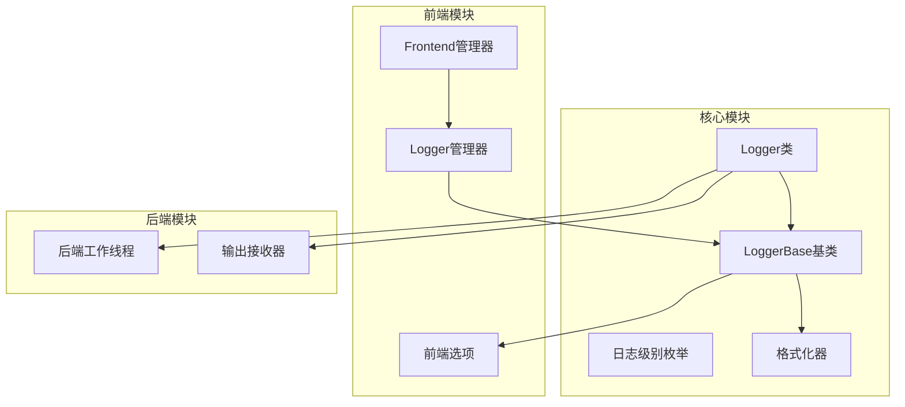
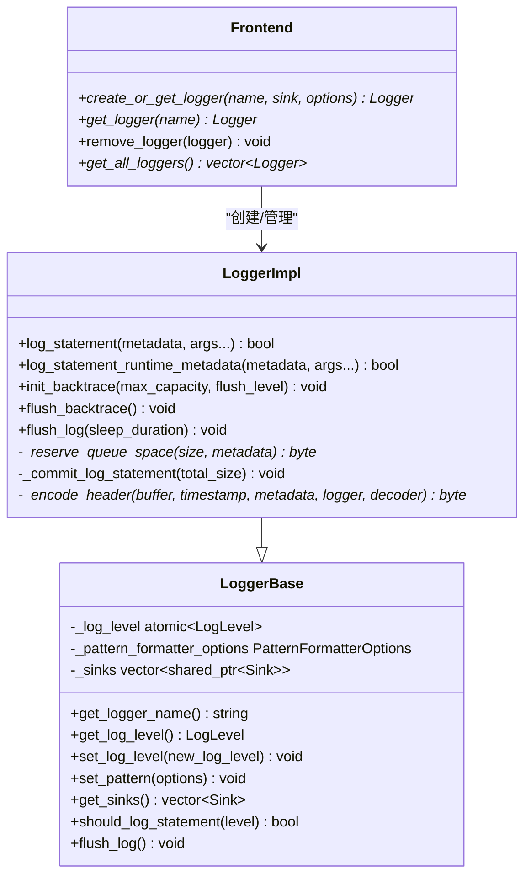
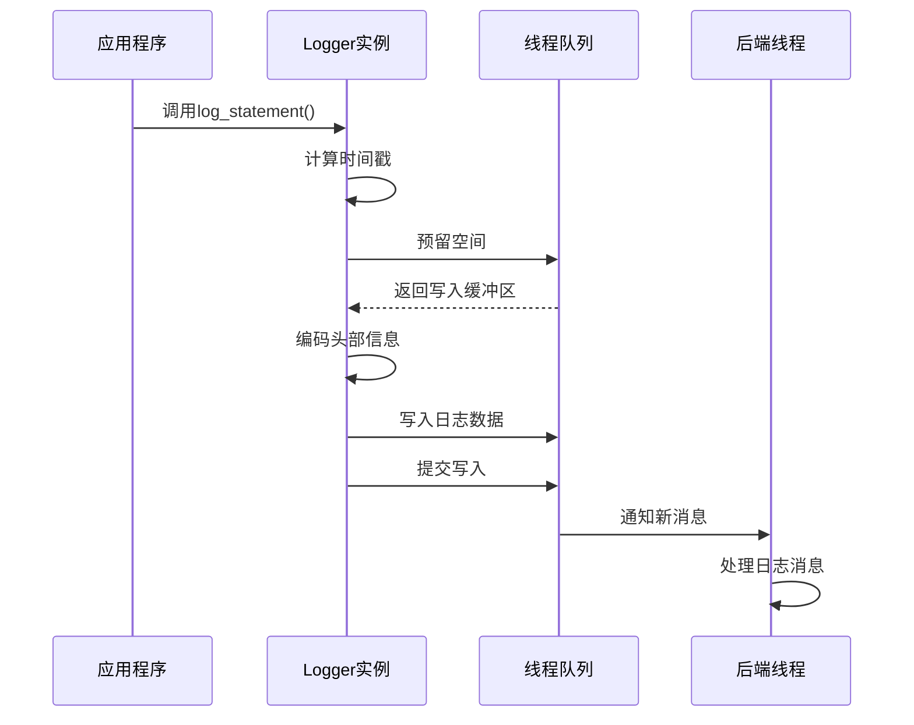
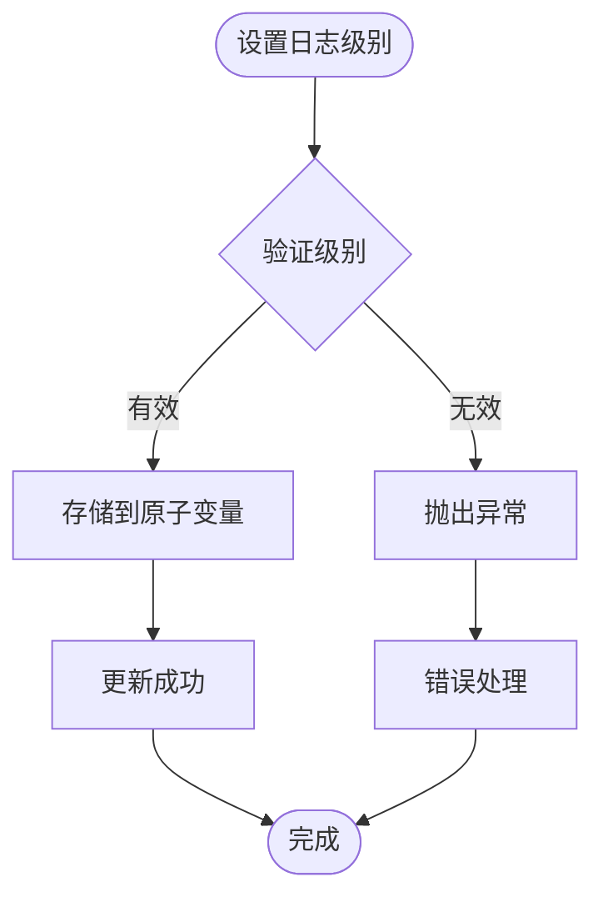
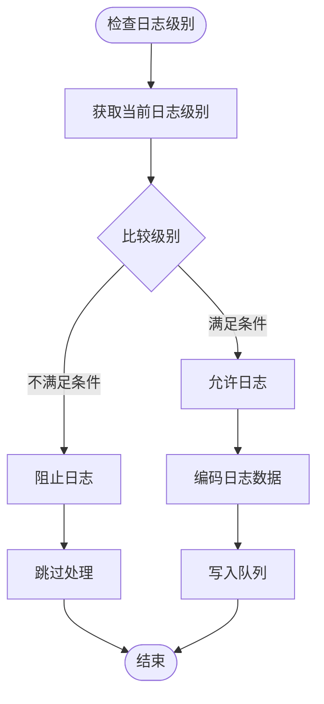
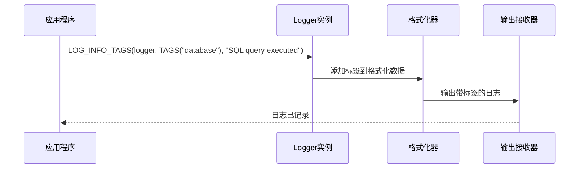
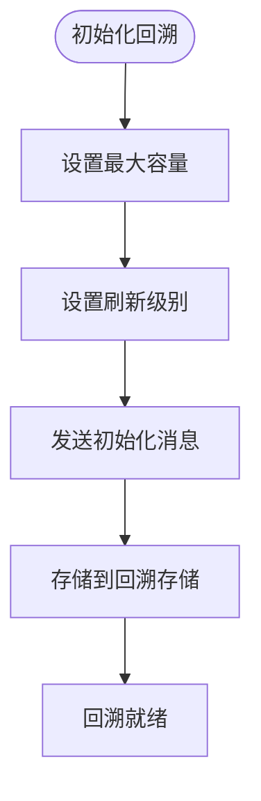
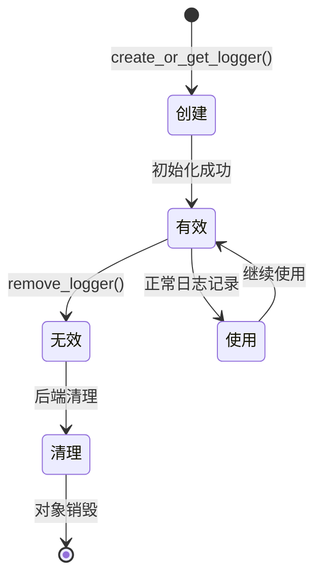
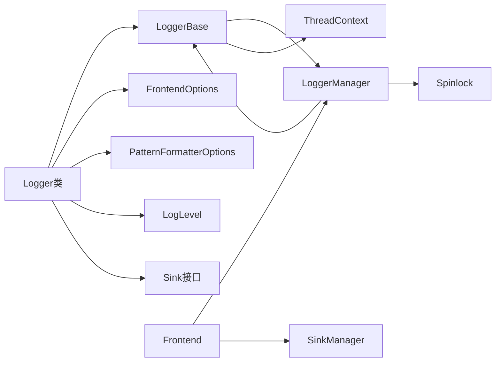
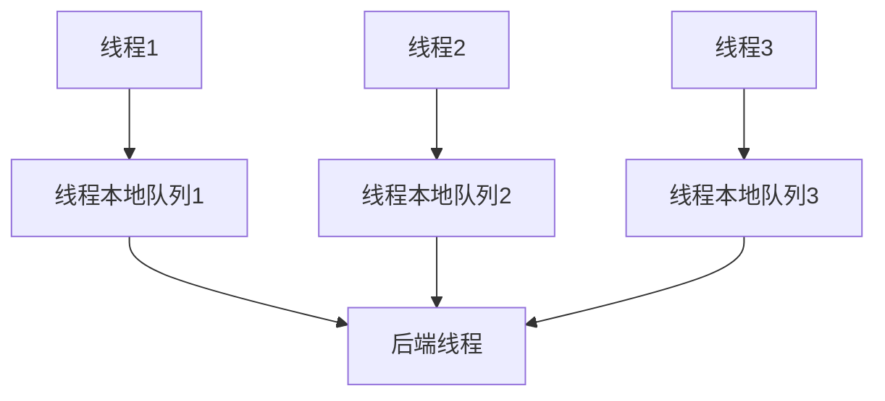

# Logger API 文档

<cite>
**本文档引用的文件**
- [Logger.h](file://include/quill/Logger.h)
- [LoggerBase.h](file://include/quill/core/LoggerBase.h)
- [LogLevel.h](file://include/quill/core/LogLevel.h)
- [Frontend.h](file://include/quill/Frontend.h)
- [PatternFormatterOptions.h](file://include/quill/core/PatternFormatterOptions.h)
- [FrontendOptions.h](file://include/quill/core/FrontendOptions.h)
- [LoggerManager.h](file://include/quill/core/LoggerManager.h)
- [console_logging.cpp](file://examples/console_logging.cpp)
- [LoggerTest.cpp](file://test/unit_tests/LoggerTest.cpp)
</cite>

## 目录
1. [简介](#简介)
2. [项目结构](#项目结构)
3. [核心组件](#核心组件)
4. [架构概览](#架构概览)
5. [详细组件分析](#详细组件分析)
6. [依赖关系分析](#依赖关系分析)
7. [性能考虑](#性能考虑)
8. [故障排除指南](#故障排除指南)
9. [结论](#结论)

## 简介

Logger类是Quill高性能日志库的核心组件，提供了线程安全的日志记录功能。该类支持多种日志级别、灵活的格式化选项、运行时动态调整日志级别以及多线程环境下的安全保证。

## 项目结构

Quill库采用模块化设计，Logger类位于核心模块中，通过模板化设计支持不同的前端选项配置。

**图表来源**
- [Logger.h:47-508](file://include/quill/Logger.h#L47-L508)
- [LoggerBase.h:35-210](file://include/quill/core/LoggerBase.h#L35-L210)
- [Frontend.h:32-373](file://include/quill/Frontend.h#L32-L373)

**章节来源**
- [Logger.h:1-508](file://include/quill/Logger.h#L1-L508)
- [Frontend.h:1-373](file://include/quill/Frontend.h#L1-L373)

## 核心组件

Logger类提供了完整的日志记录功能，包括：

### 主要特性
- **线程安全**: 支持多线程并发访问
- **高性能**: 使用无锁队列和优化的数据结构
- **灵活配置**: 支持多种日志级别和格式化选项
- **运行时调整**: 支持动态修改日志级别和格式化参数

### 关键接口
- `log()`: 核心日志记录方法
- `set_log_level()`: 设置日志级别
- `set_pattern()`: 配置日志格式
- `flush_log()`: 刷新缓冲区
- `init_backtrace()`: 初始化回溯功能
- `flush_backtrace()`: 刷新回溯消息

**章节来源**
- [Logger.h:64-136](file://include/quill/Logger.h#L64-L136)
- [LoggerBase.h:115-184](file://include/quill/core/LoggerBase.h#L115-L184)

## 架构概览

Logger类采用分层架构设计，确保了良好的可扩展性和性能。

**图表来源**
- [LoggerBase.h:35-210](file://include/quill/core/LoggerBase.h#L35-L210)
- [Logger.h:47-508](file://include/quill/Logger.h#L47-L508)
- [Frontend.h:137-215](file://include/quill/Frontend.h#L137-L215)

## 详细组件分析

### Logger类核心方法

#### 日志记录方法

Logger类提供了两种主要的日志记录方法：

1. **log_statement()**: 用于常规日志记录
2. **log_statement_runtime_metadata()**: 用于包含运行时元数据的日志记录

**图表来源**
- [Logger.h:75-136](file://include/quill/Logger.h#L75-L136)
- [Logger.h:155-260](file://include/quill/Logger.h#L155-L260)

#### 日志级别管理

Logger类支持以下日志级别（按严重程度递增）：
- TraceL3: 最详细级别
- TraceL2: 详细级别
- TraceL1: 中等详细级别
- Debug: 调试级别
- Info: 信息级别（默认）
- Notice: 通知级别
- Warning: 警告级别
- Error: 错误级别
- Critical: 严重错误级别
- Backtrace: 回溯专用级别
- None: 禁用所有日志

**章节来源**
- [LogLevel.h:22-35](file://include/quill/core/LogLevel.h#L22-L35)
- [LoggerBase.h:115-143](file://include/quill/core/LoggerBase.h#L115-L143)

### 日志级别设置和过滤机制

#### 运行时动态调整

Logger类支持在运行时动态调整日志级别：

**图表来源**
- [LoggerBase.h:135-143](file://include/quill/core/LoggerBase.h#L135-L143)
- [LogLevel.h:114-126](file://include/quill/core/LogLevel.h#L114-L126)

#### 条件日志检查

Logger类提供了高效的条件日志检查机制：

**图表来源**
- [LoggerBase.h:170-184](file://include/quill/core/LoggerBase.h#L170-L184)

### 格式化模式配置

#### PatternFormatterOptions配置

Logger类支持灵活的格式化配置：

| 属性 | 类型 | 默认值 | 描述 |
|------|------|--------|------|
| format_pattern | string | "%(time) [%(thread_id)] %(short_source_location:<28) LOG_%(log_level:<9) %(logger:<12) %(message)" | 主格式模式 |
| timestamp_pattern | string | "%H:%M:%S.%Qns" | 时间戳格式 |
| timestamp_timezone | Timezone | LocalTime | 时区设置 |
| add_metadata_to_multi_line_logs | bool | true | 多行日志是否添加元数据 |
| pattern_suffix | char | '\n' | 模式后缀字符 |

#### 格式化占位符

支持的格式化占位符：

- `%(time)`: 时间戳
- `%(file_name)`: 文件名
- `%(full_path)`: 完整路径
- `%(caller_function)`: 调用函数名
- `%(log_level)`: 日志级别文本
- `%(log_level_short_code)`: 简短级别代码
- `%(line_number)`: 行号
- `%(logger)`: Logger名称
- `%(message)`: 日志消息
- `%(thread_id)`: 线程ID
- `%(thread_name)`: 线程名称
- `%(process_id)`: 进程ID
- `%(source_location)`: 源位置
- `%(short_source_location)`: 简短源位置
- `%(tags)`: 自定义标签
- `%(named_args)`: 命名参数

**章节来源**
- [PatternFormatterOptions.h:23-170](file://include/quill/core/PatternFormatterOptions.h#L23-L170)

### 日志标签设置

Logger类支持日志标签功能，用于分类和过滤日志：

#### 标签使用示例

**图表来源**
- [console_logging.cpp:51-51](file://examples/console_logging.cpp#L51-L51)

### 回溯功能

Logger类提供了回溯功能，用于捕获和显示最近的日志消息：

#### 回溯初始化

**图表来源**
- [Logger.h:269-284](file://include/quill/Logger.h#L269-L284)

### 生命周期管理

#### Logger对象生命周期

**图表来源**
- [Frontend.h:137-215](file://include/quill/Frontend.h#L137-L215)
- [LoggerManager.h:201-219](file://include/quill/core/LoggerManager.h#L201-L219)

**章节来源**
- [Frontend.h:137-321](file://include/quill/Frontend.h#L137-L321)

## 依赖关系分析

Logger类的依赖关系图展示了其与其他组件的关系：

**图表来源**
- [Logger.h:9-18](file://include/quill/Logger.h#L9-L18)
- [LoggerBase.h:23-32](file://include/quill/core/LoggerBase.h#L23-L32)
- [Frontend.h:14-19](file://include/quill/Frontend.h#L14-L19)

**章节来源**
- [Logger.h:9-28](file://include/quill/Logger.h#L9-L28)
- [LoggerBase.h:23-32](file://include/quill/core/LoggerBase.h#L23-L32)

## 性能考虑

### 队列类型选择

Logger类支持多种队列类型以适应不同的性能需求：

| 队列类型 | 特性 | 适用场景 |
|----------|------|----------|
| UnboundedBlocking | 无界阻塞队列 | 需要保证消息不丢失的场景 |
| UnboundedDropping | 无界丢弃队列 | 高吞吐量但可接受丢弃的场景 |
| BoundedBlocking | 有界阻塞队列 | 内存受限且需要阻塞的场景 |
| BoundedDropping | 有界丢弃队列 | 高吞吐量且内存受限的场景 |

### 线程本地存储

Logger类使用线程本地存储来避免竞争条件：

**图表来源**
- [LoggerBase.h:190-190](file://include/quill/core/LoggerBase.h#L190-L190)

## 故障排除指南

### 常见问题和解决方案

#### 日志级别设置问题

**问题**: 设置日志级别后没有生效
**解决方案**: 
1. 确认使用的是正确的日志级别枚举
2. 检查是否正确调用了`set_log_level()`方法
3. 验证日志级别范围的有效性

#### 线程安全问题

**问题**: 多线程环境下出现数据竞争
**解决方案**:
1. 确保使用Frontend类提供的线程安全接口
2. 避免直接操作Logger对象的内部状态
3. 使用Frontend的生命周期管理功能

#### 内存泄漏问题

**问题**: Logger对象无法正确释放
**解决方案**:
1. 使用`Frontend::remove_logger()`或`Frontend::remove_logger_blocking()`进行清理
2. 确保在应用程序退出前正确移除所有Logger
3. 避免在多个线程中同时删除同一个Logger

**章节来源**
- [LoggerTest.cpp:44-47](file://test/unit_tests/LoggerTest.cpp#L44-L47)
- [Frontend.h:233-289](file://include/quill/Frontend.h#L233-L289)

## 结论

Logger类提供了功能完整、性能优异的日志记录解决方案。其设计特点包括：

1. **高性能**: 通过无锁队列和优化的数据结构实现高吞吐量
2. **线程安全**: 完善的同步机制确保多线程环境下的安全性
3. **灵活性**: 支持多种日志级别、格式化选项和运行时配置
4. **易用性**: 简洁的API设计和丰富的示例代码

通过合理配置和使用，Logger类能够满足从简单应用到高性能系统的各种日志需求。