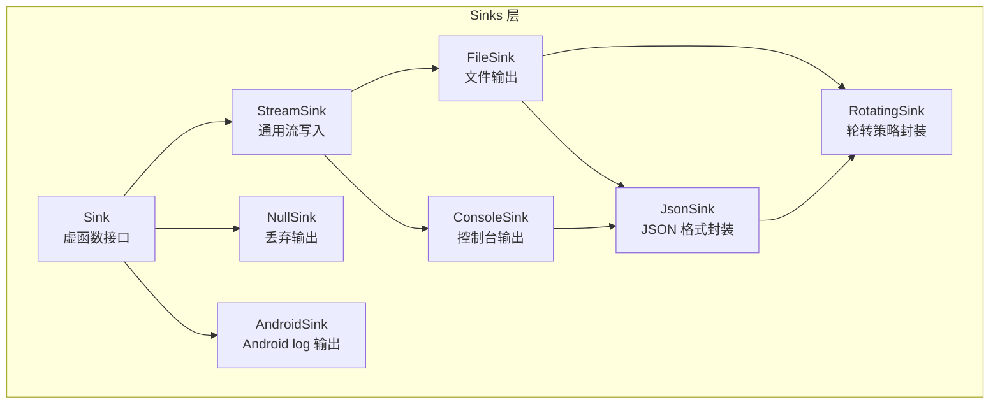
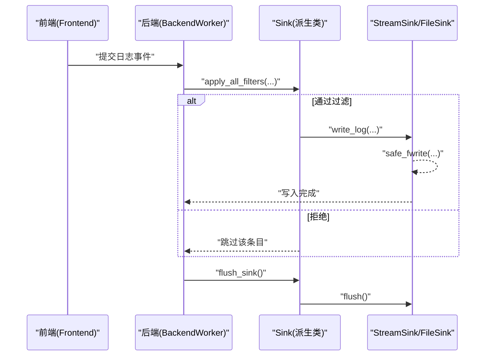
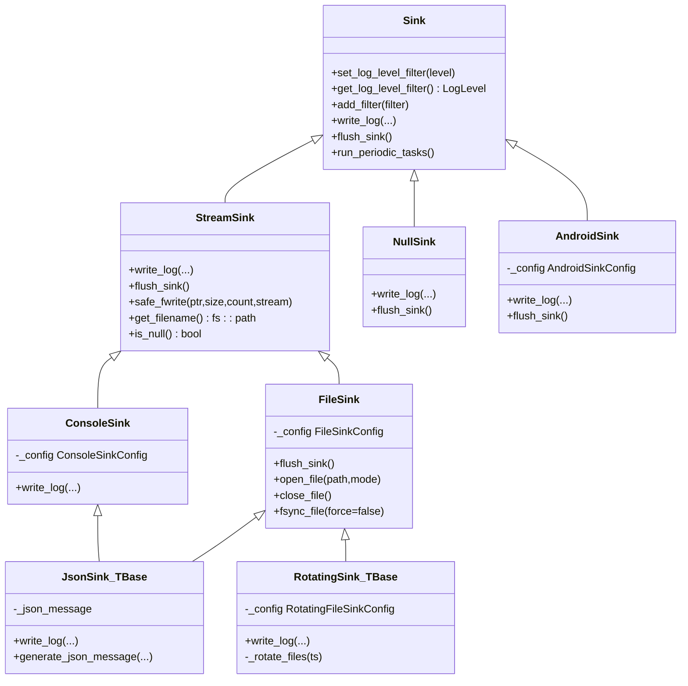
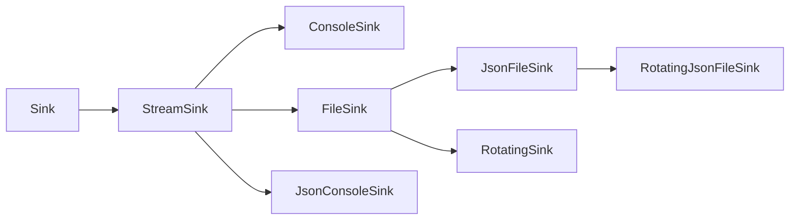

# Sinks API

<cite>
**本文引用的文件**
- [Sink.h](file://include/quill/sinks/Sink.h)
- [StreamSink.h](file://include/quill/sinks/StreamSink.h)
- [ConsoleSink.h](file://include/quill/sinks/ConsoleSink.h)
- [FileSink.h](file://include/quill/sinks/FileSink.h)
- [JsonSink.h](file://include/quill/sinks/JsonSink.h)
- [RotatingSink.h](file://include/quill/sinks/RotatingSink.h)
- [RotatingFileSink.h](file://include/quill/sinks/RotatingFileSink.h)
- [RotatingJsonFileSink.h](file://include/quill/sinks/RotatingJsonFileSink.h)
- [NullSink.h](file://include/quill/sinks/NullSink.h)
- [AndroidSink.h](file://include/quill/sinks/AndroidSink.h)
- [console_logging.cpp](file://examples/console_logging.cpp)
- [file_logging.cpp](file://examples/file_logging.cpp)
- [json_console_logging.cpp](file://examples/json_console_logging.cpp)
- [rotating_file_logging.cpp](file://examples/rotating_file_logging.cpp)
</cite>

## 目录
1. [简介](#简介)
2. [项目结构](#项目结构)
3. [核心组件](#核心组件)
4. [架构总览](#架构总览)
5. [详细组件分析](#详细组件分析)
6. [依赖关系分析](#依赖关系分析)
7. [性能考量](#性能考量)
8. [故障排查指南](#故障排查指南)
9. [结论](#结论)
10. [附录](#附录)

## 简介
本文件为 Quill 日志库的 Sinks 子系统提供完整 API 文档与实践指南。内容覆盖：
- Sink 基类的虚函数接口与生命周期管理
- 内置 Sink 的构造参数、配置项与使用方式（ConsoleSink、FileSink、JsonSink、RotatingFileSink、RotatingJsonFileSink、NullSink、AndroidSink）
- 自定义 Sink 的接口规范与实现步骤
- 组合使用、格式化配置、性能优化与并发安全机制

## 项目结构
Sinks 子系统位于 include/quill/sinks/，核心层次如下：
- 基类层：Sink、StreamSink
- 具体输出层：ConsoleSink、FileSink、JsonSink、RotatingSink（模板）、NullSink、AndroidSink
- 类型别名：RotatingFileSink、RotatingJsonFileSink

图表来源
- [Sink.h:40-218](file://include/quill/sinks/Sink.h#L40-L218)
- [StreamSink.h:67-314](file://include/quill/sinks/StreamSink.h#L67-L314)
- [ConsoleSink.h:331-412](file://include/quill/sinks/ConsoleSink.h#L331-L412)
- [FileSink.h:226-527](file://include/quill/sinks/FileSink.h#L226-L527)
- [JsonSink.h:29-165](file://include/quill/sinks/JsonSink.h#L29-L165)
- [RotatingSink.h:262-800](file://include/quill/sinks/RotatingSink.h#L262-L800)
- [NullSink.h:24-40](file://include/quill/sinks/NullSink.h#L24-L40)
- [AndroidSink.h:88-128](file://include/quill/sinks/AndroidSink.h#L88-L128)

章节来源
- [Sink.h:40-218](file://include/quill/sinks/Sink.h#L40-L218)
- [StreamSink.h:67-314](file://include/quill/sinks/StreamSink.h#L67-L314)

## 核心组件
本节聚焦 Sink 基类的虚函数接口与通用能力。

- 虚函数接口
  - write_log(...)：由后端线程调用，写入已格式化的日志记录
  - flush_sink()：刷新底层输出序列，确保数据落盘或可见
  - run_periodic_tasks()：后端线程周期性执行的钩子（默认空实现）

- 过滤与日志级别
  - set_log_level_filter()/get_log_level_filter()：设置/获取 Sink 级别的日志级别阈值
  - add_filter()：添加过滤器；apply_all_filters() 在内部应用全局过滤器集合

- 模式格式化覆盖
  - 构造时可传入 PatternFormatterOptions，覆盖默认格式化器

- 线程安全
  - 日志级别与过滤器更新采用原子与自旋锁保护，保证多线程安全

章节来源
- [Sink.h:65-78](file://include/quill/sinks/Sink.h#L65-L78)
- [Sink.h:85-104](file://include/quill/sinks/Sink.h#L85-L104)
- [Sink.h:123-133](file://include/quill/sinks/Sink.h#L123-L133)
- [Sink.h:156-197](file://include/quill/sinks/Sink.h#L156-L197)

## 架构总览
下图展示从前端到后端再到具体 Sink 的调用链路与职责分工：

图表来源
- [Sink.h:156-197](file://include/quill/sinks/Sink.h#L156-L197)
- [StreamSink.h:149-193](file://include/quill/sinks/StreamSink.h#L149-L193)
- [FileSink.h:261-288](file://include/quill/sinks/FileSink.h#L261-L288)

## 详细组件分析

### ConsoleSink 控制台输出
- 功能要点
  - 支持 stdout/stderr 输出
  - 可配置颜色模式（Always/Automatic/Never）与每级别颜色映射
  - 可覆盖该 Sink 的 PatternFormatterOptions
- 关键配置
  - ConsoleSinkConfig::set_stream("stdout"|"stderr")
  - ConsoleSinkConfig::set_colour_mode(...)
  - ConsoleSinkConfig::set_colours(...)
  - ConsoleSinkConfig::set_override_pattern_formatter_options(...)
- 使用建议
  - 开发调试阶段启用颜色；生产环境可关闭以避免终端兼容问题
  - 若仅输出 JSON，建议将格式化器设为空，减少额外开销

章节来源
- [ConsoleSink.h:44-328](file://include/quill/sinks/ConsoleSink.h#L44-L328)
- [ConsoleSink.h:331-412](file://include/quill/sinks/ConsoleSink.h#L331-L412)

### FileSink 文件输出
- 功能要点
  - 将日志写入文件，支持自定义缓冲区大小、fsync 策略与最小 fsync 间隔
  - 支持在启动时对文件名追加日期/时间戳
  - 文件打开失败具备重试机制
- 关键配置
  - FileSinkConfig::set_open_mode(...)
  - FileSinkConfig::set_filename_append_option(...)
  - FileSinkConfig::set_timezone(...)
  - FileSinkConfig::set_write_buffer_size(...)
  - FileSinkConfig::set_fsync_enabled(...)
  - FileSinkConfig::set_minimum_fsync_interval(...)
  - FileSinkConfig::set_override_pattern_formatter_options(...)
- flush 行为
  - flush_sink() 会先调用基础 flush，再按需 fsync
  - 若文件被外部删除，flush 后自动重新打开新文件

章节来源
- [FileSink.h:64-220](file://include/quill/sinks/FileSink.h#L64-L220)
- [FileSink.h:226-527](file://include/quill/sinks/FileSink.h#L226-L527)

### JsonSink JSON 输出
- 设计模式
  - 通过模板参数 TBase（如 FileSink 或 StreamSink）复用底层写入逻辑
  - 默认生成包含时间戳、源位置、线程、日志器名、级别与消息的 JSON 结构
- 关键点
  - write_log() 会清理换行符，确保单行 JSON
  - generate_json_message() 可被派生类覆盖以定制字段
- 类型别名
  - JsonFileSink：文件 JSON 输出
  - JsonConsoleSink：控制台 JSON 输出

章节来源
- [JsonSink.h:29-165](file://include/quill/sinks/JsonSink.h#L29-L165)

### RotatingSink 轮转策略
- 设计目标
  - 在文件大小或时间达到阈值时进行轮转，维护多个备份文件
- 配置要点（RotatingFileSinkConfig）
  - set_rotation_max_file_size(...)
  - set_rotation_frequency_and_interval('M'|'H', interval)
  - set_rotation_time_daily("HH:MM")
  - set_max_backup_files(...)
  - set_overwrite_rolled_files(...)
  - set_remove_old_files(...)
  - set_rotation_naming_scheme(Index|Date|DateAndTime)
  - set_rotation_on_creation(...)
- 行为细节
  - 写入前检查时间/大小触发条件，必要时调用 _rotate_files()
  - 支持在 w 模式下清理旧文件，或在 a 模式下恢复索引
  - 轮转前强制 flush 与 fsync，避免数据丢失

章节来源
- [RotatingSink.h:39-257](file://include/quill/sinks/RotatingSink.h#L39-L257)
- [RotatingSink.h:262-800](file://include/quill/sinks/RotatingSink.h#L262-L800)

### 类型别名
- RotatingFileSink：= RotatingSink<FileSink>
- RotatingJsonFileSink：= RotatingSink<JsonFileSink>

章节来源
- [RotatingFileSink.h:13-15](file://include/quill/sinks/RotatingFileSink.h#L13-L15)
- [RotatingJsonFileSink.h:14-16](file://include/quill/sinks/RotatingJsonFileSink.h#L14-L16)

### NullSink 与 AndroidSink
- NullSink
  - 无输出的占位 Sink，适合禁用某条路径的日志
- AndroidSink
  - 将日志写入 Android logcat，支持标签、消息格式化开关与级别映射

章节来源
- [NullSink.h:24-40](file://include/quill/sinks/NullSink.h#L24-L40)
- [AndroidSink.h:88-128](file://include/quill/sinks/AndroidSink.h#L88-L128)

### 组件关系类图

图表来源
- [Sink.h:40-218](file://include/quill/sinks/Sink.h#L40-L218)
- [StreamSink.h:67-314](file://include/quill/sinks/StreamSink.h#L67-L314)
- [ConsoleSink.h:331-412](file://include/quill/sinks/ConsoleSink.h#L331-L412)
- [FileSink.h:226-527](file://include/quill/sinks/FileSink.h#L226-L527)
- [JsonSink.h:29-165](file://include/quill/sinks/JsonSink.h#L29-L165)
- [RotatingSink.h:262-800](file://include/quill/sinks/RotatingSink.h#L262-L800)
- [NullSink.h:24-40](file://include/quill/sinks/NullSink.h#L24-L40)
- [AndroidSink.h:88-128](file://include/quill/sinks/AndroidSink.h#L88-L128)

## 依赖关系分析
- 继承与组合
  - 所有具体 Sink 均继承自 Sink；StreamSink 提供通用流写入能力
  - JsonSink 通过模板参数复用 FileSink/StreamSink 的写入路径
  - RotatingSink 通过模板参数复用 FileSink 的轮转能力
- 外部依赖
  - 文件系统与时间工具：fs::path、gmtime/localtime、strftime
  - 平台相关：Windows HANDLE/WriteFile、Unix O_CLOEXEC、fsync
- 错误处理
  - 大量使用 QUILL_THROW 抛出 QuillError，统一错误信息

图表来源
- [ConsoleSink.h:331-412](file://include/quill/sinks/ConsoleSink.h#L331-L412)
- [FileSink.h:226-527](file://include/quill/sinks/FileSink.h#L226-L527)
- [JsonSink.h:140-165](file://include/quill/sinks/JsonSink.h#L140-L165)
- [RotatingSink.h:262-800](file://include/quill/sinks/RotatingSink.h#L262-L800)
- [RotatingFileSink.h:13-15](file://include/quill/sinks/RotatingFileSink.h#L13-L15)
- [RotatingJsonFileSink.h:14-16](file://include/quill/sinks/RotatingJsonFileSink.h#L14-L16)

## 性能考量
- 缓冲与刷盘
  - FileSink 支持用户自定义 fwrite 缓冲区大小，默认 64KB；可通过 set_write_buffer_size(...) 调整
  - fsync 策略与最小间隔：set_fsync_enabled(...) 与 set_minimum_fsync_interval(...)，平衡一致性与磁盘寿命
- 写入路径
  - StreamSink::safe_fwrite() 在 Windows 上优先使用 WriteFile 写控制台，避免文本模式换行问题
- 过滤与格式化
  - Sink 级别日志级别过滤与过滤器链在后端线程中评估，避免不必要的格式化
  - 对于纯 JSON 场景，建议将 PatternFormatterOptions 的格式串置空，减少格式化成本
- 轮转策略
  - RotatingSink 在轮转前强制 flush/flush+fsync，确保数据完整性；合理设置最大文件大小与命名方案，降低频繁轮转带来的 IO 压力

章节来源
- [FileSink.h:146-173](file://include/quill/sinks/FileSink.h#L146-L173)
- [StreamSink.h:214-278](file://include/quill/sinks/StreamSink.h#L214-L278)
- [JsonSink.h:104-129](file://include/quill/sinks/JsonSink.h#L104-L129)
- [RotatingSink.h:396-487](file://include/quill/sinks/RotatingSink.h#L396-L487)

## 故障排查指南
- 文件打开失败
  - FileSink 在 fopen 失败时抛出 QuillError，并包含 errno 与 strerror 信息；可在调用栈中定位具体路径与模式
- 轮转异常
  - 轮转过程中若遇到文件被占用（如杀软扫描），RotatingSink 会在重命名时短暂等待并重试
- 控制台颜色无效
  - ConsoleSinkConfig::set_colour_mode(...) 与终端类型检测可能影响颜色输出；可切换为 Never 或 Always 排查
- JSON 消息换行
  - JsonSink 会自动去除换行符；若仍出现跨行 JSON，请确认上游消息格式

章节来源
- [FileSink.h:420-423](file://include/quill/sinks/FileSink.h#L420-L423)
- [RotatingSink.h:687-699](file://include/quill/sinks/RotatingSink.h#L687-L699)
- [ConsoleSink.h:231-250](file://include/quill/sinks/ConsoleSink.h#L231-L250)
- [JsonSink.h:66-80](file://include/quill/sinks/JsonSink.h#L66-L80)

## 结论
Quill 的 Sinks 子系统以 Sink 为抽象基类，结合 StreamSink 的通用写入能力与模板化的 JsonSink/RotatingSink，提供了从控制台到文件、从普通格式到 JSON、从静态文件到轮转策略的完整覆盖。通过 PatternFormatterOptions、过滤器与 fsync/缓冲策略，开发者可以在不同场景下取得兼顾性能与可靠性的最佳实践。

## 附录

### API 速查表（核心虚函数）
- Sink
  - set_log_level_filter(level)
  - get_log_level_filter()
  - add_filter(filter)
  - write_log(...)
  - flush_sink()
  - run_periodic_tasks()

章节来源
- [Sink.h:65-104](file://include/quill/sinks/Sink.h#L65-L104)
- [Sink.h:123-141](file://include/quill/sinks/Sink.h#L123-L141)

### 示例参考
- 控制台日志
  - [console_logging.cpp:20-72](file://examples/console_logging.cpp#L20-L72)
- 文件日志
  - [file_logging.cpp:36-73](file://examples/file_logging.cpp#L36-L73)
- JSON 控制台日志
  - [json_console_logging.cpp:17-54](file://examples/json_console_logging.cpp#L17-L54)
- 轮转文件日志
  - [rotating_file_logging.cpp:21-45](file://examples/rotating_file_logging.cpp#L21-L45)