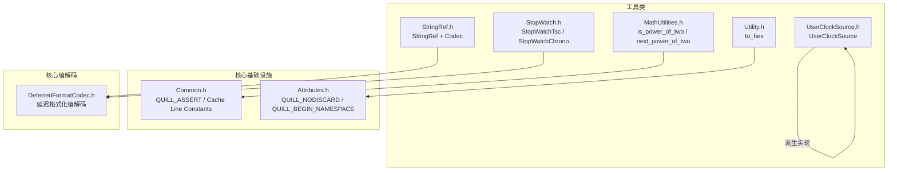
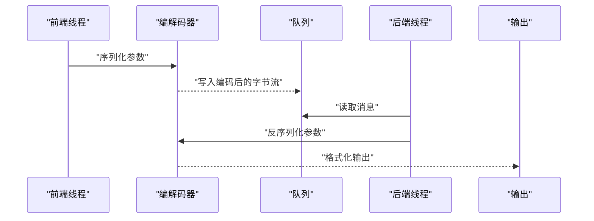
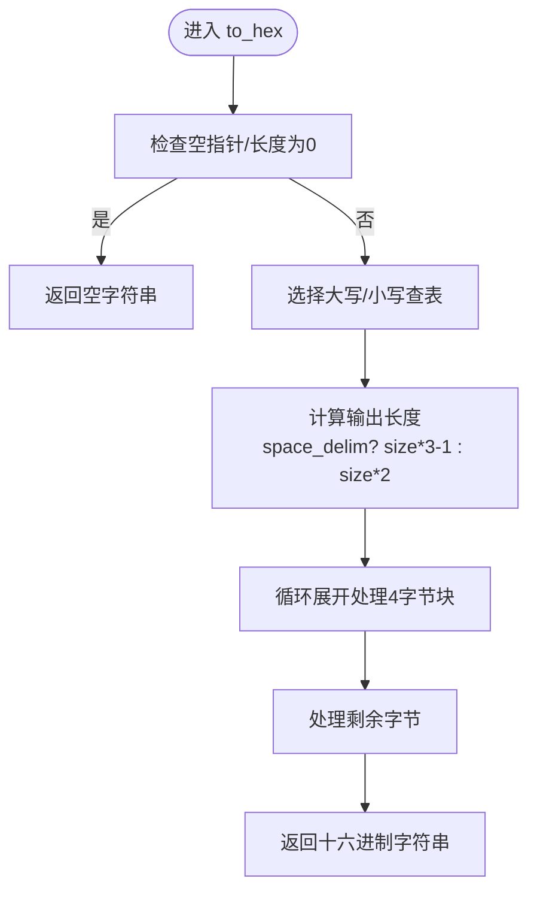
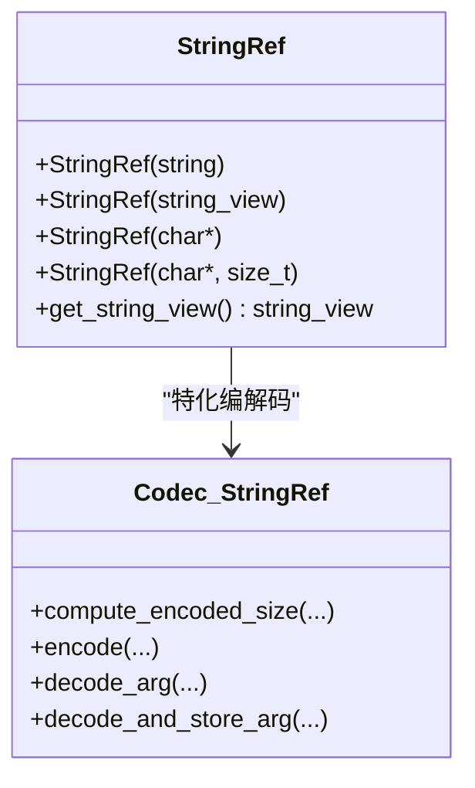
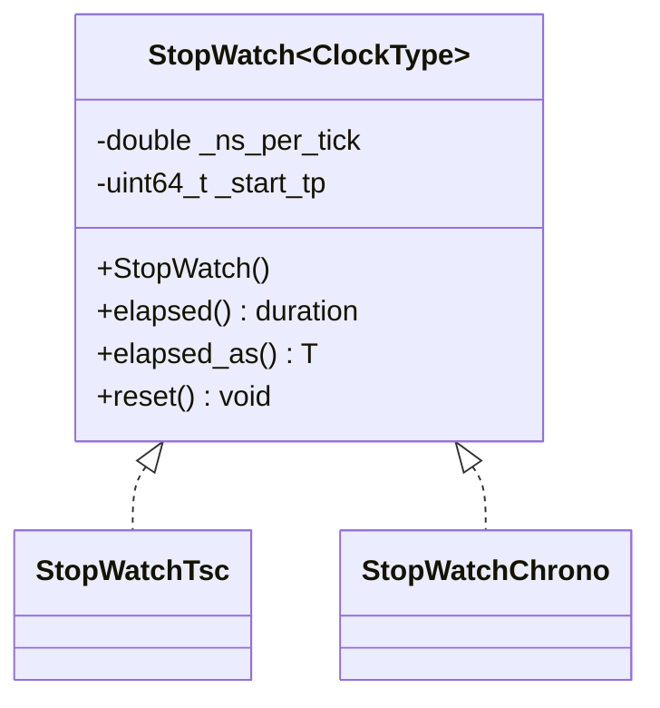
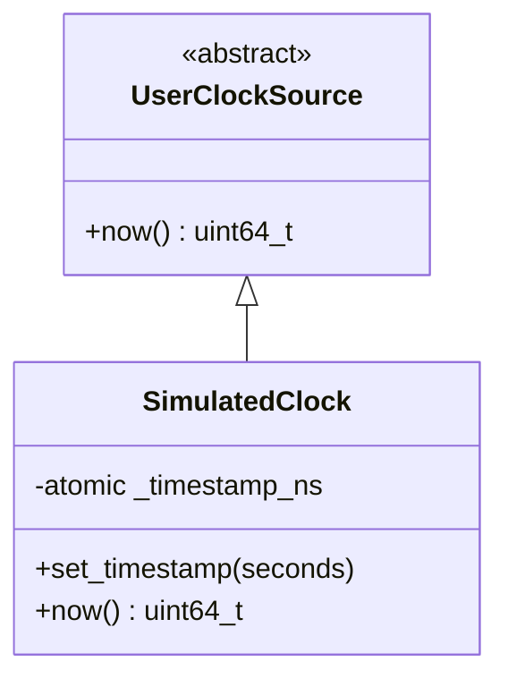
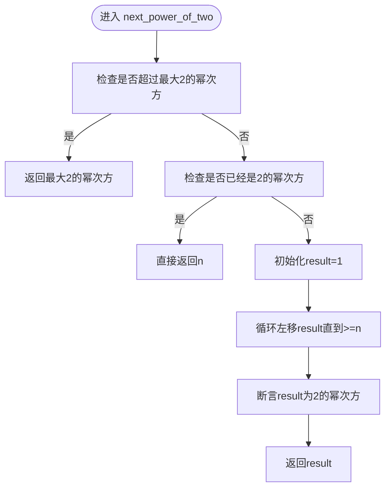
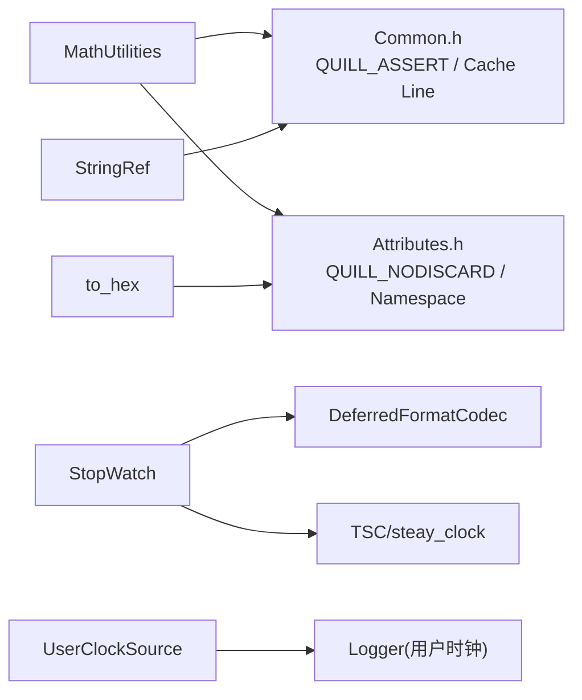

# 工具类API

<cite>
**本文引用的文件列表**
- [Utility.h](file://include/quill/Utility.h)
- [StringRef.h](file://include/quill/StringRef.h)
- [StopWatch.h](file://include/quill/StopWatch.h)
- [UserClockSource.h](file://include/quill/UserClockSource.h)
- [MathUtilities.h](file://include/quill/core/MathUtilities.h)
- [Common.h](file://include/quill/core/Common.h)
- [Attributes.h](file://include/quill/core/Attributes.h)
- [UtilityTest.cpp](file://test/unit_tests/UtilityTest.cpp)
- [StopWatchTest.cpp](file://test/unit_tests/StopWatchTest.cpp)
- [StringRefTest.cpp](file://test/integration_tests/StringRefTest.cpp)
- [MathUtilitiesTest.cpp](file://test/unit_tests/MathUtilitiesTest.cpp)
- [stopwatch.cpp](file://examples/stopwatch.cpp)
- [user_clock_source.cpp](file://examples/user_clock_source.cpp)
- [Codec.h](file://include/quill/core/Codec.h)
- [DeferredFormatCodec.h](file://include/quill/DeferredFormatCodec.h)
</cite>

## 更新摘要
**变更内容**
- 新增数学工具类MathUtilities模块，提供幂运算检测和对数计算功能
- MathUtilities.h现在正确包含Common.h，增强了数学工具函数的可靠性
- 更新工具类API文档中关于数学工具和公共基础设施依赖关系的说明
- 添加MathUtilities的详细使用指南和最佳实践

## 目录
1. [简介](#简介)
2. [项目结构与定位](#项目结构与定位)
3. [核心组件总览](#核心组件总览)
4. [架构概览](#架构概览)
5. [详细组件分析](#详细组件分析)
6. [数学工具类详解](#数学工具类详解)
7. [依赖关系分析](#依赖关系分析)
8. [性能考量](#性能考量)
9. [故障排查指南](#故障排查指南)
10. [结论](#结论)
11. [附录：使用示例与最佳实践](#附录使用示例与最佳实践)

## 简介
本文件为Quill日志库中的工具类API文档，聚焦以下实用工具：
- 字符串处理：to_hex（十六进制格式化）
- 数学工具：MathUtilities（幂运算检测、对数计算）
- 时间测量：StopWatch（高精度计时器，支持TSC与系统时钟）
- 用户时钟源：UserClockSource（自定义时钟接口）
- 零拷贝字符串引用：StringRef（避免字符串复制，提升日志热路径性能）

文档将从设计目的、接口说明、使用示例、性能优势、在日志系统中的应用场景与最佳实践等方面进行系统阐述，并辅以可视化图示帮助理解。

## 项目结构与定位
这些工具类位于include/quill目录下，分别承担不同层面的辅助职责：
- Utility.h：提供通用工具函数（如to_hex）
- MathUtilities.h：提供数学工具函数（幂运算检测、对数计算）
- StringRef.h：零拷贝字符串包装与编解码
- StopWatch.h：高性能计时器，支持TSC与系统时钟两种模式
- UserClockSource.h：用户自定义时钟源基类，用于模拟或外部时间源

**图表来源**
- [Utility.h:18-118](file://include/quill/Utility.h#L18-L118)
- [MathUtilities.h:1-73](file://include/quill/core/MathUtilities.h#L1-L73)
- [StringRef.h:32-85](file://include/quill/StringRef.h#L32-L85)
- [StopWatch.h:44-124](file://include/quill/StopWatch.h#L44-L124)
- [UserClockSource.h:25-39](file://include/quill/UserClockSource.h#L25-L39)
- [Common.h:119-183](file://include/quill/core/Common.h#L119-L183)
- [Attributes.h:9-18](file://include/quill/core/Attributes.h#L9-L18)

**章节来源**
- [Utility.h:18-118](file://include/quill/Utility.h#L18-L118)
- [MathUtilities.h:1-73](file://include/quill/core/MathUtilities.h#L1-L73)
- [StringRef.h:32-85](file://include/quill/StringRef.h#L32-L85)
- [StopWatch.h:44-124](file://include/quill/StopWatch.h#L44-L124)
- [UserClockSource.h:25-39](file://include/quill/UserClockSource.h#L25-L39)

## 核心组件总览
- to_hex：将任意字节缓冲区转换为十六进制字符串，支持大小写与空格分隔控制，内部采用查表+循环展开优化，适合二进制数据日志与调试。
- MathUtilities：提供幂运算检测和对数计算功能，包含is_power_of_two、max_power_of_two、next_power_of_two等函数，增强数学运算的可靠性和性能。
- StringRef：将字符串参数标记为"按引用传递"，避免复制，配合编解码器在热路径上零拷贝传输。
- StopWatch：封装起始时间点，提供elapsed/elapsed_as/reset等接口；支持TSC（高分辨率）与系统时钟（更稳定）两种模式。
- UserClockSource：抽象基类，派生类需实现now()返回纳秒级时间戳，适用于仿真、回放或统一时间源场景。

**章节来源**
- [Utility.h:31-118](file://include/quill/Utility.h#L31-L118)
- [MathUtilities.h:17-70](file://include/quill/core/MathUtilities.h#L17-L70)
- [StringRef.h:32-85](file://include/quill/StringRef.h#L32-L85)
- [StopWatch.h:44-124](file://include/quill/StopWatch.h#L44-L124)
- [UserClockSource.h:25-39](file://include/quill/UserClockSource.h#L25-L39)

## 架构概览
工具类与日志系统的交互路径如下：
- 日志宏在前端线程捕获参数，对可直接编码类型走快速路径；对复杂类型（如StopWatch、StringRef、MathUtilities）通过编解码器序列化到队列。
- 后端线程消费消息，格式化输出；StopWatch在格式化阶段以秒为单位输出浮点数；StringRef在后端解析为string_view并安全输出；MathUtilities函数在编译时计算结果，零运行时开销。

**图表来源**
- [Codec.h:144-200](file://include/quill/core/Codec.h#L144-L200)
- [DeferredFormatCodec.h:90-181](file://include/quill/DeferredFormatCodec.h#L90-L181)
- [StopWatch.h:128-143](file://include/quill/StopWatch.h#L128-L143)
- [StringRef.h:48-85](file://include/quill/StringRef.h#L48-L85)

## 详细组件分析

### to_hex（字符串处理）
- 设计目的：将任意字节缓冲区转为十六进制字符串，便于二进制数据日志、网络协议调试、内存转储等场景。
- 关键特性：
  - 模板化接口，仅接受字节大小元素（静态断言保证）
  - 查表法生成十六进制字符，避免除法取模开销
  - 循环展开（unroll_count=4）减少分支与迭代次数
  - 支持大缓冲区与边界情况（空指针、零长度、单字节、特殊值）
- 性能优势：
  - O(n)线性时间，常数因子小
  - 内存连续写入，局部性好
  - 可选空格分隔，兼顾可读性与紧凑性
- 使用建议：
  - 大量二进制数据打印时优先使用
  - 注意输入缓冲区生命周期，避免悬垂指针

**图表来源**
- [Utility.h:31-118](file://include/quill/Utility.h#L31-L118)

**章节来源**
- [Utility.h:31-118](file://include/quill/Utility.h#L31-L118)
- [UtilityTest.cpp:10-401](file://test/unit_tests/UtilityTest.cpp#L10-L401)

### StringRef（零拷贝字符串引用）
- 设计目的：在不复制字符串的前提下传递给日志系统，降低热路径上的内存分配与拷贝成本。
- 关键特性：
  - 构造函数支持std::string、std::string_view、C风格字符串及带长度的C字符串
  - 编解码器将指针与长度打包，后端解析为string_view安全输出
  - 默认所有字符串都会复制，使用StringRef显式声明"按引用传递"
- 性能优势：
  - 避免std::string构造与拷贝
  - 减少队列中字节流大小
  - 对超长日志消息尤为显著
- 使用注意事项：
  - 被包装的字符串必须在日志消息被后端解析期间保持有效
  - 不要修改已传入的字符串内容
  - 与格式化器配合时，确保string_view生命周期覆盖格式化完成

**图表来源**
- [StringRef.h:32-85](file://include/quill/StringRef.h#L32-L85)
- [Codec.h:144-200](file://include/quill/core/Codec.h#L144-L200)

**章节来源**
- [StringRef.h:32-85](file://include/quill/StringRef.h#L32-L85)
- [StringRefTest.cpp:49-57](file://test/integration_tests/StringRefTest.cpp#L49-L57)

### StopWatch（计时器）
- 设计目的：在日志中记录相对耗时，支持TSC（高分辨率）与系统时钟（更稳定）两种模式。
- 关键特性：
  - 模板化实现，通过ClockType区分Tsc/System
  - 提供elapsed()/elapsed_as<T>()返回指定时长类型
  - reset()重置起点
  - 与格式化器集成，可直接在日志中输出秒数
- 性能与适用场景：
  - TSC模式：低开销、高分辨率，适合短任务测量；多核环境下可能短暂非单调
  - System模式：更稳定、单调，适合需要严格顺序的场景
- 使用建议：
  - 在高频日志中使用TSC模式
  - 需要跨线程/跨CPU一致性时使用System模式

**图表来源**
- [StopWatch.h:44-124](file://include/quill/StopWatch.h#L44-L124)

**章节来源**
- [StopWatch.h:44-124](file://include/quill/StopWatch.h#L44-L124)
- [StopWatchTest.cpp:8-56](file://test/unit_tests/StopWatchTest.cpp#L8-L56)
- [stopwatch.cpp:24-50](file://examples/stopwatch.cpp#L24-L50)

### UserClockSource（自定义时钟源）
- 设计目的：允许用户提供自定义时间源，典型用于仿真、回放或统一时间基准。
- 关键特性：
  - 抽象基类，派生类实现now()返回纳秒级时间戳
  - 线程安全要求：若Logger跨线程使用，派生类需保证线程安全
- 应用场景：
  - 仿真系统：按固定步进推进时间
  - 回放系统：按事件发生时间回放日志
  - 多系统对齐：统一外部时间源

**图表来源**
- [UserClockSource.h:25-39](file://include/quill/UserClockSource.h#L25-L39)
- [user_clock_source.cpp:23-47](file://examples/user_clock_source.cpp#L23-L47)

**章节来源**
- [UserClockSource.h:25-39](file://include/quill/UserClockSource.h#L25-L39)
- [user_clock_source.cpp:23-47](file://examples/user_clock_source.cpp#L23-L47)

## 数学工具类详解

### MathUtilities（数学工具函数）
- 设计目的：提供高效的数学运算工具函数，特别是在日志系统中需要进行幂运算检测和对数计算的场景。
- 关键特性：
  - is_power_of_two：检测数字是否为2的幂次方，使用位运算实现O(1)时间复杂度
  - max_power_of_two：计算类型的最大2的幂次方，利用std::numeric_limits获取边界值
  - next_power_of_two：将数字向上舍入到下一个2的幂次方，包含溢出保护和断言验证
  - 所有函数均为constexpr，可在编译时计算结果，零运行时开销
  - 依赖Common.h中的QUILL_ASSERT进行运行时断言验证
- 性能优势：
  - 位运算实现，避免昂贵的除法和取模操作
  - constexpr函数在编译时求值，运行时无额外开销
  - 断言仅在调试模式下启用，发布版本无性能影响
- 使用场景：
  - 日志缓冲区大小调整和内存对齐计算
  - 队列容量动态调整和哈希表大小计算
  - 性能关键路径中的幂运算检测

**图表来源**
- [MathUtilities.h:45-70](file://include/quill/core/MathUtilities.h#L45-L70)

**章节来源**
- [MathUtilities.h:17-70](file://include/quill/core/MathUtilities.h#L17-L70)
- [MathUtilitiesTest.cpp:11-81](file://test/unit_tests/MathUtilitiesTest.cpp#L11-L81)

## 依赖关系分析
- MathUtilities依赖Common.h提供QUILL_ASSERT断言机制和命名空间定义，增强了数学工具函数的可靠性。
- StringRef依赖编解码框架（Codec与DynamicFormatArgStore），在序列化时仅写入指针与长度，在反序列化时恢复为string_view。
- StopWatch依赖格式化编解码（DeferredFormatCodec）与底层时间源（TSC或steady_clock），并在格式化器中以double秒输出。
- to_hex为独立工具函数，无运行时依赖，但被单元测试覆盖广泛。
- UserClockSource作为抽象接口，与Logger创建流程结合，影响日志时间戳来源。
- 所有工具类都依赖Attributes.h提供的命名空间包装和编译器兼容性宏。

**图表来源**
- [MathUtilities.h:9-10](file://include/quill/core/MathUtilities.h#L9-L10)
- [Common.h:119-183](file://include/quill/core/Common.h#L119-L183)
- [Attributes.h:9-18](file://include/quill/core/Attributes.h#L9-L18)
- [StringRef.h:48-85](file://include/quill/StringRef.h#L48-L85)
- [StopWatch.h:128-143](file://include/quill/StopWatch.h#L128-L143)

**章节来源**
- [MathUtilities.h:9-10](file://include/quill/core/MathUtilities.h#L9-L10)
- [Common.h:119-183](file://include/quill/core/Common.h#L119-L183)
- [Attributes.h:9-18](file://include/quill/core/Attributes.h#L9-L18)
- [StringRef.h:48-85](file://include/quill/StringRef.h#L48-L85)
- [StopWatch.h:128-143](file://include/quill/StopWatch.h#L128-L143)
- [Codec.h:144-200](file://include/quill/core/Codec.h#L144-L200)
- [DeferredFormatCodec.h:90-181](file://include/quill/DeferredFormatCodec.h#L90-L181)

## 性能考量
- to_hex
  - 时间复杂度O(n)，空间O(n)，循环展开减少分支
  - 查表法避免除法，适合高频二进制数据打印
- MathUtilities
  - 所有函数为constexpr，编译时求值，运行时零开销
  - 位运算实现，O(1)时间复杂度，避免昂贵的数学运算
  - 断言仅在调试模式启用，发布版本无性能影响
- StringRef
  - 零拷贝，避免std::string构造与队列扩容
  - 注意字符串生命周期管理，避免悬垂访问
- StopWatch
  - TSC模式：低开销，但多核校准可能导致短暂非单调
  - System模式：略高开销但更稳定
- UserClockSource
  - 自定义实现需保证线程安全与高频率调用下的低开销

## 故障排查指南
- to_hex
  - 输入为空指针或长度为0时返回空字符串，属预期行为
  - 若出现异常字符或乱码，检查输入缓冲区是否为字节类型且大小写设置正确
  - 单元测试覆盖了多种边界与特殊值，可参考测试用例定位问题
- MathUtilities
  - next_power_of_two在接近类型最大值时可能返回最大2的幂次方，这是预期行为
  - 断言失败通常表示输入参数超出预期范围或类型不匹配
  - 测试用例覆盖了各种边界情况，可参考定位问题
- StringRef
  - 若输出为空或崩溃，检查被包装字符串的生命周期是否覆盖后端解析
  - 避免在日志后修改已传入的字符串内容
- StopWatch
  - TSC模式下短时间测量可能受多核校准影响，建议在较长任务或多次采样后统计
  - System模式下应保证steady_clock可用性
- UserClockSource
  - 确保now()返回纳秒级时间戳，且在多线程场景下线程安全
  - Logger销毁前确保UserClockSource实例仍存活

**章节来源**
- [UtilityTest.cpp:119-131](file://test/unit_tests/UtilityTest.cpp#L119-L131)
- [MathUtilitiesTest.cpp:11-81](file://test/unit_tests/MathUtilitiesTest.cpp#L11-L81)
- [StringRefTest.cpp:49-57](file://test/integration_tests/StringRefTest.cpp#L49-L57)
- [StopWatchTest.cpp:8-56](file://test/unit_tests/StopWatchTest.cpp#L8-L56)
- [user_clock_source.cpp:55-59](file://examples/user_clock_source.cpp#L55-L59)

## 结论
- to_hex、MathUtilities、StringRef、StopWatch、UserClockSource共同构成了Quill在字符串处理、数学运算、计时与时间源方面的完整工具集。
- MathUtilities的加入增强了数学运算的可靠性和性能，特别是幂运算检测和对数计算功能。
- 在高频日志场景中，合理使用StringRef、MathUtilities constexpr函数和StopWatch TSC模式可显著降低开销。
- 对于需要严格时间顺序或跨平台一致性的场景，建议使用System模式或UserClockSource。
- 建议在生产环境中结合单元测试与集成测试验证工具类的行为与性能表现。

## 附录：使用示例与最佳实践

### to_hex 使用要点
- 适用于二进制数据、网络协议、内存转储等场景
- 建议在调试阶段开启空格分隔以提高可读性，发布版本关闭空格以节省空间
- 注意输入缓冲区生命周期，避免悬垂指针

**章节来源**
- [UtilityTest.cpp:10-401](file://test/unit_tests/UtilityTest.cpp#L10-L401)

### MathUtilities 使用要点
- is_power_of_two用于检测缓冲区大小或队列容量是否为2的幂次方
- next_power_of_two用于动态调整内存分配大小，确保缓存行对齐
- 在性能关键路径中使用，所有函数为constexpr，编译时求值
- 注意边界情况处理，特别是接近类型最大值的情况

**章节来源**
- [MathUtilitiesTest.cpp:11-81](file://test/unit_tests/MathUtilitiesTest.cpp#L11-L81)

### StringRef 使用要点
- 显式包裹需要零拷贝的字符串参数
- 确保字符串在日志消息被后端解析期间保持有效
- 与格式化器配合时，避免在日志后修改字符串内容

**章节来源**
- [StringRefTest.cpp:49-57](file://test/integration_tests/StringRefTest.cpp#L49-L57)

### StopWatch 使用要点
- 短任务测量优先使用TSC模式
- 需要严格单调性时使用System模式
- 在日志中直接输出秒数，便于对比不同阶段耗时

**章节来源**
- [StopWatchTest.cpp:8-56](file://test/unit_tests/StopWatchTest.cpp#L8-L56)
- [stopwatch.cpp:24-50](file://examples/stopwatch.cpp#L24-L50)

### UserClockSource 使用要点
- 派生类需实现now()并保证线程安全（多线程场景）
- Logger销毁前确保UserClockSource实例存活
- 适用于仿真、回放、多系统时间对齐等场景

**章节来源**
- [user_clock_source.cpp:23-47](file://examples/user_clock_source.cpp#L23-L47)