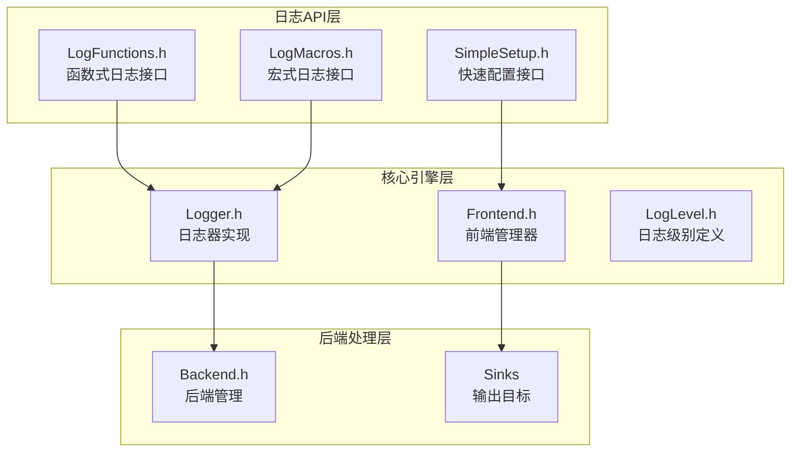
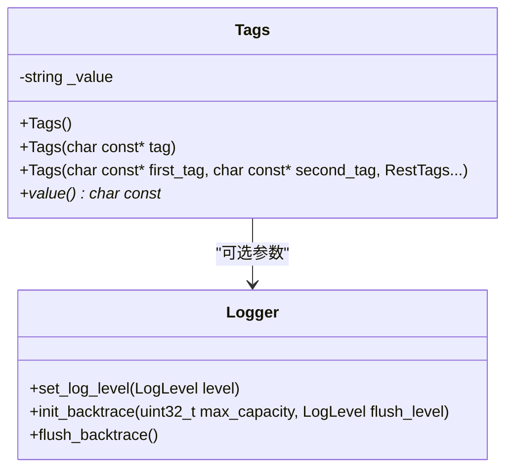
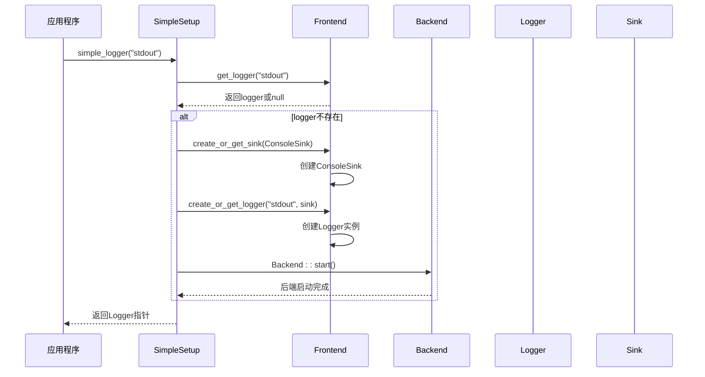
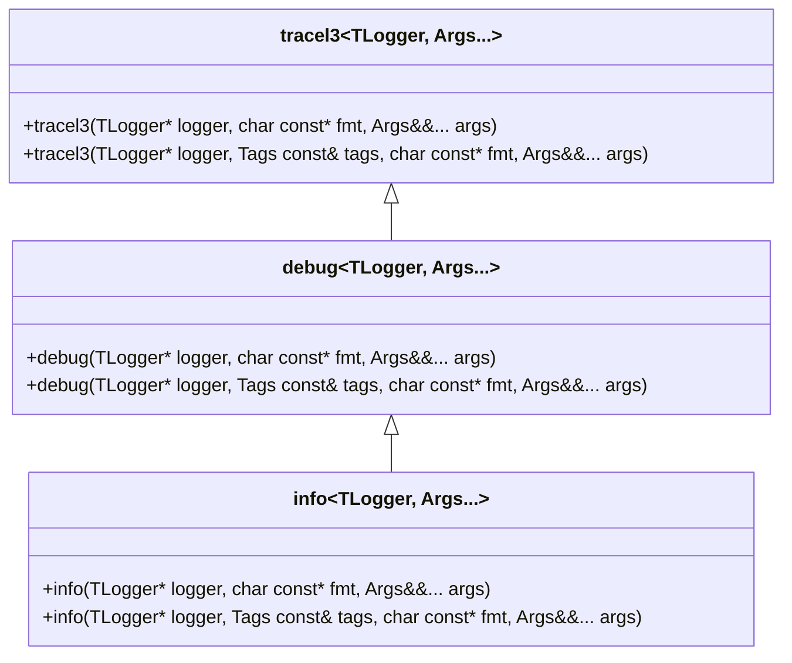
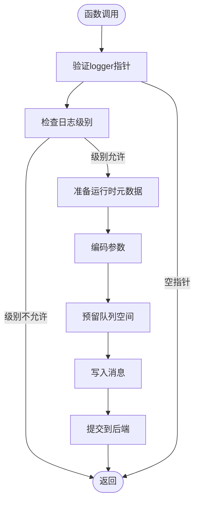
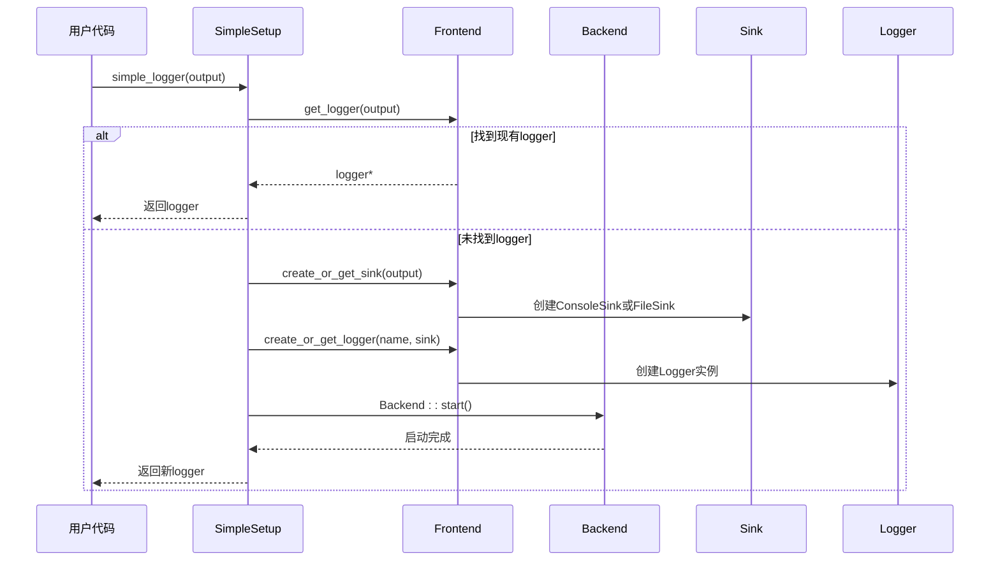
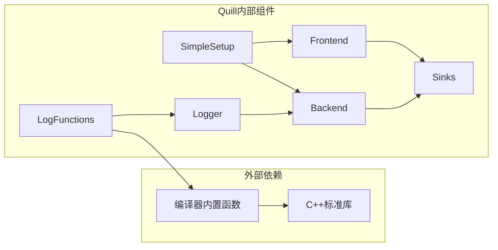

# 日志函数API

<cite>
**本文档引用的文件**
- [LogFunctions.h](file://include/quill/LogFunctions.h)
- [SimpleSetup.h](file://include/quill/SimpleSetup.h)
- [LogMacros.h](file://include/quill/LogMacros.h)
- [Logger.h](file://include/quill/Logger.h)
- [Frontend.h](file://include/quill/Frontend.h)
- [LogLevel.h](file://include/quill/core/LogLevel.h)
- [console_logging_macro_free.cpp](file://examples/console_logging_macro_free.cpp)
- [macro_free_mode.rst](file://docs/macro_free_mode.rst)
</cite>

## 目录
1. [简介](#简介)
2. [项目结构](#项目结构)
3. [核心组件](#核心组件)
4. [架构概览](#架构概览)
5. [详细组件分析](#详细组件分析)
6. [依赖关系分析](#依赖关系分析)
7. [性能考虑](#性能考虑)
8. [故障排除指南](#故障排除指南)
9. [结论](#结论)
10. [附录](#附录)

## 简介
本文件为Quill日志库的函数式API提供完整的API文档。Quill提供了两种日志接口：基于宏的高性能接口和基于函数的无宏接口。本文档专注于函数式API，包括所有非宏形式的日志函数（如log_info、log_error、log_warning、log_debug等）的详细用法，以及SimpleSetup提供的快速配置接口。

函数式API通过模板类和函数提供日志功能，虽然在某些方面有性能开销，但提供了更清晰的代码结构和更好的IDE支持。该API支持多种日志级别、标签系统、限流功能和动态格式化。

## 项目结构
Quill日志库采用模块化设计，主要包含以下核心组件：

**图表来源**
- [LogFunctions.h:1-345](file://include/quill/LogFunctions.h#L1-L345)
- [SimpleSetup.h:1-74](file://include/quill/SimpleSetup.h#L1-L74)
- [Logger.h:1-508](file://include/quill/Logger.h#L1-L508)

**章节来源**
- [LogFunctions.h:19-48](file://include/quill/LogFunctions.h#L19-L48)
- [SimpleSetup.h:20-45](file://include/quill/SimpleSetup.h#L20-L45)

## 核心组件

### 函数式日志接口
函数式API通过模板类提供不同级别的日志记录功能：

- **tracel3**: 最详细的跟踪日志（Trace Level 3）
- **tracel2**: 跟踪日志（Level 2）
- **tracel1**: 跟踪日志（Level 1）
- **debug**: 调试日志
- **info**: 信息日志
- **notice**: 通知日志
- **warning**: 警告日志
- **error**: 错误日志
- **critical**: 严重错误日志
- **backtrace**: 回溯日志

每个日志函数都支持两个重载形式：
1. 基本形式：`function(logger, format_string, args...)`
2. 带标签形式：`function(logger, tags, format_string, args...)`

**章节来源**
- [LogFunctions.h:113-321](file://include/quill/LogFunctions.h#L113-L321)

### 标签系统
标签系统允许为日志消息添加分类标识：

**图表来源**
- [LogFunctions.h:53-111](file://include/quill/LogFunctions.h#L53-L111)

**章节来源**
- [LogFunctions.h:53-111](file://include/quill/LogFunctions.h#L53-L111)

### SimpleSetup快速配置
SimpleSetup提供了一键式的日志器配置功能，支持控制台和文件输出：

**章节来源**
- [SimpleSetup.h:46-72](file://include/quill/SimpleSetup.h#L46-L72)

## 架构概览

**图表来源**
- [SimpleSetup.h:46-72](file://include/quill/SimpleSetup.h#L46-L72)
- [Frontend.h:148-179](file://include/quill/Frontend.h#L148-L179)

## 详细组件分析

### 日志函数实现分析

#### 模板类结构
每个日志级别都通过模板类实现，提供类型安全的参数传递：

**图表来源**
- [LogFunctions.h:113-217](file://include/quill/LogFunctions.h#L113-L217)

#### 日志级别映射
日志级别从低到高排列，支持从TraceL3到Critical的完整范围：

**章节来源**
- [LogLevel.h:22-35](file://include/quill/core/LogLevel.h#L22-L35)

### 日志记录流程

**图表来源**
- [LogFunctions.h:325-343](file://include/quill/LogFunctions.h#L325-L343)

**章节来源**
- [LogFunctions.h:325-343](file://include/quill/LogFunctions.h#L325-L343)

### SimpleSetup配置流程

**图表来源**
- [SimpleSetup.h:46-72](file://include/quill/SimpleSetup.h#L46-L72)

**章节来源**
- [SimpleSetup.h:46-72](file://include/quill/SimpleSetup.h#L46-L72)

## 依赖关系分析

**图表来源**
- [LogFunctions.h:29-47](file://include/quill/LogFunctions.h#L29-L47)
- [SimpleSetup.h:9-18](file://include/quill/SimpleSetup.h#L9-L18)

**章节来源**
- [LogFunctions.h:9-18](file://include/quill/LogFunctions.h#L9-L18)
- [SimpleSetup.h:9-18](file://include/quill/SimpleSetup.h#L9-L18)

## 性能考虑

### 函数式API的性能特征

函数式API相比宏式API有以下性能特点：

1. **编译时优化缺失**
   - 编译时日志级别过滤不可用
   - 参数总是被求值，即使日志级别被禁用

2. **运行时开销**
   - 需要运行时元数据复制
   - 额外的函数调用开销
   - 运行时logger指针验证

3. **内存使用**
   - 运行时元数据存储需求
   - 额外的字符串处理开销

### 性能对比表

| 特性 | 宏式API | 函数式API |
|------|---------|-----------|
| 编译时过滤 | ✅ 支持 | ❌ 不支持 |
| 参数延迟求值 | ✅ 支持 | ❌ 不支持 |
| 运行时级别检查 | ✅ 内联检查 | ❌ 额外检查 |
| 函数调用开销 | ❌ 无额外调用 | ✅ 额外函数调用 |
| 元数据处理 | ✅ 编译时生成 | ❌ 运行时复制 |

**章节来源**
- [LogFunctions.h:31-47](file://include/quill/LogFunctions.h#L31-L47)
- [macro_free_mode.rst:10-25](file://docs/macro_free_mode.rst#L10-L25)

## 故障排除指南

### 常见问题及解决方案

#### 1. Logger为空指针
当传入空的logger指针时，函数式API会安全地忽略日志请求：

**症状**: 日志调用没有产生任何输出
**原因**: logger指针为nullptr
**解决**: 确保正确初始化logger或使用SimpleSetup

#### 2. 性能问题
如果发现日志调用影响应用程序性能：

**症状**: 高CPU使用率或延迟增加
**原因**: 函数式API的运行时开销
**解决**: 
- 使用宏式API替代函数式API
- 调整日志级别以减少日志量
- 考虑使用限流功能

#### 3. 格式化问题
动态格式化可能比静态格式化慢：

**症状**: 复杂格式化操作导致性能下降
**原因**: 运行时格式化开销
**解决**: 
- 在性能关键路径使用静态格式化
- 避免复杂的嵌套格式化

**章节来源**
- [LogFunctions.h:328-331](file://include/quill/LogFunctions.h#L328-L331)
- [macro_free_mode.rst:13-25](file://docs/macro_free_mode.rst#L13-L25)

## 结论
Quill的函数式API为需要避免宏使用的场景提供了灵活的选择。虽然在性能上不如宏式API，但它提供了更好的IDE支持、类型安全和代码可读性。对于性能敏感的应用，建议优先使用宏式API；对于需要更好开发体验的场景，函数式API是一个优秀的替代方案。

SimpleSetup进一步简化了配置过程，使得开发者可以快速开始使用Quill而无需深入了解底层配置细节。

## 附录

### 使用示例

#### 基本使用示例
参考示例文件展示了如何使用函数式API进行各种级别的日志记录。

**章节来源**
- [console_logging_macro_free.cpp:35-61](file://examples/console_logging_macro_free.cpp#L35-L61)

### API参考

#### 日志函数列表
- `tracel3(logger, fmt, args...)` - 最详细跟踪日志
- `tracel2(logger, fmt, args...)` - 跟踪日志级别2
- `tracel1(logger, fmt, args...)` - 跟踪日志级别1
- `debug(logger, fmt, args...)` - 调试日志
- `info(logger, fmt, args...)` - 信息日志
- `notice(logger, fmt, args...)` - 通知日志
- `warning(logger, fmt, args...)` - 警告日志
- `error(logger, fmt, args...)` - 错误日志
- `critical(logger, fmt, args...)` - 严重错误日志
- `backtrace(logger, fmt, args...)` - 回溯日志

#### SimpleSetup函数
- `simple_logger(output = "stdout")` - 快速创建logger
- 支持"stdout"、"stderr"控制台输出和文件名输出

**章节来源**
- [macro_free_mode.rst:30-43](file://docs/macro_free_mode.rst#L30-L43)
- [SimpleSetup.h:46](file://include/quill/SimpleSetup.h#L46)