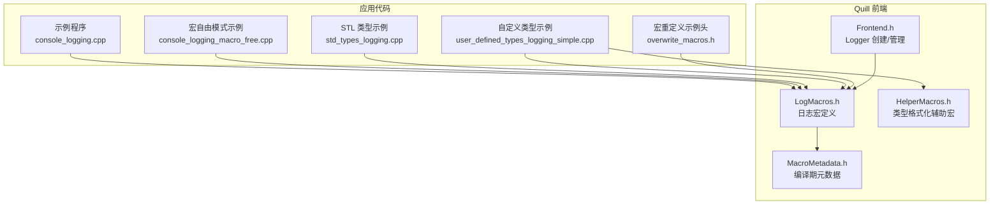
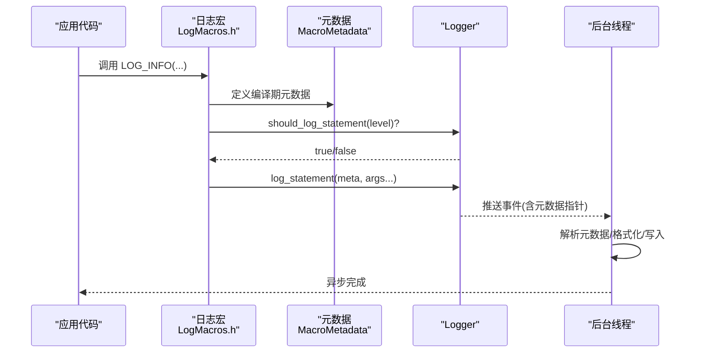
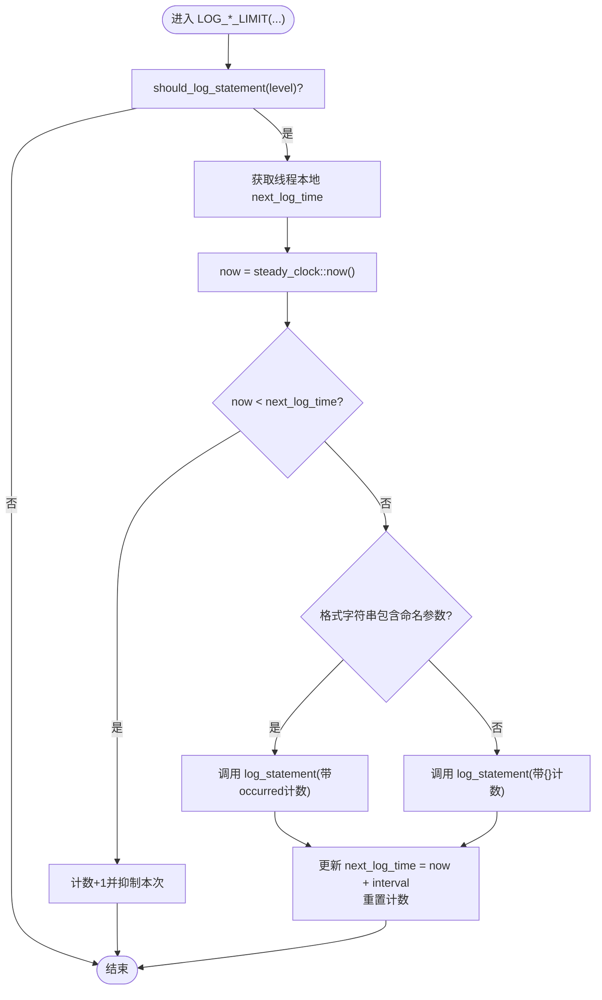
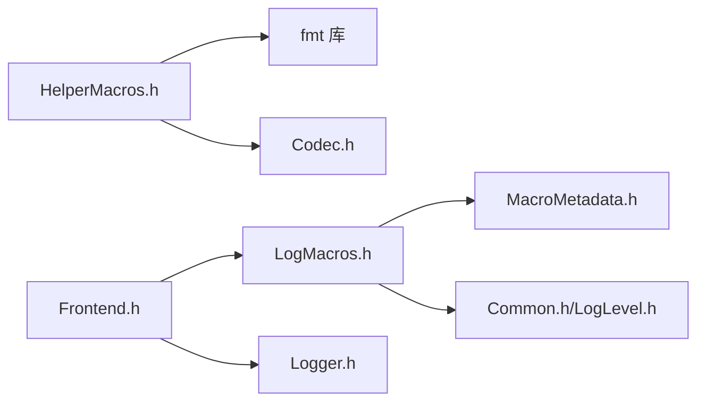

# 日志宏API

<cite>
**本文引用的文件**
- [LogMacros.h](file://include/quill/LogMacros.h)
- [HelperMacros.h](file://include/quill/HelperMacros.h)
- [MacroMetadata.h](file://include/quill/core/MacroMetadata.h)
- [Frontend.h](file://include/quill/Frontend.h)
- [console_logging.cpp](file://examples/console_logging.cpp)
- [console_logging_macro_free.cpp](file://examples/console_logging_macro_free.cpp)
- [std_types_logging.cpp](file://examples/recommended_usage/std_types_logging.cpp)
- [user_defined_types_logging_simple.cpp](file://examples/user_defined_types_logging_simple.cpp)
- [overwrite_macros.h](file://examples/recommended_usage/quill_static_lib/overwrite_macros.h)
- [README.md](file://README.md)
</cite>

## 目录
1. [简介](#简介)
2. [项目结构与入口](#项目结构与入口)
3. [核心组件](#核心组件)
4. [架构总览](#架构总览)
5. [详细组件分析](#详细组件分析)
6. [依赖关系分析](#依赖关系分析)
7. [性能特性与编译时优化](#性能特性与编译时优化)
8. [故障排查指南](#故障排查指南)
9. [结论](#结论)
10. [附录：常见用法与示例路径](#附录常见用法与示例路径)

## 简介
本文件为 Quill 日志宏系统的完整 API 文档，覆盖以下内容：
- 标准日志宏：LOG_INFO、LOG_ERROR、LOG_WARNING、LOG_DEBUG、LOG_NOTICE、LOG_CRITICAL、LOG_BACKTRACE 等
- 变体宏族：带限流（LOG_*_LIMIT）、按次数节流（LOG_*_LIMIT_EVERY_N）、带标签（LOG_*_TAGS）
- 变量名格式化宏：LOGV_*（自动插入变量名占位符）与 LOGJ_*（命名占位符）
- 动态日志宏：LOG_DYNAMIC、LOG_RUNTIME_METADATA_*（运行时元数据）
- 宏自由模式与宏重定义
- 各类数据类型的记录方式（基础类型、STL 容器、自定义类型）
- 宏展开后的调用链路与性能优势

## 项目结构与入口
- 日志宏定义集中在头文件中，供前端线程在调用点直接展开，不引入后端实现细节。
- 示例程序展示了典型用法，包括控制台输出、STL 类型、用户自定义类型、宏自由模式与宏重定义。

图表来源
- [LogMacros.h](file://include/quill/LogMacros.h)
- [HelperMacros.h](file://include/quill/HelperMacros.h)
- [MacroMetadata.h](file://include/quill/core/MacroMetadata.h)
- [Frontend.h](file://include/quill/Frontend.h)
- [console_logging.cpp](file://examples/console_logging.cpp)
- [console_logging_macro_free.cpp](file://examples/console_logging_macro_free.cpp)
- [std_types_logging.cpp](file://examples/recommended_usage/std_types_logging.cpp)
- [user_defined_types_logging_simple.cpp](file://examples/user_defined_types_logging_simple.cpp)
- [overwrite_macros.h](file://examples/recommended_usage/quill_static_lib/overwrite_macros.h)

章节来源
- [README.md](file://README.md)
- [console_logging.cpp](file://examples/console_logging.cpp)

## 核心组件
- 日志宏族：提供不同日志级别、限流、标签、变量名格式化的统一接口
- 元数据捕获：在编译期捕获源位置、函数名、消息格式、标签、日志级别等信息
- 运行时元数据：支持动态日志级别与运行时源位置注入
- 辅助宏：为自定义类型提供直接/延迟格式化策略

章节来源
- [LogMacros.h](file://include/quill/LogMacros.h)
- [MacroMetadata.h](file://include/quill/core/MacroMetadata.h)
- [HelperMacros.h](file://include/quill/HelperMacros.h)

## 架构总览
日志宏在调用点展开，生成静态 constexpr 元数据对象，随后通过模板方法将消息与参数推入无锁队列，由后台线程完成格式化与落盘。

图表来源
- [LogMacros.h](file://include/quill/LogMacros.h)
- [MacroMetadata.h](file://include/quill/core/MacroMetadata.h)

## 详细组件分析

### 标准日志宏族
- LOG_TRACE_L3/L2/L1、LOG_DEBUG、LOG_INFO、LOG_NOTICE、LOG_WARNING、LOG_ERROR、LOG_CRITICAL、LOG_BACKTRACE
- 语法：LOG_<LEVEL>(logger, "format {}", arg1, ...)
- 行为：根据当前日志级别与编译期过滤决定是否执行；若启用，构造元数据并调用 logger 的模板方法

章节来源
- [LogMacros.h](file://include/quill/LogMacros.h)

### 带限流的宏族
- LOG_*_LIMIT(min_interval, logger, fmt, ...)
  - 每个线程本地维护下次可记录时间点，若当前时间早于该时间则抑制本次记录，并统计被抑制次数
  - 当超过间隔时，记录一次并追加“发生次数”统计
- LOG_*_LIMIT_EVERY_N(n, logger, fmt, ...)
  - 每 N 次触发一次记录，其余次数计数累加

图表来源
- [LogMacros.h](file://include/quill/LogMacros.h)

章节来源
- [LogMacros.h](file://include/quill/LogMacros.h)

### 带标签宏族
- LOG_*_TAGS(logger, tags, fmt, ...)
- 支持最多 5 个标签，每个标签前自动添加“#”，并以空格分隔
- 适用于多维度筛选与聚合

章节来源
- [LogMacros.h](file://include/quill/LogMacros.h)

### 变量名格式化宏族（LOGV_*）
- LOGV_<LEVEL>(logger, "message", var1, var2, ...)
- 自动为每个变量生成形如“变量名: {}”的占位符，减少手写占位符的工作量
- 适合快速调试与可观测性增强

章节来源
- [LogMacros.h](file://include/quill/LogMacros.h)

### 命名占位符宏族（LOGJ_*）
- LOGJ_<LEVEL>(logger, "message", var1, var2, ...)
- 使用命名占位符（如 {var1}），便于格式化器与下游解析

章节来源
- [LogMacros.h](file://include/quill/LogMacros.h)

### 动态日志与运行时元数据
- LOG_DYNAMIC / LOG_DYNAMIC_TAGS：在调用点注入文件名、行号、函数名、标签
- LOG_RUNTIME_METADATA_*：支持深拷贝、混合拷贝、浅拷贝三种策略，用于不同场景下的性能与安全权衡

章节来源
- [LogMacros.h](file://include/quill/LogMacros.h)

### 宏自由模式与非前缀宏
- 宏自由模式：不使用 LOG_ 前缀宏，直接调用 quill::info(...) 等函数式接口
- 非前缀宏：可通过定义 QUILL_DISABLE_NON_PREFIXED_MACROS 禁用默认 LOG_* 宏，再自行定义全局宏或函数别名
- 示例：overwrite_macros.h 展示了如何禁用默认宏并绑定到全局 logger

章节来源
- [LogMacros.h](file://include/quill/LogMacros.h)
- [console_logging_macro_free.cpp](file://examples/console_logging_macro_free.cpp)
- [overwrite_macros.h](file://examples/recommended_usage/quill_static_lib/overwrite_macros.h)

### 数据类型记录示例与支持范围
- 基础类型：整数、浮点、布尔、字符、字符串等
- STL 容器：数组、向量、对偶、映射、集合等（需包含对应 quill/std/* 头文件）
- 自定义类型：通过 QUILL_LOGGABLE_DEFERRED_FORMAT 或 QUILL_LOGGABLE_DIRECT_FORMAT 注册格式化器与编码器
- 广泛示例见各示例程序

章节来源
- [console_logging.cpp](file://examples/console_logging.cpp)
- [std_types_logging.cpp](file://examples/recommended_usage/std_types_logging.cpp)
- [user_defined_types_logging_simple.cpp](file://examples/user_defined_types_logging_simple.cpp)
- [HelperMacros.h](file://include/quill/HelperMacros.h)

## 依赖关系分析
- LogMacros.h 依赖：
  - MacroMetadata.h：编译期元数据结构与工具
  - Common.h、LogLevel.h：通用常量与日志级别枚举
- HelperMacros.h 提供类型注册辅助，配合 fmt 与 Codec 实现
- Frontend.h 提供 Logger 创建与管理，贯穿示例程序

图表来源
- [LogMacros.h](file://include/quill/LogMacros.h)
- [MacroMetadata.h](file://include/quill/core/MacroMetadata.h)
- [HelperMacros.h](file://include/quill/HelperMacros.h)
- [Frontend.h](file://include/quill/Frontend.h)

章节来源
- [LogMacros.h](file://include/quill/LogMacros.h)
- [HelperMacros.h](file://include/quill/HelperMacros.h)
- [Frontend.h](file://include/quill/Frontend.h)

## 性能特性与编译时优化
- 编译期过滤：通过 QUILL_COMPILE_ACTIVE_LOG_LEVEL 在编译期完全移除指定级别及更高等级的宏展开，实现零开销日志
- 运行时直通：当 should_log_statement 返回 false 时，避免构造元数据与入队
- 限流策略：线程本地计时与计数，减少高频日志带来的吞吐压力
- 异步格式化：参数序列化与格式化在后台线程完成，降低热路径开销
- 宏自由模式：函数式接口在热路径上仍保持高性能，但相比宏展开略增一层函数调用开销

章节来源
- [LogMacros.h](file://include/quill/LogMacros.h)
- [README.md](file://README.md)

## 故障排查指南
- 日志未输出
  - 检查日志级别设置与编译期过滤配置
  - 确认 Backend 已启动且 Logger 已正确创建
- 频繁日志导致性能下降
  - 使用 LOG_*_LIMIT 或 LOG_*_LIMIT_EVERY_N 控制频率
- 自定义类型无法格式化
  - 确认已包含相应 quill/std/* 头文件
  - 对包含指针/引用的类型使用 QUILL_LOGGABLE_DIRECT_FORMAT
  - 对纯值类型使用 QUILL_LOGGABLE_DEFERRED_FORMAT
- 宏冲突或需要全局单 logger
  - 定义 QUILL_DISABLE_NON_PREFIXED_MACROS 并在自定义头中重定义 LOG_* 宏

章节来源
- [LogMacros.h](file://include/quill/LogMacros.h)
- [HelperMacros.h](file://include/quill/HelperMacros.h)
- [console_logging.cpp](file://examples/console_logging.cpp)
- [user_defined_types_logging_simple.cpp](file://examples/user_defined_types_logging_simple.cpp)
- [overwrite_macros.h](file://examples/recommended_usage/quill_static_lib/overwrite_macros.h)

## 结论
Quill 的日志宏系统通过编译期元数据捕获、运行时条件判断与异步格式化，实现了低延迟与高吞吐的兼顾。其丰富的宏族与灵活的配置选项（限流、标签、动态元数据、宏自由模式、宏重定义）满足从开发调试到生产监控的广泛需求。建议在生产环境中结合编译期过滤与限流策略，以获得最佳性能与可观测性平衡。

## 附录：常见用法与示例路径
- 基础宏使用：LOG_INFO、LOG_WARNING、LOG_ERROR 等
  - 示例：[console_logging.cpp](file://examples/console_logging.cpp)
- 变量名格式化：LOGV_* 与 LOGJ_*
  - 示例：[console_logging.cpp](file://examples/console_logging.cpp)
- STL 类型记录：包含 quill/std/* 头文件
  - 示例：[std_types_logging.cpp](file://examples/recommended_usage/std_types_logging.cpp)
- 自定义类型记录：QUILL_LOGGABLE_DEFERRED_FORMAT / QUILL_LOGGABLE_DIRECT_FORMAT
  - 示例：[user_defined_types_logging_simple.cpp](file://examples/user_defined_types_logging_simple.cpp)
- 宏自由模式：直接调用 quill::info(...) 等
  - 示例：[console_logging_macro_free.cpp](file://examples/console_logging_macro_free.cpp)
- 宏重定义：禁用默认宏并绑定到全局 logger
  - 示例头：[overwrite_macros.h](file://examples/recommended_usage/quill_static_lib/overwrite_macros.h)