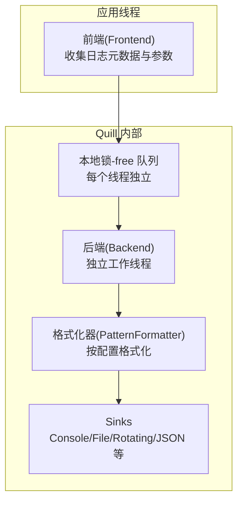
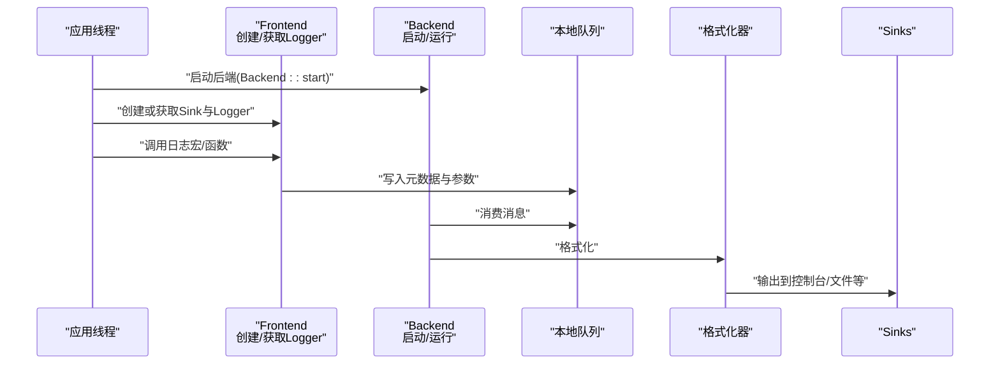
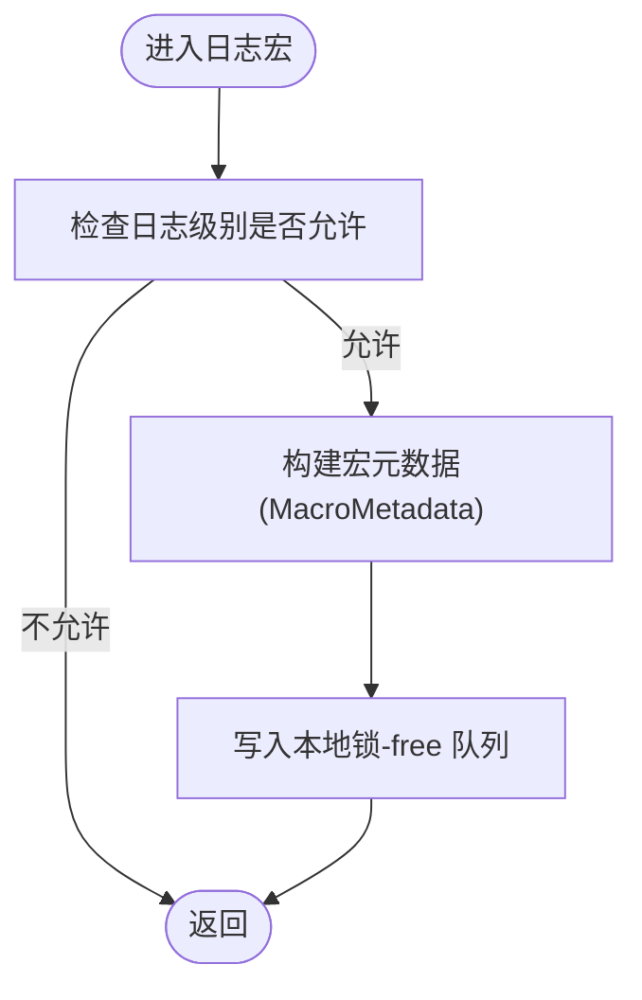
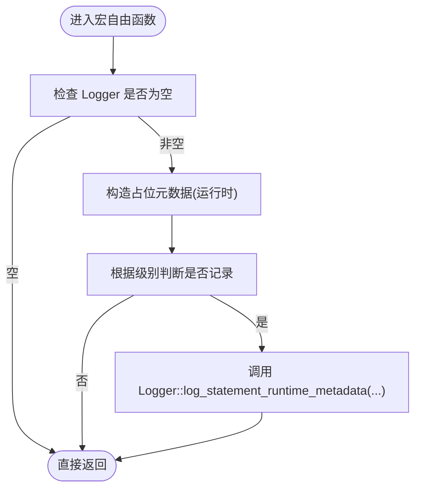
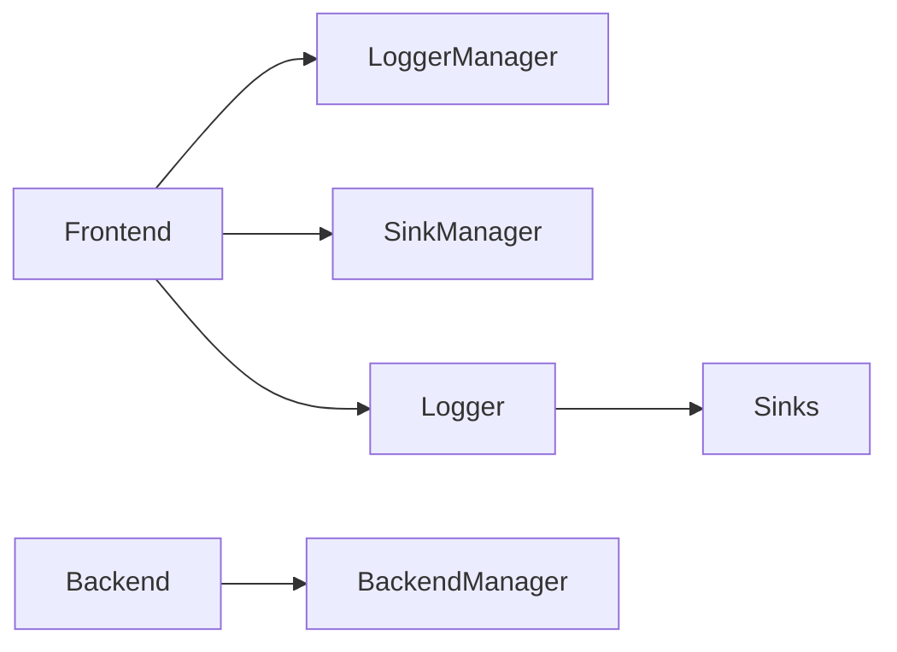

# 快速开始

<cite>
**本文引用的文件**
- [README.md](file://README.md)
- [quick_start.rst](file://docs/quick_start.rst)
- [installing.rst](file://docs/installing.rst)
- [SimpleSetup.h](file://include/quill/SimpleSetup.h)
- [Backend.h](file://include/quill/Backend.h)
- [Frontend.h](file://include/quill/Frontend.h)
- [LogMacros.h](file://include/quill/LogMacros.h)
- [LogFunctions.h](file://include/quill/LogFunctions.h)
- [quill_docs_quick_start.cpp](file://docs/examples/quill_docs_quick_start.cpp)
- [quill_docs_example_console.cpp](file://docs/examples/quill_docs_example_console.cpp)
- [quill_docs_example_file.cpp](file://docs/examples/quill_docs_example_file.cpp)
- [console_logging.cpp](file://examples/console_logging.cpp)
- [file_logging.cpp](file://examples/file_logging.cpp)
- [console_logging_macro_free.cpp](file://examples/console_logging_macro_free.cpp)
- [macro_free_mode.rst](file://docs/macro_free_mode.rst)
</cite>

## 目录
1. [简介](#简介)
2. [项目结构](#项目结构)
3. [核心组件](#核心组件)
4. [架构总览](#架构总览)
5. [详细组件分析](#详细组件分析)
6. [依赖分析](#依赖分析)
7. [性能考虑](#性能考虑)
8. [故障排查指南](#故障排查指南)
9. [结论](#结论)
10. [附录](#附录)

## 简介
本指南面向希望在最短时间内上手 Quill 的开发者，覆盖以下内容：
- 多种安装方式（vcpkg、Conan、Homebrew、Meson WrapDB、Conda、Bzlmod、xmake、nix、build2）
- 最简单 setup（simple_logger）与详细 setup（Backend/Frontend API）
- 宏自由模式（macro-free）使用说明
- 基础日志记录、控制台输出、文件输出示例
- 运行效果与最佳实践建议

## 项目结构
Quill 是一个头文件为主的高性能异步日志库，核心由“前端（Frontend）”和“后端（Backend）”两部分组成：
- 前端：在调用线程中收集日志元数据与参数，写入本地锁-free 队列
- 后端：在独立线程中消费队列、格式化并输出到各类 Sink（控制台、文件、JSON、轮转文件等）

图示来源
- [quick_start.rst:18-22](file://docs/quick_start.rst#L18-L22)

章节来源
- [README.md:102-190](file://README.md#L102-L190)
- [quick_start.rst:18-22](file://docs/quick_start.rst#L18-L22)

## 核心组件
- SimpleSetup：一行初始化控制台或文件日志
- Backend：启动/停止后端线程、通知唤醒、查询状态
- Frontend：创建/获取 Sink 与 Logger、注册/移除 Logger
- 日志宏接口：LOG_INFO/LOGV_INFO 等，支持限频、命名参数等
- 宏自由函数接口：info/warning/error 等函数式调用

章节来源
- [SimpleSetup.h:46-72](file://include/quill/SimpleSetup.h#L46-L72)
- [Backend.h:36-162](file://include/quill/Backend.h#L36-L162)
- [Frontend.h:120-179](file://include/quill/Frontend.h#L120-L179)
- [LogMacros.h:616-674](file://include/quill/LogMacros.h#L616-L674)
- [LogFunctions.h:324-343](file://include/quill/LogFunctions.h#L324-L343)

## 架构总览
下图展示了从应用发起一次日志到最终输出的关键流程。

图示来源
- [quick_start.rst:18-22](file://docs/quick_start.rst#L18-L22)
- [Backend.h:36-57](file://include/quill/Backend.h#L36-L57)
- [Frontend.h:148-159](file://include/quill/Frontend.h#L148-L159)

## 详细组件分析

### 安装与环境准备
- 包管理器安装（任选其一）
  - vcpkg: vcpkg install quill
  - Conan: conan install quill
  - Homebrew: brew install quill
  - Meson WrapDB: meson wrap install quill
  - Conda: conda install -c conda-forge quill
  - Bzlmod: bazel_dep(name = "quill", version = "x.y.z")
  - xmake: xrepo install quill
  - nix: nix-shell -p quill-log
  - build2: libquill
- CMake 集成
  - 外部构建：find_package(quill) 后 target_link_libraries(your_target PUBLIC quill::quill)
  - 嵌入式：add_subdirectory(quill) 后链接 quill::quill

章节来源
- [README.md:108-121](file://README.md#L108-L121)
- [installing.rst:9-19](file://docs/installing.rst#L9-L19)
- [installing.rst:40-64](file://docs/installing.rst#L40-L64)
- [installing.rst:68-89](file://docs/installing.rst#L68-L89)

### 最简单 setup（simple_logger）
- 控制台输出：调用 simple_logger() 即可获得默认控制台 Logger
- 文件输出：传入文件名 simple_logger("test.log") 获得文件 Logger
- 自动启动后端线程，内置默认格式

章节来源
- [SimpleSetup.h:46-72](file://include/quill/SimpleSetup.h#L46-L72)
- [README.md:126-142](file://README.md#L126-L142)
- [quill_docs_quick_start.cpp:1-13](file://docs/examples/quill_docs_quick_start.cpp#L1-L13)

### 详细 setup（Backend/Frontend API）
- 启动后端：Backend::start() 或带选项的 start(BackendOptions, SignalHandlerOptions)
- 创建 Sink：Frontend::create_or_get_sink<ConsoleSink>("sink_id_1")
- 创建 Logger：Frontend::create_or_get_logger("root", std::move(sink))
- 设置日志级别：logger->set_log_level(...)
- 使用宏进行日志：LOG_INFO(logger, "...")

章节来源
- [README.md:148-165](file://README.md#L148-L165)
- [Backend.h:36-130](file://include/quill/Backend.h#L36-L130)
- [Frontend.h:120-159](file://include/quill/Frontend.h#L120-L159)
- [quill_docs_example_console.cpp:1-49](file://docs/examples/quill_docs_example_console.cpp#L1-L49)

### 宏自由模式（macro-free）
- 适用场景：不希望使用宏或需要函数式调用时
- 性能权衡：运行时元数据复制、参数总是求值、无法编译期剔除
- 可用函数：tracel3/tracel2/tracel1/debug/info/notice/warning/error/critical/backtrace
- 示例：console_logging_macro_free.cpp

章节来源
- [macro_free_mode.rst:10-25](file://docs/macro_free_mode.rst#L10-L25)
- [LogFunctions.h:324-343](file://include/quill/LogFunctions.h#L324-L343)
- [console_logging_macro_free.cpp:1-62](file://examples/console_logging_macro_free.cpp#L1-L62)

### 基础日志记录与输出
- 控制台输出：创建 ConsoleSink 并设置 Logger，使用 LOG_INFO/LOGV_INFO 等
- 文件输出：创建 FileSink，配置打开模式与文件名追加策略，使用 LOG_INFO 输出
- 限频输出：LOG_INFO_LIMIT 按时间间隔限制输出；LOG_INFO_LIMIT_EVERY_N 按次数节流

章节来源
- [quill_docs_example_console.cpp:14-49](file://docs/examples/quill_docs_example_console.cpp#L14-L49)
- [quill_docs_example_file.cpp:11-29](file://docs/examples/quill_docs_example_file.cpp#L11-L29)
- [console_logging.cpp:22-72](file://examples/console_logging.cpp#L22-L72)
- [file_logging.cpp:32-73](file://examples/file_logging.cpp#L32-L73)

### 关键流程图：日志宏调用

图示来源
- [LogMacros.h:306-314](file://include/quill/LogMacros.h#L306-L314)

### 关键流程图：宏自由函数调用

图示来源
- [LogFunctions.h:324-343](file://include/quill/LogFunctions.h#L324-L343)

## 依赖分析
- 组件耦合
  - Frontend 依赖 LoggerManager/SinkManager 提供的全局注册表
  - Backend 通过 BackendManager 管理后端线程生命周期
  - 日志宏/函数最终委托给 Logger 实例完成落盘
- 外部依赖
  - 格式化基于 {fmt} 库
  - 可选信号处理（跨平台差异）

图示来源
- [Frontend.h:148-159](file://include/quill/Frontend.h#L148-L159)
- [Backend.h:36-57](file://include/quill/Backend.h#L36-L57)

章节来源
- [Frontend.h:148-159](file://include/quill/Frontend.h#L148-L159)
- [Backend.h:36-57](file://include/quill/Backend.h#L36-L57)

## 性能考虑
- 异步后端：避免阻塞调用线程，提升吞吐
- 编译期剔除：通过 QUILL_COMPILE_ACTIVE_LOG_LEVEL 在编译期完全移除低优先级日志
- 队列类型：可选择有界/无界、阻塞/丢弃队列以平衡延迟与内存占用
- 宏 vs 函数：宏路径零开销（条件判断与元数据常量折叠），函数路径有额外运行时成本

章节来源
- [README.md:192-220](file://README.md#L192-L220)
- [LogMacros.h:28-40](file://include/quill/LogMacros.h#L28-L40)
- [macro_free_mode.rst:10-25](file://docs/macro_free_mode.rst#L10-L25)

## 故障排查指南
- 后端未启动：确保在任何日志调用前调用 Backend::start()
- 多进程 fork：父/子进程需分别调用 Backend::start()，并写入不同文件
- 后端线程 ID 查询：Backend::get_thread_id() 用于调试与关联
- 信号处理：启用内置信号处理器时注意线程初始化与信号屏蔽要求

章节来源
- [Backend.h:168-171](file://include/quill/Backend.h#L168-L171)
- [README.md:717-754](file://README.md#L717-L754)

## 结论
- 快速起步：使用 simple_logger() 一行完成控制台/文件日志
- 精细化控制：通过 Backend::start() 与 Frontend API 自定义 Sink、Logger 与格式
- 高性能路径：优先使用宏接口，并结合编译期剔除与合适的队列策略
- 替代方案：宏自由模式适合特定场景，但会带来一定性能代价

## 附录

### 快速示例清单
- 最简控制台/文件：参见 [quill_docs_quick_start.cpp:1-13](file://docs/examples/quill_docs_quick_start.cpp#L1-L13)
- 控制台输出：参见 [quill_docs_example_console.cpp:1-49](file://docs/examples/quill_docs_example_console.cpp#L1-L49)
- 文件输出：参见 [quill_docs_example_file.cpp:1-29](file://docs/examples/quill_docs_example_file.cpp#L1-L29)
- 宏自由模式：参见 [console_logging_macro_free.cpp:1-62](file://examples/console_logging_macro_free.cpp#L1-L62)