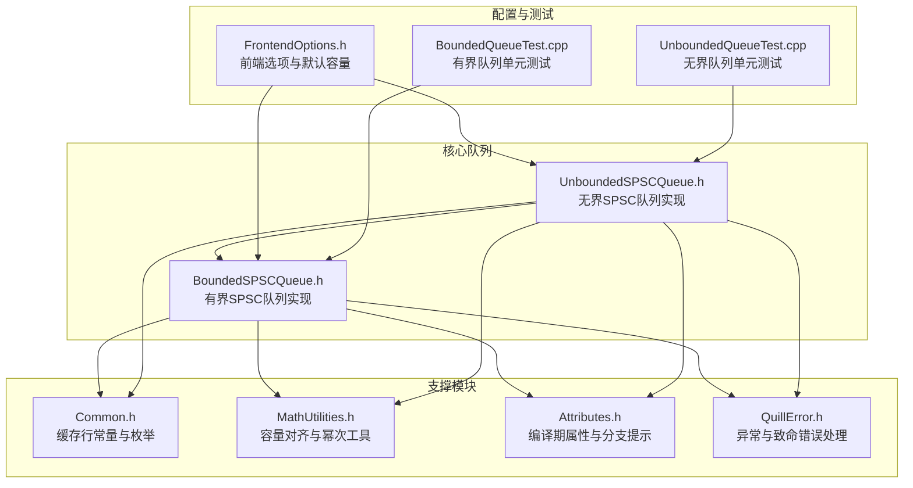
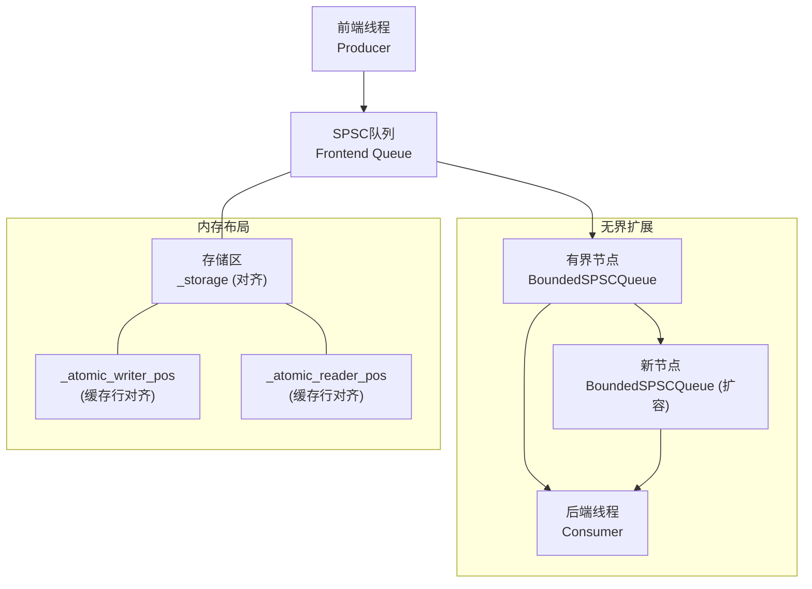
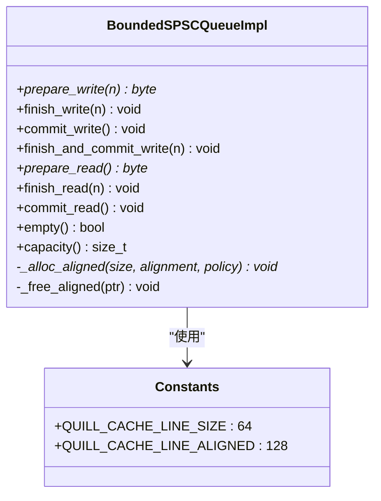
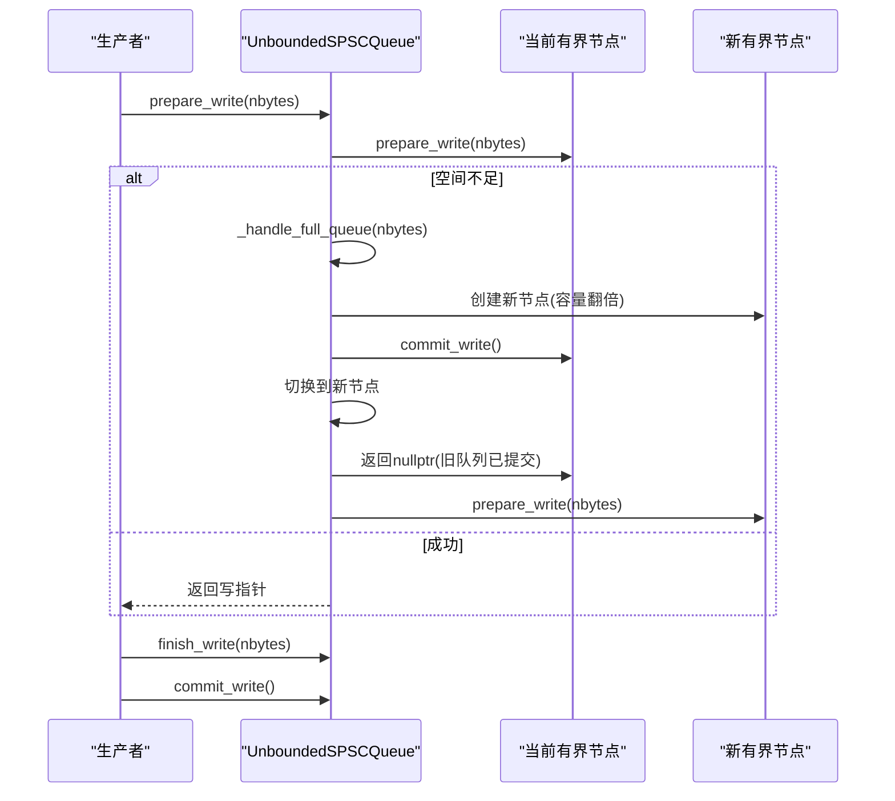
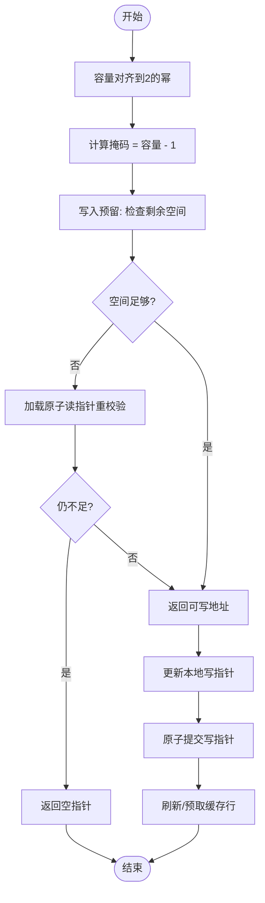
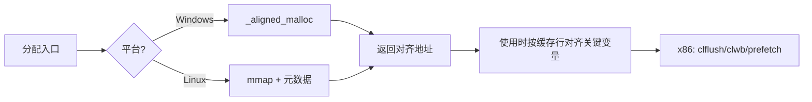
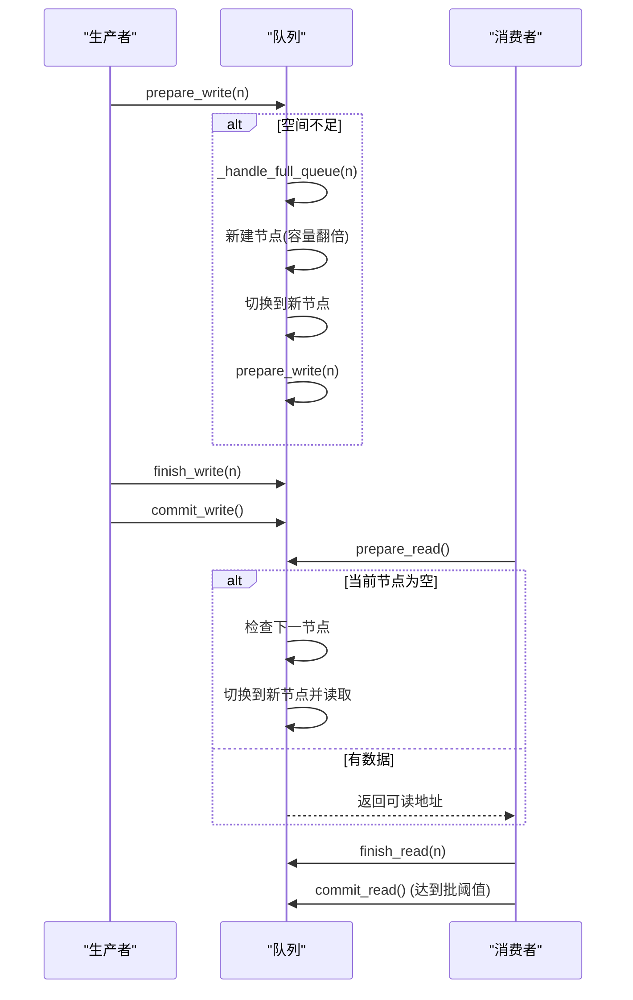
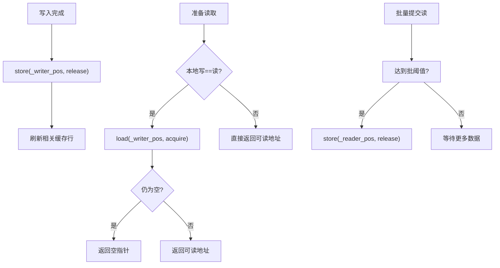
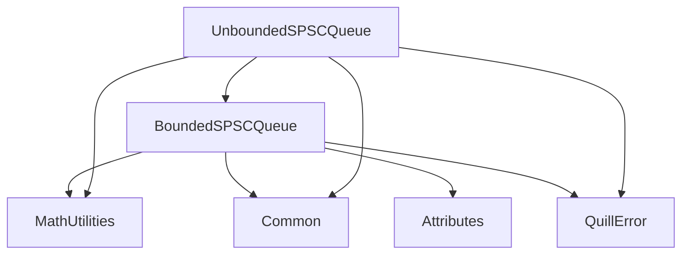

# SPSC队列内存管理

<cite>
**本文引用的文件**
- [BoundedSPSCQueue.h](file://include/quill/core/BoundedSPSCQueue.h)
- [UnboundedSPSCQueue.h](file://include/quill/core/UnboundedSPSCQueue.h)
- [Common.h](file://include/quill/core/Common.h)
- [MathUtilities.h](file://include/quill/core/MathUtilities.h)
- [Attributes.h](file://include/quill/core/Attributes.h)
- [QuillError.h](file://include/quill/core/QuillError.h)
- [FrontendOptions.h](file://include/quill/core/FrontendOptions.h)
- [BoundedQueueTest.cpp](file://test/unit_tests/BoundedQueueTest.cpp)
- [UnboundedQueueTest.cpp](file://test/unit_tests/UnboundedQueueTest.cpp)
</cite>

## 目录
1. [简介](#简介)
2. [项目结构](#项目结构)
3. [核心组件](#核心组件)
4. [架构总览](#架构总览)
5. [详细组件分析](#详细组件分析)
6. [依赖关系分析](#依赖关系分析)
7. [性能考量](#性能考量)
8. [故障排查指南](#故障排查指南)
9. [结论](#结论)
10. [附录](#附录)

## 简介
本技术指南聚焦Quill的SPSC（单生产者单消费者）队列内存管理策略，系统阐述环形缓冲区设计、容量与掩码计算、索引管理、内存对齐与缓存行优化、预分配与批量提交、内存屏障与原子操作、以及异常安全与泄漏防护。文档面向不同层次读者，既提供高层概览，也给出代码级细节与可视化图示。

## 项目结构
围绕SPSC队列的核心源文件位于core目录，配合通用常量、数学工具、属性宏与错误处理机制共同构成完整的内存管理方案。单元测试覆盖了边界条件、多线程读写与收缩/扩容行为。

**图表来源**
- [BoundedSPSCQueue.h:1-356](file://include/quill/core/BoundedSPSCQueue.h#L1-L356)
- [UnboundedSPSCQueue.h:1-345](file://include/quill/core/UnboundedSPSCQueue.h#L1-L345)
- [Common.h:129-130](file://include/quill/core/Common.h#L129-L130)
- [MathUtilities.h:44-69](file://include/quill/core/MathUtilities.h#L44-L69)
- [Attributes.h:134-148](file://include/quill/core/Attributes.h#L134-L148)
- [QuillError.h:15-38](file://include/quill/core/QuillError.h#L15-L38)
- [FrontendOptions.h:27-44](file://include/quill/core/FrontendOptions.h#L27-L44)
- [BoundedQueueTest.cpp:19-88](file://test/unit_tests/BoundedQueueTest.cpp#L19-L88)
- [UnboundedQueueTest.cpp:13-100](file://test/unit_tests/UnboundedQueueTest.cpp#L13-L100)

**章节来源**
- [BoundedSPSCQueue.h:1-356](file://include/quill/core/BoundedSPSCQueue.h#L1-L356)
- [UnboundedSPSCQueue.h:1-345](file://include/quill/core/UnboundedSPSCQueue.h#L1-L345)
- [Common.h:129-130](file://include/quill/core/Common.h#L129-L130)
- [MathUtilities.h:44-69](file://include/quill/core/MathUtilities.h#L44-L69)
- [Attributes.h:134-148](file://include/quill/core/Attributes.h#L134-L148)
- [QuillError.h:15-38](file://include/quill/core/QuillError.h#L15-L38)
- [FrontendOptions.h:27-44](file://include/quill/core/FrontendOptions.h#L27-L44)
- [BoundedQueueTest.cpp:19-88](file://test/unit_tests/BoundedQueueTest.cpp#L19-L88)
- [UnboundedQueueTest.cpp:13-100](file://test/unit_tests/UnboundedQueueTest.cpp#L13-L100)

## 核心组件
- 有界SPSC队列：基于2的幂容量的环形缓冲区，使用掩码进行索引换算，配合原子位置变量与缓存行对齐，实现无锁读写与缓存行污染防护。
- 无界SPSC队列：由多个有界节点链表组成，当写满时自动扩容并切换到新节点；支持收缩以降低容量；消费端在新旧缓冲区间平滑切换。
- 缓存行与对齐：通过统一的缓存行大小与对齐常量，确保关键字段跨线程共享时避免伪共享。
- 容量与掩码：容量按2的幂对齐，掩码用于位运算快速取模，提升索引管理效率。
- 预分配与批量提交：写入阶段先预留空间，再分步完成写入与提交，减少竞争窗口；读取侧采用批处理提交，降低原子写频率。
- 内存屏障与原子操作：严格使用内存序（acquire/release等）保证可见性与顺序，结合x86缓存行刷新指令优化性能。
- 异常安全与泄漏防护：统一的对齐分配/释放接口，失败路径抛出异常或在禁用异常模式下终止，析构负责资源回收。

**章节来源**
- [BoundedSPSCQueue.h:60-95](file://include/quill/core/BoundedSPSCQueue.h#L60-L95)
- [BoundedSPSCQueue.h:105-169](file://include/quill/core/BoundedSPSCQueue.h#L105-L169)
- [BoundedSPSCQueue.h:246-326](file://include/quill/core/BoundedSPSCQueue.h#L246-L326)
- [UnboundedSPSCQueue.h:42-63](file://include/quill/core/UnboundedSPSCQueue.h#L42-L63)
- [UnboundedSPSCQueue.h:115-149](file://include/quill/core/UnboundedSPSCQueue.h#L115-L149)
- [UnboundedSPSCQueue.h:244-297](file://include/quill/core/UnboundedSPSCQueue.h#L244-L297)
- [Common.h:129-130](file://include/quill/core/Common.h#L129-L130)
- [MathUtilities.h:44-69](file://include/quill/core/MathUtilities.h#L44-L69)
- [QuillError.h:15-38](file://include/quill/core/QuillError.h#L15-L38)

## 架构总览
SPSC队列在Quill中作为前端日志线程与后端工作线程之间的高性能通道。前端线程仅写入，后端线程仅读取，两者通过无锁环形缓冲区传递字节块。无界版本通过链式节点实现动态扩容，同时保持消费端的透明切换。

**图表来源**
- [UnboundedSPSCQueue.h:42-63](file://include/quill/core/UnboundedSPSCQueue.h#L42-L63)
- [UnboundedSPSCQueue.h:244-297](file://include/quill/core/UnboundedSPSCQueue.h#L244-L297)
- [BoundedSPSCQueue.h:331-346](file://include/quill/core/BoundedSPSCQueue.h#L331-L346)

## 详细组件分析

### 有界SPSC队列（BoundedSPSCQueue）
- 设计要点
  - 容量与掩码：容量向上取整到2的幂，掩码用于环形索引换算，避免除法开销。
  - 存储与对齐：使用对齐分配器获得按缓存行对齐的连续内存，避免跨缓存行伪共享。
  - 位置变量：写/读指针与原子位置分别缓存在本地变量与原子变量中，减少冲突。
  - x86优化：在构造时预取缓存行，在写/读提交时刷新缓存行，降低TLB与缓存抖动。
- 关键流程
  - 写入准备：检查剩余空间，必要时加载读指针重校验，返回可写起始地址。
  - 提交写入：更新本地写指针，随后原子写入写指针，触发读端可见。
  - 读取准备：若本地写指针等于读指针则加载原子写指针确认空满状态，否则返回可读地址。
  - 批量提交读：达到批次阈值才原子更新读指针，降低原子写频率。
- 内存管理
  - 对齐分配：Windows使用对齐分配函数；Linux使用mmap+元数据记录偏移与总大小，便于释放。
  - 释放：根据元数据回溯原始映射地址并调用解除映射，防止泄漏。

**图表来源**
- [BoundedSPSCQueue.h:54-95](file://include/quill/core/BoundedSPSCQueue.h#L54-L95)
- [BoundedSPSCQueue.h:105-169](file://include/quill/core/BoundedSPSCQueue.h#L105-L169)
- [BoundedSPSCQueue.h:246-326](file://include/quill/core/BoundedSPSCQueue.h#L246-L326)
- [Common.h:129-130](file://include/quill/core/Common.h#L129-L130)

**章节来源**
- [BoundedSPSCQueue.h:60-95](file://include/quill/core/BoundedSPSCQueue.h#L60-L95)
- [BoundedSPSCQueue.h:105-169](file://include/quill/core/BoundedSPSCQueue.h#L105-L169)
- [BoundedSPSCQueue.h:246-326](file://include/quill/core/BoundedSPSCQueue.h#L246-L326)

### 无界SPSC队列（UnboundedSPSCQueue）
- 设计要点
  - 节点链表：每个节点是一个有界队列，生产者指向当前节点，消费者指向当前读取节点。
  - 扩容策略：写入失败且空间不足时，按需倍增容量至满足请求，创建新节点并切换。
  - 收缩策略：生产者可在安全时机将容量缩小到更小的2的幂，消费端在切换时感知新旧容量。
  - 切换语义：消费端在旧队列清空后删除旧节点并切换到新节点，保证消费连续性。
- 关键流程
  - 写入：优先尝试当前节点，失败则触发扩容并切换，再次尝试成功后返回写指针。
  - 读取：若当前节点为空，检查是否存在下一个节点，存在则执行“切换+读取”。
  - 空判断：当前节点空且无后续节点时才判定为空。

**图表来源**
- [UnboundedSPSCQueue.h:115-149](file://include/quill/core/UnboundedSPSCQueue.h#L115-L149)
- [UnboundedSPSCQueue.h:244-297](file://include/quill/core/UnboundedSPSCQueue.h#L244-L297)

**章节来源**
- [UnboundedSPSCQueue.h:42-63](file://include/quill/core/UnboundedSPSCQueue.h#L42-L63)
- [UnboundedSPSCQueue.h:115-149](file://include/quill/core/UnboundedSPSCQueue.h#L115-L149)
- [UnboundedSPSCQueue.h:244-297](file://include/quill/core/UnboundedSPSCQueue.h#L244-L297)

### 环形缓冲区设计与容量计算
- 容量对齐：使用幂次对齐确保掩码索引高效，掩码为容量-1，索引通过按位与实现环形移动。
- 掩码与索引：掩码用于将任意写/读位置映射到存储数组的有效索引，避免昂贵的取模运算。
- 读写协调：写端预留空间后先写数据，再原子提交；读端批量提交，减少原子写次数。
- x86优化：构造时预取若干缓存行，写/读提交时刷新缓存行，降低缓存污染概率。

**图表来源**
- [BoundedSPSCQueue.h:60-95](file://include/quill/core/BoundedSPSCQueue.h#L60-L95)
- [BoundedSPSCQueue.h:105-169](file://include/quill/core/BoundedSPSCQueue.h#L105-L169)
- [MathUtilities.h:44-69](file://include/quill/core/MathUtilities.h#L44-L69)

**章节来源**
- [BoundedSPSCQueue.h:60-95](file://include/quill/core/BoundedSPSCQueue.h#L60-L95)
- [BoundedSPSCQueue.h:105-169](file://include/quill/core/BoundedSPSCQueue.h#L105-L169)
- [MathUtilities.h:44-69](file://include/quill/core/MathUtilities.h#L44-L69)

### 内存对齐与缓存行优化
- 缓存行常量：统一定义缓存行大小与对齐粒度，确保关键原子变量与位置指针跨线程共享时不产生伪共享。
- 对齐分配：Windows使用对齐分配API；Linux通过mmap分配并附加元数据（总大小、偏移），释放时据此回退到原始映射地址。
- x86缓存行指令：在构造时预取缓存行，在写/读提交时刷新缓存行，降低TLB与缓存抖动。

**图表来源**
- [BoundedSPSCQueue.h:246-326](file://include/quill/core/BoundedSPSCQueue.h#L246-L326)
- [Common.h:129-130](file://include/quill/core/Common.h#L129-L130)

**章节来源**
- [BoundedSPSCQueue.h:246-326](file://include/quill/core/BoundedSPSCQueue.h#L246-L326)
- [Common.h:129-130](file://include/quill/core/Common.h#L129-L130)

### 预分配机制与批量提交
- 预分配：写入前先检查并预留n字节连续空间，避免运行时扩容带来的不确定性。
- 批量提交：读端达到一定字节数阈值才原子更新读指针，降低原子写频率，提升吞吐。
- 无界扩容：当预分配失败且未达上限时，按需倍增容量创建新节点，切换后重试成功。

**图表来源**
- [UnboundedSPSCQueue.h:115-149](file://include/quill/core/UnboundedSPSCQueue.h#L115-L149)
- [UnboundedSPSCQueue.h:244-297](file://include/quill/core/UnboundedSPSCQueue.h#L244-L297)
- [BoundedSPSCQueue.h:160-169](file://include/quill/core/BoundedSPSCQueue.h#L160-L169)

**章节来源**
- [UnboundedSPSCQueue.h:115-149](file://include/quill/core/UnboundedSPSCQueue.h#L115-L149)
- [UnboundedSPSCQueue.h:244-297](file://include/quill/core/UnboundedSPSCQueue.h#L244-L297)
- [BoundedSPSCQueue.h:160-169](file://include/quill/core/BoundedSPSCQueue.h#L160-L169)

### 原子操作与内存屏障
- 写入路径：写入完成后使用release语义写入原子写指针，使读端在后续acquire加载中可见最新数据。
- 读取路径：读端在批量提交时使用release语义更新原子读指针；空判断时先加载本地写指针，再在相等时加载原子写指针以确认空满。
- x86缓存行刷新：在写/读提交时刷新已写/已读的缓存行，减少脏数据驻留时间。

**图表来源**
- [BoundedSPSCQueue.h:123-136](file://include/quill/core/BoundedSPSCQueue.h#L123-L136)
- [BoundedSPSCQueue.h:175-189](file://include/quill/core/BoundedSPSCQueue.h#L175-L189)
- [BoundedSPSCQueue.h:160-169](file://include/quill/core/BoundedSPSCQueue.h#L160-L169)

**章节来源**
- [BoundedSPSCQueue.h:123-136](file://include/quill/core/BoundedSPSCQueue.h#L123-L136)
- [BoundedSPSCQueue.h:175-189](file://include/quill/core/BoundedSPSCQueue.h#L175-L189)
- [BoundedSPSCQueue.h:160-169](file://include/quill/core/BoundedSPSCQueue.h#L160-L169)

### 异常安全与内存泄漏防护
- 分配失败：对齐分配失败时抛出自定义异常；在禁用异常模式下输出致命错误并终止进程，避免悬挂指针。
- 释放路径：Linux通过元数据恢复原始映射地址并解除映射；Windows使用对齐释放函数。
- 析构责任：有界队列析构时释放对齐存储；无界队列析构时遍历并删除所有节点，确保无泄漏。

**章节来源**
- [BoundedSPSCQueue.h:250-258](file://include/quill/core/BoundedSPSCQueue.h#L250-L258)
- [BoundedSPSCQueue.h:285-289](file://include/quill/core/BoundedSPSCQueue.h#L285-L289)
- [BoundedSPSCQueue.h:309-326](file://include/quill/core/BoundedSPSCQueue.h#L309-L326)
- [UnboundedSPSCQueue.h:96-108](file://include/quill/core/UnboundedSPSCQueue.h#L96-L108)
- [QuillError.h:15-38](file://include/quill/core/QuillError.h#L15-L38)

## 依赖关系分析
- 组件耦合
  - 无界队列依赖有界队列实现节点化环形缓冲区，二者共享缓存行常量与内存对齐策略。
  - 数学工具提供容量对齐与幂次计算，支撑掩码与索引管理。
  - 属性宏提供分支提示与热路径标记，辅助编译器优化。
  - 错误处理机制贯穿分配/释放与扩容路径，保障异常安全。
- 外部依赖
  - 平台特定：Windows对齐分配API；Linux mmap与huge pages策略。
  - x86缓存行指令：在支持的平台上启用clflush/opt与prefetch优化。

**图表来源**
- [UnboundedSPSCQueue.h:10-12](file://include/quill/core/UnboundedSPSCQueue.h#L10-L12)
- [BoundedSPSCQueue.h:3-6](file://include/quill/core/BoundedSPSCQueue.h#L3-L6)
- [Common.h:129-130](file://include/quill/core/Common.h#L129-L130)
- [MathUtilities.h:44-69](file://include/quill/core/MathUtilities.h#L44-L69)
- [Attributes.h:134-148](file://include/quill/core/Attributes.h#L134-L148)
- [QuillError.h:15-38](file://include/quill/core/QuillError.h#L15-L38)

**章节来源**
- [UnboundedSPSCQueue.h:10-12](file://include/quill/core/UnboundedSPSCQueue.h#L10-L12)
- [BoundedSPSCQueue.h:3-6](file://include/quill/core/BoundedSPSCQueue.h#L3-L6)
- [Common.h:129-130](file://include/quill/core/Common.h#L129-L130)
- [MathUtilities.h:44-69](file://include/quill/core/MathUtilities.h#L44-L69)
- [Attributes.h:134-148](file://include/quill/core/Attributes.h#L134-L148)
- [QuillError.h:15-38](file://include/quill/core/QuillError.h#L15-L38)

## 性能考量
- 索引与掩码：使用位运算替代取模，显著降低热点路径开销。
- 缓存行对齐：关键原子变量与位置指针按缓存行对齐，避免伪共享导致的性能下降。
- 批量提交：读端批量提交减少原子写频率，提高吞吐。
- x86优化：构造时预取、提交时刷新缓存行，降低TLB与缓存抖动。
- 扩容策略：无界队列按需倍增，避免频繁小步扩容；收缩时确保消费端安全切换。
- 默认容量：前端选项提供合理的初始容量与最大容量，兼顾内存占用与性能。

**章节来源**
- [BoundedSPSCQueue.h:123-136](file://include/quill/core/BoundedSPSCQueue.h#L123-L136)
- [BoundedSPSCQueue.h:160-169](file://include/quill/core/BoundedSPSCQueue.h#L160-L169)
- [UnboundedSPSCQueue.h:166-183](file://include/quill/core/UnboundedSPSCQueue.h#L166-L183)
- [FrontendOptions.h:27-44](file://include/quill/core/FrontendOptions.h#L27-L44)

## 故障排查指南
- 写入返回空指针
  - 可能原因：空间不足或竞争导致无法预留；建议检查消息大小是否超过容量，或适当增大容量。
  - 无界队列：确认是否已触发扩容但尚未提交旧队列。
- 读取一直为空
  - 可能原因：写端尚未提交或消费端未达到批阈值；检查commit_read调用时机。
- 扩容/收缩异常
  - 扩容：确认未超过最大容量限制；超过将抛出异常。
  - 收缩：仅允许容量小于等于当前容量的一半，且必须在生产者线程安全调用。
- 内存分配失败
  - Windows：对齐分配失败会抛出异常；Linux：mmap失败会抛出异常或在禁用异常模式下终止。
- 单元测试参考
  - 有界队列：覆盖读写循环、整数溢出场景与多线程读写。
  - 无界队列：覆盖扩容、收缩、多线程读写与容量边界。

**章节来源**
- [BoundedQueueTest.cpp:19-88](file://test/unit_tests/BoundedQueueTest.cpp#L19-L88)
- [UnboundedQueueTest.cpp:13-100](file://test/unit_tests/UnboundedQueueTest.cpp#L13-L100)
- [UnboundedSPSCQueue.h:253-275](file://include/quill/core/UnboundedSPSCQueue.h#L253-L275)
- [BoundedSPSCQueue.h:250-258](file://include/quill/core/BoundedSPSCQueue.h#L250-L258)
- [BoundedSPSCQueue.h:285-289](file://include/quill/core/BoundedSPSCQueue.h#L285-L289)

## 结论
Quill的SPSC队列通过幂次容量、掩码索引、缓存行对齐与原子屏障实现了高性能、低争用的单生产者单消费者通道。有界队列提供稳定低开销，无界队列在受限情况下提供弹性扩容与收缩。严格的异常处理与资源回收策略确保了异常安全与内存不泄漏。结合x86缓存行优化与批量提交，整体在高并发日志场景中具备优异的吞吐与延迟表现。

## 附录
- 默认前端选项
  - 队列类型：无界阻塞
  - 初始容量：128 KiB
  - 最大容量：2 GiB
  - 巨页策略：禁用
- 关键宏与常量
  - 缓存行大小：64字节
  - 对齐粒度：128字节
- 测试覆盖
  - 有界队列：读写循环、整数溢出、多线程
  - 无界队列：扩容/收缩、多线程、容量边界

**章节来源**
- [FrontendOptions.h:27-44](file://include/quill/core/FrontendOptions.h#L27-L44)
- [Common.h:129-130](file://include/quill/core/Common.h#L129-L130)
- [BoundedQueueTest.cpp:19-88](file://test/unit_tests/BoundedQueueTest.cpp#L19-L88)
- [UnboundedQueueTest.cpp:13-100](file://test/unit_tests/UnboundedQueueTest.cpp#L13-L100)