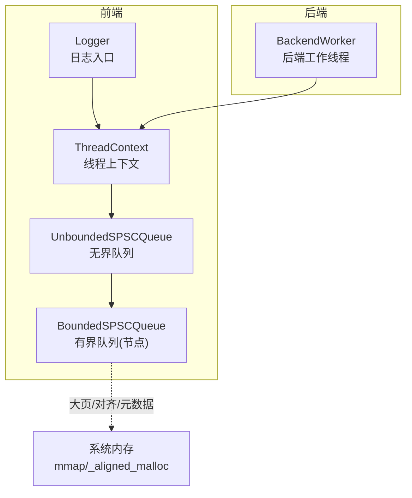
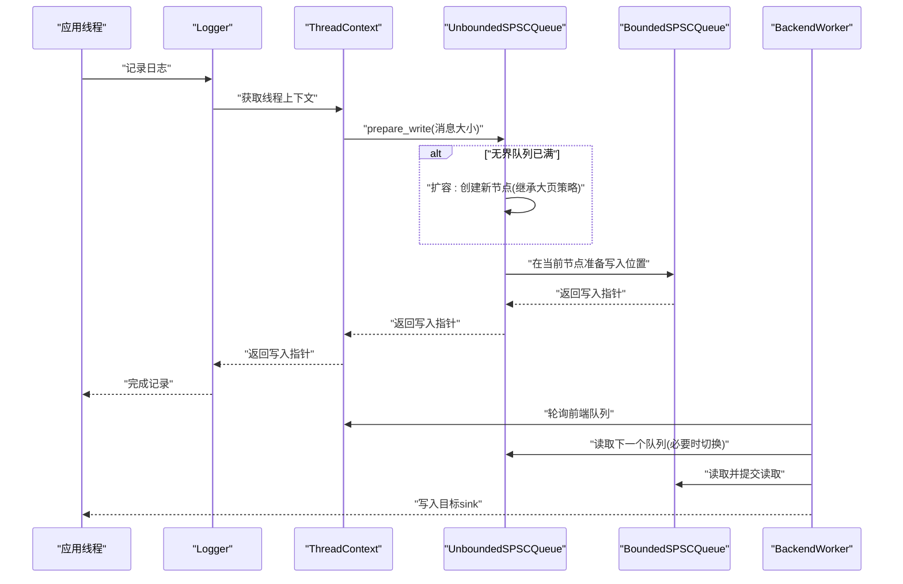
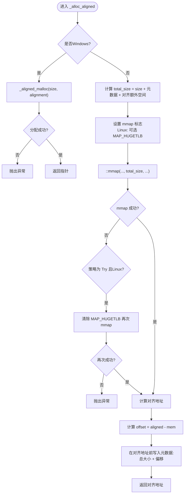
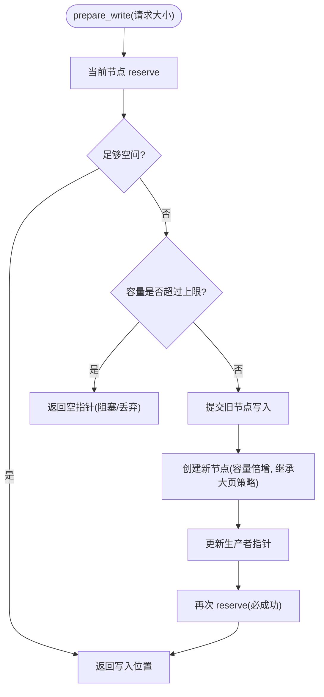
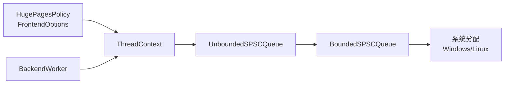
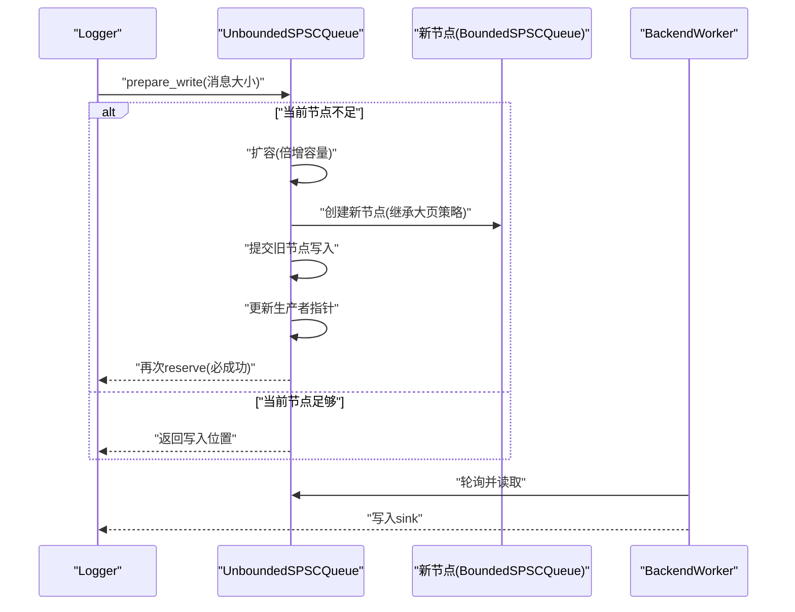

# 内存池与预分配机制

<cite>
**本文引用的文件**
- [BoundedSPSCQueue.h](file://include/quill/core/BoundedSPSCQueue.h)
- [UnboundedSPSCQueue.h](file://include/quill/core/UnboundedSPSCQueue.h)
- [Common.h](file://include/quill/core/Common.h)
- [FrontendOptions.h](file://include/quill/core/FrontendOptions.h)
- [ThreadContextManager.h](file://include/quill/core/ThreadContextManager.h)
- [BackendWorker.h](file://include/quill/backend/BackendWorker.h)
- [Logger.h](file://include/quill/Logger.h)
</cite>

## 目录
1. [引言](#引言)
2. [项目结构](#项目结构)
3. [核心组件](#核心组件)
4. [架构总览](#架构总览)
5. [详细组件分析](#详细组件分析)
6. [依赖关系分析](#依赖关系分析)
7. [性能考量](#性能考量)
8. [故障排查指南](#故障排查指南)
9. [结论](#结论)
10. [附录](#附录)

## 引言
本指南聚焦于Quill在日志系统中的内存池与预分配机制，系统性解析以下主题：
- 大页内存（Huge Pages）支持与配置：Linux平台的启用、回退策略与跨平台差异。
- 内存对齐算法：_align_pointer的实现原理与边界处理。
- 内存元数据管理：大小与偏移量的存储与读取。
- 分配失败处理与错误恢复：异常抛出、队列阻塞/丢弃策略。
- 内存使用统计与监控：如何结合现有接口进行容量与增长事件的观测。

## 项目结构
Quill的内存池与预分配主要集中在核心队列与线程上下文管理模块中：
- 单生产者单消费者（SPSC）环形缓冲区：有界与无界两种实现，均支持对齐与可选的大页内存。
- 线程上下文：每个线程拥有独立的SPSC队列，支持按需扩容（无界队列）。
- 后端工作线程：轮询前端队列，处理日志写入，并在队列扩容时输出通知。

**图表来源**
- [Logger.h:408-419](file://include/quill/Logger.h#L408-L419)
- [ThreadContextManager.h:344-406](file://include/quill/core/ThreadContextManager.h#L344-L406)
- [UnboundedSPSCQueue.h:79-85](file://include/quill/core/UnboundedSPSCQueue.h#L79-L85)
- [BoundedSPSCQueue.h:60-95](file://include/quill/core/BoundedSPSCQueue.h#L60-L95)
- [BackendWorker.h:1211-1227](file://include/quill/backend/BackendWorker.h#L1211-L1227)

**章节来源**
- [BoundedSPSCQueue.h:54-95](file://include/quill/core/BoundedSPSCQueue.h#L54-L95)
- [UnboundedSPSCQueue.h:79-85](file://include/quill/core/UnboundedSPSCQueue.h#L79-L85)
- [ThreadContextManager.h:344-406](file://include/quill/core/ThreadContextManager.h#L344-L406)
- [BackendWorker.h:1211-1227](file://include/quill/backend/BackendWorker.h#L1211-L1227)

## 核心组件
- 有界SPSC队列（BoundedSPSCQueue）
  - 负责底层环形缓冲区的分配、缓存行刷新与预取、对齐地址计算与元数据存储。
  - 支持Windows与Linux平台的对齐分配与大页策略。
- 无界SPSC队列（UnboundedSPSCQueue）
  - 在有界队列满时动态扩容，创建新节点并沿链表前进；继承父队列的大页策略。
- 线程上下文（ThreadContext/ThreadContextManager）
  - 每个线程维护一个SPSC队列或链式队列，负责注册、失效与清理。
- 后端工作线程（BackendWorker）
  - 轮询前端队列，处理日志写入；在队列扩容时输出通知，便于监控。

**章节来源**
- [BoundedSPSCQueue.h:54-95](file://include/quill/core/BoundedSPSCQueue.h#L54-L95)
- [UnboundedSPSCQueue.h:79-85](file://include/quill/core/UnboundedSPSCQueue.h#L79-L85)
- [ThreadContextManager.h:216-240](file://include/quill/core/ThreadContextManager.h#L216-L240)
- [BackendWorker.h:1211-1227](file://include/quill/backend/BackendWorker.h#L1211-L1227)

## 架构总览
下图展示从日志调用到后端消费的关键路径，以及内存池与预分配在其中的作用。

**图表来源**
- [Logger.h:408-419](file://include/quill/Logger.h#L408-L419)
- [UnboundedSPSCQueue.h:277-296](file://include/quill/core/UnboundedSPSCQueue.h#L277-L296)
- [BoundedSPSCQueue.h:105-169](file://include/quill/core/BoundedSPSCQueue.h#L105-L169)
- [BackendWorker.h:1211-1227](file://include/quill/backend/BackendWorker.h#L1211-L1227)

## 详细组件分析

### 有界SPSC队列（BoundedSPSCQueue）
- 对齐与元数据
  - 使用内部对齐函数计算对齐地址，并在元数据区域存储“原始内存块偏移”和“总大小”，以便释放时能正确反查原始映射地址。
  - 元数据位于对齐地址之前固定偏移处，避免破坏用户数据区域。
- 大页内存（Huge Pages）
  - Linux平台通过mmap标志启用大页；支持策略：从不、总是、尝试（失败则回退普通页）。
  - Windows平台使用系统对齐分配接口。
- 缓存行优化
  - 初始化时对存储区域进行缓存行级刷新与预取，减少TLB抖动。
  - 写入/读取过程按缓存行粒度刷新与预取，提升性能。
- 错误处理
  - 分配失败时抛出统一异常类型，便于上层捕获与降级。

**图表来源**
- [BoundedSPSCQueue.h:246-302](file://include/quill/core/BoundedSPSCQueue.h#L246-L302)

**章节来源**
- [BoundedSPSCQueue.h:228-302](file://include/quill/core/BoundedSPSCQueue.h#L228-L302)
- [Common.h:128-130](file://include/quill/core/Common.h#L128-L130)
- [Common.h:172-180](file://include/quill/core/Common.h#L172-L180)

### 无界SPSC队列（UnboundedSPSCQueue）
- 扩容策略
  - 当当前节点无法满足预留空间时，按倍增策略扩大容量，直至达到最大上限。
  - 达到上限后返回空指针，由上层决定阻塞或丢弃。
- 队列切换
  - 新节点创建后，先提交旧节点写入，再更新生产者指针；读取时若检测到新节点，先读旧节点一次，再切换并提交旧节点读取。
- 继承策略
  - 新节点构造时继承父节点的大页策略，确保一致性。

**图表来源**
- [UnboundedSPSCQueue.h:240-296](file://include/quill/core/UnboundedSPSCQueue.h#L240-L296)

**章节来源**
- [UnboundedSPSCQueue.h:240-296](file://include/quill/core/UnboundedSPSCQueue.h#L240-L296)
- [FrontendOptions.h:40-52](file://include/quill/core/FrontendOptions.h#L40-L52)

### 线程上下文与队列生命周期
- 注册与失效
  - 线程启动时创建并注册上下文；线程结束时标记无效，后端清理阶段回收。
- 失败计数
  - 提供失败计数器，用于统计阻塞/丢弃等失败事件，便于监控与告警。

**章节来源**
- [ThreadContextManager.h:216-240](file://include/quill/core/ThreadContextManager.h#L216-L240)
- [ThreadContextManager.h:200-214](file://include/quill/core/ThreadContextManager.h#L200-L214)

### 后端监控与通知
- 队列扩容通知
  - 后端在检测到前端队列扩容时，通过错误通知回调输出人类可读信息，包含新旧容量与线程序号，便于运维观察。

**章节来源**
- [BackendWorker.h:1211-1227](file://include/quill/backend/BackendWorker.h#L1211-L1227)

## 依赖关系分析
- 平台与编译器
  - Windows：使用系统对齐分配；Linux：使用mmap与大页标志。
  - x86架构：利用缓存行指令进行刷新与预取。
- 配置与策略
  - HugePagesPolicy贯穿前端选项与线程上下文，影响所有队列的内存分配行为。
- 组件耦合
  - 无界队列依赖有界队列的对齐与元数据机制；后端通过上下文轮询前端队列。

**图表来源**
- [FrontendOptions.h:46-49](file://include/quill/core/FrontendOptions.h#L46-L49)
- [ThreadContextManager.h:344-406](file://include/quill/core/ThreadContextManager.h#L344-L406)
- [UnboundedSPSCQueue.h:280-281](file://include/quill/core/UnboundedSPSCQueue.h#L280-L281)
- [BoundedSPSCQueue.h:267-272](file://include/quill/core/BoundedSPSCQueue.h#L267-L272)

**章节来源**
- [FrontendOptions.h:46-49](file://include/quill/core/FrontendOptions.h#L46-L49)
- [ThreadContextManager.h:344-406](file://include/quill/core/ThreadContextManager.h#L344-L406)
- [UnboundedSPSCQueue.h:280-281](file://include/quill/core/UnboundedSPSCQueue.h#L280-L281)
- [BoundedSPSCQueue.h:267-272](file://include/quill/core/BoundedSPSCQueue.h#L267-L272)

## 性能考量
- 缓存行优化
  - 初始化阶段对整个缓冲区进行缓存行级刷新与预取，降低首次访问的TLB缺失。
  - 写入/读取过程中按缓存行粒度刷新与预取，减少跨缓存行写入带来的开销。
- 大页内存（Huge Pages）
  - 在Linux上启用大页可显著降低TLB压力，适合高吞吐场景；当策略为“尝试”时具备自动回退能力，保证稳定性。
- 对齐与元数据
  - 对齐确保缓存行边界对齐，减少伪共享；元数据紧凑存储于对齐地址前，读取时O(1)定位，开销极低。
- 扩容与阻塞/丢弃
  - 无界队列的倍增扩容避免频繁小步扩容；达到上限后阻塞或丢弃，防止无限增长导致系统不稳定。

[本节为通用性能讨论，无需列出具体文件来源]

## 故障排查指南
- 分配失败
  - 现象：调用分配接口时抛出异常。
  - 排查：检查平台支持（Windows对齐分配、Linux mmap与大页权限）、策略配置（Always/Try/Never）与系统资源限制。
  - 参考路径：[BoundedSPSCQueue.h:250-256](file://include/quill/core/BoundedSPSCQueue.h#L250-L256)、[BoundedSPSCQueue.h:285-289](file://include/quill/core/BoundedSPSCQueue.h#L285-L289)
- 队列满导致丢弃
  - 现象：日志被丢弃或阻塞。
  - 排查：确认队列类型（有界/无界）、容量与上限配置、失败计数器变化。
  - 参考路径：[Logger.h:417-419](file://include/quill/Logger.h#L417-L419)、[UnboundedSPSCQueue.h:272-275](file://include/quill/core/UnboundedSPSCQueue.h#L272-L275)
- 队列扩容通知
  - 现象：后端输出扩容信息。
  - 排查：确认错误通知回调已配置，关注容量变化趋势。
  - 参考路径：[BackendWorker.h:1211-1227](file://include/quill/backend/BackendWorker.h#L1211-L1227)
- 大页不可用
  - 现象：策略为Try但未获得大页。
  - 排查：检查内核参数与权限，确认回退逻辑生效。
  - 参考路径：[BoundedSPSCQueue.h:276-282](file://include/quill/core/BoundedSPSCQueue.h#L276-L282)

**章节来源**
- [BoundedSPSCQueue.h:250-256](file://include/quill/core/BoundedSPSCQueue.h#L250-L256)
- [BoundedSPSCQueue.h:285-289](file://include/quill/core/BoundedSPSCQueue.h#L285-L289)
- [Logger.h:417-419](file://include/quill/Logger.h#L417-L419)
- [UnboundedSPSCQueue.h:272-275](file://include/quill/core/UnboundedSPSCQueue.h#L272-L275)
- [BackendWorker.h:1211-1227](file://include/quill/backend/BackendWorker.h#L1211-L1227)

## 结论
Quill通过有界与无界SPSC队列实现了高效的内存池与预分配机制：
- 对齐与元数据设计简洁可靠，释放时O(1)定位原始映射。
- 大页策略在Linux上显著降低TLB开销，且具备稳健的回退方案。
- 扩容与阻塞/丢弃策略平衡了吞吐与稳定性。
- 后端通知与失败计数器为监控提供了直接抓手。

[本节为总结性内容，无需列出具体文件来源]

## 附录

### 关键流程：日志写入与队列扩容

**图表来源**
- [Logger.h:408-419](file://include/quill/Logger.h#L408-L419)
- [UnboundedSPSCQueue.h:277-296](file://include/quill/core/UnboundedSPSCQueue.h#L277-L296)
- [BoundedSPSCQueue.h:105-169](file://include/quill/core/BoundedSPSCQueue.h#L105-L169)
- [BackendWorker.h:1211-1227](file://include/quill/backend/BackendWorker.h#L1211-L1227)