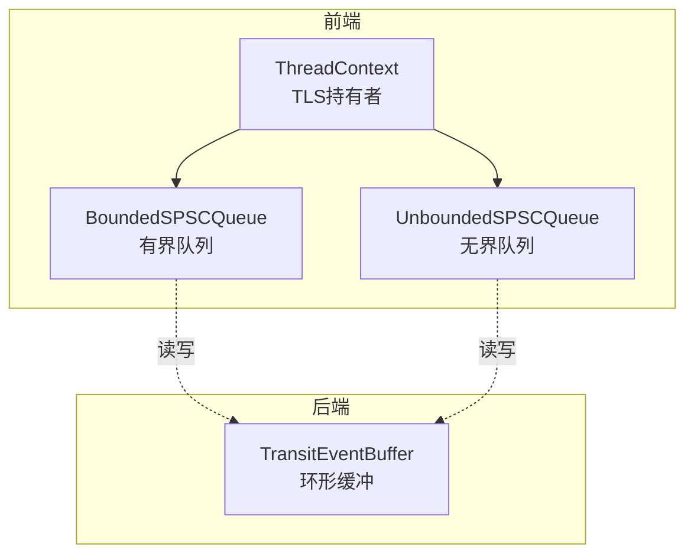
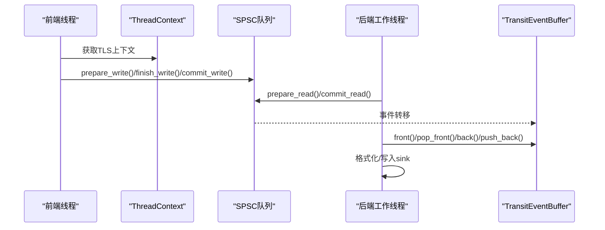
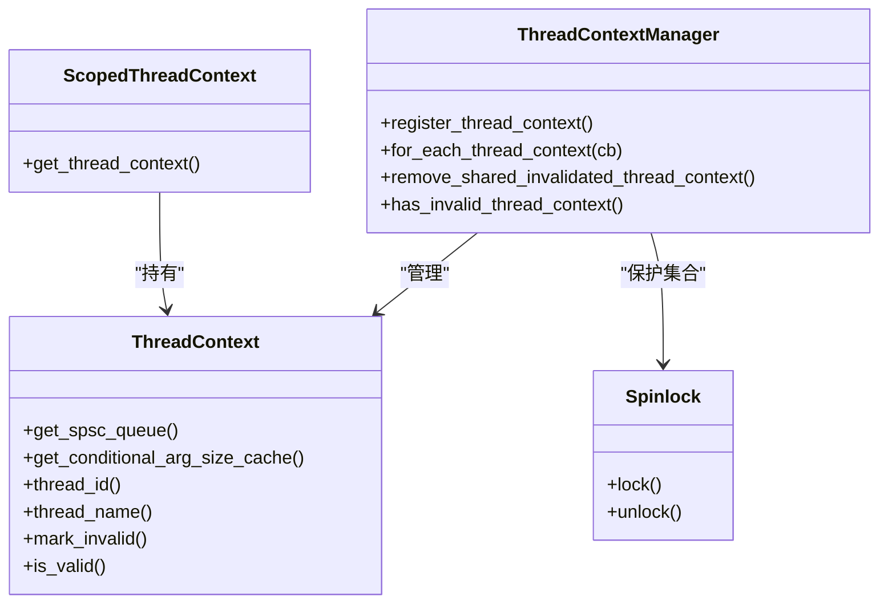
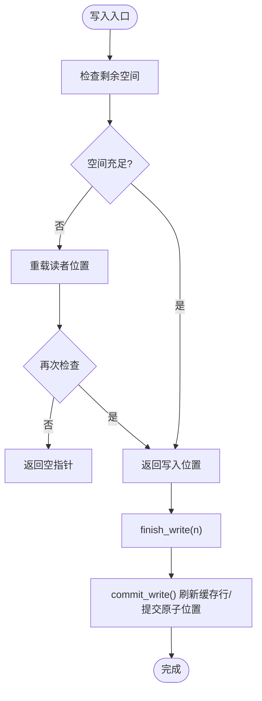
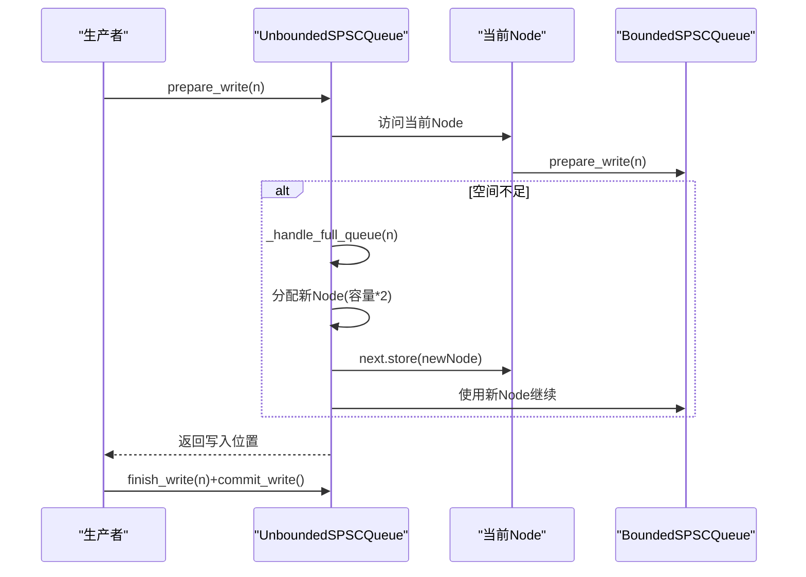
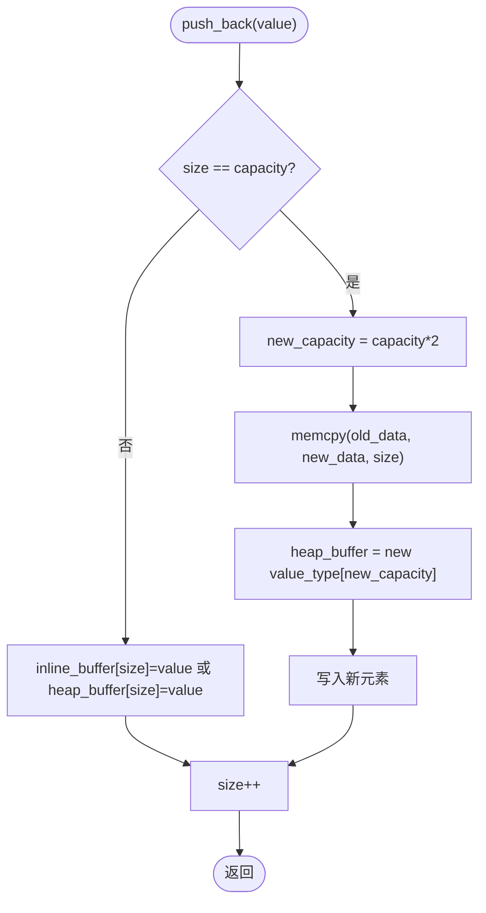
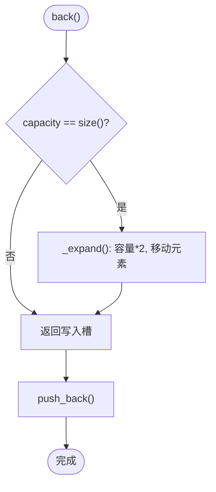
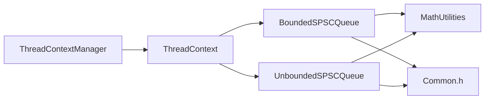

# 内存管理优化

<cite>
**本文引用的文件**
- [ThreadContextManager.h](file://include/quill/core/ThreadContextManager.h)
- [InlinedVector.h](file://include/quill/core/InlinedVector.h)
- [BoundedSPSCQueue.h](file://include/quill/core/BoundedSPSCQueue.h)
- [UnboundedSPSCQueue.h](file://include/quill/core/UnboundedSPSCQueue.h)
- [TransitEventBuffer.h](file://include/quill/backend/TransitEventBuffer.h)
- [Common.h](file://include/quill/core/Common.h)
- [Spinlock.h](file://include/quill/core/Spinlock.h)
- [MathUtilities.h](file://include/quill/core/MathUtilities.h)
- [ThreadContextManagerTest.cpp](file://test/unit_tests/ThreadContextManagerTest.cpp)
- [InlinedVectorTest.cpp](file://test/unit_tests/InlinedVectorTest.cpp)
- [UnboundedQueueTest.cpp](file://test/unit_tests/UnboundedQueueTest.cpp)
- [BoundedQueueTest.cpp](file://test/unit_tests/BoundedQueueTest.cpp)
</cite>

## 目录
1. [简介](#简介)
2. [项目结构与内存相关模块](#项目结构与内存相关模块)
3. [核心组件与内存策略](#核心组件与内存策略)
4. [架构总览](#架构总览)
5. [组件深度解析](#组件深度解析)
6. [依赖关系与耦合分析](#依赖关系与耦合分析)
7. [性能特性与内存使用模式](#性能特性与内存使用模式)
8. [故障排查与内存泄漏检测](#故障排查与内存泄漏检测)
9. [结论](#结论)
10. [附录：最佳实践清单](#附录最佳实践清单)

## 简介
本指南聚焦于Quill在多线程日志场景下的内存管理优化策略，围绕以下主题展开：
- 线程本地存储（TLS）与ThreadContextManager的设计与生命周期管理
- 预分配与SPSC队列内存池：有界队列的缓存行对齐与大页策略、无界队列的链式节点与容量翻倍
- InlinedVector的小对象内联优化与内存对齐
- 内存使用模式：峰值占用、碎片化控制与GC影响最小化
- 泄漏检测与性能监控建议

## 项目结构与内存相关模块
Quill的内存优化主要分布在前端（线程上下文与队列）与后端（传输缓冲）两部分：
- 前端：线程上下文持有各自SPSC队列，采用TLS保存上下文指针；队列支持有界/无界两种类型，分别通过BoundedSPSCQueue与UnboundedSPSCQueue实现
- 后端：TransitEventBuffer作为后端线程的环形缓冲区，支持扩容与按需收缩

**图表来源**
- [ThreadContextManager.h:53-214](file://include/quill/core/ThreadContextManager.h#L53-L214)
- [BoundedSPSCQueue.h:54-348](file://include/quill/core/BoundedSPSCQueue.h#L54-L348)
- [UnboundedSPSCQueue.h:42-337](file://include/quill/core/UnboundedSPSCQueue.h#L42-L337)
- [TransitEventBuffer.h:19-157](file://include/quill/backend/TransitEventBuffer.h#L19-L157)

**章节来源**
- [ThreadContextManager.h:53-214](file://include/quill/core/ThreadContextManager.h#L53-L214)
- [BoundedSPSCQueue.h:54-348](file://include/quill/core/BoundedSPSCQueue.h#L54-L348)
- [UnboundedSPSCQueue.h:42-337](file://include/quill/core/UnboundedSPSCQueue.h#L42-L337)
- [TransitEventBuffer.h:19-157](file://include/quill/backend/TransitEventBuffer.h#L19-L157)

## 核心组件与内存策略
- 线程上下文与TLS
  - 每个线程拥有一个ThreadContext，内部封装SPSC队列（有界或无界），并通过thread_local ScopedThreadContext确保单实例
  - ThreadContextManager维护所有线程上下文集合，使用Spinlock保护注册/注销过程
- 队列内存策略
  - 有界队列：容量为2的幂次，使用位运算掩码实现环形索引；内存对齐到缓存行，支持x86 flush/prefetch优化；Linux下可选大页
  - 无界队列：以链式Node组织，每个Node为BoundedSPSCQueue；生产者满时动态分配新Node，消费者切换时释放旧Node
- 小对象优化
  - InlinedVector在模板参数N内联存储，超过容量后堆上扩容，容量按2倍增长；SizeCacheVector用于缓存尺寸信息，容量12适配单缓存行
- 后端缓冲
  - TransitEventBuffer容量按2倍扩容，空闲时可收缩回初始容量，避免长期占用

**章节来源**
- [ThreadContextManager.h:216-338](file://include/quill/core/ThreadContextManager.h#L216-L338)
- [Spinlock.h:18-72](file://include/quill/core/Spinlock.h#L18-L72)
- [BoundedSPSCQueue.h:54-348](file://include/quill/core/BoundedSPSCQueue.h#L54-L348)
- [UnboundedSPSCQueue.h:42-337](file://include/quill/core/UnboundedSPSCQueue.h#L42-L337)
- [InlinedVector.h:35-170](file://include/quill/core/InlinedVector.h#L35-L170)
- [TransitEventBuffer.h:19-157](file://include/quill/backend/TransitEventBuffer.h#L19-L157)

## 架构总览
前端线程通过TLS获取ThreadContext，将日志事件写入对应SPSC队列；后端工作线程从队列消费并写入TransitEventBuffer，再由sink输出。

**图表来源**
- [ThreadContextManager.h:405-422](file://include/quill/core/ThreadContextManager.h#L405-L422)
- [UnboundedSPSCQueue.h:115-240](file://include/quill/core/UnboundedSPSCQueue.h#L115-L240)
- [BoundedSPSCQueue.h:105-169](file://include/quill/core/BoundedSPSCQueue.h#L105-L169)
- [TransitEventBuffer.h:72-107](file://include/quill/backend/TransitEventBuffer.h#L72-L107)

## 组件深度解析

### 线程上下文与TLS（ThreadContextManager）
- 设计要点
  - ScopedThreadContext在thread_local作用域内创建，保证每线程仅一次实例
  - ThreadContext持有SPSC队列联合体，运行时根据队列类型选择有界/无界
  - ThreadContextManager使用Spinlock保护注册/注销，提供遍历回调接口
- 生命周期
  - 构造：根据FrontendOptions选择队列类型与容量
  - 注销：线程结束时析构标记无效，后端清理阶段移除
- 关键接口路径
  - [get_local_thread_context:416-422](file://include/quill/core/ThreadContextManager.h#L416-L422)
  - [register_thread_context/remove_shared_invalidated_thread_context:243-327](file://include/quill/core/ThreadContextManager.h#L243-L327)

**图表来源**
- [ThreadContextManager.h:53-338](file://include/quill/core/ThreadContextManager.h#L53-L338)
- [Spinlock.h:18-72](file://include/quill/core/Spinlock.h#L18-L72)

**章节来源**
- [ThreadContextManager.h:216-422](file://include/quill/core/ThreadContextManager.h#L216-L422)
- [ThreadContextManagerTest.cpp:15-113](file://test/unit_tests/ThreadContextManagerTest.cpp#L15-L113)

### 有界SPSC队列（BoundedSPSCQueue）
- 容量与掩码
  - 容量取不小于请求的2的幂，掩码用于环形索引，避免昂贵取模
- 缓存行优化
  - 存储区按缓存行对齐；x86路径使用clflushopt刷新脏缓存行，prefetch预取未来访问
- 大页策略
  - Linux mmap支持HUGE_PAGE标志；失败时可降级为普通页
- 接口流程
  - prepare_write/finish_write/commit_write三段式写入
  - prepare_read/finish_read/commit_read三段式读取
  - empty()通过双读缓存与原子变量探测

**图表来源**
- [BoundedSPSCQueue.h:105-145](file://include/quill/core/BoundedSPSCQueue.h#L105-L145)
- [BoundedQueueTest.cpp:22-62](file://test/unit_tests/BoundedQueueTest.cpp#L22-L62)

**章节来源**
- [BoundedSPSCQueue.h:54-348](file://include/quill/core/BoundedSPSCQueue.h#L54-L348)
- [BoundedQueueTest.cpp:90-140](file://test/unit_tests/BoundedQueueTest.cpp#L90-L140)

### 无界SPSC队列（UnboundedSPSCQueue）
- 结构
  - Node链表，每个Node为BoundedSPSCQueue；生产者满时分配新Node，消费者切换时释放旧Node
- 扩容与收缩
  - prepare_write触发容量不足时，按2倍增长直到满足需求或达到最大上限
  - shrink允许生产者安全地将容量缩小至更小的2的幂
- 接口
  - prepare_write/finish_write/commit_write
  - prepare_read/finish_read/commit_read
  - empty/capacity/producer_capacity

**图表来源**
- [UnboundedSPSCQueue.h:115-297](file://include/quill/core/UnboundedSPSCQueue.h#L115-L297)
- [UnboundedQueueTest.cpp:13-64](file://test/unit_tests/UnboundedQueueTest.cpp#L13-L64)

**章节来源**
- [UnboundedSPSCQueue.h:42-337](file://include/quill/core/UnboundedSPSCQueue.h#L42-L337)
- [UnboundedQueueTest.cpp:13-100](file://test/unit_tests/UnboundedQueueTest.cpp#L13-L100)

### InlinedVector（小对象内联优化）
- 设计
  - 模板参数N定义内联容量；超过N后转堆上分配，容量按2倍增长
  - 使用memcpy进行trivially copyable类型的批量复制，避免LTO误报
- SizeCacheVector
  - 专门用于缓存尺寸信息，容量12且不超过单缓存行，减少额外开销
- 行为验证
  - 单元测试覆盖边界扩容、clear复用、多次realloc等场景

**图表来源**
- [InlinedVector.h:67-109](file://include/quill/core/InlinedVector.h#L67-L109)
- [InlinedVectorTest.cpp:18-51](file://test/unit_tests/InlinedVectorTest.cpp#L18-L51)

**章节来源**
- [InlinedVector.h:35-170](file://include/quill/core/InlinedVector.h#L35-L170)
- [InlinedVectorTest.cpp:18-111](file://test/unit_tests/InlinedVectorTest.cpp#L18-L111)

### TransitEventBuffer（后端环形缓冲）
- 特性
  - 容量2倍扩容，移动现有元素保持顺序
  - 空闲时可收缩回初始容量，降低长期内存占用
- 接口
  - front/back/pop_front/push_back配合size/capacity/empty

**图表来源**
- [TransitEventBuffer.h:83-148](file://include/quill/backend/TransitEventBuffer.h#L83-L148)

**章节来源**
- [TransitEventBuffer.h:19-157](file://include/quill/backend/TransitEventBuffer.h#L19-L157)

## 依赖关系与耦合分析
- ThreadContextManager与SPSC队列
  - ThreadContext持有队列联合体，运行时根据QueueType选择具体类型
  - 通过ThreadContextManager统一注册/注销，避免跨线程共享队列导致的竞态
- 队列与平台/架构
  - BoundedSPSCQueue在x86路径使用特定指令进行缓存行优化；Linux支持大页
- 辅助工具
  - MathUtilities提供next_power_of_two等幂次操作，确保容量与掩码一致性
  - Common.h定义缓存行常量与枚举，贯穿各组件

**图表来源**
- [ThreadContextManager.h:216-338](file://include/quill/core/ThreadContextManager.h#L216-L338)
- [BoundedSPSCQueue.h:54-348](file://include/quill/core/BoundedSPSCQueue.h#L54-L348)
- [UnboundedSPSCQueue.h:42-337](file://include/quill/core/UnboundedSPSCQueue.h#L42-L337)
- [MathUtilities.h:44-69](file://include/quill/core/MathUtilities.h#L44-L69)
- [Common.h:129-180](file://include/quill/core/Common.h#L129-L180)

**章节来源**
- [ThreadContextManager.h:216-338](file://include/quill/core/ThreadContextManager.h#L216-L338)
- [BoundedSPSCQueue.h:54-348](file://include/quill/core/BoundedSPSCQueue.h#L54-L348)
- [UnboundedSPSCQueue.h:42-337](file://include/quill/core/UnboundedSPSCQueue.h#L42-L337)
- [MathUtilities.h:44-69](file://include/quill/core/MathUtilities.h#L44-L69)
- [Common.h:129-180](file://include/quill/core/Common.h#L129-L180)

## 性能特性与内存使用模式
- 线程局部性与TLS
  - 每线程独立队列，避免锁竞争；ScopedThreadContext确保单实例，防止重复创建
- 预分配与缓存友好
  - 有界队列容量为2的幂，掩码索引；缓存行对齐+flush/prefetch减少伪共享与TLB抖动
  - 大页策略在Linux下可显著降低缺页与TLB压力
- 小对象优化
  - InlinedVector内联N个元素，避免频繁堆分配；SizeCacheVector固定容量12，单缓存行
- 内存峰值与碎片
  - 无界队列按2倍增长，峰值可能高于瞬时需求；可通过FrontendOptions调整上限
  - TransitEventBuffer仅在必要时扩容，空闲可收缩，降低长期碎片
- GC影响最小化
  - 尽量使用栈/线程局部内存；队列与缓冲区生命周期与线程绑定，减少GC扫描范围

[本节为通用性能讨论，无需列出“章节来源”]

## 故障排查与内存泄漏检测
- 常见问题定位
  - 线程上下文未正确移除：检查ThreadContextManager::remove_shared_invalidated_thread_context调用路径
  - 队列满导致阻塞/丢弃：确认FrontendOptions配置与队列类型（有界/无界）
  - 大页分配失败：Linux下检查权限与系统设置，必要时降级为普通页
- 单元测试参考
  - 线程上下文注册/失效/移除流程：[ThreadContextManagerTest.cpp:15-113](file://test/unit_tests/ThreadContextManagerTest.cpp#L15-L113)
  - 无界队列扩容/收缩行为：[UnboundedQueueTest.cpp:13-64](file://test/unit_tests/UnboundedQueueTest.cpp#L13-L64)
  - 有界队列读写与整数溢出：[BoundedQueueTest.cpp:64-87](file://test/unit_tests/BoundedQueueTest.cpp#L64-L87)
  - InlinedVector边界与扩容：[InlinedVectorTest.cpp:18-51](file://test/unit_tests/InlinedVectorTest.cpp#L18-L51)
- 监控建议
  - 记录每个线程队列容量与失败计数（ThreadContext::increment_failure_counter/get_and_reset_failure_counter）
  - 观察后端TransitEventBuffer容量变化，评估是否需要调整初始容量

**章节来源**
- [ThreadContextManagerTest.cpp:15-113](file://test/unit_tests/ThreadContextManagerTest.cpp#L15-L113)
- [UnboundedQueueTest.cpp:13-100](file://test/unit_tests/UnboundedQueueTest.cpp#L13-L100)
- [BoundedQueueTest.cpp:64-87](file://test/unit_tests/BoundedQueueTest.cpp#L64-L87)
- [InlinedVectorTest.cpp:18-51](file://test/unit_tests/InlinedVectorTest.cpp#L18-L51)
- [ThreadContextManager.h:188-201](file://include/quill/core/ThreadContextManager.h#L188-L201)

## 结论
Quill通过TLS隔离、SPSC队列预分配与缓存行对齐、InlinedVector小对象内联以及后端缓冲的按需扩容/收缩，构建了低开销、高吞吐的日志通道。合理配置FrontendOptions与后端缓冲参数，可在峰值场景下平衡延迟与内存占用，并有效降低GC影响。

[本节为总结性内容，无需列出“章节来源”]

## 附录：最佳实践清单
- TLS与上下文
  - 每线程仅创建一次ThreadContext，避免混合FrontendOptions
  - 在线程结束时让ScopedThreadContext自然析构，触发无效化与清理
- 队列容量与类型
  - 高吞吐短消息：优先有界队列，启用缓存行优化与大页（Linux）
  - 超长消息或突发峰值：使用无界队列，设置合理最大容量上限
- 小对象优化
  - 对尺寸缓存等短生命周期数组使用SizeCacheVector，避免额外分配
- 内存与碎片
  - 后端TransitEventBuffer空闲时可收缩；前端队列容量应与业务峰值匹配
- 监控与诊断
  - 开启失败计数统计，定期检查队列满/丢弃情况
  - 使用单元测试覆盖边界场景，确保扩容/收缩逻辑稳定

[本节为通用建议，无需列出“章节来源”]