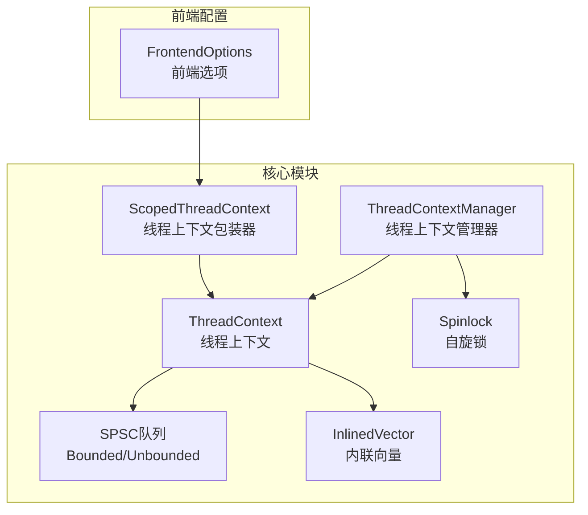
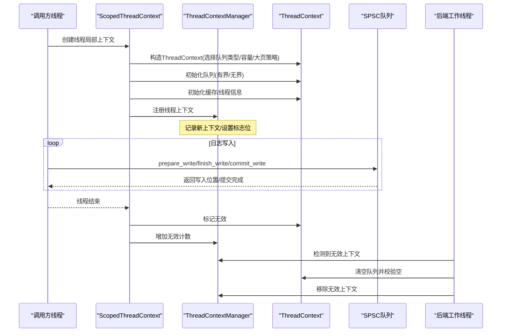
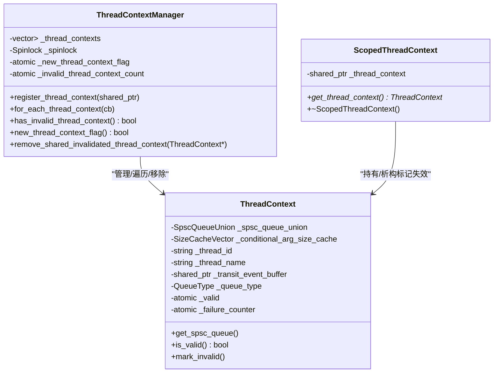
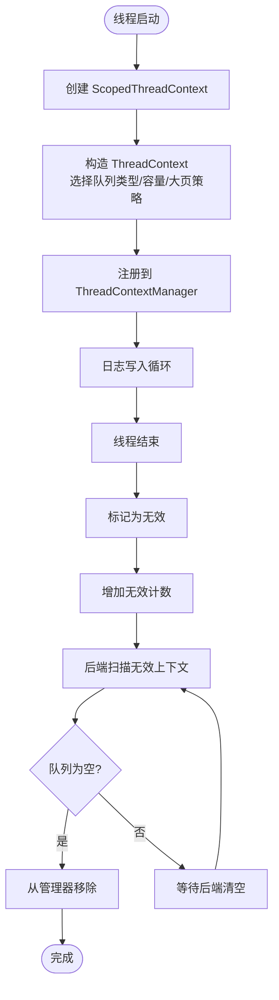
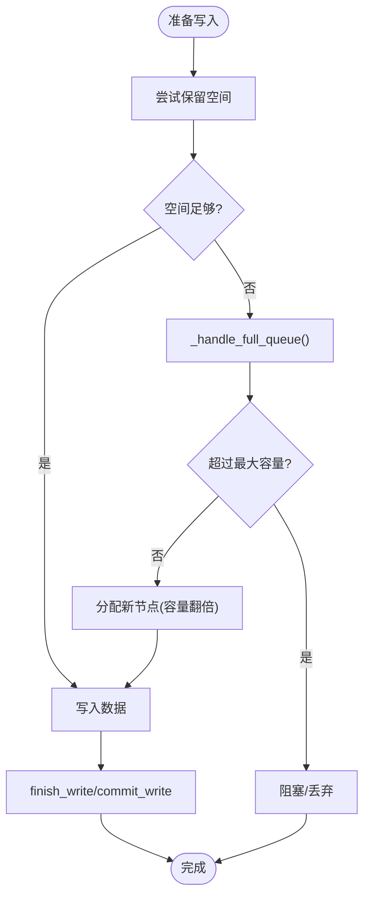
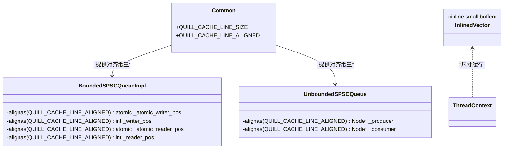
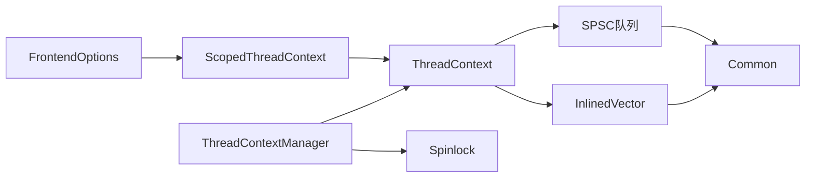

# 线程本地存储优化

<cite>
**本文引用的文件列表**
- [ThreadContextManager.h](file://include/quill/core/ThreadContextManager.h)
- [BoundedSPSCQueue.h](file://include/quill/core/BoundedSPSCQueue.h)
- [UnboundedSPSCQueue.h](file://include/quill/core/UnboundedSPSCQueue.h)
- [Spinlock.h](file://include/quill/core/Spinlock.h)
- [Common.h](file://include/quill/core/Common.h)
- [InlinedVector.h](file://include/quill/core/InlinedVector.h)
- [FrontendOptions.h](file://include/quill/core/FrontendOptions.h)
- [ThreadContextManagerTest.cpp](file://test/unit_tests/ThreadContextManagerTest.cpp)
</cite>

## 目录
1. [简介](#简介)
2. [项目结构与定位](#项目结构与定位)
3. [核心组件总览](#核心组件总览)
4. [架构概览](#架构概览)
5. [关键组件深度解析](#关键组件深度解析)
6. [依赖关系分析](#依赖关系分析)
7. [性能特性与优化](#性能特性与优化)
8. [故障排查指南](#故障排查指南)
9. [结论](#结论)
10. [附录：最佳实践与参数建议](#附录最佳实践与参数建议)

## 简介
本文件围绕 Quill 的线程本地存储（TLS）优化策略进行系统化技术说明，重点解释 ThreadContextManager 的设计原理，包括线程上下文的创建、销毁与生命周期管理；线程本地队列的内存分配策略（含预分配机制以降低动态分配开销）；线程上下文的缓存友好设计（内存对齐与缓存行优化）；以及在多线程环境下减少锁竞争、提升缓存命中率的线程安全保证与性能优化技巧，并给出多线程内存使用模式分析与最佳实践建议。

## 项目结构与定位
- 线程上下文与队列管理位于核心模块，对外通过模板函数暴露线程本地上下文获取接口，内部通过单例管理器维护全局线程上下文集合。
- 队列采用无锁单生产者单消费者（SPSC）环形缓冲实现，支持有界与无界两种形态，配合缓存行对齐与硬件优化指令，最大化吞吐与低延迟。
- 缓存友好设计体现在：
  - 缓存行对齐的关键原子变量与数据段；
  - 内联向量用于小容量尺寸缓存，确保常驻缓存行；
  - 预分配与批量提交读写，减少跨缓存行访问与 TLB 压力。

**图表来源**
- [ThreadContextManager.h:216-338](file://include/quill/core/ThreadContextManager.h#L216-L338)
- [BoundedSPSCQueue.h:54-346](file://include/quill/core/BoundedSPSCQueue.h#L54-L346)
- [UnboundedSPSCQueue.h:42-337](file://include/quill/core/UnboundedSPSCQueue.h#L42-L337)
- [InlinedVector.h:35-173](file://include/quill/core/InlinedVector.h#L35-L173)
- [Spinlock.h:18-55](file://include/quill/core/Spinlock.h#L18-L55)
- [FrontendOptions.h:16-50](file://include/quill/core/FrontendOptions.h#L16-L50)

**章节来源**
- [ThreadContextManager.h:1-430](file://include/quill/core/ThreadContextManager.h#L1-L430)
- [BoundedSPSCQueue.h:1-356](file://include/quill/core/BoundedSPSCQueue.h#L1-L356)
- [UnboundedSPSCQueue.h:1-345](file://include/quill/core/UnboundedSPSCQueue.h#L1-L345)
- [InlinedVector.h:1-183](file://include/quill/core/InlinedVector.h#L1-L183)
- [Spinlock.h:1-75](file://include/quill/core/Spinlock.h#L1-L75)
- [Common.h:121-183](file://include/quill/core/Common.h#L121-L183)
- [FrontendOptions.h:1-52](file://include/quill/core/FrontendOptions.h#L1-L52)

## 核心组件总览
- ThreadContextManager：全局单例，负责注册/遍历/移除线程上下文，提供轻量标志位与原子计数以避免频繁加锁。
- ThreadContext：每个线程的本地上下文，持有线程本地队列（有界或无界）、条件参数尺寸缓存、线程标识与有效性标记。
- ScopedThreadContext：线程局部包装器，确保每个线程仅创建一次上下文，析构时仅标记失效而非立即删除，由后端清理。
- SPSC 队列：BoundedSPSCQueue 与 UnboundedSPSCQueue，前者固定容量，后者链式节点扩容至最大容量。
- 缓存友好工具：InlinedVector 小容量内联数组，配合缓存行常量；Spinlock 提供轻量互斥保护。
- FrontendOptions：定义默认队列类型、初始容量、最大容量、阻塞重试间隔与大页策略等。

**章节来源**
- [ThreadContextManager.h:216-430](file://include/quill/core/ThreadContextManager.h#L216-L430)
- [BoundedSPSCQueue.h:54-346](file://include/quill/core/BoundedSPSCQueue.h#L54-L346)
- [UnboundedSPSCQueue.h:42-337](file://include/quill/core/UnboundedSPSCQueue.h#L42-L337)
- [InlinedVector.h:35-173](file://include/quill/core/InlinedVector.h#L35-L173)
- [Spinlock.h:18-55](file://include/quill/core/Spinlock.h#L18-L55)
- [FrontendOptions.h:16-50](file://include/quill/core/FrontendOptions.h#L16-L50)

## 架构概览
下图展示线程本地上下文的创建、注册、失效与后端清理的全生命周期流程。

**图表来源**
- [ThreadContextManager.h:243-327](file://include/quill/core/ThreadContextManager.h#L243-L327)
- [ThreadContextManager.h:340-399](file://include/quill/core/ThreadContextManager.h#L340-L399)
- [UnboundedSPSCQueue.h:115-149](file://include/quill/core/UnboundedSPSCQueue.h#L115-L149)
- [BoundedSPSCQueue.h:105-169](file://include/quill/core/BoundedSPSCQueue.h#L105-L169)

## 关键组件深度解析

### ThreadContextManager 设计与生命周期
- 单例管理器：提供全局唯一实例，线程上下文注册、遍历、移除均通过该实例完成。
- 注册与遍历：使用自旋锁保护容器，提供回调遍历接口，便于后端扫描所有上下文。
- 无效上下文处理：通过原子计数与标志位快速检测是否存在无效上下文，避免每次轮询都加锁。
- 上下文移除约束：要求无效且队列为空，确保后端清理的安全性。

**图表来源**
- [ThreadContextManager.h:216-338](file://include/quill/core/ThreadContextManager.h#L216-L338)
- [ThreadContextManager.h:340-399](file://include/quill/core/ThreadContextManager.h#L340-L399)

**章节来源**
- [ThreadContextManager.h:216-338](file://include/quill/core/ThreadContextManager.h#L216-L338)
- [ThreadContextManager.h:340-399](file://include/quill/core/ThreadContextManager.h#L340-L399)

### 线程上下文的创建与销毁
- 创建路径：通过模板函数按 FrontendOptions 配置构造 ThreadContext，选择有界/无界队列类型与容量，必要时启用大页策略。
- 销毁路径：线程结束时 ScopedThreadContext 析构，仅标记 ThreadContext 为无效，不直接删除；后端工作线程在确认队列为空后从管理器移除。

**图表来源**
- [ThreadContextManager.h:243-327](file://include/quill/core/ThreadContextManager.h#L243-L327)
- [ThreadContextManager.h:340-399](file://include/quill/core/ThreadContextManager.h#L340-L399)

**章节来源**
- [ThreadContextManager.h:340-399](file://include/quill/core/ThreadContextManager.h#L340-L399)
- [ThreadContextManagerTest.cpp:15-114](file://test/unit_tests/ThreadContextManagerTest.cpp#L15-L114)

### 线程本地队列的内存分配策略与预分配
- 有界队列（BoundedSPSCQueue）：
  - 容量为 2 的幂，掩码取模，避免昂贵运算。
  - 存储区按缓存行对齐分配，减少伪共享。
  - 写入/读取采用批量提交，减少原子操作频率。
  - 可选硬件缓存刷新与预取指令，优化 x86 平台性能。
- 无界队列（UnboundedSPSCQueue）：
  - 以链式节点扩展，每个节点为固定容量的有界队列。
  - 扩容策略：容量翻倍直至满足需求，但不超过最大容量。
  - 支持收缩（shrink），在生产者侧安全调整容量。
- 大页策略（HugePagesPolicy）：
  - Linux 下可启用大页映射，减少 TLB 压力，适合高吞吐场景。
  - 支持 Never/Always/Try 三种策略，兼容不同平台能力。

**图表来源**
- [UnboundedSPSCQueue.h:115-297](file://include/quill/core/UnboundedSPSCQueue.h#L115-L297)
- [BoundedSPSCQueue.h:105-169](file://include/quill/core/BoundedSPSCQueue.h#L105-L169)

**章节来源**
- [BoundedSPSCQueue.h:54-346](file://include/quill/core/BoundedSPSCQueue.h#L54-L346)
- [UnboundedSPSCQueue.h:42-337](file://include/quill/core/UnboundedSPSCQueue.h#L42-L337)
- [Common.h:121-183](file://include/quill/core/Common.h#L121-L183)

### 缓存友好设计：内存对齐与缓存行优化
- 缓存行常量：统一定义缓存行大小与对齐粒度，确保关键字段跨缓存行放置，避免伪共享。
- 关键原子变量对齐：写/读指针与原子计数均按缓存行对齐，降低跨缓存行争用。
- 内联向量：SizeCacheVector 使用内联数组，容量适配单缓存行，避免额外堆分配与跨行访问。
- 预分配与批量提交：有界队列采用批量提交读写，减少原子更新次数；无界队列在扩容前提交旧队列，保证消费一致性。

**图表来源**
- [Common.h:121-183](file://include/quill/core/Common.h#L121-L183)
- [BoundedSPSCQueue.h:337-345](file://include/quill/core/BoundedSPSCQueue.h#L337-L345)
- [UnboundedSPSCQueue.h:334-336](file://include/quill/core/UnboundedSPSCQueue.h#L334-L336)
- [InlinedVector.h:166-173](file://include/quill/core/InlinedVector.h#L166-L173)

**章节来源**
- [Common.h:121-183](file://include/quill/core/Common.h#L121-L183)
- [BoundedSPSCQueue.h:337-345](file://include/quill/core/BoundedSPSCQueue.h#L337-L345)
- [UnboundedSPSCQueue.h:334-336](file://include/quill/core/UnboundedSPSCQueue.h#L334-L336)
- [InlinedVector.h:166-173](file://include/quill/core/InlinedVector.h#L166-L173)

### 线程安全保证与锁竞争优化
- 自旋锁保护：管理器容器访问使用自旋锁，避免昂贵的互斥锁开销；回调遍历中尽量减少持有锁的时间。
- 原子标志位：新上下文标志与无效计数使用原子变量，降低锁竞争概率。
- 读写路径无锁：SPSC 队列写入路径为无锁，读取路径在批量提交时才进行原子更新，兼顾吞吐与一致性。
- 后端清理策略：后端线程负责扫描与清理无效上下文，避免前端线程在退出路径承担复杂清理逻辑。

**章节来源**
- [Spinlock.h:18-55](file://include/quill/core/Spinlock.h#L18-L55)
- [ThreadContextManager.h:231-240](file://include/quill/core/ThreadContextManager.h#L231-L240)
- [ThreadContextManager.h:257-279](file://include/quill/core/ThreadContextManager.h#L257-L279)
- [BoundedSPSCQueue.h:105-169](file://include/quill/core/BoundedSPSCQueue.h#L105-L169)
- [UnboundedSPSCQueue.h:115-149](file://include/quill/core/UnboundedSPSCQueue.h#L115-L149)

## 依赖关系分析
- ThreadContextManager 依赖：
  - ThreadContext：持有队列与缓存。
  - Spinlock：保护容器访问。
  - FrontendOptions：决定队列类型与容量。
- ThreadContext 依赖：
  - BoundedSPSCQueue 或 UnboundedSPSCQueue：具体队列实现。
  - InlinedVector：尺寸缓存。
  - Common：缓存行常量与枚举。
- 队列实现依赖：
  - Common：缓存行常量与大页策略。
  - 平台头文件：x86 缓存优化指令。

**图表来源**
- [ThreadContextManager.h:216-338](file://include/quill/core/ThreadContextManager.h#L216-L338)
- [FrontendOptions.h:16-50](file://include/quill/core/FrontendOptions.h#L16-L50)
- [InlinedVector.h:166-173](file://include/quill/core/InlinedVector.h#L166-L173)
- [Common.h:121-183](file://include/quill/core/Common.h#L121-L183)

**章节来源**
- [ThreadContextManager.h:216-338](file://include/quill/core/ThreadContextManager.h#L216-L338)
- [FrontendOptions.h:16-50](file://include/quill/core/FrontendOptions.h#L16-L50)
- [InlinedVector.h:166-173](file://include/quill/core/InlinedVector.h#L166-L173)
- [Common.h:121-183](file://include/quill/core/Common.h#L121-L183)

## 性能特性与优化
- 减少动态分配：
  - 队列容量预分配，避免运行期频繁分配/释放。
  - 无界队列扩容采用指数增长策略，结合最大容量限制，平衡内存与吞吐。
- 缓存行对齐与批量提交：
  - 关键原子变量与指针对齐，降低伪共享。
  - 批量提交读写，减少原子操作与缓存行刷新/预取开销。
- 大页策略：
  - 在 Linux 下启用大页可显著降低 TLB 压力，适合高吞吐日志场景。
- 锁竞争最小化：
  - 管理器使用自旋锁与原子标志位，减少锁持有时间。
  - 后端清理无效上下文，避免前端退出路径的复杂性。

**章节来源**
- [BoundedSPSCQueue.h:60-95](file://include/quill/core/BoundedSPSCQueue.h#L60-L95)
- [UnboundedSPSCQueue.h:79-85](file://include/quill/core/UnboundedSPSCQueue.h#L79-L85)
- [Common.h:121-183](file://include/quill/core/Common.h#L121-L183)
- [Spinlock.h:18-55](file://include/quill/core/Spinlock.h#L18-L55)

## 故障排查指南
- 线程上下文未被移除：
  - 现象：管理器中仍存在无效上下文。
  - 排查：确认后端是否检测到无效计数并执行清理；检查队列是否为空。
- 队列容量不足导致阻塞/丢弃：
  - 现象：日志写入阻塞或消息丢失。
  - 排查：检查 FrontendOptions 中初始容量与最大容量配置；评估日志量峰值。
- 大页分配失败：
  - 现象：启用大页策略时报错。
  - 排查：确认平台支持与权限；考虑降级为 Try 或 Never 策略。
- 缓存行相关性能问题：
  - 现象：多核环境下伪共享导致性能抖动。
  - 排查：确认关键字段已按缓存行对齐；检查批量提交策略是否生效。

**章节来源**
- [ThreadContextManager.h:257-279](file://include/quill/core/ThreadContextManager.h#L257-L279)
- [UnboundedSPSCQueue.h:244-297](file://include/quill/core/UnboundedSPSCQueue.h#L244-L297)
- [BoundedSPSCQueue.h:246-303](file://include/quill/core/BoundedSPSCQueue.h#L246-L303)

## 结论
Quill 的线程本地存储优化通过“线程局部上下文 + 无界/有界 SPSC 队列 + 缓存行对齐 + 原子标志位 + 后端清理”的组合，实现了高性能、低锁争用的日志写入路径。其预分配与批量提交策略有效降低了动态分配与缓存行刷新成本，而大页策略进一步减少了 TLB 压力。在多线程环境下，合理的容量规划与后端清理机制共同保障了系统的稳定性与可扩展性。

## 附录：最佳实践与参数建议
- 默认配置建议：
  - 队列类型：UnboundedBlocking（默认），在高吞吐场景下可考虑 UnboundedDropping 以避免阻塞。
  - 初始容量：根据峰值日志量估算，建议至少覆盖 1-2 个热周期的数据量。
  - 最大容量：根据可用内存与峰值突发设定，避免 OOM。
  - 阻塞重试间隔：在 BoundedBlocking 场景下适当增大以降低忙等。
  - 大页策略：Linux 下优先 Try，若失败再降级。
- 多线程内存使用模式：
  - 每线程独立队列，避免跨线程竞争。
  - 后端定期扫描无效上下文并清理，前端退出时仅标记无效。
  - 队列扩容与收缩需谨慎，避免频繁切换节点造成额外开销。
- 调优要点：
  - 通过监控失败计数与队列长度，动态调整初始容量与最大容量。
  - 在高并发 CPU 上，关注缓存行对齐与批量提交的效果，避免伪共享。
  - 对于超大消息，优先考虑增大最大容量或采用分片写入策略。

**章节来源**
- [FrontendOptions.h:16-50](file://include/quill/core/FrontendOptions.h#L16-L50)
- [ThreadContextManagerTest.cpp:15-114](file://test/unit_tests/ThreadContextManagerTest.cpp#L15-L114)