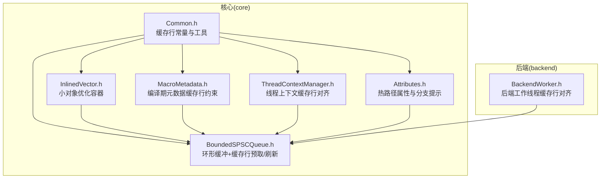
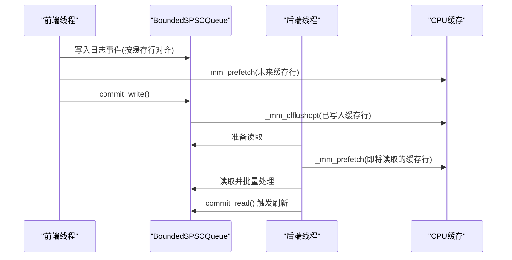
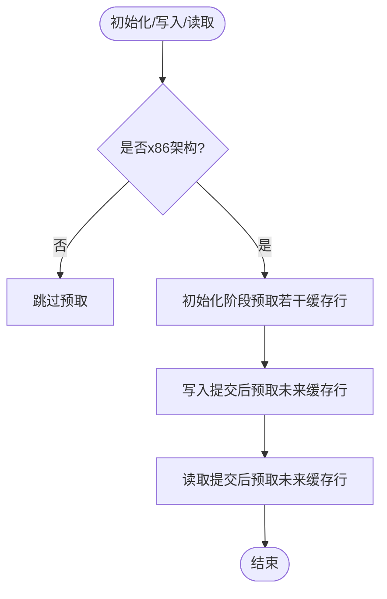
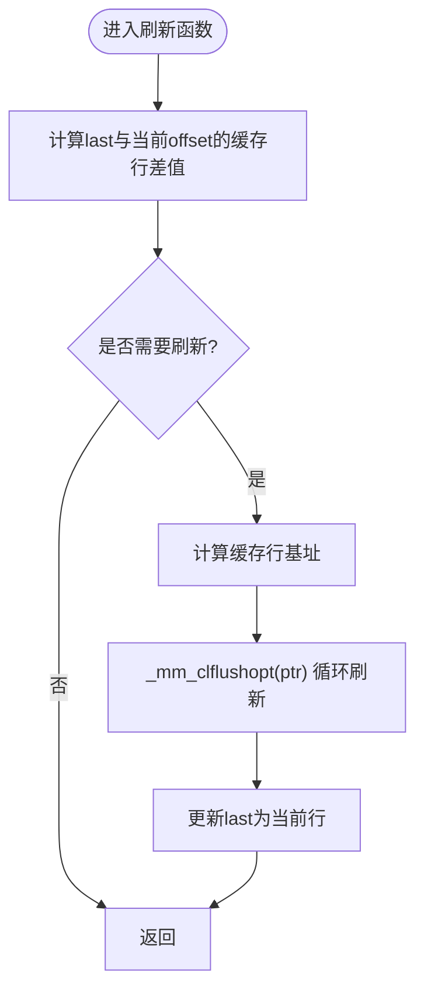
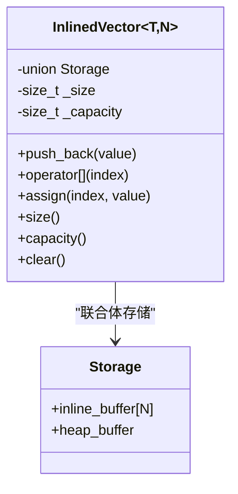
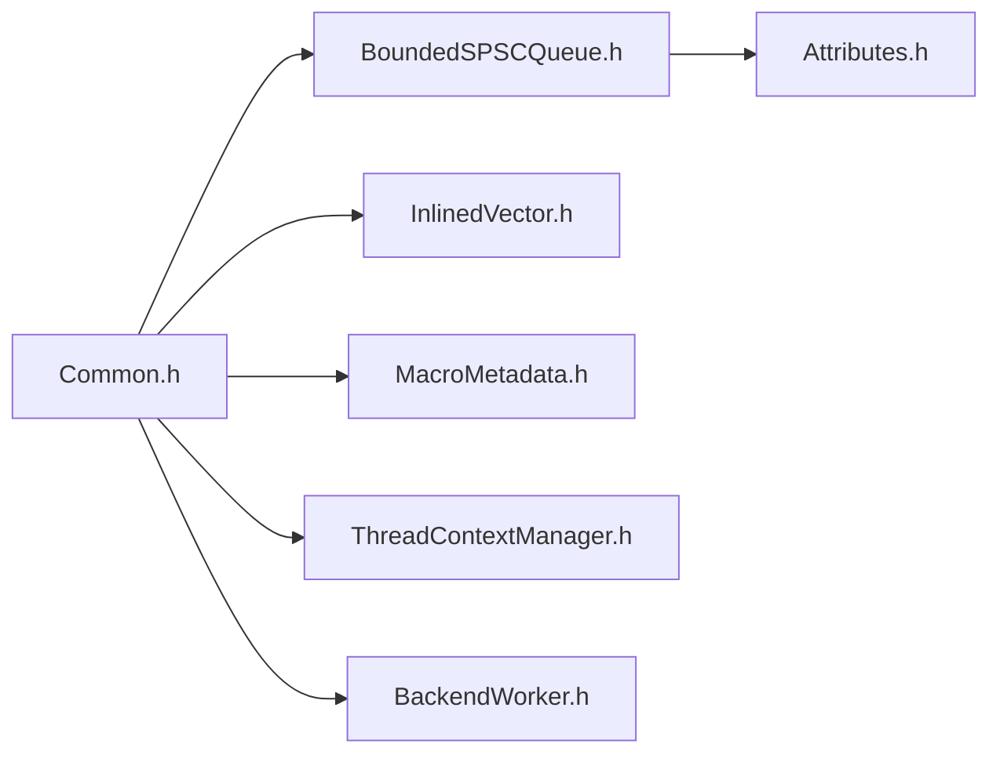

# 缓存友好设计

<cite>
**本文引用的文件列表**
- [Common.h](file://include/quill/core/Common.h)
- [InlinedVector.h](file://include/quill/core/InlinedVector.h)
- [BoundedSPSCQueue.h](file://include/quill/core/BoundedSPSCQueue.h)
- [MacroMetadata.h](file://include/quill/core/MacroMetadata.h)
- [ThreadContextManager.h](file://include/quill/core/ThreadContextManager.h)
- [BackendWorker.h](file://include/quill/backend/BackendWorker.h)
- [Attributes.h](file://include/quill/core/Attributes.h)
- [InlinedVectorTest.cpp](file://test/unit_tests/InlinedVectorTest.cpp)
</cite>

## 目录
1. [简介](#简介)
2. [项目结构与定位](#项目结构与定位)
3. [核心组件与缓存策略](#核心组件与缓存策略)
4. [架构总览](#架构总览)
5. [关键组件深度解析](#关键组件深度解析)
6. [依赖关系与耦合分析](#依赖关系与耦合分析)
7. [性能特性与优化建议](#性能特性与优化建议)
8. [故障排查与常见问题](#故障排查与常见问题)
9. [结论](#结论)
10. [附录：缓存性能监控与调优最佳实践](#附录缓存性能监控与调优最佳实践)

## 简介
本文件系统性阐述 Quill 在缓存友好设计方面的工程实践，重点覆盖以下主题：
- 缓存行尺寸常量与对齐策略（QUILL_CACHE_LINE_SIZE、QUILL_CACHE_LINE_ALIGNED）
- 缓存行污染防护与预取机制（_mm_prefetch 的使用时机与预取距离优化）
- 缓存刷新策略（clflush/clflushopt 指令的应用场景）
- 小对象优化：InlinedVector 的内联/堆分配选择策略
- 缓存性能监控与调优最佳实践

目标是帮助开发者在不牺牲可读性的前提下，理解并复用这些高性能设计模式。

## 项目结构与定位
Quill 的核心缓存优化集中在 core 层与 backend 层：
- core 层：定义通用常量、数据结构与通用算法（如 InlinedVector），并广泛采用缓存行对齐与预取策略。
- backend 层：面向后端线程的数据通路，强调无锁队列与内存屏障配合，减少伪共享与缓存抖动。

图表来源
- [Common.h:128-130](file://include/quill/core/Common.h#L128-L130)
- [InlinedVector.h:166-172](file://include/quill/core/InlinedVector.h#L166-L172)
- [MacroMetadata.h:191-193](file://include/quill/core/MacroMetadata.h#L191-L193)
- [ThreadContextManager.h:212-213](file://include/quill/core/ThreadContextManager.h#L212-L213)
- [BoundedSPSCQueue.h:66-94](file://include/quill/core/BoundedSPSCQueue.h#L66-L94)
- [BackendWorker.h:1751-1754](file://include/quill/backend/BackendWorker.h#L1751-L1754)

章节来源
- [Common.h:128-130](file://include/quill/core/Common.h#L128-L130)
- [BoundedSPSCQueue.h:66-94](file://include/quill/core/BoundedSPSCQueue.h#L66-L94)
- [InlinedVector.h:166-172](file://include/quill/core/InlinedVector.h#L166-L172)
- [MacroMetadata.h:191-193](file://include/quill/core/MacroMetadata.h#L191-L193)
- [ThreadContextManager.h:212-213](file://include/quill/core/ThreadContextManager.h#L212-L213)
- [BackendWorker.h:1751-1754](file://include/quill/backend/BackendWorker.h#L1751-L1754)

## 核心组件与缓存策略
- 缓存行常量与对齐
  - 定义：QUILL_CACHE_LINE_SIZE=64 字节；QUILL_CACHE_LINE_ALIGNED=128 字节（两倍缓存行）。
  - 用途：用于内存对齐、原子变量跨行放置、队列存储按缓存行边界对齐，避免伪共享。
- 预取与刷新
  - 预取：在初始化阶段与写入/读取提交时，使用 _mm_prefetch 提前加载未来可能访问的缓存行。
  - 刷新：使用 _mm_clflushopt 对已写入的缓存行进行刷新，确保后续读取可见性。
- 小对象优化
  - InlinedVector：通过内联缓冲区与容量翻倍策略，在小规模场景避免堆分配，提升局部性与命中率。

章节来源
- [Common.h:128-130](file://include/quill/core/Common.h#L128-L130)
- [BoundedSPSCQueue.h:75-94](file://include/quill/core/BoundedSPSCQueue.h#L75-L94)
- [BoundedSPSCQueue.h:128-135](file://include/quill/core/BoundedSPSCQueue.h#L128-L135)
- [BoundedSPSCQueue.h:200-219](file://include/quill/core/BoundedSPSCQueue.h#L200-L219)
- [InlinedVector.h:67-109](file://include/quill/core/InlinedVector.h#L67-L109)

## 架构总览
从日志到落盘的关键路径中，缓存友好设计贯穿始终：
- 前端线程将日志事件写入本地队列（按缓存行对齐），随后触发后端线程消费。
- 后端线程在批量处理时，利用预取与刷新策略降低缓存污染与可见性延迟。
- 元数据与线程上下文按缓存行对齐，避免跨行竞争。

图表来源
- [BoundedSPSCQueue.h:75-94](file://include/quill/core/BoundedSPSCQueue.h#L75-L94)
- [BoundedSPSCQueue.h:128-135](file://include/quill/core/BoundedSPSCQueue.h#L128-L135)
- [BoundedSPSCQueue.h:159-168](file://include/quill/core/BoundedSPSCQueue.h#L159-L168)
- [BoundedSPSCQueue.h:200-219](file://include/quill/core/BoundedSPSCQueue.h#L200-L219)

## 关键组件深度解析

### 缓存行常量与对齐策略
- QUILL_CACHE_LINE_SIZE=64 字节，QUILL_CACHE_LINE_ALIGNED=128 字节，用于：
  - 队列存储按缓存行对齐，避免跨行伪共享。
  - 原子变量与状态位按缓存行边界对齐，减少 false sharing。
- 使用示例：
  - 队列构造时按 QUILL_CACHE_LINE_ALIGNED 对齐分配内存。
  - 多个原子/状态变量使用 alignas(QUILL_CACHE_LINE_ALIGNED) 进行跨行放置。

章节来源
- [Common.h:128-130](file://include/quill/core/Common.h#L128-L130)
- [BoundedSPSCQueue.h:66](file://include/quill/core/BoundedSPSCQueue.h#L66)
- [BoundedSPSCQueue.h:336-345](file://include/quill/core/BoundedSPSCQueue.h#L336-L345)
- [ThreadContextManager.h:212-213](file://include/quill/core/ThreadContextManager.h#L212-L213)
- [BackendWorker.h:1751-1754](file://include/quill/backend/BackendWorker.h#L1751-L1754)

### 预取机制与预取距离优化
- 初始化阶段预取：在队列初始化时，对部分缓存行执行 _mm_prefetch，提高首次访问性能。
- 写入/读取阶段预取：在 commit_write()/commit_read() 之后，预取未来可能访问的缓存行，降低 miss 延迟。
- 预取距离选择：
  - 初始化阶段：根据容量大小选择固定数量的缓存行进行预取。
  - 写入阶段：预取当前写指针之后固定偏移（以缓存行为单位）的缓存行，平衡带宽与命中率。
- 时机与条件：
  - 仅在 x86 平台启用，使用 IMMINTRIN 头文件提供的 _mm_prefetch。
  - 预取仅在确定性路径上进行，避免过度预取导致 TLB/缓存压力。

图表来源
- [BoundedSPSCQueue.h:75-94](file://include/quill/core/BoundedSPSCQueue.h#L75-L94)
- [BoundedSPSCQueue.h:128-135](file://include/quill/core/BoundedSPSCQueue.h#L128-L135)
- [BoundedSPSCQueue.h:159-168](file://include/quill/core/BoundedSPSCQueue.h#L159-L168)

章节来源
- [BoundedSPSCQueue.h:75-94](file://include/quill/core/BoundedSPSCQueue.h#L75-L94)
- [BoundedSPSCQueue.h:128-135](file://include/quill/core/BoundedSPSCQueue.h#L128-L135)
- [BoundedSPSCQueue.h:159-168](file://include/quill/core/BoundedSPSCQueue.h#L159-L168)

### 缓存刷新策略：clflush 与 clflushopt
- 场景：
  - 写入完成后，需要确保其他核心能及时看到新写入的内容，使用 _mm_clflushopt 刷新对应缓存行。
  - 读取批处理达到阈值时，刷新已读取区域，避免重复刷新。
- 实现细节：
  - 通过计算 last 与当前 offset 的缓存行差值，逐行刷新，避免重复刷新同一行。
  - 使用掩码与模运算定位缓存行基址，减少重复计算。
- 指令选择：
  - 在支持的平台上优先使用 _mm_clflushopt，以获得更细粒度的刷新控制与更好的性能。

图表来源
- [BoundedSPSCQueue.h:200-219](file://include/quill/core/BoundedSPSCQueue.h#L200-L219)

章节来源
- [BoundedSPSCQueue.h:200-219](file://include/quill/core/BoundedSPSCQueue.h#L200-L219)

### InlinedVector 小对象优化
- 设计目标：在小规模场景下避免堆分配，提升局部性与命中率。
- 内部结构：
  - 联合体存储：inline_buffer[N] 或 heap_buffer*，运行时动态切换。
  - 容量翻倍策略：当 size==capacity 时扩容至 2*N，并复制旧数据。
- 缓存行优化：
  - SizeCacheVector 使用容量 12，确保整体不超过一个缓存行，满足编译期断言。
- 行为验证：
  - 单元测试覆盖了内联/堆分配切换、边界访问、多次扩容等场景，保证正确性与稳定性。

图表来源
- [InlinedVector.h:35-164](file://include/quill/core/InlinedVector.h#L35-L164)
- [InlinedVector.h:166-172](file://include/quill/core/InlinedVector.h#L166-L172)

章节来源
- [InlinedVector.h:35-164](file://include/quill/core/InlinedVector.h#L35-L164)
- [InlinedVector.h:166-172](file://include/quill/core/InlinedVector.h#L166-L172)
- [InlinedVectorTest.cpp:214-679](file://test/unit_tests/InlinedVectorTest.cpp#L214-L679)

### 编译期元数据与缓存行约束
- MacroMetadata 结构体在编译期捕获日志元信息，其大小被断言不超过一个缓存行，确保在热路径上的高效访问。
- 这一约束与 QUILL_CACHE_LINE_SIZE 保持一致，有助于减少缓存污染与提升命中率。

章节来源
- [MacroMetadata.h:191-193](file://include/quill/core/MacroMetadata.h#L191-L193)
- [Common.h:128-130](file://include/quill/core/Common.h#L128-L130)

### 线程上下文与后端工作线程的缓存行对齐
- 线程上下文中的失败计数器按缓存行对齐，避免与其他频繁访问的字段产生伪共享。
- 后端工作线程中的原子指针与互斥量也按缓存行对齐，降低跨核争用带来的性能损耗。

章节来源
- [ThreadContextManager.h:212-213](file://include/quill/core/ThreadContextManager.h#L212-L213)
- [BackendWorker.h:1751-1754](file://include/quill/backend/BackendWorker.h#L1751-L1754)

## 依赖关系与耦合分析
- 低耦合高内聚：
  - Common.h 提供统一的缓存行常量，被多个组件复用，形成稳定的基础设施层。
  - BoundedSPSCQueue 作为热点组件，直接依赖 IMMINTRIN 与内存对齐常量，但封装良好，便于替换或扩展。
- 可能的循环依赖：
  - 未发现直接循环依赖；各组件通过头文件包含与前置声明维持清晰边界。
- 外部依赖：
  - x86 平台特定的 intrinsics（IMMINTRIN）仅在 QUILL_X86ARCH 条件下启用，保证跨平台兼容性。

图表来源
- [Common.h:128-130](file://include/quill/core/Common.h#L128-L130)
- [BoundedSPSCQueue.h:66-94](file://include/quill/core/BoundedSPSCQueue.h#L66-L94)
- [InlinedVector.h:166-172](file://include/quill/core/InlinedVector.h#L166-L172)
- [MacroMetadata.h:191-193](file://include/quill/core/MacroMetadata.h#L191-L193)
- [ThreadContextManager.h:212-213](file://include/quill/core/ThreadContextManager.h#L212-L213)
- [BackendWorker.h:1751-1754](file://include/quill/backend/BackendWorker.h#L1751-L1754)
- [Attributes.h:104-118](file://include/quill/core/Attributes.h#L104-L118)

## 性能特性与优化建议
- 缓存行污染防护
  - 使用 QUILL_CACHE_LINE_ALIGNED 对齐关键状态位，避免跨行伪共享。
  - 在高频访问的结构体成员间插入填充或调整布局，减少相邻字段的争用。
- 预取距离与带宽权衡
  - 预取距离过短会增加 miss，过长则浪费带宽与 TLB。建议结合工作集大小与 CPU 缓存层次进行调参。
  - 对于写入路径，预取未来 10 个缓存行是一个经验起点；对于读取路径，预取未来 1~4 个缓存行通常更合适。
- 刷新策略
  - 优先使用 _mm_clflushopt；在不支持的平台回退到 _mm_clflush。
  - 批量刷新时，按缓存行粒度进行，避免重复刷新同一行。
- 小对象优化
  - InlinedVector 的容量选择应与典型负载匹配；容量过大导致缓存占用，过小则频繁扩容。
  - 对于只读或临时数据，优先考虑内联存储，减少堆分配与 TLB 压力。
- 热路径属性与分支提示
  - 使用 QUILL_ATTRIBUTE_HOT/QUILL_ATTRIBUTE_COLD 标注函数，帮助编译器优化分支预测与内联策略。
  - 对于错误路径使用冷属性，减少热路径的指令缓存污染。

章节来源
- [BoundedSPSCQueue.h:75-94](file://include/quill/core/BoundedSPSCQueue.h#L75-L94)
- [BoundedSPSCQueue.h:128-135](file://include/quill/core/BoundedSPSCQueue.h#L128-L135)
- [BoundedSPSCQueue.h:200-219](file://include/quill/core/BoundedSPSCQueue.h#L200-L219)
- [InlinedVector.h:67-109](file://include/quill/core/InlinedVector.h#L67-L109)
- [Attributes.h:104-118](file://include/quill/core/Attributes.h#L104-L118)

## 故障排查与常见问题
- 预取无效或报错
  - 确认编译器与平台支持 IMMINTRIN；仅在 x86 架构启用预取逻辑。
  - 检查 _mm_prefetch 的参数是否为有效地址且对齐到缓存行边界。
- 刷新未生效
  - 确认使用 _mm_clflushopt 的平台支持；在不支持的平台可能无法观察到效果。
  - 检查刷新范围是否覆盖实际写入的缓存行区间。
- InlinedVector 扩容异常
  - 容量翻倍策略可能导致内存峰值上升；可通过单元测试验证边界行为。
  - 注意在多线程环境下避免竞态访问，必要时引入轻量同步。
- 缓存行对齐问题
  - 若出现跨行伪共享，检查结构体成员顺序与 alignas 使用位置。
  - 使用静态断言确保关键类型不超过缓存行大小。

章节来源
- [BoundedSPSCQueue.h:22-39](file://include/quill/core/BoundedSPSCQueue.h#L22-L39)
- [BoundedSPSCQueue.h:75-94](file://include/quill/core/BoundedSPSCQueue.h#L75-L94)
- [BoundedSPSCQueue.h:200-219](file://include/quill/core/BoundedSPSCQueue.h#L200-L219)
- [InlinedVector.h:67-109](file://include/quill/core/InlinedVector.h#L67-L109)
- [InlinedVectorTest.cpp:214-679](file://test/unit_tests/InlinedVectorTest.cpp#L214-L679)

## 结论
Quill 的缓存友好设计通过“常量对齐 + 预取 + 刷新 + 小对象内联”的组合拳，显著降低了缓存污染与伪共享的影响，提升了日志系统的吞吐与延迟稳定性。遵循本文档的策略与最佳实践，可以在自研系统中快速复用这些成熟的设计模式。

## 附录：缓存性能监控与调优最佳实践
- 监控指标
  - L1/L2/L3 命中率与 miss 数
  - 伪共享/跨行争用导致的缓存行失效次数
  - 预取命中率与带宽利用率
- 工具与方法
  - 使用 perf、Intel VTune、AMD uProf 等工具采集缓存事件计数。
  - 在关键路径添加采样点，记录缓存行访问分布与刷新频率。
- 调优步骤
  - 以 QUILL_CACHE_LINE_SIZE 为基准，对齐关键结构体与原子变量。
  - 在写入/读取提交后进行预取，预取距离以 1~10 个缓存行为步进进行 A/B 测试。
  - 评估刷新策略的成本与收益，选择合适的刷新粒度与触发条件。
  - 对小对象容器（如 InlinedVector）调整初始容量与扩容策略，使其贴合工作集。