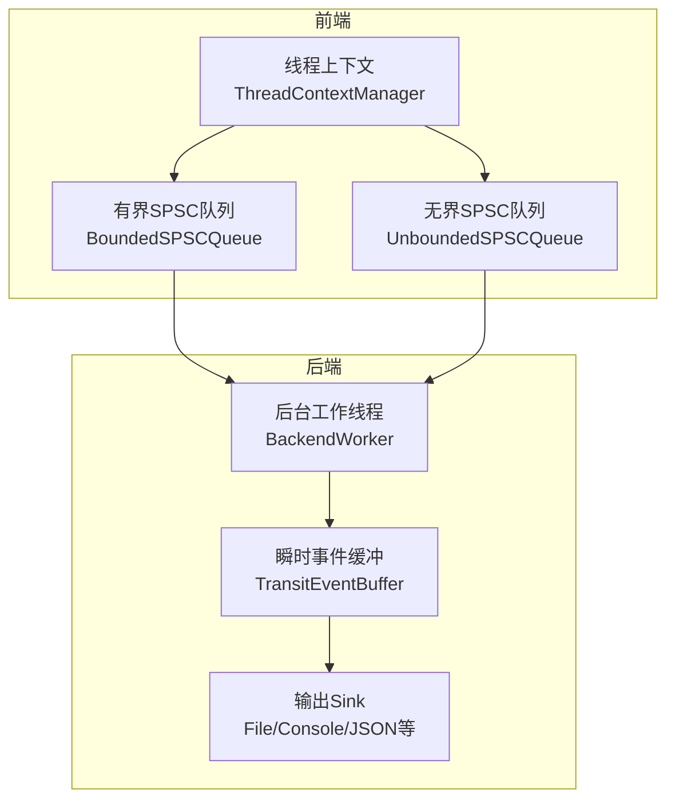
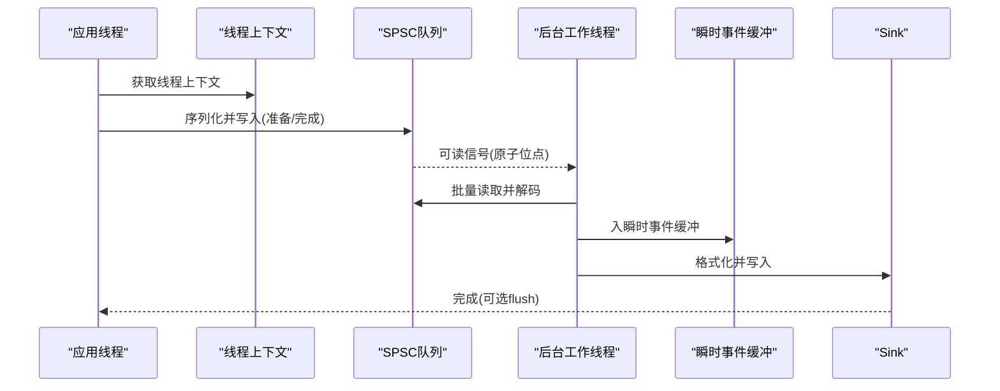
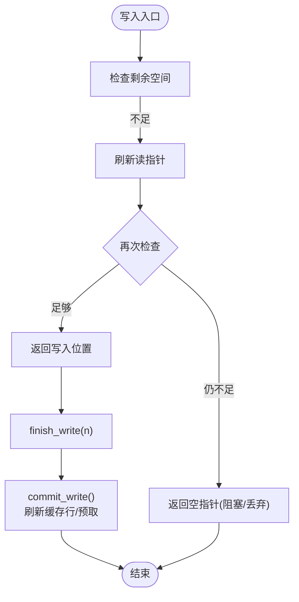
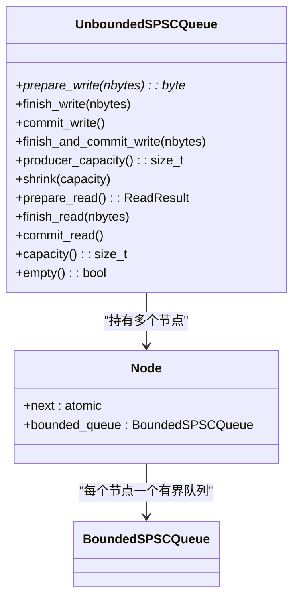
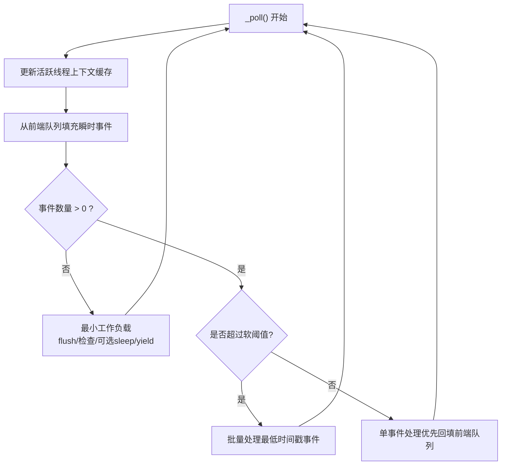
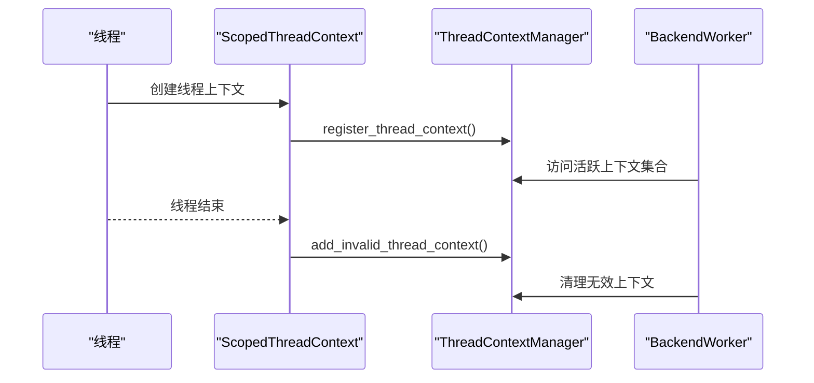
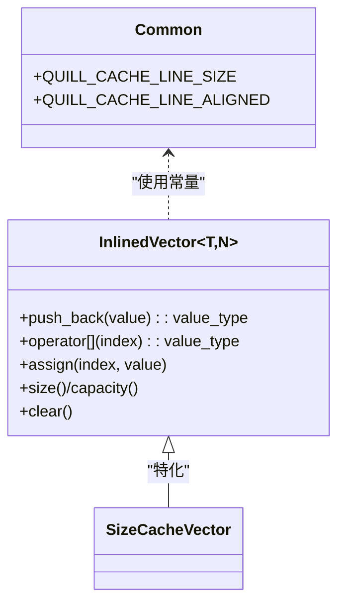
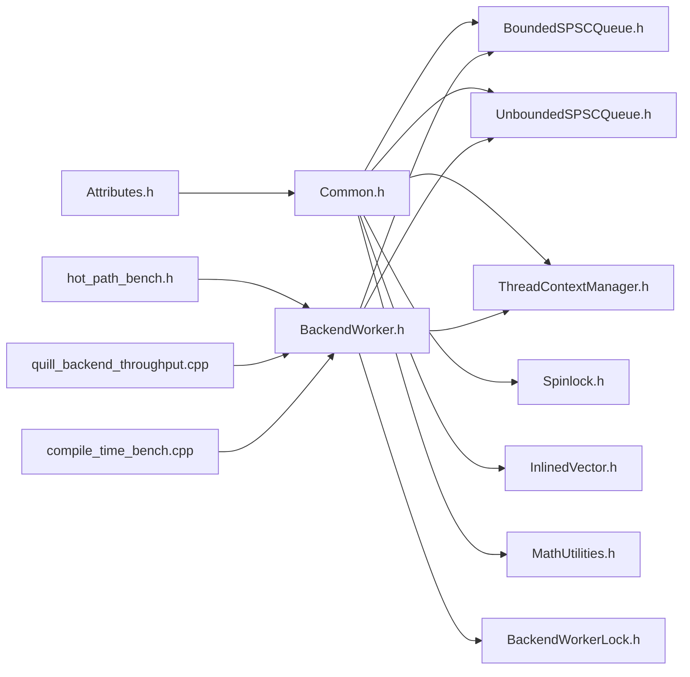

# 性能优化

<cite>
**本文引用的文件**
- [BoundedSPSCQueue.h](file://include/quill/core/BoundedSPSCQueue.h)
- [UnboundedSPSCQueue.h](file://include/quill/core/UnboundedSPSCQueue.h)
- [BackendWorker.h](file://include/quill/backend/BackendWorker.h)
- [BackendWorkerLock.h](file://include/quill/backend/BackendWorkerLock.h)
- [ThreadContextManager.h](file://include/quill/core/ThreadContextManager.h)
- [Common.h](file://include/quill/core/Common.h)
- [Attributes.h](file://include/quill/core/Attributes.h)
- [MathUtilities.h](file://include/quill/core/MathUtilities.h)
- [Spinlock.h](file://include/quill/core/Spinlock.h)
- [InlinedVector.h](file://include/quill/core/InlinedVector.h)
- [hot_path_bench.h](file://benchmarks/hot_path_latency/hot_path_bench.h)
- [quill_backend_throughput.cpp](file://benchmarks/backend_throughput/quill_backend_throughput.cpp)
- [compile_time_bench.cpp](file://benchmarks/compile_time/compile_time_bench.cpp)
- [gen_log_messages.py](file://benchmarks/compile_time/gen_log_messages.py)
</cite>

## 目录
1. [简介](#简介)
2. [项目结构](#项目结构)
3. [核心组件](#核心组件)
4. [架构总览](#架构总览)
5. [详细组件分析](#详细组件分析)
6. [依赖关系分析](#依赖关系分析)
7. [性能考量](#性能考量)
8. [故障排查指南](#故障排查指南)
9. [结论](#结论)
10. [附录](#附录)

## 简介
本技术指南聚焦于Quill的性能优化实践，围绕编译期优化、内存管理与缓存友好设计、队列模式与吞吐/延迟权衡、以及基准测试方法展开。目标是帮助开发者在不同应用场景下选择合适的队列类型、参数与后端选项，以获得最佳的吞吐量与延迟表现，并通过基准测试验证优化效果。

## 项目结构
Quill采用“前端（单生产者）+ 后端（单消费者）”的锁序队列模型，配合线程本地上下文与后台工作线程，形成高性能的日志流水线。核心路径如下：
- 前端：每个线程拥有独立的SPSC队列（有界/无界），用于快速入队。
- 后端：后台线程轮询前端队列，批量解码并格式化，最终写入各类Sink。
- 队列：有界队列使用环形缓冲与缓存行对齐；无界队列基于节点链表动态扩容。
- 内存：线程本地上下文、大小缓存向量、自定义分配与对齐策略。

图示来源
- [BackendWorker.h](file://include/quill/backend/BackendWorker.h)
- [ThreadContextManager.h](file://include/quill/core/ThreadContextManager.h)
- [BoundedSPSCQueue.h](file://include/quill/core/BoundedSPSCQueue.h)
- [UnboundedSPSCQueue.h](file://include/quill/core/UnboundedSPSCQueue.h)

章节来源
- [BackendWorker.h](file://include/quill/backend/BackendWorker.h)
- [ThreadContextManager.h](file://include/quill/core/ThreadContextManager.h)
- [BoundedSPSCQueue.h](file://include/quill/core/BoundedSPSCQueue.h)
- [UnboundedSPSCQueue.h](file://include/quill/core/UnboundedSPSCQueue.h)

## 核心组件
- 队列系统
  - 有界SPSC环形队列：容量按2次幂对齐，缓存行对齐分配，写入/读取原子位点与批提交减少争用。
  - 无界SPSC队列：节点链表动态扩容，支持指数增长到最大容量，避免阻塞。
- 后台工作线程
  - 轮询前端队列，批量解码与格式化，支持睡眠/让出策略降低空闲负载。
  - 支持严格时间戳顺序与Grace Period，保证跨线程日志顺序正确性。
- 线程上下文
  - 每线程唯一上下文，持有对应队列，注册/注销由管理器维护。
- 内存与缓存
  - 缓存行常量、对齐分配、缓存行内原子变量、SizeCacheVector占用不超过一个缓存行。
- 编译期与运行期优化
  - 属性宏（hot/cold/likely/unlikely）、模板特化、2次幂容量与掩码运算、条件分支提示。

章节来源
- [BoundedSPSCQueue.h](file://include/quill/core/BoundedSPSCQueue.h)
- [UnboundedSPSCQueue.h](file://include/quill/core/UnboundedSPSCQueue.h)
- [BackendWorker.h](file://include/quill/backend/BackendWorker.h)
- [ThreadContextManager.h](file://include/quill/core/ThreadContextManager.h)
- [Common.h](file://include/quill/core/Common.h)
- [Attributes.h](file://include/quill/core/Attributes.h)
- [MathUtilities.h](file://include/quill/core/MathUtilities.h)
- [InlinedVector.h](file://include/quill/core/InlinedVector.h)

## 架构总览
Quill的性能关键在于“极简的前端入队路径 + 批处理的后端解码路径”。前端仅做序列化与入队，后端集中处理格式化与IO，两者通过SPSC队列解耦。

图示来源
- [BackendWorker.h](file://include/quill/backend/BackendWorker.h)
- [ThreadContextManager.h](file://include/quill/core/ThreadContextManager.h)
- [BoundedSPSCQueue.h](file://include/quill/core/BoundedSPSCQueue.h)
- [UnboundedSPSCQueue.h](file://include/quill/core/UnboundedSPSCQueue.h)

## 详细组件分析

### 有界SPSC环形队列（BoundedSPSCQueue）
- 容量与掩码
  - 容量强制为2的幂，使用位运算实现环形索引，提升吞吐。
  - 使用掩码避免昂贵取模运算，减少分支预测失败。
- 缓存行对齐与预取
  - 存储区按缓存行对齐分配，写入/读取路径进行缓存行刷新与预取，降低TLB与缓存抖动。
  - 在x86上使用flush/prefetch指令优化写入可见性与后续读取命中率。
- 写入/读取流程
  - 写入：先检查剩余空间，不足则刷新读指针再判断；成功后返回写入位置，finish_and_commit组合写入与提交。
  - 读取：空队列时刷新写指针；批量提交读取进度，减少原子写次数。
- 大页策略
  - 支持Linux大页策略（Never/Always/Try），在高吞吐场景下减少页表开销。

图示来源
- [BoundedSPSCQueue.h](file://include/quill/core/BoundedSPSCQueue.h)

章节来源
- [BoundedSPSCQueue.h](file://include/quill/core/BoundedSPSCQueue.h)
- [MathUtilities.h](file://include/quill/core/MathUtilities.h)
- [Common.h](file://include/quill/core/Common.h)

### 无界SPSC队列（UnboundedSPSCQueue）
- 动态扩容
  - 当前节点满时，按需指数增长创建新节点，最大容量受上限控制，避免无限增长。
  - 切换节点前提交当前写入，消费端切换时一次性释放旧节点。
- 生产者/消费者一致性
  - 生产者只在新节点commit_write后才切换，消费者在确认旧节点读完后再删除并切换。
- 容量查询与收缩
  - 提供容量查询与收缩接口，允许在生产者安全路径下调小容量，避免过度分配。

图示来源
- [UnboundedSPSCQueue.h](file://include/quill/core/UnboundedSPSCQueue.h)
- [BoundedSPSCQueue.h](file://include/quill/core/BoundedSPSCQueue.h)

章节来源
- [UnboundedSPSCQueue.h](file://include/quill/core/UnboundedSPSCQueue.h)

### 后台工作线程（BackendWorker）
- 主循环与唤醒
  - 主循环根据软/硬阈值决定批量处理或逐条处理；空闲时可睡眠或yield，降低CPU占用。
  - 通过条件变量与标志位唤醒，避免忙等。
- 事件缓冲与格式化
  - 将前端消息反序列化为瞬时事件，按需格式化命名参数，避免重复解析。
- 时间戳与顺序
  - 支持TSC时钟转换与系统时钟，启用Grace Period时拒绝未来时间戳，确保顺序正确。
- 资源清理
  - 退出时等待队列清空并刷新所有Sink；清理无效上下文与日志器。

图示来源
- [BackendWorker.h](file://include/quill/backend/BackendWorker.h)

章节来源
- [BackendWorker.h](file://include/quill/backend/BackendWorker.h)

### 线程上下文与注册（ThreadContextManager）
- 上下文生命周期
  - 每线程唯一上下文，构造时注册，析构时标记失效并通知后端清理。
- 注册/注销
  - 管理器使用自旋锁保护容器，提供新增/移除无效上下文的原子计数。
- 队列类型判定
  - 通过枚举区分有界/无界、阻塞/丢弃队列类型，便于后端统一处理。

图示来源
- [ThreadContextManager.h](file://include/quill/core/ThreadContextManager.h)
- [BackendWorker.h](file://include/quill/backend/BackendWorker.h)

章节来源
- [ThreadContextManager.h](file://include/quill/core/ThreadContextManager.h)

### 内存管理与缓存友好设计
- 缓存行常量与对齐
  - 缓存行大小常量与对齐常量，队列与原子变量按缓存行对齐，减少伪共享。
- 自定义分配与大页
  - Windows使用对齐分配；Linux支持mmap+metadata记录+大页策略，提高大缓冲区性能。
- 小型缓存向量
  - SizeCacheVector容量为12，满足常见参数尺寸缓存需求且不超过一个缓存行，降低内存占用与提升局部性。

图示来源
- [Common.h](file://include/quill/core/Common.h)
- [InlinedVector.h](file://include/quill/core/InlinedVector.h)

章节来源
- [Common.h](file://include/quill/core/Common.h)
- [InlinedVector.h](file://include/quill/core/InlinedVector.h)

### 编译期优化与模板特化
- 属性宏
  - hot/cold/likely/unlikely等属性宏用于引导编译器优化与分支预测。
- 模板特化
  - 针对不同队列类型（有界/无界）与不同前端队列类型，后端通过模板特化与constexpr分支选择路径，减少虚函数与多态开销。
- 2次幂容量
  - next_power_of_two与掩码运算替代取模，提升环形索引效率。

章节来源
- [Attributes.h](file://include/quill/core/Attributes.h)
- [MathUtilities.h](file://include/quill/core/MathUtilities.h)
- [BackendWorker.h](file://include/quill/backend/BackendWorker.h)

## 依赖关系分析

图示来源
- [Attributes.h](file://include/quill/core/Attributes.h)
- [Common.h](file://include/quill/core/Common.h)
- [BoundedSPSCQueue.h](file://include/quill/core/BoundedSPSCQueue.h)
- [UnboundedSPSCQueue.h](file://include/quill/core/UnboundedSPSCQueue.h)
- [ThreadContextManager.h](file://include/quill/core/ThreadContextManager.h)
- [Spinlock.h](file://include/quill/core/Spinlock.h)
- [InlinedVector.h](file://include/quill/core/InlinedVector.h)
- [MathUtilities.h](file://include/quill/core/MathUtilities.h)
- [BackendWorker.h](file://include/quill/backend/BackendWorker.h)
- [BackendWorkerLock.h](file://include/quill/backend/BackendWorkerLock.h)
- [hot_path_bench.h](file://benchmarks/hot_path_latency/hot_path_bench.h)
- [quill_backend_throughput.cpp](file://benchmarks/backend_throughput/quill_backend_throughput.cpp)
- [compile_time_bench.cpp](file://benchmarks/compile_time/compile_time_bench.cpp)

章节来源
- [BackendWorker.h](file://include/quill/backend/BackendWorker.h)
- [ThreadContextManager.h](file://include/quill/core/ThreadContextManager.h)
- [BoundedSPSCQueue.h](file://include/quill/core/BoundedSPSCQueue.h)
- [UnboundedSPSCQueue.h](file://include/quill/core/UnboundedSPSCQueue.h)

## 性能考量

### 队列模式与吞吐/延迟权衡
- 有界队列（阻塞/丢弃）
  - 优点：固定内存、低碎片、写入路径短；适合对内存与延迟敏感的实时系统。
  - 适用：CPU密集、高并发、对背压有明确要求的场景。
  - 注意：容量过小会导致频繁阻塞/丢弃；容量过大增加缓存压力。
- 无界队列（阻塞/丢弃）
  - 优点：避免阻塞，自动扩容；适合突发流量与不可预测负载。
  - 适用：峰值波动大、可接受内存增长的系统。
  - 注意：节点链表增长带来额外指针与原子操作开销；需设置合理上限防止内存膨胀。
- 阻塞 vs 丢弃
  - 阻塞：保障不丢失但可能放大尾延迟；适合强一致日志。
  - 丢弃：降低尾延迟但可能丢消息；适合高吞吐低时延场景。

配置建议
- 实时系统：优先有界阻塞队列，容量按峰值QPS×P99延迟估算，预留10–20%余量。
- 互联网服务：优先无界丢弃队列，初始容量适中，最大容量设为可接受的峰值内存上限。
- 混合策略：热点线程使用有界阻塞，后台线程使用无界丢弃，平衡尾延迟与吞吐。

### 内存与缓存优化
- 对齐与大页
  - 在Linux上启用大页策略（Try/Always）可显著降低TLB抖动，提升大缓冲区性能。
- 缓存行亲和
  - 队列与原子变量按缓存行对齐，减少伪共享；后台线程绑定CPU亲和，降低跨核迁移。
- 小型缓存向量
  - SizeCacheVector限制在12项以内，确保常驻缓存行，减少内存带宽占用。

### 后端线程与批处理
- 软/硬阈值
  - 软阈值用于“优先回填前端队列”，硬阈值用于批量处理，避免长时间独占前端队列。
- Grace Period
  - 启用时间戳顺序时，拒绝未来时间戳，避免乱序与额外重排成本。
- 睡眠/让出
  - 空闲时sleep_for或yield，降低功耗与热噪声，同时保持响应性。

### 编译期优化
- 属性宏
  - 使用hot/cold/likely/unlikely引导分支与函数路径优化，减少误预测与代码膨胀。
- 模板特化
  - 针对不同队列类型与前端队列类型进行特化，减少虚函数调用与分支开销。

## 故障排查指南
- 后端实例冲突
  - 若检测到重复后端实例，抛出异常并提示统一链接方式。可通过BackendWorkerLock定位问题。
- 队列容量异常
  - 无界队列达到上限会抛出异常，提示增大FrontendOptions中的unbounded_queue_max_capacity。
- 线程上下文异常
  - 注销无效上下文时需确保队列为空；否则抛出断言错误，检查线程生命周期与flush时机。
- 后端线程CPU亲和
  - 设置cpu_affinity后需确保目标CPU存在；否则可能导致后端线程无法启动或性能异常。

章节来源
- [BackendWorkerLock.h](file://include/quill/backend/BackendWorkerLock.h)
- [UnboundedSPSCQueue.h](file://include/quill/core/UnboundedSPSCQueue.h)
- [ThreadContextManager.h](file://include/quill/core/ThreadContextManager.h)
- [BackendWorker.h](file://include/quill/backend/BackendWorker.h)

## 结论
Quill通过“前端轻量入队 + 后端批处理”的架构，在保证低尾延迟的同时实现了高吞吐。有界队列适合对内存与延迟敏感的实时系统，无界队列适合突发流量场景。结合缓存行对齐、大页策略、CPU亲和与编译期优化，可在不同硬件与工作负载下取得稳定优异的性能表现。建议在实际项目中以基准测试为依据，逐步调整队列类型、容量与后端选项，达成最优平衡。

## 附录

### 基准测试方法与结果解读
- 热路径延迟（RDTSC）
  - 使用RDTSC采样与run_benchmark框架，统计各分位延迟（50/75/90/95/99/99.9/Worst），评估尾延迟分布。
  - 示例脚本生成大量日志语句，覆盖多种参数类型，模拟真实业务负载。
- 后端吞吐（后台线程自旋）
  - 通过测量总耗时计算每秒消息数（百万级msgs/sec），评估后端解码与写入能力。
- 编译时开销
  - 通过生成包含大量LOG_INFO的C++文件，测量编译时间，评估宏与模板展开对编译速度的影响。

章节来源
- [hot_path_bench.h](file://benchmarks/hot_path_latency/hot_path_bench.h)
- [quill_backend_throughput.cpp](file://benchmarks/backend_throughput/quill_backend_throughput.cpp)
- [compile_time_bench.cpp](file://benchmarks/compile_time/compile_time_bench.cpp)
- [gen_log_messages.py](file://benchmarks/compile_time/gen_log_messages.py)