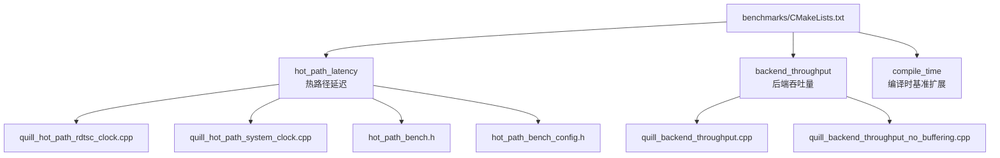
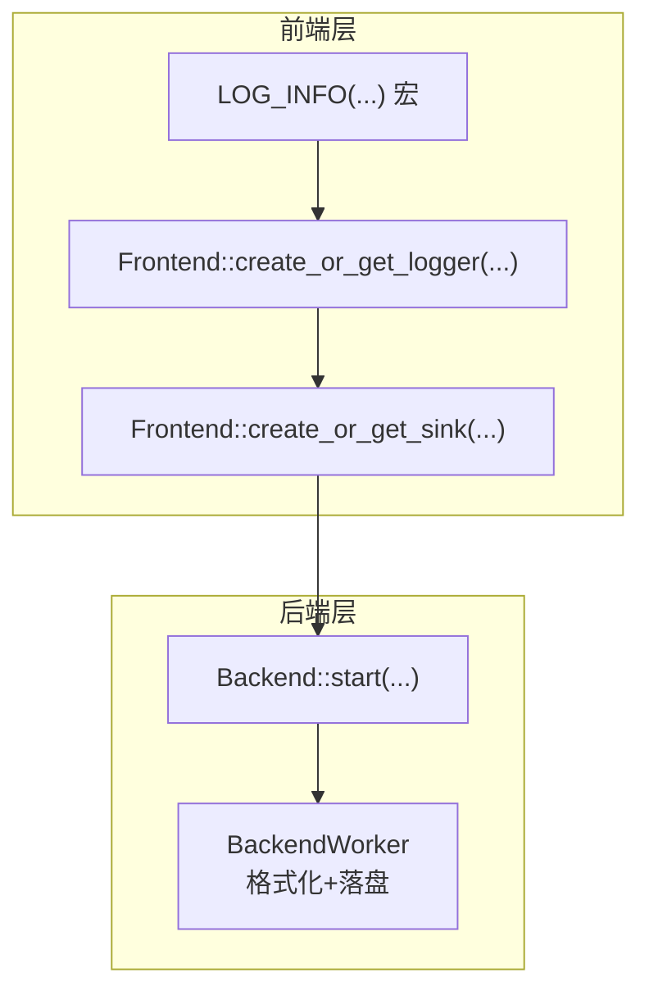
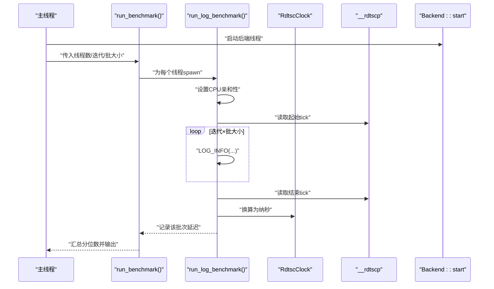
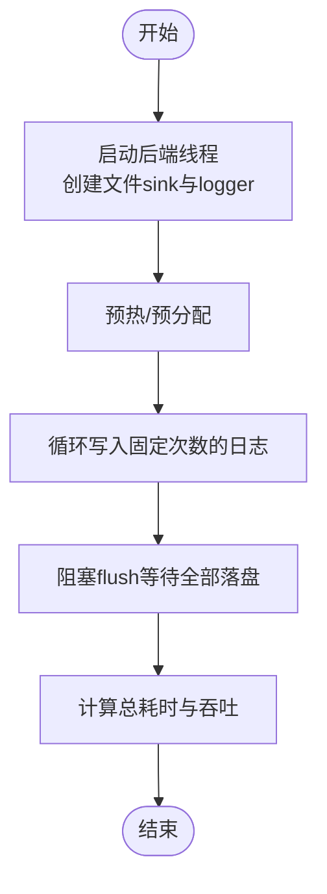
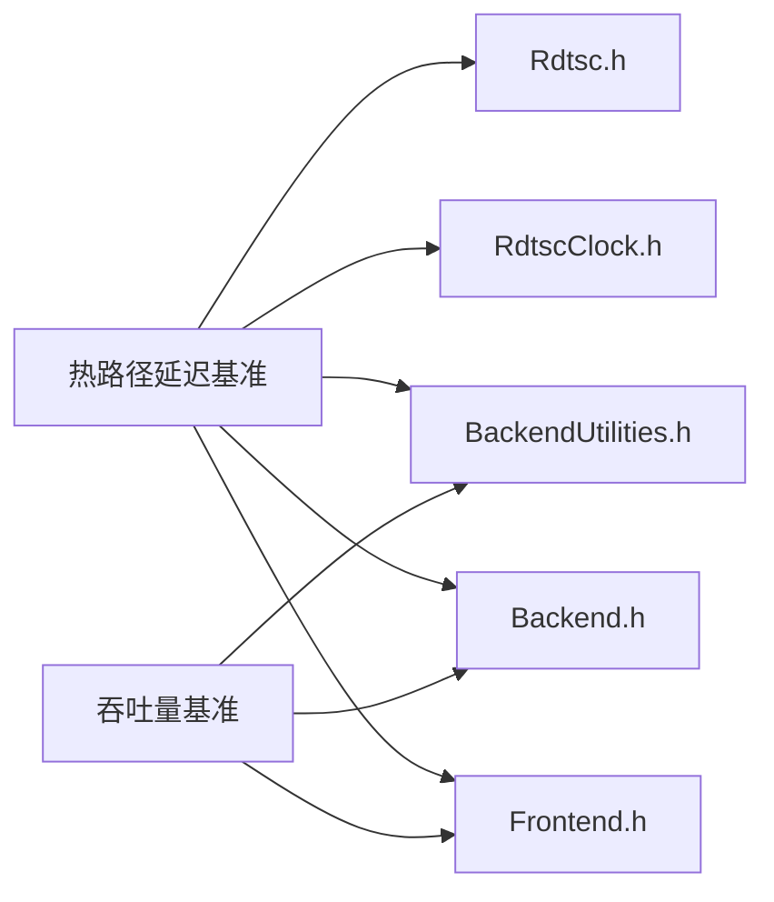

# 性能基准测试

<cite>
**本文引用的文件**
- [benchmarks/hot_path_latency/quill_hot_path_rdtsc_clock.cpp](file://benchmarks/hot_path_latency/quill_hot_path_rdtsc_clock.cpp)
- [benchmarks/hot_path_latency/quill_hot_path_system_clock.cpp](file://benchmarks/hot_path_latency/quill_hot_path_system_clock.cpp)
- [benchmarks/hot_path_latency/hot_path_bench.h](file://benchmarks/hot_path_latency/hot_path_bench.h)
- [benchmarks/hot_path_latency/hot_path_bench_config.h](file://benchmarks/hot_path_latency/hot_path_bench_config.h)
- [benchmarks/backend_throughput/quill_backend_throughput.cpp](file://benchmarks/backend_throughput/quill_backend_throughput.cpp)
- [benchmarks/backend_throughput/quill_backend_throughput_no_buffering.cpp](file://benchmarks/backend_throughput/quill_backend_throughput_no_buffering.cpp)
- [include/quill/backend/RdtscClock.h](file://include/quill/backend/RdtscClock.h)
- [include/quill/core/Rdtsc.h](file://include/quill/core/Rdtsc.h)
- [include/quill/backend/BackendUtilities.h](file://include/quill/backend/BackendUtilities.h)
- [include/quill/Frontend.h](file://include/quill/Frontend.h)
- [include/quill/Backend.h](file://include/quill/Backend.h)
- [benchmarks/CMakeLists.txt](file://benchmarks/CMakeLists.txt)
- [docs/frontend_options.rst](file://docs/frontend_options.rst)
</cite>

## 目录
1. [简介](#简介)
2. [项目结构](#项目结构)
3. [核心组件](#核心组件)
4. [架构总览](#架构总览)
5. [详细组件分析](#详细组件分析)
6. [依赖关系分析](#依赖关系分析)
7. [性能考量](#性能考量)
8. [故障排查指南](#故障排查指南)
9. [结论](#结论)
10. [附录](#附录)

## 简介
本文件面向Quill的性能基准测试体系，聚焦两类关键评测：热路径延迟与后端吞吐量。热路径延迟测试通过RDTSC高精度计时与多线程并发执行，评估从调用端到后端落盘的端到端延迟分布；后端吞吐量测试则在不同队列策略、日志级别、消息大小与并发线程数下，量化每秒日志条目数量与总耗时。文档同时给出统计分析方法（百分位数、标准差、回归检测）、测试环境配置建议（CPU亲和性、禁用超线程、系统资源隔离），并提供基线建立、回归测试自动化与持续监控的实践方案。

## 项目结构
基准测试位于benchmarks目录，按功能划分为热路径延迟与后端吞吐量两套子工程，并通过顶层CMake统一编译。

图示来源
- [benchmarks/CMakeLists.txt:1-3](file://benchmarks/CMakeLists.txt#L1-L3)

章节来源
- [benchmarks/CMakeLists.txt:1-3](file://benchmarks/CMakeLists.txt#L1-L3)

## 核心组件
- 热路径延迟测试框架
  - 基于RDTSC的高精度时间戳采集与换算，结合多线程并发与批处理等待，统计各线程迭代延迟并合并输出分位数。
  - 支持两种时钟源：TSC与系统时钟，便于对比不同时间源对延迟分布的影响。
- 后端吞吐量测试
  - 在固定迭代次数下，记录前端写入到后端完成flush的总时长，计算平均吞吐量（百万条/秒）。
  - 提供“无缓冲”版本以验证队列软/硬限制对吞吐的影响。
- 时间与计时基础设施
  - RDTSC时钟同步与换算：RdtscClock负责ticks到纳秒的换算与周期性重同步，保证长期精度。
  - 平台无关的RDTSC读取封装：跨平台适配不同指令集与架构。
  - 线程亲和性设置：BackendUtilities提供跨平台的CPU亲和性设置接口，用于降低上下文切换与缓存抖动。

章节来源
- [benchmarks/hot_path_latency/quill_hot_path_rdtsc_clock.cpp:1-95](file://benchmarks/hot_path_latency/quill_hot_path_rdtsc_clock.cpp#L1-L95)
- [benchmarks/hot_path_latency/quill_hot_path_system_clock.cpp:1-98](file://benchmarks/hot_path_latency/quill_hot_path_system_clock.cpp#L1-L98)
- [benchmarks/hot_path_latency/hot_path_bench.h:1-202](file://benchmarks/hot_path_latency/hot_path_bench.h#L1-L202)
- [benchmarks/hot_path_latency/hot_path_bench_config.h:1-37](file://benchmarks/hot_path_latency/hot_path_bench_config.h#L1-L37)
- [benchmarks/backend_throughput/quill_backend_throughput.cpp:1-69](file://benchmarks/backend_throughput/quill_backend_throughput.cpp#L1-L69)
- [benchmarks/backend_throughput/quill_backend_throughput_no_buffering.cpp:1-72](file://benchmarks/backend_throughput/quill_backend_throughput_no_buffering.cpp#L1-L72)
- [include/quill/backend/RdtscClock.h:1-265](file://include/quill/backend/RdtscClock.h#L1-L265)
- [include/quill/core/Rdtsc.h:1-114](file://include/quill/core/Rdtsc.h#L1-L114)
- [include/quill/backend/BackendUtilities.h:1-186](file://include/quill/backend/BackendUtilities.h#L1-L186)

## 架构总览
热路径延迟与后端吞吐量测试共享同一后端线程模型：前端线程通过各自的SPSC队列向后端线程提交事件，后端线程负责格式化与落盘。延迟测试关注前端写入到后端处理的延迟分布；吞吐量测试关注在不同队列策略下的整体吞吐。

图示来源
- [include/quill/Frontend.h:148-198](file://include/quill/Frontend.h#L148-L198)
- [include/quill/Backend.h:42-110](file://include/quill/Backend.h#L42-L110)

## 详细组件分析

### 热路径延迟测试框架
- 多线程并发与批处理
  - 主线程设置CPU亲和性，各工作线程各自绑定核心并执行多次迭代，每次迭代内批量写入若干消息，随后通过可配置等待时间让后端追赶，避免前端队列频繁扩容。
- RDTSC高精度计时
  - 使用RDTSC读取起止tick，结合RdtscClock换算为纳秒，得到单次批量消息的平均延迟。
  - RdtscClock内部通过稳态采样与中位数收敛，确保ns/tick换算稳定可靠。
- 分位数统计与输出
  - 汇总所有线程与迭代的延迟序列，排序后输出50/75/90/95/99/99.9/Worst等分位数，便于评估尾延迟。
- 时钟源对比
  - 提供基于TSC与系统时钟的两套基准，便于评估时钟源差异对延迟分布的影响。

图示来源
- [benchmarks/hot_path_latency/hot_path_bench.h:61-125](file://benchmarks/hot_path_latency/hot_path_bench.h#L61-L125)
- [benchmarks/hot_path_latency/hot_path_bench.h:127-202](file://benchmarks/hot_path_latency/hot_path_bench.h#L127-L202)
- [include/quill/backend/RdtscClock.h:119-166](file://include/quill/backend/RdtscClock.h#L119-L166)
- [include/quill/core/Rdtsc.h:104-110](file://include/quill/core/Rdtsc.h#L104-L110)

章节来源
- [benchmarks/hot_path_latency/quill_hot_path_rdtsc_clock.cpp:25-95](file://benchmarks/hot_path_latency/quill_hot_path_rdtsc_clock.cpp#L25-L95)
- [benchmarks/hot_path_latency/quill_hot_path_system_clock.cpp:25-98](file://benchmarks/hot_path_latency/quill_hot_path_system_clock.cpp#L25-L98)
- [benchmarks/hot_path_latency/hot_path_bench.h:1-202](file://benchmarks/hot_path_latency/hot_path_bench.h#L1-L202)
- [benchmarks/hot_path_latency/hot_path_bench_config.h:1-37](file://benchmarks/hot_path_latency/hot_path_bench_config.h#L1-L37)
- [include/quill/backend/RdtscClock.h:1-265](file://include/quill/backend/RdtscClock.h#L1-L265)
- [include/quill/core/Rdtsc.h:1-114](file://include/quill/core/Rdtsc.h#L1-L114)

### 后端吞吐量测试
- 固定迭代次数的吞吐测量
  - 记录开始/结束时刻，计算总耗时，得出平均吞吐量（百万条/秒）。
- 队列策略影响
  - 提供默认缓冲模式与“无缓冲”模式（软/硬限制极小）两种场景，观察队列溢出/丢弃策略对吞吐的影响。
- 日志级别与消息大小
  - 可通过修改宏参数与消息内容规模，评估不同日志级别与消息大小对吞吐的影响。

图示来源
- [benchmarks/backend_throughput/quill_backend_throughput.cpp:14-68](file://benchmarks/backend_throughput/quill_backend_throughput.cpp#L14-L68)
- [benchmarks/backend_throughput/quill_backend_throughput_no_buffering.cpp:14-71](file://benchmarks/backend_throughput/quill_backend_throughput_no_buffering.cpp#L14-L71)

章节来源
- [benchmarks/backend_throughput/quill_backend_throughput.cpp:1-69](file://benchmarks/backend_throughput/quill_backend_throughput.cpp#L1-L69)
- [benchmarks/backend_throughput/quill_backend_throughput_no_buffering.cpp:1-72](file://benchmarks/backend_throughput/quill_backend_throughput_no_buffering.cpp#L1-L72)

### 统计分析方法
- 百分位数计算
  - 对所有批次延迟进行排序，按比例定位分位点（如50%、95%、99%等），用于描述延迟分布的尾部行为。
- 标准差分析
  - 计算延迟序列的标准差，衡量延迟波动程度；结合分位数可更全面刻画分布形状。
- 性能回归检测
  - 建立历史基线（含均值、标准差、分位数），在新版本测试中对比阈值，若超出阈值则触发回归告警。
- 建议的统计流程
  - 多轮重复运行，每轮记录分位数与吞吐；对分位数与吞吐分别做均值与标准差统计；设定阈值或置信区间进行回归检测。

章节来源
- [benchmarks/hot_path_latency/hot_path_bench.h:175-202](file://benchmarks/hot_path_latency/hot_path_bench.h#L175-L202)

### 测试环境配置指南
- CPU亲和性设置
  - 主线程与工作线程分别设置CPU亲和性，避免调度迁移带来的抖动；使用BackendUtilities提供的跨平台接口。
- 禁用超线程与核隔离
  - 将工作线程绑定到物理核，避免与超线程竞争缓存/带宽；在操作系统层面隔离部分核给测试专用。
- 系统资源隔离
  - 关闭不必要的后台服务与自动更新；关闭电源管理动态频率调节；确保内存带宽与缓存一致性。
- 时钟源选择
  - 在延迟测试中优先使用TSC时钟；在需要与系统时间对齐时使用系统时钟，并对比两者差异。

章节来源
- [include/quill/backend/BackendUtilities.h:55-116](file://include/quill/backend/BackendUtilities.h#L55-L116)
- [benchmarks/hot_path_latency/quill_hot_path_rdtsc_clock.cpp:32-40](file://benchmarks/hot_path_latency/quill_hot_path_rdtsc_clock.cpp#L32-L40)
- [benchmarks/hot_path_latency/quill_hot_path_system_clock.cpp:32-42](file://benchmarks/hot_path_latency/quill_hot_path_system_clock.cpp#L32-L42)

### 基线建立、回归测试自动化与持续监控
- 基线建立
  - 在稳定版本上运行多轮测试，收集延迟分位数与吞吐量的均值与标准差，形成基线。
- 回归测试自动化
  - 将基准测试集成至CI流水线，每次构建后自动运行；失败阈值与告警策略在流水线中配置。
- 持续监控
  - 将测试结果上传至可视化平台，绘制趋势图；对关键指标（如99分位延迟、吞吐）设置阈值告警。

章节来源
- [docs/frontend_options.rst:1-18](file://docs/frontend_options.rst#L1-L18)

## 依赖关系分析
- 热路径延迟测试依赖
  - 前端：Frontend::create_or_get_logger/sink，LOG_INFO宏。
  - 后端：Backend::start，BackendOptions（CPU亲和性、睡眠时长等）。
  - 计时：RdtscClock（ticks→ns换算）、__rdtscp（读取TSC）。
  - 线程：set_cpu_affinity（BackendUtilities）。
- 吞吐量测试依赖
  - 前端：同上。
  - 后端：同上。
  - 计时：steady_clock（总耗时）。

图示来源
- [include/quill/Frontend.h:148-198](file://include/quill/Frontend.h#L148-L198)
- [include/quill/Backend.h:42-110](file://include/quill/Backend.h#L42-L110)
- [include/quill/backend/RdtscClock.h:119-166](file://include/quill/backend/RdtscClock.h#L119-L166)
- [include/quill/core/Rdtsc.h:104-110](file://include/quill/core/Rdtsc.h#L104-L110)
- [include/quill/backend/BackendUtilities.h:55-116](file://include/quill/backend/BackendUtilities.h#L55-L116)

章节来源
- [include/quill/Frontend.h:1-200](file://include/quill/Frontend.h#L1-L200)
- [include/quill/Backend.h:42-224](file://include/quill/Backend.h#L42-L224)
- [include/quill/backend/RdtscClock.h:1-265](file://include/quill/backend/RdtscClock.h#L1-L265)
- [include/quill/core/Rdtsc.h:1-114](file://include/quill/core/Rdtsc.h#L1-L114)
- [include/quill/backend/BackendUtilities.h:1-186](file://include/quill/backend/BackendUtilities.h#L1-L186)

## 性能考量
- 队列类型与容量
  - UnboundedBlocking/UnboundedDropping在高负载下会扩容，可能引发热路径上的realloc；Bounded*可避免扩容但可能导致阻塞或丢弃。
- 日志级别与格式化开销
  - 不同日志级别与复杂格式化器会增加后端处理时间，需在测试中分别评估。
- 并发线程数
  - 线程数越多，CPU竞争越激烈，可能放大尾延迟；需在不同线程数下观察吞吐与延迟变化。
- 消息大小
  - 更大的消息体增加格式化与IO压力，应覆盖小/中/大三种典型场景。

章节来源
- [docs/frontend_options.rst:1-18](file://docs/frontend_options.rst#L1-L18)

## 故障排查指南
- 后端线程未就绪
  - 现象：延迟异常偏大或吞吐骤降。
  - 排查：确认Backend::start已调用且有足够初始化时间；检查CPU亲和性设置是否成功。
- 队列扩容导致热路径延迟抖动
  - 现象：分位数不稳定，尤其99%以上显著上升。
  - 排查：调整FrontendOptions初始容量与最大容量；必要时改为Bounded*以避免扩容。
- 时钟源不一致
  - 现象：TSC与系统时钟下的延迟分布差异较大。
  - 排查：确认RdtscClock换算正确；在需要与系统时间对齐时使用系统时钟。
- 资源争用
  - 现象：多进程/多线程测试相互干扰。
  - 排查：隔离CPU核、关闭电源管理、减少后台任务。

章节来源
- [benchmarks/hot_path_latency/quill_hot_path_rdtsc_clock.cpp:32-40](file://benchmarks/hot_path_latency/quill_hot_path_rdtsc_clock.cpp#L32-L40)
- [benchmarks/hot_path_latency/quill_hot_path_system_clock.cpp:32-42](file://benchmarks/hot_path_latency/quill_hot_path_system_clock.cpp#L32-L42)
- [include/quill/backend/BackendUtilities.h:55-116](file://include/quill/backend/BackendUtilities.h#L55-L116)

## 结论
Quill的基准测试体系通过热路径延迟与后端吞吐量两条主线，覆盖了从调用端到后端落盘的关键路径。借助RDTSC高精度计时与多线程并发，能够准确刻画延迟分布；通过可配置的队列策略与消息规模，可评估不同场景下的吞吐表现。配合完善的统计分析与环境隔离策略，可实现稳定的基线建立与回归检测，支撑持续性能监控与优化。

## 附录
- 编译与运行
  - 使用顶层CMake编译benchmarks子目录，生成热路径与吞吐量基准可执行文件。
- 扩展建议
  - 引入更多队列类型与格式化器组合，覆盖更多实际应用场景。
  - 增加网络/远程sink场景的吞吐与延迟测试。