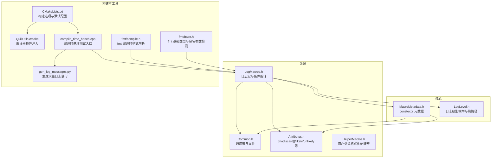
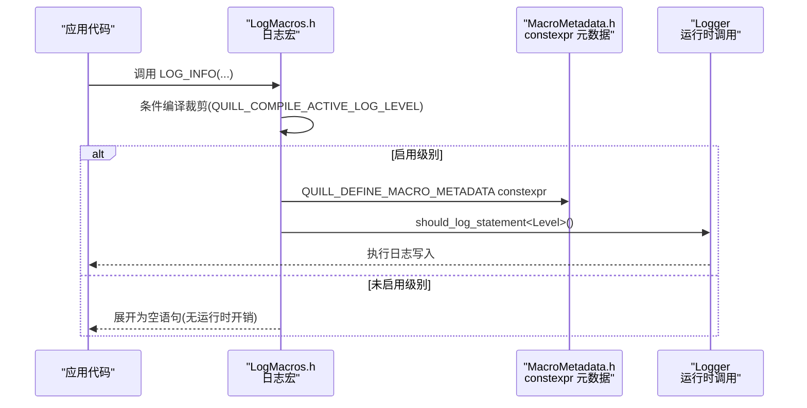
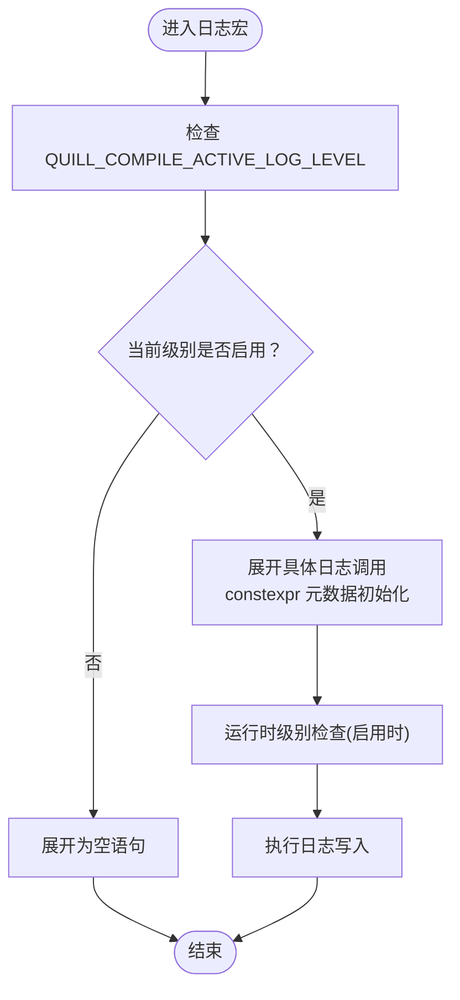
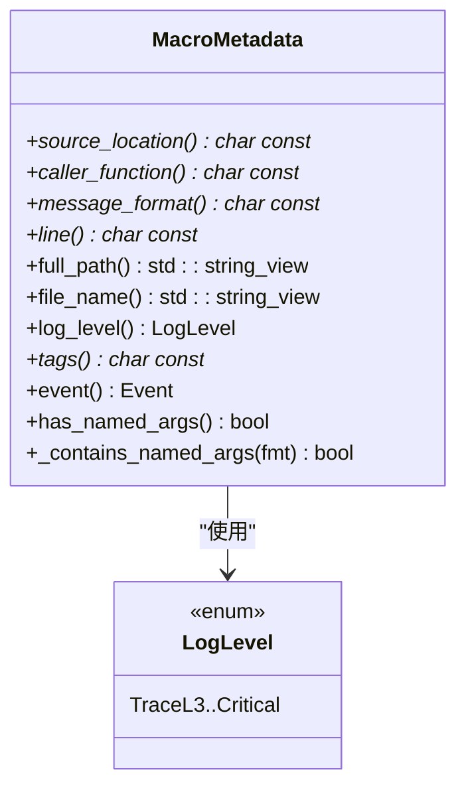
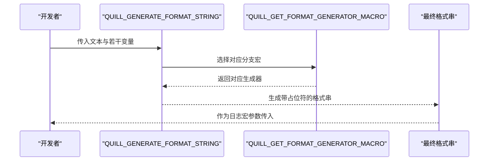
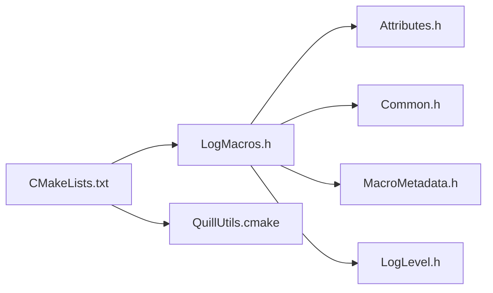

# 编译时优化

<cite>
**本文引用的文件**
- [LogMacros.h](file://include/quill/LogMacros.h)
- [Common.h](file://include/quill/core/Common.h)
- [Attributes.h](file://include/quill/core/Attributes.h)
- [MacroMetadata.h](file://include/quill/core/MacroMetadata.h)
- [LogLevel.h](file://include/quill/core/LogLevel.h)
- [HelperMacros.h](file://include/quill/HelperMacros.h)
- [CMakeLists.txt](file://CMakeLists.txt)
- [QuillUtils.cmake](file://cmake/QuillUtils.cmake)
- [compile_time_bench.cpp](file://benchmarks/compile_time/compile_time_bench.cpp)
- [gen_log_messages.py](file://benchmarks/compile_time/gen_log_messages.py)
- [compile.h](file://include/quill/bundled/fmt/compile.h)
- [base.h](file://include/quill/bundled/fmt/base.h)
</cite>

## 目录
1. [简介](#简介)
2. [项目结构](#项目结构)
3. [核心组件](#核心组件)
4. [架构总览](#架构总览)
5. [详细组件分析](#详细组件分析)
6. [依赖关系分析](#依赖关系分析)
7. [性能考量](#性能考量)
8. [故障排查指南](#故障排查指南)
9. [结论](#结论)
10. [附录](#附录)

## 简介
本文件系统性阐述 Quill 在编译期进行的优化技术，重点围绕“编译期日志级别消除”展开，解释如何通过模板特化、条件编译与宏展开，在编译阶段完全移除不需要的日志调用，从而实现“零开销日志”。同时，文档覆盖宏展开优化、内联函数优化、模板实例化优化策略，并结合不同编译优化级别（-O2、-O3、自定义优化标志）给出可操作的性能对比思路与建议。最后，总结 GCC、Clang、MSVC 的编译器特性使用要点，包括 constexpr、noexcept、[[nodiscard]] 注解等对性能与质量的提升。

## 项目结构
Quill 将编译期优化的关键逻辑集中在前端日志宏与核心运行时元数据类中：
- 前端日志宏层：在头文件中以条件编译与宏展开方式，按编译期设定的日志级别裁剪未启用的日志分支。
- 核心元数据层：以 constexpr 构造的元数据对象承载日志事件信息，减少运行时构造成本。
- 编译器工具链层：通过 CMake 选项与工具脚本，统一注入各编译器的优化与安全特性。

**图表来源**
- [LogMacros.h:373-915](file://include/quill/LogMacros.h#L373-L915)
- [Common.h:1-183](file://include/quill/core/Common.h#L1-L183)
- [Attributes.h:70-181](file://include/quill/core/Attributes.h#L70-L181)
- [MacroMetadata.h:1-195](file://include/quill/core/MacroMetadata.h#L1-L195)
- [LogLevel.h:1-54](file://include/quill/core/LogLevel.h#L1-L54)
- [HelperMacros.h:1-46](file://include/quill/HelperMacros.h#L1-L46)
- [CMakeLists.txt:1-200](file://CMakeLists.txt#L1-L200)
- [QuillUtils.cmake:30-87](file://cmake/QuillUtils.cmake#L30-L87)
- [compile_time_bench.cpp:1-120](file://benchmarks/compile_time/compile_time_bench.cpp#L1-L120)
- [gen_log_messages.py:1-58](file://benchmarks/compile_time/gen_log_messages.py#L1-L58)
- [compile.h:233-276](file://include/quill/bundled/fmt/compile.h#L233-L276)
- [base.h:1742-1782](file://include/quill/bundled/fmt/base.h#L1742-L1782)

**章节来源**
- [CMakeLists.txt:1-200](file://CMakeLists.txt#L1-L200)
- [QuillUtils.cmake:30-87](file://cmake/QuillUtils.cmake#L30-L87)

## 核心组件
- 编译期日志级别裁剪：通过 QUILL_COMPILE_ACTIVE_LOG_LEVEL 宏与多组条件编译分支，使未启用的日志级别在编译后直接为空语句，避免运行时判断与调用开销。
- 宏元数据 constexpr 化：QUILL_DEFINE_MACRO_METADATA 使用 constexpr 初始化，将日志事件元信息在编译期确定，降低运行时构造与拷贝成本。
- 宏展开与格式生成：QUILL_GENERATE_FORMAT_STRING/QUILL_GENERATE_NAMED_FORMAT_STRING 通过变参宏与选择器宏，按参数数量生成带占位符的格式串，减少运行时格式解析。
- 运行时元数据浅拷贝：QUILL_LOG_RUNTIME_METADATA_SHALLOW 提供浅拷贝路径，避免深拷贝带来的额外成本。
- 编译器特性宏：QUILL_LIKELY/QUILL_UNLIKELY 指导分支预测；[[nodiscard]] 用于告警未使用返回值；constexpr 用于常量表达式场景。

**章节来源**
- [LogMacros.h:373-915](file://include/quill/LogMacros.h#L373-L915)
- [LogMacros.h:300-314](file://include/quill/LogMacros.h#L300-L314)
- [LogMacros.h:945-972](file://include/quill/LogMacros.h#L945-L972)
- [MacroMetadata.h:38-51](file://include/quill/core/MacroMetadata.h#L38-L51)
- [MacroMetadata.h:84-87](file://include/quill/core/MacroMetadata.h#L84-L87)
- [Attributes.h:70-181](file://include/quill/core/Attributes.h#L70-L181)
- [Common.h:39-81](file://include/quill/core/Common.h#L39-L81)

## 架构总览
下图展示了从应用侧调用到日志记录的编译期优化路径：宏层根据编译期级别裁剪，元数据层以 constexpr 初始化，运行时仅执行必要分支。

**图表来源**
- [LogMacros.h:373-915](file://include/quill/LogMacros.h#L373-L915)
- [LogMacros.h:300-314](file://include/quill/LogMacros.h#L300-L314)
- [MacroMetadata.h:38-51](file://include/quill/core/MacroMetadata.h#L38-L51)

## 详细组件分析

### 组件A：编译期日志级别消除机制
- 设计要点
  - 通过 QUILL_COMPILE_ACTIVE_LOG_LEVEL 控制启用的最低日志级别，低于该级别的宏分支在编译期被完全移除。
  - 每个日志级别（TraceL3 到 Critical）均提供一组宏（含普通、带标签、带限流、每 N 次等），并在条件编译块中按级别启用或禁用。
  - 配合 QUILL_ENABLE_IMMEDIATE_FLUSH 的编译期默认值，确保在不改变行为的前提下最小化运行时开销。
- 复杂度与性能
  - 时间复杂度：编译期常数时间，运行时为 O(1) 分支判断（若启用）。
  - 空间复杂度：无额外运行时分配，constexpr 元数据在只读段中驻留。
- 可观测性
  - 可通过 CMake 选项 QUILL_DISABLE_NON_PREFIXed_MACROS 控制是否保留非前缀宏，避免与其他库冲突。
  - 可通过 QUILL_DISABLE_FUNCTION_NAME/QUILL_DISABLE_FILE_INFO 关闭函数名与文件信息，进一步减少编译体积与符号数量。

**图表来源**
- [LogMacros.h:373-915](file://include/quill/LogMacros.h#L373-L915)
- [Common.h:39-81](file://include/quill/core/Common.h#L39-L81)

**章节来源**
- [LogMacros.h:373-915](file://include/quill/LogMacros.h#L373-L915)
- [Common.h:39-81](file://include/quill/core/Common.h#L39-L81)
- [CMakeLists.txt:16-22](file://CMakeLists.txt#L16-L22)

### 组件B：宏元数据 constexpr 化与命名参数检测
- 设计要点
  - QUILL_DEFINE_MACRO_METADATA 使用 constexpr 构造，将源位置、函数名、消息格式、标签、级别、事件类型等信息在编译期固化。
  - MacroMetadata::has_named_args/_contains_named_args 通过 constexpr 字符串扫描，识别命名参数占位符，支持 QUILL_LOGJ_* 系列宏的编译期路径选择。
- 性能影响
  - 减少运行时构造与拷贝，降低缓存占用与 TLB 压力。
  - 命名参数检测在编译期完成，避免运行时格式解析与错误处理。
- 复杂度分析
  - 命名参数扫描为线性复杂度 O(n)，n 为格式字符串长度；由于 constexpr，发生在编译期。

**图表来源**
- [MacroMetadata.h:22-195](file://include/quill/core/MacroMetadata.h#L22-L195)
- [LogLevel.h:22-35](file://include/quill/core/LogLevel.h#L22-L35)

**章节来源**
- [MacroMetadata.h:38-51](file://include/quill/core/MacroMetadata.h#L38-L51)
- [MacroMetadata.h:84-154](file://include/quill/core/MacroMetadata.h#L84-L154)
- [base.h:1742-1782](file://include/quill/bundled/fmt/base.h#L1742-L1782)

### 组件C：宏展开优化与格式生成
- 设计要点
  - QUILL_GENERATE_FORMAT_STRING/QUILL_GENERATE_NAMED_FORMAT_STRING 通过“选择器宏 + 变参宏”的组合，按参数数量自动拼接占位符，避免运行时格式解析。
  - QUILL_GET_FORMAT_GENERATOR_MACRO 通过预定义的 26 个分支宏，支持最多 26 个参数的格式串生成。
- 性能收益
  - 将格式串拼接与占位符映射在编译期完成，运行时只需传递已生成的格式串与参数列表。
  - 与 fmt 的编译时格式解析配合，进一步减少运行时负担。

**图表来源**
- [LogMacros.h:48-161](file://include/quill/LogMacros.h#L48-L161)
- [LogMacros.h:165-266](file://include/quill/LogMacros.h#L165-L266)
- [compile.h:233-276](file://include/quill/bundled/fmt/compile.h#L233-L276)

**章节来源**
- [LogMacros.h:48-161](file://include/quill/LogMacros.h#L48-L161)
- [LogMacros.h:165-266](file://include/quill/LogMacros.h#L165-L266)
- [compile.h:233-276](file://include/quill/bundled/fmt/compile.h#L233-L276)

### 组件D：运行时元数据浅拷贝路径
- 设计要点
  - QUILL_LOG_RUNTIME_METADATA_SHALLOW 提供浅拷贝路径，避免深拷贝带来的额外成本，适用于动态日志场景。
- 性能影响
  - 在需要动态指定文件、行号、函数名时，浅拷贝路径减少运行时复制与内存分配。

**章节来源**
- [LogMacros.h:970-972](file://include/quill/LogMacros.h#L970-L972)

### 组件E：编译器特性与注解
- 设计要点
  - QUILL_LIKELY/QUILL_UNLIKELY 指导分支预测，帮助编译器在热路径上减少分支开销。
  - [[nodiscard]] 用于告警未使用返回值，提升接口健壮性。
  - constexpr 用于常量表达式场景，确保在编译期计算结果。
- 复杂度与性能
  - 以上注解与特性在多数现代编译器上能显著改善分支预测与内联决策，降低运行时开销。

**章节来源**
- [Attributes.h:70-181](file://include/quill/core/Attributes.h#L70-L181)
- [LogLevel.h:39-52](file://include/quill/core/LogLevel.h#L39-L52)

## 依赖关系分析
- 日志宏依赖于：
  - Attributes.h：提供分支提示与注解宏。
  - Common.h：提供文件/函数信息宏与线程本地关键字。
  - MacroMetadata.h：提供 constexpr 元数据构造与命名参数检测。
  - LogLevel.h：提供日志级别枚举与热路径函数。
- 构建系统依赖于：
  - CMakeLists.txt：设置默认 C++ 标准、构建类型与编译器选项。
  - QuillUtils.cmake：按编译器注入警告、安全与优化相关标志。

**图表来源**
- [LogMacros.h:9-11](file://include/quill/LogMacros.h#L9-L11)
- [Attributes.h:70-181](file://include/quill/core/Attributes.h#L70-L181)
- [Common.h:9-13](file://include/quill/core/Common.h#L9-L13)
- [MacroMetadata.h:9-15](file://include/quill/core/MacroMetadata.h#L9-L15)
- [LogLevel.h:9-15](file://include/quill/core/LogLevel.h#L9-L15)
- [CMakeLists.txt:1-200](file://CMakeLists.txt#L1-L200)
- [QuillUtils.cmake:30-87](file://cmake/QuillUtils.cmake#L30-L87)

**章节来源**
- [CMakeLists.txt:1-200](file://CMakeLists.txt#L1-L200)
- [QuillUtils.cmake:30-87](file://cmake/QuillUtils.cmake#L30-L87)

## 性能考量
- 编译期日志级别消除
  - 通过 QUILL_COMPILE_ACTIVE_LOG_LEVEL 将未启用级别在编译期完全移除，避免运行时分支与调用开销。
  - 建议在发布版本中将该值设为 Warning 或更高，以获得更佳的编译体积与运行时性能。
- 宏展开与格式生成
  - 使用 QUILL_GENERATE_FORMAT_STRING/QUILL_GENERATE_NAMED_FORMAT_STRING 在编译期生成格式串，减少运行时格式解析。
  - 对于高频日志路径，优先使用 QUILL_LOGV_* / QUILL_LOGJ_* 系列宏，以利用编译期格式生成。
- 运行时元数据
  - constexpr 元数据与浅拷贝路径减少运行时分配与拷贝，适合高吞吐场景。
- 编译器优化级别
  - -O2/-O3：现代编译器通常能较好地内联与优化宏展开后的代码；建议在 Release 中开启。
  - 自定义优化标志：可结合 -flto、-fpredictive-commoning、-fwhole-program 等（视编译器而定）进一步提升跨模块优化效果。
- 编译器特性与注解
  - 合理使用 [[nodiscard]]、constexpr、noexcept 可帮助编译器做出更激进的优化决策，同时提升接口安全性与可读性。

[本节为通用性能讨论，无需列出具体文件来源]

## 故障排查指南
- 症状：编译体积过大或编译时间过长
  - 排查：确认 QUILL_COMPILE_ACTIVE_LOG_LEVEL 是否设置过高；考虑在发布版本中提高该阈值。
  - 参考：[CMakeLists.txt:1-200](file://CMakeLists.txt#L1-L200)、[LogMacros.h:373-915](file://include/quill/LogMacros.h#L373-L915)
- 症状：运行时日志缺失
  - 排查：确认目标级别是否被启用；检查 QUILL_COMPILE_ACTIVE_LOG_LEVEL 与日志宏级别关系。
  - 参考：[LogMacros.h:373-915](file://include/quill/LogMacros.h#L373-L915)
- 症状：编译失败或警告过多
  - 排查：检查编译器选项与工具链配置；必要时关闭 QUILL_DISABLE_NON_PREFIXed_MACROS 或调整 QUILL_DISABLE_FUNCTION_NAME/QUILL_DISABLE_FILE_INFO。
  - 参考：[CMakeLists.txt:16-22](file://CMakeLists.txt#L16-L22)、[QuillUtils.cmake:30-87](file://cmake/QuillUtils.cmake#L30-L87)
- 症状：格式化异常或命名参数未识别
  - 排查：确认格式串中的命名参数占位符是否符合约定；检查 fmt 编译时解析路径。
  - 参考：[MacroMetadata.h:84-154](file://include/quill/core/MacroMetadata.h#L84-L154)、[base.h:1742-1782](file://include/quill/bundled/fmt/base.h#L1742-L1782)

**章节来源**
- [LogMacros.h:373-915](file://include/quill/LogMacros.h#L373-L915)
- [CMakeLists.txt:16-22](file://CMakeLists.txt#L16-L22)
- [QuillUtils.cmake:30-87](file://cmake/QuillUtils.cmake#L30-L87)
- [MacroMetadata.h:84-154](file://include/quill/core/MacroMetadata.h#L84-L154)
- [base.h:1742-1782](file://include/quill/bundled/fmt/base.h#L1742-L1782)

## 结论
Quill 的编译时优化以“条件编译 + 宏展开 + constexpr 元数据”为核心，实现了在编译期完全移除未启用日志分支的目标，配合编译器特性与注解，进一步提升了运行时性能与代码质量。通过合理设置编译优化级别与构建选项，可在不同编译器环境下获得稳定且可观的性能收益。

[本节为总结性内容，无需列出具体文件来源]

## 附录

### A. 不同编译优化级别的建议与最佳实践
- GCC
  - 常用优化：-O2/-O3、-flto（链接时优化）、-fno-plt（减少 PLT 跳转开销）
  - 安全与硬核：在启用 QUILL_ENABLE_GCC_HARDENING 时，可获得栈保护、CF Protection 等增强
  - 参考：[QuillUtils.cmake:44-52](file://cmake/QuillUtils.cmake#L44-L52)
- Clang
  - 常用优化：-O2/-O3、-flto、-fwhole-program（跨模块优化）
  - 警告与诊断：严格模式下的冗余声明、浮点比较等警告有助于发现潜在问题
  - 参考：[QuillUtils.cmake:59-72](file://cmake/QuillUtils.cmake#L59-L72)
- MSVC
  - 常用优化：/O2（对应 -O2/-O3 的等价项）、/GL（全程序优化）、/LTCG（链接时代码生成）
  - 参考：[QuillUtils.cmake:74-76](file://cmake/QuillUtils.cmake#L74-L76)

[本节为通用指导，无需列出具体文件来源]

### B. 编译时基准测试与对比方法
- 生成测试代码
  - 使用 [gen_log_messages.py:1-58](file://benchmarks/compile_time/gen_log_messages.py#L1-L58) 生成包含大量日志语句的测试文件。
- 编译与测量
  - 使用 [compile_time_bench.cpp:1-120](file://benchmarks/compile_time/compile_time_bench.cpp#L1-L120) 作为入口，分别在不同优化级别（-O0、-O2、-O3、自定义优化标志）下编译，记录编译时间与二进制大小。
- 对比维度
  - 编译时间：衡量宏展开与模板实例化的开销。
  - 二进制大小：衡量未启用日志分支的移除效果。
  - 运行时性能：在相同硬件条件下，测量不同优化级别下的日志写入延迟与吞吐。

**章节来源**
- [gen_log_messages.py:1-58](file://benchmarks/compile_time/gen_log_messages.py#L1-L58)
- [compile_time_bench.cpp:1-120](file://benchmarks/compile_time/compile_time_bench.cpp#L1-L120)