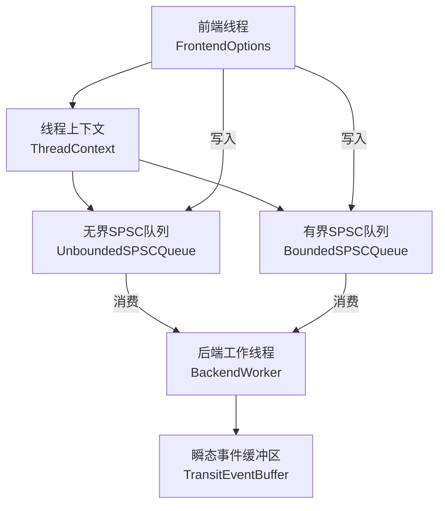
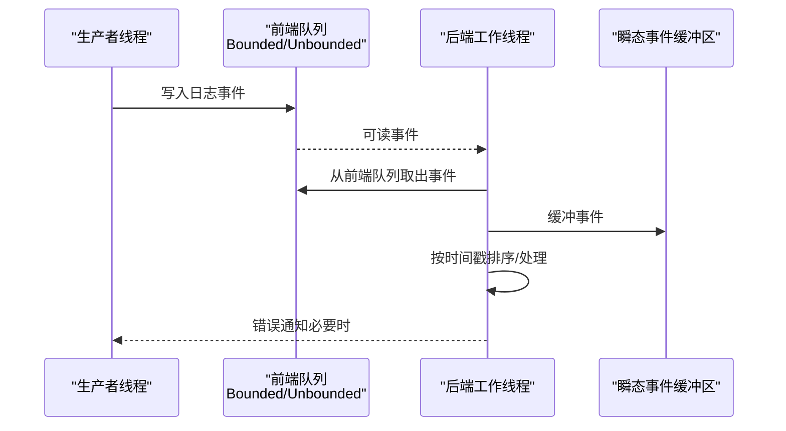
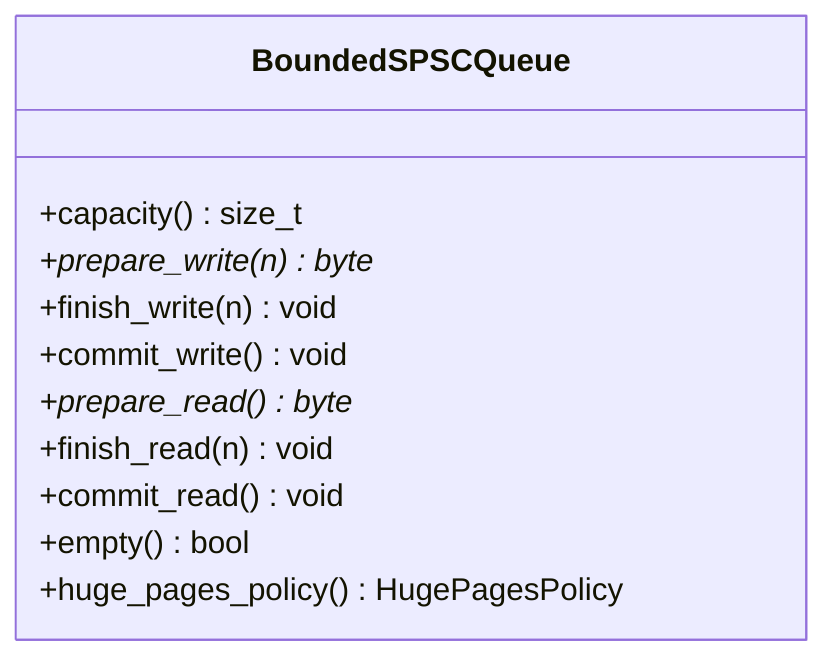
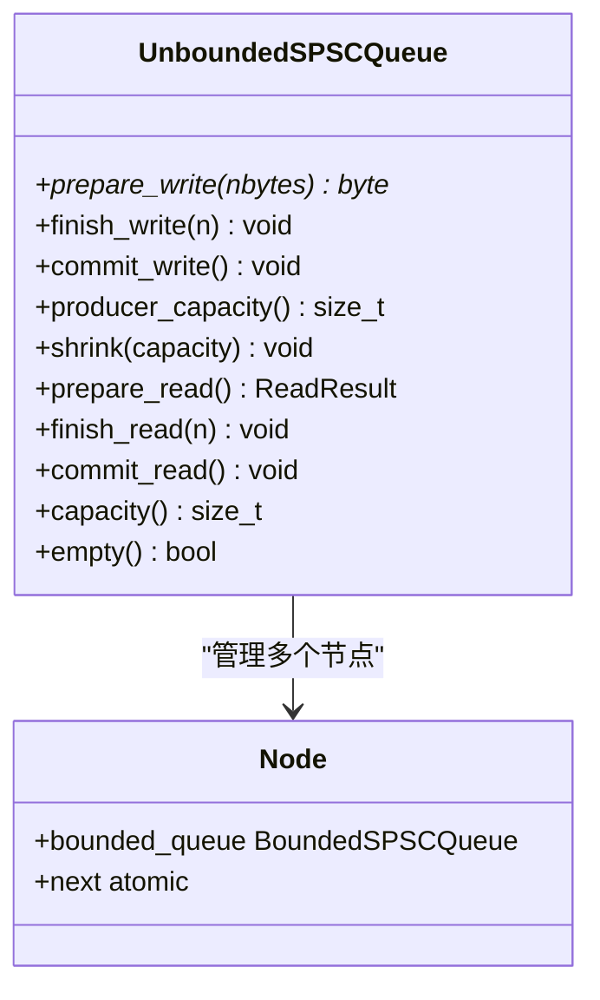
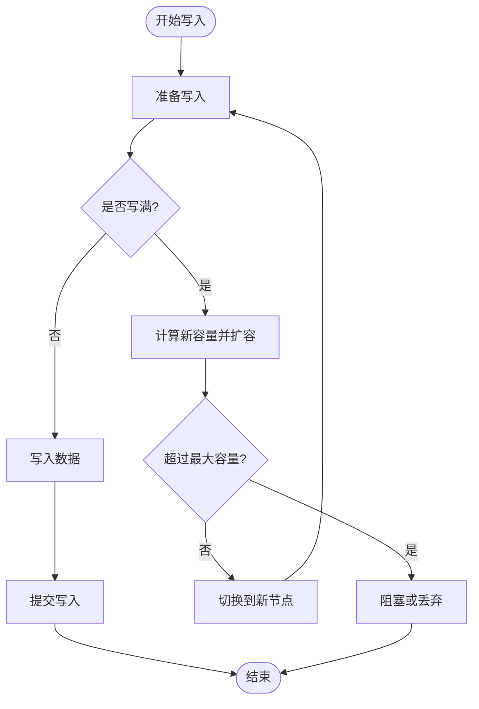
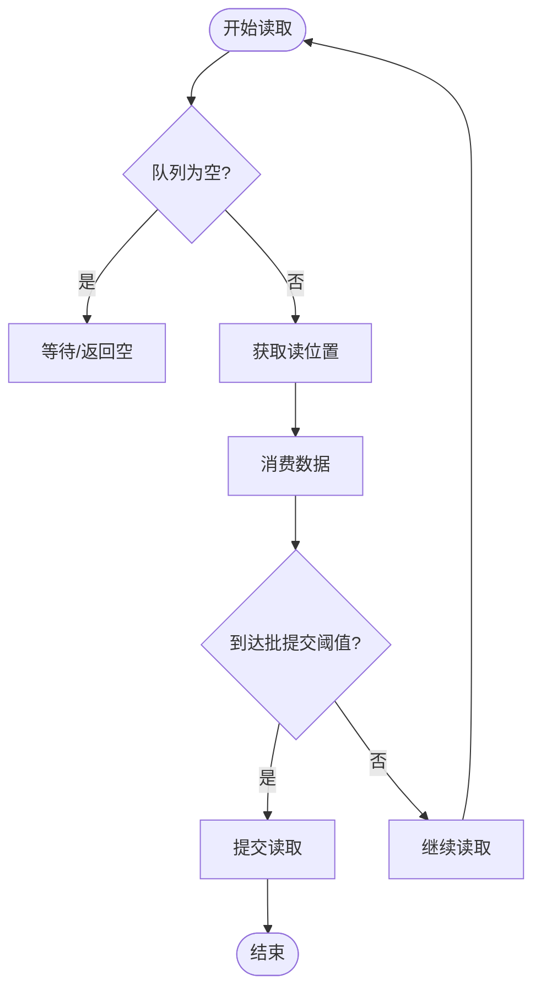
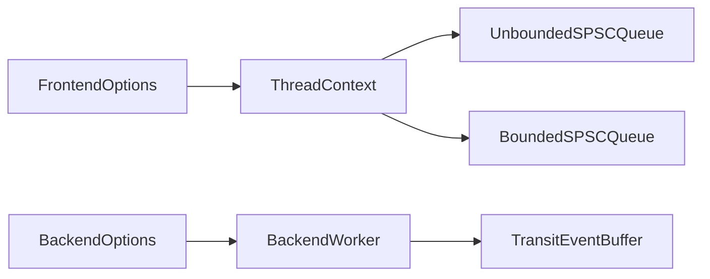

# 队列配置优化

<cite>
**本文引用的文件**
- [BoundedSPSCQueue.h](file://include/quill/core/BoundedSPSCQueue.h)
- [UnboundedSPSCQueue.h](file://include/quill/core/UnboundedSPSCQueue.h)
- [FrontendOptions.h](file://include/quill/core/FrontendOptions.h)
- [Common.h](file://include/quill/core/Common.h)
- [ThreadContextManager.h](file://include/quill/core/ThreadContextManager.h)
- [BackendOptions.h](file://include/quill/backend/BackendOptions.h)
- [BackendWorker.h](file://include/quill/backend/BackendWorker.h)
- [BoundedDroppingQueueTest.cpp](file://test/integration_tests/BoundedDroppingQueueTest.cpp)
- [BoundedBlockingQueueTest.cpp](file://test/integration_tests/BoundedBlockingQueueTest.cpp)
- [UnboundedQueueTest.cpp](file://test/unit_tests/UnboundedQueueTest.cpp)
- [BoundedQueueTest.cpp](file://test/unit_tests/BoundedQueueTest.cpp)
- [quill_backend_throughput.cpp](file://benchmarks/backend_throughput/quill_backend_throughput.cpp)
- [quill_hot_path_rdtsc_clock.cpp](file://benchmarks/hot_path_latency/quill_hot_path_rdtsc_clock.cpp)
- [hot_path_bench_config.h](file://benchmarks/hot_path_latency/hot_path_bench_config.h)
- [frontend_options.rst](file://docs/frontend_options.rst)
- [bounded_dropping_queue_frontend.cpp](file://examples/bounded_dropping_queue_frontend.cpp)
- [custom_frontend_options.cpp](file://examples/custom_frontend_options.cpp)
</cite>

## 目录
1. [简介](#简介)
2. [项目结构](#项目结构)
3. [核心组件](#核心组件)
4. [架构总览](#架构总览)
5. [详细组件分析](#详细组件分析)
6. [依赖关系分析](#依赖关系分析)
7. [性能考量](#性能考量)
8. [故障排除指南](#故障排除指南)
9. [结论](#结论)
10. [附录](#附录)

## 简介
本技术文档围绕 Quill 的队列配置优化展开，系统性分析有界队列与无界队列在内存使用、吞吐量与延迟方面的权衡；对比阻塞队列与丢弃队列在不同负载场景下的表现；给出面向高频低延迟、低频高吞吐与突发流量等场景的配置建议；总结队列参数调优策略（队列大小、批量处理阈值、内存预分配）；并提供性能监控指标与故障排除方法。

## 项目结构
Quill 的前端线程拥有独立的单生产者单消费者（SPSC）队列，后端工作线程从各前端队列中拉取日志事件并进行格式化与落盘。队列类型由编译时 FrontendOptions 指定，支持四种类型：UnboundedBlocking、UnboundedDropping、BoundedBlocking、BoundedDropping。

图示来源
- [ThreadContextManager.h:53-80](file://include/quill/core/ThreadContextManager.h#L53-L80)
- [UnboundedSPSCQueue.h:42-85](file://include/quill/core/UnboundedSPSCQueue.h#L42-L85)
- [BoundedSPSCQueue.h:55-95](file://include/quill/core/BoundedSPSCQueue.h#L55-L95)
- [BackendWorker.h:807-847](file://include/quill/backend/BackendWorker.h#L807-L847)

章节来源
- [FrontendOptions.h:16-50](file://include/quill/core/FrontendOptions.h#L16-L50)
- [Common.h:145-151](file://include/quill/core/Common.h#L145-L151)
- [ThreadContextManager.h:53-80](file://include/quill/core/ThreadContextManager.h#L53-L80)

## 核心组件
- 有界SPSC队列（BoundedSPSCQueue）
  - 固定容量，环形缓冲区，支持 HugePages 策略，具备缓存行优化与批提交机制。
  - 关键能力：准备写/完成写/提交写；准备读/完成读/提交读；空队列检测；容量查询。
- 无界SPSC队列（UnboundedSPSCQueue）
  - 由多个有界节点链表组成，按需倍增扩容至最大容量，支持收缩。
  - 关键能力：写满自动切换到新节点；读完旧节点后释放并切换；提供容量信息返回。
- 前端选项（FrontendOptions）
  - 定义队列类型、初始容量、阻塞重试间隔、无界队列最大容量、HugePages 策略。
- 后端选项（BackendOptions）
  - 控制后端线程亲和性、睡眠时长、瞬态事件缓冲区容量与硬限制、时间戳排序宽容期、错误通知回调等。

章节来源
- [BoundedSPSCQueue.h:55-196](file://include/quill/core/BoundedSPSCQueue.h#L55-L196)
- [UnboundedSPSCQueue.h:42-241](file://include/quill/core/UnboundedSPSCQueue.h#L42-L241)
- [FrontendOptions.h:16-50](file://include/quill/core/FrontendOptions.h#L16-L50)
- [BackendOptions.h:30-283](file://include/quill/backend/BackendOptions.h#L30-L283)

## 架构总览
前端线程根据 FrontendOptions 选择队列类型，写入日志事件；后端工作线程遍历所有前端队列，将事件暂存到瞬态缓冲区，再统一处理与落盘。错误通知通过 BackendOptions::error_notifier 回调上报。

图示来源
- [ThreadContextManager.h:53-80](file://include/quill/core/ThreadContextManager.h#L53-L80)
- [BackendWorker.h:807-847](file://include/quill/backend/BackendWorker.h#L807-L847)
- [BackendOptions.h:170-178](file://include/quill/backend/BackendOptions.h#L170-L178)

## 详细组件分析

### 有界SPSC队列（BoundedSPSCQueue）
- 数据结构与复杂度
  - 环形缓冲区，容量为 2 的幂；准备写/读为 O(1)，空队列检测 O(1)。
  - 批提交策略：按“读端存储百分比”批量提交，减少原子写次数。
- 内存与缓存优化
  - 对 x86 平台执行 clflush/prefetch，降低 TLB 未命中与缓存污染。
  - 支持 HugePages（Linux），可显著降低页表开销。
- 错误处理
  - 容量过小会抛出异常；内存分配失败抛出异常。

图示来源
- [BoundedSPSCQueue.h:55-196](file://include/quill/core/BoundedSPSCQueue.h#L55-L196)

章节来源
- [BoundedSPSCQueue.h:55-196](file://include/quill/core/BoundedSPSCQueue.h#L55-L196)

### 无界SPSC队列（UnboundedSPSCQueue）
- 数据结构与复杂度
  - 多个有界节点链表，按需倍增；写满时创建新节点，读完旧节点后释放。
  - 准备写/读为摊还 O(1)，最坏情况因扩容而退化。
- 动态伸缩
  - 支持 shrink 到更小容量；最大容量受 FrontendOptions::unbounded_queue_max_capacity 限制。
- 错误处理
  - 超过最大容量时抛出异常；达到上限后返回空指针以触发阻塞或丢弃。

图示来源
- [UnboundedSPSCQueue.h:42-85](file://include/quill/core/UnboundedSPSCQueue.h#L42-L85)
- [UnboundedSPSCQueue.h:244-297](file://include/quill/core/UnboundedSPSCQueue.h#L244-L297)

章节来源
- [UnboundedSPSCQueue.h:42-241](file://include/quill/core/UnboundedSPSCQueue.h#L42-L241)
- [UnboundedQueueTest.cpp:13-64](file://test/unit_tests/UnboundedQueueTest.cpp#L13-L64)

### 队列类型与行为对比
- UnboundedBlocking
  - 写满后扩容至最大容量，之后阻塞写入线程。
- UnboundedDropping
  - 写满后扩容至最大容量，之后丢弃新消息。
- BoundedBlocking
  - 固定容量，写满后阻塞写入线程。
- BoundedDropping
  - 固定容量，写满后丢弃新消息。

章节来源
- [frontend_options.rst:10-17](file://docs/frontend_options.rst#L10-L17)
- [FrontendOptions.h:16-50](file://include/quill/core/FrontendOptions.h#L16-L50)

### 典型流程与算法

#### 写入流程（无界队列）

图示来源
- [UnboundedSPSCQueue.h:244-297](file://include/quill/core/UnboundedSPSCQueue.h#L244-L297)

#### 读取流程（有界/无界）

图示来源
- [BoundedSPSCQueue.h:147-169](file://include/quill/core/BoundedSPSCQueue.h#L147-L169)
- [UnboundedSPSCQueue.h:190-224](file://include/quill/core/UnboundedSPSCQueue.h#L190-L224)

## 依赖关系分析
- FrontendOptions 决定队列类型与容量策略，影响 ThreadContext 中的队列实例化。
- BackendOptions 提供错误通知与缓冲区容量控制，间接影响队列压力与吞吐。
- 测试用例覆盖了阻塞/丢弃队列的行为验证与多线程读写场景。

图示来源
- [FrontendOptions.h:16-50](file://include/quill/core/FrontendOptions.h#L16-L50)
- [ThreadContextManager.h:53-80](file://include/quill/core/ThreadContextManager.h#L53-L80)
- [BackendOptions.h:30-283](file://include/quill/backend/BackendOptions.h#L30-L283)

章节来源
- [ThreadContextManager.h:53-80](file://include/quill/core/ThreadContextManager.h#L53-L80)
- [BackendOptions.h:30-283](file://include/quill/backend/BackendOptions.h#L30-L283)

## 性能考量

### 有界 vs 无界队列的权衡
- 内存使用
  - 有界：固定峰值内存，适合资源受限环境。
  - 无界：按需增长，最高可达最大容量；适合峰值波动大但允许内存增长的场景。
- 吞吐量
  - 有界：在容量充足时延迟稳定，写入无额外分配开销。
  - 无界：扩容带来一次性分配与切换成本，可能短暂影响延迟。
- 延迟
  - 有界：阻塞/丢弃导致写路径潜在等待或丢消息。
  - 无界：阻塞/丢弃发生在达到最大容量后，平时延迟更低。

章节来源
- [frontend_options.rst:10-17](file://docs/frontend_options.rst#L10-L17)
- [UnboundedSPSCQueue.h:244-297](file://include/quill/core/UnboundedSPSCQueue.h#L244-L297)
- [BoundedSPSCQueue.h:55-196](file://include/quill/core/BoundedSPSCQueue.h#L55-L196)

### 阻塞 vs 丢弃队列
- 阻塞队列
  - 优点：不丢失消息，适合强一致场景。
  - 缺点：写线程可能被阻塞，影响热路径延迟。
- 丢弃队列
  - 优点：写路径无阻塞，延迟更可控。
  - 缺点：在高负载下可能丢消息，需结合监控与告警。

章节来源
- [frontend_options.rst:10-17](file://docs/frontend_options.rst#L10-L17)
- [BoundedDroppingQueueTest.cpp:27-80](file://test/integration_tests/BoundedDroppingQueueTest.cpp#L27-L80)
- [BoundedBlockingQueueTest.cpp:27-80](file://test/integration_tests/BoundedBlockingQueueTest.cpp#L27-L80)

### 应用场景与配置建议
- 高频低延迟
  - 推荐：BoundedDropping 或 UnboundedDropping（默认 UnboundedBlocking）。
  - 参数：较小 initial_queue_capacity，避免过大缓存；启用 HugePages（Linux）。
- 低频高吞吐
  - 推荐：UnboundedBlocking 或 BoundedBlocking。
  - 参数：适当增大 initial_queue_capacity 与 unbounded_queue_max_capacity；合理设置 blocking_queue_retry_interval_ns。
- 突发流量
  - 推荐：UnboundedBlocking（默认）或 BoundedDropping。
  - 参数：设置较高 unbounded_queue_max_capacity；利用 BackendOptions::transit_events_hard_limit 保护后端。

章节来源
- [FrontendOptions.h:16-50](file://include/quill/core/FrontendOptions.h#L16-L50)
- [BackendOptions.h:57-92](file://include/quill/backend/BackendOptions.h#L57-L92)
- [frontend_options.rst:10-17](file://docs/frontend_options.rst#L10-L17)

### 队列参数调优策略
- 队列大小
  - 初值：根据峰值 QPS 与单条日志平均大小估算 initial_queue_capacity。
  - 最大值：无界队列设置 unbounded_queue_max_capacity；有界队列保持固定容量。
- 批量处理阈值
  - 有界队列通过“读端存储百分比”控制批提交频率，平衡吞吐与延迟。
- 内存预分配
  - 启用 HugePages（Linux）以降低 TLB 开销；确保系统权限与内核支持。
- 后端缓冲
  - 调整 transit_event_buffer_initial_capacity 与 transit_events_hard_limit，防止后端缓冲溢出。

章节来源
- [BoundedSPSCQueue.h:60-69](file://include/quill/core/BoundedSPSCQueue.h#L60-L69)
- [FrontendOptions.h:32-44](file://include/quill/core/FrontendOptions.h#L32-L44)
- [BackendOptions.h:57-92](file://include/quill/backend/BackendOptions.h#L57-L92)

### 性能基准参考
- 热路径延迟（单线程/四线程）：Quill 在多种队列类型下均具有较低延迟，具体数值见 README 中的表格。
- 后端吞吐：通过基准程序测量总耗时与消息数，评估队列对整体吞吐的影响。

章节来源
- [README.md:250-286](file://README.md#L250-L286)
- [quill_hot_path_rdtsc_clock.cpp:13-23](file://benchmarks/hot_path_latency/quill_hot_path_rdtsc_clock.cpp#L13-L23)
- [quill_backend_throughput.cpp:9-68](file://benchmarks/backend_throughput/quill_backend_throughput.cpp#L9-L68)

## 故障排除指南

### 常见问题与定位
- 写入阻塞
  - 现象：写线程长时间等待。
  - 排查：检查队列类型（BoundedBlocking/UnboundedBlocking）、后端处理速度、transit_events_hard_limit 设置。
- 写入丢弃
  - 现象：日志缺失。
  - 排查：确认队列类型为 BoundedDropping/UnboundedDropping；查看 BackendOptions::error_notifier 是否收到丢弃通知。
- 内存不足/扩容失败
  - 现象：抛出异常或无法分配更大队列。
  - 排查：检查 HugePages 权限与可用内存；调整 unbounded_queue_max_capacity；考虑启用 Try 策略回退。
- 时间戳乱序
  - 现象：日志顺序与实际发生时间不一致。
  - 排查：增大 log_timestamp_ordering_grace_period；检查前端线程 CPU 亲和性与调度。

章节来源
- [frontend_options.rst:23-31](file://docs/frontend_options.rst#L23-L31)
- [BackendOptions.h:132-132](file://include/quill/backend/BackendOptions.h#L132-L132)
- [BoundedSPSCQueue.h:82-86](file://include/quill/core/BoundedSPSCQueue.h#L82-L86)
- [UnboundedSPSCQueue.h:253-275](file://include/quill/core/UnboundedSPSCQueue.h#L253-L275)

### 监控指标建议
- 队列相关
  - 当前容量/已用容量、写入阻塞次数、丢弃计数、扩容次数、收缩次数。
- 后端相关
  - 瞬态缓冲区大小、软/硬限制占用率、后端轮询间隔、错误通知次数。
- 系统相关
  - TLB 未命中、缺页异常、CPU 使用率、上下文切换。

章节来源
- [BackendOptions.h:57-92](file://include/quill/backend/BackendOptions.h#L57-L92)
- [ThreadContextManager.h:188-201](file://include/quill/core/ThreadContextManager.h#L188-L201)

### 示例与测试参考
- 自定义前端选项与队列类型
  - 使用自定义 FrontendOptions 指定队列类型与容量，并创建对应的 Frontend/Logger 类型。
- 集成测试
  - BoundedDropping 与 BoundedBlocking 的行为验证，确保在高负载下符合预期。
- 单元测试
  - 无界队列的扩容、收缩、多线程读写一致性验证。

章节来源
- [custom_frontend_options.cpp:14-27](file://examples/custom_frontend_options.cpp#L14-L27)
- [bounded_dropping_queue_frontend.cpp:21-38](file://examples/bounded_dropping_queue_frontend.cpp#L21-L38)
- [BoundedDroppingQueueTest.cpp:14-25](file://test/integration_tests/BoundedDroppingQueueTest.cpp#L14-L25)
- [BoundedBlockingQueueTest.cpp:14-25](file://test/integration_tests/BoundedBlockingQueueTest.cpp#L14-L25)
- [UnboundedQueueTest.cpp:13-64](file://test/unit_tests/UnboundedQueueTest.cpp#L13-L64)
- [BoundedQueueTest.cpp:22-62](file://test/unit_tests/BoundedQueueTest.cpp#L22-L62)

## 结论
- 有界队列适合资源受限与延迟敏感场景；无界队列适合峰值波动大且可接受内存增长的场景。
- 阻塞队列保证不丢消息但可能增加写路径延迟；丢弃队列提升写路径稳定性但需监控丢弃率。
- 通过合理的初始容量、最大容量、批提交阈值与 HugePages 策略，可在不同应用负载下取得最佳平衡。
- 借助 BackendOptions 的错误通知与缓冲区限制，可有效保护系统稳定性并及时发现异常。

## 附录

### 配置清单与建议
- 高频低延迟
  - 队列类型：BoundedDropping 或 UnboundedDropping
  - 初始容量：适中，避免过大
  - HugePages：Linux 上启用 Try
- 低频高吞吐
  - 队列类型：UnboundedBlocking 或 BoundedBlocking
  - 初始容量：较大；最大容量：足够大
  - 阻塞重试间隔：微秒级
- 突发流量
  - 队列类型：UnboundedBlocking 或 BoundedDropping
  - 最大容量：足够大；后端缓冲硬限制：适中

章节来源
- [FrontendOptions.h:16-50](file://include/quill/core/FrontendOptions.h#L16-L50)
- [BackendOptions.h:57-92](file://include/quill/backend/BackendOptions.h#L57-L92)
- [frontend_options.rst:10-17](file://docs/frontend_options.rst#L10-L17)