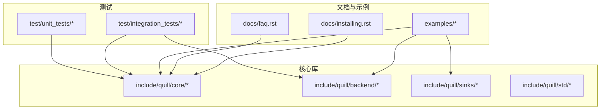
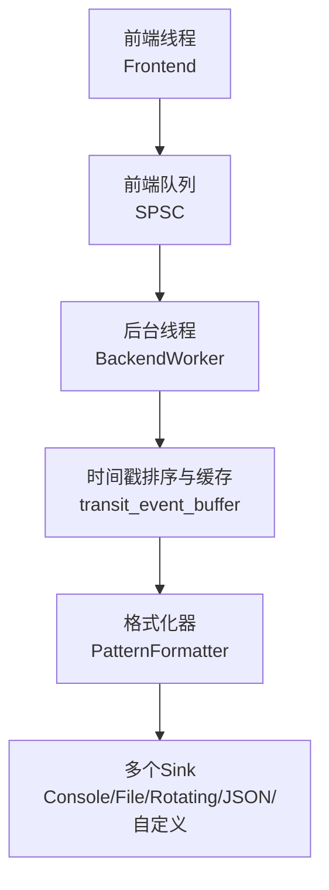
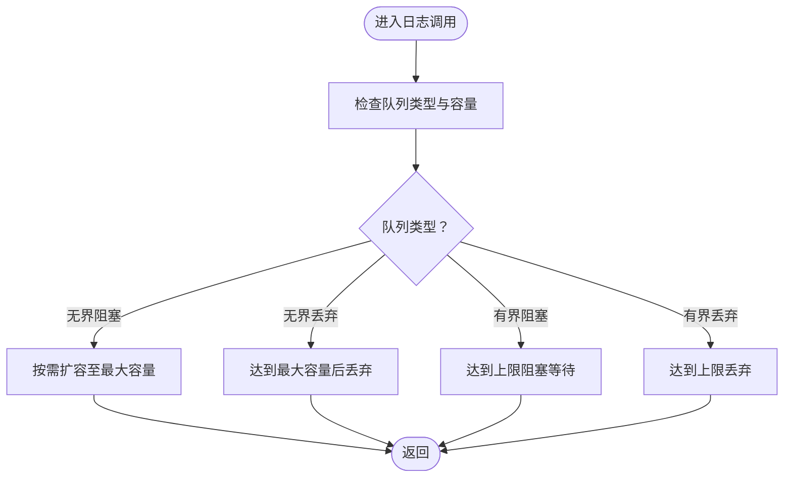
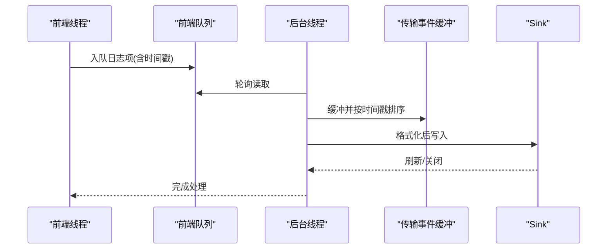
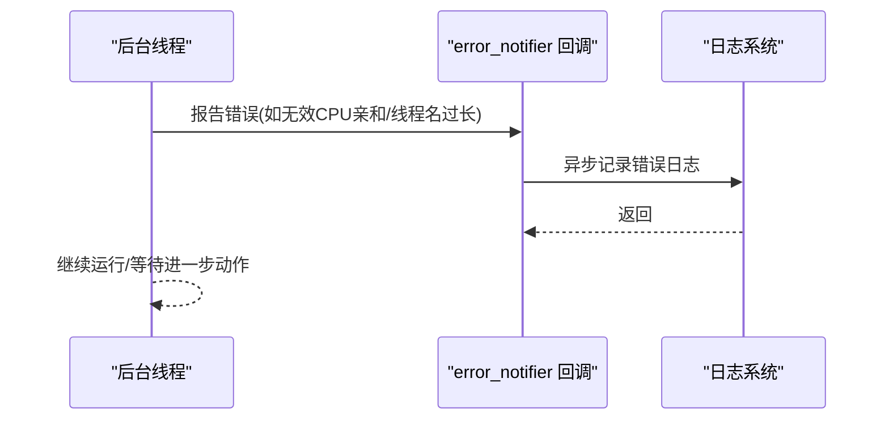
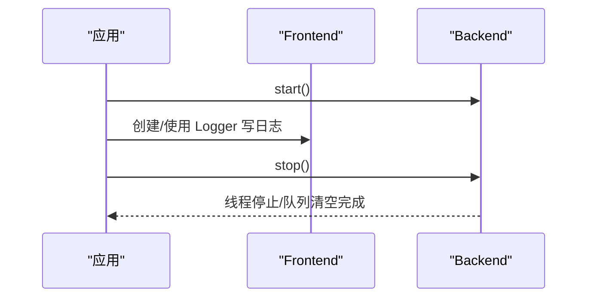
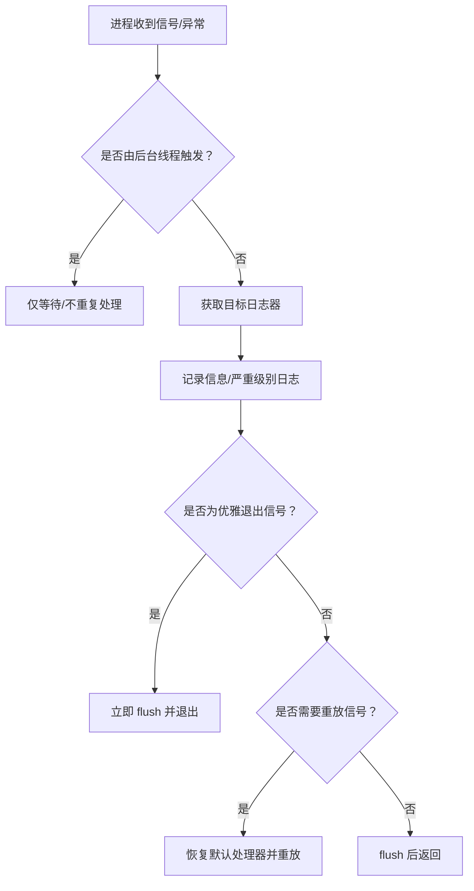
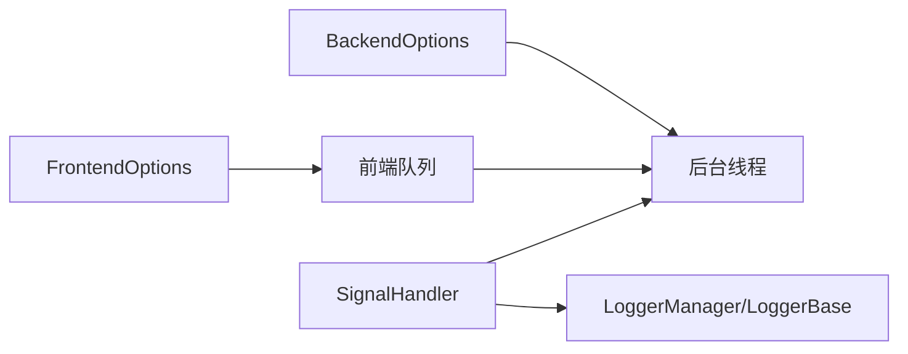

# 故障排除与常见问题

<cite>
**本文引用的文件**   
- [README.md](file://README.md)
- [docs/faq.rst](file://docs/faq.rst)
- [docs/installing.rst](file://docs/installing.rst)
- [include/quill/core/QuillError.h](file://include/quill/core/QuillError.h)
- [include/quill/core/FrontendOptions.h](file://include/quill/core/FrontendOptions.h)
- [include/quill/backend/BackendOptions.h](file://include/quill/backend/BackendOptions.h)
- [include/quill/backend/SignalHandler.h](file://include/quill/backend/SignalHandler.h)
- [test/integration_tests/BackendExceptionNotifierTest.cpp](file://test/integration_tests/BackendExceptionNotifierTest.cpp)
- [test/integration_tests/StartStopBackendWorkerTest.cpp](file://test/integration_tests/StartStopBackendWorkerTest.cpp)
</cite>

## 目录
1. [简介](#简介)
2. [项目结构](#项目结构)
3. [核心组件](#核心组件)
4. [架构总览](#架构总览)
5. [详细组件分析](#详细组件分析)
6. [依赖关系分析](#依赖关系分析)
7. [性能注意事项](#性能注意事项)
8. [故障排除指南](#故障排除指南)
9. [结论](#结论)
10. [附录](#附录)

## 简介
本指南面向使用 Quill 的开发者与运维人员，聚焦于安装配置、性能调优、兼容性与崩溃处理等常见问题，提供系统化的诊断思路、解决方案与预防措施。内容基于仓库中的官方文档、源码与测试用例，覆盖从入门到进阶的全链路问题排查路径。

## 项目结构
- 文档与示例：位于 docs 与 examples 目录，包含安装、快速开始、FAQ、设计说明等。
- 核心库头文件：位于 include/quill 下，按功能域划分（core、backend、sinks、std 等）。
- 测试：integration_tests 与 unit_tests 覆盖启动停止、异常通知、队列行为等关键场景。
- 平台适配：backend/SignalHandler.h 提供跨平台信号/异常处理能力。

**章节来源**
- [docs/installing.rst:1-89](file://docs/installing.rst#L1-L89)
- [docs/faq.rst:1-181](file://docs/faq.rst#L1-L181)

## 核心组件
- 前端选项（FrontendOptions）：控制前端线程队列类型、容量、阻塞间隔、巨页策略等。
- 后端选项（BackendOptions）：控制后端线程名称、空闲让出、睡眠时长、传输事件缓冲、时间戳排序宽限、刷新间隔、可打印字符检查、日志级别描述、单实例检测等。
- 错误与异常（QuillError、异常宏）：统一的异常封装与无异常模式下的致命错误处理。
- 信号/异常处理（SignalHandler）：跨平台捕获致命信号与异常，自动记录并安全退出或重放信号。

**章节来源**
- [include/quill/core/FrontendOptions.h:1-52](file://include/quill/core/FrontendOptions.h#L1-L52)
- [include/quill/backend/BackendOptions.h:1-283](file://include/quill/backend/BackendOptions.h#L1-L283)
- [include/quill/core/QuillError.h:1-57](file://include/quill/core/QuillError.h#L1-L57)
- [include/quill/backend/SignalHandler.h:1-488](file://include/quill/backend/SignalHandler.h#L1-L488)

## 架构总览
Quill 采用“前端异步入队 + 单后台线程统一处理”的架构。前端线程将日志元数据与参数序列化后入队；后台线程按时间戳有序消费、格式化并写入各 Sink。该设计保证低延迟与时间序一致性，同时通过多种选项实现性能与可靠性平衡。

**图表来源**
- [include/quill/backend/BackendOptions.h:58-92](file://include/quill/backend/BackendOptions.h#L58-L92)
- [include/quill/backend/BackendOptions.h:132](file://include/quill/backend/BackendOptions.h#L132)

**章节来源**
- [README.md:679-703](file://README.md#L679-L703)

## 详细组件分析

### 组件A：队列与内存管理（FrontendOptions）
- 队列类型与容量
  - 默认使用“无界阻塞”队列，初始容量与最大容量可配置；达到上限会阻塞而非丢弃消息。
  - 可切换为“无界丢弃/有界阻塞/有界丢弃”，以满足不同吞吐与可靠性需求。
- 巨页策略（Linux）
  - 支持在前端队列启用巨页以降低 TLB 缺失，提升热路径性能。
- 阻塞重试间隔
  - 在阻塞模式下，设置合理的重试间隔可平衡 CPU 占用与延迟。

**图表来源**
- [include/quill/core/FrontendOptions.h:16-50](file://include/quill/core/FrontendOptions.h#L16-L50)

**章节来源**
- [docs/faq.rst:37-47](file://docs/faq.rst#L37-L47)
- [docs/faq.rst:163-175](file://docs/faq.rst#L163-L175)

### 组件B：后台线程与时间戳排序（BackendOptions）
- 空闲策略
  - 可开启“空闲让出”或设置睡眠时长，减少空闲时 CPU 占用。
- 传输事件缓冲
  - 按前端线程分组维护环形缓冲，软硬阈值防止无限增长导致饥饿。
- 时间戳排序宽限
  - 通过“宽限期”补偿线程入队时机差异，避免乱序；数值越大越严格但可能增加队列压力。
- 刷新与可打印字符检查
  - 全局最小刷新间隔与可打印字符过滤，兼顾实时性与输出安全。
- 单实例检测
  - 防止共享/静态混用导致的多实例后端线程冲突。

**图表来源**
- [include/quill/backend/BackendOptions.h:30-283](file://include/quill/backend/BackendOptions.h#L30-L283)

**章节来源**
- [docs/faq.rst:130-142](file://docs/faq.rst#L130-L142)
- [docs/faq.rst:104-130](file://docs/faq.rst#L104-L130)

### 组件C：错误通知与异常处理（BackendExceptionNotifier）
- 错误通知回调
  - 后端线程在遇到无效 CPU 亲和、线程名过长、格式化失败、未初始化回溯等异常时，触发用户提供的 error_notifier 回调。
- 行为验证
  - 集成测试覆盖了线程名截断、CPU 亲和设置失败、回溯未初始化、格式化异常等场景，并验证回调被正确触发。

**图表来源**
- [test/integration_tests/BackendExceptionNotifierTest.cpp:73-84](file://test/integration_tests/BackendExceptionNotifierTest.cpp#L73-L84)

**章节来源**
- [test/integration_tests/BackendExceptionNotifierTest.cpp:1-159](file://test/integration_tests/BackendExceptionNotifierTest.cpp#L1-L159)

### 组件D：启动/停止与生命周期（StartStopBackendWorker）
- 多次启停
  - 支持多次 start()/stop() 循环；stop() 会等待队列清空、移除所有 Logger 并停止后台线程。
- 行为验证
  - 集成测试验证了多次循环下日志数量与顺序正确、线程 ID 归零、前端 Logger 数量清零。

**图表来源**
- [test/integration_tests/StartStopBackendWorkerTest.cpp:16-57](file://test/integration_tests/StartStopBackendWorkerTest.cpp#L16-L57)

**章节来源**
- [test/integration_tests/StartStopBackendWorkerTest.cpp:1-71](file://test/integration_tests/StartStopBackendWorkerTest.cpp#L1-L71)

### 组件E：崩溃与信号处理（SignalHandler）
- 跨平台信号处理
  - Linux 使用 std::signal 与 alarm 保障超时；Windows 使用 SetConsoleCtrlHandler 与 SetUnhandledExceptionFilter。
- 自动记录与安全退出
  - 捕获致命信号/异常后，优先记录日志并 flush，再根据信号类型决定是否重新抛出或直接退出。
- 配置项
  - 可指定捕获信号集、超时秒数、日志器选择策略与排除子串。

**图表来源**
- [include/quill/backend/SignalHandler.h:50-88](file://include/quill/backend/SignalHandler.h#L50-L88)
- [include/quill/backend/SignalHandler.h:154-248](file://include/quill/backend/SignalHandler.h#L154-L248)

**章节来源**
- [docs/faq.rst:146-161](file://docs/faq.rst#L146-L161)
- [include/quill/backend/SignalHandler.h:1-488](file://include/quill/backend/SignalHandler.h#L1-L488)

## 依赖关系分析
- 组件耦合
  - FrontendOptions 与 BackendOptions 分别影响前端队列与后端线程行为，二者共同决定整体延迟与吞吐。
  - SignalHandler 与 LoggerManager/LoggerBase 解耦，通过静态上下文访问日志器，避免在信号上下文中做阻塞操作。
- 外部依赖
  - 格式化依赖 fmt（命名空间 fmtquill），避免与外部 libfmt 冲突。
  - 平台相关：Windows 控制台与异常处理，POSIX 信号与 alarm。

**图表来源**
- [include/quill/core/FrontendOptions.h:16-50](file://include/quill/core/FrontendOptions.h#L16-L50)
- [include/quill/backend/BackendOptions.h:30-283](file://include/quill/backend/BackendOptions.h#L30-L283)
- [include/quill/backend/SignalHandler.h:90-138](file://include/quill/backend/SignalHandler.h#L90-L138)

**章节来源**
- [include/quill/core/FrontendOptions.h:1-52](file://include/quill/core/FrontendOptions.h#L1-L52)
- [include/quill/backend/BackendOptions.h:1-283](file://include/quill/backend/BackendOptions.h#L1-L283)
- [include/quill/backend/SignalHandler.h:1-488](file://include/quill/backend/SignalHandler.h#L1-L488)

## 性能注意事项
- 编译时长优化
  - 推荐将 Backend 打包为静态库，仅在前端包含少量头文件，减少编译开销。
- 后端线程 CPU 占用
  - 增大 sleep_duration 或使用手动唤醒（notify）降低空闲占用；在测试中可切换系统时钟避免 rdtsc 校准开销。
- 队列行为选择
  - 生产建议使用“丢弃队列”以获得更高吞吐；仿真/调试可用“立即刷新”策略降低丢失风险。
- 巨页与时间戳排序
  - Linux 可启用巨页；适当调整时间戳排序宽限以平衡准确性与队列压力。

**章节来源**
- [docs/faq.rst:107-129](file://docs/faq.rst#L107-L129)
- [docs/faq.rst:130-142](file://docs/faq.rst#L130-L142)
- [docs/faq.rst:163-175](file://docs/faq.rst#L163-L175)

## 故障排除指南

### 安装与集成问题
- 包管理器安装失败
  - 检查网络与镜像源；必要时切换为源码构建并使用 CMake 安装。
- CMake 找不到库
  - 若安装到自定义目录，确保设置 CMAKE_PREFIX_PATH；或使用 add_subdirectory 嵌入源码。
- 包裹方式选择
  - 推荐将 Backend 打包为静态库，前端仅包含 Logger.h 与 LogMacros.h，降低编译时间。

**章节来源**
- [docs/installing.rst:6-89](file://docs/installing.rst#L6-L89)
- [docs/faq.rst:14-20](file://docs/faq.rst#L14-L20)

### 启动/停止与生命周期问题
- 后端无法停止/线程未归零
  - 确保调用 stop() 前已 flush_log() 或移除 Logger；参考集成测试的正确流程。
- 多次启停后行为异常
  - 检查是否遗漏清理步骤；参考 StartStopBackendWorkerTest 的循环验证。

**章节来源**
- [test/integration_tests/StartStopBackendWorkerTest.cpp:16-57](file://test/integration_tests/StartStopBackendWorkerTest.cpp#L16-L57)

### 日志丢失与队列行为
- 期望“可靠不丢”但出现丢弃
  - 默认使用“无界阻塞”队列不会丢弃；若切换为“丢弃队列”，请评估吞吐与可靠性权衡。
- 高吞吐下延迟上升
  - 调整 BackendOptions 的 sleep_duration 或启用手动唤醒；必要时增大 transit_event 缓冲阈值。

**章节来源**
- [docs/faq.rst:37-47](file://docs/faq.rst#L37-L47)
- [docs/faq.rst:130-142](file://docs/faq.rst#L130-L142)

### 性能与资源占用
- 编译时间过长
  - 采用推荐用法：Backend 打包为静态库，前端仅包含必要头文件。
- 后端线程 CPU 占用高
  - 增大 sleep_duration 或启用空闲让出；在测试中避免 rdtsc 以消除校准开销。
- 内存占用偏高
  - 调整 FrontendOptions 的 initial_queue_capacity 与 unbounded_queue_max_capacity；Linux 可启用巨页。

**章节来源**
- [docs/faq.rst:107-129](file://docs/faq.rst#L107-L129)
- [docs/faq.rst:130-142](file://docs/faq.rst#L130-L142)
- [include/quill/core/FrontendOptions.h:16-50](file://include/quill/core/FrontendOptions.h#L16-L50)

### 崩溃与信号处理
- 应用崩溃导致日志丢失
  - 启用内置信号处理器，自动记录崩溃前的日志并安全退出；或在自定义处理器中手动 flush。
- 自定义信号处理器冲突
  - 避免在同一进程内重复注册相同信号；内置处理器会覆盖默认处理。

**章节来源**
- [docs/faq.rst:146-161](file://docs/faq.rst#L146-L161)
- [include/quill/backend/SignalHandler.h:425-488](file://include/quill/backend/SignalHandler.h#L425-L488)

### 错误通知与异常
- error_notifier 未触发
  - 确认 Backend 已启动且存在可触发的错误场景（如无效 CPU 亲和、线程名过长、格式化异常、未初始化回溯）。
- 在 error_notifier 中进行日志
  - 不要调用 flush_log()，避免死锁；可进行异步记录。

**章节来源**
- [test/integration_tests/BackendExceptionNotifierTest.cpp:73-84](file://test/integration_tests/BackendExceptionNotifierTest.cpp#L73-L84)
- [test/integration_tests/BackendExceptionNotifierTest.cpp:104-121](file://test/integration_tests/BackendExceptionNotifierTest.cpp#L104-L121)

### 兼容性与平台差异
- Windows 控制台/异常处理
  - 控制台中断与未处理异常分别由 SetConsoleCtrlHandler 与 SetUnhandledExceptionFilter 处理。
- POSIX 信号与 alarm
  - 使用 std::signal 注册处理器，并通过 alarm 保障超时退出。
- Android/NDK
  - 使用系统时钟与 AndroidSink；必要时禁用线程名支持。

**章节来源**
- [include/quill/backend/SignalHandler.h:387-424](file://include/quill/backend/SignalHandler.h#L387-L424)
- [include/quill/backend/SignalHandler.h:425-488](file://include/quill/backend/SignalHandler.h#L425-L488)
- [README.md:612-642](file://README.md#L612-L642)

### 社区支持与反馈
- 官方文档与示例
  - 快速开始、安装、FAQ、设计说明与示例代码。
- 问题反馈
  - 通过 GitHub Issues 提交 Bug 报告与功能请求模板。
- 版本与许可证
  - MIT 许可证；依赖第三方库遵循各自许可。

**章节来源**
- [README.md:57-67](file://README.md#L57-L67)

## 结论
通过合理配置 FrontendOptions 与 BackendOptions、启用信号处理与错误通知、遵循推荐的集成方式与性能调优策略，可显著降低 Quill 在复杂生产环境中的故障率与排查成本。建议在开发与测试阶段充分验证队列行为与后端线程策略，在生产阶段启用内置信号处理与严格的日志级别控制。

## 附录

### 常见问题速查表
- 启动/停止
  - 症状：stop() 后线程仍运行或日志未落盘
  - 处理：确保 flush_log()/移除 Logger 后再 stop()，参考集成测试流程
- 队列行为
  - 症状：高吞吐下日志丢失
  - 处理：切换为丢弃队列或启用“立即刷新”策略
- 性能
  - 症状：编译时间长/后端 CPU 占用高
  - 处理：打包 Backend 为静态库、增大 sleep_duration、启用空闲让出
- 崩溃
  - 症状：崩溃时日志丢失
  - 处理：启用内置信号处理器或在自定义处理器中手动 flush

**章节来源**
- [test/integration_tests/StartStopBackendWorkerTest.cpp:16-57](file://test/integration_tests/StartStopBackendWorkerTest.cpp#L16-L57)
- [docs/faq.rst:107-175](file://docs/faq.rst#L107-L175)
- [docs/faq.rst:146-161](file://docs/faq.rst#L146-L161)