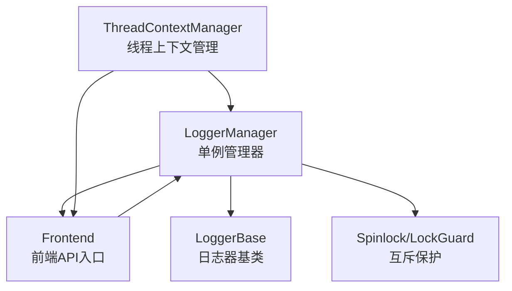
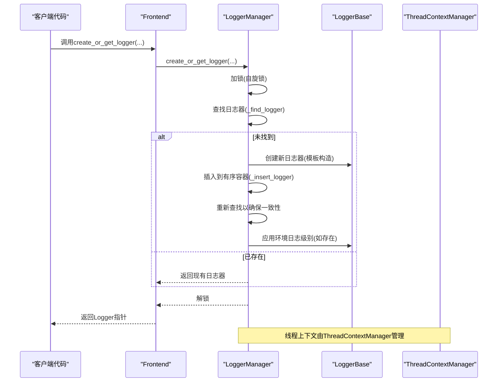
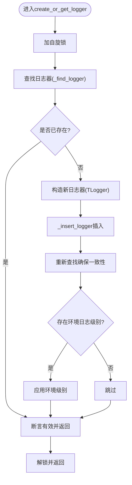
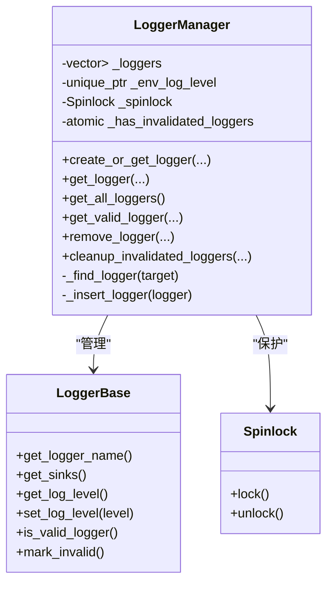
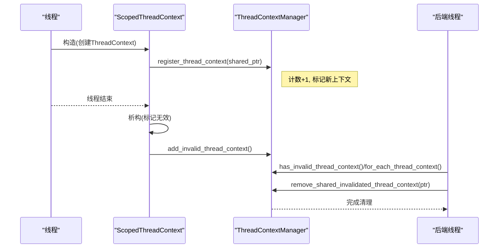
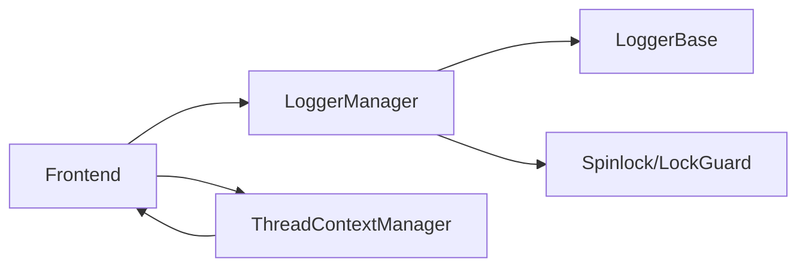

# LoggerManager管理器

<cite>
**本文档引用的文件**
- [LoggerManager.h](file://include/quill/core/LoggerManager.h)
- [ThreadContextManager.h](file://include/quill/core/ThreadContextManager.h)
- [LoggerBase.h](file://include/quill/core/LoggerBase.h)
- [Spinlock.h](file://include/quill/core/Spinlock.h)
- [Frontend.h](file://include/quill/Frontend.h)
- [LoggerManagerTest.cpp](file://test/unit_tests/LoggerManagerTest.cpp)
- [ThreadContextManagerTest.cpp](file://test/unit_tests/ThreadContextManagerTest.cpp)
- [LoggerAddRemoveGetTest.cpp](file://test/integration_tests/LoggerAddRemoveGetTest.cpp)
- [quill_docs_example_basic.cpp](file://docs/examples/quill_docs_example_basic.cpp)
- [quill_docs_example_loggers_remove.cpp](file://docs/examples/quill_docs_example_loggers_remove.cpp)
</cite>

## 目录
1. [简介](#简介)
2. [项目结构](#项目结构)
3. [核心组件](#核心组件)
4. [架构总览](#架构总览)
5. [详细组件分析](#详细组件分析)
6. [依赖关系分析](#依赖关系分析)
7. [性能考虑](#性能考虑)
8. [故障排除指南](#故障排除指南)
9. [结论](#结论)
10. [附录：使用示例与最佳实践](#附录使用示例与最佳实践)

## 简介
本文件为Quill的日志系统中LoggerManager管理器提供全面技术文档。LoggerManager采用单例设计模式，负责日志器（Logger）的创建、获取、有效性检查与销毁清理。其核心特性包括：
- 工厂方法create_or_get_logger()的线程安全与重复创建保护
- 基于有序容器的日志器注册表与二分查找
- 与ThreadContextManager的协作，确保线程上下文生命周期与资源清理
- 环境变量驱动的日志级别初始化
- 后台清理无效日志器的策略

## 项目结构
围绕LoggerManager的关键文件组织如下：
- 核心管理器：LoggerManager（单例，管理日志器注册表）
- 日志器基类：LoggerBase（日志器对象的公共接口与状态）
- 线程上下文管理：ThreadContextManager（管理每个线程的上下文缓存与失效清理）
- 自旋锁工具：Spinlock/LockGuard（轻量级互斥保护）
- 前端接口：Frontend（对外暴露创建/获取/移除日志器的API）
- 测试用例：LoggerManagerTest、ThreadContextManagerTest、LoggerAddRemoveGetTest（验证行为与边界）

**图表来源**
- [LoggerManager.h:33-307](file://include/quill/core/LoggerManager.h#L33-L307)
- [LoggerBase.h:35-207](file://include/quill/core/LoggerBase.h#L35-L207)
- [ThreadContextManager.h:216-429](file://include/quill/core/ThreadContextManager.h#L216-L429)
- [Frontend.h:151-225](file://include/quill/Frontend.h#L151-L225)

**章节来源**
- [LoggerManager.h:33-307](file://include/quill/core/LoggerManager.h#L33-L307)
- [LoggerBase.h:35-207](file://include/quill/core/LoggerBase.h#L35-L207)
- [ThreadContextManager.h:216-429](file://include/quill/core/ThreadContextManager.h#L216-L429)
- [Frontend.h:151-225](file://include/quill/Frontend.h#L151-L225)

## 核心组件
- LoggerManager（单例）
  - 提供get_logger()/get_all_loggers()/get_valid_logger()等查询接口
  - 提供create_or_get_logger()工厂方法，支持按名称创建或获取日志器
  - 提供remove_logger()标记失效与cleanup_invalidated_loggers()清理策略
  - 内部维护有序的日志器向量，使用自旋锁保护并发访问
- LoggerBase（日志器基类）
  - 维护日志器名称、时钟源、格式化选项、sink集合、有效性标志等
  - 提供set_log_level()/should_log_statement()等运行期控制能力
- ThreadContextManager（线程上下文管理）
  - 维护线程上下文集合，支持注册、标记失效、清理
  - 提供for_each_thread_context()遍历回调
- Spinlock/LockGuard（轻量互斥）
  - 高频路径上的无栈锁，避免系统调用开销

**章节来源**
- [LoggerManager.h:47-307](file://include/quill/core/LoggerManager.h#L47-L307)
- [LoggerBase.h:39-207](file://include/quill/core/LoggerBase.h#L39-L207)
- [ThreadContextManager.h:216-429](file://include/quill/core/ThreadContextManager.h#L216-L429)
- [Spinlock.h:18-75](file://include/quill/core/Spinlock.h#L18-L75)

## 架构总览
LoggerManager与ThreadContextManager协同工作，前者管理日志器生命周期，后者管理线程上下文生命周期。前端通过Frontend接口调用LoggerManager完成日志器的创建与获取；后台线程在适当时机清理无效日志器与线程上下文。

**图表来源**
- [LoggerManager.h:152-185](file://include/quill/core/LoggerManager.h#L152-L185)
- [Frontend.h:151-225](file://include/quill/Frontend.h#L151-L225)
- [ThreadContextManager.h:216-429](file://include/quill/core/ThreadContextManager.h#L216-L429)

## 详细组件分析

### LoggerManager单例与工厂方法
- 单例模式
  - 通过静态instance()返回唯一实例，构造时解析环境变量QUILL_LOG_LEVEL
- 工厂方法create_or_get_logger()
  - 加锁后先查找目标日志器
  - 若不存在则按模板参数TLogger构造新实例，插入有序容器并再次查找确保一致性
  - 如存在环境日志级别，则应用到新建日志器
  - 断言确保返回的日志器有效
- 查询接口
  - get_logger()：按名称获取，过滤无效日志器
  - get_all_loggers()：返回所有有效日志器
  - get_valid_logger()：返回首个有效日志器，支持排除子串或列表
  - get_number_of_loggers()：统计总数（含无效）
  - for_each_logger()：仅后端使用，遍历所有日志器（不检查有效性）
- 销毁与清理
  - remove_logger()：标记日志器无效，并设置原子标志
  - cleanup_invalidated_loggers()：在队列为空时删除无效日志器，否则延迟清理并重置标志

**图表来源**
- [LoggerManager.h:152-185](file://include/quill/core/LoggerManager.h#L152-L185)
- [LoggerManager.h:281-300](file://include/quill/core/LoggerManager.h#L281-L300)

**章节来源**
- [LoggerManager.h:47-307](file://include/quill/core/LoggerManager.h#L47-L307)
- [LoggerManagerTest.cpp:13-127](file://test/unit_tests/LoggerManagerTest.cpp#L13-L127)

### 日志器注册表的数据结构与并发控制
- 注册表结构
  - 使用std::vector<unique_ptr<LoggerBase>>维护日志器集合
  - 按日志器名称保持有序，便于二分查找
- 查找与插入算法
  - _find_logger()：基于std::lower_bound进行二分查找
  - _insert_logger()：在有序位置插入，保持字典序
- 并发访问控制
  - 使用Spinlock保护容器访问
  - LockGuard自动加解锁，避免异常路径下的死锁
  - 读多写少场景下，自旋锁比pthread_mutex更高效

**图表来源**
- [LoggerManager.h:303-306](file://include/quill/core/LoggerManager.h#L303-L306)
- [LoggerManager.h:291-300](file://include/quill/core/LoggerManager.h#L291-L300)
- [LoggerBase.h:68-113](file://include/quill/core/LoggerBase.h#L68-L113)
- [Spinlock.h:18-75](file://include/quill/core/Spinlock.h#L18-L75)

**章节来源**
- [LoggerManager.h:281-300](file://include/quill/core/LoggerManager.h#L281-L300)
- [Spinlock.h:18-75](file://include/quill/core/Spinlock.h#L18-L75)

### 与ThreadContextManager的协作关系
- 线程上下文生命周期
  - 每个线程通过ScopedThreadContext创建ThreadContext，并注册到ThreadContextManager
  - 线程结束时，ScopedThreadContext析构会标记ThreadContext为无效，并通知ThreadContextManager
- 资源清理策略
  - ThreadContextManager维护无效计数与新上下文标志，后端可据此决定清理时机
  - 清理前确保对应SPSC队列为空，避免数据丢失
- 与日志器的关系
  - LoggerBase持有线程上下文指针，用于前后端协作
  - LoggerManager与ThreadContextManager分别管理“日志器集合”和“线程上下文集合”，共同保障日志系统的稳定性

**图表来源**
- [ThreadContextManager.h:340-429](file://include/quill/core/ThreadContextManager.h#L340-L429)
- [ThreadContextManager.h:216-338](file://include/quill/core/ThreadContextManager.h#L216-L338)

**章节来源**
- [ThreadContextManager.h:216-429](file://include/quill/core/ThreadContextManager.h#L216-L429)
- [ThreadContextManagerTest.cpp:15-116](file://test/unit_tests/ThreadContextManagerTest.cpp#L15-L116)

### 环境变量与日志级别初始化
- LoggerManager在构造时解析环境变量QUILL_LOG_LEVEL
- 新创建的日志器若未显式设置级别，将继承该环境级别
- 测试覆盖了不同级别字符串的解析与应用

**章节来源**
- [LoggerManager.h:247-273](file://include/quill/core/LoggerManager.h#L247-L273)
- [LoggerManagerTest.cpp:294-331](file://test/unit_tests/LoggerManagerTest.cpp#L294-L331)

## 依赖关系分析
- LoggerManager依赖
  - LoggerBase：管理日志器对象
  - Spinlock/LockGuard：保护内部容器
  - Frontend：对外提供API入口
- Frontend依赖
  - LoggerManager：内部委托管理器完成日志器生命周期
  - ThreadContextManager：通过线程上下文协作
- 测试依赖
  - LoggerManagerTest：验证创建/获取/移除/清理逻辑
  - ThreadContextManagerTest：验证线程上下文注册/失效/清理
  - LoggerAddRemoveGetTest：集成测试日志器动态创建/移除

**图表来源**
- [Frontend.h:151-225](file://include/quill/Frontend.h#L151-L225)
- [LoggerManager.h:33-307](file://include/quill/core/LoggerManager.h#L33-L307)
- [ThreadContextManager.h:216-429](file://include/quill/core/ThreadContextManager.h#L216-L429)

**章节来源**
- [Frontend.h:151-225](file://include/quill/Frontend.h#L151-L225)
- [LoggerManager.h:33-307](file://include/quill/core/LoggerManager.h#L33-L307)
- [ThreadContextManager.h:216-429](file://include/quill/core/ThreadContextManager.h#L216-L429)

## 性能考虑
- 自旋锁选择
  - 在高频路径上使用Spinlock避免系统调用开销，适合短临界区
- 有序容器与二分查找
  - 使用lower_bound实现O(log n)查找，插入时保持有序，避免线性扫描
- 无效对象延迟清理
  - 通过原子标志与条件检查，避免在繁忙路径上执行昂贵的清理操作
- 线程上下文队列类型
  - 支持有界/无界阻塞/丢弃队列，按FrontendOptions配置，平衡吞吐与内存占用

[本节为通用性能讨论，无需特定文件来源]

## 故障排除指南
- 获取日志器失败
  - 确认日志器名称正确且未被标记为无效
  - 检查get_all_loggers()返回数量与get_number_of_loggers()差异（后者包含无效）
- 移除日志器后仍可见
  - remove_logger()仅标记无效，需等待队列清空后由cleanup_invalidated_loggers()真正删除
  - 可通过Frontend::remove_logger_blocking()等待完全移除
- 线程上下文清理问题
  - 确保线程正常结束触发ScopedThreadContext析构
  - 检查队列是否为空，避免在非空状态下强制清理

**章节来源**
- [LoggerManagerTest.cpp:47-127](file://test/unit_tests/LoggerManagerTest.cpp#L47-L127)
- [ThreadContextManagerTest.cpp:78-113](file://test/unit_tests/ThreadContextManagerTest.cpp#L78-L113)
- [Frontend.h:248-284](file://include/quill/Frontend.h#L248-L284)

## 结论
LoggerManager通过单例与工厂模式实现了日志器的统一管理，结合有序容器与自旋锁提供了高效的并发访问。与ThreadContextManager的协作确保了线程上下文的生命周期可控与资源安全回收。配合环境变量初始化与延迟清理策略，整体设计兼顾了易用性、性能与可靠性。

[本节为总结性内容，无需特定文件来源]

## 附录：使用示例与最佳实践

### 使用示例
- 基础创建与使用
  - 参考示例：[quill_docs_example_basic.cpp:7-15](file://docs/examples/quill_docs_example_basic.cpp#L7-L15)
- 动态移除与重建
  - 参考示例：[quill_docs_example_loggers_remove.cpp:13-38](file://docs/examples/quill_docs_example_loggers_remove.cpp#L13-L38)
- 集成测试中的动态创建/移除
  - 参考测试：[LoggerAddRemoveGetTest.cpp:18-57](file://test/integration_tests/LoggerAddRemoveGetTest.cpp#L18-L57)

### 最佳实践
- 使用Frontend::create_or_get_logger()统一创建/获取日志器，避免重复创建
- 对需要关闭底层文件的场景，使用Frontend::remove_logger_blocking()确保安全重建
- 合理设置FrontendOptions中的队列类型与容量，平衡性能与内存
- 通过QUILL_LOG_LEVEL环境变量集中初始化日志级别，便于运维控制

**章节来源**
- [quill_docs_example_basic.cpp:7-15](file://docs/examples/quill_docs_example_basic.cpp#L7-L15)
- [quill_docs_example_loggers_remove.cpp:13-38](file://docs/examples/quill_docs_example_loggers_remove.cpp#L13-L38)
- [LoggerAddRemoveGetTest.cpp:18-57](file://test/integration_tests/LoggerAddRemoveGetTest.cpp#L18-L57)