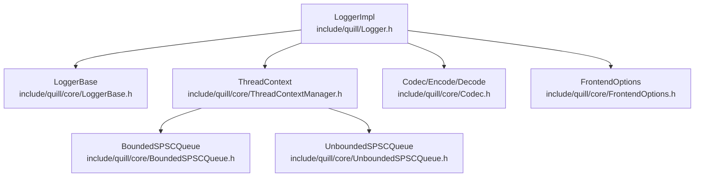
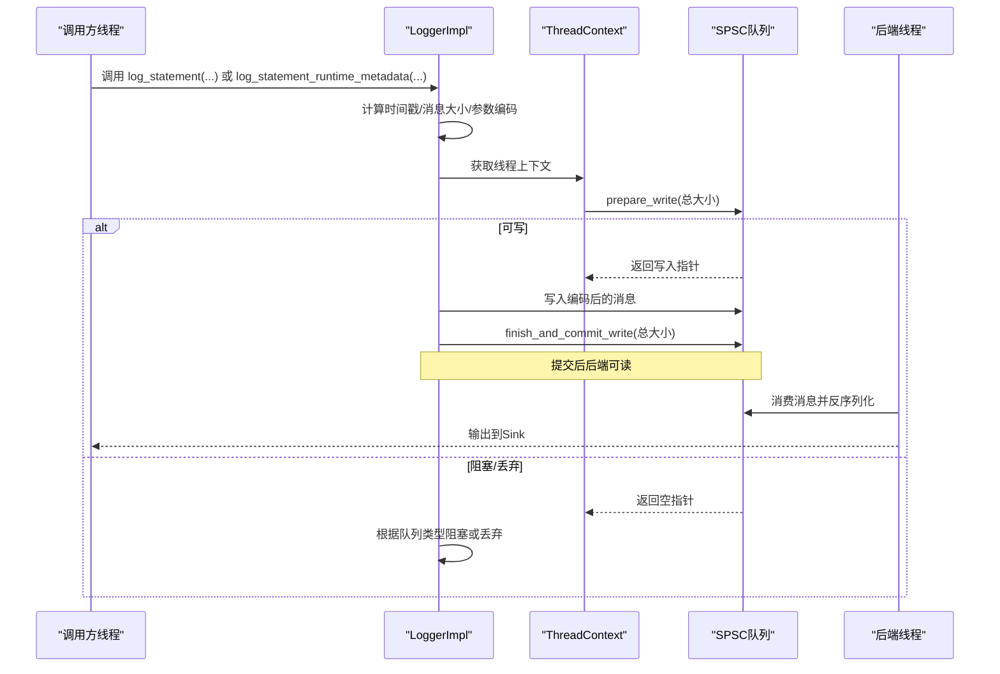
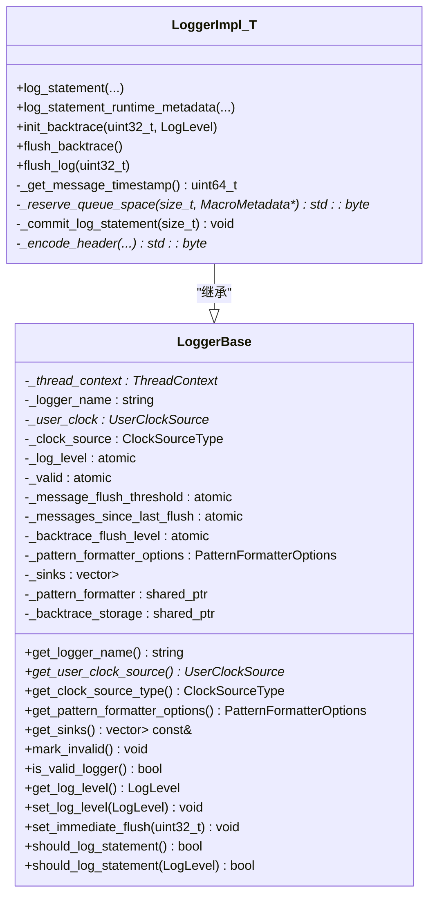
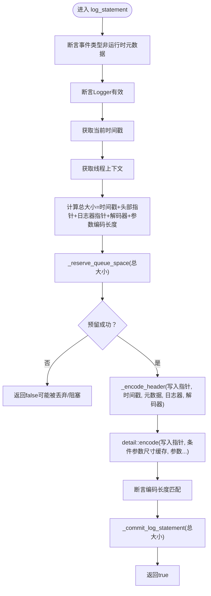
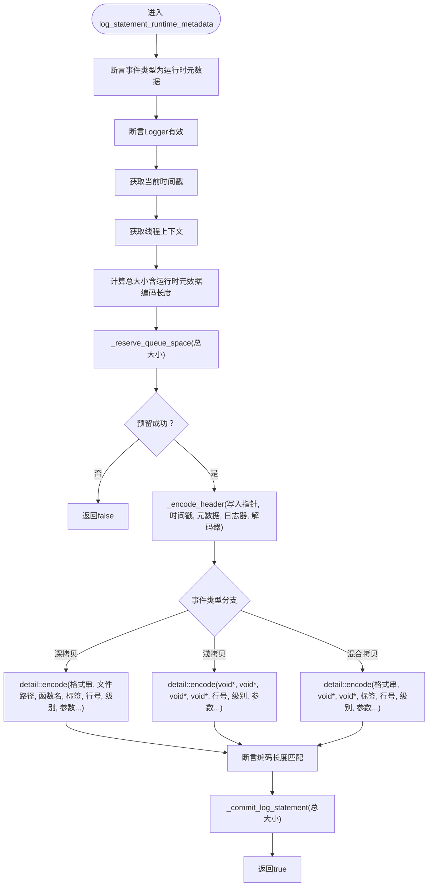
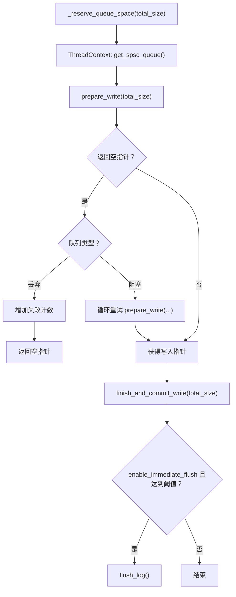
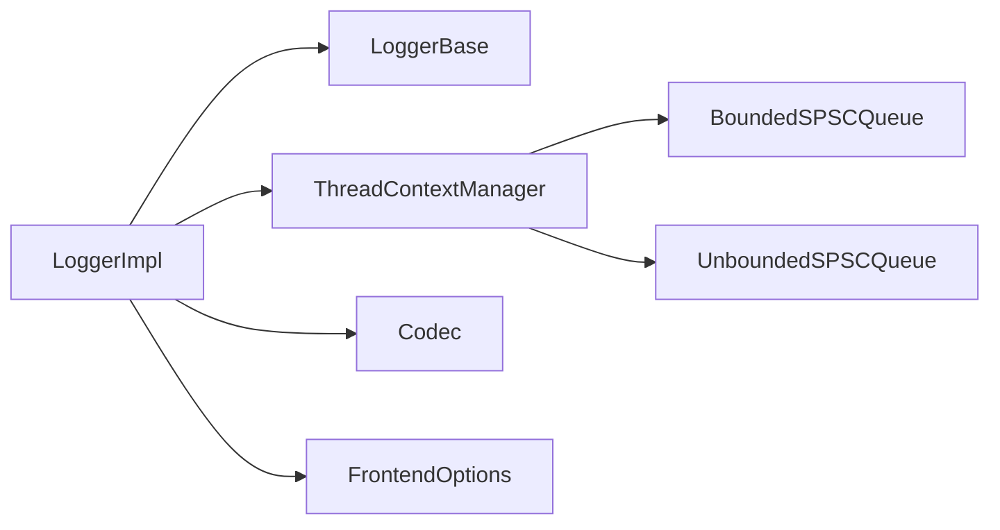

# Logger类详解

<cite>
**本文引用的文件**
- [Logger.h](file://include/quill/Logger.h)
- [LoggerBase.h](file://include/quill/core/LoggerBase.h)
- [ThreadContextManager.h](file://include/quill/core/ThreadContextManager.h)
- [BoundedSPSCQueue.h](file://include/quill/core/BoundedSPSCQueue.h)
- [UnboundedSPSCQueue.h](file://include/quill/core/UnboundedSPSCQueue.h)
- [Codec.h](file://include/quill/core/Codec.h)
- [FrontendOptions.h](file://include/quill/core/FrontendOptions.h)
</cite>

## 目录
1. [简介](#简介)
2. [项目结构](#项目结构)
3. [核心组件](#核心组件)
4. [架构总览](#架构总览)
5. [组件详细分析](#组件详细分析)
6. [依赖关系分析](#依赖关系分析)
7. [性能考量](#性能考量)
8. [故障排查指南](#故障排查指南)
9. [结论](#结论)
10. [附录：API参考](#附录api参考)

## 简介
本文件面向Quill日志库中的Logger类（具体为LoggerImpl模板类），系统性解析其设计与实现要点，重点覆盖：
- 继承自LoggerBase的层次结构与多态职责划分
- 日志记录核心方法log_statement与log_statement_runtime_metadata的实现原理，包括模板特化、参数打包与内存编码流程
- 线程本地队列（SPSC队列）的使用机制，包括预分配、写入缓冲管理与提交策略
- 完整API参考与使用示例路径，帮助读者正确调用并处理错误

## 项目结构
围绕Logger类的关键源文件组织如下：
- 前端日志接口与实现：include/quill/Logger.h
- 基类与通用字段：include/quill/core/LoggerBase.h
- 线程上下文与SPSC队列容器：include/quill/core/ThreadContextManager.h
- 有界SPSC队列实现：include/quill/core/BoundedSPSCQueue.h
- 无界SPSC队列实现：include/quill/core/UnboundedSPSCQueue.h
- 编码与格式化工具：include/quill/core/Codec.h
- 前端选项（队列类型、容量等）：include/quill/core/FrontendOptions.h

图表来源
- [Logger.h:47-508](file://include/quill/Logger.h#L47-L508)
- [LoggerBase.h:35-210](file://include/quill/core/LoggerBase.h#L35-L210)
- [ThreadContextManager.h:53-214](file://include/quill/core/ThreadContextManager.h#L53-L214)
- [BoundedSPSCQueue.h:54-356](file://include/quill/core/BoundedSPSCQueue.h#L54-L356)
- [UnboundedSPSCQueue.h:42-345](file://include/quill/core/UnboundedSPSCQueue.h#L42-L345)
- [Codec.h](file://include/quill/core/Codec.h)
- [FrontendOptions.h](file://include/quill/core/FrontendOptions.h)

章节来源
- [Logger.h:1-508](file://include/quill/Logger.h#L1-L508)
- [LoggerBase.h:1-210](file://include/quill/core/LoggerBase.h#L1-L210)
- [ThreadContextManager.h:1-430](file://include/quill/core/ThreadContextManager.h#L1-L430)
- [BoundedSPSCQueue.h:1-356](file://include/quill/core/BoundedSPSCQueue.h#L1-L356)
- [UnboundedSPSCQueue.h:1-345](file://include/quill/core/UnboundedSPSCQueue.h#L1-L345)

## 核心组件
- LoggerImpl<TFrontendOptions>：模板化的前端日志实现，继承自LoggerBase，负责将日志消息以高性能方式写入线程本地SPSC队列，并在必要时触发后端刷新。
- LoggerBase：定义日志器的通用状态与接口，如名称、时钟源、格式化选项、日志级别、失效标记、立即刷新阈值等；同时持有线程本地上下文指针。
- ThreadContext：封装每个线程的SPSC队列实例、条件参数尺寸缓存、线程标识与失败计数等；通过ThreadContextManager统一注册与管理。
- BoundedSPSCQueue/UnboundedSPSCQueue：单生产者单消费者环形缓冲区实现，前者固定容量，后者按需扩容至最大容量。
- Codec：提供参数编码、字符串长度计算、格式化参数解码等能力，支撑日志消息的内存布局与序列化。

章节来源
- [Logger.h:47-508](file://include/quill/Logger.h#L47-L508)
- [LoggerBase.h:35-210](file://include/quill/core/LoggerBase.h#L35-L210)
- [ThreadContextManager.h:53-214](file://include/quill/core/ThreadContextManager.h#L53-L214)
- [BoundedSPSCQueue.h:54-356](file://include/quill/core/BoundedSPSCQueue.h#L54-L356)
- [UnboundedSPSCQueue.h:42-345](file://include/quill/core/UnboundedSPSCQueue.h#L42-L345)
- [Codec.h](file://include/quill/core/Codec.h)

## 架构总览
Logger类的运行时架构由“前端线程”和“后端线程”协作完成：
- 前端线程：调用LoggerImpl的日志方法，计算消息大小，向线程本地SPSC队列写入编码后的字节流，必要时触发flush。
- 后端线程：从各线程的SPSC队列消费数据，反序列化并交给Sink输出。

图表来源
- [Logger.h:75-260](file://include/quill/Logger.h#L75-L260)
- [ThreadContextManager.h:100-131](file://include/quill/core/ThreadContextManager.h#L100-L131)
- [BoundedSPSCQueue.h:105-145](file://include/quill/core/BoundedSPSCQueue.h#L105-L145)
- [UnboundedSPSCQueue.h:115-149](file://include/quill/core/UnboundedSPSCQueue.h#L115-L149)

## 组件详细分析

### 类层次结构与继承关系
LoggerImpl模板类继承自LoggerBase，后者提供日志器的通用状态与接口。LoggerBase中定义了线程本地上下文指针、时钟源类型、日志级别、失效标记、立即刷新阈值等字段，供LoggerImpl在日志路径中直接使用。

图表来源
- [LoggerBase.h:35-210](file://include/quill/core/LoggerBase.h#L35-L210)
- [Logger.h:47-508](file://include/quill/Logger.h#L47-L508)

章节来源
- [LoggerBase.h:35-210](file://include/quill/core/LoggerBase.h#L35-L210)
- [Logger.h:47-508](file://include/quill/Logger.h#L47-L508)

### 日志记录核心方法：log_statement
该方法用于记录不包含运行时元数据的日志消息，是LoggerImpl最常用的入口之一。其执行流程如下：
- 断言与有效性检查：确保传入的宏元数据事件类型不是运行时元数据相关，且当前Logger有效。
- 时间戳获取：在进入队列预留前获取当前时间戳，保证更准确的时间点。
- 线程上下文缓存：若尚未缓存，通过模板化函数获取线程本地上下文。
- 参数编码与大小估算：计算消息总大小，包含时间戳、头部指针、日志器上下文指针、格式化参数解码器以及所有参数的编码长度。
- 预留空间：调用ThreadContext持有的SPSC队列prepare_write，返回写入指针或空指针。
- 写入与提交：先编码头部（时间戳、元数据指针、日志器指针、解码器），再编码参数；随后finish_and_commit_write提交；根据enable_immediate_flush策略决定是否触发flush_log。

图表来源
- [Logger.h:75-136](file://include/quill/Logger.h#L75-L136)
- [Logger.h:408-475](file://include/quill/Logger.h#L408-L475)
- [Logger.h:485-503](file://include/quill/Logger.h#L485-L503)

章节来源
- [Logger.h:75-136](file://include/quill/Logger.h#L75-L136)
- [Logger.h:408-475](file://include/quill/Logger.h#L408-L475)
- [Logger.h:485-503](file://include/quill/Logger.h#L485-L503)

### 运行时元数据方法：log_statement_runtime_metadata
当需要在运行时动态提供元数据（如文件名、函数名、标签、行号、日志级别）时，使用此方法。其核心差异在于：
- 事件类型断言：仅接受运行时元数据事件类型。
- 头部编码：同样先编码时间戳与头部信息。
- 参数编码：根据事件类型选择深拷贝、浅拷贝或混合拷贝策略，对格式串与路径等进行相应处理。
- 写入与提交：与log_statement一致。

图表来源
- [Logger.h:155-260](file://include/quill/Logger.h#L155-L260)
- [Logger.h:408-475](file://include/quill/Logger.h#L408-L475)
- [Logger.h:485-503](file://include/quill/Logger.h#L485-L503)

章节来源
- [Logger.h:155-260](file://include/quill/Logger.h#L155-L260)
- [Logger.h:408-475](file://include/quill/Logger.h#L408-L475)
- [Logger.h:485-503](file://include/quill/Logger.h#L485-L503)

### 线程本地队列与写入缓冲管理
- 线程上下文：每个线程拥有一个ThreadContext，内部union保存有界或无界SPSC队列实例，并维护条件参数尺寸缓存、线程标识与失败计数。
- 预留空间：_reserve_queue_space根据队列类型采取不同策略：
  - 丢弃型队列：预留失败直接返回空指针，增加失败计数。
  - 阻塞型队列：循环重试直到成功，期间可按配置睡眠。
- 写入与提交：prepare_write返回可写区域，随后写入编码内容，finish_and_commit_write原子可见。
- 提交策略：_commit_log_statement在开启enable_immediate_flush时，按消息计数阈值触发flush_log。

图表来源
- [Logger.h:408-475](file://include/quill/Logger.h#L408-L475)
- [ThreadContextManager.h:100-131](file://include/quill/core/ThreadContextManager.h#L100-L131)
- [BoundedSPSCQueue.h:105-145](file://include/quill/core/BoundedSPSCQueue.h#L105-L145)
- [UnboundedSPSCQueue.h:115-149](file://include/quill/core/UnboundedSPSCQueue.h#L115-L149)

章节来源
- [Logger.h:408-475](file://include/quill/Logger.h#L408-L475)
- [ThreadContextManager.h:100-131](file://include/quill/core/ThreadContextManager.h#L100-L131)
- [BoundedSPSCQueue.h:105-145](file://include/quill/core/BoundedSPSCQueue.h#L105-L145)
- [UnboundedSPSCQueue.h:115-149](file://include/quill/core/UnboundedSPSCQueue.h#L115-L149)

### 时间戳与时钟源
- _get_message_timestamp根据配置的时钟源类型返回纳秒级时间戳：TSC、系统时钟或用户自定义时钟。
- 该时间戳在进入日志路径时采集，有助于避免因队列阻塞导致的时间偏差。

章节来源
- [Logger.h:378-400](file://include/quill/Logger.h#L378-L400)
- [LoggerBase.h:39-89](file://include/quill/core/LoggerBase.h#L39-L89)

### 头部编码与参数编码
- 头部编码：_encode_header将时间戳、宏元数据指针、日志器上下文指针、格式化参数解码器依次写入缓冲，便于后端快速定位与反序列化。
- 参数编码：detail::encode配合条件参数尺寸缓存，对不同参数类型进行高效编码，减少重复计算。

章节来源
- [Logger.h:485-503](file://include/quill/Logger.h#L485-L503)
- [Codec.h](file://include/quill/core/Codec.h)

### 后端交互与刷新
- flush_log：向队列投递特殊“刷新”事件，等待后端线程处理并设置标志位，调用线程轮询直至完成。
- init_backtrace/flush_backtrace：初始化并触发回溯消息的收集与输出。

章节来源
- [Logger.h:269-352](file://include/quill/Logger.h#L269-L352)

## 依赖关系分析
- LoggerImpl依赖：
  - LoggerBase：继承其状态与接口
  - ThreadContextManager：获取线程本地上下文
  - BoundedSPSCQueue/UnboundedSPSCQueue：SPSC队列实现
  - Codec：参数编码与字符串长度计算
  - FrontendOptions：队列类型、容量、阻塞间隔等配置

图表来源
- [Logger.h:47-508](file://include/quill/Logger.h#L47-L508)
- [LoggerBase.h:35-210](file://include/quill/core/LoggerBase.h#L35-L210)
- [ThreadContextManager.h:53-214](file://include/quill/core/ThreadContextManager.h#L53-L214)
- [BoundedSPSCQueue.h:54-356](file://include/quill/core/BoundedSPSCQueue.h#L54-L356)
- [UnboundedSPSCQueue.h:42-345](file://include/quill/core/UnboundedSPSCQueue.h#L42-L345)
- [Codec.h](file://include/quill/core/Codec.h)
- [FrontendOptions.h](file://include/quill/core/FrontendOptions.h)

章节来源
- [Logger.h:47-508](file://include/quill/Logger.h#L47-L508)
- [LoggerBase.h:35-210](file://include/quill/core/LoggerBase.h#L35-L210)
- [ThreadContextManager.h:53-214](file://include/quill/core/ThreadContextManager.h#L53-L214)
- [BoundedSPSCQueue.h:54-356](file://include/quill/core/BoundedSPSCQueue.h#L54-L356)
- [UnboundedSPSCQueue.h:42-345](file://include/quill/core/UnboundedSPSCQueue.h#L42-L345)

## 性能考量
- 零拷贝与就地编码：头部与参数均以连续内存形式写入，减少复制与系统调用。
- 缓存与预分配：线程本地上下文缓存参数尺寸，SPSC队列预分配固定容量（有界）或按需扩容（无界），降低锁竞争与内存碎片。
- 原子提交：finish_and_commit_write使用原子操作通知消费者，提升并发吞吐。
- 立即刷新阈值：set_immediate_flush在调试场景下自动触发flush，但会显著影响性能，应谨慎启用。

## 故障排查指南
- 队列丢弃：在丢弃型队列中，预留失败会返回空指针并增加失败计数。可通过监控失败计数评估系统压力。
- 阻塞等待：在阻塞型队列中，预留失败会持续重试，可通过FrontendOptions::blocking_queue_retry_interval_ns调整等待间隔。
- 单次消息过大：无界队列在扩容超过上限时会抛出异常，需增大FrontendOptions::unbounded_queue_max_capacity。
- 无效Logger：若Logger被标记为无效（例如线程上下文失效），日志调用会被断言保护，需检查线程生命周期与销毁顺序。

章节来源
- [Logger.h:414-448](file://include/quill/Logger.h#L414-L448)
- [UnboundedSPSCQueue.h:244-297](file://include/quill/core/UnboundedSPSCQueue.h#L244-L297)
- [LoggerBase.h:104-113](file://include/quill/core/LoggerBase.h#L104-L113)

## 结论
LoggerImpl通过模板化设计与高效的SPSC队列，实现了低开销、高吞吐的日志记录路径；结合运行时元数据支持与灵活的刷新策略，满足从高频日志到调试场景的多样化需求。理解其头部编码、参数编码与队列预留/提交机制，有助于在复杂环境中优化性能与稳定性。

## 附录API参考

- LoggerImpl<TFrontendOptions>
  - 构造函数：私有，需通过工厂接口创建
  - 析构函数：默认
  - log_statement<enable_immediate_flush>(macro_metadata, fmt_args...)
    - 功能：记录不含运行时元数据的日志
    - 返回：成功写入返回true，丢弃返回false
    - 注意：宏元数据事件类型必须为普通日志
  - log_statement_runtime_metadata<enable_immediate_flush>(macro_metadata, fmt, file_path, function_name, tags, line_number, log_level, fmt_args...)
    - 功能：记录包含运行时元数据的日志
    - 返回：成功写入返回true，丢弃返回false
    - 注意：宏元数据事件类型必须为运行时元数据
  - init_backtrace(max_capacity, flush_level)
    - 功能：初始化回溯存储
  - flush_backtrace()
    - 功能：触发回溯消息输出
  - flush_log(sleep_duration_ns)
    - 功能：阻塞直到当前时间戳前的所有消息被后端处理
  - set_immediate_flush(flush_every_n_messages)
    - 功能：设置按消息数量自动刷新阈值
  - should_log_statement()/should_log_statement(level)
    - 功能：基于当前日志级别判断是否记录

- LoggerBase
  - get_logger_name()/get_sinks()/get_pattern_formatter_options()
  - get_user_clock_source()/get_clock_source_type()
  - set_log_level()/get_log_level()
  - mark_invalid()/is_valid_logger()

章节来源
- [Logger.h:47-508](file://include/quill/Logger.h#L47-L508)
- [LoggerBase.h:35-210](file://include/quill/core/LoggerBase.h#L35-L210)