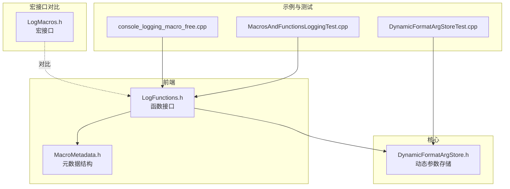
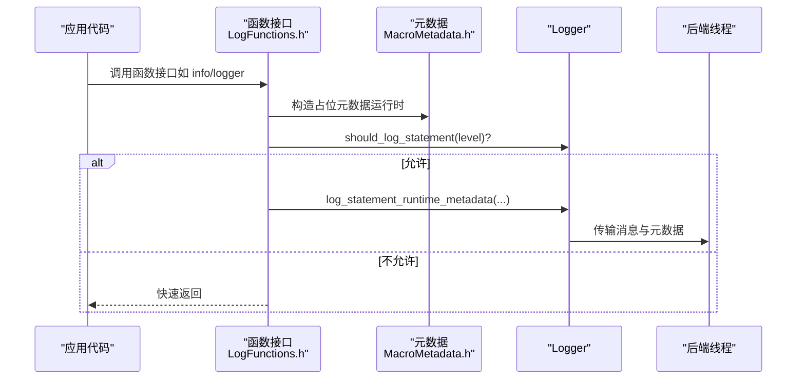
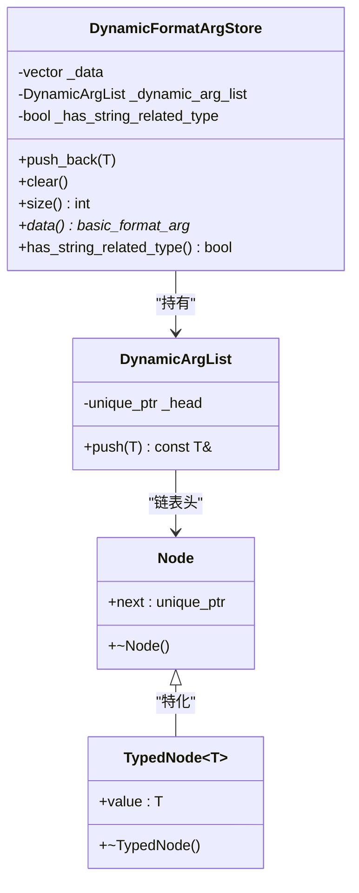
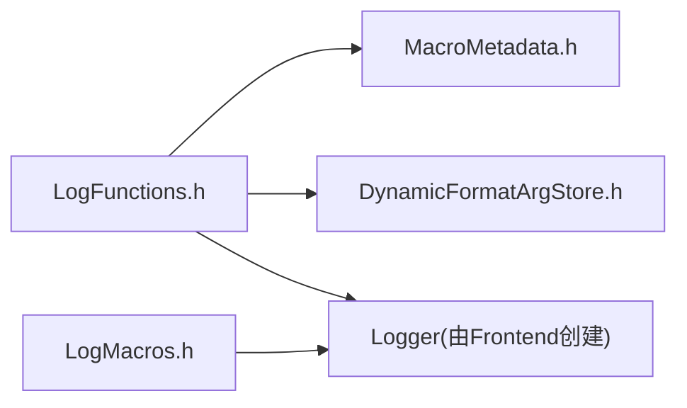

# 日志函数接口

<cite>
**本文引用的文件列表**
- [LogFunctions.h](file://include/quill/LogFunctions.h)
- [DynamicFormatArgStore.h](file://include/quill/core/DynamicFormatArgStore.h)
- [LogMacros.h](file://include/quill/LogMacros.h)
- [MacroMetadata.h](file://include/quill/core/MacroMetadata.h)
- [console_logging_macro_free.cpp](file://examples/console_logging_macro_free.cpp)
- [DynamicFormatArgStoreTest.cpp](file://test/unit_tests/DynamicFormatArgStoreTest.cpp)
- [MacrosAndFunctionsLoggingTest.cpp](file://test/integration_tests/MacrosAndFunctionsLoggingTest.cpp)
- [macro_free_mode.rst](file://docs/macro_free_mode.rst)
- [logging_macros.rst](file://docs/logging_macros.rst)
</cite>

## 目录
1. [简介](#简介)
2. [项目结构](#项目结构)
3. [核心组件](#核心组件)
4. [架构总览](#架构总览)
5. [详细组件分析](#详细组件分析)
6. [依赖关系分析](#依赖关系分析)
7. [性能考量](#性能考量)
8. [故障排查指南](#故障排查指南)
9. [结论](#结论)
10. [附录：API 参考](#附录api-参考)

## 简介
本文件面向 Quill 的“日志函数接口”，系统性阐述基于函数的宏自由（macro-free）日志记录接口，覆盖：
- 不同重载版本的参数类型与使用场景
- DynamicFormatArgStore 的作用、实现原理与动态参数存储机制
- 函数接口与宏接口的性能对比（调用开销、编译时优化、运行时行为）
- 完整 API 参考（函数签名、参数说明、返回值）
- 格式化参数处理机制（类型推导、参数验证、错误处理）
- 实际使用示例与最佳实践（性能优化、内存管理）

## 项目结构
围绕日志函数接口的关键文件组织如下：
- 函数接口定义：include/quill/LogFunctions.h
- 动态参数存储：include/quill/core/DynamicFormatArgStore.h
- 宏接口（对比参考）：include/quill/LogMacros.h
- 元数据结构：include/quill/core/MacroMetadata.h
- 示例与测试：examples/console_logging_macro_free.cpp、test/unit_tests/DynamicFormatArgStoreTest.cpp、test/integration_tests/MacrosAndFunctionsLoggingTest.cpp
- 文档：docs/macro_free_mode.rst、docs/logging_macros.rst

图表来源
- [LogFunctions.h:1-345](file://include/quill/LogFunctions.h#L1-L345)
- [DynamicFormatArgStore.h:1-157](file://include/quill/core/DynamicFormatArgStore.h#L1-L157)
- [LogMacros.h:1-1203](file://include/quill/LogMacros.h#L1-L1203)
- [MacroMetadata.h:1-195](file://include/quill/core/MacroMetadata.h#L1-L195)
- [console_logging_macro_free.cpp:1-62](file://examples/console_logging_macro_free.cpp#L1-L62)
- [DynamicFormatArgStoreTest.cpp:1-33](file://test/unit_tests/DynamicFormatArgStoreTest.cpp#L1-L33)
- [MacrosAndFunctionsLoggingTest.cpp:1-83](file://test/integration_tests/MacrosAndFunctionsLoggingTest.cpp#L1-L83)

章节来源
- [LogFunctions.h:1-345](file://include/quill/LogFunctions.h#L1-L345)
- [DynamicFormatArgStore.h:1-157](file://include/quill/core/DynamicFormatArgStore.h#L1-L157)
- [LogMacros.h:1-1203](file://include/quill/LogMacros.h#L1-L1203)
- [MacroMetadata.h:1-195](file://include/quill/core/MacroMetadata.h#L1-L195)
- [console_logging_macro_free.cpp:1-62](file://examples/console_logging_macro_free.cpp#L1-L62)
- [DynamicFormatArgStoreTest.cpp:1-33](file://test/unit_tests/DynamicFormatArgStoreTest.cpp#L1-L33)
- [MacrosAndFunctionsLoggingTest.cpp:1-83](file://test/integration_tests/MacrosAndFunctionsLoggingTest.cpp#L1-L83)

## 核心组件
- 基于函数的日志接口：提供以函数形式调用的日志能力，避免宏，便于在某些场景获得更清晰的代码风格。
- DynamicFormatArgStore：用于在运行时收集可变参数，支持类型擦除与按需分配，兼容 fmt 风格的格式化参数传递。
- 宏接口对比：通过宏在编译期生成格式字符串、过滤日志级别、内联元数据，具备零开销特性；函数接口则在运行时复制元数据，带来额外成本。

章节来源
- [LogFunctions.h:21-48](file://include/quill/LogFunctions.h#L21-L48)
- [DynamicFormatArgStore.h:77-157](file://include/quill/core/DynamicFormatArgStore.h#L77-L157)
- [LogMacros.h:28-46](file://include/quill/LogMacros.h#L28-L46)

## 架构总览
函数接口与宏接口在调用路径上的关键差异：
- 宏接口：在编译期生成格式字符串与元数据，直接调用 Logger 的模板方法，避免运行时复制。
- 函数接口：在运行时构造占位的元数据，调用带“运行时元数据”的日志方法，增加一次拷贝与一次分支判断。

图表来源
- [LogFunctions.h:323-343](file://include/quill/LogFunctions.h#L323-L343)
- [MacroMetadata.h:22-51](file://include/quill/core/MacroMetadata.h#L22-L51)

章节来源
- [LogFunctions.h:323-343](file://include/quill/LogFunctions.h#L323-L343)
- [MacroMetadata.h:22-51](file://include/quill/core/MacroMetadata.h#L22-L51)

## 详细组件分析

### 组件一：基于函数的日志接口（LogFunctions）
- 设计目标：在不使用宏的前提下提供一致的日志体验，适合对宏有约束或偏好函数式调用的场景。
- 主要能力：
  - 提供多级日志函数（TraceL3/L2/L1、Debug、Info、Notice、Warning、Error、Critical、Backtrace）
  - 支持 Tags 结构体传入多个标签
  - 支持 SourceLocation 自动注入文件名、函数名、行号
  - 内置 should_log_statement 判断，避免无效调用
- 关键点：
  - 使用占位的 MacroMetadata（运行时元数据），在调用链中作为“浅拷贝/混合拷贝”事件传递
  - 参数总是被求值，无法像宏一样在禁用级别时跳过
  - 无法完全编译移除（与 QUILL_COMPILE_ACTIVE_LOG_LEVEL_* 的宏行为不同）

章节来源
- [LogFunctions.h:53-111](file://include/quill/LogFunctions.h#L53-L111)
- [LogFunctions.h:113-322](file://include/quill/LogFunctions.h#L113-L322)
- [LogFunctions.h:323-343](file://include/quill/LogFunctions.h#L323-L343)

### 组件二：DynamicFormatArgStore（动态参数存储）
- 作用：在运行时收集可变参数，构建 fmt 风格的参数表，支持类型擦除与按需分配。
- 实现要点：
  - 使用连续容器保存基本类型参数，使用链表式节点保存非基本类型（如 string_view、自定义类型等）
  - push_back 按类型映射策略决定是否直接放入连续容器或存入动态链表
  - has_string_related_type 标记用于后续格式化路径优化
  - clear 清空状态，便于复用
- 类型处理：
  - 对 string/string_view 等字符串相关类型进行特殊标记与处理
  - 对不可移动类型采用拷贝策略，保证类型安全

图表来源
- [DynamicFormatArgStore.h:77-157](file://include/quill/core/DynamicFormatArgStore.h#L77-L157)
- [DynamicFormatArgStore.h:22-71](file://include/quill/core/DynamicFormatArgStore.h#L22-L71)

章节来源
- [DynamicFormatArgStore.h:77-157](file://include/quill/core/DynamicFormatArgStore.h#L77-L157)

### 组件三：宏接口（对比参考）
- 编译期优化：
  - 通过 QUILL_COMPILE_ACTIVE_LOG_LEVEL_* 在编译期剔除低级别日志
  - 自动生成格式字符串与命名参数，零运行时开销
- 运行时行为：
  - 直接调用 Logger 的模板方法，避免运行时元数据复制
  - 支持限流、每 N 次打印一次、标签等高级特性

章节来源
- [LogMacros.h:28-46](file://include/quill/LogMacros.h#L28-L46)
- [logging_macros.rst:34-338](file://docs/logging_macros.rst#L34-L338)

### 组件四：元数据结构（MacroMetadata）
- 作用：封装源文件位置、函数名、消息格式、标签、日志级别、事件类型等信息。
- 特性：
  - 事件类型枚举包含“运行时深拷贝/混合拷贝/浅拷贝”等选项
  - 提供解析短文件名、完整路径、行号等工具方法
  - 尺寸限制在缓存行以内，保证高效传输

章节来源
- [MacroMetadata.h:22-195](file://include/quill/core/MacroMetadata.h#L22-L195)

### 组件五：示例与测试
- 示例：console_logging_macro_free.cpp 展示了函数接口的常见用法，涵盖各日志级别与 Tags。
- 单元测试：DynamicFormatArgStoreTest.cpp 验证了 push_back 与 vformat 的组合使用。
- 集成测试：MacrosAndFunctionsLoggingTest.cpp 验证函数接口与宏接口混用的一致性与正确性。

章节来源
- [console_logging_macro_free.cpp:1-62](file://examples/console_logging_macro_free.cpp#L1-L62)
- [DynamicFormatArgStoreTest.cpp:14-31](file://test/unit_tests/DynamicFormatArgStoreTest.cpp#L14-L31)
- [MacrosAndFunctionsLoggingTest.cpp:17-83](file://test/integration_tests/MacrosAndFunctionsLoggingTest.cpp#L17-L83)

## 依赖关系分析
- 函数接口依赖：
  - MacroMetadata：用于构造运行时元数据
  - Logger：执行日志落盘与转发
  - DynamicFormatArgStore：收集参数
- 宏接口依赖：
  - 编译期常量与宏展开，直接调用 Logger 模板方法
- 共同依赖：
  - fmt 风格的格式化参数模型（basic_format_arg/basic_format_args）

图表来源
- [LogFunctions.h:323-343](file://include/quill/LogFunctions.h#L323-L343)
- [MacroMetadata.h:22-51](file://include/quill/core/MacroMetadata.h#L22-L51)
- [LogMacros.h:306-314](file://include/quill/LogMacros.h#L306-L314)

章节来源
- [LogFunctions.h:323-343](file://include/quill/LogFunctions.h#L323-L343)
- [LogMacros.h:306-314](file://include/quill/LogMacros.h#L306-L314)

## 性能考量
- 函数接口的性能劣势：
  - 运行时元数据复制：每次调用构造占位元数据，增加一次拷贝
  - 参数总是求值：无法像宏一样在禁用级别时跳过表达式
  - 无法完全编译移除：与 QUILL_COMPILE_ACTIVE_LOG_LEVEL_* 的宏行为不同
  - 后端线程负载略增：需要处理运行时元数据存储与处理
- 宏接口的优势：
  - 编译期生成格式字符串与元数据，零运行时开销
  - 可完全剔除低级别日志，减少分支与元数据实例数量
- 实践建议：
  - 性能敏感路径优先使用宏接口
  - 需要函数式调用或在特定编译器/平台受限场景使用函数接口
  - 对于高频日志，尽量避免昂贵的参数表达式（例如大对象构造、字符串拼接）

章节来源
- [LogFunctions.h:31-47](file://include/quill/LogFunctions.h#L31-L47)
- [macro_free_mode.rst:10-22](file://docs/macro_free_mode.rst#L10-L22)
- [LogMacros.h:28-46](file://include/quill/LogMacros.h#L28-L46)

## 故障排查指南
- 参数未按预期格式化
  - 检查 DynamicFormatArgStore 的 push_back 是否正确处理了类型映射
  - 确认 has_string_related_type 标记是否影响了格式化路径
- 日志未输出
  - 确认 Logger 的日志级别设置是否允许当前级别
  - 函数接口会始终评估参数，若存在异常表达式导致崩溃，请检查参数构造逻辑
- 标签未生效
  - 确认 Tags 构造与 value() 返回值是否正确
  - 检查函数接口是否传入了空指针或非法标签

章节来源
- [DynamicFormatArgStoreTest.cpp:14-31](file://test/unit_tests/DynamicFormatArgStoreTest.cpp#L14-L31)
- [LogFunctions.h:53-111](file://include/quill/LogFunctions.h#L53-L111)

## 结论
- 函数接口提供了宏之外的替代方案，适合对宏有约束或偏好函数式调用的场景
- 宏接口在编译期优化与运行时零开销方面具有明显优势
- DynamicFormatArgStore 通过类型擦除与按需分配，实现了灵活且高效的参数收集
- 在性能敏感路径应优先使用宏接口；在需要函数式调用或受限环境下再考虑函数接口

## 附录：API 参考

### 函数接口概览
- 日志级别函数族（均支持 Tags 与 SourceLocation）
  - tracel3、tracel2、tracel1、debug、info、notice、warning、error、critical、backtrace
  - 每个函数均提供两个重载：
    - 无标签版本：接受 logger、格式串、若干参数、可选 SourceLocation
    - 带标签版本：接受 logger、Tags、格式串、若干参数、可选 SourceLocation
- 通用 log 函数
  - 接口：log(logger, tags, level, fmt, location, args...)
  - 行为：内部构造占位元数据，调用带运行时元数据的日志方法

章节来源
- [LogFunctions.h:113-322](file://include/quill/LogFunctions.h#L113-L322)
- [LogFunctions.h:323-343](file://include/quill/LogFunctions.h#L323-L343)

### Tags 结构体
- 用途：将多个标签合并为一个字符串，便于在函数接口中传入
- 构造：
  - 单标签：explicit Tags(char const*)
  - 多标签：template <typename... RestTags> Tags(char const*, char const*, RestTags...)
- 成员：
  - value()：返回标签字符串（以 '#' 开头，空格分隔）

章节来源
- [LogFunctions.h:53-111](file://include/quill/LogFunctions.h#L53-L111)

### 动态参数存储（DynamicFormatArgStore）
- push_back(T)
  - 将参数加入存储，根据类型映射策略决定放入连续容器或动态链表
  - 对字符串相关类型设置 has_string_related_type 标记
- data() / size()
  - 返回参数数组指针与大小，供 fmt vformat 使用
- clear()
  - 清空存储，便于复用
- has_string_related_type()
  - 查询是否存在字符串相关类型，用于格式化路径优化

章节来源
- [DynamicFormatArgStore.h:115-144](file://include/quill/core/DynamicFormatArgStore.h#L115-L144)
- [DynamicFormatArgStore.h:99-102](file://include/quill/core/DynamicFormatArgStore.h#L99-L102)
- [DynamicFormatArgStore.h:147-154](file://include/quill/core/DynamicFormatArgStore.h#L147-L154)

### 宏接口（对比参考）
- 标准宏族（每个级别均有 LIMIT/EVERY_N/TAGS/V/J 变体）
- 编译期过滤：QUILL_COMPILE_ACTIVE_LOG_LEVEL_* 可完全移除低级别日志
- 运行时元数据：LOG_RUNTIME_METADATA_* 提供运行时级别与元数据控制

章节来源
- [LogMacros.h:373-944](file://include/quill/LogMacros.h#L373-L944)
- [logging_macros.rst:34-338](file://docs/logging_macros.rst#L34-L338)

### 使用示例与最佳实践
- 示例：console_logging_macro_free.cpp 展示了函数接口在控制台输出中的使用，涵盖各日志级别与 Tags
- 最佳实践：
  - 性能敏感路径优先使用宏接口
  - 避免在函数接口中传入昂贵的参数表达式
  - 合理使用 Tags，统一标签格式
  - 在高频日志中，尽量减少字符串拼接与临时对象构造

章节来源
- [console_logging_macro_free.cpp:1-62](file://examples/console_logging_macro_free.cpp#L1-L62)