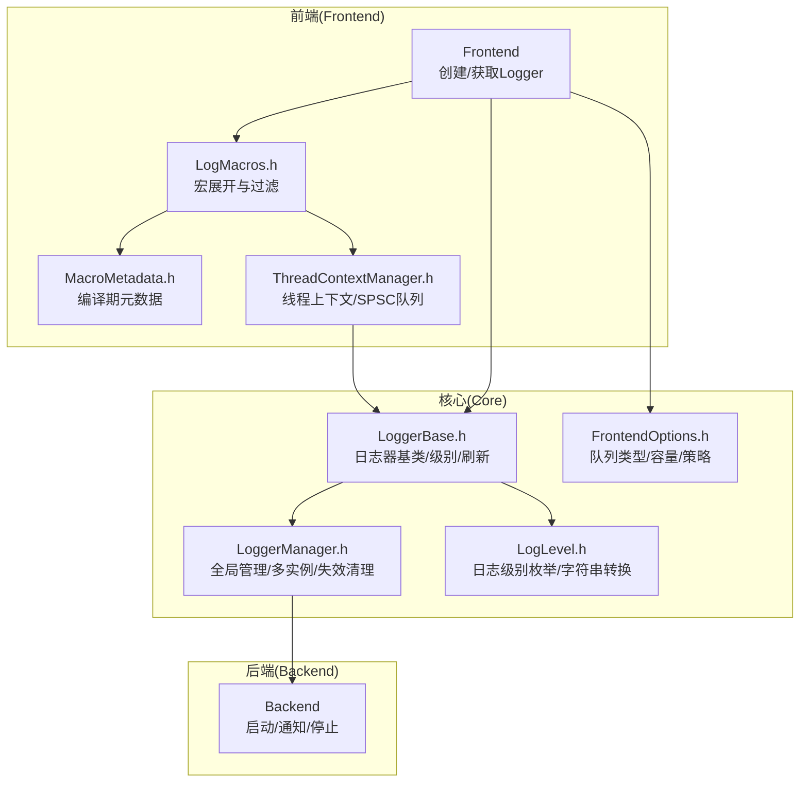
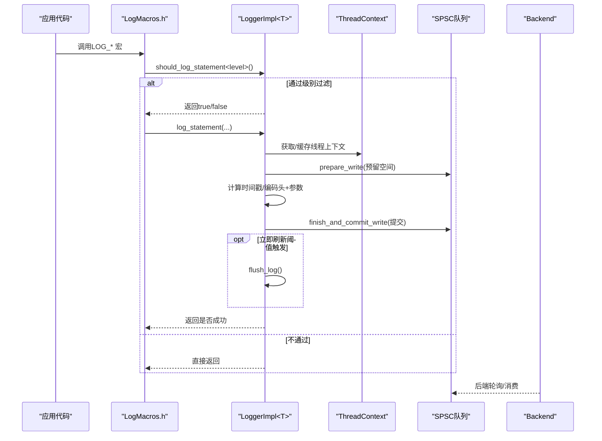
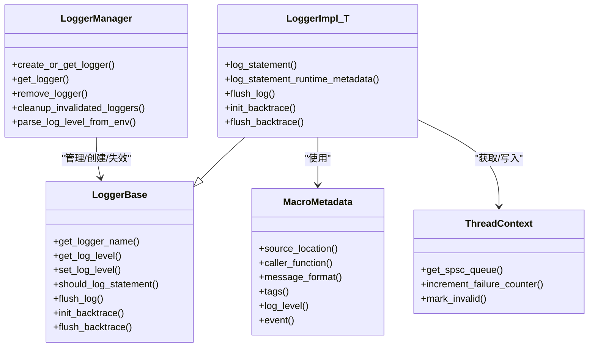

# 日志器系统

<cite>
**本文引用的文件列表**
- [Logger.h](file://include/quill/Logger.h)
- [LoggerBase.h](file://include/quill/core/LoggerBase.h)
- [LoggerManager.h](file://include/quill/core/LoggerManager.h)
- [LogLevel.h](file://include/quill/core/LogLevel.h)
- [LogMacros.h](file://include/quill/LogMacros.h)
- [MacroMetadata.h](file://include/quill/core/MacroMetadata.h)
- [ThreadContextManager.h](file://include/quill/core/ThreadContextManager.h)
- [FrontendOptions.h](file://include/quill/core/FrontendOptions.h)
- [SimpleSetup.h](file://include/quill/SimpleSetup.h)
- [LoggerTest.cpp](file://test/unit_tests/LoggerTest.cpp)
- [MultiFrontendThreadsTest.cpp](file://test/integration_tests/MultiFrontendThreadsTest.cpp)
- [recommended_usage.cpp](file://examples/recommended_usage/recommended_usage.cpp)
</cite>

## 目录
1. [简介](#简介)
2. [项目结构](#项目结构)
3. [核心组件](#核心组件)
4. [架构总览](#架构总览)
5. [详细组件分析](#详细组件分析)
6. [依赖关系分析](#依赖关系分析)
7. [性能考量](#性能考量)
8. [故障排查指南](#故障排查指南)
9. [结论](#结论)
10. [附录](#附录)

## 简介
本文件面向Quill日志器系统，聚焦以下目标：
- 全面解析Logger类的设计与实现，包括生命周期管理、多实例支持与线程安全。
- 深入讲解日志级别定义与管理机制，覆盖编译时优化与运行时过滤。
- 详解日志宏系统的实现原理，包括宏展开、参数收集与模板特化技术。
- 提供配置最佳实践与性能优化建议，并给出多线程环境下的使用注意事项。

## 项目结构
Quill采用“前端-后端”分层设计：前端负责快速写入队列，后端负责格式化与落盘。日志器位于前端，通过线程本地上下文与SPSC队列实现零拷贝与低开销。

图表来源
- [Logger.h:47-508](file://include/quill/Logger.h#L47-L508)
- [LoggerBase.h:35-210](file://include/quill/core/LoggerBase.h#L35-L210)
- [LoggerManager.h:33-311](file://include/quill/core/LoggerManager.h#L33-L311)
- [LogMacros.h:300-372](file://include/quill/LogMacros.h#L300-L372)
- [MacroMetadata.h:22-195](file://include/quill/core/MacroMetadata.h#L22-L195)
- [ThreadContextManager.h:53-214](file://include/quill/core/ThreadContextManager.h#L53-L214)
- [FrontendOptions.h:16-52](file://include/quill/core/FrontendOptions.h#L16-L52)

章节来源
- [Logger.h:47-508](file://include/quill/Logger.h#L47-L508)
- [LoggerBase.h:35-210](file://include/quill/core/LoggerBase.h#L35-L210)
- [LoggerManager.h:33-311](file://include/quill/core/LoggerManager.h#L33-L311)
- [LogMacros.h:300-372](file://include/quill/LogMacros.h#L300-L372)
- [MacroMetadata.h:22-195](file://include/quill/core/MacroMetadata.h#L22-L195)
- [ThreadContextManager.h:53-214](file://include/quill/core/ThreadContextManager.h#L53-L214)
- [FrontendOptions.h:16-52](file://include/quill/core/FrontendOptions.h#L16-L52)

## 核心组件
- Logger类（模板）：封装日志写入、时间戳采集、队列预留与提交、回溯初始化与刷新、即时刷新阈值控制等。
- LoggerBase：提供日志级别查询/设置、刷新阈值、有效性标记、用户时钟源、模式格式化选项与Sink集合等。
- LoggerManager：全局单例，维护所有Logger实例，支持创建/获取、失效标记、清理无效实例、从环境变量解析默认级别。
- LogLevel：定义日志级别枚举及字符串到枚举的转换。
- LogMacros：宏系统，包含编译期过滤、运行时过滤、限流、标签生成、命名/位置参数格式化、运行时元数据记录等。
- MacroMetadata：编译期捕获源文件、函数名、消息格式、标签、级别与事件类型。
- ThreadContextManager：线程本地上下文管理，持有每线程SPSC队列、失败计数、线程ID/名称缓存、注册/注销与失效检测。
- FrontendOptions：前端队列类型、初始容量、阻塞重试间隔、最大容量与大页策略等配置。
- SimpleSetup：简化前后端启动与控制台/文件输出的便捷入口。

章节来源
- [Logger.h:47-508](file://include/quill/Logger.h#L47-L508)
- [LoggerBase.h:35-210](file://include/quill/core/LoggerBase.h#L35-L210)
- [LoggerManager.h:33-311](file://include/quill/core/LoggerManager.h#L33-L311)
- [LogLevel.h:22-128](file://include/quill/core/LogLevel.h#L22-L128)
- [LogMacros.h:300-372](file://include/quill/LogMacros.h#L300-L372)
- [MacroMetadata.h:22-195](file://include/quill/core/MacroMetadata.h#L22-L195)
- [ThreadContextManager.h:53-214](file://include/quill/core/ThreadContextManager.h#L53-L214)
- [FrontendOptions.h:16-52](file://include/quill/core/FrontendOptions.h#L16-L52)
- [SimpleSetup.h:46-74](file://include/quill/SimpleSetup.h#L46-L74)

## 架构总览
前端路径：宏展开 → 编译期元数据 → 前端过滤（级别）→ 队列预留/编码 → 提交/可选立即刷新 → 后端消费。

图表来源
- [LogMacros.h:306-314](file://include/quill/LogMacros.h#L306-L314)
- [Logger.h:75-136](file://include/quill/Logger.h#L75-L136)
- [ThreadContextManager.h:100-131](file://include/quill/core/ThreadContextManager.h#L100-L131)

章节来源
- [LogMacros.h:306-314](file://include/quill/LogMacros.h#L306-L314)
- [Logger.h:75-136](file://include/quill/Logger.h#L75-L136)
- [ThreadContextManager.h:100-131](file://include/quill/core/ThreadContextManager.h#L100-L131)

## 详细组件分析

### Logger类与生命周期
- 设计要点
  - LoggerImpl<TFrontendOptions>继承自LoggerBase，模板参数决定队列类型、容量与策略。
  - 线程安全：日志写入通过每线程SPSC队列与原子操作保证；刷新/回溯等控制消息通过队列投递，避免竞争。
  - 生命周期：由LoggerManager统一创建/获取；调用者通过Frontend接口或直接构造（内部私有），但通常通过管理器获取。
  - 失效与清理：LoggerManager标记失效后，后台清理阶段检查队列空闲再移除；避免在活跃期间删除。

- 关键方法
  - log_statement/log_statement_runtime_metadata：计算时间戳、预留空间、编码头与参数、提交写入；支持阻塞/丢弃队列策略与失败计数。
  - flush_log：阻塞等待后端处理至当前时间点；注意静态对象析构时的线程本地上下文生命周期问题。
  - init_backtrace/flush_backtrace：初始化回溯缓冲并在需要时打印。
  - set_immediate_flush：按消息数量阈值自动触发flush_log，便于调试。

- 线程上下文与队列
  - 每线程缓存ThreadContext指针，减少重复查找；SPSC队列类型由FrontendOptions决定。
  - 队列满时：阻塞队列会睡眠重试；丢弃队列会增加失败计数并丢弃消息。

- 时间戳策略
  - 支持TSC、系统时钟与用户自定义时钟源；优先级由ClockSourceType决定。

章节来源
- [Logger.h:47-508](file://include/quill/Logger.h#L47-L508)
- [LoggerBase.h:35-210](file://include/quill/core/LoggerBase.h#L35-L210)
- [ThreadContextManager.h:53-214](file://include/quill/core/ThreadContextManager.h#L53-L214)
- [FrontendOptions.h:16-52](file://include/quill/core/FrontendOptions.h#L16-L52)

### 日志级别与管理
- 级别定义
  - 包含TraceL3/L2/L1、Debug、Info、Notice、Warning、Error、Critical、Backtrace、None。
  - Backtrace仅用于内部回溯，禁止用户设置。

- 运行时过滤
  - LoggerBase::should_log_statement<level>()与should_log_statement(level)进行级别比较。
  - set_log_level设置当前级别；get_log_level读取级别（原子）。

- 编译时优化
  - 通过QUILL_COMPILE_ACTIVE_LOG_LEVEL宏在编译期完全剔除低级别宏展开，实现零成本日志。
  - 默认-1表示启用全部级别；设置为某级别及以上将禁用更低级别。

- 环境变量
  - LoggerManager::parse_log_level_from_env从环境变量QUILL_LOG_LEVEL解析默认级别，影响新创建的Logger。

章节来源
- [LogLevel.h:22-128](file://include/quill/core/LogLevel.h#L22-L128)
- [LoggerBase.h:118-184](file://include/quill/core/LoggerBase.h#L118-L184)
- [LoggerManager.h:247-273](file://include/quill/core/LoggerManager.h#L247-L273)
- [LogMacros.h:28-45](file://include/quill/LogMacros.h#L28-L45)

### 日志宏系统实现原理
- 宏展开与过滤
  - QUILL_LOGGER_CALL：先进行should_log_statement<level>()判断，再构造MacroMetadata并调用log_statement。
  - 编译期过滤：QUILL_COMPILE_ACTIVE_LOG_LEVEL控制各级别宏是否展开为非空语句。

- 参数收集与模板特化
  - QUILL_GENERATE_FORMAT_STRING/QUILL_GENERATE_NAMED_FORMAT_STRING：通过变参宏与选择器宏生成带占位符的格式串，配合模板参数包完成参数编码。
  - decode_and_store_args/encode：在编译期计算编码大小并缓存参数长度，运行期高效写入。

- 限流与标签
  - QUILL_LOGGER_CALL_LIMIT：基于线程局部计时器与抑制计数，限制高频日志输出。
  - QUILL_TAGS与QUILL_GENERATE_TAG_*：生成以#开头的标签字符串，便于后端格式化。

- 运行时元数据
  - QUILL_LOG_RUNTIME_METADATA_*系列宏：允许在运行时传入文件/函数/行号/标签/级别等信息，支持深拷贝/浅拷贝/混合拷贝策略。

- 回溯宏
  - QUILL_LOG_BACKTRACE_*：记录回溯消息，必要时触发flush_backtrace。

章节来源
- [LogMacros.h:300-372](file://include/quill/LogMacros.h#L300-L372)
- [LogMacros.h:373-915](file://include/quill/LogMacros.h#L373-L915)
- [LogMacros.h:917-973](file://include/quill/LogMacros.h#L917-L973)
- [LogMacros.h:974-1203](file://include/quill/LogMacros.h#L974-L1203)
- [MacroMetadata.h:22-195](file://include/quill/core/MacroMetadata.h#L22-L195)

### 多实例支持与线程安全
- 多实例
  - LoggerManager::create_or_get_logger<TLogger>根据名称创建或复用Logger；支持从现有Logger复制配置。
  - Frontend提供便捷入口，SimpleSetup可直接创建控制台/文件输出的Logger并启动后端。

- 线程安全
  - 每线程SPSC队列避免跨线程竞争；LoggerBase中的原子变量保护级别、刷新阈值、有效性与回溯级别。
  - ThreadContextManager注册/注销线程上下文，跟踪失效上下文数量，后台清理时确保队列为空。

- 测试与示例
  - 单元测试验证Logger属性与should_log行为。
  - 多线程集成测试展示并发写入与flush/移除流程。
  - 推荐用法示例演示全局Logger与不同级别日志输出。

章节来源
- [LoggerManager.h:152-185](file://include/quill/core/LoggerManager.h#L152-L185)
- [LoggerManager.h:201-239](file://include/quill/core/LoggerManager.h#L201-L239)
- [SimpleSetup.h:46-74](file://include/quill/SimpleSetup.h#L46-L74)
- [LoggerTest.cpp:14-80](file://test/unit_tests/LoggerTest.cpp#L14-L80)
- [MultiFrontendThreadsTest.cpp:17-94](file://test/integration_tests/MultiFrontendThreadsTest.cpp#L17-L94)
- [recommended_usage.cpp:34-49](file://examples/recommended_usage/recommended_usage.cpp#L34-L49)

## 依赖关系分析

图表来源
- [Logger.h:47-508](file://include/quill/Logger.h#L47-L508)
- [LoggerBase.h:35-210](file://include/quill/core/LoggerBase.h#L35-L210)
- [LoggerManager.h:152-185](file://include/quill/core/LoggerManager.h#L152-L185)
- [ThreadContextManager.h:53-214](file://include/quill/core/ThreadContextManager.h#L53-L214)
- [MacroMetadata.h:22-195](file://include/quill/core/MacroMetadata.h#L22-L195)

章节来源
- [Logger.h:47-508](file://include/quill/Logger.h#L47-L508)
- [LoggerBase.h:35-210](file://include/quill/core/LoggerBase.h#L35-L210)
- [LoggerManager.h:152-185](file://include/quill/core/LoggerManager.h#L152-L185)
- [ThreadContextManager.h:53-214](file://include/quill/core/ThreadContextManager.h#L53-L214)
- [MacroMetadata.h:22-195](file://include/quill/core/MacroMetadata.h#L22-L195)

## 性能考量
- 编译期优化
  - 使用QUILL_COMPILE_ACTIVE_LOG_LEVEL在编译期剔除低级别宏展开，减少分支与元数据实例数量，实现零成本日志。
- 运行期优化
  - 每线程SPSC队列避免锁争用；参数长度缓存减少运行期计算；时间戳在进入日志路径前采集，提升精度。
  - 阻塞队列可配置重试间隔，平衡吞吐与延迟；丢弃队列在高负载下降低丢失率。
- 刷新策略
  - set_immediate_flush按消息数量阈值触发flush_log，适合调试场景；生产环境应谨慎开启以避免性能下降。
- 大页与内存
  - FrontendOptions::huge_pages_policy可在Linux上启用大页以降低TLB缺失，提升缓存命中。

章节来源
- [LogMacros.h:28-45](file://include/quill/LogMacros.h#L28-L45)
- [Logger.h:408-475](file://include/quill/Logger.h#L408-L475)
- [FrontendOptions.h:16-52](file://include/quill/core/FrontendOptions.h#L16-L52)

## 故障排查指南
- 静态对象析构导致崩溃
  - flush_log在静态对象析构时可能因线程本地上下文提前销毁而失败。请避免在静态对象析构中调用flush_log。
- 级别设置异常
  - 设置LogLevel::Backtrace会抛出异常；请勿将其作为用户日志级别。
- 队列满与消息丢失
  - 丢弃队列会在空间不足时丢弃消息并增加失败计数；可通过监控失败计数评估系统压力。
- 环境变量未生效
  - 确认QUILL_LOG_LEVEL环境变量正确设置；LoggerManager会在初始化时解析该变量。

章节来源
- [LoggerBase.h:135-143](file://include/quill/core/LoggerBase.h#L135-L143)
- [Logger.h:319-352](file://include/quill/Logger.h#L319-L352)
- [LoggerManager.h:247-273](file://include/quill/core/LoggerManager.h#L247-L273)
- [ThreadContextManager.h:188-201](file://include/quill/core/ThreadContextManager.h#L188-L201)

## 结论
Quill的日志器系统通过“前端-后端”解耦、编译期过滤、线程本地队列与原子控制，实现了高性能、可扩展且易用的日志框架。Logger类承担了关键的写入与刷新职责，结合LoggerManager与ThreadContextManager，提供了完善的多实例与线程安全支持。合理配置FrontendOptions与日志级别，配合宏系统的编译期优化，可在生产环境中获得极佳的吞吐与低延迟表现。

## 附录
- 快速开始
  - 使用SimpleSetup快速创建控制台/文件Logger并启动后端。
- 最佳实践
  - 生产环境：启用编译期过滤；使用UnboundedBlocking或BoundedBlocking队列；避免在静态对象析构中调用flush_log。
  - 调试环境：启用set_immediate_flush按需刷新；使用Backtrace功能定位问题。
- 参考示例
  - 推荐用法示例展示了全局Logger与多级别日志输出。
  - 多线程集成测试展示了并发写入与清理流程。

章节来源
- [SimpleSetup.h:46-74](file://include/quill/SimpleSetup.h#L46-L74)
- [recommended_usage.cpp:34-49](file://examples/recommended_usage/recommended_usage.cpp#L34-L49)
- [MultiFrontendThreadsTest.cpp:17-94](file://test/integration_tests/MultiFrontendThreadsTest.cpp#L17-L94)