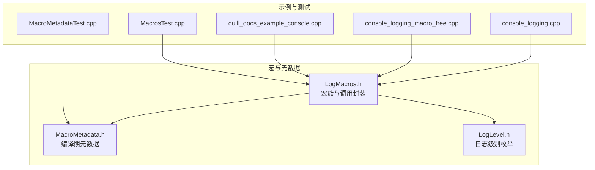
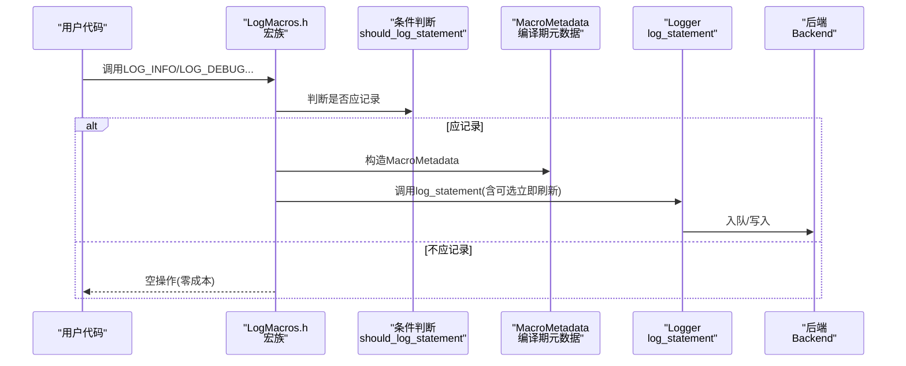
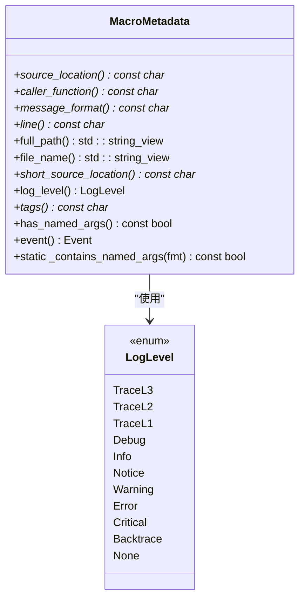
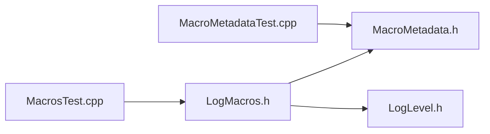

# 日志宏系统

<cite>
**本文引用的文件**
- [LogMacros.h](file://include/quill/LogMacros.h)
- [MacroMetadata.h](file://include/quill/core/MacroMetadata.h)
- [LogLevel.h](file://include/quill/core/LogLevel.h)
- [logging_macros.rst](file://docs/logging_macros.rst)
- [macro_free_mode.rst](file://docs/macro_free_mode.rst)
- [console_logging.cpp](file://examples/console_logging.cpp)
- [console_logging_macro_free.cpp](file://examples/console_logging_macro_free.cpp)
- [quill_docs_example_console.cpp](file://docs/examples/quill_docs_example_console.cpp)
- [MacrosTest.cpp](file://test/integration_tests/MacrosTest.cpp)
- [MacroMetadataTest.cpp](file://test/unit_tests/MacroMetadataTest.cpp)
</cite>

## 目录
1. [简介](#简介)
2. [项目结构](#项目结构)
3. [核心组件](#核心组件)
4. [架构总览](#架构总览)
5. [详细组件分析](#详细组件分析)
6. [依赖关系分析](#依赖关系分析)
7. [性能考量](#性能考量)
8. [故障排查指南](#故障排查指南)
9. [结论](#结论)
10. [附录](#附录)

## 简介
本文件面向Quill日志宏系统，系统性阐述其设计与实现：宏展开机制、参数收集与模板特化、日志级别与宏族差异、宏元数据（MacroMetadata）结构与作用、编译期优化（条件编译、内联展开）、宏自由模式（函数式接口）及其适用场景。文档同时提供丰富的使用示例路径与最佳实践，帮助读者在性能与易用性之间做出合理选择。

## 项目结构
Quill的日志宏系统主要由以下模块构成：
- 宏定义与调用链：位于日志头文件中，负责将用户调用转换为后端处理。
- 宏元数据：在编译期捕获源码位置、函数名、消息格式、标签、事件类型等信息。
- 日志级别：枚举定义了从TraceL3到Critical的完整等级体系。
- 文档与示例：官方文档与示例代码展示了宏族的使用方式与宏自由模式。

图表来源
- [LogMacros.h:1-1203](file://include/quill/LogMacros.h#L1-L1203)
- [MacroMetadata.h:1-195](file://include/quill/core/MacroMetadata.h#L1-L195)
- [LogLevel.h:1-128](file://include/quill/core/LogLevel.h#L1-L128)
- [console_logging.cpp:1-72](file://examples/console_logging.cpp#L1-L72)
- [console_logging_macro_free.cpp:1-62](file://examples/console_logging_macro_free.cpp#L1-L62)
- [quill_docs_example_console.cpp:1-49](file://docs/examples/quill_docs_example_console.cpp#L1-L49)
- [MacrosTest.cpp:1-416](file://test/integration_tests/MacrosTest.cpp#L1-L416)
- [MacroMetadataTest.cpp:1-200](file://test/unit_tests/MacroMetadataTest.cpp#L1-L200)

章节来源
- [LogMacros.h:1-1203](file://include/quill/LogMacros.h#L1-L1203)
- [MacroMetadata.h:1-195](file://include/quill/core/MacroMetadata.h#L1-L195)
- [LogLevel.h:1-128](file://include/quill/core/LogLevel.h#L1-L128)

## 核心组件
- 宏族与调用封装
  - 提供标准宏族（如LOG_INFO、LOG_DEBUG等）与变体（带限流、按N次输出、带标签、动态级别、运行时元数据等）。
  - 内部通过统一的调用封装（如QUILL_LOGGER_CALL）完成条件判断、元数据构造与后端调用。
- 宏元数据（MacroMetadata）
  - 编译期捕获源文件路径、行号、函数名、消息格式、标签、事件类型、日志级别等。
  - 提供命名参数检测、短路径与全路径解析、事件类型枚举等能力。
- 日志级别（LogLevel）
  - 定义TraceL3/2/1、Debug、Info、Notice、Warning、Error、Critical、Backtrace、None等。
- 宏自由模式
  - 使用函数式接口替代宏，便于无宏环境或特定场景下的代码整洁性；但存在运行时开销与编译期移除限制。

章节来源
- [LogMacros.h:300-371](file://include/quill/LogMacros.h#L300-L371)
- [MacroMetadata.h:19-90](file://include/quill/core/MacroMetadata.h#L19-L90)
- [LogLevel.h:22-35](file://include/quill/core/LogLevel.h#L22-L35)

## 架构总览
日志宏系统的核心流程如下：用户调用宏 → 条件判断是否记录 → 构造编译期元数据 → 调用后端写入。

图表来源
- [LogMacros.h:306-314](file://include/quill/LogMacros.h#L306-L314)
- [LogMacros.h:300-304](file://include/quill/LogMacros.h#L300-L304)
- [MacroMetadata.h:38-51](file://include/quill/core/MacroMetadata.h#L38-L51)

## 详细组件分析

### 宏族与调用封装
- 统一调用封装
  - QUILL_LOGGER_CALL：进行条件判断、构造MacroMetadata并调用Logger::log_statement。
  - QUILL_LOGGER_CALL_LIMIT：基于steady_clock的限流控制，支持抑制重复、统计抑制次数并在窗口结束时输出汇总。
  - QUILL_LOGGER_CALL_LIMIT_EVERY_N：按出现次数周期性输出。
  - QUILL_BACKTRACE_LOGGER_CALL：专门用于回溯日志。
- 宏族生成
  - 标准宏族：LOG_INFO、LOG_DEBUG、LOG_WARNING、LOG_ERROR、LOG_CRITICAL等，按级别生成不同版本（含_TAGS、_LIMIT、_LIMIT_EVERY_N）。
  - 值打印宏族：LOGV_*，自动为变量生成“变量名:值”的占位符，无需手动书写{}。
  - JSON宏族：LOGJ_*，自动将变量名作为键嵌入JSON格式字符串。
  - 动态宏族：LOG_DYNAMIC_*，在运行时指定日志级别。
  - 运行时元数据宏族：LOG_RUNTIME_METADATA_*，允许在运行时传入文件、行号、函数名、标签等元数据。
- 条件编译与零成本
  - 通过QUILL_COMPILE_ACTIVE_LOG_LEVEL在编译期禁用低级别宏，使这些宏展开为空语句，达到零成本过滤。

章节来源
- [LogMacros.h:306-371](file://include/quill/LogMacros.h#L306-L371)
- [LogMacros.h:373-915](file://include/quill/LogMacros.h#L373-L915)
- [LogMacros.h:917-943](file://include/quill/LogMacros.h#L917-L943)
- [LogMacros.h:945-972](file://include/quill/LogMacros.h#L945-L972)
- [LogMacros.h:974-1203](file://include/quill/LogMacros.h#L974-L1203)

### 宏元数据（MacroMetadata）
- 结构与职责
  - 捕获：源位置（含冒号分隔的文件与行号）、调用函数名、消息格式、标签、事件类型、日志级别。
  - 解析：计算文件名起始位置、冒号分隔位置，提取短路径、全路径、行号、文件名。
  - 命名参数检测：扫描格式串中的{}，识别命名参数（字母开头且非空），用于决定是否附加“occurred”计数等。
- 关键成员与方法
  - 访问器：source_location、caller_function、message_format、line、full_path、file_name、short_source_location、log_level、tags、event、has_named_args。
  - 静态检测：_contains_named_args，用于编译期判定是否包含命名参数。
- 设计要点
  - 所有字段均为const char*或索引，避免额外分配。
  - 事件类型枚举覆盖普通日志、初始化/刷新回溯、刷新、运行时元数据等场景。
  - 大小限制：确保不超过缓存行大小，减少内存占用与TLB压力。

图表来源
- [MacroMetadata.h:22-90](file://include/quill/core/MacroMetadata.h#L22-L90)
- [LogLevel.h:22-35](file://include/quill/core/LogLevel.h#L22-L35)

章节来源
- [MacroMetadata.h:19-195](file://include/quill/core/MacroMetadata.h#L19-L195)
- [LogLevel.h:17-128](file://include/quill/core/LogLevel.h#L17-L128)

### 日志级别与宏族差异
- 级别定义
  - TraceL3/2/1：最细粒度调试信息，适合深度诊断。
  - Debug：常规调试信息。
  - Info：一般性信息。
  - Notice：重要但非错误的信息。
  - Warning：潜在问题提示。
  - Error：错误发生。
  - Critical：严重错误，可能影响系统稳定性。
  - Backtrace：仅用于回溯日志，不建议用户直接设置。
  - None：禁用。
- 宏族差异
  - 标准宏族：LOG_INFO、LOG_DEBUG、LOG_WARNING、LOG_ERROR、LOG_CRITICAL等，分别对应不同级别。
  - 限流宏族：_LIMIT（按时间间隔）、_LIMIT_EVERY_N（按出现次数）。
  - 标签宏族：_TAGS（支持最多5个标签）。
  - 值打印宏族：LOGV_*，自动生成“变量名:值”占位符。
  - JSON宏族：LOGJ_*，自动生成JSON键值对。
  - 动态宏族：LOG_DYNAMIC_*，运行时指定级别。
  - 运行时元数据宏族：LOG_RUNTIME_METADATA_*，运行时传入元数据。

章节来源
- [LogLevel.h:22-35](file://include/quill/core/LogLevel.h#L22-L35)
- [logging_macros.rst:35-127](file://docs/logging_macros.rst#L35-L127)
- [logging_macros.rst:132-231](file://docs/logging_macros.rst#L132-L231)
- [logging_macros.rst:232-331](file://docs/logging_macros.rst#L232-L331)
- [logging_macros.rst:332-357](file://docs/logging_macros.rst#L332-L357)

### 参数收集机制与模板特化
- 参数收集
  - 变长参数通过__VA_ARGS__传递至格式化与编码层。
  - LOGV_*与LOGJ_*通过预处理器宏生成格式串与占位符，编译期完成拼接，运行时无额外格式化开销。
- 模板特化
  - 通过编译期元数据与模板参数（如日志级别）实现静态分派，避免运行时分支。
  - 运行时元数据宏族通过模板参数选择不同的拷贝策略（深拷贝、混合拷贝、浅拷贝）以平衡灵活性与性能。

章节来源
- [LogMacros.h:53-161](file://include/quill/LogMacros.h#L53-L161)
- [LogMacros.h:167-266](file://include/quill/LogMacros.h#L167-L266)
- [LogMacros.h:945-972](file://include/quill/LogMacros.h#L945-L972)

### 宏自由模式（函数式接口）
- 实现方式
  - 使用编译器内置函数（如__builtin_FILE、__builtin_FUNCTION、__builtin_LINE）获取源位置信息。
  - 通过函数重载与模板参数实现与宏族一致的接口。
- 性能与限制
  - 运行时复制元数据，增加后端线程处理负担。
  - 参数总是被求值，无法像宏那样在禁用级别下跳过求值。
  - 无法完全编译移除（受QUILL_COMPILE_ACTIVE_LOG_LEVEL限制）。
- 适用场景
  - 无宏环境、某些语言绑定或特定代码风格要求。
  - 需要更灵活的接口或与现有框架集成。

章节来源
- [macro_free_mode.rst:1-51](file://docs/macro_free_mode.rst#L1-L51)
- [console_logging_macro_free.cpp:1-62](file://examples/console_logging_macro_free.cpp#L1-L62)

### 使用示例与最佳实践
- 示例路径
  - 基础宏族使用：[quill_docs_example_console.cpp:1-49](file://docs/examples/quill_docs_example_console.cpp#L1-L49)
  - 值打印宏族（LOGV_*）：同上示例文件
  - 限流与按N次输出：[console_logging.cpp:53-71](file://examples/console_logging.cpp#L53-L71)
  - 宏自由模式：[console_logging_macro_free.cpp:35-61](file://examples/console_logging_macro_free.cpp#L35-L61)
  - 综合测试覆盖：[MacrosTest.cpp:16-180](file://test/integration_tests/MacrosTest.cpp#L16-L180)
- 最佳实践
  - 在生产环境中启用编译期过滤（QUILL_COMPILE_ACTIVE_LOG_LEVEL），以获得零成本级别过滤。
  - 对高频热点使用LOGV_*或LOGJ_*，减少手写占位符与格式化开销。
  - 合理使用_LIMIT与_LIMIT_EVERY_N，避免日志风暴。
  - 标签（TAGS）用于快速筛选与聚合，建议保持简洁。
  - 宏自由模式仅在必要时使用，优先保证性能。

章节来源
- [quill_docs_example_console.cpp:1-49](file://docs/examples/quill_docs_example_console.cpp#L1-L49)
- [console_logging.cpp:53-71](file://examples/console_logging.cpp#L53-L71)
- [console_logging_macro_free.cpp:35-61](file://examples/console_logging_macro_free.cpp#L35-L61)
- [MacrosTest.cpp:16-180](file://test/integration_tests/MacrosTest.cpp#L16-L180)

## 依赖关系分析
- 宏族依赖
  - LogMacros.h依赖MacroMetadata.h（构造元数据）与LogLevel.h（级别枚举）。
- 测试与验证
  - 单元测试验证MacroMetadata的行为（命名参数检测、路径解析等）。
  - 集成测试覆盖所有宏族与变体，确保输出格式与行为符合预期。

图表来源
- [LogMacros.h:9-11](file://include/quill/LogMacros.h#L9-L11)
- [MacroMetadata.h:9-11](file://include/quill/core/MacroMetadata.h#L9-L11)
- [LogLevel.h:9-11](file://include/quill/core/LogLevel.h#L9-L11)
- [MacrosTest.cpp:1-16](file://test/integration_tests/MacrosTest.cpp#L1-L16)
- [MacroMetadataTest.cpp:1-10](file://test/unit_tests/MacroMetadataTest.cpp#L1-L10)

章节来源
- [LogMacros.h:9-11](file://include/quill/LogMacros.h#L9-L11)
- [MacroMetadata.h:9-11](file://include/quill/core/MacroMetadata.h#L9-L11)
- [LogLevel.h:9-11](file://include/quill/core/LogLevel.h#L9-L11)
- [MacrosTest.cpp:1-16](file://test/integration_tests/MacrosTest.cpp#L1-L16)
- [MacroMetadataTest.cpp:1-10](file://test/unit_tests/MacroMetadataTest.cpp#L1-L10)

## 性能考量
- 编译期优化
  - 条件编译：QUILL_COMPILE_ACTIVE_LOG_LEVEL在编译期禁用低级别宏，消除分支与元数据实例。
  - 内联展开：宏族与调用封装在编译期展开，减少函数调用开销。
- 运行时优化
  - QUILL_ENABLE_IMMEDIATE_FLUSH默认开启，可在需要时强制立即刷新，平衡延迟与可靠性。
  - LOGV_*与LOGJ_*在编译期生成格式串，避免运行时格式化。
  - 限流与按N次输出减少高频日志带来的吞吐压力。
- 宏自由模式的代价
  - 运行时元数据复制、参数总是求值、无法完全编译移除，带来额外开销。

章节来源
- [LogMacros.h:38-45](file://include/quill/LogMacros.h#L38-L45)
- [LogMacros.h:306-314](file://include/quill/LogMacros.h#L306-L314)
- [macro_free_mode.rst:10-26](file://docs/macro_free_mode.rst#L10-L26)

## 故障排查指南
- 常见问题
  - 宏未生效：检查是否启用了编译期过滤（QUILL_COMPILE_ACTIVE_LOG_LEVEL），确认目标级别已被禁用。
  - 格式串异常：确认LOGV_*与LOGJ_*的变量数量与占位符匹配，避免命名参数误判。
  - 限流无效：确认已包含<chrono>头文件，且时间间隔参数正确。
  - 标签未显示：确认使用了_TAGS宏族，并正确传入标签。
- 定位手段
  - 单元测试：参考MacroMetadataTest.cpp验证命名参数检测与路径解析。
  - 集成测试：参考MacrosTest.cpp覆盖所有宏族与变体，定位具体宏族问题。
  - 示例代码：参考console_logging.cpp与console_logging_macro_free.cpp进行对照验证。

章节来源
- [MacroMetadataTest.cpp:12-198](file://test/unit_tests/MacroMetadataTest.cpp#L12-L198)
- [MacrosTest.cpp:16-416](file://test/integration_tests/MacrosTest.cpp#L16-L416)
- [console_logging.cpp:53-71](file://examples/console_logging.cpp#L53-L71)
- [console_logging_macro_free.cpp:35-61](file://examples/console_logging_macro_free.cpp#L35-L61)

## 结论
Quill的日志宏系统通过编译期元数据、统一调用封装与多级宏族，实现了高性能、可扩展且易用的日志接口。配合编译期过滤与模板特化，系统在生产环境中可达到零成本级别过滤与最小化的运行时开销。宏自由模式提供了函数式替代方案，适用于特殊场景，但需权衡性能与便利性。结合本文提供的示例与最佳实践，开发者可在不同需求间取得最优平衡。

## 附录
- 宏族速查
  - 标准宏族：LOG_INFO、LOG_DEBUG、LOG_WARNING、LOG_ERROR、LOG_CRITICAL等。
  - 限流宏族：_LIMIT、_LIMIT_EVERY_N。
  - 标签宏族：_TAGS。
  - 值打印宏族：LOGV_*。
  - JSON宏族：LOGJ_*。
  - 动态宏族：LOG_DYNAMIC_*。
  - 运行时元数据宏族：LOG_RUNTIME_METADATA_*。
- 示例路径
  - 基础使用：[quill_docs_example_console.cpp:1-49](file://docs/examples/quill_docs_example_console.cpp#L1-L49)
  - 值打印与限流：[console_logging.cpp:53-71](file://examples/console_logging.cpp#L53-L71)
  - 宏自由模式：[console_logging_macro_free.cpp:35-61](file://examples/console_logging_macro_free.cpp#L35-L61)
  - 综合测试：[MacrosTest.cpp:16-180](file://test/integration_tests/MacrosTest.cpp#L16-L180)