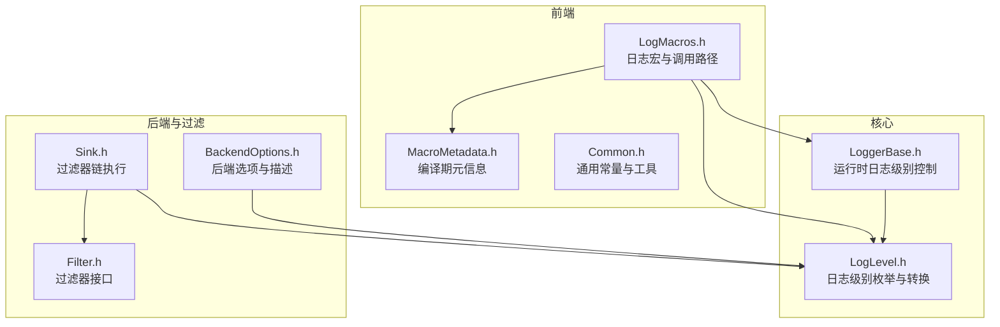
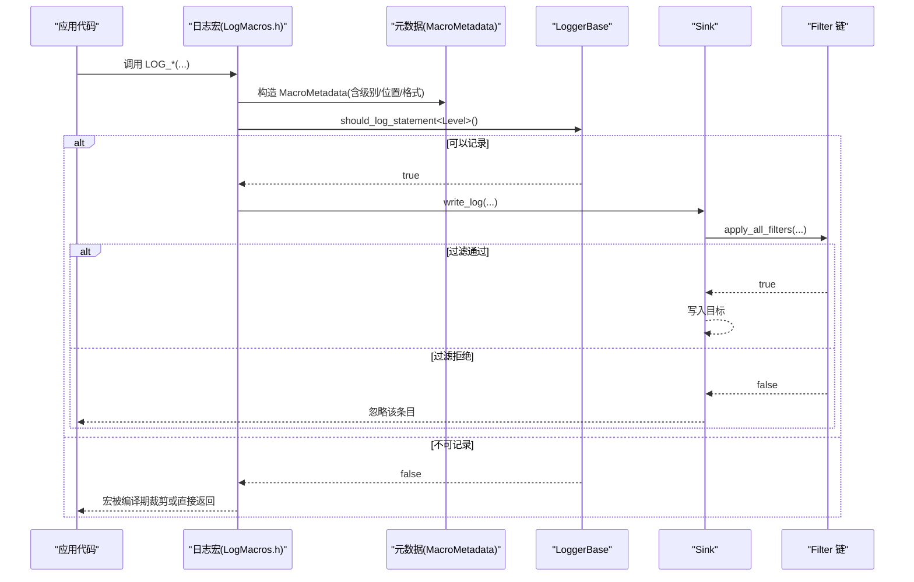
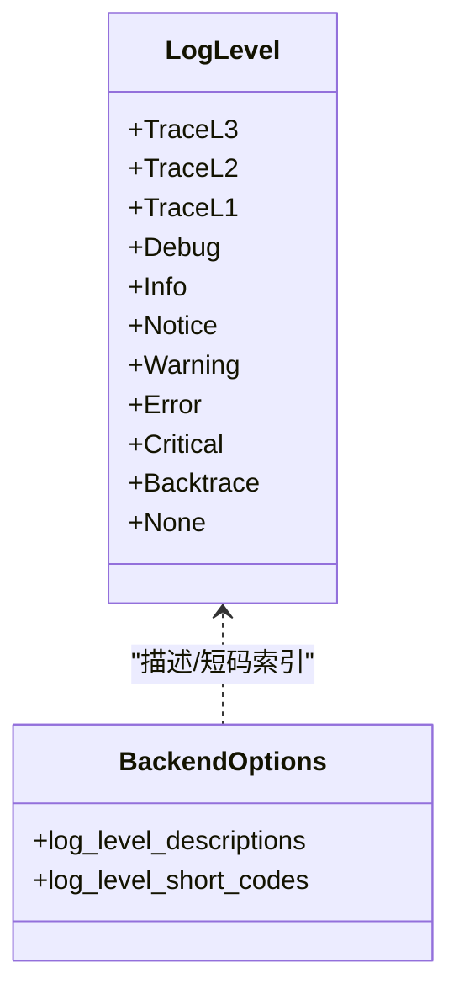
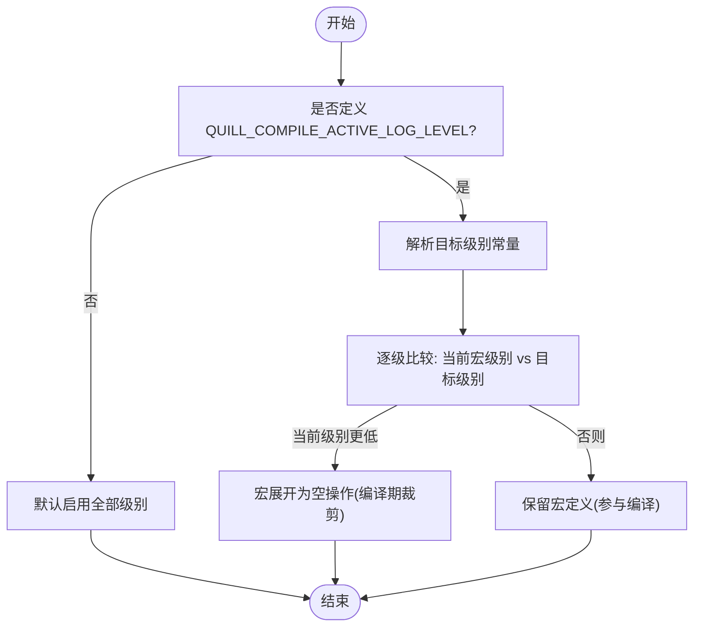
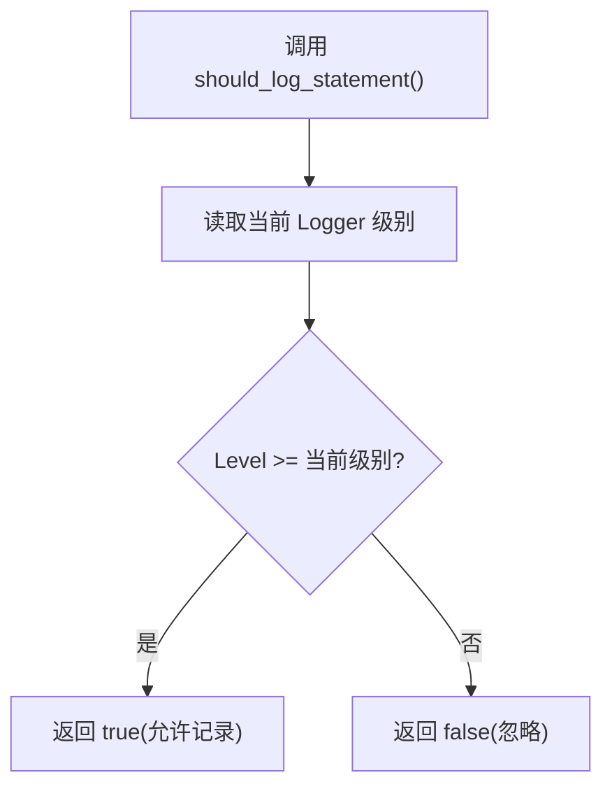
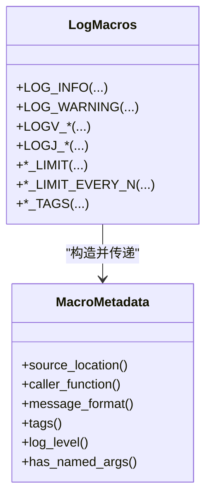
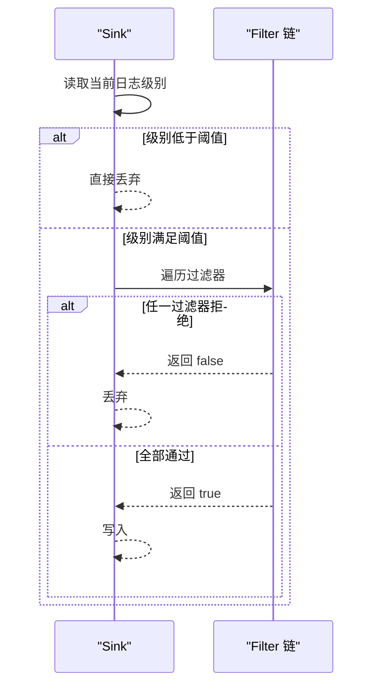
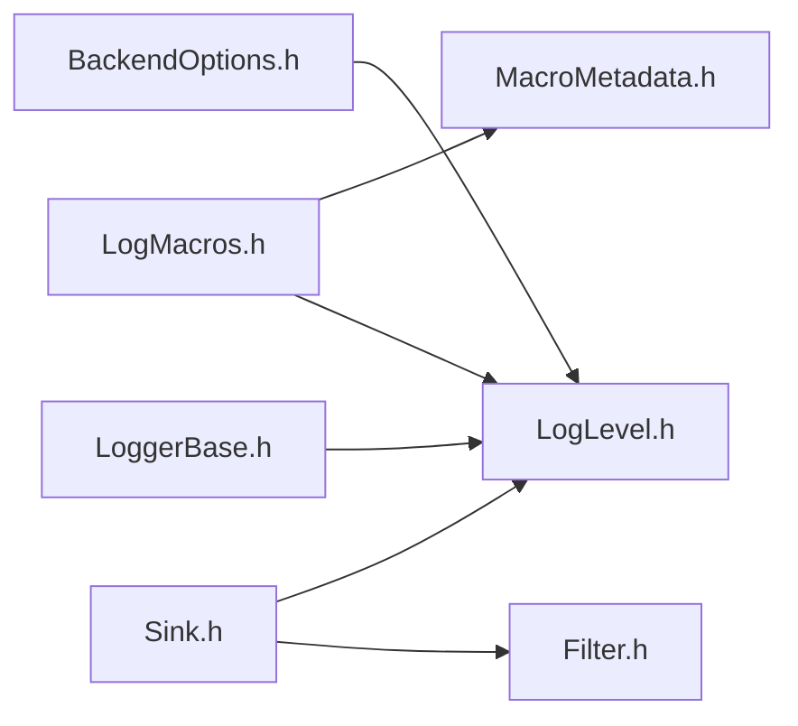

# 日志级别系统

<cite>
**本文引用的文件**
- [LogLevel.h](file://include/quill/core/LogLevel.h)
- [LogMacros.h](file://include/quill/LogMacros.h)
- [LoggerBase.h](file://include/quill/core/LoggerBase.h)
- [MacroMetadata.h](file://include/quill/core/MacroMetadata.h)
- [BackendOptions.h](file://include/quill/backend/BackendOptions.h)
- [Filter.h](file://include/quill/filters/Filter.h)
- [Sink.h](file://include/quill/sinks/Sink.h)
- [Common.h](file://include/quill/core/Common.h)
- [LogLevelTest.cpp](file://test/unit_tests/LogLevelTest.cpp)
- [LoggerTest.cpp](file://test/unit_tests/LoggerTest.cpp)
- [log_levels.rst](file://docs/log_levels.rst)
- [logging_macros.rst](file://docs/logging_macros.rst)
</cite>

## 目录
1. [简介](#简介)
2. [项目结构](#项目结构)
3. [核心组件](#核心组件)
4. [架构总览](#架构总览)
5. [详细组件分析](#详细组件分析)
6. [依赖关系分析](#依赖关系分析)
7. [性能考量](#性能考量)
8. [故障排查指南](#故障排查指南)
9. [结论](#结论)
10. [附录](#附录)

## 简介
本文件系统性阐述 Quill 的日志级别体系，覆盖以下主题：
- LogLevel 枚举的完整定义与语义
- 编译时优化：QUILL_COMPILE_ACTIVE_LOG_LEVEL 的工作原理与性能收益
- 运行时过滤：LoggerBase 的动态日志级别控制
- 宏系统实现：不同日志级别的宏定义、参数传递与模板特化
- 过滤器集成：Sink 层面的过滤器链路与性能权衡
- 实战建议：在不同场景下选择合适日志级别与优化策略

## 项目结构
围绕日志级别系统的关键代码分布在如下模块：
- 核心类型与常量：LogLevel 枚举、字符串映射、后端选项
- 前端宏与调用路径：日志宏、元数据封装、限流与去重
- 后端与过滤：Sink 过滤器接口、过滤器链执行逻辑
- 测试与文档：单元测试验证、官方文档说明

**图表来源**
- [LogMacros.h](file://include/quill/LogMacros.h)
- [MacroMetadata.h](file://include/quill/core/MacroMetadata.h)
- [LogLevel.h](file://include/quill/core/LogLevel.h)
- [LoggerBase.h](file://include/quill/core/LoggerBase.h)
- [BackendOptions.h](file://include/quill/backend/BackendOptions.h)
- [Sink.h](file://include/quill/sinks/Sink.h)
- [Filter.h](file://include/quill/filters/Filter.h)
- [Common.h](file://include/quill/core/Common.h)

**章节来源**
- [LogMacros.h](file://include/quill/LogMacros.h)
- [LogLevel.h](file://include/quill/core/LogLevel.h)
- [LoggerBase.h](file://include/quill/core/LoggerBase.h)
- [BackendOptions.h](file://include/quill/backend/BackendOptions.h)
- [Sink.h](file://include/quill/sinks/Sink.h)
- [Filter.h](file://include/quill/filters/Filter.h)
- [Common.h](file://include/quill/core/Common.h)

## 核心组件
- LogLevel 枚举：定义了完整的日志级别序列，包含 TraceL3 至 Critical，并包含 Backtrace 与 None。支持从字符串解析与短码输出。
- LoggerBase：提供运行时日志级别查询与动态设置；通过模板方法 should_log_statement 在热路径上进行快速判定。
- LogMacros.h：提供编译期过滤常量与大量日志宏，按级别生成调用路径，支持限流、去重、标签等扩展。
- MacroMetadata：记录编译期元信息（源文件、函数名、格式串、标签、事件类型、日志级别），用于前后端传递。
- Sink 与 Filter：在后端写入前执行过滤器链，支持基于日志级别、线程、消息内容等条件的过滤。

**章节来源**
- [LogLevel.h](file://include/quill/core/LogLevel.h)
- [LoggerBase.h](file://include/quill/core/LoggerBase.h)
- [LogMacros.h](file://include/quill/LogMacros.h)
- [MacroMetadata.h](file://include/quill/core/MacroMetadata.h)
- [Sink.h](file://include/quill/sinks/Sink.h)
- [Filter.h](file://include/quill/filters/Filter.h)

## 架构总览
日志级别系统贯穿“前端宏 → 元数据 → 运行时检查 → 后端过滤 → 输出”的主干流程。编译期与运行期双层过滤共同保证性能与灵活性。

**图表来源**
- [LogMacros.h](file://include/quill/LogMacros.h)
- [MacroMetadata.h](file://include/quill/core/MacroMetadata.h)
- [LoggerBase.h](file://include/quill/core/LoggerBase.h)
- [Sink.h](file://include/quill/sinks/Sink.h)
- [Filter.h](file://include/quill/filters/Filter.h)

## 详细组件分析

### LogLevel 枚举与语义
- 完整级别序列：TraceL3 → TraceL2 → TraceL1 → Debug → Info → Notice → Warning → Error → Critical。另含 Backtrace（仅用于回溯）、None。
- 字符串到枚举：支持大小写不敏感的解析，包含 tracel3/tracel2/tracel1 与 trace_l3/trace_l2/trace_l1 两种风格。
- 描述与短码：BackendOptions 提供描述数组与短码数组，便于格式化输出与紧凑标识。

**图表来源**
- [LogLevel.h](file://include/quill/core/LogLevel.h)
- [BackendOptions.h](file://include/quill/backend/BackendOptions.h)

**章节来源**
- [LogLevel.h](file://include/quill/core/LogLevel.h)
- [LogLevelTest.cpp](file://test/unit_tests/LogLevelTest.cpp)
- [BackendOptions.h](file://include/quill/backend/BackendOptions.h)

### 编译时优化：QUILL_COMPILE_ACTIVE_LOG_LEVEL
- 作用：在编译期裁剪掉低于指定级别的日志宏，使这些宏展开为空操作，消除分支与元数据构造开销。
- 默认值：未定义时默认启用全部级别（上限为 TraceL3）。
- 使用方式：通过编译定义（如 -DQUILL_COMPILE_ACTIVE_LOG_LEVEL=QUILL_COMPILE_ACTIVE_LOG_LEVEL_WARNING）限制可编译的日志级别。
- 性能影响：完全移除低级别日志的编译产物，显著减少热路径上的分支与常量项数量，代价是灵活性降低（需重新编译）。

**图表来源**
- [LogMacros.h](file://include/quill/LogMacros.h)
- [log_levels.rst](file://docs/log_levels.rst)

**章节来源**
- [LogMacros.h](file://include/quill/LogMacros.h)
- [log_levels.rst](file://docs/log_levels.rst)

### 运行时过滤：LoggerBase 的动态级别
- 查询与设置：提供 get_log_level 与 set_log_level 接口；内部以原子变量存储当前级别。
- 热路径判定：should_log_statement 模板方法在编译期确定日志级别后，于运行时进行一次比较判断。
- 交互规则：编译期上界与运行期下界共同决定最终是否记录。

**图表来源**
- [LoggerBase.h](file://include/quill/core/LoggerBase.h)

**章节来源**
- [LoggerBase.h](file://include/quill/core/LoggerBase.h)
- [LoggerTest.cpp](file://test/unit_tests/LoggerTest.cpp)

### 日志宏系统：实现原理与模板特化
- 宏族：按级别提供 LOG_*、LOGV_*、LOGJ_*、*_LIMIT、*_LIMIT_EVERY_N、*_TAGS 等变体，覆盖普通、命名参数、带标签、限流与节流等场景。
- 参数传递：宏内部通过 MacroMetadata 记录源位置、函数名、格式串与标签；随后调用 logger->log_statement 并传入可变参数。
- 模板特化：宏在编译期固定日志级别模板实参，避免每次调用的额外分支；同时根据是否启用立即刷新等编译期开关进行分支优化。

**图表来源**
- [LogMacros.h](file://include/quill/LogMacros.h)
- [MacroMetadata.h](file://include/quill/core/MacroMetadata.h)

**章节来源**
- [LogMacros.h](file://include/quill/LogMacros.h)
- [MacroMetadata.h](file://include/quill/core/MacroMetadata.h)

### 日志级别与过滤器系统的集成
- Sink 过滤器链：apply_all_filters 在写入前先做“级别阈值”检查，再遍历全局过滤器集合，只有全部通过才写入。
- 动态更新：当新增同名过滤器时，会触发本地副本重建，确保一致性与线程安全。
- 性能考虑：过滤器链越长，写入成本越高；建议将高频过滤（如级别阈值）前置，复杂过滤（如正则/上下文）放在链后。

**图表来源**
- [Sink.h](file://include/quill/sinks/Sink.h)
- [Filter.h](file://include/quill/filters/Filter.h)

**章节来源**
- [Sink.h](file://include/quill/sinks/Sink.h)
- [Filter.h](file://include/quill/filters/Filter.h)

### 实际使用示例与最佳实践
- 开发调试：使用较低级别（如 TraceL3/Debug）并开启即时刷新，便于定位问题。
- 生产环境：通过编译期裁剪仅保留 Warning 及以上级别，运行时将 Logger 级别设为 Info 或更高，减少 IO 与 CPU 占用。
- 高频热点：对高频日志采用 *_LIMIT 或 *_LIMIT_EVERY_N，避免瞬时风暴；必要时配合 Sink 过滤器进行二次筛选。
- 多目标输出：为不同 Sink 设置不同过滤器链，实现分级落盘或分流。

[本节为概念性指导，无需特定文件引用]

## 依赖关系分析
- LogMacros.h 依赖 LogLevel.h 与 MacroMetadata.h，负责生成调用路径与元数据。
- LoggerBase.h 依赖 LogLevel.h，提供运行时级别判定。
- Sink.h 依赖 Filter.h 与 LogLevel.h，负责过滤器链与级别阈值检查。
- BackendOptions.h 提供日志级别描述与短码，辅助格式化输出。

**图表来源**
- [LogMacros.h](file://include/quill/LogMacros.h)
- [LogLevel.h](file://include/quill/core/LogLevel.h)
- [MacroMetadata.h](file://include/quill/core/MacroMetadata.h)
- [LoggerBase.h](file://include/quill/core/LoggerBase.h)
- [Sink.h](file://include/quill/sinks/Sink.h)
- [Filter.h](file://include/quill/filters/Filter.h)
- [BackendOptions.h](file://include/quill/backend/BackendOptions.h)

**章节来源**
- [LogMacros.h](file://include/quill/LogMacros.h)
- [LogLevel.h](file://include/quill/core/LogLevel.h)
- [LoggerBase.h](file://include/quill/core/LoggerBase.h)
- [Sink.h](file://include/quill/sinks/Sink.h)
- [Filter.h](file://include/quill/filters/Filter.h)
- [BackendOptions.h](file://include/quill/backend/BackendOptions.h)

## 性能考量
- 编译期裁剪优先：在发布构建中启用编译期过滤，彻底移除低级别日志，获得零开销。
- 运行期判定轻量：LoggerBase 的 should_log_statement 为单次比较，开销极小。
- 过滤器链权衡：尽量将昂贵过滤器置于链尾，利用级别阈值尽早短路。
- 限流与去重：在高频场景使用 *_LIMIT 与 *_LIMIT_EVERY_N，降低瞬时负载。
- 即时刷新：仅在调试阶段启用，生产环境关闭以避免显著性能损耗。

[本节为通用指导，无需特定文件引用]

## 故障排查指南
- 日志级别无效：确认是否被编译期裁剪（检查 QUILL_COMPILE_ACTIVE_LOG_LEVEL 宏定义）；若被裁剪，则必须重新编译。
- 运行期级别不生效：检查 LoggerBase::set_log_level 是否被正确调用；注意 Backtrace 仅用于内部回溯，不应手动设置。
- 过滤器未生效：确认过滤器名称唯一且已成功添加；留意 apply_all_filters 的“级别阈值”短路逻辑。
- 字符串解析异常：loglevel_from_string 对未知字符串抛出异常，确保输入符合规范（大小写不敏感，支持下划线与连字符风格）。

**章节来源**
- [LogLevel.h](file://include/quill/core/LogLevel.h)
- [LoggerBase.h](file://include/quill/core/LoggerBase.h)
- [Sink.h](file://include/quill/sinks/Sink.h)
- [LogLevelTest.cpp](file://test/unit_tests/LogLevelTest.cpp)

## 结论
Quill 的日志级别系统通过“编译期裁剪 + 运行期判定 + 后端过滤器链”的组合，在保证灵活性的同时最大化性能。合理配置编译期与运行期参数，并结合限流与过滤策略，可在不同场景下取得最佳的可观测性与吞吐表现。

## 附录
- 官方文档参考：
  - [日志级别文档](file://docs/log_levels.rst)
  - [日志宏文档](file://docs/logging_macros.rst)

[本节为补充材料，无需特定文件引用]