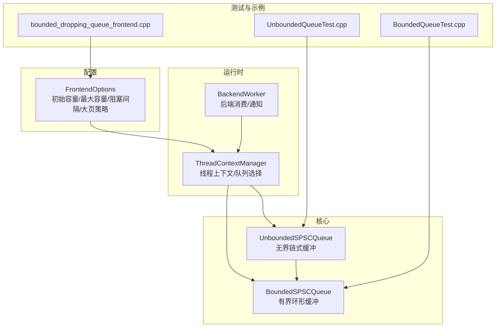
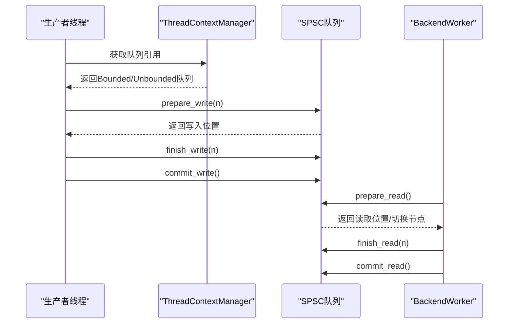
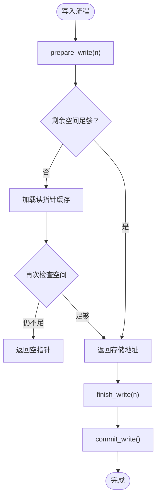
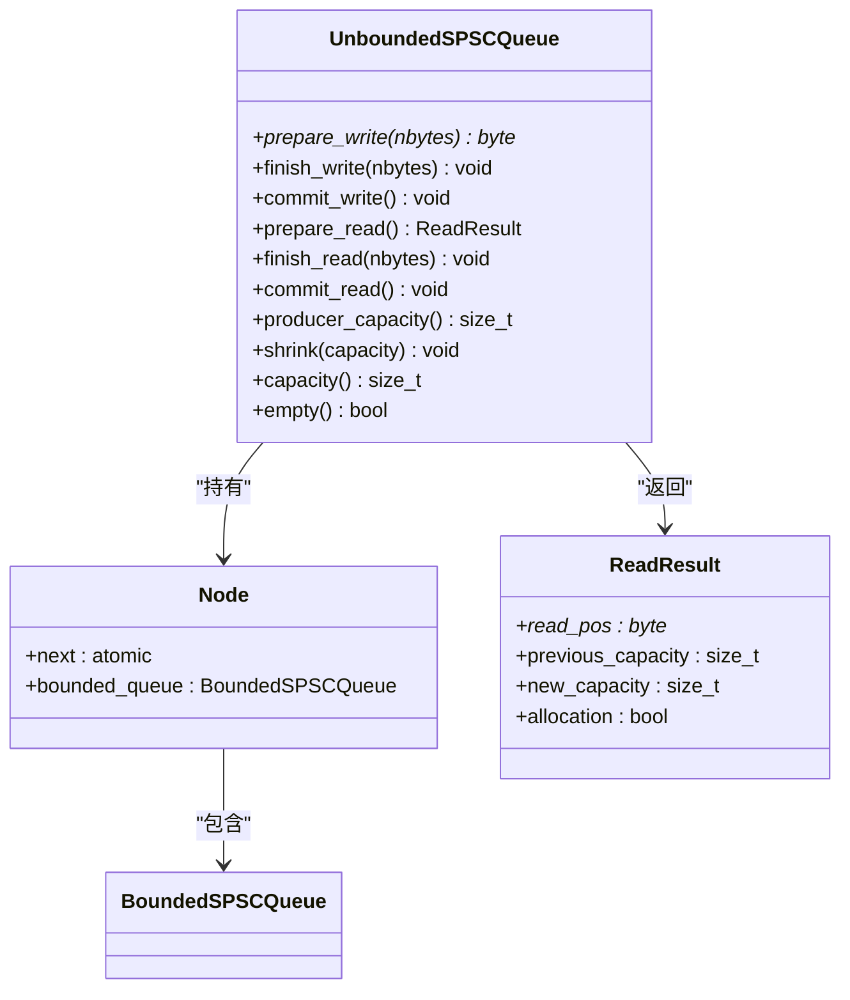
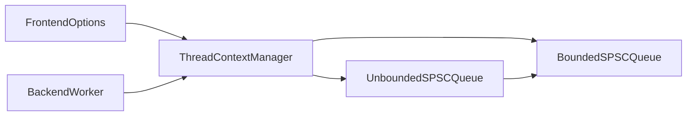

# SPSC队列系统

<cite>
**本文引用的文件**
- [BoundedSPSCQueue.h](file://include/quill/core/BoundedSPSCQueue.h)
- [UnboundedSPSCQueue.h](file://include/quill/core/UnboundedSPSCQueue.h)
- [FrontendOptions.h](file://include/quill/core/FrontendOptions.h)
- [ThreadContextManager.h](file://include/quill/core/ThreadContextManager.h)
- [BackendWorker.h](file://include/quill/backend/BackendWorker.h)
- [BoundedQueueTest.cpp](file://test/unit_tests/BoundedQueueTest.cpp)
- [UnboundedQueueTest.cpp](file://test/unit_tests/UnboundedQueueTest.cpp)
- [frontend_options.rst](file://docs/frontend_options.rst)
- [bounded_dropping_queue_frontend.cpp](file://examples/bounded_dropping_queue_frontend.cpp)
- [hot_path_bench.h](file://benchmarks/hot_path_latency/hot_path_bench.h)
</cite>

## 目录
1. [简介](#简介)
2. [项目结构](#项目结构)
3. [核心组件](#核心组件)
4. [架构总览](#架构总览)
5. [详细组件分析](#详细组件分析)
6. [依赖关系分析](#依赖关系分析)
7. [性能考量](#性能考量)
8. [故障排查指南](#故障排查指南)
9. [结论](#结论)
10. [附录](#附录)

## 简介
本文件面向Quill日志库中的SPSC（单生产者单消费者）队列系统，系统性阐述BoundedSPSCQueue与UnboundedSPSCQueue的设计差异、内存管理策略、原子操作与线程安全机制、容量配置与性能影响，并提供使用示例与最佳实践建议。目标读者既包括需要深入理解内部实现的工程师，也包括希望正确配置与使用SPSC队列的使用者。

## 项目结构
SPSC队列位于核心模块中，分别定义了有界与无界两种实现，并通过前端选项与线程上下文进行集成：
- 核心实现：BoundedSPSCQueue与UnboundedSPSCQueue
- 配置入口：FrontendOptions
- 运行时集成：ThreadContextManager
- 后端消费：BackendWorker
- 测试与示例：单元测试与示例程序

图表来源
- [BoundedSPSCQueue.h:54-95](file://include/quill/core/BoundedSPSCQueue.h#L54-L95)
- [UnboundedSPSCQueue.h:42-85](file://include/quill/core/UnboundedSPSCQueue.h#L42-L85)
- [FrontendOptions.h:16-50](file://include/quill/core/FrontendOptions.h#L16-L50)
- [ThreadContextManager.h:67-80](file://include/quill/core/ThreadContextManager.h#L67-L80)
- [BackendWorker.h:1211-1230](file://include/quill/backend/BackendWorker.h#L1211-L1230)

章节来源
- [BoundedSPSCQueue.h:54-95](file://include/quill/core/BoundedSPSCQueue.h#L54-L95)
- [UnboundedSPSCQueue.h:42-85](file://include/quill/core/UnboundedSPSCQueue.h#L42-L85)
- [FrontendOptions.h:16-50](file://include/quill/core/FrontendOptions.h#L16-L50)
- [ThreadContextManager.h:67-80](file://include/quill/core/ThreadContextManager.h#L67-L80)
- [BackendWorker.h:1211-1230](file://include/quill/backend/BackendWorker.h#L1211-L1230)

## 核心组件
- BoundedSPSCQueue：固定容量的环形缓冲，支持预分配与缓存行优化，适合对内存占用敏感且吞吐稳定的场景。
- UnboundedSPSCQueue：以链表节点形式的无界缓冲，节点内含BoundedSPSCQueue，按需扩容至最大容量，适合高突发或消息尺寸不确定的场景。

章节来源
- [BoundedSPSCQueue.h:54-95](file://include/quill/core/BoundedSPSCQueue.h#L54-L95)
- [UnboundedSPSCQueue.h:42-85](file://include/quill/core/UnboundedSPSCQueue.h#L42-L85)

## 架构总览
SPSC队列在每个前端线程中独立存在，由FrontendOptions决定队列类型与容量参数；ThreadContextManager根据队列类型构造相应队列实例；BackendWorker从各线程队列中消费数据并格式化输出。

图表来源
- [ThreadContextManager.h:67-80](file://include/quill/core/ThreadContextManager.h#L67-L80)
- [UnboundedSPSCQueue.h:115-140](file://include/quill/core/UnboundedSPSCQueue.h#L115-L140)
- [BoundedSPSCQueue.h:105-136](file://include/quill/core/BoundedSPSCQueue.h#L105-L136)
- [BackendWorker.h:1211-1230](file://include/quill/backend/BackendWorker.h#L1211-L1230)

## 详细组件分析

### BoundedSPSCQueue（有界）
- 设计要点
  - 固定容量，容量自动向上取整为2的幂，掩码运算实现环形索引。
  - 写入阶段：prepare_write检查剩余空间，不足则刷新读指针缓存再判断；finish_write累加写指针；commit_write通过原子写标记使读端可见。
  - 读取阶段：prepare_read在empty时刷新写指针缓存；finish_read累加读指针；commit_read按批提交（基于reader_store_percent），减少原子写频率。
  - 缓存行优化：x86架构下使用clflush/clflushopt/prefetch指令优化缓存一致性与预取。
  - 内存对齐与分配：_alloc_aligned支持Windows堆对齐与Linux mmap+元数据记录，支持HugePages策略。
- 原子操作与线程安全
  - 写端：_atomic_writer_pos采用release语义写入，确保后续可见性；_writer_pos非原子自增，仅在写入阶段更新。
  - 读端：_atomic_reader_pos采用release语义写入，_reader_pos非原子自增；_reader_pos_cache与_writer_pos_cache用于减少原子访问。
- 容量与批提交
  - _bytes_per_batch由reader_store_percent计算，控制批量提交频率，平衡延迟与开销。
- 性能特性
  - 固定内存占用，无动态分配；缓存行优化降低TLB与缓存抖动；适合稳定吞吐与低延迟场景。

图表来源
- [BoundedSPSCQueue.h:105-136](file://include/quill/core/BoundedSPSCQueue.h#L105-L136)
- [BoundedSPSCQueue.h:157-169](file://include/quill/core/BoundedSPSCQueue.h#L157-L169)

章节来源
- [BoundedSPSCQueue.h:54-95](file://include/quill/core/BoundedSPSCQueue.h#L54-L95)
- [BoundedSPSCQueue.h:105-136](file://include/quill/core/BoundedSPSCQueue.h#L105-L136)
- [BoundedSPSCQueue.h:157-169](file://include/quill/core/BoundedSPSCQueue.h#L157-L169)
- [BoundedQueueTest.cpp:22-87](file://test/unit_tests/BoundedQueueTest.cpp#L22-L87)

### UnboundedSPSCQueue（无界）
- 设计要点
  - 以链表节点形式组织，每个节点内含BoundedSPSCQueue；当当前节点满时，按需创建新节点并扩容至最大容量。
  - 提供ReadResult携带容量变更信息，便于后端感知队列扩容。
  - 支持shrink收缩到更小容量，用于内存回收与容量调整。
- 生产者路径
  - prepare_write优先尝试当前节点；失败则调用_handle_full_queue：倍增容量直到满足需求，必要时抛出异常；成功后切换到新节点并重试。
- 消费者路径
  - prepare_read先尝试当前节点；若为空且存在next节点，则调用_read_next_queue切换到新节点，释放旧节点并返回新容量信息。
- 原子操作与线程安全
  - 节点指针next采用原子store/release；读端通过原子load(acquire)发现新节点。
- 最大容量限制
  - 当请求容量超过unbounded_queue_max_capacity时，若nbytes也超过上限则抛出异常；否则返回空指针以触发阻塞或丢弃策略。

图表来源
- [UnboundedSPSCQueue.h:42-85](file://include/quill/core/UnboundedSPSCQueue.h#L42-L85)
- [UnboundedSPSCQueue.h:115-140](file://include/quill/core/UnboundedSPSCQueue.h#L115-L140)
- [UnboundedSPSCQueue.h:190-240](file://include/quill/core/UnboundedSPSCQueue.h#L190-L240)
- [UnboundedSPSCQueue.h:244-297](file://include/quill/core/UnboundedSPSCQueue.h#L244-L297)
- [UnboundedSPSCQueue.h:300-329](file://include/quill/core/UnboundedSPSCQueue.h#L300-L329)

章节来源
- [UnboundedSPSCQueue.h:42-85](file://include/quill/core/UnboundedSPSCQueue.h#L42-L85)
- [UnboundedSPSCQueue.h:115-140](file://include/quill/core/UnboundedSPSCQueue.h#L115-L140)
- [UnboundedSPSCQueue.h:190-240](file://include/quill/core/UnboundedSPSCQueue.h#L190-L240)
- [UnboundedSPSCQueue.h:244-297](file://include/quill/core/UnboundedSPSCQueue.h#L244-L297)
- [UnboundedSPSCQueue.h:300-329](file://include/quill/core/UnboundedSPSCQueue.h#L300-L329)
- [UnboundedQueueTest.cpp:13-100](file://test/unit_tests/UnboundedQueueTest.cpp#L13-L100)

### 内存管理与预分配机制
- BoundedSPSCQueue
  - 在构造时一次性分配两倍容量的连续内存块，使用对齐分配器确保缓存行边界对齐；通过mmap/_aligned_malloc等平台API实现；支持HugePages策略。
  - 使用掩码运算实现环形索引，避免模运算开销；初始化时清零以避免脏数据。
- UnboundedSPSCQueue
  - 通过节点链表按需分配新的BoundedSPSCQueue，容量按2的幂增长；最大容量受FrontendOptions::unbounded_queue_max_capacity限制。
  - 切换节点前提交写入，切换后删除旧节点，避免内存泄漏。
- 大页策略
  - Linux下可启用HugePages以减少TLB缺失；失败时可回退到普通页。

章节来源
- [BoundedSPSCQueue.h:60-95](file://include/quill/core/BoundedSPSCQueue.h#L60-L95)
- [BoundedSPSCQueue.h:246-303](file://include/quill/core/BoundedSPSCQueue.h#L246-L303)
- [UnboundedSPSCQueue.h:244-297](file://include/quill/core/UnboundedSPSCQueue.h#L244-L297)

### 原子操作与线程安全
- 写端与读端各自维护非原子的逻辑指针，通过原子变量作为可见性屏障：
  - 写端：_atomic_writer_pos在commit_write时发布写入完成信号；_writer_pos在finish_write时更新。
  - 读端：_atomic_reader_pos在commit_read时发布读取完成信号；_reader_pos在finish_read时更新。
- 缓存行对齐与批提交
  - 通过alignas(QUILL_CACHE_LINE_ALIGNED)确保原子变量跨缓存行，避免伪共享；_bytes_per_batch控制批量提交频率。
- x86缓存行优化
  - clflush/clflushopt/prefetch指令减少缓存一致性开销与预取热点数据。

章节来源
- [BoundedSPSCQueue.h:123-136](file://include/quill/core/BoundedSPSCQueue.h#L123-L136)
- [BoundedSPSCQueue.h:159-169](file://include/quill/core/BoundedSPSCQueue.h#L159-L169)
- [BoundedSPSCQueue.h:199-219](file://include/quill/core/BoundedSPSCQueue.h#L199-L219)

## 依赖关系分析
- FrontendOptions决定队列类型与容量参数，ThreadContextManager据此构造具体队列实例。
- UnboundedSPSCQueue内部组合BoundedSPSCQueue，形成“链表节点 + 环形缓冲”的复合结构。
- BackendWorker通过ThreadContextManager访问队列，消费数据并处理容量变更通知。

图表来源
- [FrontendOptions.h:16-50](file://include/quill/core/FrontendOptions.h#L16-L50)
- [ThreadContextManager.h:67-80](file://include/quill/core/ThreadContextManager.h#L67-L80)
- [UnboundedSPSCQueue.h:55-62](file://include/quill/core/UnboundedSPSCQueue.h#L55-L62)
- [BackendWorker.h:1211-1230](file://include/quill/backend/BackendWorker.h#L1211-L1230)

章节来源
- [FrontendOptions.h:16-50](file://include/quill/core/FrontendOptions.h#L16-L50)
- [ThreadContextManager.h:67-80](file://include/quill/core/ThreadContextManager.h#L67-L80)
- [UnboundedSPSCQueue.h:55-62](file://include/quill/core/UnboundedSPSCQueue.h#L55-L62)
- [BackendWorker.h:1211-1230](file://include/quill/backend/BackendWorker.h#L1211-L1230)

## 性能考量
- 容量配置
  - 初始容量：FrontendOptions::initial_queue_capacity默认128KiB，适合大多数场景；高并发或大消息场景可适当增大。
  - 最大容量：FrontendOptions::unbounded_queue_max_capacity默认2GiB，无界队列在突发时会按2的幂增长，直至达到上限。
  - 有界队列：固定容量，内存占用稳定；无界队列：按需增长，内存占用随负载波动。
- 批提交与缓存行优化
  - reader_store_percent控制批提交比例，提升吞吐同时降低原子写频率；x86架构下的缓存行优化减少TLB缺失。
- 阻塞与丢弃策略
  - BoundedBlocking：满时阻塞；BoundedDropping：满时丢弃；UnboundedBlocking：满时阻塞；UnboundedDropping：满时丢弃。
- 性能测试参考
  - 基准测试框架使用RDTSC计时与多线程并发，可用于评估不同队列配置下的延迟分布。

章节来源
- [FrontendOptions.h:16-50](file://include/quill/core/FrontendOptions.h#L16-L50)
- [frontend_options.rst:10-17](file://docs/frontend_options.rst#L10-L17)
- [hot_path_bench.h:91-124](file://benchmarks/hot_path_latency/hot_path_bench.h#L91-L124)

## 故障排查指南
- 队列容量过小导致丢弃或阻塞
  - 检查FrontendOptions::initial_queue_capacity是否过小；对于高突发场景考虑增大或切换为无界队列。
- 无界队列达到上限
  - 当请求容量超过unbounded_queue_max_capacity且nbytes也超过上限时会抛出异常；可通过增大FrontendOptions::unbounded_queue_max_capacity解决。
- 多线程竞争与可见性问题
  - 确保严格遵循单生产者单消费者模型；避免在多个线程上同时调用prepare_write/prepare_read。
- 缓存行与TLB问题
  - 在x86平台上启用HugePages可减少TLB缺失；确认硬件与内核支持。

章节来源
- [UnboundedSPSCQueue.h:253-275](file://include/quill/core/UnboundedSPSCQueue.h#L253-L275)
- [BoundedSPSCQueue.h:75-94](file://include/quill/core/BoundedSPSCQueue.h#L75-L94)
- [frontend_options.rst:10-17](file://docs/frontend_options.rst#L10-L17)

## 结论
- BoundedSPSCQueue适合内存预算固定、吞吐稳定的场景；UnboundedSPSCQueue适合高突发或消息尺寸不确定的场景。
- 通过合理的容量配置、批提交与缓存行优化，可在低延迟与高吞吐之间取得良好平衡。
- 建议在生产环境中结合FrontendOptions与实际负载进行压测，选择最适合的队列类型与容量参数。

## 附录

### 使用示例与最佳实践
- 有界丢弃队列示例
  - 参考示例程序，设置QueueType为BoundedDropping并配置较小的initial_queue_capacity，演示在高负载下丢弃日志的行为。
- 配置建议
  - 默认使用UnboundedBlocking；若内存受限或需要确定性内存占用，可切换为BoundedBlocking或BoundedDropping。
  - 对于高并发或大消息场景，适当增大initial_queue_capacity与unbounded_queue_max_capacity。
  - 在x86平台上可启用HugePages以降低TLB缺失。

章节来源
- [bounded_dropping_queue_frontend.cpp:21-32](file://examples/bounded_dropping_queue_frontend.cpp#L21-L32)
- [frontend_options.rst:10-17](file://docs/frontend_options.rst#L10-L17)

### 单元测试与行为验证
- 有界队列测试
  - 验证读写循环、整数溢出场景与多线程读写一致性。
- 无界队列测试
  - 验证扩容、收缩、容量变更通知与多线程读写一致性。

章节来源
- [BoundedQueueTest.cpp:22-87](file://test/unit_tests/BoundedQueueTest.cpp#L22-L87)
- [UnboundedQueueTest.cpp:13-100](file://test/unit_tests/UnboundedQueueTest.cpp#L13-L100)