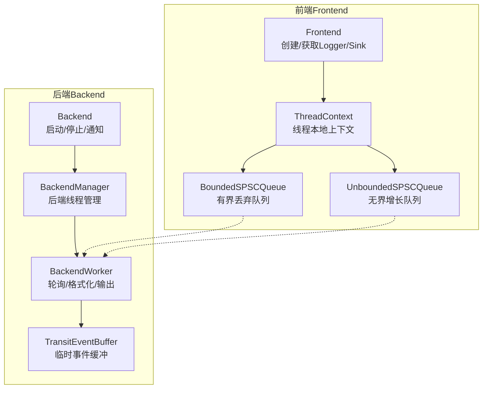
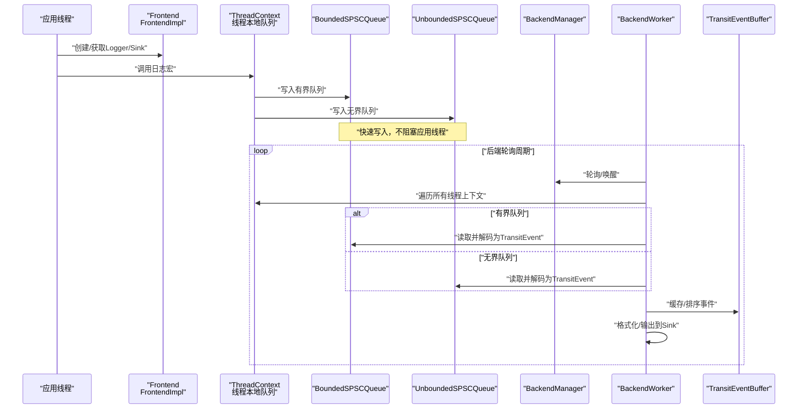
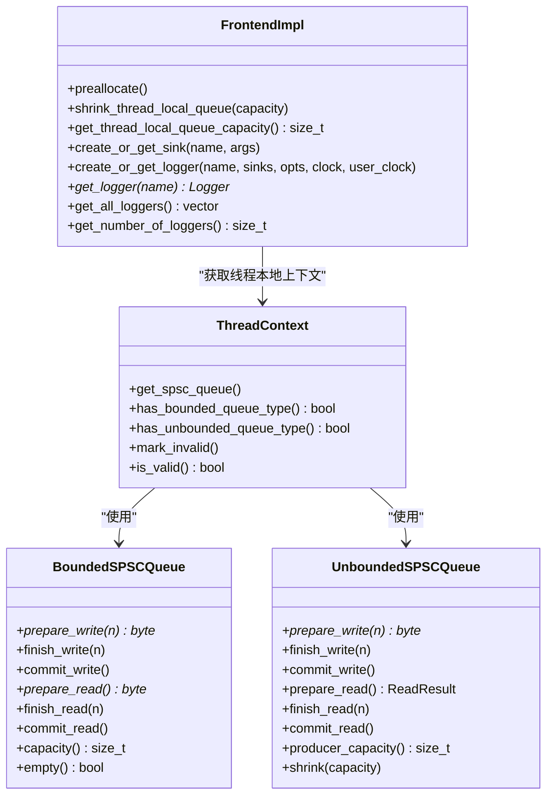
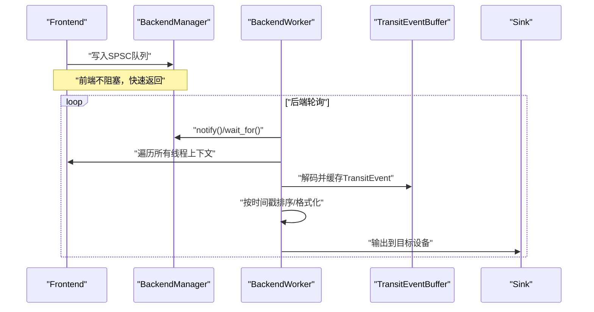
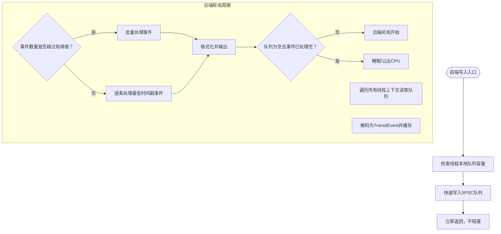
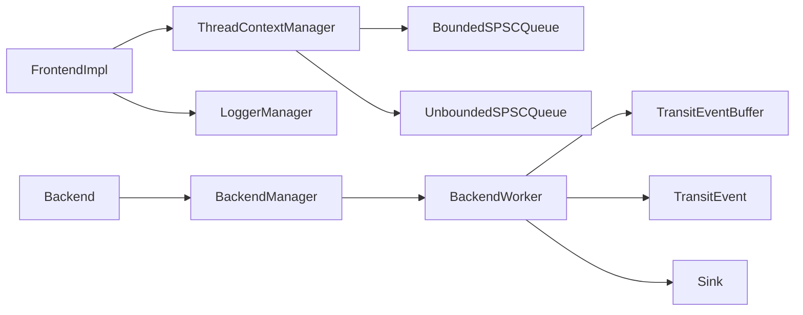

# 前后端分离架构

<cite>
**本文档引用的文件**
- [Frontend.h](file://include/quill/Frontend.h)
- [Backend.h](file://include/quill/Backend.h)
- [BackendManager.h](file://include/quill/backend/BackendManager.h)
- [BackendWorker.h](file://include/quill/backend/BackendWorker.h)
- [BoundedSPSCQueue.h](file://include/quill/core/BoundedSPSCQueue.h)
- [UnboundedSPSCQueue.h](file://include/quill/core/UnboundedSPSCQueue.h)
- [TransitEvent.h](file://include/quill/backend/TransitEvent.h)
- [TransitEventBuffer.h](file://include/quill/backend/TransitEventBuffer.h)
- [ThreadContextManager.h](file://include/quill/core/ThreadContextManager.h)
- [LoggerManager.h](file://include/quill/core/LoggerManager.h)
- [console_logging.cpp](file://examples/console_logging.cpp)
- [custom_frontend_options.cpp](file://examples/custom_frontend_options.cpp)
</cite>

## 目录
1. [引言](#引言)
2. [项目结构](#项目结构)
3. [核心组件](#核心组件)
4. [架构总览](#架构总览)
5. [详细组件分析](#详细组件分析)
6. [依赖关系分析](#依赖关系分析)
7. [性能考量](#性能考量)
8. [故障排查指南](#故障排查指南)
9. [结论](#结论)
10. [附录](#附录)

## 引言
本文件面向希望深入理解 Quill 前后端分离架构的读者，系统阐述前端与后端的职责划分、零停顿日志记录的设计原理、前端与后端之间的通信机制，以及该设计如何实现超低延迟性能。文中通过架构图与流程图直观展示数据流，结合源码路径定位关键实现细节，并提供可操作的初始化与交互示例，帮助开发者在实际工程中正确使用与扩展。

## 项目结构
Quill 的核心由“前端（Frontend）”和“后端（Backend）”两部分组成：
- 前端负责快速接收日志消息并写入线程本地的单生产者单消费者（SPSC）队列，尽量避免阻塞。
- 后端运行于独立线程，周期性轮询前端队列，批量读取并格式化消息，最终输出到指定 sink。

**图表来源**
- [Frontend.h](file://include/quill/Frontend.h)
- [Backend.h](file://include/quill/Backend.h)
- [BackendManager.h](file://include/quill/backend/BackendManager.h)
- [BackendWorker.h](file://include/quill/backend/BackendWorker.h)
- [BoundedSPSCQueue.h](file://include/quill/core/BoundedSPSCQueue.h)
- [UnboundedSPSCQueue.h](file://include/quill/core/UnboundedSPSCQueue.h)
- [TransitEventBuffer.h](file://include/quill/backend/TransitEventBuffer.h)

**章节来源**
- [Frontend.h:1-373](file://include/quill/Frontend.h#L1-L373)
- [Backend.h:1-246](file://include/quill/Backend.h#L1-L246)
- [BackendManager.h:1-136](file://include/quill/backend/BackendManager.h#L1-L136)
- [BackendWorker.h:1-800](file://include/quill/backend/BackendWorker.h#L1-L800)
- [BoundedSPSCQueue.h:1-356](file://include/quill/core/BoundedSPSCQueue.h#L1-L356)
- [UnboundedSPSCQueue.h:1-345](file://include/quill/core/UnboundedSPSCQueue.h#L1-L345)
- [TransitEventBuffer.h:1-162](file://include/quill/backend/TransitEventBuffer.h#L1-L162)

## 核心组件
- 前端（Frontend）
  - 负责创建/获取 Sink 与 Logger，管理线程本地队列容量与预分配，提供日志接口。
  - 关键能力：线程本地队列容量查询、收缩、预分配；Logger/Sink 创建与获取；全局 Logger 管理。
- 后端（Backend）
  - 提供启动/停止后端线程、主动唤醒后端、检查运行状态等接口。
  - 关键能力：后端线程生命周期管理、通知机制、RDTSC 到纪元时间转换。
- 后端管理器（BackendManager）
  - 单例管理后端线程的启动/停止、通知、运行状态与 atexit 注册。
- 后端工作线程（BackendWorker）
  - 后端线程主体，负责轮询前端队列、缓存为 TransitEvent、按时间顺序处理、格式化与输出。
  - 关键能力：轮询循环、事件缓存与排序、批量处理、睡眠与唤醒、RDTSC 同步。
- 队列（SPSC）
  - 有界丢弃队列（BoundedSPSCQueue）：固定容量，满时丢弃新消息，保证无锁快速写入。
  - 无界增长队列（UnboundedSPSCQueue）：动态扩容，支持收缩，适合突发流量场景。
- 中转事件（TransitEvent/Buffer）
  - 将前端队列中的原始字节解码为结构化事件，便于后端统一格式化与输出。
- 线程上下文（ThreadContextManager）
  - 维护每个线程的本地上下文与队列，支持无效上下文清理与新增上下文标记。
- 日志器管理（LoggerManager）
  - 维护全局 Logger 集合，支持查找、移除与失效清理，保障后端遍历安全。

**章节来源**
- [Frontend.h:32-373](file://include/quill/Frontend.h#L32-L373)
- [Backend.h:29-246](file://include/quill/Backend.h#L29-L246)
- [BackendManager.h:38-136](file://include/quill/backend/BackendManager.h#L38-L136)
- [BackendWorker.h:77-800](file://include/quill/backend/BackendWorker.h#L77-L800)
- [BoundedSPSCQueue.h:54-356](file://include/quill/core/BoundedSPSCQueue.h#L54-L356)
- [UnboundedSPSCQueue.h:42-345](file://include/quill/core/UnboundedSPSCQueue.h#L42-L345)
- [TransitEvent.h:32-222](file://include/quill/backend/TransitEvent.h#L32-L222)
- [TransitEventBuffer.h:19-162](file://include/quill/backend/TransitEventBuffer.h#L19-L162)
- [ThreadContextManager.h:53-430](file://include/quill/core/ThreadContextManager.h#L53-L430)
- [LoggerManager.h:33-311](file://include/quill/core/LoggerManager.h#L33-L311)

## 架构总览
下图展示了从前端写入到后端消费的完整数据流，体现“零停顿”的关键点：前端仅做“快速写入”，后端负责“格式化与输出”。

**图表来源**
- [Frontend.h:148-301](file://include/quill/Frontend.h#L148-L301)
- [ThreadContextManager.h:53-214](file://include/quill/core/ThreadContextManager.h#L53-L214)
- [BoundedSPSCQueue.h:105-169](file://include/quill/core/BoundedSPSCQueue.h#L105-L169)
- [UnboundedSPSCQueue.h:115-240](file://include/quill/core/UnboundedSPSCQueue.h#L115-L240)
- [BackendManager.h:61-96](file://include/quill/backend/BackendManager.h#L61-L96)
- [BackendWorker.h:305-395](file://include/quill/backend/BackendWorker.h#L305-L395)
- [TransitEventBuffer.h:22-108](file://include/quill/backend/TransitEventBuffer.h#L22-L108)

## 详细组件分析

### 前端：快速写入与线程本地队列
- 职责
  - 创建/获取 Sink 与 Logger，配置格式化选项与时钟源。
  - 在线程本地维护 SPSC 队列，写入日志消息，尽量避免阻塞。
- 关键实现要点
  - 预分配与容量查询：减少首次分配开销，监控队列增长。
  - 支持有界丢弃队列与无界增长队列：前者稳定低延迟，后者应对突发。
  - 线程本地上下文注册与失效：确保后端能正确清理无效上下文。
- 代码路径参考
  - [Frontend.h:45-111](file://include/quill/Frontend.h#L45-L111)
  - [ThreadContextManager.h:416-422](file://include/quill/core/ThreadContextManager.h#L416-L422)
  - [BoundedSPSCQueue.h:105-169](file://include/quill/core/BoundedSPSCQueue.h#L105-L169)
  - [UnboundedSPSCQueue.h:115-240](file://include/quill/core/UnboundedSPSCQueue.h#L115-L240)

**图表来源**
- [Frontend.h:32-373](file://include/quill/Frontend.h#L32-L373)
- [ThreadContextManager.h:53-214](file://include/quill/core/ThreadContextManager.h#L53-L214)
- [BoundedSPSCQueue.h:105-169](file://include/quill/core/BoundedSPSCQueue.h#L105-L169)
- [UnboundedSPSCQueue.h:115-240](file://include/quill/core/UnboundedSPSCQueue.h#L115-L240)

**章节来源**
- [Frontend.h:32-373](file://include/quill/Frontend.h#L32-L373)
- [ThreadContextManager.h:53-214](file://include/quill/core/ThreadContextManager.h#L53-L214)
- [BoundedSPSCQueue.h:105-169](file://include/quill/core/BoundedSPSCQueue.h#L105-L169)
- [UnboundedSPSCQueue.h:115-240](file://include/quill/core/UnboundedSPSCQueue.h#L115-L240)

### 后端：格式化与输出
- 职责
  - 启动/停止后端线程，提供唤醒接口；在独立线程中批量处理日志。
- 关键实现要点
  - 轮询循环：根据软/硬阈值决定逐条或批量处理；空闲时睡眠或让出 CPU。
  - 事件缓存：将前端队列中的原始字节解码为 TransitEvent，支持命名参数与运行时元数据。
  - 时间戳同步：当使用 TSC 时，将 RDTSC 转换为纳秒纪元时间，保证跨 Logger 时间一致性。
  - 通知机制：通过互斥量与条件变量唤醒后端线程。
- 代码路径参考
  - [Backend.h:36-162](file://include/quill/Backend.h#L36-L162)
  - [BackendManager.h:61-108](file://include/quill/backend/BackendManager.h#L61-L108)
  - [BackendWorker.h:305-395](file://include/quill/backend/BackendWorker.h#L305-L395)
  - [TransitEvent.h:32-222](file://include/quill/backend/TransitEvent.h#L32-L222)
  - [TransitEventBuffer.h:22-108](file://include/quill/backend/TransitEventBuffer.h#L22-L108)

**图表来源**
- [Backend.h:139-162](file://include/quill/Backend.h#L139-L162)
- [BackendManager.h:61-108](file://include/quill/backend/BackendManager.h#L61-L108)
- [BackendWorker.h:305-395](file://include/quill/backend/BackendWorker.h#L305-L395)
- [TransitEvent.h:32-222](file://include/quill/backend/TransitEvent.h#L32-L222)
- [TransitEventBuffer.h:22-108](file://include/quill/backend/TransitEventBuffer.h#L22-L108)

**章节来源**
- [Backend.h:36-162](file://include/quill/Backend.h#L36-L162)
- [BackendManager.h:61-108](file://include/quill/backend/BackendManager.h#L61-L108)
- [BackendWorker.h:305-395](file://include/quill/backend/BackendWorker.h#L305-L395)
- [TransitEvent.h:32-222](file://include/quill/backend/TransitEvent.h#L32-L222)
- [TransitEventBuffer.h:22-108](file://include/quill/backend/TransitEventBuffer.h#L22-L108)

### 零停顿日志记录与通信机制
- 零停顿原理
  - 前端只做“写入”，不执行格式化与 IO，避免阻塞应用线程。
  - 后端负责格式化与输出，采用批量处理与睡眠/唤醒策略降低 CPU 占用。
- 通信机制
  - 前端通过线程本地 SPSC 队列向后端传递消息。
  - 后端通过条件变量与互斥量实现“睡眠等待 + 主动唤醒”。
  - 可通过后端通知接口在长睡眠期间唤醒后端处理突发消息。
- 代码路径参考
  - [Backend.h:146-153](file://include/quill/Backend.h#L146-L153)
  - [BackendWorker.h:238-256](file://include/quill/backend/BackendWorker.h#L238-L256)
  - [BackendWorker.h:370-387](file://include/quill/backend/BackendWorker.h#L370-L387)

**图表来源**
- [BackendWorker.h:305-395](file://include/quill/backend/BackendWorker.h#L305-L395)
- [BackendWorker.h:238-256](file://include/quill/backend/BackendWorker.h#L238-L256)
- [BackendWorker.h:370-387](file://include/quill/backend/BackendWorker.h#L370-L387)

**章节来源**
- [Backend.h:146-153](file://include/quill/Backend.h#L146-L153)
- [BackendWorker.h:305-395](file://include/quill/backend/BackendWorker.h#L305-L395)
- [BackendWorker.h:238-256](file://include/quill/backend/BackendWorker.h#L238-L256)
- [BackendWorker.h:370-387](file://include/quill/backend/BackendWorker.h#L370-L387)

### 初始化与交互示例
- 基础控制台日志示例
  - 启动后端 → 创建控制台 Sink → 创建 Logger → 设置日志级别 → 写入日志。
  - 参考路径：[console_logging.cpp:22-41](file://examples/console_logging.cpp#L22-L41)
- 自定义前端选项示例
  - 定义自定义 FrontendOptions → 使用 CustomFrontend/CustomLogger → 启动后端并写入日志。
  - 参考路径：[custom_frontend_options.cpp:14-42](file://examples/custom_frontend_options.cpp#L14-L42)

**章节来源**
- [console_logging.cpp:22-41](file://examples/console_logging.cpp#L22-L41)
- [custom_frontend_options.cpp:14-42](file://examples/custom_frontend_options.cpp#L14-L42)

## 依赖关系分析
- 前端依赖
  - ThreadContextManager：注册/管理线程本地上下文。
  - BoundedSPSCQueue/UnboundedSPSCQueue：快速写入。
  - LoggerManager：全局 Logger 管理。
- 后端依赖
  - BackendManager：后端线程生命周期与通知。
  - BackendWorker：轮询、解码、格式化、输出。
  - TransitEvent/TransitEventBuffer：事件缓存与排序。
- 通信链路
  - 前端写入 → 后端读取 → 后端格式化 → Sink 输出。

**图表来源**
- [Frontend.h:148-301](file://include/quill/Frontend.h#L148-L301)
- [ThreadContextManager.h:53-214](file://include/quill/core/ThreadContextManager.h#L53-L214)
- [BoundedSPSCQueue.h:105-169](file://include/quill/core/BoundedSPSCQueue.h#L105-L169)
- [UnboundedSPSCQueue.h:115-240](file://include/quill/core/UnboundedSPSCQueue.h#L115-L240)
- [LoggerManager.h:152-185](file://include/quill/core/LoggerManager.h#L152-L185)
- [Backend.h:36-162](file://include/quill/Backend.h#L36-L162)
- [BackendManager.h:61-108](file://include/quill/backend/BackendManager.h#L61-L108)
- [BackendWorker.h:305-395](file://include/quill/backend/BackendWorker.h#L305-L395)
- [TransitEvent.h:32-222](file://include/quill/backend/TransitEvent.h#L32-L222)
- [TransitEventBuffer.h:22-108](file://include/quill/backend/TransitEventBuffer.h#L22-L108)

**章节来源**
- [Frontend.h:148-301](file://include/quill/Frontend.h#L148-L301)
- [ThreadContextManager.h:53-214](file://include/quill/core/ThreadContextManager.h#L53-L214)
- [BoundedSPSCQueue.h:105-169](file://include/quill/core/BoundedSPSCQueue.h#L105-L169)
- [UnboundedSPSCQueue.h:115-240](file://include/quill/core/UnboundedSPSCQueue.h#L115-L240)
- [LoggerManager.h:152-185](file://include/quill/core/LoggerManager.h#L152-L185)
- [Backend.h:36-162](file://include/quill/Backend.h#L36-L162)
- [BackendManager.h:61-108](file://include/quill/backend/BackendManager.h#L61-L108)
- [BackendWorker.h:305-395](file://include/quill/backend/BackendWorker.h#L305-L395)
- [TransitEvent.h:32-222](file://include/quill/backend/TransitEvent.h#L32-L222)
- [TransitEventBuffer.h:22-108](file://include/quill/backend/TransitEventBuffer.h#L22-L108)

## 性能考量
- 队列选择
  - 有界丢弃队列：吞吐高、延迟极低，适合对丢弃容忍度高的场景。
  - 无界增长队列：自动扩容，适合突发流量，需配合收缩策略避免内存膨胀。
- 后端轮询策略
  - 软/硬阈值：根据事件数量动态选择逐条或批量处理，兼顾延迟与吞吐。
  - 睡眠/让出：空闲时睡眠或 yield，降低 CPU 占用。
- 时间戳同步
  - TSC 到纪元时间转换：保证多 Logger 时间一致性，避免跨线程排序问题。
- 缓存与内存
  - 线程本地队列与 TransitEventBuffer 减少跨线程共享，提升局部性。
- 代码路径参考
  - [BoundedSPSCQueue.h:105-169](file://include/quill/core/BoundedSPSCQueue.h#L105-L169)
  - [UnboundedSPSCQueue.h:166-183](file://include/quill/core/UnboundedSPSCQueue.h#L166-L183)
  - [BackendWorker.h:305-395](file://include/quill/backend/BackendWorker.h#L305-L395)
  - [BackendWorker.h:112-123](file://include/quill/backend/BackendWorker.h#L112-L123)

**章节来源**
- [BoundedSPSCQueue.h:105-169](file://include/quill/core/BoundedSPSCQueue.h#L105-L169)
- [UnboundedSPSCQueue.h:166-183](file://include/quill/core/UnboundedSPSCQueue.h#L166-L183)
- [BackendWorker.h:305-395](file://include/quill/backend/BackendWorker.h#L305-L395)
- [BackendWorker.h:112-123](file://include/quill/backend/BackendWorker.h#L112-L123)

## 故障排查指南
- 后端未启动
  - 确认已调用后端启动接口；检查 atexit 注册与线程 ID 获取。
  - 参考路径：[Backend.h:36-57](file://include/quill/Backend.h#L36-L57)
- 日志丢失
  - 检查前端队列类型：有界队列可能丢弃；无界队列需确认是否触发最大容量限制。
  - 参考路径：[BoundedSPSCQueue.h:105-169](file://include/quill/core/BoundedSPSCQueue.h#L105-L169)
  - 参考路径：[UnboundedSPSCQueue.h:244-297](file://include/quill/core/UnboundedSPSCQueue.h#L244-L297)
- 事件乱序
  - 检查严格时间戳顺序配置与 grace period；确保 TSC 同步正常。
  - 参考路径：[BackendWorker.h:479-506](file://include/quill/backend/BackendWorker.h#L479-L506)
  - 参考路径：[BackendWorker.h:613-629](file://include/quill/backend/BackendWorker.h#L613-L629)
- 后端线程无法退出
  - 确认队列与事件是否清空；必要时设置等待队列清空选项。
  - 参考路径：[BackendWorker.h:443-474](file://include/quill/backend/BackendWorker.h#L443-L474)
- 通知无效
  - 检查唤醒标志位与条件变量使用；确认在长睡眠模式下正确唤醒。
  - 参考路径：[BackendWorker.h:238-256](file://include/quill/backend/BackendWorker.h#L238-L256)
  - 参考路径：[BackendWorker.h:370-387](file://include/quill/backend/BackendWorker.h#L370-L387)

**章节来源**
- [Backend.h:36-57](file://include/quill/Backend.h#L36-L57)
- [BoundedSPSCQueue.h:105-169](file://include/quill/core/BoundedSPSCQueue.h#L105-L169)
- [UnboundedSPSCQueue.h:244-297](file://include/quill/core/UnboundedSPSCQueue.h#L244-L297)
- [BackendWorker.h:479-506](file://include/quill/backend/BackendWorker.h#L479-L506)
- [BackendWorker.h:613-629](file://include/quill/backend/BackendWorker.h#L613-L629)
- [BackendWorker.h:443-474](file://include/quill/backend/BackendWorker.h#L443-L474)
- [BackendWorker.h:238-256](file://include/quill/backend/BackendWorker.h#L238-L256)
- [BackendWorker.h:370-387](file://include/quill/backend/BackendWorker.h#L370-L387)

## 结论
Quill 的前后端分离架构通过“前端快速写入 + 后端批量格式化”的设计，实现了零停顿日志记录与超低延迟性能。前端仅承担最轻量级的任务，后端集中处理格式化与输出，并通过睡眠/唤醒、软/硬阈值等策略平衡吞吐与延迟。该架构在高并发与突发流量场景下表现优异，同时提供了灵活的队列类型与自定义选项以适配不同需求。

## 附录
- 示例程序
  - 控制台日志示例：[console_logging.cpp:22-41](file://examples/console_logging.cpp#L22-L41)
  - 自定义前端选项示例：[custom_frontend_options.cpp:14-42](file://examples/custom_frontend_options.cpp#L14-L42)