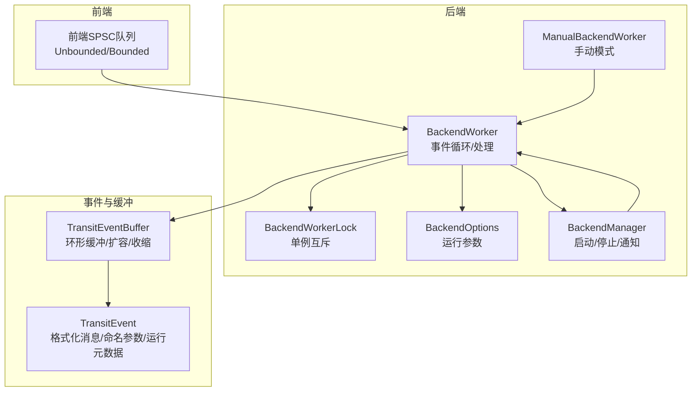
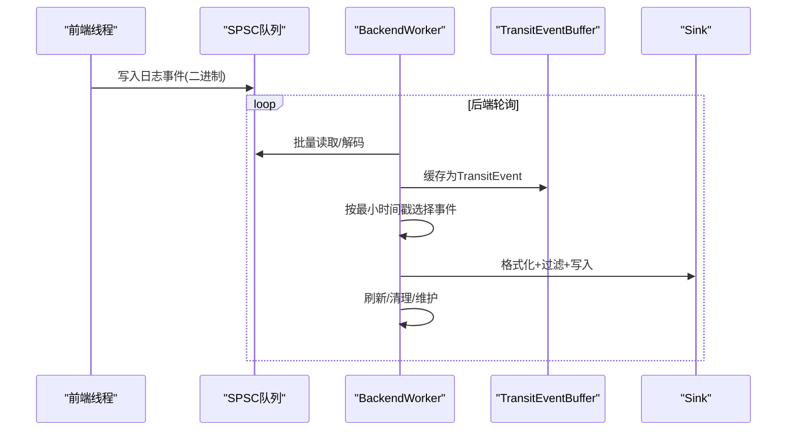
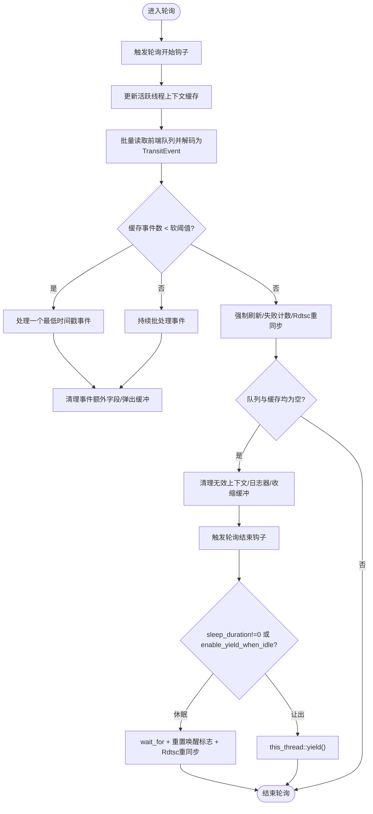
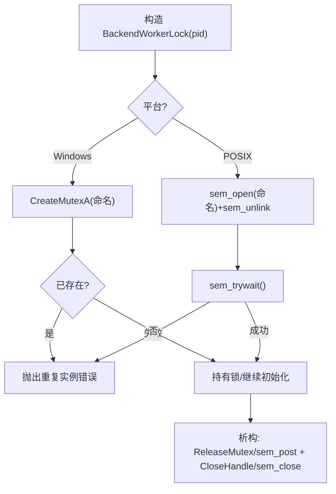
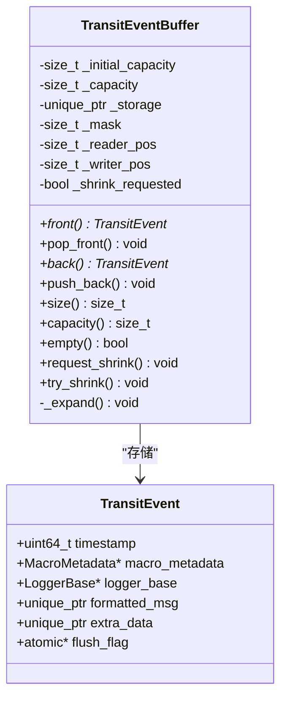
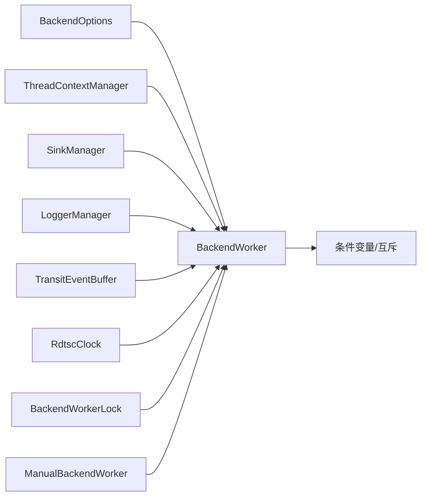

# 后端工作线程

<cite>
**本文引用的文件**
- [BackendWorker.h](file://include/quill/backend/BackendWorker.h)
- [BackendWorkerLock.h](file://include/quill/backend/BackendWorkerLock.h)
- [TransitEventBuffer.h](file://include/quill/backend/TransitEventBuffer.h)
- [TransitEvent.h](file://include/quill/backend/TransitEvent.h)
- [BackendOptions.h](file://include/quill/backend/BackendOptions.h)
- [BackendManager.h](file://include/quill/backend/BackendManager.h)
- [ManualBackendWorker.h](file://include/quill/backend/ManualBackendWorker.h)
- [TransitEventBufferTest.cpp](file://test/unit_tests/TransitEventBufferTest.cpp)
</cite>

## 目录
1. [简介](#简介)
2. [项目结构](#项目结构)
3. [核心组件](#核心组件)
4. [架构总览](#架构总览)
5. [详细组件分析](#详细组件分析)
6. [依赖关系分析](#依赖关系分析)
7. [性能考量](#性能考量)
8. [故障排查指南](#故障排查指南)
9. [结论](#结论)
10. [附录](#附录)

## 简介
本文件系统性地解析Quill后端工作线程（BackendWorker）的设计与实现，覆盖以下主题：
- BackendWorker的职责与事件循环机制
- 事件缓冲区（TransitEventBuffer）的组织、容量扩展与内存管理
- 线程同步策略与唤醒机制
- BackendWorkerLock的使用场景与实现原理，避免重复实例引发的锁竞争问题
- 线程生命周期管理、异常处理与优雅关闭流程
- 性能监控与调优建议

## 项目结构
BackendWorker位于后端模块，负责从前端线程的SPSC队列中批量读取日志事件，缓存为TransitEvent，并按时间戳顺序写入各Sink；同时维护Rdtsc时钟同步、失败计数检测、空闲休眠与资源清理等。

图表来源
- [BackendWorker.h](file://include/quill/backend/BackendWorker.h)
- [BackendWorkerLock.h](file://include/quill/backend/BackendWorkerLock.h)
- [TransitEventBuffer.h](file://include/quill/backend/TransitEventBuffer.h)
- [TransitEvent.h](file://include/quill/backend/TransitEvent.h)
- [BackendOptions.h](file://include/quill/backend/BackendOptions.h)
- [BackendManager.h](file://include/quill/backend/BackendManager.h)
- [ManualBackendWorker.h](file://include/quill/backend/ManualBackendWorker.h)

章节来源
- [BackendWorker.h](file://include/quill/backend/BackendWorker.h)
- [BackendOptions.h](file://include/quill/backend/BackendOptions.h)
- [BackendManager.h](file://include/quill/backend/BackendManager.h)

## 核心组件
- BackendWorker：后端事件循环主体，负责初始化、轮询、事件处理、刷新、清理与退出。
- BackendWorkerLock：进程内单例保护，防止同一进程内重复启动后端工作线程。
- TransitEventBuffer：每个前端线程上下文专属的环形缓冲，用于缓存TransitEvent并支持动态扩容与收缩。
- TransitEvent：后端缓存的日志事件载体，包含时间戳、宏元数据、日志器指针、格式化消息、命名参数与运行时元数据等。
- BackendOptions：控制后端行为的关键参数，如睡眠间隔、软硬阈值、CPU亲和、错误回调、刷洗间隔等。
- BackendManager：后端线程的统一入口，封装启动、停止、通知与查询状态。
- ManualBackendWorker：手动模式的后端轮询器，允许在自管线程中周期性调用轮询。

章节来源
- [BackendWorker.h](file://include/quill/backend/BackendWorker.h)
- [BackendWorkerLock.h](file://include/quill/backend/BackendWorkerLock.h)
- [TransitEventBuffer.h](file://include/quill/backend/TransitEventBuffer.h)
- [TransitEvent.h](file://include/quill/backend/TransitEvent.h)
- [BackendOptions.h](file://include/quill/backend/BackendOptions.h)
- [BackendManager.h](file://include/quill/backend/BackendManager.h)
- [ManualBackendWorker.h](file://include/quill/backend/ManualBackendWorker.h)

## 架构总览
后端工作线程采用“事件循环 + 本地缓冲”的设计：
- 前端线程将日志事件以二进制形式写入各自的SPSC队列。
- 后端线程定期遍历所有活跃线程上下文，批量从队列中读取并解码为TransitEvent，放入本地环形缓冲。
- 后端按最小时间戳优先策略取出事件，进行格式化、过滤与写入Sink。
- 在空闲期执行失败计数检查、Rdtsc时钟重同步、无效上下文与日志器清理、缓冲收缩等维护任务。
- 支持条件变量唤醒与可选休眠或让出，以平衡吞吐与CPU占用。

图表来源
- [BackendWorker.h](file://include/quill/backend/BackendWorker.h)
- [TransitEventBuffer.h](file://include/quill/backend/TransitEventBuffer.h)

## 详细组件分析

### BackendWorker：事件循环与处理逻辑
- 生命周期
  - run：创建并启动后端线程，设置CPU亲和、线程名，置运行标志，进入主循环；stop：置停止标志、唤醒、join并清理。
  - notify：通过互斥+条件变量唤醒后端线程。
- 主循环（_poll）
  - 触发轮询开始钩子
  - 更新活跃线程上下文缓存，从各前端队列批量读取并解码为TransitEvent
  - 若缓存事件数小于软阈值，仅处理一个最低时间戳事件；否则持续批处理直到无待缓存事件
  - 若无缓存事件，则执行强制刷新、失败计数检查、Rdtsc重同步、空队列检查
  - 当队列与缓存均为空：清理无效上下文/日志器、尝试收缩空缓冲、触发轮询结束钩子
  - 根据配置选择休眠等待或让出CPU
- 事件处理
  - 选择最低时间戳事件，分派到对应Sink；对Backtrace事件进行存储或回放
  - Flush事件：立即刷新并延迟通知调用方（避免在DLL卸载期间访问已失效上下文）
- 维护任务
  - 失败计数检查（有界队列丢弃/阻塞统计）
  - Rdtsc时钟重同步
  - 清理无效线程上下文与日志器
  - 尝试收缩空TransitEventBuffer

图表来源
- [BackendWorker.h](file://include/quill/backend/BackendWorker.h)

章节来源
- [BackendWorker.h](file://include/quill/backend/BackendWorker.h)

### BackendWorkerLock：单例互斥与重复实例防护
- 作用：确保同一进程内仅有一个BackendWorker实例运行，避免静态/共享库混合导致的重复后端线程。
- 实现：Windows使用命名互斥，POSIX使用命名信号量；成功获取则持有，析构释放。
- 异常：若检测到重复实例，抛出QuillError，阻止继续初始化。

图表来源
- [BackendWorkerLock.h](file://include/quill/backend/BackendWorkerLock.h)

章节来源
- [BackendWorkerLock.h](file://include/quill/backend/BackendWorkerLock.h)

### TransitEventBuffer：环形缓冲与内存管理
- 数据结构：基于2次幂容量的环形缓冲，使用掩码运算实现索引；支持满时自动扩容至两倍容量。
- 关键操作：
  - back：返回可写入位置；满则扩容
  - push_back：推进写指针
  - front/pop_front：读取与弹出
  - size/capacity/empty：查询状态
  - request_shrink/try_shrink：在空缓冲时收缩回初始容量
- 内存策略：
  - 扩容时整体迁移元素，保持顺序不变
  - 支持移动语义，保证移动构造/赋值后仍正确维护读写指针与掩码
  - 针对大格式化消息（超过内部栈缓冲）安全扩容，测试覆盖了多次扩容与数据一致性

图表来源
- [TransitEventBuffer.h](file://include/quill/backend/TransitEventBuffer.h)
- [TransitEvent.h](file://include/quill/backend/TransitEvent.h)

章节来源
- [TransitEventBuffer.h](file://include/quill/backend/TransitEventBuffer.h)
- [TransitEvent.h](file://include/quill/backend/TransitEvent.h)
- [TransitEventBufferTest.cpp](file://test/unit_tests/TransitEventBufferTest.cpp)

### BackendOptions：运行参数与行为控制
- 线程与调度：thread_name、sleep_duration、enable_yield_when_idle、cpu_affinity
- 缓冲与限流：transit_event_buffer_initial_capacity、transit_events_soft_limit、transit_events_hard_limit
- 时间序保障：log_timestamp_ordering_grace_period（严格时间序）
- 退出策略：wait_for_queues_to_empty_before_exit
- 错误与钩子：error_notifier、backend_worker_on_poll_begin/end
- Rdtsc：rdtsc_resync_interval
- 刷洗：sink_min_flush_interval
- 字符安全：check_printable_char
- 单例校验：check_backend_singleton_instance

章节来源
- [BackendOptions.h](file://include/quill/backend/BackendOptions.h)

### BackendManager：后端线程统一入口
- 提供start_backend_thread/stop_backend_thread/notify_backend_thread/is_backend_thread_running/get_backend_thread_id/convert_rdtsc_to_epoch_time等接口
- 通过once_flag确保只启动一次后端线程
- 暴露ManualBackendWorker以便手动模式使用

章节来源
- [BackendManager.h](file://include/quill/backend/BackendManager.h)

### ManualBackendWorker：手动模式轮询
- init：禁用休眠与让出，固定在调用线程中运行
- poll_one：单次轮询
- poll：持续轮询直至队列与缓存均空
- poll(timeout)：带超时的轮询

章节来源
- [ManualBackendWorker.h](file://include/quill/backend/ManualBackendWorker.h)

## 依赖关系分析
- BackendWorker依赖：
  - BackendOptions：运行参数
  - ThreadContextManager/SinkManager/LoggerManager：上下文、Sink与日志器管理
  - TransitEventBuffer：每线程本地缓存
  - RdtscClock：TSC时钟转换与重同步
  - 条件变量/互斥：唤醒与同步
- BackendWorkerLock独立于后端逻辑，仅在run时按需启用
- ManualBackendWorker持有BackendWorker指针，复用其内部逻辑

图表来源
- [BackendWorker.h](file://include/quill/backend/BackendWorker.h)
- [BackendWorkerLock.h](file://include/quill/backend/BackendWorkerLock.h)
- [ManualBackendWorker.h](file://include/quill/backend/ManualBackendWorker.h)

章节来源
- [BackendWorker.h](file://include/quill/backend/BackendWorker.h)
- [BackendWorkerLock.h](file://include/quill/backend/BackendWorkerLock.h)
- [ManualBackendWorker.h](file://include/quill/backend/ManualBackendWorker.h)

## 性能考量
- 事件循环与批处理
  - 软/硬阈值：当缓存事件数达到软阈值时切换为批处理，避免单线程被某一热前端线程“饿死”
  - 最小时间戳优先：确保全局时间序，避免跨队列乱序
- 线程同步与唤醒
  - 使用互斥+条件变量唤醒，减少忙等；在空闲期可选择休眠或让出CPU
  - MinGW上唤醒路径特殊处理，避免死锁
- 缓冲区扩容与收缩
  - 容量为2次幂，扩容时整体迁移，降低碎片；空缓冲收缩回初始容量，降低内存占用
  - 测试覆盖大规模扩容、环回与数据一致性
- Rdtsc时钟重同步
  - 后台周期性重同步，避免漂移；在空闲或唤醒后重做
- 刷洗策略
  - sink_min_flush_interval限制刷洗频率，避免频繁IO；空闲期强制刷新保证可见性
- 参数调优建议
  - transit_events_soft_limit/transit_events_hard_limit：根据峰值吞吐与延迟目标调整
  - sleep_duration：高吞吐低延迟场景可设为0或较小值；低功耗场景可增大
  - log_timestamp_ordering_grace_period：严格时间序需求时适当增大，注意可能增加队列积压风险
  - sink_min_flush_interval：结合下游吞吐能力设置，避免过度刷洗
  - cpu_affinity：将后端线程绑定到非关键CPU核，减少干扰

章节来源
- [BackendWorker.h](file://include/quill/backend/BackendWorker.h)
- [TransitEventBuffer.h](file://include/quill/backend/TransitEventBuffer.h)
- [BackendOptions.h](file://include/quill/backend/BackendOptions.h)
- [TransitEventBufferTest.cpp](file://test/unit_tests/TransitEventBufferTest.cpp)

## 故障排查指南
- 重复后端实例
  - 现象：初始化失败，提示重复后端线程
  - 原因：静态/共享库混合链接导致多实例
  - 处理：统一构建为共享库并导出符号
  - 参考：BackendWorkerLock
- 后端线程未退出
  - 现象：应用退出时后端仍在运行
  - 处理：确保调用stop并等待join；必要时启用wait_for_queues_to_empty_before_exit
  - 参考：BackendManager::stop_backend_thread
- 丢消息/阻塞
  - 现象：出现丢弃/阻塞统计信息
  - 处理：检查Bounded队列配置与消费速度；增大队列容量或优化Sink性能
  - 参考：_check_failure_counter
- Flush事件未及时返回
  - 现象：flush_log调用长时间阻塞
  - 处理：确保在后端线程中处理Flush事件；避免在DLL卸载期间访问无效上下文
  - 参考：_process_lowest_timestamp_transit_event中的Flush处理
- Rdtsc时间不准确
  - 现象：日志时间偏移
  - 处理：减小rdtsc_resync_interval或在空闲期重同步
  - 参考：_resync_rdtsc_clock

章节来源
- [BackendWorkerLock.h](file://include/quill/backend/BackendWorkerLock.h)
- [BackendManager.h](file://include/quill/backend/BackendManager.h)
- [BackendWorker.h](file://include/quill/backend/BackendWorker.h)

## 结论
BackendWorker通过“事件循环 + 本地缓冲 + 条件唤醒”的设计，在高并发前端队列场景下实现了高效、有序的日志处理。TransitEventBuffer的动态扩容与收缩策略兼顾性能与内存占用；BackendWorkerLock有效避免了重复实例带来的竞态与崩溃。配合合理的BackendOptions配置与维护任务，可在吞吐、延迟与资源占用之间取得良好平衡。

## 附录
- 相关测试验证
  - TransitEventBuffer的扩容、收缩、环回与数据一致性
  - 大消息格式化与多次扩容后的有效性
  - 移动语义与收缩标记的正确传播

章节来源
- [TransitEventBufferTest.cpp](file://test/unit_tests/TransitEventBufferTest.cpp)