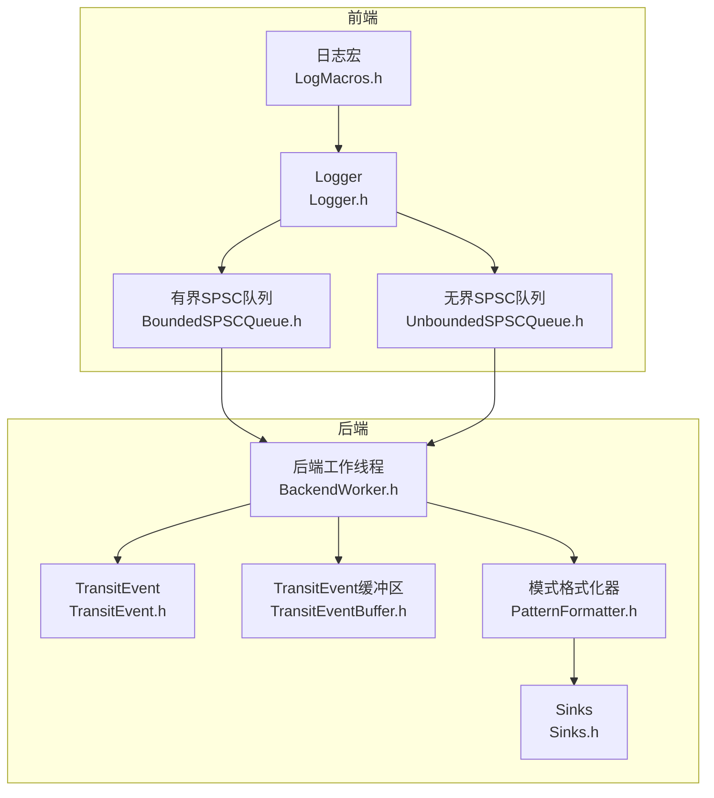
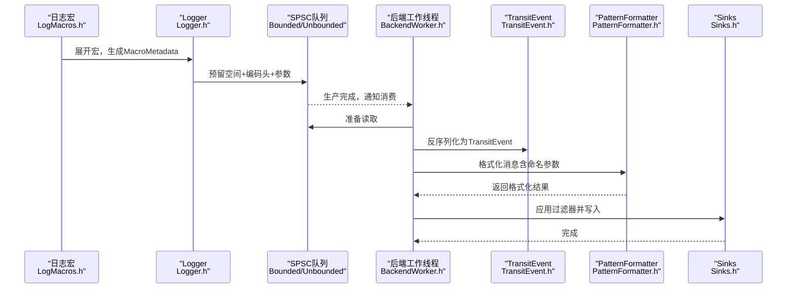
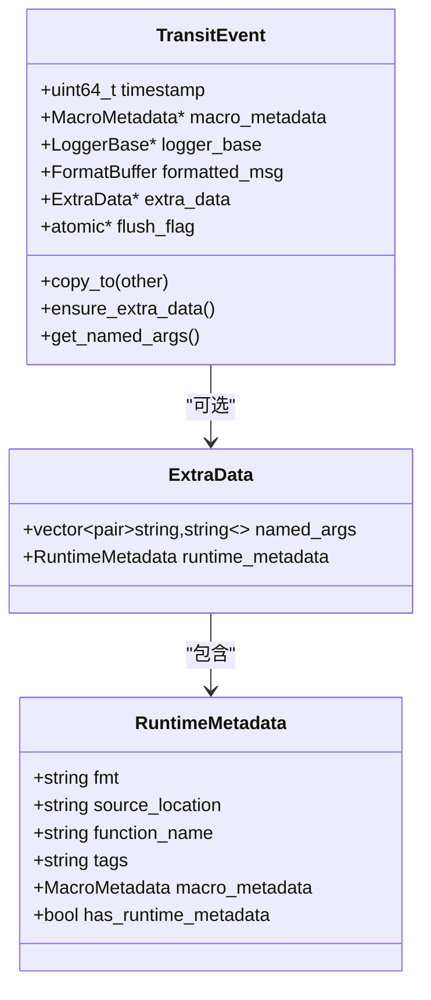
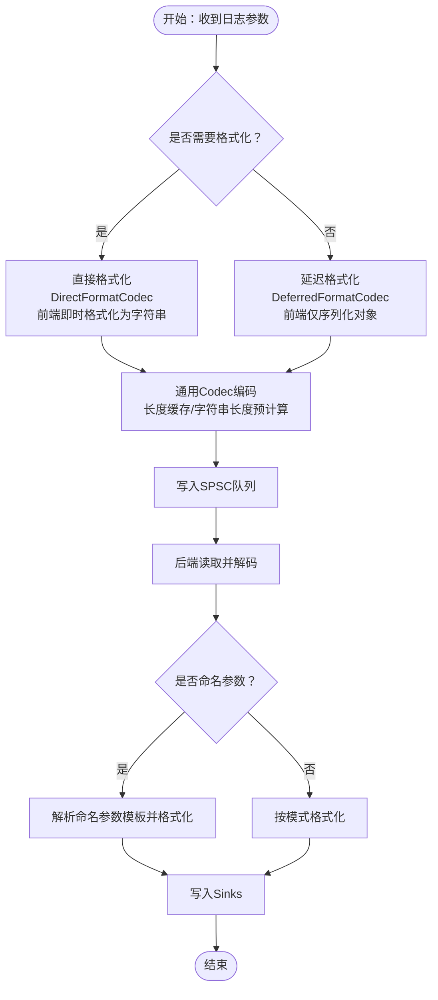
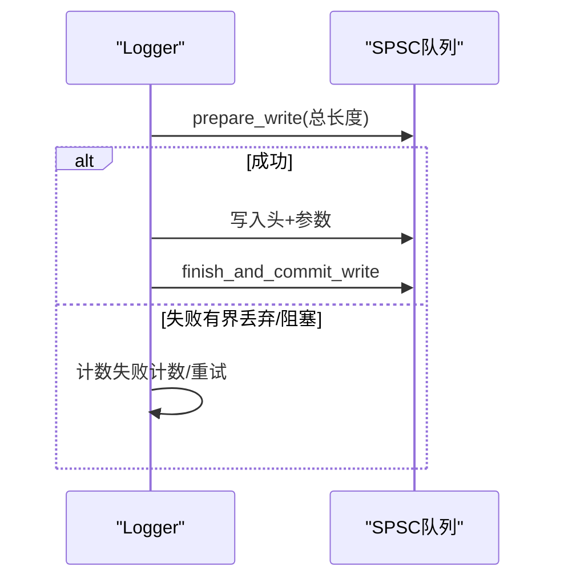
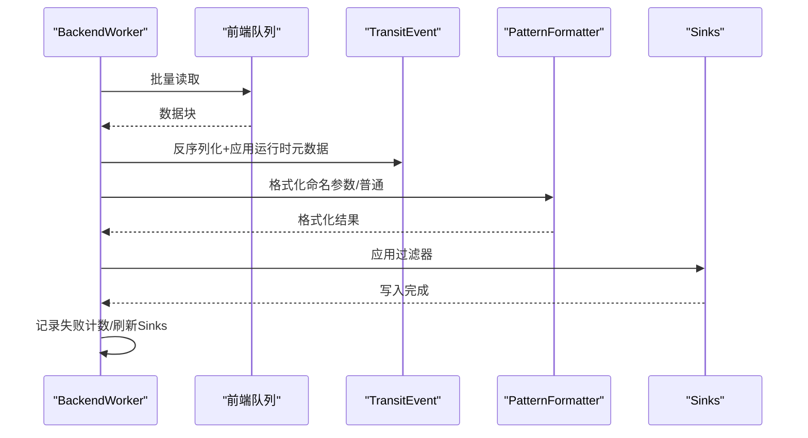
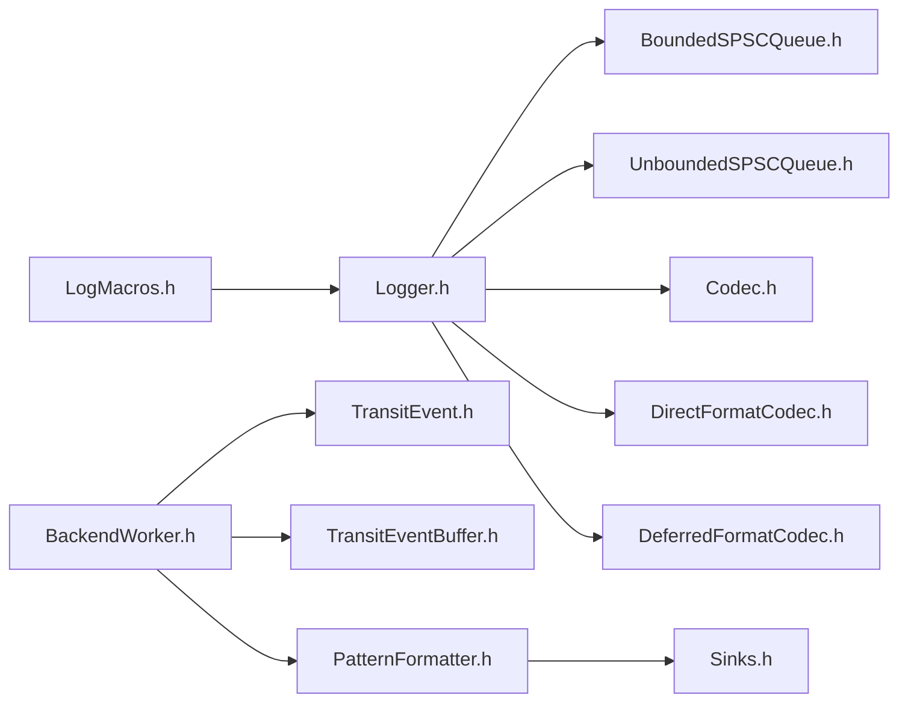

# 异步日志处理流程

<cite>
**本文档引用的文件**
- [TransitEvent.h](file://include/quill/backend/TransitEvent.h)
- [TransitEventBuffer.h](file://include/quill/backend/TransitEventBuffer.h)
- [BackendWorker.h](file://include/quill/backend/BackendWorker.h)
- [Codec.h](file://include/quill/core/Codec.h)
- [DeferredFormatCodec.h](file://include/quill/DeferredFormatCodec.h)
- [DirectFormatCodec.h](file://include/quill/DirectFormatCodec.h)
- [BoundedSPSCQueue.h](file://include/quill/core/BoundedSPSCQueue.h)
- [UnboundedSPSCQueue.h](file://include/quill/core/UnboundedSPSCQueue.h)
- [PatternFormatter.h](file://include/quill/backend/PatternFormatter.h)
- [Logger.h](file://include/quill/Logger.h)
- [Frontend.h](file://include/quill/Frontend.h)
- [LogMacros.h](file://include/quill/LogMacros.h)
</cite>

## 目录
1. [简介](#简介)
2. [项目结构](#项目结构)
3. [核心组件](#核心组件)
4. [架构总览](#架构总览)
5. [详细组件分析](#详细组件分析)
6. [依赖关系分析](#依赖关系分析)
7. [性能考虑](#性能考虑)
8. [故障排除指南](#故障排除指南)
9. [结论](#结论)

## 简介
本文件面向Quill的异步日志处理流程，完整描述从日志宏调用到最终输出的端到端数据流：前端线程接收日志消息，通过SPSC队列传递给后端线程，后端线程进行格式化和编码，最后输出到各种Sinks。重点阐释TransitEvent的数据结构与生命周期管理，编解码器在消息转换中的作用（直接格式化与延迟格式化的差异），以及错误处理、异常恢复与性能监控机制。文末提供时序图与代码路径引用，便于快速定位实现细节。

## 项目结构
Quill采用“前端-后端”双线程模型：
- 前端（每个线程本地）负责收集日志参数、序列化到SPSC队列；
- 后端（单线程）负责从各线程队列读取、反序列化、格式化、过滤并写入Sinks。

**图表来源**
- [LogMacros.h](file://include/quill/LogMacros.h)
- [Logger.h](file://include/quill/Logger.h)
- [BoundedSPSCQueue.h](file://include/quill/core/BoundedSPSCQueue.h)
- [UnboundedSPSCQueue.h](file://include/quill/core/UnboundedSPSCQueue.h)
- [BackendWorker.h](file://include/quill/backend/BackendWorker.h)
- [TransitEvent.h](file://include/quill/backend/TransitEvent.h)
- [TransitEventBuffer.h](file://include/quill/backend/TransitEventBuffer.h)
- [PatternFormatter.h](file://include/quill/backend/PatternFormatter.h)

**章节来源**
- [LogMacros.h](file://include/quill/LogMacros.h)
- [Logger.h](file://include/quill/Logger.h)
- [BoundedSPSCQueue.h](file://include/quill/core/BoundedSPSCQueue.h)
- [UnboundedSPSCQueue.h](file://include/quill/core/UnboundedSPSCQueue.h)
- [BackendWorker.h](file://include/quill/backend/BackendWorker.h)
- [TransitEvent.h](file://include/quill/backend/TransitEvent.h)
- [TransitEventBuffer.h](file://include/quill/backend/TransitEventBuffer.h)
- [PatternFormatter.h](file://include/quill/backend/PatternFormatter.h)

## 核心组件
- 日志宏与Logger：负责根据宏生成元数据、计算编码大小、预留队列空间、写入头信息与参数，并提交写入。
- 队列系统：支持有界阻塞/丢弃与无界阻塞/丢弃两种模式，保证生产者-消费者并发安全。
- 后端工作线程：轮询前端队列，反序列化为TransitEvent，按需格式化与过滤，最终写入Sinks。
- TransitEvent：承载一次日志事件的完整信息，含时间戳、元数据指针、日志器上下文、格式化缓冲与可选运行时元数据。
- 编解码器：定义类型到二进制的编码规则，支持直接格式化（运行时即时格式化字符串）与延迟格式化（仅序列化对象，后端再格式化）。

**章节来源**
- [Logger.h](file://include/quill/Logger.h)
- [BoundedSPSCQueue.h](file://include/quill/core/BoundedSPSCQueue.h)
- [UnboundedSPSCQueue.h](file://include/quill/core/UnboundedSPSCQueue.h)
- [BackendWorker.h](file://include/quill/backend/BackendWorker.h)
- [TransitEvent.h](file://include/quill/backend/TransitEvent.h)
- [Codec.h](file://include/quill/core/Codec.h)
- [DirectFormatCodec.h](file://include/quill/DirectFormatCodec.h)
- [DeferredFormatCodec.h](file://include/quill/DeferredFormatCodec.h)

## 架构总览
下图展示从日志宏到最终输出的完整链路：

**图表来源**
- [LogMacros.h](file://include/quill/LogMacros.h)
- [Logger.h](file://include/quill/Logger.h)
- [BoundedSPSCQueue.h](file://include/quill/core/BoundedSPSCQueue.h)
- [UnboundedSPSCQueue.h](file://include/quill/core/UnboundedSPSCQueue.h)
- [BackendWorker.h](file://include/quill/backend/BackendWorker.h)
- [TransitEvent.h](file://include/quill/backend/TransitEvent.h)
- [PatternFormatter.h](file://include/quill/backend/PatternFormatter.h)

## 详细组件分析

### TransitEvent 数据结构与生命周期
- 关键字段
  - 时间戳：来自前端Logger的时间源（TSC/系统时间/用户时钟）。
  - 元数据指针：指向编译期或运行时构建的MacroMetadata。
  - 日志器上下文：指向LoggerBase，用于选择格式化器与Sinks。
  - 格式化缓冲：存放已格式化的消息或延迟格式化的原始参数。
  - 可选运行时元数据：当使用运行时元数据宏时，额外保存运行时信息。
  - 刷新标志：用于flush事件的同步通知。
- 生命周期
  - 创建：前端写入队列后，后端从队列中取出并构造TransitEvent。
  - 使用：后端解析参数、格式化消息、应用命名参数模板缓存。
  - 清理：事件处理完成后清理命名参数与运行时标记，准备复用。
- 复用策略：TransitEvent在后端缓冲区循环使用，避免频繁分配。

**图表来源**
- [TransitEvent.h](file://include/quill/backend/TransitEvent.h)

**章节来源**
- [TransitEvent.h](file://include/quill/backend/TransitEvent.h)
- [BackendWorker.h](file://include/quill/backend/BackendWorker.h)

### 编解码器：直接格式化 vs 延迟格式化
- 直接格式化（DirectFormatCodec）
  - 在前端即时将复杂类型格式化为字符串，后端仅读取字符串。
  - 优点：后端处理简单，格式化开销前移；缺点：前端CPU占用增加。
- 延迟格式化（DeferredFormatCodec）
  - 在前端仅序列化对象（或其字节视图），后端反序列化后再格式化。
  - 优点：前端开销低；缺点：后端需要格式化器支持。
- 通用Codec
  - 提供基础类型（整数、指针、C字符串、std::string、string_view等）的编码/解码与长度缓存逻辑。

**图表来源**
- [DirectFormatCodec.h](file://include/quill/DirectFormatCodec.h)
- [DeferredFormatCodec.h](file://include/quill/DeferredFormatCodec.h)
- [Codec.h](file://include/quill/core/Codec.h)
- [Logger.h](file://include/quill/Logger.h)
- [BackendWorker.h](file://include/quill/backend/BackendWorker.h)

**章节来源**
- [DirectFormatCodec.h](file://include/quill/DirectFormatCodec.h)
- [DeferredFormatCodec.h](file://include/quill/DeferredFormatCodec.h)
- [Codec.h](file://include/quill/core/Codec.h)
- [Logger.h](file://include/quill/Logger.h)
- [BackendWorker.h](file://include/quill/backend/BackendWorker.h)

### 队列系统：有界与无界
- 有界队列（BoundedSPSCQueue）
  - 固定容量，满则返回空指针；支持丢弃或阻塞策略。
  - 适合高吞吐场景，防止内存无限增长。
- 无界队列（UnboundedSPSCQueue）
  - 自动扩容，节点链表形式，支持收缩。
  - 适合突发流量，但需注意内存占用与扩容成本。
- 前端预留与提交
  - 前端先计算总编码长度，预留空间，写入头（时间戳、元数据指针、日志器指针、解码函数指针）与参数，最后finish_and_commit_write。

**图表来源**
- [Logger.h](file://include/quill/Logger.h)
- [BoundedSPSCQueue.h](file://include/quill/core/BoundedSPSCQueue.h)
- [UnboundedSPSCQueue.h](file://include/quill/core/UnboundedSPSCQueue.h)

**章节来源**
- [Logger.h](file://include/quill/Logger.h)
- [BoundedSPSCQueue.h](file://include/quill/core/BoundedSPSCQueue.h)
- [UnboundedSPSCQueue.h](file://include/quill/core/UnboundedSPSCQueue.h)

### 后端处理流程：从队列到Sinks
- 轮询与缓存
  - 后端周期性唤醒，更新活跃线程上下文缓存，批量读取前端队列。
- 反序列化
  - 从队列读取头信息与参数，必要时应用运行时元数据。
- 格式化
  - 解析命名参数模板，格式化消息；若未配置模式，则直接使用原始消息。
- 过滤与写入
  - 按Sink过滤器决定是否输出；最终写入Sinks。
- 错误处理与恢复
  - 捕获异常并通过错误回调通知；记录丢弃/阻塞次数；定期刷新Sinks并执行周期任务。
- 性能监控
  - 统计失败计数、队列扩容信息、RDTSC时钟同步等。

**图表来源**
- [BackendWorker.h](file://include/quill/backend/BackendWorker.h)
- [PatternFormatter.h](file://include/quill/backend/PatternFormatter.h)

**章节来源**
- [BackendWorker.h](file://include/quill/backend/BackendWorker.h)
- [PatternFormatter.h](file://include/quill/backend/PatternFormatter.h)

### TransitEventBuffer：环形缓冲与自适应扩容
- 支持动态扩容（倍增）与空闲收缩，减少内存占用。
- 提供front/back/push_back/pop_front等操作，配合后端批处理。

**章节来源**
- [TransitEventBuffer.h](file://include/quill/backend/TransitEventBuffer.h)

### 命名参数与格式化模板缓存
- 首次遇到命名参数时解析模板并缓存键名与格式说明，后续复用以降低开销。
- 支持多行日志的元数据注入与非打印字符检查。

**章节来源**
- [BackendWorker.h](file://include/quill/backend/BackendWorker.h)
- [PatternFormatter.h](file://include/quill/backend/PatternFormatter.h)

## 依赖关系分析
- 前端对后端的依赖
  - Logger依赖SPSC队列与编解码器；宏层负责编译期优化与条件编译。
- 后端对前端的依赖
  - BackendWorker依赖TransitEvent结构、编解码器与格式化器；通过宏元数据驱动行为。
- 编解码器与类型系统
  - Codec为所有内置类型提供统一接口；DirectFormatCodec与DeferredFormatCodec分别适配不同场景。

**图表来源**
- [LogMacros.h](file://include/quill/LogMacros.h)
- [Logger.h](file://include/quill/Logger.h)
- [BoundedSPSCQueue.h](file://include/quill/core/BoundedSPSCQueue.h)
- [UnboundedSPSCQueue.h](file://include/quill/core/UnboundedSPSCQueue.h)
- [Codec.h](file://include/quill/core/Codec.h)
- [DirectFormatCodec.h](file://include/quill/DirectFormatCodec.h)
- [DeferredFormatCodec.h](file://include/quill/DeferredFormatCodec.h)
- [BackendWorker.h](file://include/quill/backend/BackendWorker.h)
- [TransitEvent.h](file://include/quill/backend/TransitEvent.h)
- [TransitEventBuffer.h](file://include/quill/backend/TransitEventBuffer.h)
- [PatternFormatter.h](file://include/quill/backend/PatternFormatter.h)

**章节来源**
- [LogMacros.h](file://include/quill/LogMacros.h)
- [Logger.h](file://include/quill/Logger.h)
- [BackendWorker.h](file://include/quill/backend/BackendWorker.h)

## 性能考虑
- 前端热点
  - 编解码器的长度缓存与memcpy路径优化，减少分支与重复计算。
  - 直接格式化将CPU压力前移，延迟格式化将压力后移，需根据场景权衡。
- 后端热点
  - 批量读取与最小化锁竞争；命名参数模板缓存显著降低重复解析成本。
  - 空闲时睡眠或让出CPU，降低能耗。
- 队列策略
  - 有界队列在高负载下可能丢弃，应结合业务需求选择阻塞/丢弃策略。
  - 无界队列自动扩容，需关注峰值内存与扩容告警。

## 故障排除指南
- 丢弃/阻塞告警
  - 后端检测到丢弃/阻塞计数时，通过错误回调输出时间戳与线程信息，便于定位瓶颈。
- 异常捕获
  - 后端主循环与各阶段均包裹异常捕获，避免崩溃并上报错误。
- RDTSC时钟同步
  - 当启用TSC时钟时，后端周期性重同步以保持时间精度。
- 日志器移除与刷新
  - flush_log使用原子标志等待后端完成刷新，避免静态对象析构期间的资源失效。

**章节来源**
- [BackendWorker.h](file://include/quill/backend/BackendWorker.h)
- [Logger.h](file://include/quill/Logger.h)

## 结论
Quill通过“前端轻量编码+后端统一格式化”的设计，在保证高性能的同时提供了灵活的扩展能力。TransitEvent作为跨线程传输的核心载体，承载了日志事件的全部必要信息；编解码器体系则在“直接格式化”与“延迟格式化”之间提供了最佳实践指导。借助SPSC队列与后端批处理，系统在高并发场景下仍能保持稳定与可观测性。