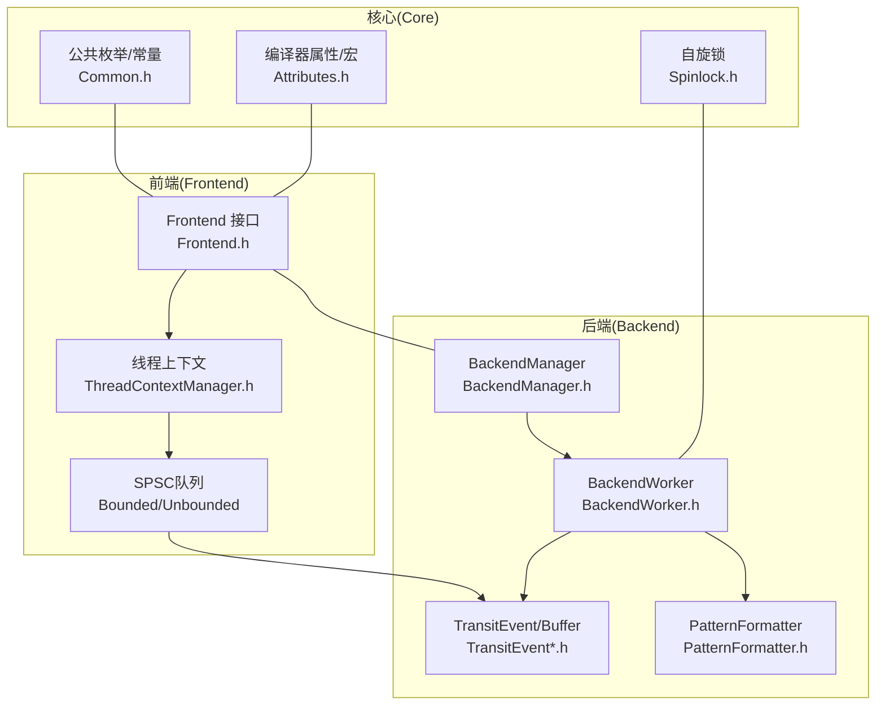
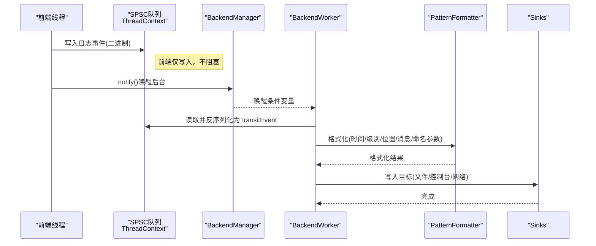
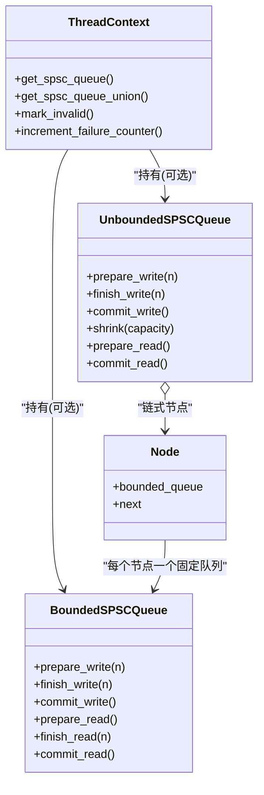
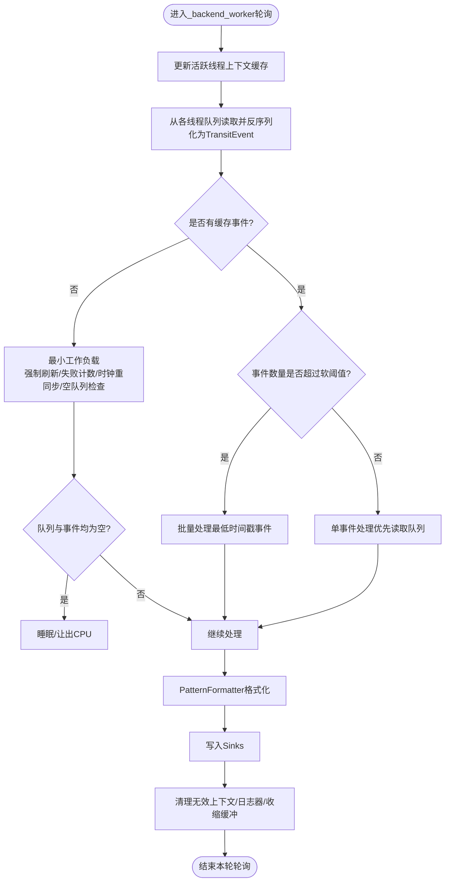
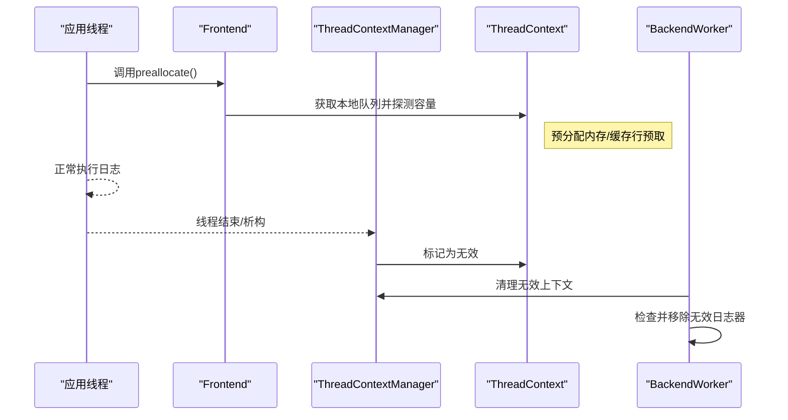
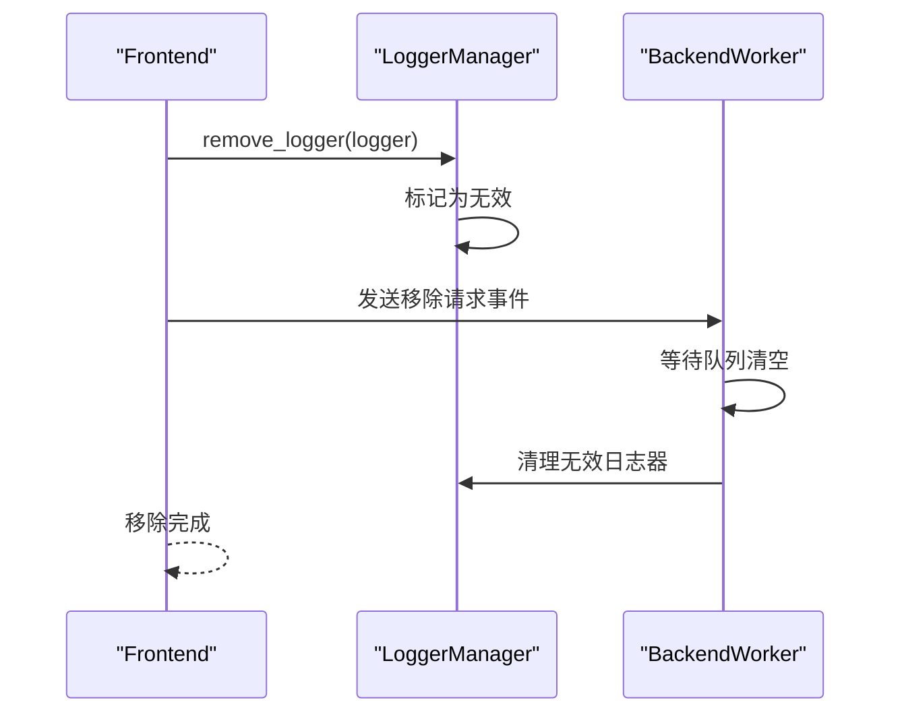
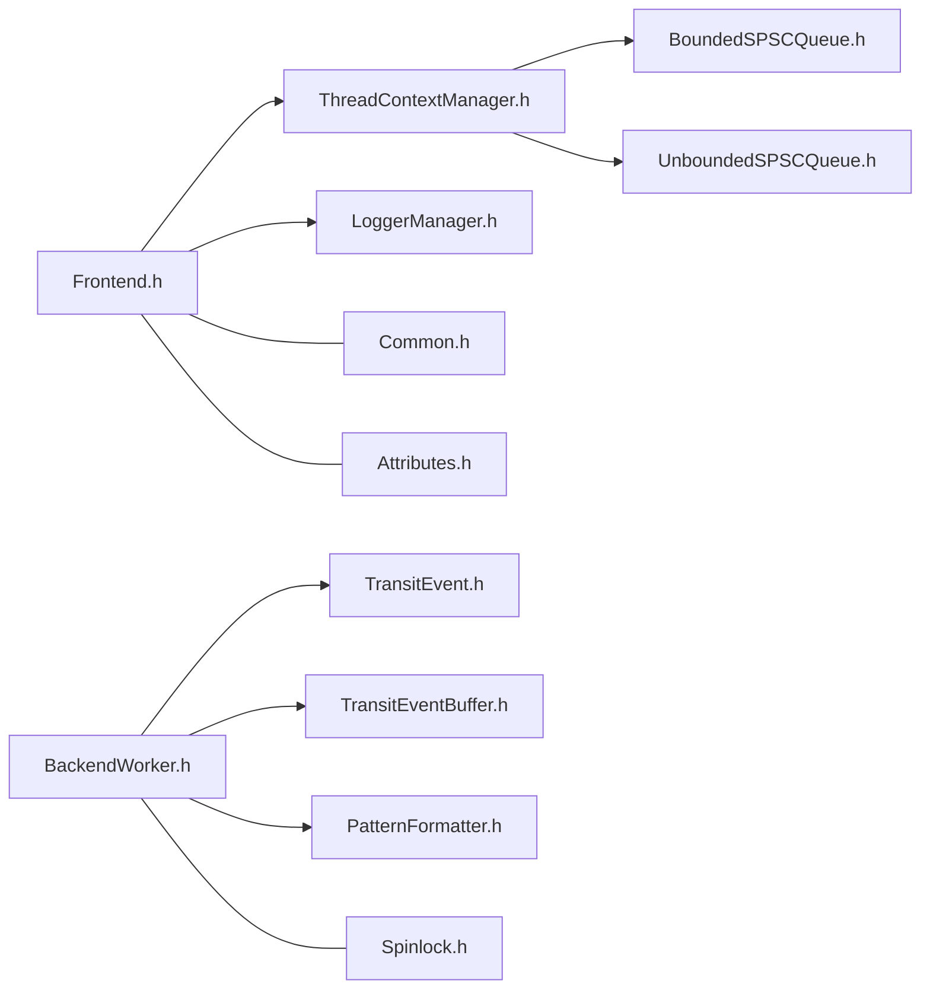

# 核心架构设计

<cite>
**本文引用的文件**
- [Frontend.h](file://include/quill/Frontend.h)
- [Backend.h](file://include/quill/Backend.h)
- [BackendManager.h](file://include/quill/backend/BackendManager.h)
- [BackendWorker.h](file://include/quill/backend/BackendWorker.h)
- [BoundedSPSCQueue.h](file://include/quill/core/BoundedSPSCQueue.h)
- [UnboundedSPSCQueue.h](file://include/quill/core/UnboundedSPSCQueue.h)
- [ThreadContextManager.h](file://include/quill/core/ThreadContextManager.h)
- [TransitEvent.h](file://include/quill/backend/TransitEvent.h)
- [TransitEventBuffer.h](file://include/quill/backend/TransitEventBuffer.h)
- [LoggerManager.h](file://include/quill/core/LoggerManager.h)
- [PatternFormatter.h](file://include/quill/backend/PatternFormatter.h)
- [Common.h](file://include/quill/core/Common.h)
- [Attributes.h](file://include/quill/core/Attributes.h)
- [Spinlock.h](file://include/quill/core/Spinlock.h)
- [console_logging.cpp](file://examples/console_logging.cpp)
- [file_logging.cpp](file://examples/file_logging.cpp)
</cite>

## 目录
1. [引言](#引言)
2. [项目结构](#项目结构)
3. [核心组件](#核心组件)
4. [架构总览](#架构总览)
5. [详细组件分析](#详细组件分析)
6. [依赖关系分析](#依赖关系分析)
7. [性能考量](#性能考量)
8. [故障排查指南](#故障排查指南)
9. [结论](#结论)
10. [附录](#附录)

## 引言
本文件面向希望深入理解Quill异步日志系统实现原理的工程师与架构师，围绕“前后端分离”“生产者-消费者模式”“SPSC队列”“内存管理”“线程上下文与预分配”等主题，系统性阐述从“前端线程消息推送”到“后台线程处理与格式化”，再到“最终输出”的完整流程，并给出架构图与数据流图，帮助读者快速把握Quill在高并发、低延迟场景下的高性能实现。

## 项目结构
Quill采用清晰的分层与模块化组织：
- 前端（Frontend）：负责线程本地上下文初始化、SPSC队列写入、日志对象管理与接口封装。
- 后端（Backend）：负责后台工作线程生命周期、唤醒机制、事件缓存与格式化、输出到Sinks。
- 核心（Core）：提供SPSC队列、线程上下文管理、公共常量与工具、锁与属性宏等基础设施。
- 后端子模块：TransitEvent/TransitEventBuffer、PatternFormatter、Rdtsc时钟等。

**图表来源**
- [Frontend.h:1-373](file://include/quill/Frontend.h#L1-L373)
- [BackendManager.h:1-136](file://include/quill/backend/BackendManager.h#L1-L136)
- [BackendWorker.h:1-800](file://include/quill/backend/BackendWorker.h#L1-L800)
- [ThreadContextManager.h:1-430](file://include/quill/core/ThreadContextManager.h#L1-L430)
- [BoundedSPSCQueue.h:1-356](file://include/quill/core/BoundedSPSCQueue.h#L1-L356)
- [UnboundedSPSCQueue.h:1-345](file://include/quill/core/UnboundedSPSCQueue.h#L1-L345)
- [TransitEvent.h:1-222](file://include/quill/backend/TransitEvent.h#L1-L222)
- [TransitEventBuffer.h:1-162](file://include/quill/backend/TransitEventBuffer.h#L1-L162)
- [PatternFormatter.h:1-608](file://include/quill/backend/PatternFormatter.h#L1-L608)
- [Common.h:1-183](file://include/quill/core/Common.h#L1-L183)
- [Attributes.h:1-181](file://include/quill/core/Attributes.h#L1-L181)
- [Spinlock.h:1-75](file://include/quill/core/Spinlock.h#L1-L75)

**章节来源**
- [Frontend.h:1-373](file://include/quill/Frontend.h#L1-L373)
- [BackendManager.h:1-136](file://include/quill/backend/BackendManager.h#L1-L136)
- [BackendWorker.h:1-800](file://include/quill/backend/BackendWorker.h#L1-L800)
- [ThreadContextManager.h:1-430](file://include/quill/core/ThreadContextManager.h#L1-L430)
- [BoundedSPSCQueue.h:1-356](file://include/quill/core/BoundedSPSCQueue.h#L1-L356)
- [UnboundedSPSCQueue.h:1-345](file://include/quill/core/UnboundedSPSCQueue.h#L1-L345)
- [Common.h:1-183](file://include/quill/core/Common.h#L1-L183)
- [Attributes.h:1-181](file://include/quill/core/Attributes.h#L1-L181)
- [Spinlock.h:1-75](file://include/quill/core/Spinlock.h#L1-L75)

## 核心组件
- 前端接口与日志器管理
  - Frontend提供线程本地队列预分配、队列容量查询/收缩、日志器创建/获取/移除等能力，统一对外API入口。
  - LoggerManager负责日志器注册、查找、失效清理与环境变量日志级别解析。
- 线程上下文与SPSC队列
  - ThreadContextManager为每个线程维护独立的ThreadContext，内含Bounded或Unbounded SPSC队列，以及TransitEventBuffer。
  - BoundedSPSCQueue基于环形缓冲区与原子位置指针，支持大页内存与缓存行优化；UnboundedSPSCQueue通过链式Node扩展容量，支持动态增长与收缩。
- 后端工作流
  - BackendManager启动/停止后台线程，提供唤醒通知与运行状态查询。
  - BackendWorker主循环读取各线程队列，反序列化为TransitEvent，按时间戳排序与严格顺序控制，调用PatternFormatter格式化，最终写入Sinks。
- 输出与格式化
  - PatternFormatter支持多字段占位符、命名参数、多行元数据、时区与路径裁剪等，避免额外分配以提升性能。
- 公共设施
  - Common/Attributes定义队列类型、时钟源、缓存行对齐、编译器属性宏等；Spinlock提供轻量级无阻塞同步。

**章节来源**
- [Frontend.h:1-373](file://include/quill/Frontend.h#L1-L373)
- [LoggerManager.h:1-311](file://include/quill/core/LoggerManager.h#L1-L311)
- [ThreadContextManager.h:1-430](file://include/quill/core/ThreadContextManager.h#L1-L430)
- [BoundedSPSCQueue.h:1-356](file://include/quill/core/BoundedSPSCQueue.h#L1-L356)
- [UnboundedSPSCQueue.h:1-345](file://include/quill/core/UnboundedSPSCQueue.h#L1-L345)
- [BackendManager.h:1-136](file://include/quill/backend/BackendManager.h#L1-L136)
- [BackendWorker.h:1-800](file://include/quill/backend/BackendWorker.h#L1-L800)
- [TransitEvent.h:1-222](file://include/quill/backend/TransitEvent.h#L1-L222)
- [TransitEventBuffer.h:1-162](file://include/quill/backend/TransitEventBuffer.h#L1-L162)
- [PatternFormatter.h:1-608](file://include/quill/backend/PatternFormatter.h#L1-L608)
- [Common.h:1-183](file://include/quill/core/Common.h#L1-L183)
- [Attributes.h:1-181](file://include/quill/core/Attributes.h#L1-L181)
- [Spinlock.h:1-75](file://include/quill/core/Spinlock.h#L1-L75)

## 架构总览
Quill采用“前端线程本地队列 + 后台线程集中处理”的前后端分离架构。前端仅负责将日志事件以固定二进制格式写入本地SPSC队列，后台线程周期性轮询这些队列，反序列化为TransitEvent，进行格式化与输出。该设计将“热路径”（前端写入）与“重活”（格式化/IO）解耦，实现极低停顿与高吞吐。

**图表来源**
- [BackendWorker.h:305-395](file://include/quill/backend/BackendWorker.h#L305-L395)
- [BackendManager.h:61-90](file://include/quill/backend/BackendManager.h#L61-L90)
- [PatternFormatter.h:97-177](file://include/quill/backend/PatternFormatter.h#L97-L177)
- [TransitEvent.h:32-219](file://include/quill/backend/TransitEvent.h#L32-L219)

## 详细组件分析

### 组件A：生产者-消费者与SPSC队列
- BoundedSPSCQueue
  - 使用双原子位置指针与掩码实现无锁环形缓冲；支持批量提交/刷新缓存行；可配置大页策略。
  - 提供prepare_write/finish_write/commit_write三段式写入，确保可见性与缓存一致性。
- UnboundedSPSCQueue
  - 由Node链表组成，每个Node为BoundedSPSCQueue；当容量不足时自动扩容，最大不超过配置上限。
  - 支持收缩（shrink）以释放多余内存，仅适用于Unbounded配置且由生产者线程调用。
- 线程上下文与队列选择
  - ThreadContextManager为每个线程创建/注册ThreadContext，保存对应队列实例与TransitEventBuffer。
  - Frontend::preallocate在线程初始化阶段预分配队列容量，避免首次写入时的动态分配开销。

**图表来源**
- [ThreadContextManager.h:53-214](file://include/quill/core/ThreadContextManager.h#L53-L214)
- [BoundedSPSCQueue.h:54-346](file://include/quill/core/BoundedSPSCQueue.h#L54-L346)
- [UnboundedSPSCQueue.h:42-337](file://include/quill/core/UnboundedSPSCQueue.h#L42-L337)

**章节来源**
- [ThreadContextManager.h:53-214](file://include/quill/core/ThreadContextManager.h#L53-L214)
- [BoundedSPSCQueue.h:54-346](file://include/quill/core/BoundedSPSCQueue.h#L54-L346)
- [UnboundedSPSCQueue.h:42-337](file://include/quill/core/UnboundedSPSCQueue.h#L42-L337)
- [Frontend.h:45-111](file://include/quill/Frontend.h#L45-L111)

### 组件B：后台处理与格式化流水线
- BackendWorker主循环
  - 更新活跃线程上下文缓存，从各线程队列读取并反序列化为TransitEvent，按软/硬阈值决定批处理策略。
  - 严格时间序控制：当启用严格时间序时，若消息时间戳大于当前窗口则暂停处理，避免乱序。
  - 批量处理完成后，执行强制刷新、失败计数检查、RDTSC时钟重同步、无效上下文/日志器清理与TransitEventBuffer收缩。
- TransitEvent与TransitEventBuffer
  - TransitEvent承载时间戳、宏元数据、日志器指针、格式化缓冲与可选的命名参数/运行时元数据。
  - TransitEventBuffer为环形缓冲，空闲时可收缩回初始容量，减少内存占用。
- PatternFormatter
  - 将时间戳、线程/进程信息、日志器名、级别、源位置、消息与命名参数按模板格式化为字符串，避免重复分配。

**图表来源**
- [BackendWorker.h:305-395](file://include/quill/backend/BackendWorker.h#L305-L395)
- [BackendWorker.h:479-755](file://include/quill/backend/BackendWorker.h#L479-L755)
- [TransitEvent.h:32-219](file://include/quill/backend/TransitEvent.h#L32-L219)
- [TransitEventBuffer.h:19-157](file://include/quill/backend/TransitEventBuffer.h#L19-L157)
- [PatternFormatter.h:97-177](file://include/quill/backend/PatternFormatter.h#L97-L177)

**章节来源**
- [BackendWorker.h:305-395](file://include/quill/backend/BackendWorker.h#L305-L395)
- [BackendWorker.h:479-755](file://include/quill/backend/BackendWorker.h#L479-L755)
- [TransitEvent.h:32-219](file://include/quill/backend/TransitEvent.h#L32-L219)
- [TransitEventBuffer.h:19-157](file://include/quill/backend/TransitEventBuffer.h#L19-L157)
- [PatternFormatter.h:97-177](file://include/quill/backend/PatternFormatter.h#L97-L177)

### 组件C：线程上下文管理与预分配机制
- 预分配（Frontend::preallocate）
  - 在线程初始化阶段调用，提前触发线程本地队列容量探测与内存准备，避免后续热路径上的首次分配。
- 上下文生命周期
  - ScopedThreadContext在线程退出时标记无效并通知BackendWorker清理；ThreadContextManager维护全局上下文集合与失效计数。
- 失败计数与清理
  - ThreadContext记录失败计数，BackendWorker周期性检查并清理无效上下文与日志器，防止悬挂资源。

**图表来源**
- [Frontend.h:45-111](file://include/quill/Frontend.h#L45-L111)
- [ThreadContextManager.h:340-422](file://include/quill/core/ThreadContextManager.h#L340-L422)
- [BackendWorker.h:443-474](file://include/quill/backend/BackendWorker.h#L443-L474)

**章节来源**
- [Frontend.h:45-111](file://include/quill/Frontend.h#L45-L111)
- [ThreadContextManager.h:340-422](file://include/quill/core/ThreadContextManager.h#L340-L422)
- [BackendWorker.h:443-474](file://include/quill/backend/BackendWorker.h#L443-L474)

### 组件D：日志器管理与移除
- LoggerManager
  - 提供日志器创建/获取/查找/失效标记与清理；支持从环境变量设置默认日志级别。
- 日志器移除
  - Frontend::remove_logger_async与remove_logger_blocking配合，通过特殊事件类型通知后台执行移除并等待完成，避免竞态。

**图表来源**
- [Frontend.h:233-289](file://include/quill/Frontend.h#L233-L289)
- [LoggerManager.h:201-239](file://include/quill/core/LoggerManager.h#L201-L239)

**章节来源**
- [Frontend.h:233-289](file://include/quill/Frontend.h#L233-L289)
- [LoggerManager.h:201-239](file://include/quill/core/LoggerManager.h#L201-L239)

## 依赖关系分析
- 前端对核心队列与上下文的依赖
  - Frontend依赖ThreadContextManager获取本地队列，依赖Bounded/UnboundedSPSCQueue进行写入。
- 后端对格式化与Sinks的依赖
  - BackendWorker依赖PatternFormatter进行格式化，依赖Sinks进行输出。
- 公共依赖
  - Attributes/Common提供编译器属性、缓存行对齐、队列类型枚举等基础能力。

**图表来源**
- [Frontend.h:1-373](file://include/quill/Frontend.h#L1-L373)
- [ThreadContextManager.h:1-430](file://include/quill/core/ThreadContextManager.h#L1-L430)
- [BoundedSPSCQueue.h:1-356](file://include/quill/core/BoundedSPSCQueue.h#L1-L356)
- [UnboundedSPSCQueue.h:1-345](file://include/quill/core/UnboundedSPSCQueue.h#L1-L345)
- [LoggerManager.h:1-311](file://include/quill/core/LoggerManager.h#L1-L311)
- [BackendWorker.h:1-800](file://include/quill/backend/BackendWorker.h#L1-L800)
- [TransitEvent.h:1-222](file://include/quill/backend/TransitEvent.h#L1-L222)
- [TransitEventBuffer.h:1-162](file://include/quill/backend/TransitEventBuffer.h#L1-L162)
- [PatternFormatter.h:1-608](file://include/quill/backend/PatternFormatter.h#L1-L608)
- [Common.h:1-183](file://include/quill/core/Common.h#L1-L183)
- [Attributes.h:1-181](file://include/quill/core/Attributes.h#L1-L181)
- [Spinlock.h:1-75](file://include/quill/core/Spinlock.h#L1-L75)

**章节来源**
- [Frontend.h:1-373](file://include/quill/Frontend.h#L1-L373)
- [BackendWorker.h:1-800](file://include/quill/backend/BackendWorker.h#L1-L800)
- [Common.h:1-183](file://include/quill/core/Common.h#L1-L183)
- [Attributes.h:1-181](file://include/quill/core/Attributes.h#L1-L181)
- [Spinlock.h:1-75](file://include/quill/core/Spinlock.h#L1-L75)

## 性能考量
- 零停顿写入
  - 前端仅做二进制写入，不涉及格式化与IO，避免阻塞调用线程。
- 缓存行与大页优化
  - BoundedSPSCQueue在x86平台使用clflush/clwb/预取指令，减少伪共享与缓存污染；支持Linux大页策略。
- 动态容量与收缩
  - UnboundedSPSCQueue在突发时自动扩容，随后可通过shrink主动收缩，降低峰值内存占用。
- 批处理与睡眠策略
  - BackendWorker根据软/硬阈值决定批处理或单事件处理；空闲时睡眠或让出CPU，降低功耗。
- 预分配与懒初始化
  - Frontend::preallocate与RdtscClock懒初始化，减少首次调用开销。
- 自旋锁与无锁设计
  - 关键临界区使用Spinlock，避免阻塞；队列采用无锁环形缓冲与原子位置指针。

[本节为通用性能指导，无需特定文件引用]

## 故障排查指南
- 后台未启动或无法唤醒
  - 检查Backend::start是否被调用；确认BackendManager::notify_backend_thread被调用。
- 日志丢失或乱序
  - 若启用严格时间序，检查消息时间戳是否超前于当前窗口；确认BackendWorker的grace_period配置合理。
- 内存占用过高
  - 对于Unbounded队列，使用Frontend::shrink_thread_local_queue在任务切换时收缩；检查TransitEventBuffer是否频繁扩容。
- 日志器移除失败
  - 确保remove_logger_blocking调用后不再有线程使用该日志器；检查后台是否完成清理。

**章节来源**
- [Backend.h:36-57](file://include/quill/Backend.h#L36-L57)
- [BackendManager.h:61-90](file://include/quill/backend/BackendManager.h#L61-L90)
- [BackendWorker.h:613-668](file://include/quill/backend/BackendWorker.h#L613-L668)
- [Frontend.h:72-111](file://include/quill/Frontend.h#L72-L111)
- [TransitEventBuffer.h:109-125](file://include/quill/backend/TransitEventBuffer.h#L109-L125)
- [Frontend.h:233-289](file://include/quill/Frontend.h#L233-L289)

## 结论
Quill通过“前端无锁写入 + 后端集中处理”的架构，结合SPSC队列、TransitEvent缓存、严格时间序控制与格式化流水线，实现了极低停顿与高吞吐的日志系统。其预分配、大页、缓存行优化与批处理策略共同保障了在高并发场景下的稳定性能。开发者可依据本文档的架构图与流程图，快速定位问题并进行针对性优化。

[本节为总结性内容，无需特定文件引用]

## 附录
- 快速上手示例
  - 控制台日志与STL类型支持：[console_logging.cpp:1-72](file://examples/console_logging.cpp#L1-L72)
  - 文件日志与多日志器共享Sink：[file_logging.cpp:1-73](file://examples/file_logging.cpp#L1-L73)

**章节来源**
- [console_logging.cpp:1-72](file://examples/console_logging.cpp#L1-L72)
- [file_logging.cpp:1-73](file://examples/file_logging.cpp#L1-L73)