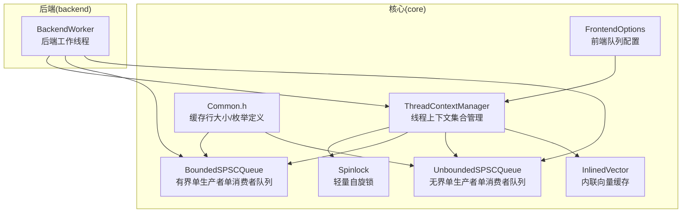
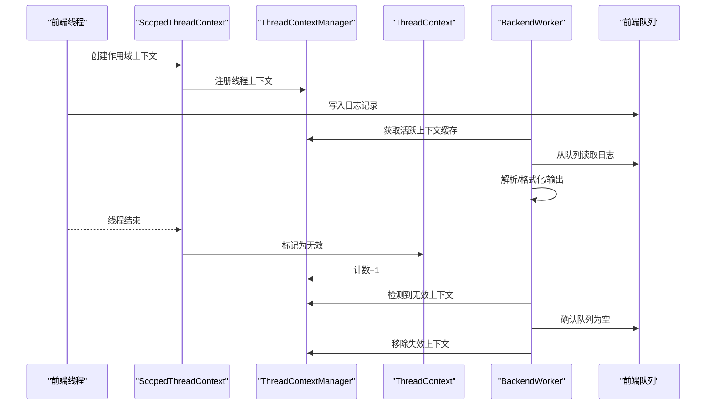
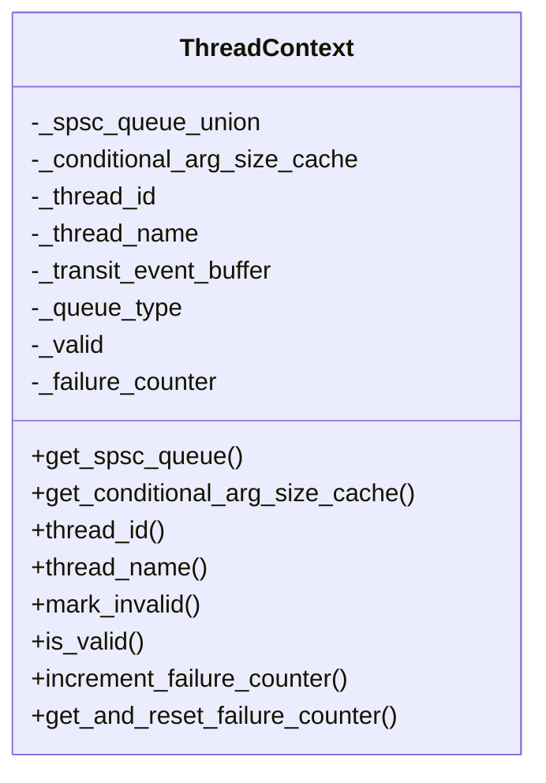
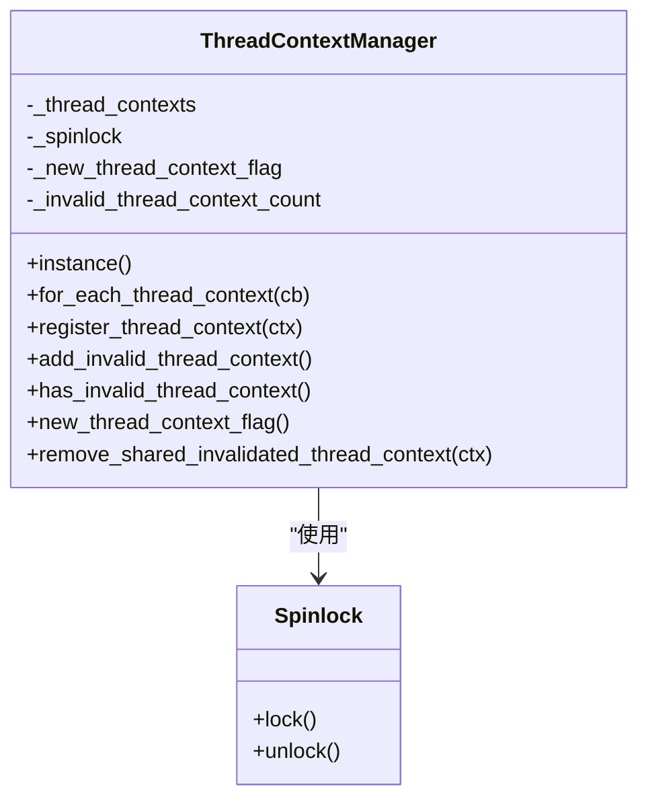
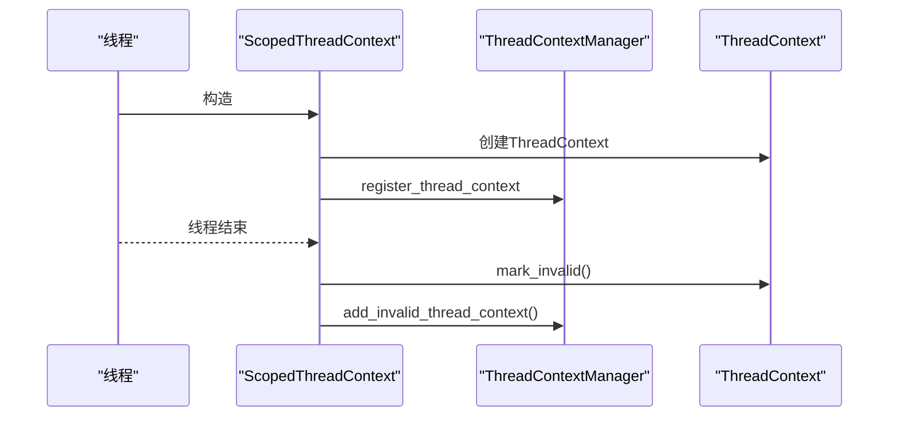
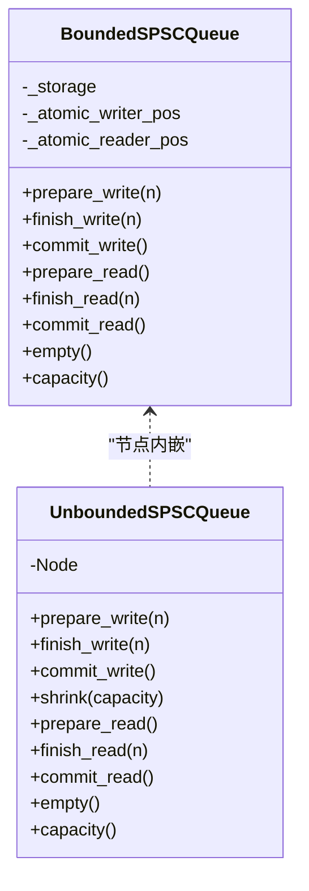
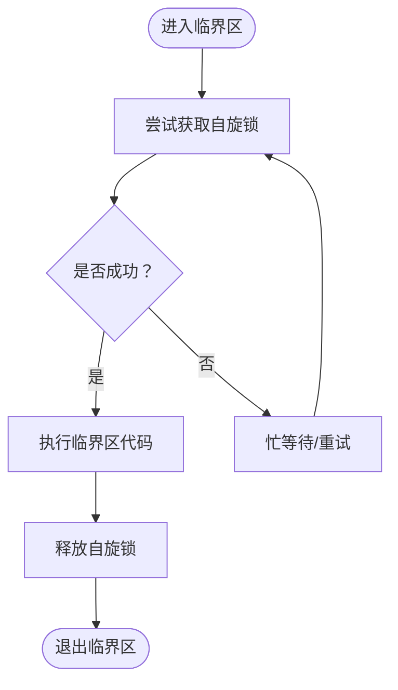
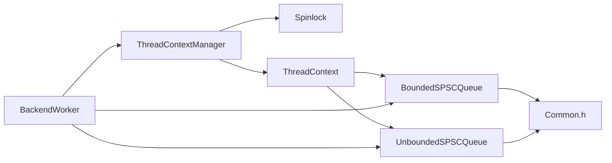

# 线程上下文管理

<cite>
**本文引用的文件**
- [ThreadContextManager.h](file://include/quill/core/ThreadContextManager.h)
- [Spinlock.h](file://include/quill/core/Spinlock.h)
- [Common.h](file://include/quill/core/Common.h)
- [BoundedSPSCQueue.h](file://include/quill/core/BoundedSPSCQueue.h)
- [UnboundedSPSCQueue.h](file://include/quill/core/UnboundedSPSCQueue.h)
- [InlinedVector.h](file://include/quill/core/InlinedVector.h)
- [FrontendOptions.h](file://include/quill/core/FrontendOptions.h)
- [BackendWorker.h](file://include/quill/backend/BackendWorker.h)
- [ThreadContextManagerTest.cpp](file://test/unit_tests/ThreadContextManagerTest.cpp)
</cite>

## 目录
1. [简介](#简介)
2. [项目结构](#项目结构)
3. [核心组件](#核心组件)
4. [架构总览](#架构总览)
5. [详细组件分析](#详细组件分析)
6. [依赖关系分析](#依赖关系分析)
7. [性能考量](#性能考量)
8. [故障排查指南](#故障排查指南)
9. [结论](#结论)
10. [附录](#附录)

## 简介
本文件系统性阐述Quill的线程上下文管理系统，重点覆盖以下方面：
- 每个线程如何维护独立的上下文状态（队列指针、格式化器缓存、时间戳信息等）
- 自旋锁在高并发路径中的使用场景与性能优势
- 线程上下文的创建、销毁与清理机制
- 多线程环境下的内存对齐、缓存行优化与NUMA感知设计
- 面向性能的调优建议

## 项目结构
围绕线程上下文管理的关键代码位于核心模块与后端模块中：
- 核心模块：ThreadContextManager、Spinlock、队列实现（有界/无界SPSC）、通用常量与工具
- 后端模块：BackendWorker负责消费前端线程上下文中的日志事件并进行清理

图表来源
- [ThreadContextManager.h:216-338](file://include/quill/core/ThreadContextManager.h#L216-L338)
- [Spinlock.h:18-72](file://include/quill/core/Spinlock.h#L18-L72)
- [BoundedSPSCQueue.h:54-346](file://include/quill/core/BoundedSPSCQueue.h#L54-L346)
- [UnboundedSPSCQueue.h:42-337](file://include/quill/core/UnboundedSPSCQueue.h#L42-L337)
- [InlinedVector.h:35-170](file://include/quill/core/InlinedVector.h#L35-L170)
- [FrontendOptions.h:16-50](file://include/quill/core/FrontendOptions.h#L16-L50)
- [Common.h:123-180](file://include/quill/core/Common.h#L123-L180)
- [BackendWorker.h:77-800](file://include/quill/backend/BackendWorker.h#L77-L800)

章节来源
- [ThreadContextManager.h:216-338](file://include/quill/core/ThreadContextManager.h#L216-L338)
- [BackendWorker.h:1385-1417](file://include/quill/backend/BackendWorker.h#L1385-L1417)

## 核心组件
- 线程上下文（ThreadContext）：封装每条前端线程的队列、条件参数尺寸缓存、线程标识与名称、有效性标记、失败计数等
- 线程上下文管理器（ThreadContextManager）：全局单例，维护所有已注册的线程上下文，提供注册、遍历、移除失效上下文等能力
- 作用域线程上下文（ScopedThreadContext）：线程局部生命周期包装，负责创建与销毁线程上下文
- 自旋锁（Spinlock）：在极短临界区内避免阻塞开销，提升高频路径吞吐
- 前端队列（Bounded/Unbounded SPSC）：前端线程写入、后端线程读取的高性能通道
- 缓存行与内联向量（InlinedVector）：减少分配与提升缓存友好性

章节来源
- [ThreadContextManager.h:53-214](file://include/quill/core/ThreadContextManager.h#L53-L214)
- [ThreadContextManager.h:216-338](file://include/quill/core/ThreadContextManager.h#L216-L338)
- [ThreadContextManager.h:340-399](file://include/quill/core/ThreadContextManager.h#L340-L399)
- [Spinlock.h:18-72](file://include/quill/core/Spinlock.h#L18-L72)
- [BoundedSPSCQueue.h:54-346](file://include/quill/core/BoundedSPSCQueue.h#L54-L346)
- [UnboundedSPSCQueue.h:42-337](file://include/quill/core/UnboundedSPSCQueue.h#L42-L337)
- [InlinedVector.h:35-170](file://include/quill/core/InlinedVector.h#L35-L170)

## 架构总览
前端线程通过作用域对象创建线程上下文，并将其注册到全局管理器；后端工作线程周期性轮询各线程上下文，从其队列中取出日志事件并处理；当前端线程结束时，其上下文被标记为无效，后端在空闲时清理这些失效上下文。

图表来源
- [ThreadContextManager.h:243-249](file://include/quill/core/ThreadContextManager.h#L243-L249)
- [ThreadContextManager.h:371-383](file://include/quill/core/ThreadContextManager.h#L371-L383)
- [BackendWorker.h:1396-1417](file://include/quill/backend/BackendWorker.h#L1396-L1417)
- [BackendWorker.h:358-359](file://include/quill/backend/BackendWorker.h#L358-L359)

## 详细组件分析

### 线程上下文（ThreadContext）
- 维护每线程的SPSC队列（有界或无界），用于存放日志事件
- 条件参数尺寸缓存（SizeCacheVector），用于加速特定操作（如strn类函数）
- 线程标识与名称缓存，避免重复查询
- 有效性标志（_valid）与失败计数（_failure_counter），供后端检测与统计
- 对齐声明（alignas(QUILL_CACHE_LINE_ALIGNED)）确保跨线程共享数据不产生伪共享

图表来源
- [ThreadContextManager.h:53-214](file://include/quill/core/ThreadContextManager.h#L53-L214)

章节来源
- [ThreadContextManager.h:53-214](file://include/quill/core/ThreadContextManager.h#L53-L214)
- [InlinedVector.h:167-172](file://include/quill/core/InlinedVector.h#L167-L172)
- [Common.h:129-130](file://include/quill/core/Common.h#L129-L130)

### 线程上下文管理器（ThreadContextManager）
- 单例模式，保存所有已注册的线程上下文
- 使用自旋锁保护注册/移除等修改操作
- 提供遍历回调、新增上下文通知、失效上下文计数与移除接口
- 保证线程安全且尽量降低锁粒度

图表来源
- [ThreadContextManager.h:216-338](file://include/quill/core/ThreadContextManager.h#L216-L338)
- [Spinlock.h:18-72](file://include/quill/core/Spinlock.h#L18-L72)

章节来源
- [ThreadContextManager.h:216-338](file://include/quill/core/ThreadContextManager.h#L216-L338)

### 作用域线程上下文（ScopedThreadContext）
- 在线程生命周期内创建并持有ThreadContext
- 注册到ThreadContextManager；线程结束时仅标记无效，不立即删除
- 主线程拥有特殊处理逻辑（可提前销毁）

图表来源
- [ThreadContextManager.h:340-399](file://include/quill/core/ThreadContextManager.h#L340-L399)
- [ThreadContextManager.h:243-249](file://include/quill/core/ThreadContextManager.h#L243-L249)
- [ThreadContextManager.h:371-383](file://include/quill/core/ThreadContextManager.h#L371-L383)

章节来源
- [ThreadContextManager.h:340-399](file://include/quill/core/ThreadContextManager.h#L340-L399)

### 队列实现（有界/无界SPSC）
- 有界队列：固定容量，支持大页内存策略，缓存行对齐写/读指针，减少伪共享
- 无界队列：链式节点，按需扩容，最大容量受前端选项限制，支持收缩

图表来源
- [BoundedSPSCQueue.h:54-346](file://include/quill/core/BoundedSPSCQueue.h#L54-L346)
- [UnboundedSPSCQueue.h:42-337](file://include/quill/core/UnboundedSPSCQueue.h#L42-L337)

章节来源
- [BoundedSPSCQueue.h:54-346](file://include/quill/core/BoundedSPSCQueue.h#L54-L346)
- [UnboundedSPSCQueue.h:42-337](file://include/quill/core/UnboundedSPSCQueue.h#L42-L337)

### 自旋锁（Spinlock）与锁守卫
- 自旋锁在极短临界区避免线程切换开销，适合频繁但短暂的互斥场景
- LockGuard简化RAII用法，自动加解锁

图表来源
- [Spinlock.h:30-45](file://include/quill/core/Spinlock.h#L30-L45)

章节来源
- [Spinlock.h:18-72](file://include/quill/core/Spinlock.h#L18-L72)

### 缓存行与内联向量
- 缓存行常量定义（64字节）与对齐宏，确保关键字段跨线程共享时不产生伪共享
- SizeCacheVector采用内联缓冲与堆缓冲切换，容量为12以适配单缓存行，减少分配与提升命中率

章节来源
- [Common.h:129-130](file://include/quill/core/Common.h#L129-L130)
- [InlinedVector.h:167-172](file://include/quill/core/InlinedVector.h#L167-L172)

### 前端选项与队列类型
- FrontendOptions定义默认队列类型、初始容量、阻塞重试间隔、最大容量与大页策略
- 支持四种队列类型：有界/无界 + 阻塞/丢弃

章节来源
- [FrontendOptions.h:16-50](file://include/quill/core/FrontendOptions.h#L16-L50)
- [Common.h:145-151](file://include/quill/core/Common.h#L145-L151)

### 后端清理流程
- 后端线程在空闲时检测并清理失效且队列为空的线程上下文
- 通过回调遍历活跃上下文缓存，确认无效且空队列后移除

章节来源
- [BackendWorker.h:1396-1417](file://include/quill/backend/BackendWorker.h#L1396-L1417)

## 依赖关系分析
- ThreadContextManager依赖Spinlock保护容器访问
- ThreadContext持有队列联合体（有界/无界），并通过模板方法返回对应队列引用
- BackendWorker依赖ThreadContextManager获取活跃上下文，再从队列读取事件
- 队列实现依赖缓存行常量与大页策略

图表来源
- [ThreadContextManager.h:216-338](file://include/quill/core/ThreadContextManager.h#L216-L338)
- [BackendWorker.h:77-800](file://include/quill/backend/BackendWorker.h#L77-L800)
- [BoundedSPSCQueue.h:54-346](file://include/quill/core/BoundedSPSCQueue.h#L54-L346)
- [UnboundedSPSCQueue.h:42-337](file://include/quill/core/UnboundedSPSCQueue.h#L42-L337)
- [Common.h:129-130](file://include/quill/core/Common.h#L129-L130)

章节来源
- [ThreadContextManager.h:216-338](file://include/quill/core/ThreadContextManager.h#L216-L338)
- [BackendWorker.h:77-800](file://include/quill/backend/BackendWorker.h#L77-L800)

## 性能考量

### 自旋锁的选择与优势
- 适用场景：极短临界区、低竞争概率、高频路径
- 优势：避免线程阻塞/唤醒开销，降低上下文切换成本
- 注意：在高竞争或长临界区下应考虑互斥锁，避免CPU忙等

章节来源
- [Spinlock.h:30-45](file://include/quill/core/Spinlock.h#L30-L45)
- [ThreadContextManager.h:234-247](file://include/quill/core/ThreadContextManager.h#L234-L247)

### 内存对齐与缓存行优化
- 关键共享字段使用alignas(QUILL_CACHE_LINE_ALIGNED)对齐，避免伪共享
- 队列写/读指针与原子变量均按缓存行对齐，减少跨核干扰
- SizeCacheVector容量设计为12，适配单缓存行，减少分配与提升命中

章节来源
- [ThreadContextManager.h:213-213](file://include/quill/core/ThreadContextManager.h#L213-L213)
- [BoundedSPSCQueue.h:337-345](file://include/quill/core/BoundedSPSCQueue.h#L337-L345)
- [UnboundedSPSCQueue.h:335-336](file://include/quill/core/UnboundedSPSCQueue.h#L335-L336)
- [InlinedVector.h:167-172](file://include/quill/core/InlinedVector.h#L167-L172)
- [Common.h:129-130](file://include/quill/core/Common.h#L129-L130)

### NUMA感知设计
- 代码未直接暴露NUMA节点绑定接口，但提供了CPU亲和设置的平台适配（后端线程）
- 前端队列支持大页策略（Linux），有助于降低TLB抖动，间接提升跨NUMA场景性能

章节来源
- [BackendWorker.h:156-160](file://include/quill/backend/BackendWorker.h#L156-L160)
- [BoundedSPSCQueue.h:267-282](file://include/quill/core/BoundedSPSCQueue.h#L267-L282)

### 队列容量与退避策略
- 有界队列：固定容量，满载时阻塞或丢弃（取决于队列类型）
- 无界队列：按需扩容至最大容量，超过则阻塞或丢弃；支持收缩以节省内存
- 前端选项提供初始容量与最大容量配置，平衡延迟与内存占用

章节来源
- [UnboundedSPSCQueue.h:244-297](file://include/quill/core/UnboundedSPSCQueue.h#L244-L297)
- [FrontendOptions.h:16-50](file://include/quill/core/FrontendOptions.h#L16-L50)

### 性能调优建议
- 将高频路径保持在自旋锁保护的最小范围内，避免在临界区内做昂贵操作
- 合理设置FrontendOptions的初始容量与最大容量，结合业务峰值流量评估
- 在Linux上启用大页策略可显著降低TLB开销，适用于高吞吐场景
- 适当增大后端轮询间隔或启用“空闲让出”策略，降低空闲时CPU占用
- 使用有界队列+丢弃策略可避免长时间阻塞，提高系统稳定性

## 故障排查指南
- 上下文未清理：检查后端是否检测到无效上下文并清理；确认线程结束时是否正确标记无效
- 队列异常：检查队列类型与容量配置，确认无界队列未超过最大容量
- 死锁/卡顿：排查自旋锁使用是否过长或在临界区内调用可能阻塞的函数
- 内存问题：确认大页分配成功，Linux环境下权限与内核参数满足要求

章节来源
- [ThreadContextManagerTest.cpp:15-113](file://test/unit_tests/ThreadContextManagerTest.cpp#L15-L113)
- [BackendWorker.h:1396-1417](file://include/quill/backend/BackendWorker.h#L1396-L1417)
- [BoundedSPSCQueue.h:267-282](file://include/quill/core/BoundedSPSCQueue.h#L267-L282)

## 结论
Quill的线程上下文管理通过轻量的自旋锁、对齐的缓存行布局与高效的SPSC队列，实现了前端线程与后端线程之间的低延迟、高吞吐通信。作用域上下文确保了生命周期安全，后端清理机制保障了资源回收。通过合理配置前端选项与利用大页策略，可在多核与NUMA环境中进一步提升性能。

## 附录
- 关键API与路径参考
  - 线程上下文创建与注册：[ThreadContextManager.h:340-399](file://include/quill/core/ThreadContextManager.h#L340-L399)
  - 线程上下文管理器：[ThreadContextManager.h:216-338](file://include/quill/core/ThreadContextManager.h#L216-L338)
  - 自旋锁与锁守卫：[Spinlock.h:18-72](file://include/quill/core/Spinlock.h#L18-L72)
  - 有界/无界队列：[BoundedSPSCQueue.h:54-346](file://include/quill/core/BoundedSPSCQueue.h#L54-L346), [UnboundedSPSCQueue.h:42-337](file://include/quill/core/UnboundedSPSCQueue.h#L42-L337)
  - 缓存行与内联向量：[Common.h:129-130](file://include/quill/core/Common.h#L129-L130), [InlinedVector.h:167-172](file://include/quill/core/InlinedVector.h#L167-L172)
  - 前端选项：[FrontendOptions.h:16-50](file://include/quill/core/FrontendOptions.h#L16-L50)
  - 后端清理流程：[BackendWorker.h:1396-1417](file://include/quill/backend/BackendWorker.h#L1396-L1417)