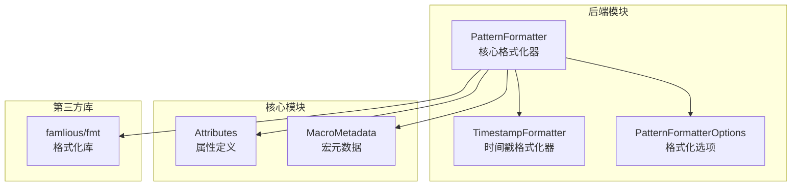
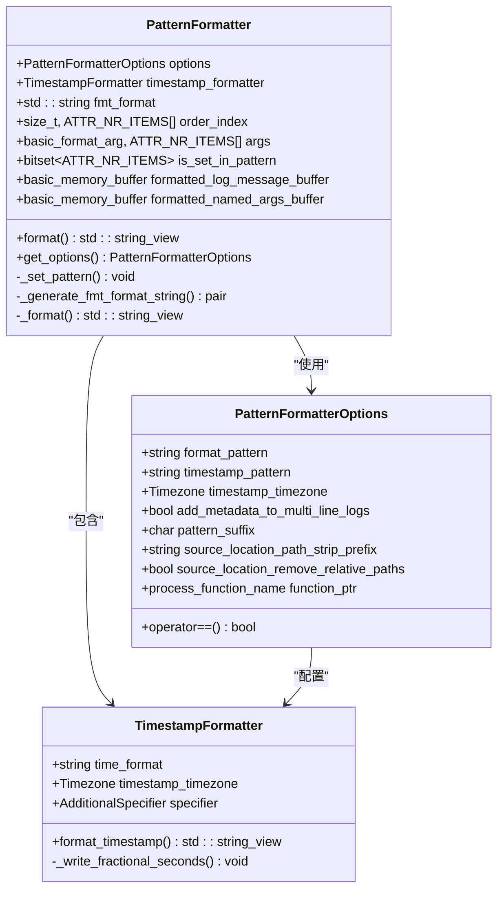
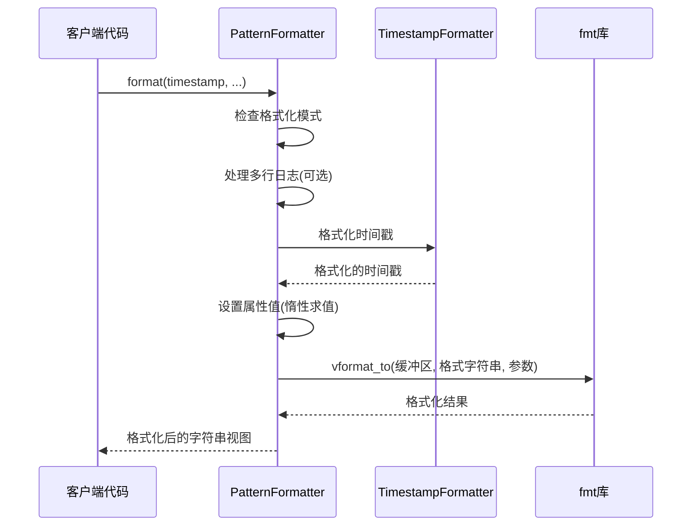
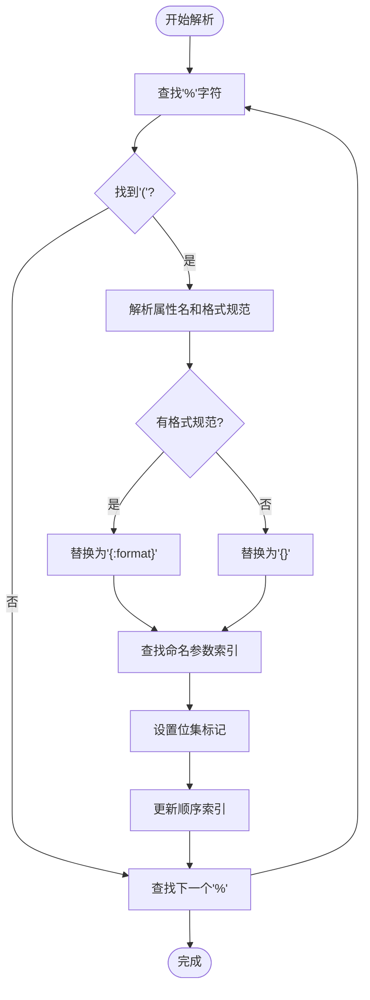
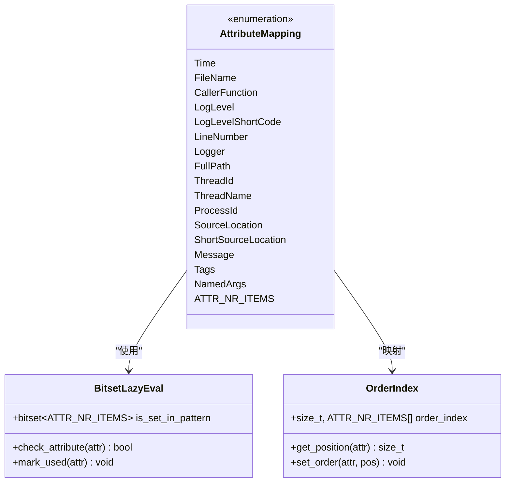
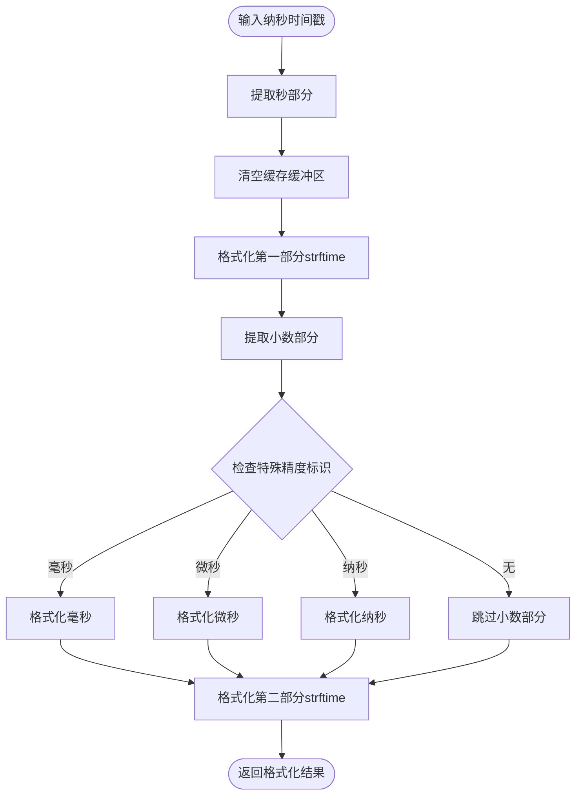
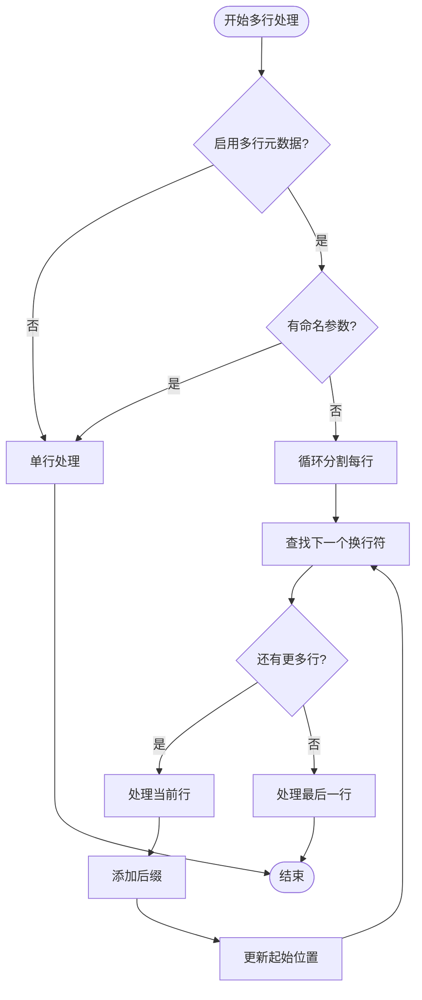
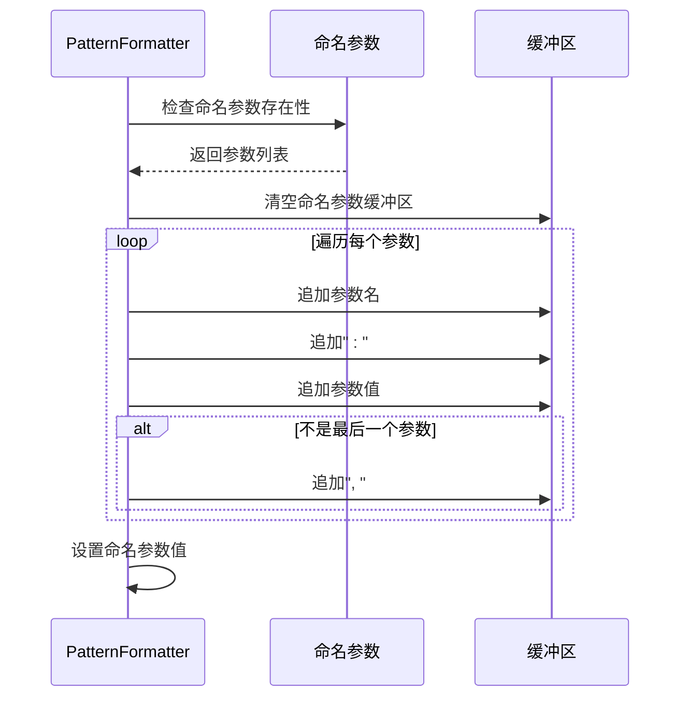
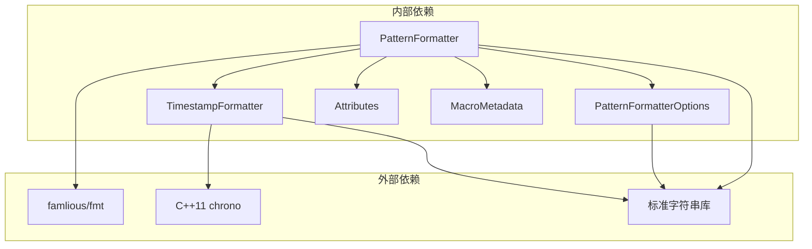

# PatternFormatter核心功能

<cite>
**本文档引用的文件**
- [PatternFormatter.h](file://include/quill/backend/PatternFormatter.h)
- [PatternFormatterOptions.h](file://include/quill/core/PatternFormatterOptions.h)
- [TimestampFormatter.h](file://include/quill/backend/TimestampFormatter.h)
- [PatternFormatterTest.cpp](file://test/unit_tests/PatternFormatterTest.cpp)
</cite>

## 目录
1. [简介](#简介)
2. [项目结构](#项目结构)
3. [核心组件](#核心组件)
4. [架构概览](#架构概览)
5. [详细组件分析](#详细组件分析)
6. [依赖关系分析](#依赖关系分析)
7. [性能考虑](#性能考虑)
8. [故障排除指南](#故障排除指南)
9. [结论](#结论)

## 简介

PatternFormatter是Quill日志库中的核心格式化组件，负责将结构化的日志数据转换为人类可读的格式化输出。该组件提供了灵活的格式化选项，支持多种时间戳精度、多行日志处理和命名参数支持。通过编译时优化和运行时性能调优，PatternFormatter在保证功能丰富性的同时实现了高效的日志格式化性能。

## 项目结构

PatternFormatter位于Quill库的后端模块中，与相关的配置选项和时间戳格式化器共同协作：

**图表来源**
- [PatternFormatter.h:31-608](file://include/quill/backend/PatternFormatter.h#L31-L608)
- [PatternFormatterOptions.h:23-170](file://include/quill/core/PatternFormatterOptions.h#L23-L170)
- [TimestampFormatter.h:26-218](file://include/quill/backend/TimestampFormatter.h#L26-L218)

**章节来源**
- [PatternFormatter.h:1-608](file://include/quill/backend/PatternFormatter.h#L1-L608)
- [PatternFormatterOptions.h:1-170](file://include/quill/core/PatternFormatterOptions.h#L1-L170)

## 核心组件

PatternFormatter类是整个格式化系统的核心，它继承了以下关键特性：

### 主要功能特性
- **格式化模式解析**：支持`%(attribute)`占位符语法
- **属性映射机制**：将占位符映射到具体的日志属性
- **时间戳格式化**：支持毫秒、微秒、纳秒精度
- **多行日志处理**：智能分割和格式化多行消息
- **命名参数支持**：动态键值对参数格式化
- **编译时优化**：惰性求值和预分配机制

### 关键数据结构

**图表来源**
- [PatternFormatter.h:33-608](file://include/quill/backend/PatternFormatter.h#L33-L608)
- [PatternFormatterOptions.h:23-170](file://include/quill/core/PatternFormatterOptions.h#L23-L170)
- [TimestampFormatter.h:38-218](file://include/quill/backend/TimestampFormatter.h#L38-L218)

**章节来源**
- [PatternFormatter.h:33-608](file://include/quill/backend/PatternFormatter.h#L33-L608)
- [PatternFormatterOptions.h:23-170](file://include/quill/core/PatternFormatterOptions.h#L23-L170)

## 架构概览

PatternFormatter采用分层架构设计，通过清晰的职责分离实现高效的日志格式化：

**图表来源**
- [PatternFormatter.h:97-177](file://include/quill/backend/PatternFormatter.h#L97-L177)
- [PatternFormatter.h:469-588](file://include/quill/backend/PatternFormatter.h#L469-L588)

## 详细组件分析

### 格式化模式解析机制

PatternFormatter实现了复杂的模式解析算法，支持灵活的占位符语法：

#### 占位符语法支持
- 基本占位符：`%(attribute)`
- 自定义格式规范：`%(attribute:format_spec)`

#### 解析流程

**图表来源**
- [PatternFormatter.h:355-466](file://include/quill/backend/PatternFormatter.h#L355-L466)

### 属性映射机制

PatternFormatter维护了一个完整的属性映射系统，支持所有可用的日志属性：

#### 支持的属性类型
- 时间戳相关：`time`, `timestamp`
- 文件信息：`file_name`, `full_path`, `line_number`
- 函数信息：`caller_function`, `source_location`, `short_source_location`
- 日志级别：`log_level`, `log_level_short_code`
- 系统信息：`thread_id`, `thread_name`, `process_id`
- 其他：`logger`, `message`, `tags`, `named_args`

#### 映射实现

**图表来源**
- [PatternFormatter.h:48-67](file://include/quill/backend/PatternFormatter.h#L48-L67)
- [PatternFormatter.h:594-597](file://include/quill/backend/PatternFormatter.h#L594-L597)

**章节来源**
- [PatternFormatter.h:48-67](file://include/quill/backend/PatternFormatter.h#L48-L67)
- [PatternFormatter.h:281-311](file://include/quill/backend/PatternFormatter.h#L281-L311)

### 时间戳精度设置

PatternFormatter通过TimestampFormatter支持多种时间戳精度：

#### 精度级别
- **None**：不显示小数部分
- **MilliSeconds**：毫秒精度（%Qms）
- **MicroSeconds**：微秒精度（%Qus）
- **NanoSeconds**：纳秒精度（%Qns）

#### 时间戳格式化流程

**图表来源**
- [TimestampFormatter.h:122-174](file://include/quill/backend/TimestampFormatter.h#L122-L174)

**章节来源**
- [TimestampFormatter.h:38-218](file://include/quill/backend/TimestampFormatter.h#L38-L218)

### 多行日志处理

PatternFormatter提供了智能的多行日志处理机制：

#### 处理策略
- **按行分割**：自动检测换行符进行分割
- **元数据重复**：可选择在每行重复添加元数据
- **后缀处理**：智能处理消息末尾的换行符

#### 处理逻辑

**图表来源**
- [PatternFormatter.h:123-177](file://include/quill/backend/PatternFormatter.h#L123-L177)

**章节来源**
- [PatternFormatter.h:123-177](file://include/quill/backend/PatternFormatter.h#L123-L177)

### 命名参数支持

PatternFormatter支持动态命名参数的格式化：

#### 参数格式化流程

**图表来源**
- [PatternFormatter.h:547-568](file://include/quill/backend/PatternFormatter.h#L547-L568)

**章节来源**
- [PatternFormatter.h:547-568](file://include/quill/backend/PatternFormatter.h#L547-L568)

## 依赖关系分析

PatternFormatter的依赖关系体现了清晰的模块化设计：

**图表来源**
- [PatternFormatter.h:9-29](file://include/quill/backend/PatternFormatter.h#L9-L29)
- [TimestampFormatter.h:10-22](file://include/quill/backend/TimestampFormatter.h#L10-L22)

**章节来源**
- [PatternFormatter.h:9-29](file://include/quill/backend/PatternFormatter.h#L9-L29)

## 性能考虑

PatternFormatter采用了多项编译时和运行时优化技术来确保高性能：

### 编译时优化

#### 惰性求值机制
- 使用`bitset`跟踪哪些属性在格式化模式中使用
- 只计算实际需要的属性值
- 避免不必要的字符串操作

#### 预分配机制
- 使用`basic_memory_buffer`预分配固定大小缓冲区
- 减少动态内存分配次数
- 避免频繁的内存重分配

### 运行时优化

#### 高效的字符串处理
- 使用`string_view`避免不必要的字符串拷贝
- 批量格式化操作减少函数调用开销
- 内联优化关键路径

#### 缓存策略
- 时间戳格式化结果缓存
- 命名参数格式化结果缓存
- 避免重复计算相同值

### 性能基准测试

根据单元测试验证，PatternFormatter在各种场景下都表现出色：

- **默认模式**：格式化速度稳定，内存分配最少
- **复杂模式**：支持嵌套格式规范，性能影响最小
- **多行处理**：智能分割算法，避免额外内存分配
- **命名参数**：动态参数格式化，性能与静态参数相当

**章节来源**
- [PatternFormatterTest.cpp:1-1193](file://test/unit_tests/PatternFormatterTest.cpp#L1-L1193)

## 故障排除指南

### 常见问题及解决方案

#### 格式化错误
**问题**：格式化模式无效或属性不存在
**解决方案**：
- 检查占位符语法是否正确
- 确认属性名称拼写正确
- 验证格式规范的有效性

#### 性能问题
**问题**：格式化性能低于预期
**解决方案**：
- 减少格式化模式中的属性数量
- 避免复杂的格式规范
- 考虑使用更简单的格式化模式

#### 内存问题
**问题**：内存使用过高
**解决方案**：
- 检查缓冲区大小配置
- 避免不必要的字符串连接
- 使用`string_view`替代`string`

### 调试技巧

#### 启用详细日志
- 检查格式化前后的数据状态
- 验证属性映射的正确性
- 监控内存分配情况

#### 性能分析
- 使用性能分析工具识别瓶颈
- 分析格式化模式的复杂度
- 评估不同配置的性能影响

**章节来源**
- [PatternFormatter.h:306-311](file://include/quill/backend/PatternFormatter.h#L306-L311)

## 结论

PatternFormatter作为Quill日志库的核心组件，通过精心设计的架构和多项优化技术，在功能丰富性和性能效率之间取得了完美平衡。其灵活的格式化模式、智能的属性映射机制、高效的时间戳处理和多行日志支持，使其成为现代C++应用程序日志记录的理想选择。

通过编译时的惰性求值和预分配机制，以及运行时的字符串优化和缓存策略，PatternFormatter不仅提供了强大的功能，还确保了卓越的性能表现。无论是简单的日志输出还是复杂的格式化需求，PatternFormatter都能提供高效可靠的解决方案。