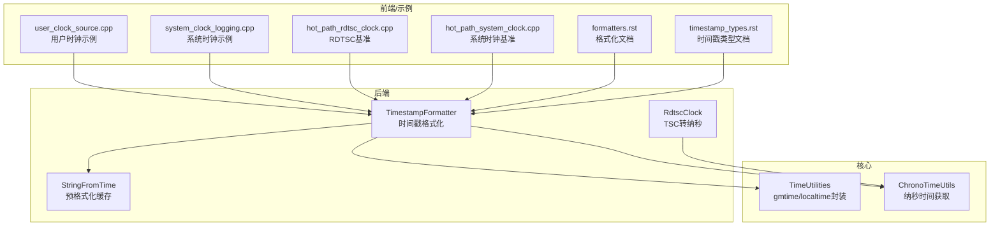
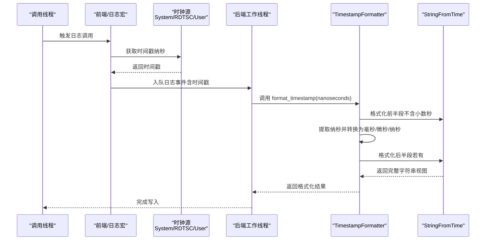
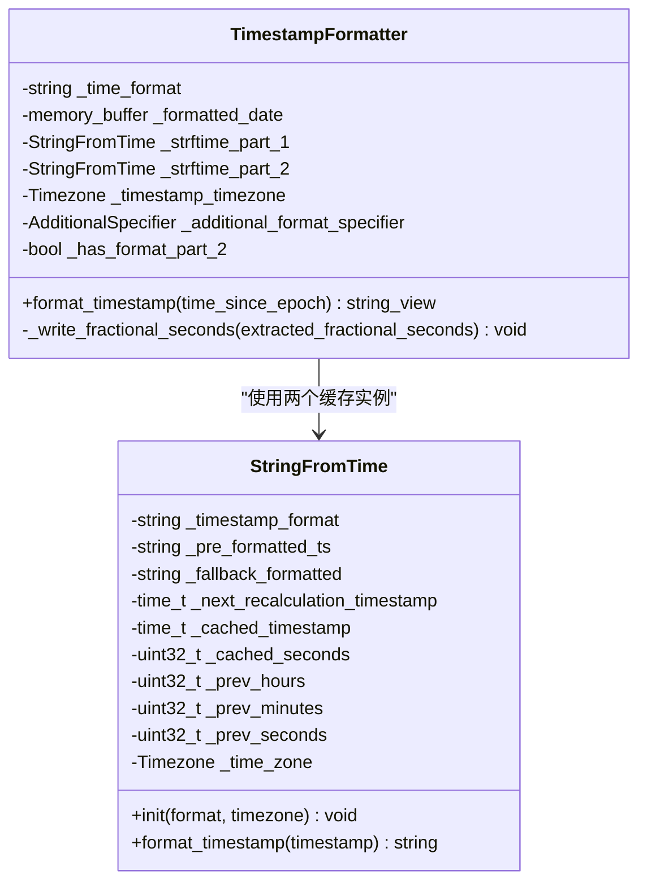
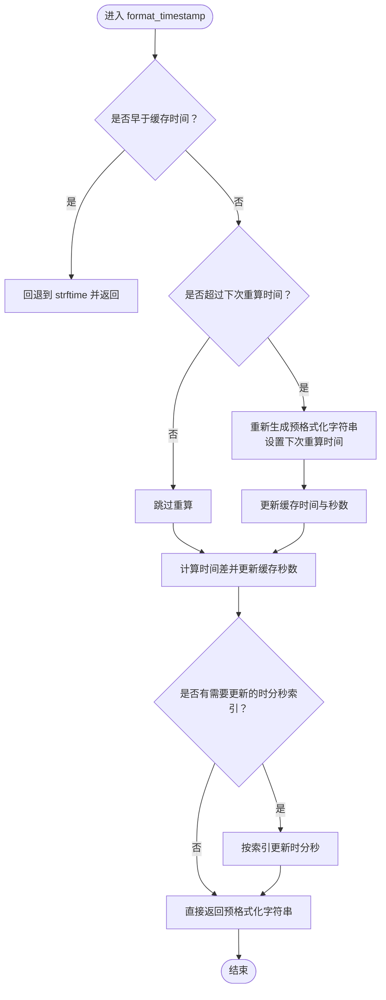
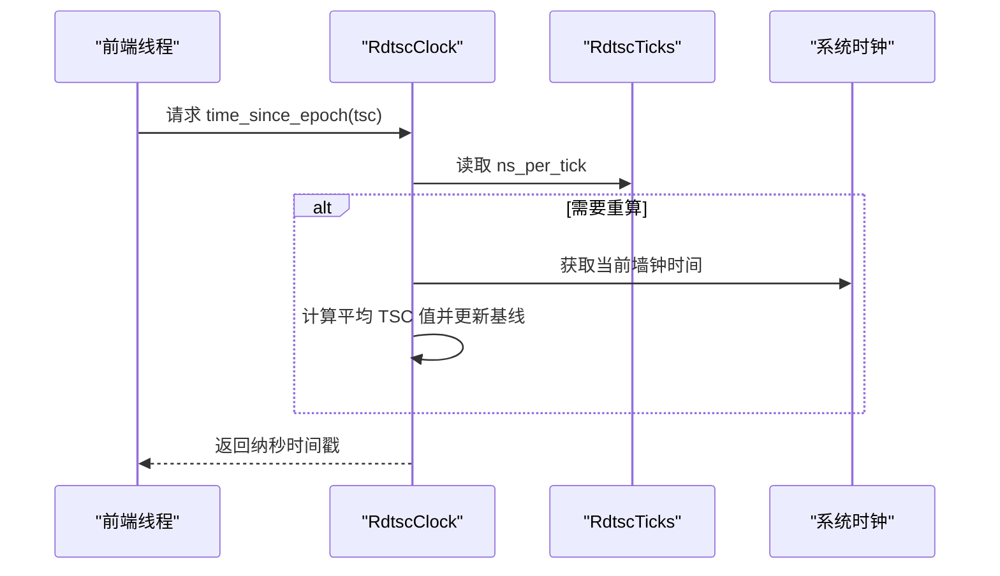
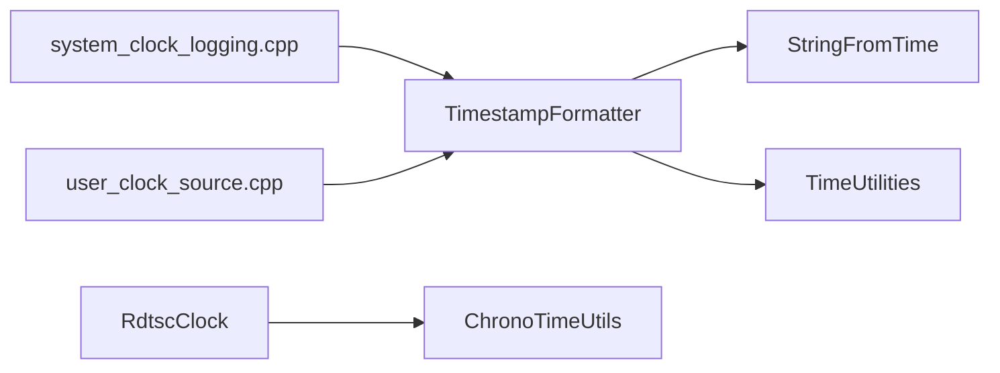

# 时间戳格式化

<cite>
**本文引用的文件**
- [TimestampFormatter.h](file://include/quill/backend/TimestampFormatter.h)
- [StringFromTime.h](file://include/quill/backend/StringFromTime.h)
- [RdtscClock.h](file://include/quill/backend/RdtscClock.h)
- [TimeUtilities.h](file://include/quill/core/TimeUtilities.h)
- [ChronoTimeUtils.h](file://include/quill/core/ChronoTimeUtils.h)
- [formatters.rst](file://docs/formatters.rst)
- [timestamp_types.rst](file://docs/timestamp_types.rst)
- [TimestampFormatterTest.cpp](file://test/unit_tests/TimestampFormatterTest.cpp)
- [StringFromTimeTest.cpp](file://test/unit_tests/StringFromTimeTest.cpp)
- [user_clock_source.cpp](file://examples/user_clock_source.cpp)
- [system_clock_logging.cpp](file://examples/system_clock_logging.cpp)
- [quill_hot_path_rdtsc_clock.cpp](file://benchmarks/hot_path_latency/quill_hot_path_rdtsc_clock.cpp)
- [quill_hot_path_system_clock.cpp](file://benchmarks/hot_path_latency/quill_hot_path_system_clock.cpp)
</cite>

## 目录
1. [简介](#简介)
2. [项目结构](#项目结构)
3. [核心组件](#核心组件)
4. [架构总览](#架构总览)
5. [详细组件分析](#详细组件分析)
6. [依赖关系分析](#依赖关系分析)
7. [性能考量](#性能考量)
8. [故障排查指南](#故障排查指南)
9. [结论](#结论)
10. [附录](#附录)

## 简介
本技术文档围绕 Quill 日志库中的时间戳格式化能力展开，重点介绍 TimestampFormatter 类的功能与配置项，涵盖以下主题：
- 时间戳精度控制：毫秒（%Qms）、微秒（%Qus）、纳秒（%Qns）
- 时区处理：本地时间（LocalTime）与 GMT（GmtTime）
- 时间戳来源选择：系统时钟（System）、RDTSC 时钟（TSC）、用户自定义时钟（User）
- 实际使用示例：如何自定义时间戳格式、处理时区转换
- 性能优化：如何降低格式化开销对日志热路径的影响

## 项目结构
与时间戳格式化直接相关的模块主要位于 backend 与 core 子目录中：
- backend/TimestampFormatter.h：负责将纳秒级时间戳格式化为字符串，支持额外的 %Qms/%Qus/%Qns 精度控制与分两段缓存的高效格式化
- backend/StringFromTime.h：基于 strftime 的预格式化缓存机制，按需更新 hh/mm/ss 部分，显著减少重复格式化成本
- backend/RdtscClock.h：将 TSC 计数转换为纳秒级时间戳，支持周期性同步与安全查询
- core/TimeUtilities.h：跨平台 gmtime/localtime 包装，保证线程安全与错误处理
- core/ChronoTimeUtils.h：通用的纳秒时间获取工具模板
- 文档与示例：docs/formatters.rst、docs/timestamp_types.rst、examples/*、benchmarks/*

**图表来源**
- [TimestampFormatter.h:38-214](file://include/quill/backend/TimestampFormatter.h#L38-L214)
- [StringFromTime.h:49-491](file://include/quill/backend/StringFromTime.h#L49-L491)
- [RdtscClock.h:36-265](file://include/quill/backend/RdtscClock.h#L36-L265)
- [TimeUtilities.h:24-106](file://include/quill/core/TimeUtilities.h#L24-L106)
- [ChronoTimeUtils.h:18-28](file://include/quill/core/ChronoTimeUtils.h#L18-L28)

**章节来源**
- [TimestampFormatter.h:38-214](file://include/quill/backend/TimestampFormatter.h#L38-L214)
- [StringFromTime.h:49-491](file://include/quill/backend/StringFromTime.h#L49-L491)
- [RdtscClock.h:36-265](file://include/quill/backend/RdtscClock.h#L36-L265)
- [TimeUtilities.h:24-106](file://include/quill/core/TimeUtilities.h#L24-L106)
- [ChronoTimeUtils.h:18-28](file://include/quill/core/ChronoTimeUtils.h#L18-L28)

## 核心组件
- TimestampFormatter：接收纳秒级时间戳，按给定格式输出字符串；当包含 %Qms/%Qus/%Qns 时，会将小数秒部分插入到两个预格式化片段之间，避免每次调用都进行完整格式化
- StringFromTime：将 strftime 的结果缓存为“预格式化字符串”，仅在 hh/mm/ss 变化或到达午夜/正午边界时更新对应位置，极大提升高频格式化场景的性能
- RdtscClock：将前端采集的 TSC 值转换为纳秒级时间戳，通过周期性同步校准，提供低开销的高分辨率时间源
- TimeUtilities/ChronoTimeUtils：提供跨平台的时间转换与纳秒时间获取工具，确保在多平台上一致的行为

**章节来源**
- [TimestampFormatter.h:38-214](file://include/quill/backend/TimestampFormatter.h#L38-L214)
- [StringFromTime.h:49-491](file://include/quill/backend/StringFromTime.h#L49-L491)
- [RdtscClock.h:36-265](file://include/quill/backend/RdtscClock.h#L36-L265)
- [TimeUtilities.h:24-106](file://include/quill/core/TimeUtilities.h#L24-L106)
- [ChronoTimeUtils.h:18-28](file://include/quill/core/ChronoTimeUtils.h#L18-L28)

## 架构总览
下图展示了从时间戳来源到最终格式化输出的关键流程，包括系统时钟、RDTSC 时钟与用户自定义时钟三种路径。

**图表来源**
- [TimestampFormatter.h:122-174](file://include/quill/backend/TimestampFormatter.h#L122-L174)
- [StringFromTime.h:73-207](file://include/quill/backend/StringFromTime.h#L73-L207)
- [RdtscClock.h:147-193](file://include/quill/backend/RdtscClock.h#L147-L193)
- [system_clock_logging.cpp:24-28](file://examples/system_clock_logging.cpp#L24-L28)
- [user_clock_source.cpp:64-69](file://examples/user_clock_source.cpp#L64-L69)

## 详细组件分析

### TimestampFormatter 组件
- 功能要点
  - 接收纳秒级时间戳，输出人类可读字符串
  - 支持额外的 %Qms（毫秒）、%Qus（微秒）、%Qns（纳秒）精度控制，且三者互斥
  - 将格式串拆分为两段（part1 和 part2），分别由 StringFromTime 缓存格式化，小数秒插入中间，避免重复格式化
  - 时区支持：LocalTime/GmtTime，构造函数会校验并抛出异常
- 关键实现细节
  - 在构造阶段扫描格式串，定位 %Qms/%Qus/%Qns 的首次出现位置，若存在则将格式串拆分为两段
  - format_timestamp 流程：先清空缓存，格式化 part1，再根据精度提取小数秒，填充相应长度的零，最后追加 part2（如存在）

**图表来源**
- [TimestampFormatter.h:38-214](file://include/quill/backend/TimestampFormatter.h#L38-L214)
- [StringFromTime.h:49-491](file://include/quill/backend/StringFromTime.h#L49-L491)

**章节来源**
- [TimestampFormatter.h:38-214](file://include/quill/backend/TimestampFormatter.h#L38-L214)
- [TimestampFormatterTest.cpp:12-181](file://test/unit_tests/TimestampFormatterTest.cpp#L12-L181)

### StringFromTime 组件
- 功能要点
  - 将格式串按时间修饰符拆分为初始片段，生成“预格式化字符串”
  - 仅在 hh/mm/ss 发生变化或到达午夜/正午边界时更新对应位置，其他部分保持不变
  - 对于 LocalTime 使用每刻钟（15 分钟）重算策略以应对夏令时切换
  - 对于 GmtTime 使用午夜/正午重算策略
  - 当传入时间早于缓存时间时回退到直接 strftime
- 关键实现细节
  - _populate_initial_parts：按 %H/%M/%S/%I/%k/%l/%s 拆分格式串
  - _populate_pre_formatted_string_and_cached_indexes：生成预格式化字符串并记录各时间字段索引
  - format_timestamp：计算差值并增量更新缓存，仅在必要时格式化

**图表来源**
- [StringFromTime.h:73-207](file://include/quill/backend/StringFromTime.h#L73-L207)
- [StringFromTime.h:255-318](file://include/quill/backend/StringFromTime.h#L255-L318)

**章节来源**
- [StringFromTime.h:49-491](file://include/quill/backend/StringFromTime.h#L49-L491)
- [StringFromTimeTest.cpp:12-408](file://test/unit_tests/StringFromTimeTest.cpp#L12-L408)

### RdtscClock 组件
- 功能要点
  - 将 TSC 计数值转换为纳秒级时间戳，支持安全查询与周期性同步
  - 通过多次观测与中位数估计计算 ns_per_tick，提高鲁棒性
  - 提供 resync 机制，当 TSC 与墙钟漂移过大时进行校准
- 关键实现细节
  - RdtscTicks：单例，计算并缓存 ns_per_tick
  - time_since_epoch：将 TSC 值转换为纳秒时间戳
  - time_since_epoch_safe：线程安全版本，不触发 resync
  - resync：尝试在指定窗口内完成同步，失败时扩大间隔

**图表来源**
- [RdtscClock.h:147-193](file://include/quill/backend/RdtscClock.h#L147-L193)
- [RdtscClock.h:58-113](file://include/quill/backend/RdtscClock.h#L58-L113)

**章节来源**
- [RdtscClock.h:36-265](file://include/quill/backend/RdtscClock.h#L36-L265)

### 时间戳来源与配置
- 系统时钟（System）
  - 前端直接获取 std::chrono::system_clock 的纳秒时间戳，后端无需额外初始化
  - 示例：[system_clock_logging.cpp:24-28](file://examples/system_clock_logging.cpp#L24-L28)
- RDTSC 时钟（TSC）
  - 前端仅记录 TSC 值，后端通过 RdtscClock 同步为墙钟时间
  - 示例：[quill_hot_path_rdtsc_clock.cpp:55-57](file://benchmarks/hot_path_latency/quill_hot_path_rdtsc_clock.cpp#L55-L57)
- 用户自定义时钟（User）
  - 通过继承 UserClockSource 提供自定义时间源（例如模拟器）
  - 示例：[user_clock_source.cpp:64-69](file://examples/user_clock_source.cpp#L64-L69)

**章节来源**
- [timestamp_types.rst:18-31](file://docs/timestamp_types.rst#L18-L31)
- [system_clock_logging.cpp:24-28](file://examples/system_clock_logging.cpp#L24-L28)
- [user_clock_source.cpp:23-47](file://examples/user_clock_source.cpp#L23-L47)
- [quill_hot_path_rdtsc_clock.cpp:55-57](file://benchmarks/hot_path_latency/quill_hot_path_rdtsc_clock.cpp#L55-L57)

## 依赖关系分析
- TimestampFormatter 依赖 StringFromTime 进行基础格式化，依赖 TimeUtilities 进行本地/UTC 转换
- RdtscClock 依赖 ChronoTimeUtils 获取纳秒时间戳，用于同步校准
- 前端示例通过 PatternFormatterOptions 指定时间戳格式与时区

**图表来源**
- [TimestampFormatter.h:9-22](file://include/quill/backend/TimestampFormatter.h#L9-L22)
- [StringFromTime.h:9-23](file://include/quill/backend/StringFromTime.h#L9-L23)
- [RdtscClock.h:10-12](file://include/quill/backend/RdtscClock.h#L10-L12)
- [ChronoTimeUtils.h:11-12](file://include/quill/core/ChronoTimeUtils.h#L11-L12)

**章节来源**
- [TimestampFormatter.h:9-22](file://include/quill/backend/TimestampFormatter.h#L9-L22)
- [StringFromTime.h:9-23](file://include/quill/backend/StringFromTime.h#L9-L23)
- [RdtscClock.h:10-12](file://include/quill/backend/RdtscClock.h#L10-L12)
- [ChronoTimeUtils.h:11-12](file://include/quill/core/ChronoTimeUtils.h#L11-L12)

## 性能考量
- 高频格式化优化
  - StringFromTime 采用“预格式化字符串 + 索引更新”的策略，仅在 hh/mm/ss 变化或达到午夜/正午边界时重算，显著降低重复格式化成本
  - TimestampFormatter 将格式串拆分为两段，小数秒插入中间，避免每次都执行完整格式化
- 时间戳来源选择
  - System：最准确但开销较高，适合对时间精度要求极高且可接受额外开销的场景
  - TSC：极低开销，适合高吞吐日志；注意可能因多核不同步导致极短时间内的顺序抖动
  - User：适合模拟或特殊需求，避免系统时钟抖动影响
- 基准测试参考
  - RDTSC 基准：[quill_hot_path_rdtsc_clock.cpp:55-57](file://benchmarks/hot_path_latency/quill_hot_path_rdtsc_clock.cpp#L55-L57)
  - System 基准：[quill_hot_path_system_clock.cpp:57-60](file://benchmarks/hot_path_latency/quill_hot_path_system_clock.cpp#L57-L60)

**章节来源**
- [StringFromTime.h:73-207](file://include/quill/backend/StringFromTime.h#L73-L207)
- [timestamp_types.rst:18-31](file://docs/timestamp_types.rst#L18-L31)
- [quill_hot_path_rdtsc_clock.cpp:55-57](file://benchmarks/hot_path_latency/quill_hot_path_rdtsc_clock.cpp#L55-L57)
- [quill_hot_path_system_clock.cpp:57-60](file://benchmarks/hot_path_latency/quill_hot_path_system_clock.cpp#L57-L60)

## 故障排查指南
- 格式串错误
  - %Qms/%Qus/%Qns 三者互斥，同时出现会抛出异常
  - 不支持的 strftime 修饰符（如 %X）会导致初始化失败
  - 参考测试用例：[TimestampFormatterTest.cpp:14-23](file://test/unit_tests/TimestampFormatterTest.cpp#L14-L23)
- 时区参数无效
  - 构造函数仅允许 LocalTime 或 GmtTime，否则抛出异常
  - 参考实现：[TimestampFormatter.h:54-56](file://include/quill/backend/TimestampFormatter.h#L54-L56)
- 回退到 strftime 的情况
  - 当传入时间早于缓存时间时，StringFromTime 会回退到直接调用 strftime
  - 参考测试用例：[StringFromTimeTest.cpp:77-106](file://test/unit_tests/StringFromTimeTest.cpp#L77-L106)
- 跨平台时间转换
  - 使用 TimeUtilities 的 gmtime_rs/localtime_rs 包装，统一错误处理
  - 参考实现：[TimeUtilities.h:31-78](file://include/quill/core/TimeUtilities.h#L31-L78)

**章节来源**
- [TimestampFormatterTest.cpp:14-23](file://test/unit_tests/TimestampFormatterTest.cpp#L14-L23)
- [TimestampFormatter.h:54-56](file://include/quill/backend/TimestampFormatter.h#L54-L56)
- [StringFromTimeTest.cpp:77-106](file://test/unit_tests/StringFromTimeTest.cpp#L77-L106)
- [TimeUtilities.h:31-78](file://include/quill/core/TimeUtilities.h#L31-L78)

## 结论
- TimestampFormatter 与 StringFromTime 协同实现了高效的纳秒级时间戳格式化，通过分段缓存与增量更新策略，大幅降低热路径上的格式化开销
- RdtscClock 提供了低延迟的时间戳来源，适合高吞吐场景；System 时钟则在精度与稳定性上更优
- 通过 PatternFormatterOptions 与示例代码，用户可以灵活定制时间戳格式、时区与精度，并结合基准测试评估不同方案的性能表现

## 附录
- 实战示例
  - 自定义时间戳格式与时区：[system_clock_logging.cpp:24-28](file://examples/system_clock_logging.cpp#L24-L28)
  - 用户自定义时钟：[user_clock_source.cpp:64-69](file://examples/user_clock_source.cpp#L64-L69)
- 文档参考
  - 格式化与时间戳配置：[formatters.rst:73-91](file://docs/formatters.rst#L73-L91)
  - 时间戳类型与来源：[timestamp_types.rst:18-31](file://docs/timestamp_types.rst#L18-L31)