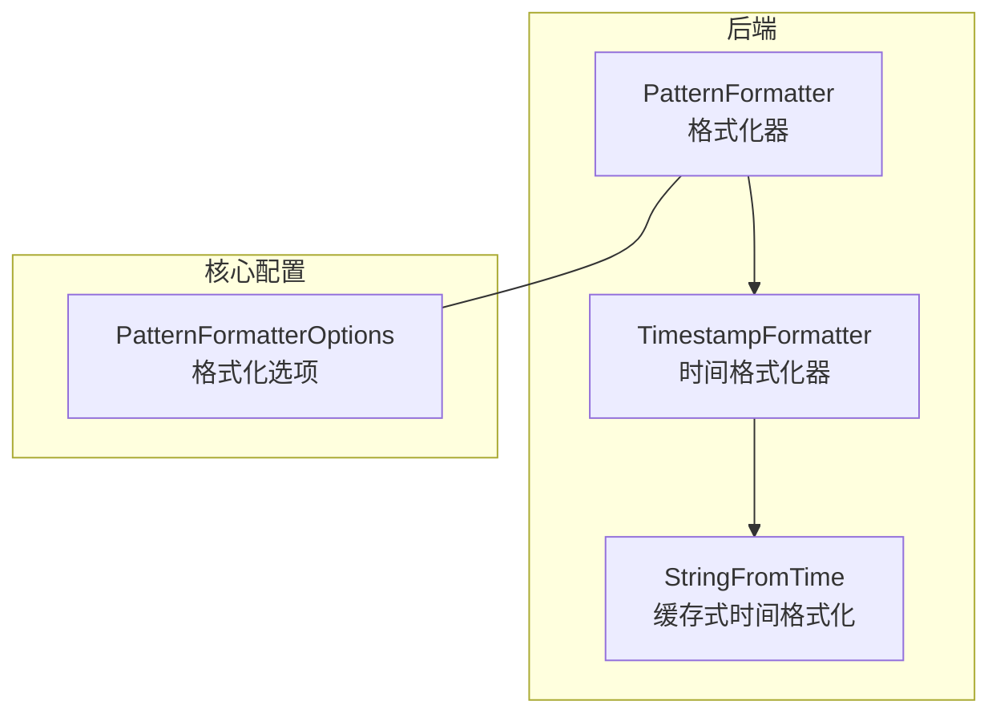
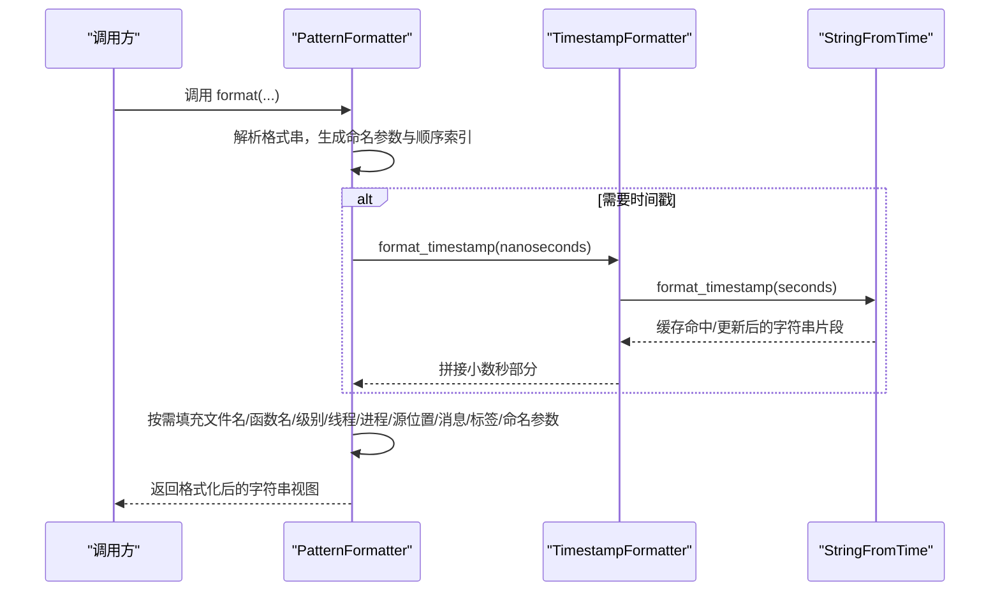
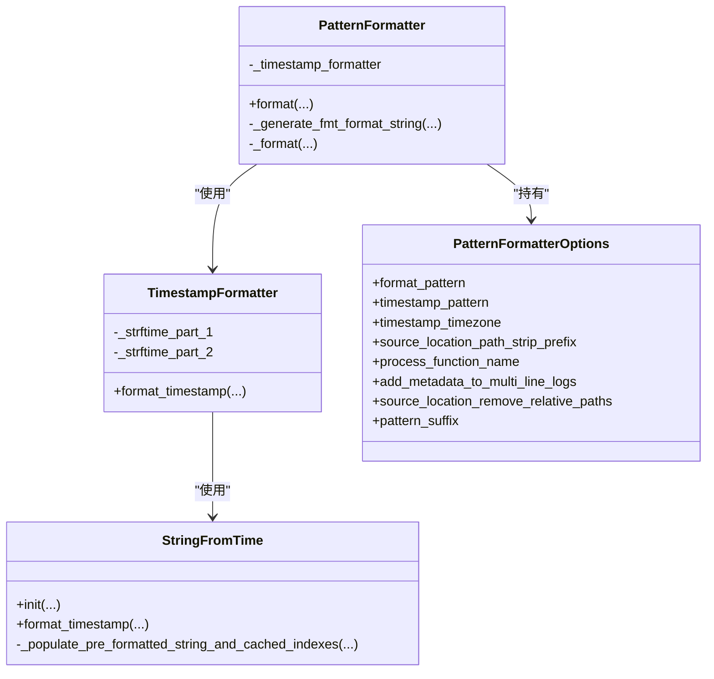

# 格式化模式详解

<cite>
**本文引用的文件**
- [PatternFormatter.h](file://include/quill/backend/PatternFormatter.h)
- [PatternFormatterOptions.h](file://include/quill/core/PatternFormatterOptions.h)
- [TimestampFormatter.h](file://include/quill/backend/TimestampFormatter.h)
- [StringFromTime.h](file://include/quill/backend/StringFromTime.h)
- [Attributes.h](file://include/quill/core/Attributes.h)
- [formatters.rst](file://docs/formatters.rst)
- [quill_docs_example_custom_format.cpp](file://docs/examples/quill_docs_example_custom_format.cpp)
- [console_logging.cpp](file://examples/console_logging.cpp)
- [file_logging.cpp](file://examples/file_logging.cpp)
- [PatternFormatterTest.cpp](file://test/unit_tests/PatternFormatterTest.cpp)
</cite>

## 目录
1. [简介](#简介)
2. [项目结构与定位](#项目结构与定位)
3. [核心组件总览](#核心组件总览)
4. [架构概览](#架构概览)
5. [详细组件解析](#详细组件解析)
6. [依赖关系分析](#依赖关系分析)
7. [性能考量与优化](#性能考量与优化)
8. [故障排查指南](#故障排查指南)
9. [结论](#结论)
10. [附录：常用示例与最佳实践](#附录常用示例与最佳实践)

## 简介
本指南系统性讲解 Quill 日志库中的“格式化模式”，覆盖以下内容：
- 可用的格式化属性（时间、文件名、函数名、日志级别、线程/进程信息、源码位置、消息体、标签、命名参数等）
- 占位符语法与自定义格式规范
- 控制台输出、文件记录、网络传输等典型场景的应用示例
- 性能优化策略（格式串预编译、缓存复用、零拷贝路径）
- 常见问题与排错建议

## 项目结构与定位
- 格式化核心位于后端模块，负责将日志元数据与消息体按用户指定的模式拼接为最终输出。
- 时间戳格式化由独立的时间格式化器负责，支持高精度小数秒与本地/GMT 时区切换。
- 配置选项集中于 PatternFormatterOptions，提供灵活的定制能力。

图表来源
- [PatternFormatter.h:33-96](file://include/quill/backend/PatternFormatter.h#L33-L96)
- [TimestampFormatter.h:38-120](file://include/quill/backend/TimestampFormatter.h#L38-L120)
- [StringFromTime.h:49-110](file://include/quill/backend/StringFromTime.h#L49-L110)
- [PatternFormatterOptions.h:23-41](file://include/quill/core/PatternFormatterOptions.h#L23-L41)

章节来源
- [PatternFormatter.h:33-96](file://include/quill/backend/PatternFormatter.h#L33-L96)
- [PatternFormatterOptions.h:23-41](file://include/quill/core/PatternFormatterOptions.h#L23-L41)

## 核心组件总览
- PatternFormatter：解析用户提供的格式串，构建内部“命名参数数组”与“顺序索引表”，在热路径中按需填充各属性，最终通过 fmt 库完成拼接。
- TimestampFormatter：将纳秒级时间戳转换为带小数秒的时间字符串，支持 %Qms/%Qus/%Qns 三种额外精度。
- StringFromTime：对 strftime 风格的模板进行分段缓存，在秒级变化时仅更新受影响片段，避免重复调用系统函数。
- PatternFormatterOptions：封装格式串、时间戳模板、时区、源路径前缀处理、函数名处理回调、多行消息处理策略、后缀字符等。

章节来源
- [PatternFormatter.h:33-608](file://include/quill/backend/PatternFormatter.h#L33-L608)
- [TimestampFormatter.h:38-218](file://include/quill/backend/TimestampFormatter.h#L38-L218)
- [StringFromTime.h:49-494](file://include/quill/backend/StringFromTime.h#L49-L494)
- [PatternFormatterOptions.h:23-170](file://include/quill/core/PatternFormatterOptions.h#L23-L170)

## 架构概览
下图展示一次格式化调用的时序流程，从 PatternFormatter 接收元数据到生成最终字符串视图。

图表来源
- [PatternFormatter.h:97-177](file://include/quill/backend/PatternFormatter.h#L97-L177)
- [PatternFormatter.h:469-588](file://include/quill/backend/PatternFormatter.h#L469-L588)
- [TimestampFormatter.h:122-174](file://include/quill/backend/TimestampFormatter.h#L122-L174)
- [StringFromTime.h:73-207](file://include/quill/backend/StringFromTime.h#L73-L207)

## 详细组件解析

### 属性清单与用法
- time：人类可读时间戳（受时间戳模板与时区影响）
- file_name：仅文件名（不含路径）
- full_path：完整源文件路径
- caller_function：调用日志宏的函数名；启用详细函数名宏时可获得完整签名，可通过回调进一步处理
- log_level：日志级别全称
- log_level_short_code：日志级别简写
- line_number：源码行号
- logger：日志器名称
- message：用户日志消息
- thread_id：线程 ID
- thread_name：线程名称（需在日志前设置）
- process_id：进程 ID
- source_location：完整源路径+行号（可配置前缀剥离与相对路径去除）
- short_source_location：短源位置（文件名:行号）
- tags：标签（当使用标签宏时附加）
- named_args：命名参数键值对（当消息携带命名参数时显示）

章节来源
- [PatternFormatterOptions.h:42-71](file://include/quill/core/PatternFormatterOptions.h#L42-L71)
- [PatternFormatter.h:48-67](file://include/quill/backend/PatternFormatter.h#L48-L67)
- [PatternFormatter.h:475-582](file://include/quill/backend/PatternFormatter.h#L475-L582)

### 占位符语法与自定义格式
- 语法：以 %(attr) 表示一个占位符，attr 为上述属性名之一
- 自定义宽度/对齐：可在冒号后添加 fmt 风格格式说明，例如 %(short_source_location:<28)
- 多行消息：默认为每行追加元数据；可通过选项关闭续行元数据或自定义后缀
- 后缀控制：可设置为换行、无后缀或自定义字符；对二进制数据有特殊处理逻辑

章节来源
- [PatternFormatter.h:355-466](file://include/quill/backend/PatternFormatter.h#L355-L466)
- [PatternFormatterOptions.h:140-154](file://include/quill/core/PatternFormatterOptions.h#L140-L154)
- [PatternFormatterTest.cpp:847-962](file://test/unit_tests/PatternFormatterTest.cpp#L847-L962)

### 时间戳与精度
- 支持 strftime 风格模板，并扩展了 %Qms/%Qus/%Qns 三类小数秒精度
- 当同时出现多个额外精度时会抛出异常
- 采用分段缓存策略，仅在秒/时/分变化时更新对应片段，显著降低系统调用开销

章节来源
- [TimestampFormatter.h:29-93](file://include/quill/backend/TimestampFormatter.h#L29-L93)
- [TimestampFormatter.h:122-174](file://include/quill/backend/TimestampFormatter.h#L122-L174)
- [StringFromTime.h:28-110](file://include/quill/backend/StringFromTime.h#L28-L110)
- [StringFromTime.h:154-204](file://include/quill/backend/StringFromTime.h#L154-L204)

### 源路径与函数名处理
- source_location_path_strip_prefix：剥离公共前缀，便于缩短路径显示
- source_location_remove_relative_paths：移除相对路径段（如 ../）
- process_function_name：在启用详细函数名宏时，允许自定义函数签名的提取/简化

章节来源
- [PatternFormatterOptions.h:83-112](file://include/quill/core/PatternFormatterOptions.h#L83-L112)
- [PatternFormatter.h:184-231](file://include/quill/backend/PatternFormatter.h#L184-L231)
- [PatternFormatterTest.cpp:497-556](file://test/unit_tests/PatternFormatterTest.cpp#L497-L556)
- [PatternFormatterTest.cpp:558-606](file://test/unit_tests/PatternFormatterTest.cpp#L558-L606)

### 多行消息与后缀行为
- add_metadata_to_multi_line_logs：是否为多行消息的每一行都追加元数据
- pattern_suffix：默认换行，也可设为无后缀或自定义字符；对二进制数据保留尾部换行的行为有明确测试覆盖

章节来源
- [PatternFormatterOptions.h:121-129](file://include/quill/core/PatternFormatterOptions.h#L121-L129)
- [PatternFormatterOptions.h:140-154](file://include/quill/core/PatternFormatterOptions.h#L140-L154)
- [PatternFormatterTest.cpp:915-1070](file://test/unit_tests/PatternFormatterTest.cpp#L915-L1070)
- [PatternFormatterTest.cpp:1072-1190](file://test/unit_tests/PatternFormatterTest.cpp#L1072-L1190)

### 类关系图

图表来源
- [PatternFormatter.h:33-96](file://include/quill/backend/PatternFormatter.h#L33-L96)
- [TimestampFormatter.h:38-120](file://include/quill/backend/TimestampFormatter.h#L38-L120)
- [StringFromTime.h:49-110](file://include/quill/backend/StringFromTime.h#L49-L110)
- [PatternFormatterOptions.h:23-41](file://include/quill/core/PatternFormatterOptions.h#L23-L41)

## 依赖关系分析
- PatternFormatter 依赖 TimestampFormatter 进行时间戳格式化；TimestampFormatter 内部使用 StringFromTime 实现缓存式分段更新。
- PatternFormatterOptions 作为配置入口，贯穿 PatternFormatter 的初始化与运行期行为。
- 属性枚举与命名参数映射在编译期保证一致性，避免运行期错误。

图表来源
- [PatternFormatter.h:79-84](file://include/quill/backend/PatternFormatter.h#L79-L84)
- [TimestampFormatter.h:51-101](file://include/quill/backend/TimestampFormatter.h#L51-L101)
- [StringFromTime.h:53-70](file://include/quill/backend/StringFromTime.h#L53-L70)

章节来源
- [PatternFormatter.h:234-261](file://include/quill/backend/PatternFormatter.h#L234-L261)
- [PatternFormatter.h:355-466](file://include/quill/backend/PatternFormatter.h#L355-L466)

## 性能考量与优化
- 格式串预编译与懒求值
  - 在构造时解析格式串，生成命名参数数组与顺序索引，避免每次调用都做字符串扫描
  - 使用位集标记哪些属性出现在模式中，仅填充已使用的字段
- 时间戳缓存
  - StringFromTime 将模板按时间修饰符分段缓存，仅在秒/分/时变化时更新对应片段
  - 本地时区按 15 分钟重算，GMT 时区按正午/午夜重算，减少系统调用
- 输出缓冲复用
  - 使用内存缓冲区避免频繁分配，减少碎片与拷贝
- 零拷贝路径
  - 对空格式串直接返回空视图，避免不必要拼接
  - 对二进制消息在特定后缀策略下保留尾部换行，避免额外复制

章节来源
- [PatternFormatter.h:234-261](file://include/quill/backend/PatternFormatter.h#L234-L261)
- [PatternFormatter.h:469-588](file://include/quill/backend/PatternFormatter.h#L469-L588)
- [StringFromTime.h:73-127](file://include/quill/backend/StringFromTime.h#L73-L127)
- [PatternFormatterTest.cpp:423-454](file://test/unit_tests/PatternFormatterTest.cpp#L423-L454)
- [PatternFormatterTest.cpp:1072-1119](file://test/unit_tests/PatternFormatterTest.cpp#L1072-L1119)

## 故障排查指南
- 无效格式串
  - 缺少闭合括号或使用不存在的属性名会触发异常
- 多个额外精度冲突
  - 同时使用 %Qms/%Qus/%Qns 会抛出异常
- 多行消息与后缀
  - 使用换行后缀时，消息尾部换行会被自动剔除并由模式统一追加
  - 使用无后缀或自定义后缀时，消息尾部换行将被保留
- 二进制数据
  - 使用无后缀时，确保消息体包含的换行等字节被正确保留

章节来源
- [PatternFormatter.h:387-447](file://include/quill/backend/PatternFormatter.h#L387-L447)
- [TimestampFormatter.h:74-88](file://include/quill/backend/TimestampFormatter.h#L74-L88)
- [PatternFormatterTest.cpp:327-345](file://test/unit_tests/PatternFormatterTest.cpp#L327-L345)
- [PatternFormatterTest.cpp:915-1070](file://test/unit_tests/PatternFormatterTest.cpp#L915-L1070)
- [PatternFormatterTest.cpp:1072-1119](file://test/unit_tests/PatternFormatterTest.cpp#L1072-L1119)

## 结论
Quill 的格式化系统以“声明式模式 + 编译期/运行期优化”为核心，既保证了灵活性（丰富的属性与自定义格式），又兼顾了高性能（缓存、懒求值、零拷贝）。通过合理配置 PatternFormatterOptions，可在控制台、文件、网络等多种场景下获得一致且高效的日志输出体验。

## 附录：常用示例与最佳实践

### 示例一：控制台输出（自定义格式）
- 使用 PatternFormatterOptions 指定格式串、时间戳模板与时区
- 适用于开发调试与交互式终端输出

参考示例
- [quill_docs_example_custom_format.cpp:11-17](file://docs/examples/quill_docs_example_custom_format.cpp#L11-L17)

章节来源
- [quill_docs_example_custom_format.cpp:11-17](file://docs/examples/quill_docs_example_custom_format.cpp#L11-L17)

### 示例二：文件记录（含源路径前缀剥离）
- 在文件输出场景中，通过剥离公共路径前缀缩短路径显示
- 可选开启相对路径去除，提升可读性

参考示例
- [file_logging.cpp:47-55](file://examples/file_logging.cpp#L47-L55)

章节来源
- [file_logging.cpp:47-55](file://examples/file_logging.cpp#L47-L55)

### 示例三：多行消息与后缀策略
- 默认每行追加元数据，适合长文本分段阅读
- 若追求紧凑输出，可关闭续行元数据或使用无后缀

参考测试
- [PatternFormatterTest.cpp:964-1070](file://test/unit_tests/PatternFormatterTest.cpp#L964-L1070)

章节来源
- [PatternFormatterTest.cpp:964-1070](file://test/unit_tests/PatternFormatterTest.cpp#L964-L1070)

### 最佳实践建议
- 优先使用短属性名组合（如 %(time) %(thread_id) %(short_source_location) %(log_level) %(logger) %(message)）以减少宽度对齐开销
- 在高频日志场景中，尽量避免在格式串中使用过宽的对齐或过多的文本常量
- 对二进制数据输出，建议使用无后缀或自定义后缀，避免换行误判
- 在需要跨时区对比时，固定使用 GMT 并显式写出日期，便于审计与检索