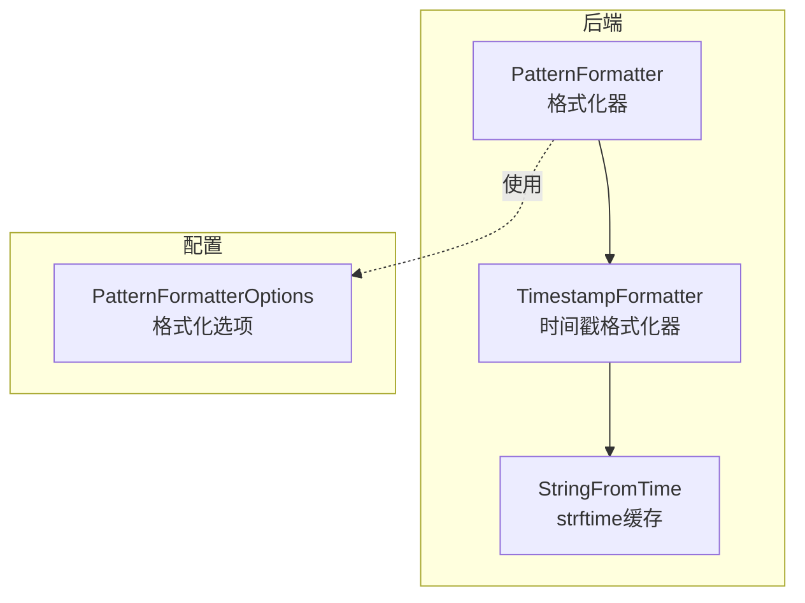
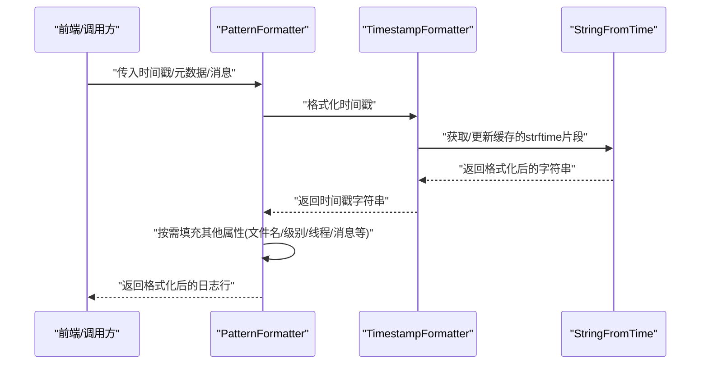
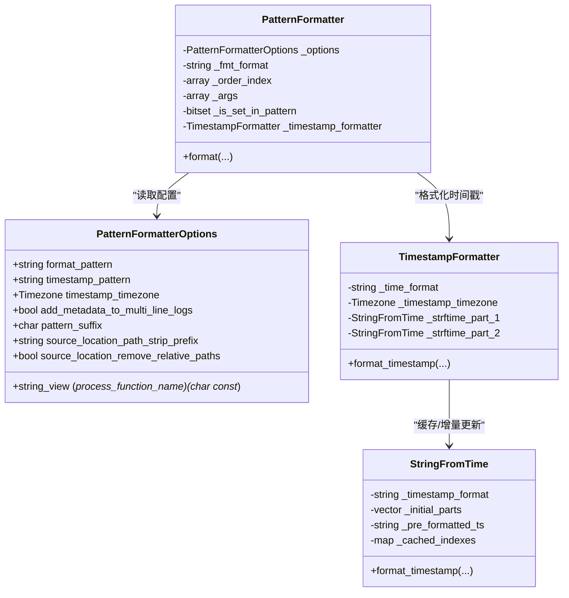

# 格式化系统

<cite>
**本文引用的文件**
- [PatternFormatter.h](file://include/quill/backend/PatternFormatter.h)
- [PatternFormatterOptions.h](file://include/quill/core/PatternFormatterOptions.h)
- [TimestampFormatter.h](file://include/quill/backend/TimestampFormatter.h)
- [StringFromTime.h](file://include/quill/backend/StringFromTime.h)
- [PatternFormatterTest.cpp](file://test/unit_tests/PatternFormatterTest.cpp)
- [TimestampFormatterTest.cpp](file://test/unit_tests/TimestampFormatterTest.cpp)
- [formatters.rst](file://docs/formatters.rst)
- [json_console_logging.cpp](file://examples/json_console_logging.cpp)
- [console_logging.cpp](file://examples/console_logging.cpp)
- [custom_console_colours.cpp](file://examples/custom_console_colours.cpp)
</cite>

## 目录
1. [简介](#简介)
2. [项目结构](#项目结构)
3. [核心组件](#核心组件)
4. [架构总览](#架构总览)
5. [详细组件分析](#详细组件分析)
6. [依赖关系分析](#依赖关系分析)
7. [性能考量](#性能考量)
8. [故障排查指南](#故障排查指南)
9. [结论](#结论)
10. [附录](#附录)

## 简介
本文件面向希望深入掌握 Quill 日志格式化系统的开发者，系统性阐述 PatternFormatter 的工作原理、配置项与使用方式，并结合时间戳格式化、日志级别格式化、自定义格式模式、颜色配置、字段对齐与特殊字符处理等主题，提供从概念到实践的完整说明。同时给出控制台输出、文件记录与 JSON 格式的典型场景示例，以及性能优化与缓存机制解析，帮助你构建高效且美观的日志输出。

## 项目结构
围绕格式化系统的关键代码位于以下模块：
- 后端格式化：PatternFormatter 负责将日志元数据与消息按模板格式化；TimestampFormatter 负责时间戳格式化；StringFromTime 提供基于 strftime 的高效缓存实现。
- 配置选项：PatternFormatterOptions 定义了格式模板、时间戳模板、时区、多行日志处理策略、路径前缀剥离、函数名处理回调、后缀字符等。
- 示例与测试：通过单元测试与示例程序验证格式化行为、时间戳精度、路径处理、函数名处理与多行输出策略。

图表来源
- [PatternFormatter.h:33-96](file://include/quill/backend/PatternFormatter.h#L33-L96)
- [TimestampFormatter.h:38-120](file://include/quill/backend/TimestampFormatter.h#L38-L120)
- [StringFromTime.h:49-108](file://include/quill/backend/StringFromTime.h#L49-L108)
- [PatternFormatterOptions.h:23-40](file://include/quill/core/PatternFormatterOptions.h#L23-L40)

章节来源
- [PatternFormatter.h:33-96](file://include/quill/backend/PatternFormatter.h#L33-L96)
- [PatternFormatterOptions.h:23-40](file://include/quill/core/PatternFormatterOptions.h#L23-L40)
- [TimestampFormatter.h:38-120](file://include/quill/backend/TimestampFormatter.h#L38-L120)
- [StringFromTime.h:49-108](file://include/quill/backend/StringFromTime.h#L49-L108)

## 核心组件
- PatternFormatter
  - 职责：解析格式模板，按需懒加载各属性值，调用 fmt 库进行最终拼接；支持多行消息的元数据重复添加策略；支持命名参数与标签字段的附加输出。
  - 关键点：模板中以 %(attr) 表示占位符，支持在占位符内嵌入 fmt 对齐/宽度等格式说明；内部维护命名参数顺序索引与“是否在模板中出现”的位图，用于惰性赋值。
- PatternFormatterOptions
  - 职责：集中管理格式模板、时间戳模板、时区、多行日志策略、路径前缀剥离、函数名处理回调、后缀字符等。
  - 关键点：默认模板包含时间、线程 ID、短源位置、日志级别、日志器名称与消息；时间戳模板默认包含纳秒精度。
- TimestampFormatter
  - 职责：将纳秒级时间戳转换为人类可读字符串，支持 %Qms/%Qus/%Qns 三种额外的分数秒精度说明符；内部拆分模板为两段并缓存 strftime 结果，仅更新变化部分。
- StringFromTime
  - 职责：将 strftime 模板拆分为若干片段，预先生成缓存字符串，并在时间变化时只更新受影响片段，避免重复调用 strftime。

章节来源
- [PatternFormatter.h:97-177](file://include/quill/backend/PatternFormatter.h#L97-L177)
- [PatternFormatterOptions.h:27-147](file://include/quill/core/PatternFormatterOptions.h#L27-L147)
- [TimestampFormatter.h:122-174](file://include/quill/backend/TimestampFormatter.h#L122-L174)
- [StringFromTime.h:73-207](file://include/quill/backend/StringFromTime.h#L73-L207)

## 架构总览
下图展示了从日志事件到最终格式化输出的端到端流程，强调 PatternFormatter 如何与 TimestampFormatter 和 StringFromTime 协作，以及如何根据 PatternFormatterOptions 进行定制。

图表来源
- [PatternFormatter.h:469-588](file://include/quill/backend/PatternFormatter.h#L469-L588)
- [TimestampFormatter.h:122-174](file://include/quill/backend/TimestampFormatter.h#L122-L174)
- [StringFromTime.h:73-207](file://include/quill/backend/StringFromTime.h#L73-L207)

## 详细组件分析

### PatternFormatter 工作原理与配置
- 模板解析与惰性赋值
  - 将模板中的 %(attr) 替换为 {}，并记录命名参数顺序索引；仅当某属性出现在模板中时才为其赋值，减少不必要的计算。
  - 支持在占位符内嵌入 fmt 格式说明（如 :<12），这些说明符会被保留并传递给底层格式化库。
- 多行消息处理
  - 当 add_metadata_to_multi_line_logs 为 true 且未使用命名参数时，会逐行追加元数据；否则仅对首行追加元数据。
  - 若 pattern_suffix 为换行符且消息末尾已有换行，会自动去除末尾换行以避免重复。
- 属性集与路径处理
  - 支持多种属性：时间、文件名、调用函数、日志级别、行号、日志器、全路径、线程 ID/名称、进程 ID、源位置、短源位置、消息、标签、命名参数等。
  - 对于 source_location，可配置前缀剥离与相对路径移除，便于在容器或跨平台环境下保持路径简洁。
- 命名参数与标签
  - 当存在命名参数时，会将键值对拼接为“key: value[, key: value]...”形式附加到消息尾部；标签为空时输出空字符串，不产生额外分隔符。

章节来源
- [PatternFormatter.h:234-261](file://include/quill/backend/PatternFormatter.h#L234-L261)
- [PatternFormatter.h:355-466](file://include/quill/backend/PatternFormatter.h#L355-L466)
- [PatternFormatter.h:469-588](file://include/quill/backend/PatternFormatter.h#L469-L588)
- [PatternFormatter.h:184-231](file://include/quill/backend/PatternFormatter.h#L184-L231)
- [PatternFormatterOptions.h:84-138](file://include/quill/core/PatternFormatterOptions.h#L84-L138)

### 时间戳格式化与精度
- 时间戳模板
  - 采用与 strftime 兼容的格式字符串，并扩展 %Qms/%Qus/%Qns 三种分数秒精度说明符；三者互斥，仅允许其一。
  - 内部将模板拆分为两段（含/不含分数秒说明符的部分），分别缓存 strftime 片段，仅在分数秒部分插入数值。
- 缓存与增量更新
  - StringFromTime 将模板拆分为片段，预先生成缓存字符串；当时间变化时，仅更新受影响的时间组件（小时/分钟/秒）对应的片段，避免重复调用 strftime。
  - 本地时间按 15 分钟边界刷新，GMT 时间按正午/午夜刷新，确保夏令时与格式兼容性。
- 精度示例
  - 毫秒：使用 %Qms；微秒：使用 %Qus；纳秒：使用 %Qns；无分数秒：直接使用标准 strftime 格式。

章节来源
- [TimestampFormatter.h:51-119](file://include/quill/backend/TimestampFormatter.h#L51-L119)
- [TimestampFormatter.h:122-174](file://include/quill/backend/TimestampFormatter.h#L122-L174)
- [StringFromTime.h:53-108](file://include/quill/backend/StringFromTime.h#L53-L108)
- [StringFromTime.h:255-318](file://include/quill/backend/StringFromTime.h#L255-L318)
- [TimestampFormatterTest.cpp:12-23](file://test/unit_tests/TimestampFormatterTest.cpp#L12-L23)
- [TimestampFormatterTest.cpp:55-92](file://test/unit_tests/TimestampFormatterTest.cpp#L55-L92)
- [TimestampFormatterTest.cpp:95-132](file://test/unit_tests/TimestampFormatterTest.cpp#L95-L132)
- [TimestampFormatterTest.cpp:135-181](file://test/unit_tests/TimestampFormatterTest.cpp#L135-L181)

### 日志级别格式化与自定义模式
- 日志级别描述与简码
  - 支持完整描述与简码两种形式，便于在不同场景下选择合适粒度。
- 自定义格式模式
  - 可通过 PatternFormatterOptions 的 format_pattern 自由组合属性，例如将时间、线程 ID、短源位置、日志级别、日志器与消息按任意顺序排列，并配合对齐/宽度等 fmt 格式说明。
- 文档与示例
  - 官方文档列出了所有可用属性及其含义；示例程序展示了控制台与 JSON 输出的典型配置。

章节来源
- [PatternFormatterOptions.h:47-70](file://include/quill/core/PatternFormatterOptions.h#L47-L70)
- [formatters.rst:17-71](file://docs/formatters.rst#L17-L71)
- [console_logging.cpp:20-72](file://examples/console_logging.cpp#L20-L72)
- [json_console_logging.cpp:9-25](file://examples/json_console_logging.cpp#L9-L25)

### 颜色配置、字段对齐与特殊字符处理
- 控制台颜色
  - 通过 ConsoleSink 的颜色配置为不同日志级别分配颜色，可在创建 ConsoleSink 时覆盖默认配色方案。
- 字段对齐与宽度
  - 在模板中使用 fmt 的对齐/宽度说明（如 :<12），可实现右/左对齐与最小宽度填充。
- 特殊字符处理
  - 模板后缀可通过 pattern_suffix 控制；当设置为 NO_SUFFIX 时可避免追加换行等字符。
  - 对于多行消息，若末尾已含换行符且使用换行后缀，会自动去除末尾换行以避免重复。

章节来源
- [PatternFormatterOptions.h:140-153](file://include/quill/core/PatternFormatterOptions.h#L140-L153)
- [PatternFormatter.h:165-174](file://include/quill/backend/PatternFormatter.h#L165-L174)
- [custom_console_colours.cpp:20-32](file://examples/custom_console_colours.cpp#L20-L32)

### 格式化示例（控制台、文件、JSON）
- 控制台输出
  - 创建 ConsoleSink 并设置 PatternFormatterOptions，即可输出带时间、线程、源位置、级别与消息的文本行。
- 文件记录
  - 使用 FileSink 或 JsonFileSink 等，结合 PatternFormatterOptions 可实现结构化或非结构化日志写入。
- JSON 格式
  - 当仅输出 JSON 时，建议将 format_pattern 设为空字符串以跳过非必要格式化；仍可使用时间戳模板与时区配置。
- 示例参考
  - 控制台与 JSON 示例展示了基本用法与限频宏的使用。

章节来源
- [console_logging.cpp:20-72](file://examples/console_logging.cpp#L20-L72)
- [json_console_logging.cpp:9-53](file://examples/json_console_logging.cpp#L9-L53)

### 错误处理与边界条件
- 无效模板
  - 缺少闭合括号或使用不存在的属性名会导致抛出异常。
- 分数秒精度互斥
  - 同一模板中 %Qms/%Qus/%Qns 三者不可同时出现。
- 多行消息与命名参数
  - 当使用命名参数时，多行元数据策略将被忽略，以避免重复元数据导致的歧义。

章节来源
- [PatternFormatter.h:387-447](file://include/quill/backend/PatternFormatter.h#L387-L447)
- [TimestampFormatter.h:75-92](file://include/quill/backend/TimestampFormatter.h#L75-L92)
- [PatternFormatterTest.cpp:328-344](file://test/unit_tests/PatternFormatterTest.cpp#L328-L344)

## 依赖关系分析
- PatternFormatter 依赖 PatternFormatterOptions 获取模板与策略；内部委托 TimestampFormatter 完成时间戳格式化；TimestampFormatter 再委托 StringFromTime 执行高效的 strftime 缓存与增量更新。
- 惰性赋值与位图
  - 通过位图标记属性是否出现在模板中，避免对未使用的属性进行赋值，降低开销。

图表来源
- [PatternFormatter.h:590-606](file://include/quill/backend/PatternFormatter.h#L590-L606)
- [PatternFormatterOptions.h:23-167](file://include/quill/core/PatternFormatterOptions.h#L23-L167)
- [TimestampFormatter.h:38-214](file://include/quill/backend/TimestampFormatter.h#L38-L214)
- [StringFromTime.h:49-491](file://include/quill/backend/StringFromTime.h#L49-L491)

章节来源
- [PatternFormatter.h:590-606](file://include/quill/backend/PatternFormatter.h#L590-L606)
- [PatternFormatterOptions.h:23-167](file://include/quill/core/PatternFormatterOptions.h#L23-L167)
- [TimestampFormatter.h:38-214](file://include/quill/backend/TimestampFormatter.h#L38-L214)
- [StringFromTime.h:49-491](file://include/quill/backend/StringFromTime.h#L49-L491)

## 性能考量
- 惰性赋值与按需格式化
  - 仅对模板中出现的属性进行赋值，避免对未使用字段的计算与内存拷贝。
- 缓存与增量更新
  - StringFromTime 将 strftime 拆分为片段并缓存，仅在时间变化时更新受影响片段；TimestampFormatter 将模板拆分为两段，先格式化整秒部分，再插入分数秒，减少重复计算。
- 内存复用
  - PatternFormatter 使用类成员缓冲区存储每次格式化结果，避免频繁分配与释放。
- 多行消息优化
  - 在不使用命名参数时，逐行追加元数据；若消息末尾已有换行且使用换行后缀，会自动去除末尾换行，减少冗余字符。

章节来源
- [PatternFormatter.h:469-588](file://include/quill/backend/PatternFormatter.h#L469-L588)
- [StringFromTime.h:73-207](file://include/quill/backend/StringFromTime.h#L73-L207)
- [TimestampFormatter.h:122-174](file://include/quill/backend/TimestampFormatter.h#L122-L174)

## 故障排查指南
- 模板错误
  - 症状：构造 PatternFormatter 抛出异常。
  - 排查：检查模板中是否缺少闭合括号或使用了不存在的属性名；确认同一模板中 %Qms/%Qus/%Qns 三者仅使用其一。
- 多行消息与命名参数冲突
  - 症状：多行消息未按预期重复元数据。
  - 排查：当使用命名参数时，多行元数据策略将被忽略；如需保留元数据，请避免使用命名参数或自行拼接。
- 路径显示不符合预期
  - 症状：源路径包含冗余或相对路径未清理。
  - 排查：检查 source_location_path_strip_prefix 是否正确设置；启用 source_location_remove_relative_paths 以移除相对路径段。
- 时间戳精度问题
  - 症状：时间戳未包含期望的分数秒。
  - 排查：确认时间戳模板中仅包含一种分数秒说明符；检查时区设置是否符合预期。

章节来源
- [PatternFormatterTest.cpp:328-344](file://test/unit_tests/PatternFormatterTest.cpp#L328-L344)
- [PatternFormatterTest.cpp:497-556](file://test/unit_tests/PatternFormatterTest.cpp#L497-L556)
- [TimestampFormatterTest.cpp:12-23](file://test/unit_tests/TimestampFormatterTest.cpp#L12-L23)

## 结论
Quill 的格式化系统通过 PatternFormatter 与 TimestampFormatter 的协同，结合 StringFromTime 的高效缓存机制，在保证灵活性的同时兼顾性能。PatternFormatterOptions 提供了从模板、时区、路径处理到函数名处理的全面配置能力；示例与测试覆盖了控制台、文件与 JSON 等常见场景。遵循本文的配置与优化建议，可轻松实现既美观又高效的日志输出。

## 附录
- 常用属性速览
  - time、file_name、full_path、caller_function、log_level、log_level_short_code、line_number、logger、message、thread_id、thread_name、process_id、source_location、short_source_location、tags、named_args
- 时间戳分数秒说明符
  - %Qms（毫秒）、%Qus（微秒）、%Qns（纳秒）

章节来源
- [PatternFormatterOptions.h:47-70](file://include/quill/core/PatternFormatterOptions.h#L47-L70)
- [formatters.rst:82-88](file://docs/formatters.rst#L82-L88)