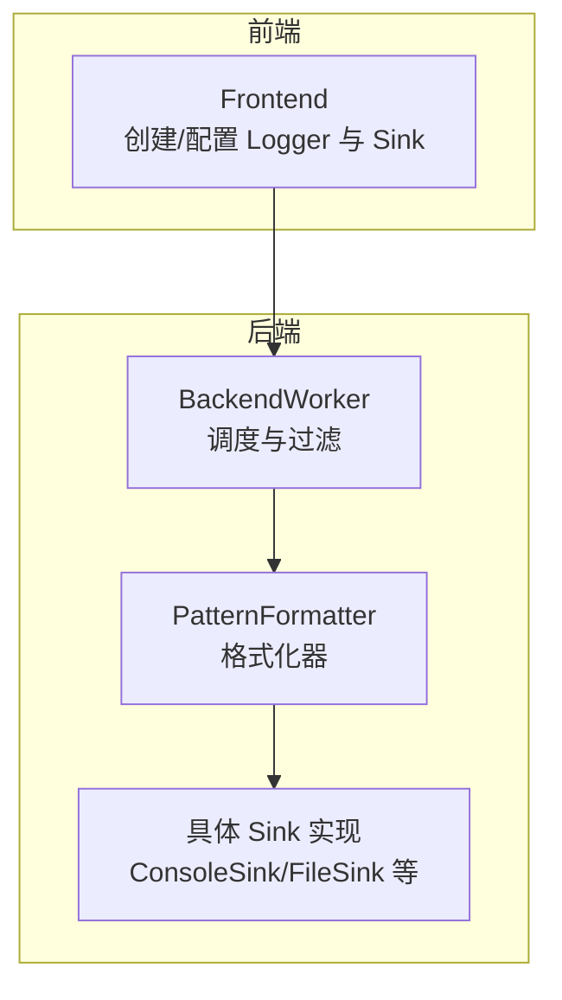
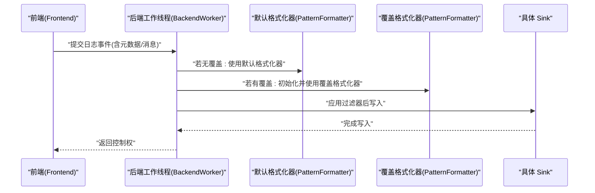
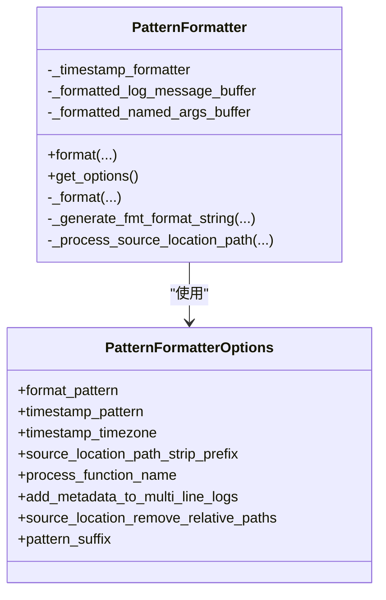
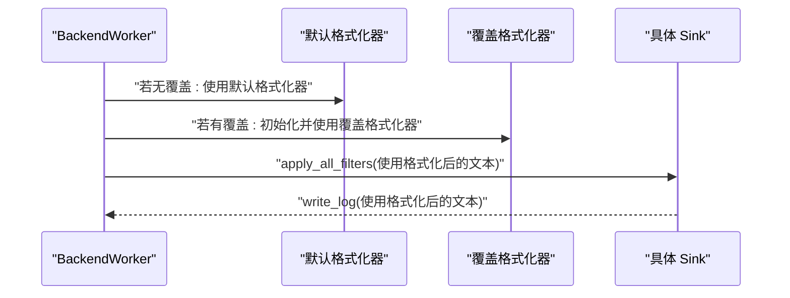
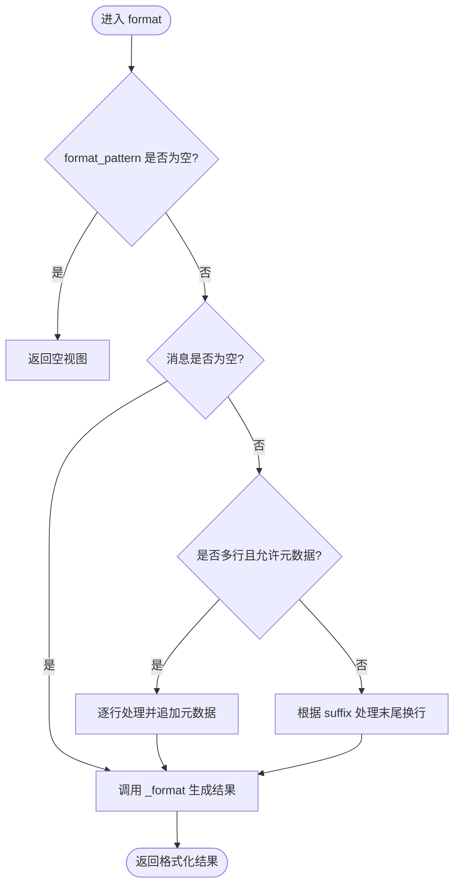
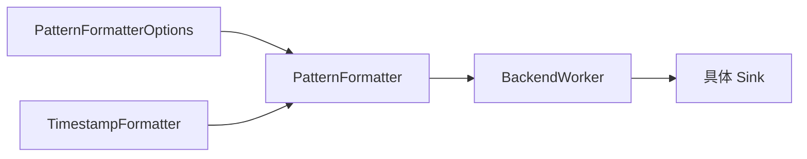

# 自定义格式化器

<cite>
**本文引用的文件**
- [PatternFormatter.h](file://include/quill/backend/PatternFormatter.h)
- [PatternFormatterOptions.h](file://include/quill/core/PatternFormatterOptions.h)
- [BackendWorker.h](file://include/quill/backend/BackendWorker.h)
- [formatters.rst](file://docs/formatters.rst)
- [quill_docs_example_custom_format.cpp](file://docs/examples/quill_docs_example_custom_format.cpp)
- [SinkFilterOverrideFormatTest.cpp](file://test/integration_tests/SinkFilterOverrideFormatTest.cpp)
- [PatternFormatterTest.cpp](file://test/unit_tests/PatternFormatterTest.cpp)
- [user_defined_sink.cpp](file://examples/user_defined_sink.cpp)
- [Backend.h](file://include/quill/Backend.h)
</cite>

## 目录
1. [简介](#简介)
2. [项目结构](#项目结构)
3. [核心组件](#核心组件)
4. [架构总览](#架构总览)
5. [组件详解](#组件详解)
6. [依赖关系分析](#依赖关系分析)
7. [性能考量](#性能考量)
8. [故障排查指南](#故障排查指南)
9. [结论](#结论)
10. [附录](#附录)

## 简介
本指南面向需要在 Quill 日志系统中开发“自定义格式化器”的工程师，目标是帮助你：
- 继承与扩展 PatternFormatter 类，实现符合业务需求的格式化输出；
- 掌握格式化器的注册与配置流程，以及与前端系统的集成方式；
- 提供可直接参考的完整示例路径，展示如何新增格式化属性与处理逻辑；
- 总结性能优化策略（内存管理、线程安全）；
- 给出调试与测试自定义格式化器的方法与工具。

## 项目结构
围绕“自定义格式化器”，本仓库的关键位置如下：
- 后端格式化核心：PatternFormatter 及其选项 PatternFormatterOptions
- 前端到后端的数据流：BackendWorker 在后端线程中调用格式化器
- 文档与示例：官方文档与示例代码展示了如何配置与覆盖格式化器
- 测试：单元测试与集成测试验证了格式化行为与覆盖机制

图表来源
- [BackendWorker.h:1010-1062](file://include/quill/backend/BackendWorker.h#L1010-L1062)
- [PatternFormatter.h:97-177](file://include/quill/backend/PatternFormatter.h#L97-L177)

章节来源
- [BackendWorker.h:1010-1062](file://include/quill/backend/BackendWorker.h#L1010-L1062)
- [PatternFormatter.h:97-177](file://include/quill/backend/PatternFormatter.h#L97-L177)

## 核心组件
- PatternFormatter：负责将日志元数据与消息按指定模式格式化为最终字符串视图；支持多行消息、命名参数、时间戳等丰富能力。
- PatternFormatterOptions：封装格式化模式、时间戳模式与时区、源码路径前缀处理、函数名处理回调、多行元数据开关、后缀字符等配置项。
- BackendWorker：在后端线程中消费前端事件，选择默认或覆盖的 PatternFormatter，应用过滤器，再写入具体 Sink。

章节来源
- [PatternFormatter.h:33-181](file://include/quill/backend/PatternFormatter.h#L33-L181)
- [PatternFormatterOptions.h:23-168](file://include/quill/core/PatternFormatterOptions.h#L23-L168)
- [BackendWorker.h:1010-1062](file://include/quill/backend/BackendWorker.h#L1010-L1062)

## 架构总览
下图展示了从前端到后端再到具体 Sink 的完整链路，以及格式化器在其中的位置与职责：

图表来源
- [BackendWorker.h:1010-1062](file://include/quill/backend/BackendWorker.h#L1010-L1062)
- [PatternFormatter.h:97-177](file://include/quill/backend/PatternFormatter.h#L97-L177)

## 组件详解

### PatternFormatter 类与扩展点
- 支持的占位符属性：时间、文件名/全路径、调用函数、日志级别、行号、记录器名、线程/进程标识、源码位置、短源码位置、消息、标签、命名参数等。
- 多行消息处理：可选择是否对每行追加元数据，避免重复冗余。
- 时间戳格式：支持 strftime 风格与额外的毫秒/微秒/纳秒分频符。
- 命名参数缓冲：内部维护命名参数拼接缓冲，减少分配。
- 惰性求值：仅对出现在模式中的属性进行赋值，提升热路径性能。

图表来源
- [PatternFormatter.h:33-181](file://include/quill/backend/PatternFormatter.h#L33-L181)
- [PatternFormatterOptions.h:23-168](file://include/quill/core/PatternFormatterOptions.h#L23-L168)

章节来源
- [PatternFormatter.h:33-181](file://include/quill/backend/PatternFormatter.h#L33-L181)
- [PatternFormatterOptions.h:23-168](file://include/quill/core/PatternFormatterOptions.h#L23-L168)

### 自定义格式化器开发步骤
- 步骤一：准备 PatternFormatterOptions
  - 设置 format_pattern，使用可用占位符组合你的输出样式。
  - 如需时间戳定制，设置 timestamp_pattern 与 timestamp_timezone。
  - 如需处理源码路径或函数名，配置 source_location_path_strip_prefix、source_location_remove_relative_paths、process_function_name。
  - 控制多行消息是否追加元数据：add_metadata_to_multi_line_logs。
  - 控制模式后缀：pattern_suffix 或 NO_SUFFIX。
- 步骤二：在前端创建 Logger 时传入 PatternFormatterOptions
  - 示例路径：[quill_docs_example_custom_format.cpp:11-15](file://docs/examples/quill_docs_example_custom_format.cpp#L11-L15)
- 步骤三：在特定 Sink 上覆盖格式化器
  - 通过 FileSinkConfig 等配置对象设置 override_pattern_formatter_options，使该 Sink 使用独立的格式化器。
  - 示例路径：[SinkFilterOverrideFormatTest.cpp:67-80](file://test/integration_tests/SinkFilterOverrideFormatTest.cpp#L67-L80)

章节来源
- [formatters.rst:1-186](file://docs/formatters.rst#L1-L186)
- [quill_docs_example_custom_format.cpp:11-15](file://docs/examples/quill_docs_example_custom_format.cpp#L11-L15)
- [SinkFilterOverrideFormatTest.cpp:67-80](file://test/integration_tests/SinkFilterOverrideFormatTest.cpp#L67-L80)

### 与前端系统的集成
- 默认格式化器：BackendWorker 在后端线程中，若未覆盖则复用 Logger 默认格式化器。
- 覆盖格式化器：当某个 Sink 设置了 override_pattern_formatter_options，BackendWorker 将在写入前为该 Sink 初始化并使用独立的 PatternFormatter。
- 过滤器接收的是“已格式化”的日志文本，确保过滤逻辑基于最终输出。

图表来源
- [BackendWorker.h:1010-1062](file://include/quill/backend/BackendWorker.h#L1010-L1062)

章节来源
- [BackendWorker.h:1010-1062](file://include/quill/backend/BackendWorker.h#L1010-L1062)

### 完整开发示例（路径指引）
- 基础自定义格式：在创建 Logger 时传入 PatternFormatterOptions，设置 format_pattern、timestamp_pattern 等。
  - 示例路径：[quill_docs_example_custom_format.cpp:11-15](file://docs/examples/quill_docs_example_custom_format.cpp#L11-L15)
- 覆盖单个 Sink 的格式：在 Sink 配置中设置 override_pattern_formatter_options。
  - 示例路径：[SinkFilterOverrideFormatTest.cpp:67-80](file://test/integration_tests/SinkFilterOverrideFormatTest.cpp#L67-L80)
- 单元测试验证：PatternFormatter 的行为与边界条件（空模式、时间精度、函数名处理、源码路径处理等）。
  - 示例路径：[PatternFormatterTest.cpp:20-54](file://test/unit_tests/PatternFormatterTest.cpp#L20-L54)

章节来源
- [quill_docs_example_custom_format.cpp:11-15](file://docs/examples/quill_docs_example_custom_format.cpp#L11-L15)
- [SinkFilterOverrideFormatTest.cpp:67-80](file://test/integration_tests/SinkFilterOverrideFormatTest.cpp#L67-L80)
- [PatternFormatterTest.cpp:20-54](file://test/unit_tests/PatternFormatterTest.cpp#L20-L54)

### 处理逻辑与算法
- 模式解析与惰性赋值
  - 解析 format_pattern，生成 fmt 兼容格式串与参数顺序索引，仅对出现的属性进行赋值，降低开销。
- 多行消息处理
  - 当 add_metadata_to_multi_line_logs 为真且未使用命名参数时，逐行追加元数据；否则按常规处理。
- 命名参数拼接
  - 将键值对拼接为字符串，缓存于命名参数缓冲，减少分配。

图表来源
- [PatternFormatter.h:97-177](file://include/quill/backend/PatternFormatter.h#L97-L177)

章节来源
- [PatternFormatter.h:97-177](file://include/quill/backend/PatternFormatter.h#L97-L177)

## 依赖关系分析
- PatternFormatter 依赖 PatternFormatterOptions 与 TimestampFormatter，内部使用 fmt 库进行格式化。
- BackendWorker 在后端线程中统一调度，默认格式化器与覆盖格式化器的选择逻辑清晰，避免在前端重复计算。
- Sink 层只关心“已格式化”的文本，简化了过滤与写入逻辑。

图表来源
- [PatternFormatter.h:33-181](file://include/quill/backend/PatternFormatter.h#L33-L181)
- [BackendWorker.h:1010-1062](file://include/quill/backend/BackendWorker.h#L1010-L1062)

章节来源
- [PatternFormatter.h:33-181](file://include/quill/backend/PatternFormatter.h#L33-L181)
- [BackendWorker.h:1010-1062](file://include/quill/backend/BackendWorker.h#L1010-L1062)

## 性能考量
- 内存管理
  - 使用类成员缓冲（如 _formatted_log_message_buffer、_formatted_named_args_buffer）避免频繁分配，减少热路径上的内存压力。
  - 命名参数缓冲按需清空与重用，降低字符串拼接成本。
- 线程安全
  - BackendWorker 在单线程后端循环中执行，格式化器与缓冲均为线程局部使用，避免共享状态竞争。
  - 若需在多线程场景下扩展自定义格式化器，请确保不共享可变状态，必要时使用线程本地存储。
- 热路径优化
  - 惰性求值：仅对出现在模式中的属性赋值，减少不必要的字符串处理。
  - 模式解析阶段一次性生成 fmt 格式串与参数顺序，运行时只需按序填充。
- 时钟与时间戳
  - 时间戳格式化由 TimestampFormatter 负责，支持毫秒/微秒/纳秒分频，避免额外转换开销。
- 多行消息
  - 合理设置 add_metadata_to_multi_line_logs，避免在长文本上重复拼接元数据。

章节来源
- [PatternFormatter.h:590-606](file://include/quill/backend/PatternFormatter.h#L590-L606)
- [BackendWorker.h:1010-1062](file://include/quill/backend/BackendWorker.h#L1010-L1062)

## 故障排查指南
- 常见错误与定位
  - 无效的格式模式：当 format_pattern 中存在未闭合的括号或未知属性时会抛出异常。
    - 示例路径：[PatternFormatterTest.cpp:327-344](file://test/unit_tests/PatternFormatterTest.cpp#L327-L344)
  - 空格式模式：返回空视图，适用于仅提取元数据而无需格式化输出的场景。
    - 示例路径：[PatternFormatterTest.cpp:423-454](file://test/unit_tests/PatternFormatterTest.cpp#L423-L454)
  - 函数名处理：启用 QUILL_DETAILED_FUNCTION_NAME 后，可通过 process_function_name 回调自定义函数签名处理。
    - 示例路径：[PatternFormatterTest.cpp:558-606](file://test/unit_tests/PatternFormatterTest.cpp#L558-L606)
  - 源码路径处理：source_location_path_strip_prefix 与 source_location_remove_relative_paths 影响 %(source_location) 的显示。
    - 示例路径：[PatternFormatterTest.cpp:497-556](file://test/unit_tests/PatternFormatterTest.cpp#L497-L556)
- 覆盖格式化器验证
  - 确认覆盖格式生效：过滤器收到的 log_statement 应与覆盖格式一致。
    - 示例路径：[SinkFilterOverrideFormatTest.cpp:56-137](file://test/integration_tests/SinkFilterOverrideFormatTest.cpp#L56-L137)
- 后端启动与退出
  - 确保 Backend::start 已调用，且在程序退出时 Backend::stop 或 atexit 机制正常工作。
    - 示例路径：[Backend.h:42-57](file://include/quill/Backend.h#L42-L57)

章节来源
- [PatternFormatterTest.cpp:327-344](file://test/unit_tests/PatternFormatterTest.cpp#L327-L344)
- [PatternFormatterTest.cpp:423-454](file://test/unit_tests/PatternFormatterTest.cpp#L423-L454)
- [PatternFormatterTest.cpp:558-606](file://test/unit_tests/PatternFormatterTest.cpp#L558-L606)
- [PatternFormatterTest.cpp:497-556](file://test/unit_tests/PatternFormatterTest.cpp#L497-L556)
- [SinkFilterOverrideFormatTest.cpp:56-137](file://test/integration_tests/SinkFilterOverrideFormatTest.cpp#L56-L137)
- [Backend.h:42-57](file://include/quill/Backend.h#L42-L57)

## 结论
通过 PatternFormatter 与 PatternFormatterOptions，你可以灵活地定制日志输出格式，并在需要时为特定 Sink 提供独立的覆盖格式。BackendWorker 的设计保证了格式化与过滤在后端统一处理，既提升了性能又简化了扩展。遵循本文的开发步骤、性能建议与排错方法，可以高效地构建稳定、可维护的自定义格式化器。

## 附录
- 官方文档：格式化器与示例
  - [formatters.rst:1-186](file://docs/formatters.rst#L1-L186)
  - [quill_docs_example_custom_format.cpp:1-18](file://docs/examples/quill_docs_example_custom_format.cpp#L1-L18)
- 相关示例：自定义 Sink 与用户扩展
  - [user_defined_sink.cpp:1-90](file://examples/user_defined_sink.cpp#L1-L90)