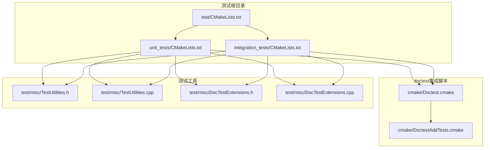
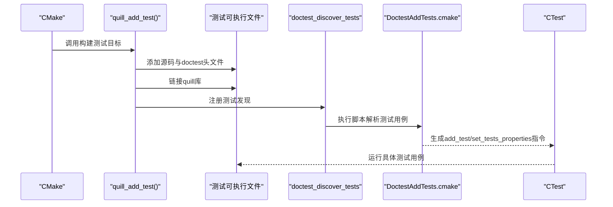
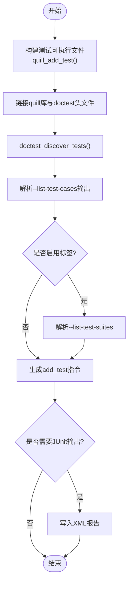
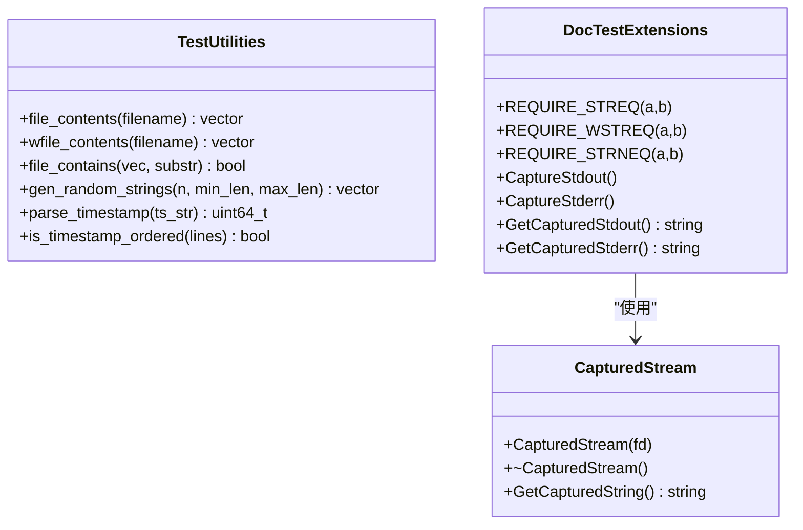
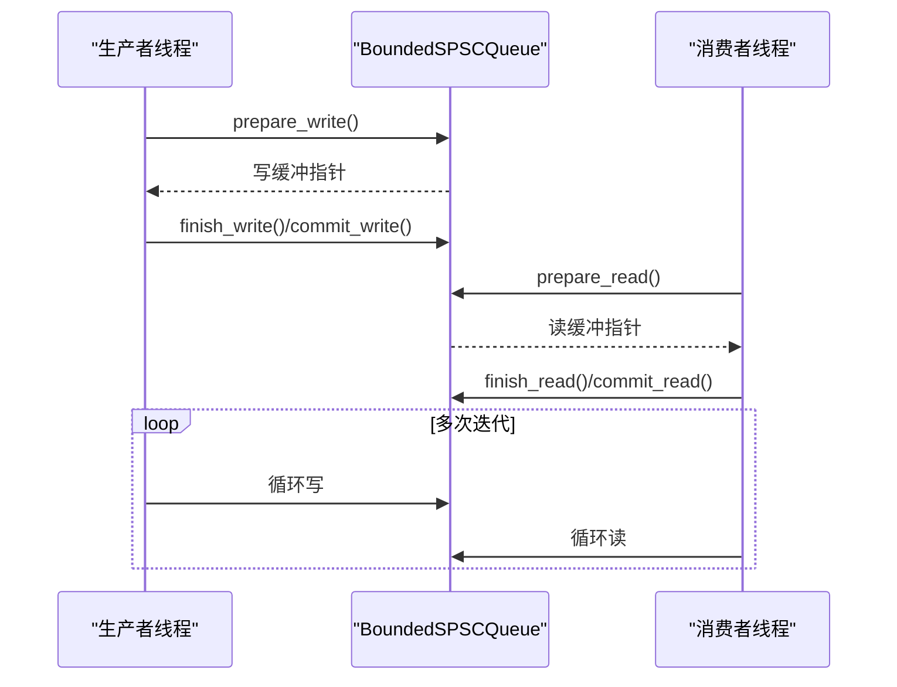
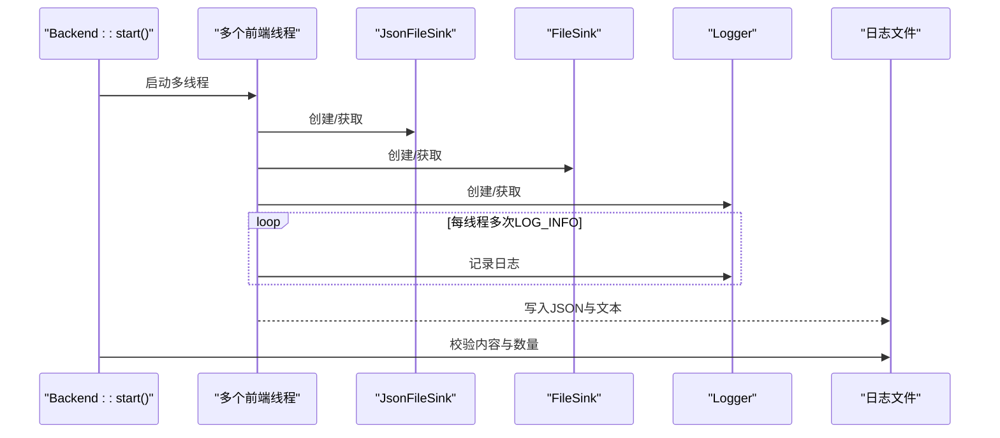
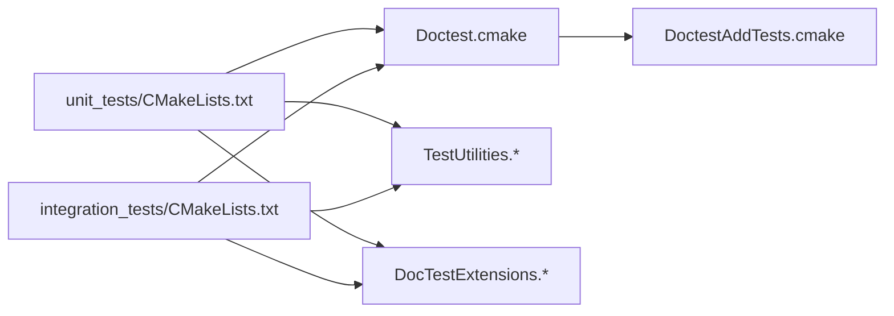

# 单元测试

<cite>
**本文引用的文件**
- [test/CMakeLists.txt](file://test/CMakeLists.txt)
- [unit_tests/CMakeLists.txt](file://test/unit_tests/CMakeLists.txt)
- [integration_tests/CMakeLists.txt](file://test/integration_tests/CMakeLists.txt)
- [Doctest.cmake](file://cmake/Doctest.cmake)
- [DoctestAddTests.cmake](file://cmake/DoctestAddTests.cmake)
- [DocTestExtensions.h](file://test/misc/DocTestExtensions.h)
- [DocTestExtensions.cpp](file://test/misc/DocTestExtensions.cpp)
- [TestUtilities.h](file://test/misc/TestUtilities.h)
- [TestUtilities.cpp](file://test/misc/TestUtilities.cpp)
- [BoundedQueueTest.cpp](file://test/unit_tests/BoundedQueueTest.cpp)
- [PatternFormatterTest.cpp](file://test/unit_tests/PatternFormatterTest.cpp)
- [LoggerManagerTest.cpp](file://test/unit_tests/LoggerManagerTest.cpp)
- [SinkManagerTest.cpp](file://test/unit_tests/SinkManagerTest.cpp)
- [JsonFileLoggingTest.cpp](file://test/integration_tests/JsonFileLoggingTest.cpp)
- [MultiFrontendThreadsTest.cpp](file://test/integration_tests/MultiFrontendThreadsTest.cpp)
</cite>

## 目录
1. [简介](#简介)
2. [项目结构](#项目结构)
3. [核心组件](#核心组件)
4. [架构总览](#架构总览)
5. [详细组件分析](#详细组件分析)
6. [依赖关系分析](#依赖关系分析)
7. [性能考量](#性能考量)
8. [故障排查指南](#故障排查指南)
9. [结论](#结论)
10. [附录](#附录)

## 简介
本文件面向Quill项目的单元与集成测试体系，聚焦doctest测试框架在CMake中的集成方式与使用规范，系统梳理测试用例编写、断言方法、测试组织结构，并对核心模块（队列管理、日志器、格式化器、编码器、Sink管理等）的测试覆盖进行说明。同时提供测试工具函数的使用指南（测试数据生成、模拟对象与环境配置），以及测试覆盖率统计与质量保障建议，帮助开发者编写高质量的单元测试。

## 项目结构
Quill的测试子系统由两部分组成：unit_tests（单元测试）与integration_tests（集成测试）。两者均通过统一的CMake函数封装，自动引入doctest头文件与通用测试工具，并以doctest_discover_tests完成测试发现与注册。

**图表来源**
- [test/CMakeLists.txt:1-2](file://test/CMakeLists.txt#L1-L2)
- [unit_tests/CMakeLists.txt:1-83](file://test/unit_tests/CMakeLists.txt#L1-L83)
- [integration_tests/CMakeLists.txt:1-161](file://test/integration_tests/CMakeLists.txt#L1-L161)
- [Doctest.cmake:107-183](file://cmake/Doctest.cmake#L107-L183)
- [DoctestAddTests.cmake:1-120](file://cmake/DoctestAddTests.cmake#L1-L120)
- [TestUtilities.h:1-31](file://test/misc/TestUtilities.h#L1-L31)
- [TestUtilities.cpp:1-171](file://test/misc/TestUtilities.cpp#L1-L171)
- [DocTestExtensions.h:1-96](file://test/misc/DocTestExtensions.h#L1-L96)
- [DocTestExtensions.cpp:1-205](file://test/misc/DocTestExtensions.cpp#L1-L205)

**章节来源**
- [test/CMakeLists.txt:1-2](file://test/CMakeLists.txt#L1-L2)
- [unit_tests/CMakeLists.txt:1-83](file://test/unit_tests/CMakeLists.txt#L1-L83)
- [integration_tests/CMakeLists.txt:1-161](file://test/integration_tests/CMakeLists.txt#L1-L161)

## 核心组件
- doctest集成与测试发现
  - 使用自定义函数封装测试目标构建与doctest_discover_tests调用，支持可选的Sanitizer环境变量注入。
  - 测试发现脚本解析测试可执行文件输出，生成CTest测试列表，支持标签与JUnit报告输出。
- 测试工具集
  - 文件读取与搜索：file_contents/wfile_contents、file_contains，便于断言日志内容。
  - 随机字符串生成：gen_random_strings，用于构造多样化输入。
  - 时间戳解析与有序性校验：parse_timestamp、is_timestamp_ordered，用于时间序列一致性检查。
  - 输出流捕获：CapturedStream及CaptureStdout/CaptureStderr等，用于验证控制台输出。
- 断言扩展
  - 字符串断言宏：REQUIRE_STREQ、REQUIRE_WSTREQ、REQUIRE_STRNEQ，增强C风格字符串比较与诊断信息。
  - doctest标准断言：REQUIRE_EQ、REQUIRE_NE、REQUIRE_FALSE等广泛使用于各测试套件。

**章节来源**
- [unit_tests/CMakeLists.txt:1-54](file://test/unit_tests/CMakeLists.txt#L1-L54)
- [integration_tests/CMakeLists.txt:1-57](file://test/integration_tests/CMakeLists.txt#L1-L57)
- [Doctest.cmake:107-183](file://cmake/Doctest.cmake#L107-L183)
- [DoctestAddTests.cmake:27-120](file://cmake/DoctestAddTests.cmake#L27-L120)
- [DocTestExtensions.h:12-42](file://test/misc/DocTestExtensions.h#L12-L42)
- [DocTestExtensions.h:43-96](file://test/misc/DocTestExtensions.h#L43-L96)
- [DocTestExtensions.cpp:162-205](file://test/misc/DocTestExtensions.cpp#L162-L205)
- [TestUtilities.h:16-30](file://test/misc/TestUtilities.h#L16-L30)
- [TestUtilities.cpp:20-171](file://test/misc/TestUtilities.cpp#L20-L171)

## 架构总览
下图展示了测试系统的整体流程：CMake函数创建测试可执行文件，链接Quill库与doctest头文件，随后doctest_discover_tests在构建后扫描测试用例并注册到CTest；测试运行时，doctest执行测试用例并通过断言与工具函数完成验证。

**图表来源**
- [unit_tests/CMakeLists.txt:1-54](file://test/unit_tests/CMakeLists.txt#L1-L54)
- [integration_tests/CMakeLists.txt:1-57](file://test/integration_tests/CMakeLists.txt#L1-L57)
- [Doctest.cmake:107-183](file://cmake/Doctest.cmake#L107-L183)
- [DoctestAddTests.cmake:27-120](file://cmake/DoctestAddTests.cmake#L27-L120)

## 详细组件分析

### doctest集成与使用规范
- 测试目标构建
  - 统一通过quill_add_test函数添加doctest头文件、测试工具与源码，设置编译选项与运行输出目录。
  - 非MSVC平台对特定测试文件禁用特定告警，确保跨平台稳定性。
- 测试发现与注册
  - doctest_discover_tests通过--list-test-cases与--list-test-suites枚举测试用例与标签，支持JUnit XML输出。
  - 可选注入ASAN/UBSAN环境变量，便于内存与未定义行为检测。
- 命名与标签
  - 支持TEST_PREFIX/TEST_SUFFIX为测试命名加前缀或后缀，便于区分同一可执行文件内的多组测试。
  - 可开启自动标签（suite名称）以便按标签筛选测试。

**图表来源**
- [unit_tests/CMakeLists.txt:1-54](file://test/unit_tests/CMakeLists.txt#L1-L54)
- [integration_tests/CMakeLists.txt:1-57](file://test/integration_tests/CMakeLists.txt#L1-L57)
- [Doctest.cmake:107-183](file://cmake/Doctest.cmake#L107-L183)
- [DoctestAddTests.cmake:27-120](file://cmake/DoctestAddTests.cmake#L27-L120)

**章节来源**
- [unit_tests/CMakeLists.txt:1-54](file://test/unit_tests/CMakeLists.txt#L1-L54)
- [integration_tests/CMakeLists.txt:1-57](file://test/integration_tests/CMakeLists.txt#L1-L57)
- [Doctest.cmake:107-183](file://cmake/Doctest.cmake#L107-L183)
- [DoctestAddTests.cmake:27-120](file://cmake/DoctestAddTests.cmake#L27-L120)

### 测试用例编写规范与断言方法
- 套件与用例
  - 使用TEST_SUITE_BEGIN/TEST_SUITE_END组织逻辑分组，每个.cpp一个或多个套件。
  - 用例中使用doctest断言宏进行条件判断与错误报告。
- 断言扩展
  - 字符串断言：REQUIRE_STREQ/REQUIRE_WSTREQ/REQUIRE_STRNEQ，用于C风格字符串比较与诊断。
  - 标准断言：REQUIRE_EQ、REQUIRE_NE、REQUIRE_FALSE等，广泛用于数值、指针与布尔值断言。
- 复杂断言辅助
  - file_contains：在文件内容向量中查找子串，失败时打印上下文便于定位。
  - is_timestamp_ordered：对日志时间戳进行顺序性校验，打印异常片段辅助调试。

**章节来源**
- [DocTestExtensions.h:12-42](file://test/misc/DocTestExtensions.h#L12-L42)
- [DocTestExtensions.h:43-96](file://test/misc/DocTestExtensions.h#L43-L96)
- [TestUtilities.cpp:50-70](file://test/misc/TestUtilities.cpp#L50-L70)
- [TestUtilities.cpp:131-169](file://test/misc/TestUtilities.cpp#L131-L169)

### 测试工具函数使用指南
- 文件读取与断言
  - file_contents/wfile_contents：将文件逐行读取为字符串向量，便于后续断言。
  - file_contains：在向量中查找子串，失败时输出全部内容，便于定位问题。
- 数据生成
  - gen_random_strings：生成指定数量与长度范围的随机字符串，用于压力与边界测试。
- 时间戳处理
  - parse_timestamp：从字符串解析纳秒级时间戳。
  - is_timestamp_ordered：检查时间戳是否严格递增，支持打印附近元素辅助定位。
- 输出捕获
  - CapturedStream/CaptureStdout/CaptureStderr：重定向并捕获标准输出/错误，返回捕获内容供断言。

**图表来源**
- [TestUtilities.h:16-30](file://test/misc/TestUtilities.h#L16-L30)
- [TestUtilities.cpp:20-171](file://test/misc/TestUtilities.cpp#L20-L171)
- [DocTestExtensions.h:12-42](file://test/misc/DocTestExtensions.h#L12-L42)
- [DocTestExtensions.h:43-96](file://test/misc/DocTestExtensions.h#L43-L96)
- [DocTestExtensions.cpp:37-110](file://test/misc/DocTestExtensions.cpp#L37-L110)

**章节来源**
- [TestUtilities.h:16-30](file://test/misc/TestUtilities.h#L16-L30)
- [TestUtilities.cpp:20-171](file://test/misc/TestUtilities.cpp#L20-L171)
- [DocTestExtensions.cpp:162-205](file://test/misc/DocTestExtensions.cpp#L162-L205)

### 核心模块单元测试覆盖

#### 队列管理（BoundedSPSCQueue）
- 覆盖要点
  - 单线程读写循环、环形缓冲区溢出场景、多线程生产者/消费者一致性。
  - 关键接口：prepare_write/finish_write/commit_write与prepare_read/finish_read/commit_read。
- 断言与工具
  - 使用REQUIRE_NE/REQUIRE_FALSE验证指针与布尔状态。
  - 使用REQUIRE_STREQ进行字节拷贝后的字符串一致性校验。

**图表来源**
- [BoundedQueueTest.cpp:22-87](file://test/unit_tests/BoundedQueueTest.cpp#L22-L87)
- [BoundedQueueTest.cpp:90-140](file://test/unit_tests/BoundedQueueTest.cpp#L90-L140)

**章节来源**
- [BoundedQueueTest.cpp:15-146](file://test/unit_tests/BoundedQueueTest.cpp#L15-L146)

#### 日志器与日志器管理（Logger/LoggerManager）
- 覆盖要点
  - 创建/获取/移除日志器，无效化与清理策略，有效日志器选择（含排除列表）。
- 断言与工具
  - 使用REQUIRE_EQ断言名称与数量，使用lambda回调模拟队列空/非空状态以驱动清理。

**章节来源**
- [LoggerManagerTest.cpp:7-127](file://test/unit_tests/LoggerManagerTest.cpp#L7-L127)
- [LoggerManagerTest.cpp:129-200](file://test/unit_tests/LoggerManagerTest.cpp#L129-L200)

#### 格式化器（PatternFormatter）
- 覆盖要点
  - 默认模式与自定义模式，时间戳精度（ns/us/ms），线程/进程信息，消息格式化。
- 断言与工具
  - 使用REQUIRE_NE/REQUIRE_EQ断言格式化结果包含预期片段或完全相等。

**章节来源**
- [PatternFormatterTest.cpp:12-200](file://test/unit_tests/PatternFormatterTest.cpp#L12-L200)

#### 编码器与Sink管理（SinkManager）
- 覆盖要点
  - Sink创建/获取/复用与清理，相同配置的Sink复用策略，未使用Sink清理。
- 断言与工具
  - 使用REQUIRE_EQ/REQUIRE_NE断言指针相等与不等，验证清理计数。

**章节来源**
- [SinkManagerTest.cpp:7-68](file://test/unit_tests/SinkManagerTest.cpp#L7-L68)

### 集成测试示例

#### JSON文件日志（多线程、多参数、特殊字符）
- 覆盖要点
  - 后端启动/停止，多线程并发写入，JSON与普通格式双写，用户自定义类型格式化，非打印字符转义，无效格式处理，额外命名参数。
- 断言与工具
  - 使用file_contents/file_contains断言JSON与文本内容，使用REQUIRE_EQ断言消息总数。

**图表来源**
- [JsonFileLoggingTest.cpp:48-198](file://test/integration_tests/JsonFileLoggingTest.cpp#L48-L198)

**章节来源**
- [JsonFileLoggingTest.cpp:48-198](file://test/integration_tests/JsonFileLoggingTest.cpp#L48-L198)

#### 多前端线程并发（时间戳顺序与去重）
- 覆盖要点
  - 前端预分配、多线程写入、后端停止等待、文件内容断言与去重校验。
- 断言与工具
  - 使用file_contents/file_contains断言每条消息存在，使用is_timestamp_ordered校验顺序。

**章节来源**
- [MultiFrontendThreadsTest.cpp:16-94](file://test/integration_tests/MultiFrontendThreadsTest.cpp#L16-L94)

## 依赖关系分析
- 组件耦合
  - 测试目标与doctest头文件强耦合，通过quill_add_test统一管理。
  - doctest_discover_tests依赖DoctestAddTests.cmake解析测试用例与标签。
  - 测试工具（TestUtilities/DocTestExtensions）被单元与集成测试共享。
- 外部依赖
  - doctest头文件随仓库内嵌，无需外部安装。
  - CMake版本要求：脚本兼容CMake 3.10+，使用TEST_INCLUDE_FILES属性。

**图表来源**
- [unit_tests/CMakeLists.txt:1-54](file://test/unit_tests/CMakeLists.txt#L1-L54)
- [integration_tests/CMakeLists.txt:1-57](file://test/integration_tests/CMakeLists.txt#L1-L57)
- [Doctest.cmake:107-183](file://cmake/Doctest.cmake#L107-L183)
- [DoctestAddTests.cmake:1-120](file://cmake/DoctestAddTests.cmake#L1-L120)
- [TestUtilities.h:16-30](file://test/misc/TestUtilities.h#L16-L30)
- [DocTestExtensions.h:43-96](file://test/misc/DocTestExtensions.h#L43-L96)

**章节来源**
- [unit_tests/CMakeLists.txt:1-54](file://test/unit_tests/CMakeLists.txt#L1-L54)
- [integration_tests/CMakeLists.txt:1-57](file://test/integration_tests/CMakeLists.txt#L1-L57)
- [Doctest.cmake:107-183](file://cmake/Doctest.cmake#L107-L183)
- [DoctestAddTests.cmake:1-120](file://cmake/DoctestAddTests.cmake#L1-L120)

## 性能考量
- doctest_discover_tests在构建后解析测试用例，避免频繁CMake重配置，但可能不适用于交叉编译环境。
- 对于大规模并发测试（如多线程日志），建议使用较小的消息规模与线程数进行回归测试，必要时启用扩展测试开关（如QUILL_ENABLE_EXTENSIVE_TESTS）以平衡覆盖率与耗时。
- Sanitizer环境变量仅在启用地址/UBSanitizer时注入，有助于早期发现内存与未定义行为问题。

## 故障排查指南
- 测试未发现或CTest列表为空
  - 检查doctest_discover_tests是否正确传递TEST_EXECUTABLE与工作目录。
  - 确认测试可执行文件存在且可执行。
- 断言失败定位
  - 使用file_contains失败时的打印上下文，结合REQUIRE_STREQ/REQUIRE_STRNEQ的详细诊断信息。
  - 对时间序列问题，使用is_timestamp_ordered打印异常片段。
- 输出捕获问题
  - 确保同一时刻仅有一个CapturedStream实例，避免重复重定向导致的不可预测行为。
- 平台差异
  - Windows与Unix路径/临时文件处理不同，注意临时文件创建与权限。

**章节来源**
- [DoctestAddTests.cmake:27-50](file://cmake/DoctestAddTests.cmake#L27-L50)
- [DocTestExtensions.cpp:162-205](file://test/misc/DocTestExtensions.cpp#L162-L205)
- [TestUtilities.cpp:50-70](file://test/misc/TestUtilities.cpp#L50-L70)
- [TestUtilities.cpp:131-169](file://test/misc/TestUtilities.cpp#L131-L169)

## 结论
Quill的测试体系以doctest为核心，借助CMake脚本实现自动化测试发现与注册，配合统一的测试工具与断言扩展，覆盖了队列、日志器、格式化器、Sink管理等关键模块，并通过集成测试验证多线程与复杂场景下的稳定性。遵循本文档的编写规范与最佳实践，可显著提升测试质量与可维护性。

## 附录
- 质量保证与覆盖率
  - 建议在CI中启用Sanitizer与覆盖率收集（如结合CodeCoverage.cmake），对关键路径进行覆盖率统计。
  - 对易错模块（如格式化器、编码器、Sink管理）增加边界与异常分支测试。
- 命名与标签
  - 使用TEST_PREFIX/TEST_SUFFIX与标签（suite名称）组织测试，便于按模块筛选与并行执行。