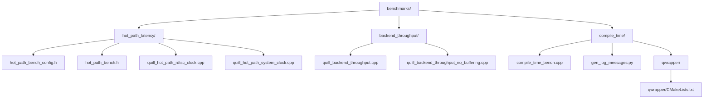
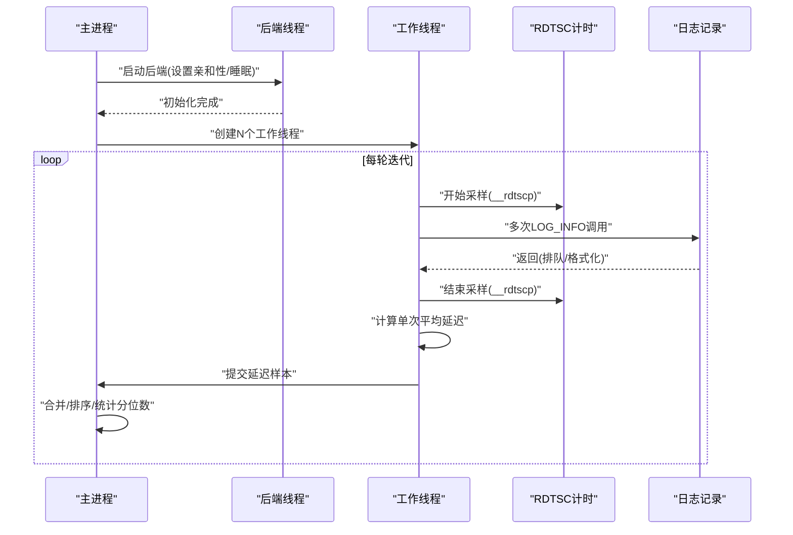
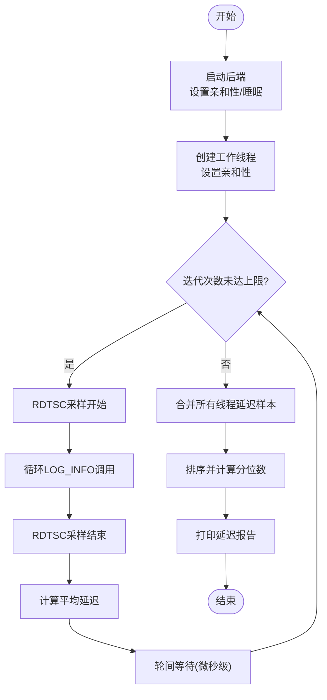
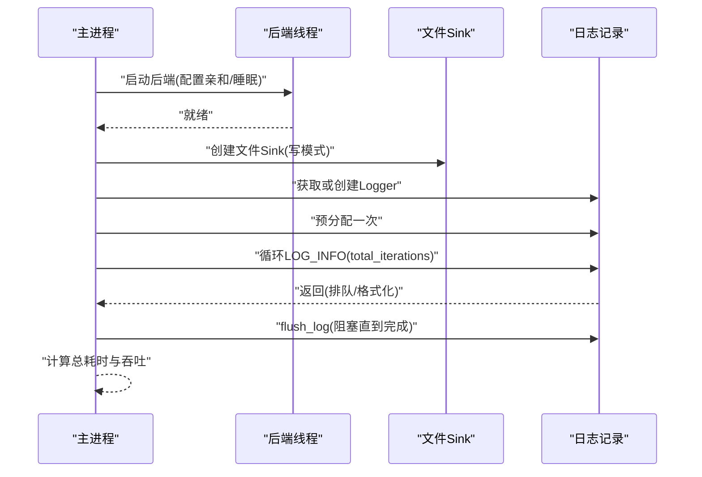
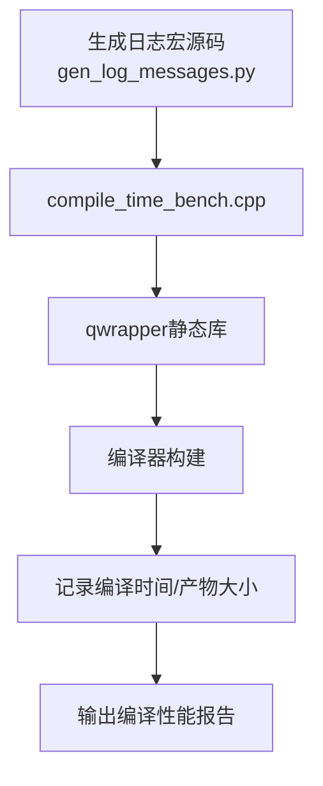
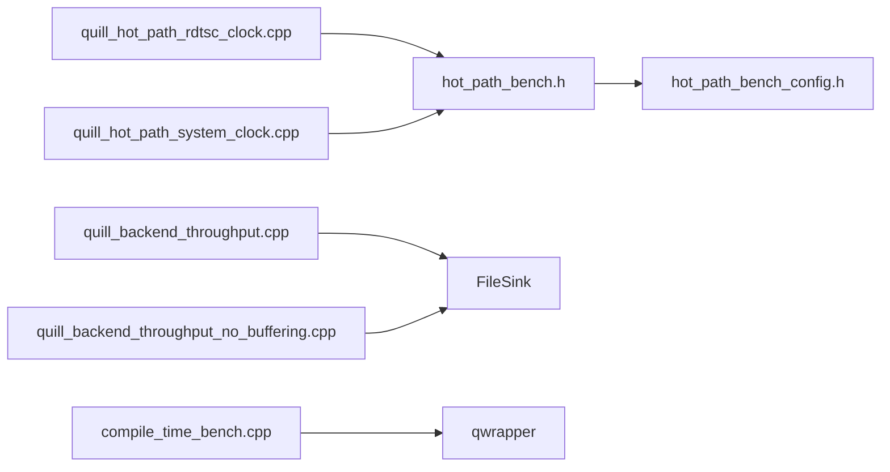

# 性能测试

<cite>
**本文引用的文件**
- [benchmarks/CMakeLists.txt](file://benchmarks/CMakeLists.txt)
- [hot_path_bench.h](file://benchmarks/hot_path_latency/hot_path_bench.h)
- [hot_path_bench_config.h](file://benchmarks/hot_path_latency/hot_path_bench_config.h)
- [quill_hot_path_rdtsc_clock.cpp](file://benchmarks/hot_path_latency/quill_hot_path_rdtsc_clock.cpp)
- [quill_hot_path_system_clock.cpp](file://benchmarks/hot_path_latency/quill_hot_path_system_clock.cpp)
- [quill_backend_throughput.cpp](file://benchmarks/backend_throughput/quill_backend_throughput.cpp)
- [quill_backend_throughput_no_buffering.cpp](file://benchmarks/backend_throughput/quill_backend_throughput_no_buffering.cpp)
- [compile_time_bench.cpp](file://benchmarks/compile_time/compile_time_bench.cpp)
- [gen_log_messages.py](file://benchmarks/compile_time/gen_log_messages.py)
- [qwrapper/CMakeLists.txt](file://benchmarks/compile_time/qwrapper/CMakeLists.txt)
</cite>

## 目录
1. [简介](#简介)
2. [项目结构](#项目结构)
3. [核心组件](#核心组件)
4. [架构总览](#架构总览)
5. [详细组件分析](#详细组件分析)
6. [依赖关系分析](#依赖关系分析)
7. [性能考量](#性能考量)
8. [故障排查指南](#故障排查指南)
9. [结论](#结论)
10. [附录](#附录)

## 简介
本文件面向Quill日志库的性能测试与基准测试，系统性阐述以下内容：
- 热路径延迟测试：基于RDTSC与时钟源的延迟测量，支持多线程并发与统计分位数。
- 后端吞吐量测试：衡量在不同后端配置下的消息处理速率，含缓冲与无缓冲两种场景。
- 编译时性能测试：通过大量日志宏展开与模板实例化评估编译开销。
- 基准测试工具使用：测试用例编写、性能指标采集与结果分析流程。
- 性能优化验证：内存使用、CPU占用率与延迟测量方法。
- 性能回归策略：如何在功能迭代中保持性能稳定。

## 项目结构
Quill仓库的性能测试位于benchmarks目录下，按测试类型划分子目录，每个子目录包含独立的可执行基准程序与构建脚本。顶层CMake组织各子模块，便于统一编译与运行。

图表来源
- [benchmarks/CMakeLists.txt:1-3](file://benchmarks/CMakeLists.txt#L1-L3)
- [hot_path_bench.h:1-202](file://benchmarks/hot_path_latency/hot_path_bench.h#L1-L202)
- [hot_path_bench_config.h:1-37](file://benchmarks/hot_path_latency/hot_path_bench_config.h#L1-L37)
- [quill_hot_path_rdtsc_clock.cpp:1-95](file://benchmarks/hot_path_latency/quill_hot_path_rdtsc_clock.cpp#L1-L95)
- [quill_hot_path_system_clock.cpp:1-98](file://benchmarks/hot_path_latency/quill_hot_path_system_clock.cpp#L1-L98)
- [quill_backend_throughput.cpp:1-69](file://benchmarks/backend_throughput/quill_backend_throughput.cpp#L1-L69)
- [quill_backend_throughput_no_buffering.cpp:1-72](file://benchmarks/backend_throughput/quill_backend_throughput_no_buffering.cpp#L1-L72)
- [compile_time_bench.cpp:1-800](file://benchmarks/compile_time/compile_time_bench.cpp#L1-L800)
- [gen_log_messages.py:1-58](file://benchmarks/compile_time/gen_log_messages.py#L1-L58)
- [qwrapper/CMakeLists.txt:1-16](file://benchmarks/compile_time/qwrapper/CMakeLists.txt#L1-L16)

章节来源
- [benchmarks/CMakeLists.txt:1-3](file://benchmarks/CMakeLists.txt#L1-L3)

## 核心组件
- 热路径延迟测试框架
  - 统一的基准执行器与线程管理，支持设置CPU亲和性、等待间隔与统计输出。
  - 两套时钟源：RDTSC与系统时钟，分别用于高精度采样与对比分析。
- 后端吞吐量测试
  - 计时从启动后端到完成固定数量日志写入，计算平均每秒消息数。
  - 提供带/不带缓冲两种模式，以评估队列与缓冲策略对吞吐的影响。
- 编译时性能测试
  - 通过生成大量日志宏调用与模板实例化，评估编译时间与二进制大小。
  - 使用辅助脚本批量生成日志语句，确保测试覆盖多种参数组合。

章节来源
- [hot_path_bench.h:1-202](file://benchmarks/hot_path_latency/hot_path_bench.h#L1-L202)
- [hot_path_bench_config.h:1-37](file://benchmarks/hot_path_latency/hot_path_bench_config.h#L1-L37)
- [quill_hot_path_rdtsc_clock.cpp:1-95](file://benchmarks/hot_path_latency/quill_hot_path_rdtsc_clock.cpp#L1-L95)
- [quill_hot_path_system_clock.cpp:1-98](file://benchmarks/hot_path_latency/quill_hot_path_system_clock.cpp#L1-L98)
- [quill_backend_throughput.cpp:1-69](file://benchmarks/backend_throughput/quill_backend_throughput.cpp#L1-L69)
- [quill_backend_throughput_no_buffering.cpp:1-72](file://benchmarks/backend_throughput/quill_backend_throughput_no_buffering.cpp#L1-L72)
- [compile_time_bench.cpp:1-800](file://benchmarks/compile_time/compile_time_bench.cpp#L1-L800)
- [gen_log_messages.py:1-58](file://benchmarks/compile_time/gen_log_messages.py#L1-L58)

## 架构总览
下图展示热路径延迟测试的典型调用序列，涵盖后端启动、线程调度、采样与统计汇总。

图表来源
- [hot_path_bench.h:61-125](file://benchmarks/hot_path_latency/hot_path_bench.h#L61-L125)
- [hot_path_bench.h:127-202](file://benchmarks/hot_path_latency/hot_path_bench.h#L127-L202)
- [quill_hot_path_rdtsc_clock.cpp:25-95](file://benchmarks/hot_path_latency/quill_hot_path_rdtsc_clock.cpp#L25-L95)

## 详细组件分析

### 热路径延迟测试（RDTSC与时钟源）
- 设计要点
  - 统一的run_benchmark入口负责线程创建、CPU亲和性设置与结果聚合。
  - 在PERF_ENABLED开启时，采用sleep避免额外噪声；否则使用忙等与RDTSC采样。
  - 配置项控制线程数、每轮消息数、迭代次数与轮间等待时间，平衡吞吐与延迟测量准确性。
- 关键流程
  - 后端启动与初始化，设置后台线程亲和性与睡眠策略。
  - 多线程并发触发日志记录，每轮内多次调用LOG_INFO，采样前后周期计算平均延迟。
  - 轮间等待确保后端有时间消化队列，避免队列扩容导致的热路径抖动。
- 结果输出
  - 输出50/75/90/95/99/99.9/最坏分位延迟，便于定位尾延迟影响因素。

图表来源
- [hot_path_bench.h:40-125](file://benchmarks/hot_path_latency/hot_path_bench.h#L40-L125)
- [hot_path_bench.h:127-202](file://benchmarks/hot_path_latency/hot_path_bench.h#L127-L202)
- [hot_path_bench_config.h:21-37](file://benchmarks/hot_path_latency/hot_path_bench_config.h#L21-L37)

章节来源
- [hot_path_bench.h:1-202](file://benchmarks/hot_path_latency/hot_path_bench.h#L1-L202)
- [hot_path_bench_config.h:1-37](file://benchmarks/hot_path_latency/hot_path_bench_config.h#L1-L37)
- [quill_hot_path_rdtsc_clock.cpp:1-95](file://benchmarks/hot_path_latency/quill_hot_path_rdtsc_clock.cpp#L1-L95)
- [quill_hot_path_system_clock.cpp:1-98](file://benchmarks/hot_path_latency/quill_hot_path_system_clock.cpp#L1-L98)

### 后端吞吐量测试
- 设计要点
  - 固定消息总数，记录从开始到全部刷新完成的时间，计算平均吞吐。
  - 提供两种模式：默认缓冲模式与硬/软限制极小的无缓冲模式，对比队列行为差异。
- 关键流程
  - 启动后端并创建文件Sink，预分配一次以消除首次开销。
  - 循环记录固定数量日志，结束后阻塞刷新直至完成。
  - 统计总耗时与吞吐（百万条/秒），输出结果。

图表来源
- [quill_backend_throughput.cpp:14-69](file://benchmarks/backend_throughput/quill_backend_throughput.cpp#L14-L69)
- [quill_backend_throughput_no_buffering.cpp:14-72](file://benchmarks/backend_throughput/quill_backend_throughput_no_buffering.cpp#L14-L72)

章节来源
- [quill_backend_throughput.cpp:1-69](file://benchmarks/backend_throughput/quill_backend_throughput.cpp#L1-L69)
- [quill_backend_throughput_no_buffering.cpp:1-72](file://benchmarks/backend_throughput/quill_backend_throughput_no_buffering.cpp#L1-L72)

### 编译时性能测试
- 设计要点
  - 通过大量LOG_INFO宏调用与模板实例化，评估编译时间与二进制体积。
  - 使用Python脚本生成多样化参数组合的日志语句，覆盖常见类型与字符串视图。
  - 将Quill头文件封装为qwrapper静态库，作为编译基准的最小公共依赖集。
- 关键流程
  - 生成包含大量日志宏的源文件。
  - 以qwrapper为目标链接，单独测量编译耗时。
  - 可重复调整宏数量与参数复杂度，观察编译时间曲线。

图表来源
- [compile_time_bench.cpp:1-800](file://benchmarks/compile_time/compile_time_bench.cpp#L1-L800)
- [gen_log_messages.py:1-58](file://benchmarks/compile_time/gen_log_messages.py#L1-L58)
- [qwrapper/CMakeLists.txt:1-16](file://benchmarks/compile_time/qwrapper/CMakeLists.txt#L1-L16)

章节来源
- [compile_time_bench.cpp:1-800](file://benchmarks/compile_time/compile_time_bench.cpp#L1-L800)
- [gen_log_messages.py:1-58](file://benchmarks/compile_time/gen_log_messages.py#L1-L58)
- [qwrapper/CMakeLists.txt:1-16](file://benchmarks/compile_time/qwrapper/CMakeLists.txt#L1-L16)

## 依赖关系分析
- 模块耦合
  - 热路径延迟测试依赖统一的基准执行器与配置头文件，便于扩展新的时钟源或测试场景。
  - 吞吐量测试直接依赖后端与Sink接口，关注队列与I/O路径的性能表现。
  - 编译时测试通过qwrapper库隔离Quill核心头文件，降低编译链路复杂度。
- 外部依赖
  - 平台内联汇编（RDTSC）与系统线程API，确保跨平台兼容性与精确计时。
  - CMake子目录组织，便于在CI中选择性启用特定基准。

图表来源
- [hot_path_bench.h:1-202](file://benchmarks/hot_path_latency/hot_path_bench.h#L1-L202)
- [hot_path_bench_config.h:1-37](file://benchmarks/hot_path_latency/hot_path_bench_config.h#L1-L37)
- [quill_hot_path_rdtsc_clock.cpp:1-95](file://benchmarks/hot_path_latency/quill_hot_path_rdtsc_clock.cpp#L1-L95)
- [quill_hot_path_system_clock.cpp:1-98](file://benchmarks/hot_path_latency/quill_hot_path_system_clock.cpp#L1-L98)
- [quill_backend_throughput.cpp:1-69](file://benchmarks/backend_throughput/quill_backend_throughput.cpp#L1-L69)
- [quill_backend_throughput_no_buffering.cpp:1-72](file://benchmarks/backend_throughput/quill_backend_throughput_no_buffering.cpp#L1-L72)
- [compile_time_bench.cpp:1-800](file://benchmarks/compile_time/compile_time_bench.cpp#L1-L800)
- [qwrapper/CMakeLists.txt:1-16](file://benchmarks/compile_time/qwrapper/CMakeLists.txt#L1-L16)

## 性能考量
- 热路径延迟
  - CPU亲和性：主线程与工作线程分别绑定物理核，减少上下文切换与缓存抖动。
  - 轮间等待：在迭代之间插入微秒级等待，避免后端追赶不及导致队列扩容。
  - 分位数统计：关注95/99/99.9分位延迟，定位尾延迟瓶颈。
- 吞吐量
  - 队列策略：比较缓冲与无缓冲两种模式，评估队列深度与内存占用对吞吐的影响。
  - 后端睡眠：将sleep_duration设为0以最大化吞吐，同时记录时间窗口内的峰值与均值。
- 编译时
  - 宏展开与模板实例化：通过增加宏数量与参数复杂度，观察编译时间与二进制大小变化。
  - 依赖隔离：qwrapper库仅暴露必要接口，降低编译依赖树的复杂度。

## 故障排查指南
- 热路径延迟异常偏高
  - 检查是否启用了PERF_ENABLED导致忙等被替换为sleep。
  - 确认线程亲和性设置与NUMA拓扑匹配，避免跨NUMA访问。
  - 调整MIN_WAIT_DURATION与MAX_WAIT_DURATION，确保后端有足够时间消化队列。
- 吞吐量波动大
  - 观察transit_events_hard_limit与soft_limit设置，避免频繁触发限流。
  - 检查磁盘I/O与文件系统缓存策略，必要时使用更高性能存储。
- 编译时间过长
  - 减少宏数量或简化参数类型，降低模板实例化复杂度。
  - 使用qwrapper库替代直接包含大量头文件，缩短编译链路。

## 结论
Quill的性能测试框架围绕热路径延迟、后端吞吐量与编译时性能三大维度设计，具备可扩展、可复现与可对比的特点。通过标准化的基准执行器与配置参数，开发者可在功能演进过程中持续验证性能稳定性，并针对瓶颈进行定向优化。

## 附录
- 测试用例编写建议
  - 明确目标：聚焦延迟、吞吐或编译时间中的某一类指标。
  - 控制变量：每次只改变一个关键参数（如线程数、队列容量、时钟源）。
  - 多轮重复：至少运行3次以上，剔除异常值，取稳健统计量。
- 结果分析方法
  - 延迟：关注分位数曲线，优先关注99/99.9分位，结合直方图定位异常点。
  - 吞吐：记录总耗时与消息总数，换算为每秒消息数，并标注标准差。
  - 编译：记录编译时长与产物大小，绘制随宏数量增长的趋势图。
- 性能回归策略
  - CI集成：在PR中自动运行关键基准，设定阈值告警。
  - 基线维护：定期更新基线，反映硬件与编译器版本变化。
  - 场景覆盖：新增功能时同步补充对应基准，确保全栈覆盖。