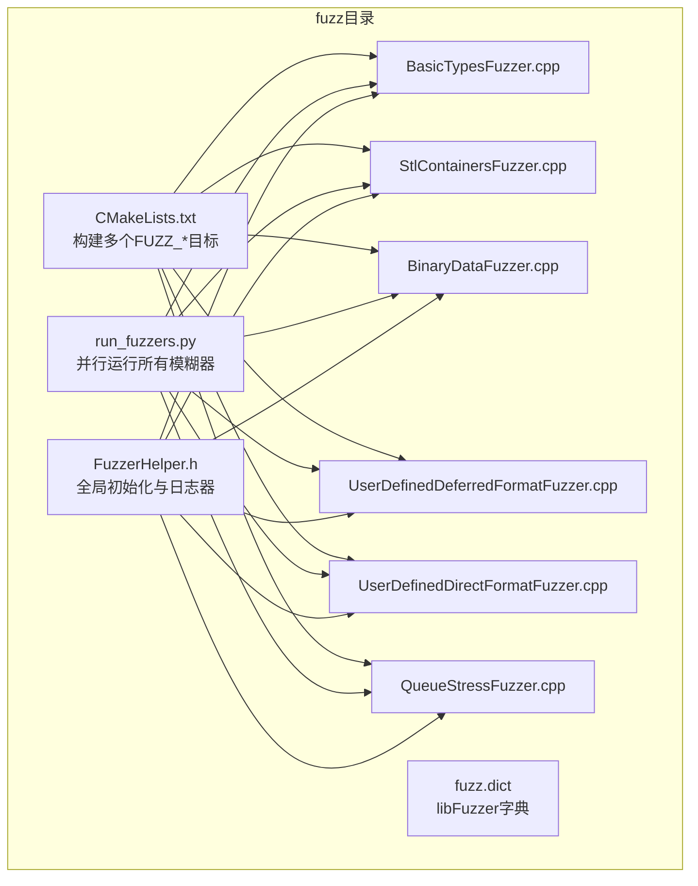
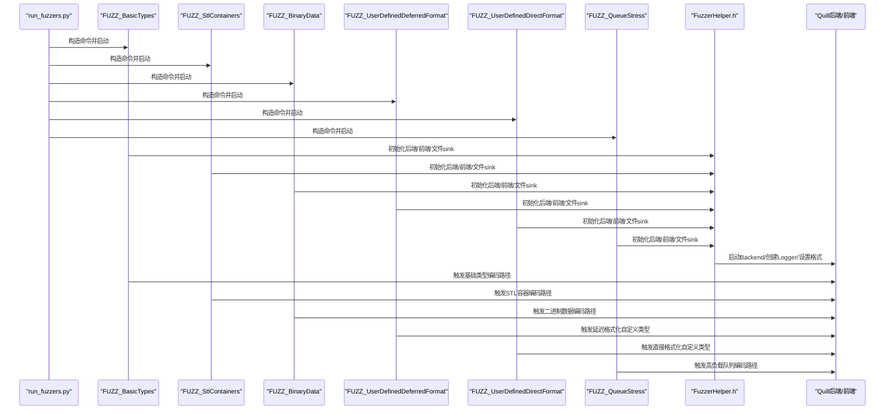
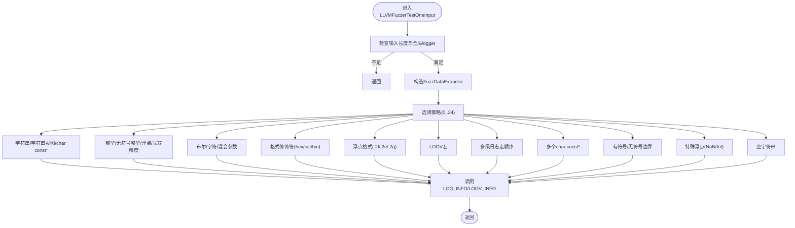
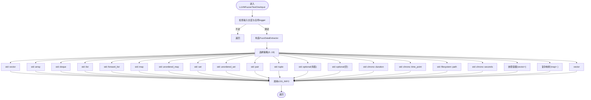
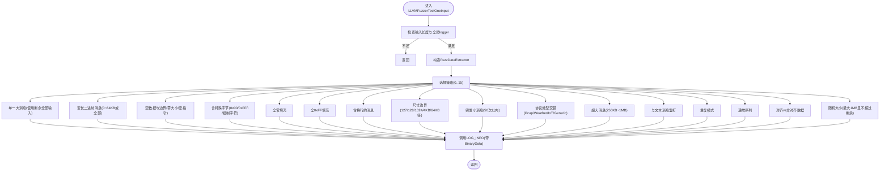
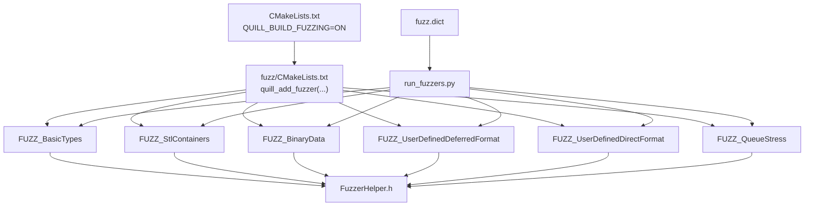

# 模糊测试

<cite>
**本文引用的文件列表**
- [README.md](file://README.md)
- [CMakeLists.txt](file://CMakeLists.txt)
- [fuzz/CMakeLists.txt](file://fuzz/CMakeLists.txt)
- [fuzz/run_fuzzers.py](file://fuzz/run_fuzzers.py)
- [fuzz/fuzz.dict](file://fuzz/fuzz.dict)
- [fuzz/FuzzerHelper.h](file://fuzz/FuzzerHelper.h)
- [fuzz/BasicTypesFuzzer.cpp](file://fuzz/BasicTypesFuzzer.cpp)
- [fuzz/StlContainersFuzzer.cpp](file://fuzz/StlContainersFuzzer.cpp)
- [fuzz/BinaryDataFuzzer.cpp](file://fuzz/BinaryDataFuzzer.cpp)
- [fuzz/UserDefinedDeferredFormatFuzzer.cpp](file://fuzz/UserDefinedDeferredFormatFuzzer.cpp)
- [fuzz/UserDefinedDirectFormatFuzzer.cpp](file://fuzz/UserDefinedDirectFormatFuzzer.cpp)
- [fuzz/QueueStressFuzzer.cpp](file://fuzz/QueueStressFuzzer.cpp)
</cite>

## 目录
1. [简介](#简介)
2. [项目结构](#项目结构)
3. [核心组件](#核心组件)
4. [架构总览](#架构总览)
5. [详细组件分析](#详细组件分析)
6. [依赖关系分析](#依赖关系分析)
7. [性能考量](#性能考量)
8. [故障排查指南](#故障排查指南)
9. [结论](#结论)
10. [附录](#附录)

## 简介
本指南面向Quill日志库的模糊测试体系，系统阐述其在异步日志场景下的安全与稳定性验证方法。通过libFuzzer驱动的多类模糊器，覆盖基础类型、STL容器、二进制协议、用户自定义类型（延迟/直接格式化）、以及高负载队列压力等关键路径，结合脚本化的并行执行、字典辅助与崩溃分析流程，帮助开发者高效发现潜在内存安全问题与异常输入处理缺陷。

## 项目结构
Quill的模糊测试位于仓库根目录的fuzz子目录中，包含：
- 多个独立的libFuzzer入口：基础类型、STL容器、二进制数据、用户自定义类型（延迟/直接格式化）、队列压力等
- 通用辅助头文件：初始化后端、前端、文件输出、刷新策略等
- 构建脚本：CMake函数封装、Python运行器、字典文件
- README中明确标注了该库“经受广泛模糊测试”的事实，体现对模糊测试的重视

图表来源
- [fuzz/CMakeLists.txt:1-25](file://fuzz/CMakeLists.txt#L1-L25)
- [fuzz/run_fuzzers.py:103-110](file://fuzz/run_fuzzers.py#L103-L110)
- [fuzz/FuzzerHelper.h:1-86](file://fuzz/FuzzerHelper.h#L1-L86)

章节来源
- [README.md:94-96](file://README.md#L94-L96)
- [fuzz/CMakeLists.txt:1-25](file://fuzz/CMakeLists.txt#L1-L25)

## 核心组件
- 构建与编译选项
  - 通过CMake选项启用模糊测试构建，并要求Clang编译器
  - 各FUZZ_*目标均链接quill库并开启libFuzzer、AddressSanitizer、UndefinedBehaviorSanitizer
- 运行器
  - Python脚本自动发现fuzzer二进制，支持按时间或迭代次数运行，支持RSS限制、泄漏检测、字典注入
  - 并行运行所有模糊器，汇总统计与错误上下文
- 辅助头文件
  - 统一初始化后端、前端、文件sink与模式格式化
  - 支持二进制模式与文本模式切换，控制立即刷新阈值
- 字典
  - 提供常见格式符、边界值、字符串、特殊字符、数字与UTF-8序列等，提升生成效率

章节来源
- [CMakeLists.txt:38-42](file://CMakeLists.txt#L38-L42)
- [fuzz/CMakeLists.txt:7-16](file://fuzz/CMakeLists.txt#L7-L16)
- [fuzz/run_fuzzers.py:103-110](file://fuzz/run_fuzzers.py#L103-L110)
- [fuzz/run_fuzzers.py:125-161](file://fuzz/run_fuzzers.py#L125-L161)
- [fuzz/FuzzerHelper.h:14-84](file://fuzz/FuzzerHelper.h#L14-L84)
- [fuzz/fuzz.dict:1-73](file://fuzz/fuzz.dict#L1-L73)

## 架构总览
模糊测试系统由“构建层-运行层-被测层”组成：
- 构建层：CMake函数统一添加FUZZ_*可执行目标，设置sanitizer与链接
- 运行层：Python脚本并行启动各fuzzer，注入字典，监控资源与超时，收集输出与错误
- 被测层：每个fuzzer通过FuzzerHelper.h完成全局初始化，随后调用不同编码路径进行日志写入

图表来源
- [fuzz/run_fuzzers.py:137-161](file://fuzz/run_fuzzers.py#L137-L161)
- [fuzz/FuzzerHelper.h:27-84](file://fuzz/FuzzerHelper.h#L27-L84)
- [fuzz/CMakeLists.txt:19-24](file://fuzz/CMakeLists.txt#L19-L24)

## 详细组件分析

### 基础类型模糊测试器（BasicTypesFuzzer）
- 目标：覆盖基本算术类型、字符串、字符串视图、指针、布尔、字符、混合参数、格式修饰符、多级日志宏、边界值、特殊浮点值、空串等
- 数据提取器：从输入流中按需抽取字节、整数、浮点、字符串等，避免越界
- 编码路径：通过LOG_INFO与LOGV_INFO触发基础类型与格式化路径，覆盖hex/oct/bin、浮点格式、多参数组合
- 异常输入：边界值、NaN/Inf、空字符串、混合类型、多级日志宏顺序

图表来源
- [fuzz/BasicTypesFuzzer.cpp:167-366](file://fuzz/BasicTypesFuzzer.cpp#L167-L366)

章节来源
- [fuzz/BasicTypesFuzzer.cpp:1-367](file://fuzz/BasicTypesFuzzer.cpp#L1-L367)

### STL容器模糊测试器（StlContainersFuzzer）
- 目标：覆盖std::vector/array/deque/list/forward_list/map/unordered_map/set/unordered_set/pair/tuple/optional/chrono/time_point/path/嵌套容器/复杂映射/字符串向量等
- 数据提取器：按需抽取字节、整数、双精度、字符串、宽字符串
- 编码路径：通过LOG_INFO触发容器到字符串的格式化，覆盖嵌套、复杂键值、时间点、路径等

图表来源
- [fuzz/StlContainersFuzzer.cpp:126-355](file://fuzz/StlContainersFuzzer.cpp#L126-L355)

章节来源
- [fuzz/StlContainersFuzzer.cpp:1-356](file://fuzz/StlContainersFuzzer.cpp#L1-L356)

### 二进制数据模糊测试器（BinaryDataFuzzer）
- 目标：覆盖二进制数据编码路径，测试Raw二进制写入、大小边界、特殊字节、零填充、全FF、换行、大消息（256KB-1MB）、突发小消息、协议类型交错、重复模式、递增序列、对齐/非对齐、随机大小等
- 自定义类型：为不同协议定义BinaryData<T>并提供自定义formatter与Codec
- 编码路径：通过BinaryDataDeferredFormatCodec触发二进制编码，绕过文本格式化，直接写入原始字节

图表来源
- [fuzz/BinaryDataFuzzer.cpp:194-546](file://fuzz/BinaryDataFuzzer.cpp#L194-L546)

章节来源
- [fuzz/BinaryDataFuzzer.cpp:1-548](file://fuzz/BinaryDataFuzzer.cpp#L1-L548)

### 用户自定义类型（延迟格式化）模糊测试器（UserDefinedDeferredFormatFuzzer）
- 目标：覆盖延迟格式化路径，测试可拷贝类型、无默认构造的可拷贝类型、复杂类型（含std::string/vector）、大型类型（1KB）、空类型、未对齐类型、极大字符串、空容器、无序集合、深层嵌套、多类型混打、大型类型向量等
- 编码路径：通过DeferredFormatCodec触发延迟格式化，适合大对象或需要避免即时拷贝的场景

```mermaid
flowchart TD
Start(["进入LLVMFuzzerTestOneInput"]) --> Check["检查输入长度与全局logger"]
Check --> |不足| Exit["返回"]
Check --> |满足| Extract["构造FuzzDataExtractor"]
Extract --> Select["选择策略(0..23)"]
Select --> TC["TriviallyCopyableType"]
Select --> TCND["TriviallyCopyableNoDefault"]
Select --> Complex["ComplexType(std::string,int,vector<string>)"]
Select --> TCArr["数组[3] TriviallyCopyableType"]
Select --> TCVec["vector<TriviallyCopyableType>"]
Select --> ComplexVec["vector<ComplexType>"]
Select --> ComplexArr["array<ComplexType,2>"]
Select --> ComplexDeq["deque<ComplexType>"]
Select --> TCLst["list<TriviallyCopyableType>"]
Select --> ComplexMap["map<int,ComplexType>"]
Select --> ComplexSet["set<ComplexType>"]
Select --> Pair["pair<ComplexType,TriviallyCopyableType>"]
Select --> LOGV["LOGV_INFO(多种类型)"]
Select --> Mixed["混合: 基本+自定义类型"]
Select --> Nested["vector<pair<int,TriviallyCopyableType>>"]
Select --> Large["LargeType(1KB缓冲区)"]
Select --> Empty["EmptyType"]
Select --> Unaligned["UnalignedType(含padding)"]
Select --> VeryLarge["VeryLargeStringType(可达64KB)"]
Select --> EmptyComplex["ComplexType空容器"]
Select --> USet["unordered_set<int>"]
Select --> DeepNested["map<int,vector<ComplexType>>"]
Select --> Multi5["5个不同类型"]
Select --> VecLarge["vector<LargeType>"]
TC --> Log["调用LOG_INFO"]
TCND --> Log
Complex --> Log
TCArr --> Log
TCVec --> Log
ComplexVec --> Log
ComplexArr --> Log
ComplexDeq --> Log
TCLst --> Log
ComplexMap --> Log
ComplexSet --> Log
Pair --> Log
LOGV --> Log
Mixed --> Log
Nested --> Log
Large --> Log
Empty --> Log
Unaligned --> Log
VeryLarge --> Log
EmptyComplex --> Log
USet --> Log
DeepNested --> Log
Multi5 --> Log
VecLarge --> Log
Log --> End(["返回"])
```

图表来源
- [fuzz/UserDefinedDeferredFormatFuzzer.cpp:299-562](file://fuzz/UserDefinedDeferredFormatFuzzer.cpp#L299-L562)

章节来源
- [fuzz/UserDefinedDeferredFormatFuzzer.cpp:1-563](file://fuzz/UserDefinedDeferredFormatFuzzer.cpp#L1-L563)

### 用户自定义类型（直接格式化）模糊测试器（UserDefinedDirectFormatFuzzer）
- 目标：覆盖直接格式化路径，测试可拷贝类型、复杂类型（含std::string）、枚举（作用域/非作用域）、大型类型（1KB）、空类型、未对齐类型、极大字符串、空容器、无序集合、深层嵌套、多类型混打、大型类型向量等
- 编码路径：通过DirectFormatCodec触发直接格式化，适合简单类型或已知格式的场景

```mermaid
flowchart TD
Start(["进入LLVMFuzzerTestOneInput"]) --> Check["检查输入长度与全局logger"]
Check --> |不足| Exit["返回"]
Check --> |满足| Extract["构造FuzzDataExtractor"]
Extract --> Select["选择策略(0..26)"]
Select --> DF["DirectFormatType(int,double)"]
Select --> DCT["DirectComplexType(std::string,int)"]
Select --> Enum1["Priority(作用域枚举)"]
Select --> Enum2["Status(作用域枚举)"]
Select --> DFArray["数组[3] DirectFormatType"]
Select --> DFVec["vector<DirectFormatType>"]
Select --> DCTVec["vector<DirectComplexType>"]
Select --> DCTArr["array<DirectComplexType,2>"]
Select --> Deq["deque<DirectFormatType>"]
Select --> List["list<DirectComplexType>"]
Select --> Map["map<int,DirectComplexType>"]
Select --> Set["set<DirectComplexType>"]
Select --> UMap["unordered_map<int,DirectComplexType>"]
Select --> EnumVec["vector<Priority>"]
Select --> MixedEnum["枚举+自定义类型"]
Select --> LOGV["LOGV_INFO(多种类型)"]
Select --> AllEnums["打印所有枚举值"]
Select --> NestedVecPair["vector<pair<Status,DirectFormatType>>"]
Select --> LargeDirect["LargeDirectType(1KB)"]
Select --> EmptyDirect["EmptyDirectType"]
Select --> UnalignedDirect["UnalignedDirectType"]
Select --> VeryLargeDirect["VeryLargeStringDirectType(可达64KB)"]
Select --> USetInt["unordered_set<int>"]
Select --> DeepNestedDirect["map<int,vector<DirectFormatType>>"]
Select --> Multi6["6个不同类型"]
Select --> EmptyDirectComplex["DirectComplexType空容器"]
Select --> VecLargeDirect["vector<LargeDirectType>"]
DF --> Log["调用LOG_INFO"]
DCT --> Log
Enum1 --> Log
Enum2 --> Log
DFArray --> Log
DFVec --> Log
DCTVec --> Log
DCTArr --> Log
Deq --> Log
List --> Log
Map --> Log
Set --> Log
UMap --> Log
EnumVec --> Log
MixedEnum --> Log
LOGV --> Log
AllEnums --> Log
NestedVecPair --> Log
LargeDirect --> Log
EmptyDirect --> Log
UnalignedDirect --> Log
VeryLargeDirect --> Log
USetInt --> Log
DeepNestedDirect --> Log
Multi6 --> Log
EmptyDirectComplex --> Log
VecLargeDirect --> Log
Log --> End(["返回"])
```

图表来源
- [fuzz/UserDefinedDirectFormatFuzzer.cpp:336-627](file://fuzz/UserDefinedDirectFormatFuzzer.cpp#L336-L627)

章节来源
- [fuzz/UserDefinedDirectFormatFuzzer.cpp:1-628](file://fuzz/UserDefinedDirectFormatFuzzer.cpp#L1-L628)

### 队列压力模糊测试器（QueueStressFuzzer）
- 目标：高负载下测试队列增长、环形缓冲wraparound、内存压力、后台滞后、竞态条件、混合消息大小、不同编码路径（基础类型、char const*、char数组、自定义类型、枚举）等
- 特性：提高立即刷新阈值，允许更多消息堆积，从而更真实地模拟高吞吐场景

```mermaid
flowchart TD
Start(["进入LLVMFuzzerTestOneInput"]) --> Check["检查输入长度与全局logger"]
Check --> |不足| Exit["返回"]
Check --> |满足| Extract["构造FuzzDataExtractor"]
Extract --> Strategy["选择策略(0..23)"]
Strategy --> S0["单一大消息(使用剩余全部输入)"]
Strategy --> S1["多变长消息(1~64KB或全部)"]
Strategy --> S2["快速小消息循环(最多100次)"]
Strategy --> S3["交替小/大消息"]
Strategy --> S4["多参数+变长数据"]
Strategy --> S5["LOGV宏+变长数据"]
Strategy --> S6["接近队列容量的消息"]
Strategy --> S7["变体格式修饰符"]
Strategy --> S8["超大消息(256KB~4MB)"]
Strategy --> S9["不同日志级别宏"]
Strategy --> S10["空与极小消息"]
Strategy --> S11["含特殊/控制字符"]
Strategy --> S12["突发中等消息(50次以内)"]
Strategy --> S13["队列容量边界(2KB/4KB/8KB/16KB/32KB等)"]
Strategy --> S14["LOG与LOGV交错"]
Strategy --> S15["触发队列扩容序列"]
Strategy --> S16["所有算术类型stress"]
Strategy --> S17["char const*(null终止)"]
Strategy --> S18["char数组stress"]
Strategy --> S19["延迟格式化自定义类型"]
Strategy --> S20["直接格式化自定义类型"]
Strategy --> S21["枚举类型(作用域/非作用域)"]
Strategy --> S22["单条消息混打多种类型"]
Strategy --> S23["字符串类型变体(std::string/char const*/std::string_view)"]
S0 --> Log["调用LOG_INFO"]
S1 --> Log
S2 --> Log
S3 --> Log
S4 --> Log
S5 --> Log
S6 --> Log
S7 --> Log
S8 --> Log
S9 --> Log
S10 --> Log
S11 --> Log
S12 --> Log
S13 --> Log
S14 --> Log
S15 --> Log
S16 --> Log
S17 --> Log
S18 --> Log
S19 --> Log
S20 --> Log
S21 --> Log
S22 --> Log
S23 --> Log
Log --> End(["返回"])
```

图表来源
- [fuzz/QueueStressFuzzer.cpp:328-868](file://fuzz/QueueStressFuzzer.cpp#L328-L868)

章节来源
- [fuzz/QueueStressFuzzer.cpp:1-869](file://fuzz/QueueStressFuzzer.cpp#L1-L869)

### 通用辅助与运行器
- FuzzerHelper.h
  - 定义全局logger与初始化逻辑，支持二进制模式与文本模式切换
  - 设置后端选项（如可选禁用可打印字符检查）、文件sink打开模式、立即刷新阈值
  - 通过宏定义控制日志文件名与是否启用二进制模式
- run_fuzzers.py
  - 自动发现fuzzer目录，支持构建目录与实际fuzzer目录两种形式
  - 并行运行所有FUZZ_*目标，支持按秒或迭代次数运行、RSS限制、泄漏检测、字典注入
  - 解析输出中的运行次数、错误模式并汇总报告

章节来源
- [fuzz/FuzzerHelper.h:10-84](file://fuzz/FuzzerHelper.h#L10-L84)
- [fuzz/run_fuzzers.py:125-161](file://fuzz/run_fuzzers.py#L125-L161)
- [fuzz/run_fuzzers.py:226-262](file://fuzz/run_fuzzers.py#L226-L262)
- [fuzz/run_fuzzers.py:285-333](file://fuzz/run_fuzzers.py#L285-L333)

## 依赖关系分析
- 构建依赖
  - CMake选项QUILL_BUILD_FUZZING启用fuzz子目录；Clang编译器要求
  - 各FUZZ_*目标链接quill库并启用libFuzzer与sanitizers
- 运行依赖
  - Python脚本依赖标准库与subprocess，用于并发执行与输出解析
  - 字典文件提供常见令牌，提升生成效率
- 内部依赖
  - 所有fuzzer共享FuzzerHelper.h，确保一致的初始化与sink配置

图表来源
- [CMakeLists.txt:174-180](file://CMakeLists.txt#L174-L180)
- [fuzz/CMakeLists.txt:1-25](file://fuzz/CMakeLists.txt#L1-L25)
- [fuzz/run_fuzzers.py:103-110](file://fuzz/run_fuzzers.py#L103-L110)
- [fuzz/fuzz.dict:1-73](file://fuzz/fuzz.dict#L1-L73)

章节来源
- [CMakeLists.txt:38-42](file://CMakeLists.txt#L38-L42)
- [fuzz/CMakeLists.txt:1-25](file://fuzz/CMakeLists.txt#L1-L25)
- [fuzz/run_fuzzers.py:394-447](file://fuzz/run_fuzzers.py#L394-L447)
- [fuzz/fuzz.dict:1-73](file://fuzz/fuzz.dict#L1-L73)

## 性能考量
- 队列压力模糊器通过提高立即刷新阈值，允许更多消息堆积，从而更真实地模拟高吞吐场景，但会增加内存占用与后台滞后风险
- 字典注入显著提升生成效率，减少无效输入，缩短收敛时间
- 并行运行所有模糊器可充分利用多核资源，但需合理设置RSS限制，避免系统资源耗尽
- 启用泄漏检测会降低速度，建议仅在定位阶段开启

## 故障排查指南
- 常见错误模式识别
  - 运行器会扫描输出中的断言失败、AddressSanitizer、LeakSanitizer、UndefinedBehaviorSanitizer、libFuzzer致命错误、致命信号、运行时错误等关键词，并附带上下文
- 日志与输出
  - 每个fuzzer将日志写入独立文件（文本或二进制），便于后续人工复现与分析
- 复现步骤
  - 使用相同输入作为libFuzzer的seed，或在本地手动构造最小化输入
  - 结合sanitizer输出定位具体调用栈与越界位置
- 建议修复策略
  - 对于越界访问：检查边界条件、长度计算与容器扩容逻辑
  - 对于格式化异常：校验格式修饰符与参数数量一致性
  - 对于二进制编码：确保size header与数据长度匹配，避免空指针与零长度误用
  - 对于队列压力：优化队列增长策略、wraparound处理与后台线程调度

章节来源
- [fuzz/run_fuzzers.py:112-123](file://fuzz/run_fuzzers.py#L112-L123)
- [fuzz/run_fuzzers.py:247-262](file://fuzz/run_fuzzers.py#L247-L262)
- [fuzz/run_fuzzers.py:325-333](file://fuzz/run_fuzzers.py#L325-L333)

## 结论
Quill的模糊测试体系通过多路径、多类型的libFuzzer入口，配合统一的初始化与运行器，实现了对基础类型、STL容器、二进制数据、用户自定义类型以及高负载队列的全面覆盖。借助字典与并行执行，系统能在较短时间内发现内存安全问题与异常输入处理缺陷，为生产环境的稳定性提供坚实保障。

## 附录
- 快速开始
  - 启用模糊测试构建：在CMake配置中设置QUILL_BUILD_FUZZING=ON并使用Clang
  - 构建：cmake --build . --target FUZZ_* 或直接构建fuzz子目录
  - 运行：python3 fuzz/run_fuzzers.py --duration 600 或 --runs 100000
  - 分析：查看各fuzzer输出文件与运行器汇总报告，结合sanitizer输出定位问题
- 参考
  - README中明确标注该库“经受广泛模糊测试”的事实，体现对模糊测试的重视

章节来源
- [README.md:94-96](file://README.md#L94-L96)
- [CMakeLists.txt:38-42](file://CMakeLists.txt#L38-L42)
- [fuzz/run_fuzzers.py:5-68](file://fuzz/run_fuzzers.py#L5-L68)