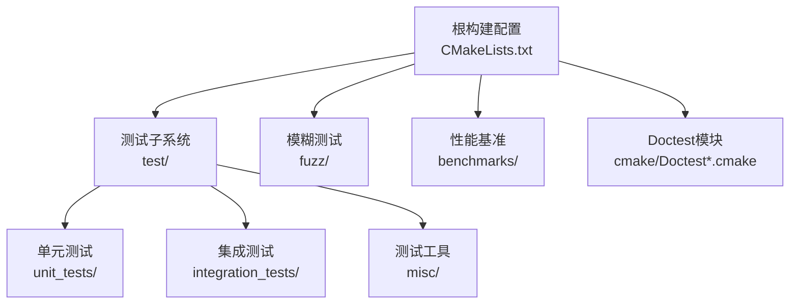
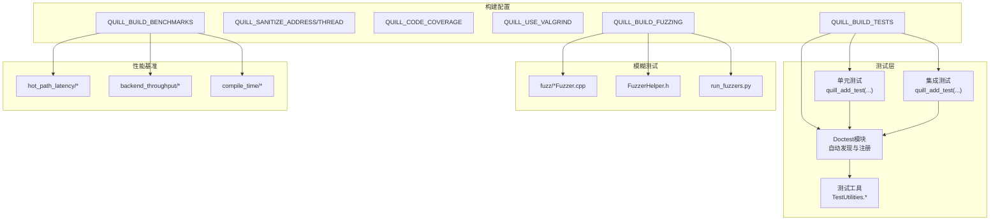
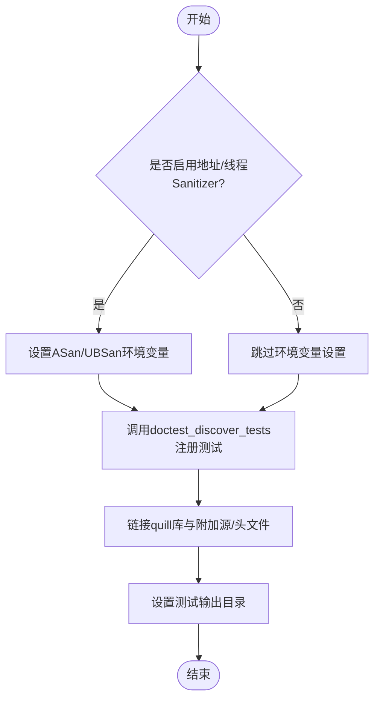
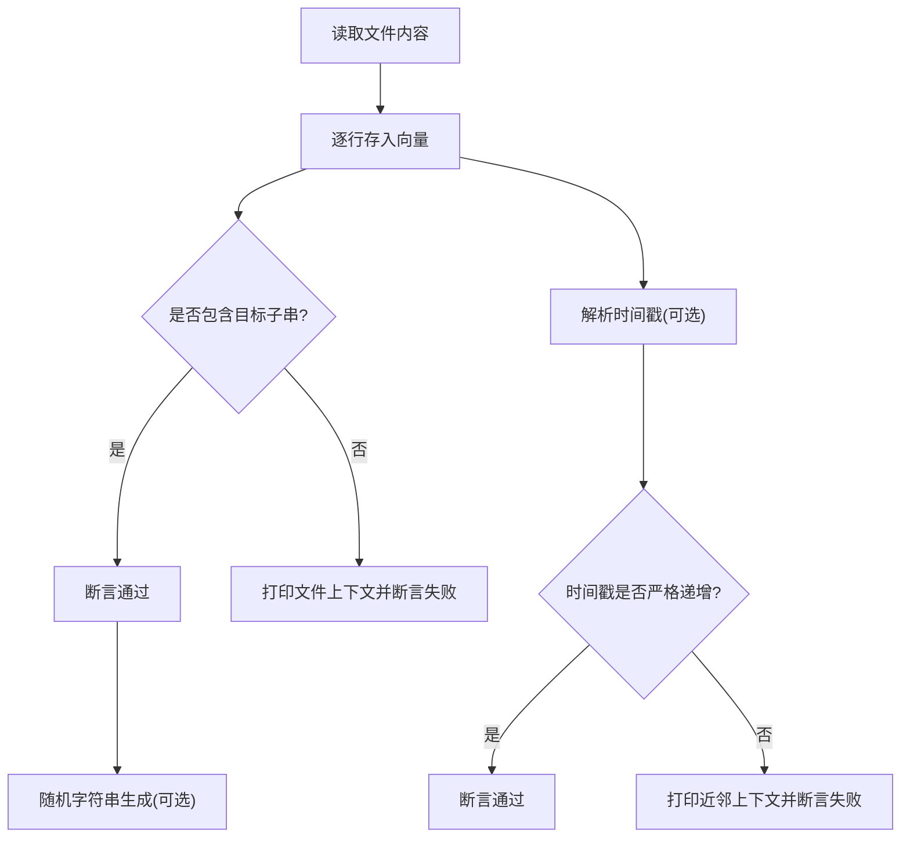
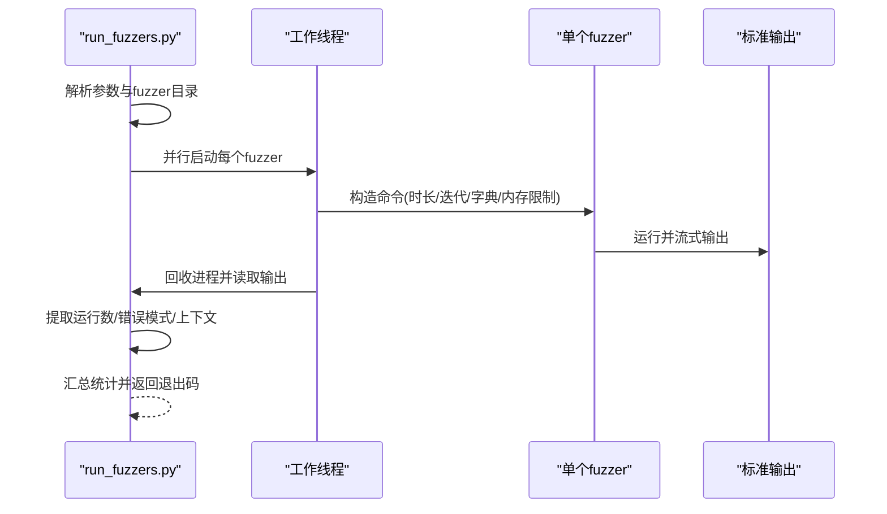
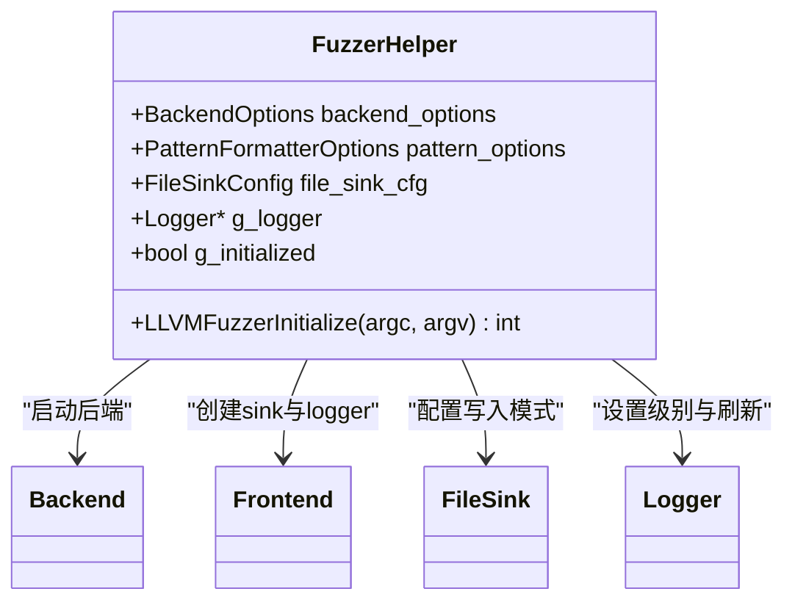
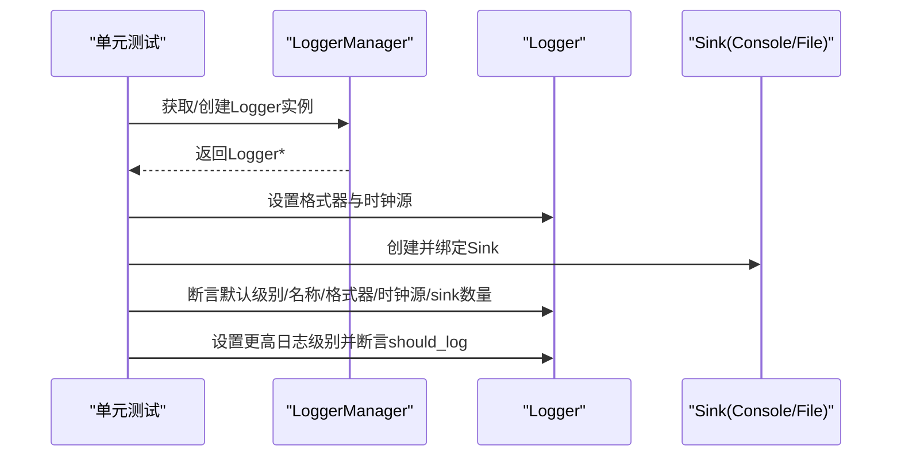
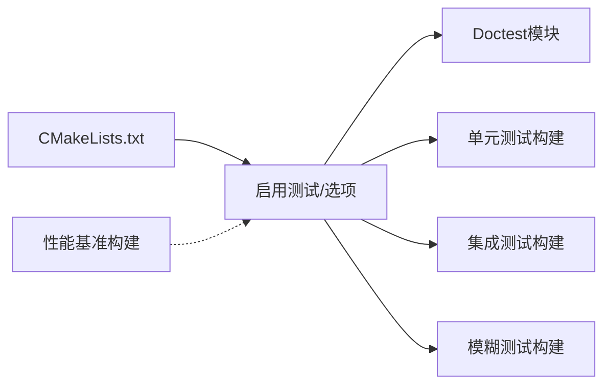

# 测试与调试

<cite>
**本文引用的文件**
- [CMakeLists.txt](file://CMakeLists.txt)
- [Doctest.cmake](file://cmake/Doctest.cmake)
- [DoctestAddTests.cmake](file://cmake/DoctestAddTests.cmake)
- [unit_tests/CMakeLists.txt](file://test/unit_tests/CMakeLists.txt)
- [integration_tests/CMakeLists.txt](file://test/integration_tests/CMakeLists.txt)
- [test/CMakeLists.txt](file://test/CMakeLists.txt)
- [TestUtilities.h](file://test/misc/TestUtilities.h)
- [TestUtilities.cpp](file://test/misc/TestUtilities.cpp)
- [LoggerTest.cpp](file://test/unit_tests/LoggerTest.cpp)
- [SingleFrontendThreadTest.cpp](file://test/integration_tests/SingleFrontendThreadTest.cpp)
- [FuzzerHelper.h](file://fuzz/FuzzerHelper.h)
- [fuzz/CMakeLists.txt](file://fuzz/CMakeLists.txt)
- [run_fuzzers.py](file://fuzz/run_fuzzers.py)
- [benchmarks/CMakeLists.txt](file://benchmarks/CMakeLists.txt)
</cite>

## 目录
1. [引言](#引言)
2. [项目结构](#项目结构)
3. [核心组件](#核心组件)
4. [架构总览](#架构总览)
5. [详细组件分析](#详细组件分析)
6. [依赖分析](#依赖分析)
7. [性能考虑](#性能考虑)
8. [故障排除指南](#故障排除指南)
9. [结论](#结论)
10. [附录](#附录)

## 引言
本指南面向Quill项目的开发者与维护者，系统性介绍测试与调试体系：单元测试、集成测试、模糊测试与性能基准，并提供测试工具与实用程序的使用方法、调试技巧与故障排除策略，以及持续集成与质量保障建议。目标是帮助团队在高并发、低延迟的日志子系统中保持高质量与稳定性。

## 项目结构
Quill的测试与调试相关目录与文件组织如下：
- 单元测试与集成测试：位于 test/ 下，分别在 unit_tests/ 与 integration_tests/ 中，均通过自定义函数封装构建与测试发现逻辑。
- 测试工具与实用程序：位于 test/misc/，提供文件读取、内容搜索、随机字符串生成、时间戳解析与顺序校验等能力。
- 模糊测试：位于 fuzz/，包含多个libFuzzer驱动的fuzzer与运行脚本。
- 性能基准：位于 benchmarks/，包含热路径延迟、后端吞吐、编译时开销等子目录。
- 构建与测试框架：通过CMake选项控制启用测试、覆盖率、Sanitizer、Valgrind等；Doctest测试框架通过自定义模块实现自动测试发现与属性设置。

图表来源
- [CMakeLists.txt](file://CMakeLists.txt)
- [test/CMakeLists.txt](file://test/CMakeLists.txt)
- [fuzz/CMakeLists.txt](file://fuzz/CMakeLists.txt)
- [benchmarks/CMakeLists.txt](file://benchmarks/CMakeLists.txt)

章节来源
- [CMakeLists.txt](file://CMakeLists.txt)
- [test/CMakeLists.txt](file://test/CMakeLists.txt)

## 核心组件
- 测试框架与自动发现
  - 使用Doctest作为测试框架，配合自定义CMake模块实现“构建后自动发现测试用例”，并通过CTest注册，支持细粒度测试结果与标签管理。
- 单元测试与集成测试
  - 通过统一的quill_add_test函数封装编译选项、头文件包含、链接库、输出目录与测试发现，确保一致性与可维护性。
- 测试工具与断言辅助
  - 提供文件内容读取、文本匹配、随机字符串生成、时间戳解析与有序性校验等工具，便于集成测试中对日志文件进行断言。
- 模糊测试
  - 多个独立fuzzer，覆盖基础类型、STL容器、用户自定义类型（直接/延迟格式化）、队列压力与二进制数据；配套Python脚本并行运行、统计与错误提取。
- 性能基准
  - 覆盖热路径延迟、后端吞吐、编译时开销等维度，支撑性能回归与优化验证。

章节来源
- [Doctest.cmake](file://cmake/Doctest.cmake)
- [DoctestAddTests.cmake](file://cmake/DoctestAddTests.cmake)
- [unit_tests/CMakeLists.txt](file://test/unit_tests/CMakeLists.txt)
- [integration_tests/CMakeLists.txt](file://test/integration_tests/CMakeLists.txt)
- [TestUtilities.h](file://test/misc/TestUtilities.h)
- [TestUtilities.cpp](file://test/misc/TestUtilities.cpp)
- [fuzz/CMakeLists.txt](file://fuzz/CMakeLists.txt)
- [run_fuzzers.py](file://fuzz/run_fuzzers.py)
- [benchmarks/CMakeLists.txt](file://benchmarks/CMakeLists.txt)

## 架构总览
下图展示测试与调试在构建与执行层面的整体关系：CMake根据选项启用测试、Sanitizer、覆盖率与Valgrind；Doctest模块负责测试发现与注册；单元/集成测试与模糊测试各自独立构建并由CTest统一调度；性能基准独立构建用于回归对比。

图表来源
- [CMakeLists.txt](file://CMakeLists.txt)
- [Doctest.cmake](file://cmake/Doctest.cmake)
- [DoctestAddTests.cmake](file://cmake/DoctestAddTests.cmake)
- [unit_tests/CMakeLists.txt](file://test/unit_tests/CMakeLists.txt)
- [integration_tests/CMakeLists.txt](file://test/integration_tests/CMakeLists.txt)
- [TestUtilities.h](file://test/misc/TestUtilities.h)
- [TestUtilities.cpp](file://test/misc/TestUtilities.cpp)
- [fuzz/CMakeLists.txt](file://fuzz/CMakeLists.txt)
- [run_fuzzers.py](file://fuzz/run_fuzzers.py)
- [benchmarks/CMakeLists.txt](file://benchmarks/CMakeLists.txt)

## 详细组件分析

### 单元测试与集成测试构建与发现
- 统一构建函数
  - 单元测试与集成测试均通过quill_add_test函数完成：设置通用编译选项、合并附加源码与头文件、配置包含目录、链接主库、设置输出目录、调用doctest_discover_tests注册到CTest。
- Sanitizer与环境变量
  - 当启用QUILL_SANITIZE_ADDRESS时，通过ENVIRONMENT属性向CTest注入ASan/UBSan相关选项，提升内存与未定义行为问题的检出能力。
- 原子性与平台差异
  - 集成测试在缺少C++原子特性时自动链接atomic库，保证跨平台可用性。
- 扩展测试开关
  - 可通过QUILL_ENABLE_EXTENSIVE_TESTS开启资源密集型测试集。

图表来源
- [unit_tests/CMakeLists.txt](file://test/unit_tests/CMakeLists.txt)
- [integration_tests/CMakeLists.txt](file://test/integration_tests/CMakeLists.txt)
- [Doctest.cmake](file://cmake/Doctest.cmake)
- [DoctestAddTests.cmake](file://cmake/DoctestAddTests.cmake)

章节来源
- [unit_tests/CMakeLists.txt](file://test/unit_tests/CMakeLists.txt)
- [integration_tests/CMakeLists.txt](file://test/integration_tests/CMakeLists.txt)
- [Doctest.cmake](file://cmake/Doctest.cmake)
- [DoctestAddTests.cmake](file://cmake/DoctestAddTests.cmake)

### 测试工具与断言验证
- 文件与内容处理
  - file_contents/wfile_contents：将文件逐行读入向量，便于断言与遍历。
  - file_contains：在文件向量中检索子串，失败时打印上下文以辅助诊断。
- 文件操作
  - create_file/remove_file：快速创建/删除临时文件，避免外部依赖。
- 随机数据生成
  - gen_random_strings：按指定长度范围生成随机字符串序列，用于压力与边界测试。
- 时间戳解析与顺序校验
  - parse_timestamp：从日志时间戳字符串解析纳秒级时间点。
  - is_timestamp_ordered：检查日志片段的时间戳是否严格递增，失败时打印附近上下文以定位异常点。

图表来源
- [TestUtilities.h](file://test/misc/TestUtilities.h)
- [TestUtilities.cpp](file://test/misc/TestUtilities.cpp)

章节来源
- [TestUtilities.h](file://test/misc/TestUtilities.h)
- [TestUtilities.cpp](file://test/misc/TestUtilities.cpp)

### 模糊测试与运行脚本
- fuzzer清单与编译
  - fuzz/CMakeLists.txt定义了多个独立fuzzer目标，统一添加Address/Undefined Sanitizer与libFuzzer，输出至build/test目录。
- 运行脚本
  - run_fuzzers.py支持并行运行所有或指定fuzzer，基于时间或迭代次数控制运行时长，自动提取运行数、统计错误模式并汇总结果。
- 错误识别
  - 通过预设错误模式（如AddressSanitizer/UndefinedBehaviorSanitizer/LeakSanitizer等）在输出中匹配并截取上下文，便于快速定位问题。
- 字典与内存限制
  - 支持传入字典加速输入探索；通过RSS上限限制内存占用，避免长时间运行导致资源耗尽。

图表来源
- [fuzz/CMakeLists.txt](file://fuzz/CMakeLists.txt)
- [run_fuzzers.py](file://fuzz/run_fuzzers.py)

章节来源
- [fuzz/CMakeLists.txt](file://fuzz/CMakeLists.txt)
- [run_fuzzers.py](file://fuzz/run_fuzzers.py)

### 模糊测试辅助与全局初始化
- FuzzerHelper.h
  - 在LLVMFuzzerInitialize中完成后端启动、sink创建、日志级别与刷新策略配置，确保fuzzer运行前的全局状态一致。
  - 支持二进制模式与文本模式切换，便于覆盖不同编码与协议场景。
  - 通过预处理器宏允许定制刷新阈值，平衡运行效率与输入规模。

图表来源
- [FuzzerHelper.h](file://fuzz/FuzzerHelper.h)

章节来源
- [FuzzerHelper.h](file://fuzz/FuzzerHelper.h)

### 典型测试用例示例
- 单元测试：LoggerTest.cpp
  - 验证Logger实例的默认级别、名称、格式器选项、时钟源类型、sink数量与指针一致性；在非禁用异常环境下，验证回溯级别设置抛错。
- 集成测试：SingleFrontendThreadTest.cpp
  - 启动后端线程、预分配前端缓冲、创建文件sink并写入大量日志消息，断言文件行数与内容包含关系，并清理临时文件。

图表来源
- [LoggerTest.cpp](file://test/unit_tests/LoggerTest.cpp)

章节来源
- [LoggerTest.cpp](file://test/unit_tests/LoggerTest.cpp)
- [SingleFrontendThreadTest.cpp](file://test/integration_tests/SingleFrontendThreadTest.cpp)

## 依赖分析
- 构建选项与测试耦合
  - QUILL_BUILD_TESTS启用测试子系统；QUILL_SANITIZE_ADDRESS/THREAD影响测试执行时的Sanitizer配置；QUILL_CODE_COVERAGE与QUILL_USE_VALGRIND分别控制覆盖率与内存检查工具。
- 测试发现与注册
  - Doctest模块通过post-build查询测试用例列表并生成CTest脚本，实现无需重新配置即可更新测试集。
- 模糊测试与编译器要求
  - QUILL_BUILD_FUZZING需要Clang编译器，且fuzzer目标启用libFuzzer与Address/Undefined Sanitizer。
- 性能基准与测试并行
  - benchmarks子目录独立构建，不干扰测试生命周期，但可与CI结合进行回归对比。

图表来源
- [CMakeLists.txt](file://CMakeLists.txt)
- [Doctest.cmake](file://cmake/Doctest.cmake)
- [DoctestAddTests.cmake](file://cmake/DoctestAddTests.cmake)
- [fuzz/CMakeLists.txt](file://fuzz/CMakeLists.txt)
- [benchmarks/CMakeLists.txt](file://benchmarks/CMakeLists.txt)

章节来源
- [CMakeLists.txt](file://CMakeLists.txt)
- [Doctest.cmake](file://cmake/Doctest.cmake)
- [DoctestAddTests.cmake](file://cmake/DoctestAddTests.cmake)
- [fuzz/CMakeLists.txt](file://fuzz/CMakeLists.txt)
- [benchmarks/CMakeLists.txt](file://benchmarks/CMakeLists.txt)

## 性能考虑
- 热路径延迟
  - 通过专用基准测量热点路径的时延，关注不同时间源、格式化策略与缓冲配置的影响。
- 后端吞吐
  - 在无缓冲与有缓冲场景下评估后端写入吞吐，结合队列容量与刷新策略进行权衡。
- 编译时开销
  - 通过编译时间基准评估模板展开与编译器优化对构建时间的影响，指导宏开关与模板深度的取舍。
- 建议
  - 将性能基准纳入CI的定时任务，建立历史趋势图，及时发现回归。
  - 对关键路径采用内联与SIMD优化（若适用），并在测试中保留回归用例。

## 故障排除指南
- 内存与未定义行为
  - 启用QUILL_SANITIZE_ADDRESS/THREAD，在测试阶段捕获越界访问、悬垂指针与竞态条件；结合ASan/UBSan输出定位问题。
- 内存泄漏
  - 在本地或CI中启用QUILL_USE_VALGRIND，使用CTest的memcheck动作进行全量泄漏检查；或在模糊测试中启用detect_leaks以降低误报。
- 日志顺序与时序
  - 使用TestUtilities中的时间戳解析与顺序校验工具，快速定位乱序点并打印上下文。
- 模糊测试异常
  - 通过run_fuzzers.py的错误模式匹配与上下文截取，快速复现并缩小问题范围；必要时增加字典或调整RSS限制。
- 并发与死锁
  - 在集成测试中模拟多线程与高负载，结合Sanitizer与日志顺序校验，排查阻塞与竞争条件。

章节来源
- [CMakeLists.txt](file://CMakeLists.txt)
- [TestUtilities.cpp](file://test/misc/TestUtilities.cpp)
- [run_fuzzers.py](file://fuzz/run_fuzzers.py)

## 结论
Quill的测试与调试体系以Doctest为核心，辅以CMake自动化发现、Sanitizer与Valgrind、模糊测试与性能基准，形成从单元到集成、从静态到动态、从功能到性能的完整质量保障闭环。通过统一的构建函数与测试工具，开发者可以高效编写、稳定运行与快速定位问题，确保在高并发与低延迟场景下的可靠性与可维护性。

## 附录
- 快速上手
  - 启用测试与Sanitizer：在CMake配置中开启QUILL_BUILD_TESTS与QUILL_SANITIZE_ADDRESS。
  - 运行单元/集成测试：使用ctest或ctest -R <测试名>筛选。
  - 运行模糊测试：先构建fuzz目标，再使用run_fuzzers.py并指定时长或迭代次数。
  - 运行性能基准：构建benchmarks子目录目标，按需执行各基准程序并记录结果。
- 最佳实践
  - 将测试用例与被测模块紧密耦合，减少外部依赖。
  - 对关键路径与边界条件编写单元测试，对多线程与I/O场景编写集成测试。
  - 定期运行模糊测试与性能基准，纳入CI回归矩阵。
  - 使用TestUtilities提供的工具进行断言与诊断，提高问题定位效率。