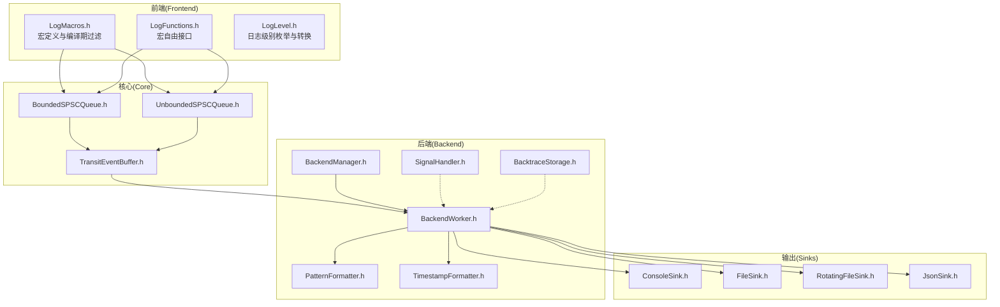
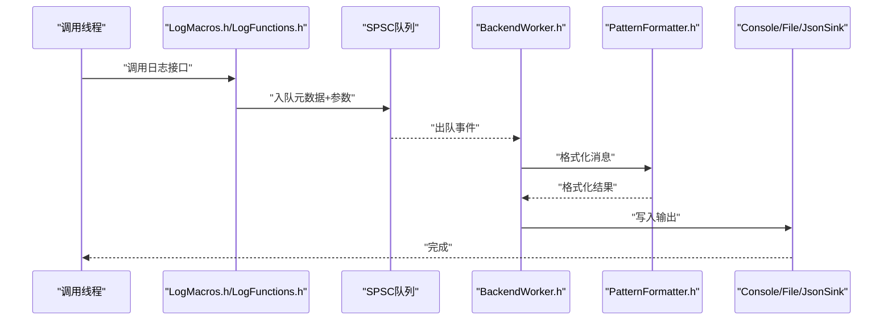
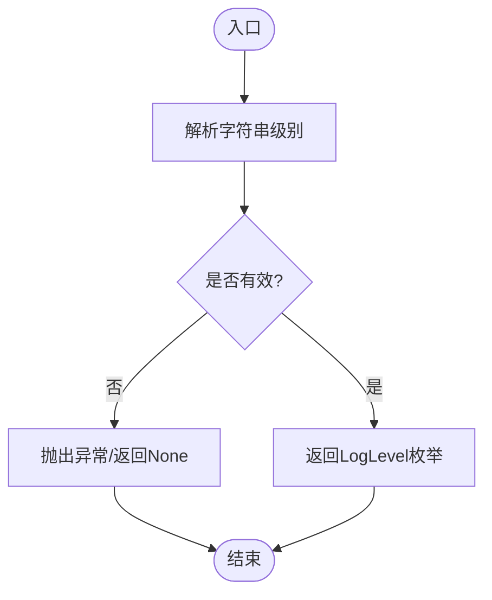
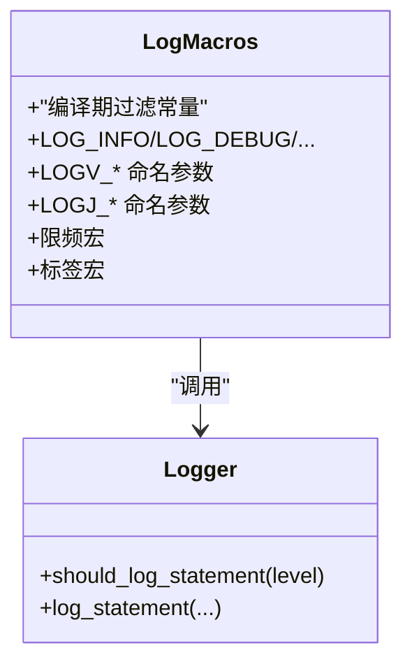
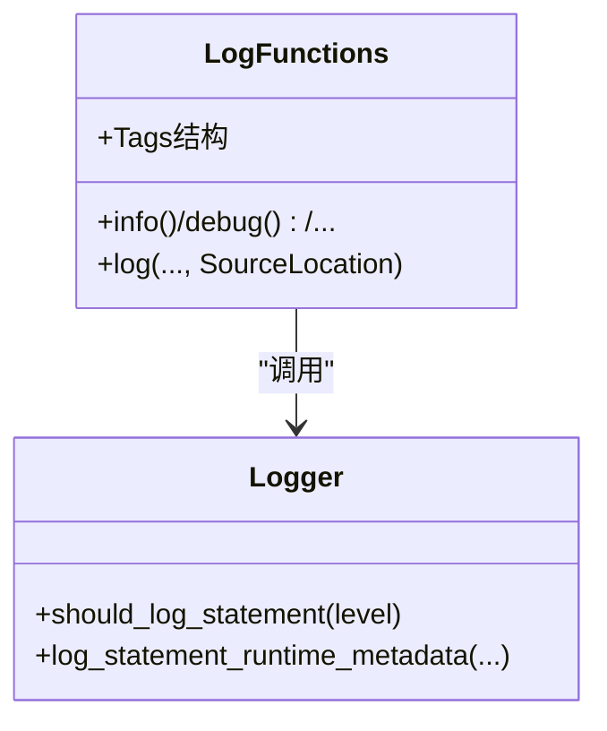
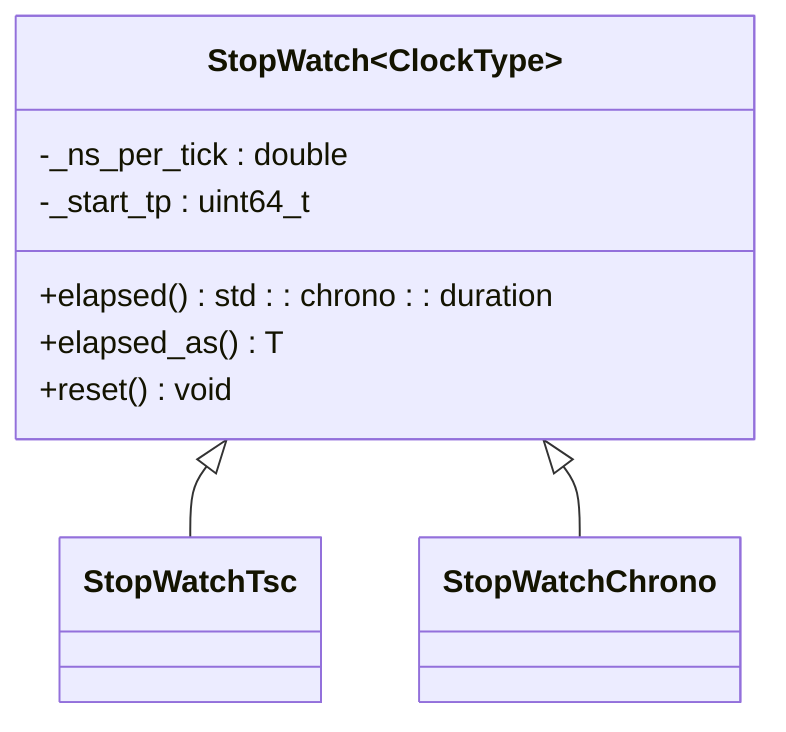
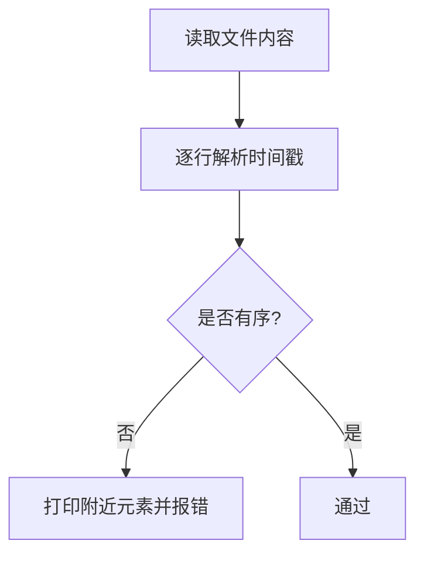
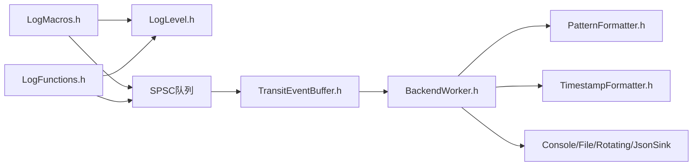

# 调试工具与技巧

<cite>
**本文引用的文件**
- [README.md](file://README.md)
- [StopWatch.h](file://include/quill/StopWatch.h)
- [TestUtilities.h](file://test/misc/TestUtilities.h)
- [TestUtilities.cpp](file://test/misc/TestUtilities.cpp)
- [DocTestExtensions.h](file://test/misc/DocTestExtensions.h)
- [DocTestExtensions.cpp](file://test/misc/DocTestExtensions.cpp)
- [LogLevel.h](file://include/quill/core/LogLevel.h)
- [LogMacros.h](file://include/quill/LogMacros.h)
- [LogFunctions.h](file://include/quill/LogFunctions.h)
- [BackendManager.h](file://include/quill/backend/BackendManager.h)
- [BackendWorker.h](file://include/quill/backend/BackendWorker.h)
- [SignalHandler.h](file://include/quill/backend/SignalHandler.h)
- [BacktraceStorage.h](file://include/quill/backend/BacktraceStorage.h)
- [ConsoleSink.h](file://include/quill/sinks/ConsoleSink.h)
- [FileSink.h](file://include/quill/sinks/FileSink.h)
- [RotatingFileSink.h](file://include/quill/sinks/RotatingFileSink.h)
- [JsonSink.h](file://include/quill/sinks/JsonSink.h)
- [PatternFormatter.h](file://include/quill/backend/PatternFormatter.h)
- [TimestampFormatter.h](file://include/quill/backend/TimestampFormatter.h)
- [TransitEventBuffer.h](file://include/quill/backend/TransitEventBuffer.h)
- [BoundedSPSCQueue.h](file://include/quill/core/BoundedSPSCQueue.h)
- [UnboundedSPSCQueue.h](file://include/quill/core/UnboundedSPSCQueue.h)
- [CMakeLists.txt](file://CMakeLists.txt)
- [Doctest.cmake](file://cmake/Doctest.cmake)
- [DoctestAddTests.cmake](file://cmake/DoctestAddTests.cmake)
- [CodeCoverage.cmake](file://cmake/CodeCoverage.cmake)
- [run_fuzzers.py](file://fuzz/run_fuzzers.py)
- [FuzzerHelper.h](file://fuzz/FuzzerHelper.h)
- [ArithmeticTypesLoggingTest.cpp](file://test/integration_tests/ArithmeticTypesLoggingTest.cpp)
- [BacktraceMultithreadedStressTest.cpp](file://test/integration_tests/BacktraceMultithreadedStressTest.cpp)
- [BoundedDroppingQueueTest.cpp](file://test/integration_tests/BoundedDroppingQueueTest.cpp)
- [BoundedBlockingQueueTest.cpp](file://test/integration_tests/BoundedBlockingQueueTest.cpp)
- [StopWatchTest.cpp](file://test/unit_tests/StopWatchTest.cpp)
- [recommended_usage.cpp](file://examples/recommended_usage/recommended_usage.cpp)
- [console_logging.cpp](file://examples/console_logging.cpp)
- [file_logging.cpp](file://examples/file_logging.cpp)
- [json_console_logging.cpp](file://examples/json_console_logging.cpp)
- [rotating_file_logging.cpp](file://examples/rotating_file_logging.cpp)
- [backtrace_logging.cpp](file://examples/backtrace_logging.cpp)
- [signal_handler.cpp](file://examples/signal_handler.cpp)
- [user_defined_sink.cpp](file://examples/user_defined_sink.cpp)
- [user_defined_filter.cpp](file://examples/user_defined_filter.cpp)
- [custom_frontend_options.cpp](file://examples/custom_frontend_options.cpp)
- [backend_tsc_clock.cpp](file://examples/backend_tsc_clock.cpp)
- [backend_thread_notify.cpp](file://examples/backend_thread_notify.cpp)
- [hot_path_bench.h](file://benchmarks/hot_path_latency/hot_path_bench.h)
- [hot_path_bench_config.h](file://benchmarks/hot_path_latency/hot_path_bench_config.h)
- [quill_backend_throughput.cpp](file://benchmarks/backend_throughput/quill_backend_throughput.cpp)
- [quill_backend_throughput_no_buffering.cpp](file://benchmarks/backend_throughput/quill_backend_throughput_no_buffering.cpp)
- [compile_time_bench.cpp](file://benchmarks/compile_time/compile_time_bench.cpp)
</cite>

## 目录
1. [简介](#简介)
2. [项目结构](#项目结构)
3. [核心组件](#核心组件)
4. [架构总览](#架构总览)
5. [详细组件分析](#详细组件分析)
6. [依赖关系分析](#依赖关系分析)
7. [性能考量](#性能考量)
8. [故障排查指南](#故障排查指南)
9. [结论](#结论)
10. [附录](#附录)

## 简介
本指南聚焦于Quill的调试工具与技巧，覆盖日志系统调试（日志级别、格式化、后端行为）、开发调试工具（测试实用程序、断言扩展、性能计时器）、常见问题诊断（死锁、内存泄漏、性能瓶颈）以及IDE集成与调试环境配置建议。文档同时提供最佳实践与经验总结，帮助开发者建立高效稳定的调试工作流。

## 项目结构
Quill采用分层设计：前端（调用线程）负责将日志元数据与参数推入无锁队列；后端（后台线程）消费队列、格式化并写入各类sink。测试与示例代码贯穿全库，便于验证与演示。

图表来源
- [LogMacros.h](file://include/quill/LogMacros.h)
- [LogFunctions.h](file://include/quill/LogFunctions.h)
- [LogLevel.h](file://include/quill/core/LogLevel.h)
- [BoundedSPSCQueue.h](file://include/quill/core/BoundedSPSCQueue.h)
- [UnboundedSPSCQueue.h](file://include/quill/core/UnboundedSPSCQueue.h)
- [TransitEventBuffer.h](file://include/quill/backend/TransitEventBuffer.h)
- [BackendManager.h](file://include/quill/backend/BackendManager.h)
- [BackendWorker.h](file://include/quill/backend/BackendWorker.h)
- [SignalHandler.h](file://include/quill/backend/SignalHandler.h)
- [BacktraceStorage.h](file://include/quill/backend/BacktraceStorage.h)
- [PatternFormatter.h](file://include/quill/backend/PatternFormatter.h)
- [TimestampFormatter.h](file://include/quill/backend/TimestampFormatter.h)
- [ConsoleSink.h](file://include/quill/sinks/ConsoleSink.h)
- [FileSink.h](file://include/quill/sinks/FileSink.h)
- [RotatingFileSink.h](file://include/quill/sinks/RotatingFileSink.h)
- [JsonSink.h](file://include/quill/sinks/JsonSink.h)

章节来源
- [README.md](file://README.md)
- [CMakeLists.txt](file://CMakeLists.txt)

## 核心组件
- 日志级别与过滤
  - 日志级别枚举与字符串互转，支持编译期过滤以实现零成本日志路径。
  - 参考：[LogLevel.h](file://include/quill/core/LogLevel.h)
- 宏式日志接口
  - 提供多级日志宏、限频宏、命名参数宏、标签宏等，支持编译期剔除低级别日志。
  - 参考：[LogMacros.h](file://include/quill/LogMacros.h)
- 宏自由日志接口
  - 面向需要避免宏的场景，提供函数式封装，但有性能折衷。
  - 参考：[LogFunctions.h](file://include/quill/LogFunctions.h)
- 性能计时器
  - 基于TSC或系统时钟的高精度计时器，用于热点路径性能测量。
  - 参考：[StopWatch.h](file://include/quill/StopWatch.h)
- 测试与断言扩展
  - 文件内容读取、时间戳解析与有序性校验；标准输出/错误捕获；自定义断言宏。
  - 参考：[TestUtilities.h](file://test/misc/TestUtilities.h)、[TestUtilities.cpp](file://test/misc/TestUtilities.cpp)、[DocTestExtensions.h](file://test/misc/DocTestExtensions.h)、[DocTestExtensions.cpp](file://test/misc/DocTestExtensions.cpp)

章节来源
- [LogLevel.h](file://include/quill/core/LogLevel.h)
- [LogMacros.h](file://include/quill/LogMacros.h)
- [LogFunctions.h](file://include/quill/LogFunctions.h)
- [StopWatch.h](file://include/quill/StopWatch.h)
- [TestUtilities.h](file://test/misc/TestUtilities.h)
- [TestUtilities.cpp](file://test/misc/TestUtilities.cpp)
- [DocTestExtensions.h](file://test/misc/DocTestExtensions.h)
- [DocTestExtensions.cpp](file://test/misc/DocTestExtensions.cpp)

## 架构总览
Quill的异步日志架构由“前端-队列-后端-格式化-输出”组成。前端在调用线程快速序列化元数据与参数并入队；后端线程解码、格式化并写入目标sink。该设计使主路径低延迟，同时保证日志可追踪与可分析。

图表来源
- [LogMacros.h](file://include/quill/LogMacros.h)
- [LogFunctions.h](file://include/quill/LogFunctions.h)
- [BoundedSPSCQueue.h](file://include/quill/core/BoundedSPSCQueue.h)
- [UnboundedSPSCQueue.h](file://include/quill/core/UnboundedSPSCQueue.h)
- [BackendWorker.h](file://include/quill/backend/BackendWorker.h)
- [PatternFormatter.h](file://include/quill/backend/PatternFormatter.h)
- [ConsoleSink.h](file://include/quill/sinks/ConsoleSink.h)
- [FileSink.h](file://include/quill/sinks/FileSink.h)
- [JsonSink.h](file://include/quill/sinks/JsonSink.h)

## 详细组件分析

### 组件A：日志级别与过滤
- 设计要点
  - 日志级别从TraceL3到Critical，包含Backtrace与None；字符串到枚举转换带错误处理。
  - 编译期过滤通过宏常量控制，禁用的级别在编译阶段被完全移除，减少分支与元数据实例数量。
- 调试建议
  - 在开发阶段提高日志级别（如TraceL1/Debug），在生产阶段降低级别（Info/Warning）。
  - 使用编译期过滤避免低级别日志影响性能。
- 复杂度与性能
  - 字符串到枚举转换为O(1)匹配，过滤为编译期常量判断，开销极低。

图表来源
- [LogLevel.h](file://include/quill/core/LogLevel.h)

章节来源
- [LogLevel.h](file://include/quill/core/LogLevel.h)
- [LogMacros.h](file://include/quill/LogMacros.h)

### 组件B：宏式日志接口
- 设计要点
  - 提供LOG_*系列宏、LOGV_*命名参数宏、LOGJ_*命名参数宏、限频宏与标签宏。
  - 支持按级别编译期剔除，减少运行时分支与元数据存储。
- 调试建议
  - 使用LOGV_*与LOGJ_*在调试时自动打印变量名与值，提升可观测性。
  - 对高频路径使用限频宏，避免刷屏与性能抖动。
- 复杂度与性能
  - 宏展开在编译期完成，运行时仅做级别判断与入队，零成本日志路径可实现。

图表来源
- [LogMacros.h](file://include/quill/LogMacros.h)

章节来源
- [LogMacros.h](file://include/quill/LogMacros.h)

### 组件C：宏自由日志接口
- 设计要点
  - 通过模板与源位置信息实现函数式日志接口，适合对宏敏感的场景。
  - 运行时复制元数据到后端线程，带来额外开销。
- 调试建议
  - 在需要清晰调用栈或避免宏的模块中使用；性能敏感路径优先使用宏式接口。
- 复杂度与性能
  - 每次调用均进行元数据拷贝与运行时检查，吞吐略降。

图表来源
- [LogFunctions.h](file://include/quill/LogFunctions.h)

章节来源
- [LogFunctions.h](file://include/quill/LogFunctions.h)

### 组件D：性能计时器（StopWatch）
- 设计要点
  - 支持TSC与时钟源两种模式，提供秒级与任意duration类型的elapsed接口，并可重置。
  - 作为可格式化的类型，可直接插入日志。
- 调试建议
  - 在关键路径前后记录StopWatch，统计平均耗时与方差，定位热点。
  - 结合后端TSC时钟选项，获得更精确的时间戳。

图表来源
- [StopWatch.h](file://include/quill/StopWatch.h)

章节来源
- [StopWatch.h](file://include/quill/StopWatch.h)

### 组件E：测试与断言扩展
- 设计要点
  - 文件内容读取、随机字符串生成、时间戳解析与有序性校验。
  - 标准输出/错误捕获，便于验证日志输出。
  - 自定义断言宏（字符串比较、非相等断言）。
- 调试建议
  - 使用文件内容搜索与时间戳有序性校验，快速定位顺序异常。
  - 捕获stdout/stderr，结合日志sink验证控制台输出一致性。

图表来源
- [TestUtilities.cpp](file://test/misc/TestUtilities.cpp)

章节来源
- [TestUtilities.h](file://test/misc/TestUtilities.h)
- [TestUtilities.cpp](file://test/misc/TestUtilities.cpp)
- [DocTestExtensions.h](file://test/misc/DocTestExtensions.h)
- [DocTestExtensions.cpp](file://test/misc/DocTestExtensions.cpp)

## 依赖关系分析
- 前端依赖
  - LogMacros.h/LogFunctions.h依赖LogLevel.h与MacroMetadata，确保级别与元数据一致。
  - 前端通过SPSC队列连接后端，TransitEventBuffer作为中间缓冲。
- 后端依赖
  - BackendWorker.h依赖PatternFormatter.h与TimestampFormatter.h进行格式化。
  - Sink族（Console/File/Rotating/Json）作为最终输出目标。
- 测试与基准
  - 单元测试与集成测试覆盖日志级别、队列行为、回溯日志、限频宏等。
  - 基准测试覆盖热路径延迟、吞吐与编译时间。

图表来源
- [LogMacros.h](file://include/quill/LogMacros.h)
- [LogFunctions.h](file://include/quill/LogFunctions.h)
- [LogLevel.h](file://include/quill/core/LogLevel.h)
- [BoundedSPSCQueue.h](file://include/quill/core/BoundedSPSCQueue.h)
- [UnboundedSPSCQueue.h](file://include/quill/core/UnboundedSPSCQueue.h)
- [TransitEventBuffer.h](file://include/quill/backend/TransitEventBuffer.h)
- [BackendWorker.h](file://include/quill/backend/BackendWorker.h)
- [PatternFormatter.h](file://include/quill/backend/PatternFormatter.h)
- [TimestampFormatter.h](file://include/quill/backend/TimestampFormatter.h)
- [ConsoleSink.h](file://include/quill/sinks/ConsoleSink.h)
- [FileSink.h](file://include/quill/sinks/FileSink.h)
- [RotatingFileSink.h](file://include/quill/sinks/RotatingFileSink.h)
- [JsonSink.h](file://include/quill/sinks/JsonSink.h)

章节来源
- [LogMacros.h](file://include/quill/LogMacros.h)
- [LogFunctions.h](file://include/quill/LogFunctions.h)
- [LogLevel.h](file://include/quill/core/LogLevel.h)
- [BoundedSPSCQueue.h](file://include/quill/core/BoundedSPSCQueue.h)
- [UnboundedSPSCQueue.h](file://include/quill/core/UnboundedSPSCQueue.h)
- [TransitEventBuffer.h](file://include/quill/backend/TransitEventBuffer.h)
- [BackendWorker.h](file://include/quill/backend/BackendWorker.h)
- [PatternFormatter.h](file://include/quill/backend/PatternFormatter.h)
- [TimestampFormatter.h](file://include/quill/backend/TimestampFormatter.h)
- [ConsoleSink.h](file://include/quill/sinks/ConsoleSink.h)
- [FileSink.h](file://include/quill/sinks/FileSink.h)
- [RotatingFileSink.h](file://include/quill/sinks/RotatingFileSink.h)
- [JsonSink.h](file://include/quill/sinks/JsonSink.h)

## 性能考量
- 热点路径优化
  - 使用编译期过滤与零成本日志路径，减少分支与元数据实例。
  - 选择合适的队列模式（有界/无界、阻塞/丢弃）以平衡延迟与内存占用。
- 计时与观测
  - 使用StopWatch测量关键段耗时；结合后端TSC时钟选项提升时间分辨率。
- 基准与回归
  - 利用热路径延迟与吞吐基准，持续监控性能变化；编译时间基准辅助评估宏膨胀。
- 示例参考
  - 热路径延迟与吞吐基准：[hot_path_bench.h](file://benchmarks/hot_path_latency/hot_path_bench.h)、[quill_backend_throughput.cpp](file://benchmarks/backend_throughput/quill_backend_throughput.cpp)
  - 编译时间基准：[compile_time_bench.cpp](file://benchmarks/compile_time/compile_time_bench.cpp)

章节来源
- [StopWatch.h](file://include/quill/StopWatch.h)
- [hot_path_bench.h](file://benchmarks/hot_path_latency/hot_path_bench.h)
- [quill_backend_throughput.cpp](file://benchmarks/backend_throughput/quill_backend_throughput.cpp)
- [compile_time_bench.cpp](file://benchmarks/compile_time/compile_time_bench.cpp)

## 故障排查指南
- 死锁检测
  - 关注队列状态：有界队列在高负载下可能阻塞，需检查队列大小与后端处理速度。
  - 参考：[BoundedDroppingQueueTest.cpp](file://test/integration_tests/BoundedDroppingQueueTest.cpp)、[BoundedBlockingQueueTest.cpp](file://test/integration_tests/BoundedBlockingQueueTest.cpp)
- 内存泄漏排查
  - 使用静态分析与sanitizer（ASan、UBSan、LSan）；关注sink资源释放与后端缓冲生命周期。
  - 参考：项目根README中对sanitizer与fuzz的说明与CI配置。
- 性能瓶颈定位
  - 使用StopWatch与基准测试定位热点；核对日志级别与格式化复杂度。
  - 参考：[StopWatchTest.cpp](file://test/unit_tests/StopWatchTest.cpp)
- 回溯日志与信号处理
  - 启用回溯日志与信号处理器，确保崩溃时保留上下文。
  - 参考：[backtrace_logging.cpp](file://examples/backtrace_logging.cpp)、[signal_handler.cpp](file://examples/signal_handler.cpp)、[BacktraceStorage.h](file://include/quill/backend/BacktraceStorage.h)、[SignalHandler.h](file://include/quill/backend/SignalHandler.h)
- 输出一致性与格式化
  - 使用JSON/文本格式化与自定义sink，结合测试工具验证输出。
  - 参考：[JsonSink.h](file://include/quill/sinks/JsonSink.h)、[PatternFormatter.h](file://include/quill/backend/PatternFormatter.h)

章节来源
- [BoundedDroppingQueueTest.cpp](file://test/integration_tests/BoundedDroppingQueueTest.cpp)
- [BoundedBlockingQueueTest.cpp](file://test/integration_tests/BoundedBlockingQueueTest.cpp)
- [StopWatchTest.cpp](file://test/unit_tests/StopWatchTest.cpp)
- [backtrace_logging.cpp](file://examples/backtrace_logging.cpp)
- [signal_handler.cpp](file://examples/signal_handler.cpp)
- [BacktraceStorage.h](file://include/quill/backend/BacktraceStorage.h)
- [SignalHandler.h](file://include/quill/backend/SignalHandler.h)
- [JsonSink.h](file://include/quill/sinks/JsonSink.h)
- [PatternFormatter.h](file://include/quill/backend/PatternFormatter.h)

## 结论
通过合理使用日志级别与编译期过滤、宏式/宏自由接口、StopWatch计时器与测试工具，配合回溯日志与信号处理，开发者可以构建高效且可维护的调试工作流。结合基准测试与队列策略，可在性能与可观测性之间取得平衡。

## 附录
- 快速开始与示例
  - 推荐用法与宏式/宏自由接口示例：[recommended_usage.cpp](file://examples/recommended_usage/recommended_usage.cpp)
  - 控制台/文件/JSON/轮转日志示例：[console_logging.cpp](file://examples/console_logging.cpp)、[file_logging.cpp](file://examples/file_logging.cpp)、[json_console_logging.cpp](file://examples/json_console_logging.cpp)、[rotating_file_logging.cpp](file://examples/rotating_file_logging.cpp)
- 测试框架与覆盖率
  - doctest集成与测试添加脚本：[Doctest.cmake](file://cmake/Doctest.cmake)、[DoctestAddTests.cmake](file://cmake/DoctestAddTests.cmake)
  - 代码覆盖率脚本：[CodeCoverage.cmake](file://cmake/CodeCoverage.cmake)
- 模糊测试
  - 模糊测试运行脚本与辅助头：[run_fuzzers.py](file://fuzz/run_fuzzers.py)、[FuzzerHelper.h](file://fuzz/FuzzerHelper.h)
- 集成测试与单元测试
  - 日志级别、队列行为、回溯压力测试等：[ArithmeticTypesLoggingTest.cpp](file://test/integration_tests/ArithmeticTypesLoggingTest.cpp)、[BacktraceMultithreadedStressTest.cpp](file://test/integration_tests/BacktraceMultithreadedStressTest.cpp)、[StopWatchTest.cpp](file://test/unit_tests/StopWatchTest.cpp)