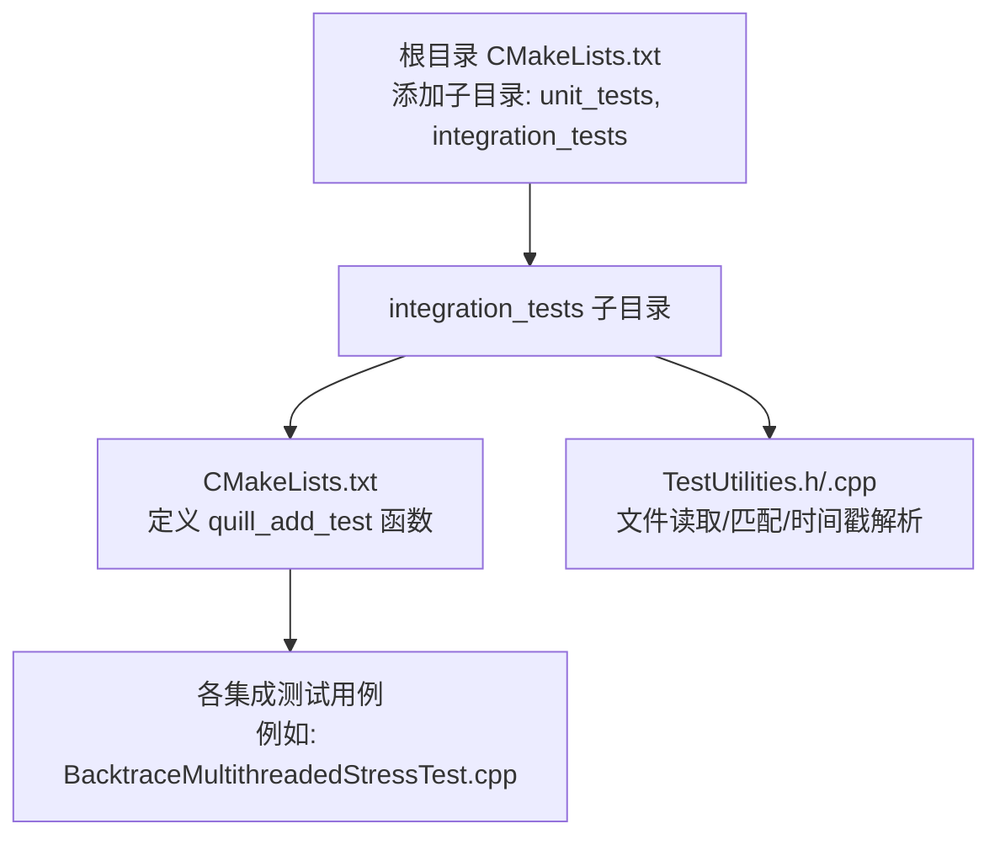
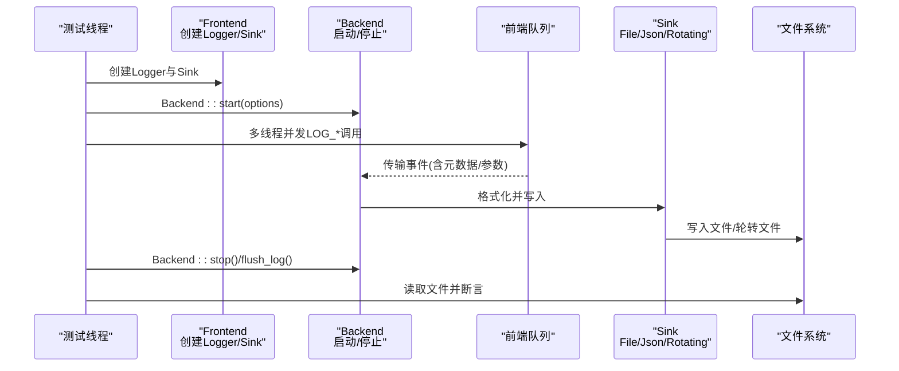
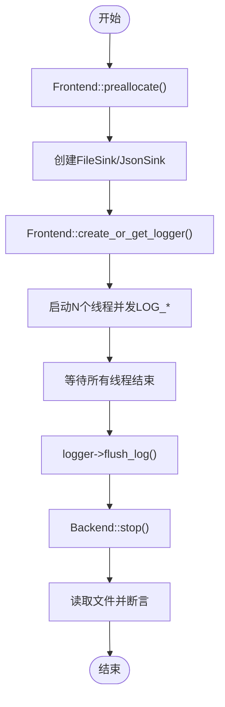
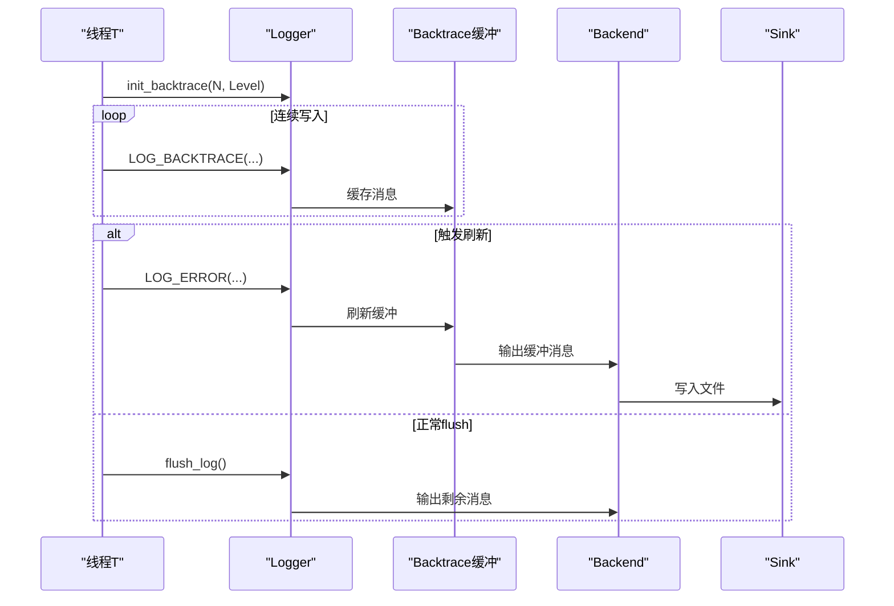
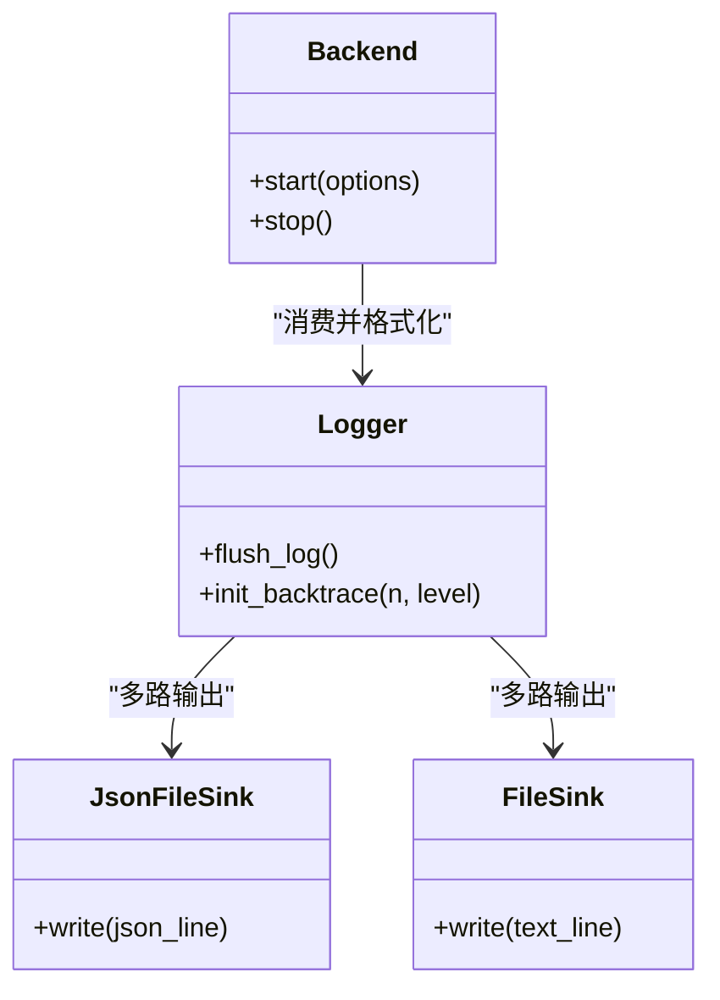
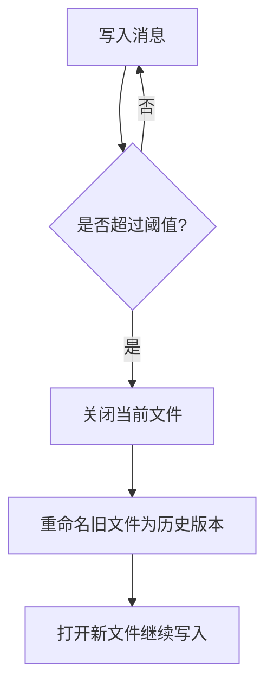
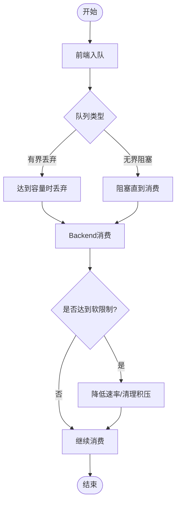
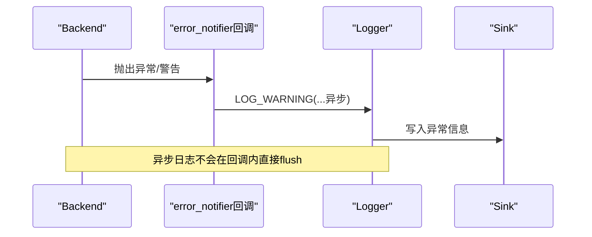
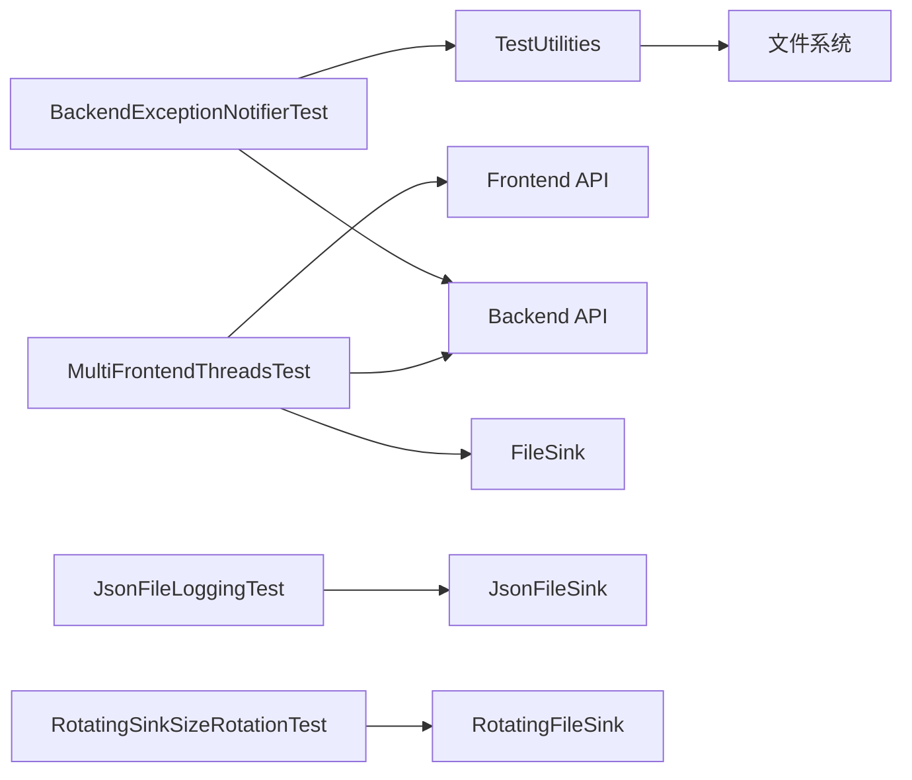

# 集成测试

<cite>
**本文引用的文件**
- [README.md](file://README.md)
- [CMakeLists.txt](file://test/integration_tests/CMakeLists.txt)
- [TestUtilities.h](file://test/misc/TestUtilities.h)
- [TestUtilities.cpp](file://test/misc/TestUtilities.cpp)
- [BacktraceMultithreadedStressTest.cpp](file://test/integration_tests/BacktraceMultithreadedStressTest.cpp)
- [RotatingSinkSizeRotationTest.cpp](file://test/integration_tests/RotatingSinkSizeRotationTest.cpp)
- [JsonFileLoggingTest.cpp](file://test/integration_tests/JsonFileLoggingTest.cpp)
- [MultiFrontendThreadsTest.cpp](file://test/integration_tests/MultiFrontendThreadsTest.cpp)
- [BacktraceFlushOnErrorTest.cpp](file://test/integration_tests/BacktraceFlushOnErrorTest.cpp)
- [SingleFrontendThreadTest.cpp](file://test/integration_tests/SingleFrontendThreadTest.cpp)
- [FlushMultipleLoggers.cpp](file://test/integration_tests/FlushMultipleLoggers.cpp)
- [StartStopBackendWorkerTest.cpp](file://test/integration_tests/StartStopBackendWorkerTest.cpp)
- [BoundedDroppingQueueTest.cpp](file://test/integration_tests/BoundedDroppingQueueTest.cpp)
- [UnboundedUnlimitedQueueTest.cpp](file://test/integration_tests/UnboundedUnlimitedQueueTest.cpp)
- [BackendTransitBufferSoftLimitTest.cpp](file://test/integration_tests/BackendTransitBufferSoftLimitTest.cpp)
- [BackendExceptionNotifierTest.cpp](file://test/integration_tests/BackendExceptionNotifierTest.cpp)
</cite>

## 目录
1. [简介](#简介)
2. [项目结构](#项目结构)
3. [核心组件](#核心组件)
4. [架构总览](#架构总览)
5. [详细组件分析](#详细组件分析)
6. [依赖关系分析](#依赖关系分析)
7. [性能考量](#性能考量)
8. [故障排查指南](#故障排查指南)
9. [结论](#结论)
10. [附录](#附录)

## 简介
本指南面向Quill的集成测试体系，聚焦于多线程环境下的日志功能测试（并发日志记录、线程安全性与性能）、复杂特性场景（回溯日志、JSON格式化、轮转文件）以及端到端测试策略（完整流程验证、错误处理与边界条件）。文档同时提供测试环境搭建与测试数据准备建议，帮助开发者构建稳定可靠的集成测试套件。

## 项目结构
- 测试采用CMake子目录组织：unit_tests与integration_tests分别覆盖单元测试与集成测试。
- 集成测试通过统一的CMake函数批量生成可执行测试目标，并自动链接doctest与公共测试工具。
- 公共测试工具位于test/misc，提供文件读取、内容匹配、时间戳解析与顺序性校验等能力。

**图表来源**
- [CMakeLists.txt:1-161](file://test/integration_tests/CMakeLists.txt#L1-L161)
- [TestUtilities.h:1-31](file://test/misc/TestUtilities.h#L1-L31)
- [TestUtilities.cpp:1-171](file://test/misc/TestUtilities.cpp#L1-L171)

**章节来源**
- [CMakeLists.txt:1-161](file://test/integration_tests/CMakeLists.txt#L1-L161)
- [README.md:1-767](file://README.md#L1-L767)

## 核心组件
- 测试框架与运行时
  - 使用doctest作为断言与测试发现机制；通过CMake函数统一编译与运行。
  - 支持启用内存检测器（asan/ubsan）时设置环境变量以增强稳定性。
- 后端与前端
  - Backend::start()/stop()控制后台工作线程生命周期；Frontend负责创建/管理Logger与Sink。
  - 支持自定义BackendOptions（如软硬限制、CPU亲和性、线程名、异常通知回调等）。
- Sink与格式化
  - FileSink、JsonFileSink、RotatingFileSink及其JSON变体用于不同输出需求。
  - PatternFormatterOptions支持自定义格式与时区。
- 并发与队列
  - 前端使用SPSC无锁队列；可配置有界丢弃/无界阻塞队列模式。
  - 后端传输缓冲区容量与软硬限制影响高负载下的稳定性与吞吐。
- 测试工具
  - file_contents()/file_contains()读取文件并进行字符串匹配。
  - is_timestamp_ordered()/parse_timestamp()校验时间戳顺序一致性。

**章节来源**
- [CMakeLists.txt:1-161](file://test/integration_tests/CMakeLists.txt#L1-L161)
- [TestUtilities.h:1-31](file://test/misc/TestUtilities.h#L1-L31)
- [TestUtilities.cpp:1-171](file://test/misc/TestUtilities.cpp#L1-L171)

## 架构总览
下图展示典型集成测试的端到端流程：前端线程并发写入消息，后端线程消费并格式化输出至文件或轮转文件，测试工具读取文件并断言结果。

**图表来源**
- [MultiFrontendThreadsTest.cpp:17-94](file://test/integration_tests/MultiFrontendThreadsTest.cpp#L17-L94)
- [JsonFileLoggingTest.cpp:48-198](file://test/integration_tests/JsonFileLoggingTest.cpp#L48-L198)
- [RotatingSinkSizeRotationTest.cpp:17-95](file://test/integration_tests/RotatingSinkSizeRotationTest.cpp#L17-L95)

## 详细组件分析

### 多线程并发日志与线程安全
- 场景要点
  - 多个前端线程并发写入，验证消息完整性与顺序性。
  - 使用Frontend::preallocate()预分配上下文，减少首次开销。
  - 通过PatternFormatterOptions与时钟源确保跨线程时间戳一致。
- 关键测试
  - 单线程与多线程基准：验证消息数量与内容匹配。
  - 多前端线程并发：验证每条消息均被正确落盘。
- 断言策略
  - 统计行数与逐行匹配期望片段。
  - 可选：基于时间戳解析与排序校验顺序一致性。

**图表来源**
- [MultiFrontendThreadsTest.cpp:17-94](file://test/integration_tests/MultiFrontendThreadsTest.cpp#L17-L94)
- [SingleFrontendThreadTest.cpp:16-72](file://test/integration_tests/SingleFrontendThreadTest.cpp#L16-L72)

**章节来源**
- [MultiFrontendThreadsTest.cpp:17-94](file://test/integration_tests/MultiFrontendThreadsTest.cpp#L17-L94)
- [SingleFrontendThreadTest.cpp:16-72](file://test/integration_tests/SingleFrontendThreadTest.cpp#L16-L72)

### 回溯日志（Backtrace）
- 功能概述
  - 在指定级别（如Error）触发前，将最近若干条日志缓存在环形缓冲中，便于事后一次性输出。
  - 支持在错误发生时手动触发flush或按需刷新。
- 关键测试
  - 多线程压力测试：大量并发回溯消息与周期性触发flush，验证缓冲容量与刷新行为。
  - 错误触发刷新：在回溯缓冲期内产生错误，验证缓冲内容随错误一并输出。
- 断言策略
  - 统计文件中回溯/错误消息数量与范围。
  - 验证特定回溯消息片段是否出现。

**图表来源**
- [BacktraceMultithreadedStressTest.cpp:21-102](file://test/integration_tests/BacktraceMultithreadedStressTest.cpp#L21-L102)
- [BacktraceFlushOnErrorTest.cpp:17-108](file://test/integration_tests/BacktraceFlushOnErrorTest.cpp#L17-L108)

**章节来源**
- [BacktraceMultithreadedStressTest.cpp:21-102](file://test/integration_tests/BacktraceMultithreadedStressTest.cpp#L21-L102)
- [BacktraceFlushOnErrorTest.cpp:17-108](file://test/integration_tests/BacktraceFlushOnErrorTest.cpp#L17-L108)

### JSON格式化与多格式输出
- 场景要点
  - 同时使用JsonFileSink与普通FileSink，验证同一日志既输出人类可读文本，又输出结构化JSON。
  - 支持命名参数、非打印字符、无效格式等边界情况。
- 关键测试
  - 多线程并发JSON与文本输出，断言两者行数与内容片段。
  - 特殊字符与无效格式的容错处理。
- 断言策略
  - 分别对JSON与文本文件进行片段匹配，确保字段与值正确映射。

**图表来源**
- [JsonFileLoggingTest.cpp:48-198](file://test/integration_tests/JsonFileLoggingTest.cpp#L48-L198)

**章节来源**
- [JsonFileLoggingTest.cpp:48-198](file://test/integration_tests/JsonFileLoggingTest.cpp#L48-L198)

### 轮转文件（大小与日期）
- 场景要点
  - 基于文件大小的轮转：设置最大文件大小阈值，超过阈值自动滚动历史文件。
  - JSON轮转：同上，但输出为JSON格式。
- 关键测试
  - 大量消息触发轮转，断言主文件与历史文件的行数分布。
  - 验证轮转文件命名规则与保留策略。
- 断言策略
  - 对主文件与多个历史文件分别断言行数，确保轮转逻辑正确。

**图表来源**
- [RotatingSinkSizeRotationTest.cpp:17-95](file://test/integration_tests/RotatingSinkSizeRotationTest.cpp#L17-L95)

**章节来源**
- [RotatingSinkSizeRotationTest.cpp:17-95](file://test/integration_tests/RotatingSinkSizeRotationTest.cpp#L17-L95)

### 队列与后端缓冲：性能与稳定性
- 有界丢弃队列
  - 高负载下允许丢弃部分消息，保证系统不被阻塞；测试验证前若干消息仍可达。
- 无界无限队列
  - 阻塞模式下不会丢弃消息，适合严格一致性场景；可选极端大字符串测试。
- 后端传输缓冲软限制
  - 在后端启动前堆积消息，验证软限制触发后的处理与后续稳定性。

**图表来源**
- [BoundedDroppingQueueTest.cpp:27-81](file://test/integration_tests/BoundedDroppingQueueTest.cpp#L27-L81)
- [UnboundedUnlimitedQueueTest.cpp:27-91](file://test/integration_tests/UnboundedUnlimitedQueueTest.cpp#L27-L91)
- [BackendTransitBufferSoftLimitTest.cpp:17-76](file://test/integration_tests/BackendTransitBufferSoftLimitTest.cpp#L17-L76)

**章节来源**
- [BoundedDroppingQueueTest.cpp:27-81](file://test/integration_tests/BoundedDroppingQueueTest.cpp#L27-L81)
- [UnboundedUnlimitedQueueTest.cpp:27-91](file://test/integration_tests/UnboundedUnlimitedQueueTest.cpp#L27-L91)
- [BackendTransitBufferSoftLimitTest.cpp:17-76](file://test/integration_tests/BackendTransitBufferSoftLimitTest.cpp#L17-L76)

### 后端异常通知与错误处理
- 场景要点
  - 自定义error_notifier回调，捕获后端线程中的异常（如线程名过长、CPU亲和性非法、格式化失败、poll钩子异常）。
  - 异步日志在回调中发出，确保最终落盘。
- 关键测试
  - 设置非法参数触发异常，断言回调被调用次数与日志内容。
  - 验证poll begin/end钩子异常路径。
- 断言策略
  - 搜索日志中包含“error handler invoked ...”的片段，确认各类异常均被上报。

**图表来源**
- [BackendExceptionNotifierTest.cpp:20-159](file://test/integration_tests/BackendExceptionNotifierTest.cpp#L20-L159)

**章节来源**
- [BackendExceptionNotifierTest.cpp:20-159](file://test/integration_tests/BackendExceptionNotifierTest.cpp#L20-L159)

### 端到端测试策略
- 完整流程验证
  - 启动后端 -> 创建多个Logger与Sink -> 多线程并发写入 -> flush/stop -> 读取文件断言。
- 错误处理测试
  - 非法参数、无效格式、异常回调路径均需覆盖。
- 边界条件测试
  - 非打印字符、超长线程名、超大字符串、极小/极大阈值等。
- 时间戳顺序性
  - 使用is_timestamp_ordered()与parse_timestamp()辅助验证多线程时间戳一致性。

**章节来源**
- [FlushMultipleLoggers.cpp:97-165](file://test/integration_tests/FlushMultipleLoggers.cpp#L97-L165)
- [StartStopBackendWorkerTest.cpp:16-71](file://test/integration_tests/StartStopBackendWorkerTest.cpp#L16-L71)
- [TestUtilities.cpp:131-169](file://test/misc/TestUtilities.cpp#L131-L169)

## 依赖关系分析
- 组件耦合
  - 测试用例依赖Frontend/Backend API与具体Sink实现。
  - 测试工具与文件系统交互，提供断言辅助。
- 外部依赖
  - doctest用于测试发现与断言。
  - 可选sanitizer环境变量在CMake中注入。
- 循环依赖
  - 未见明显循环；测试代码仅单向依赖库API与工具。

**图表来源**
- [MultiFrontendThreadsTest.cpp:17-94](file://test/integration_tests/MultiFrontendThreadsTest.cpp#L17-L94)
- [JsonFileLoggingTest.cpp:48-198](file://test/integration_tests/JsonFileLoggingTest.cpp#L48-L198)
- [RotatingSinkSizeRotationTest.cpp:17-95](file://test/integration_tests/RotatingSinkSizeRotationTest.cpp#L17-L95)
- [BackendExceptionNotifierTest.cpp:20-159](file://test/integration_tests/BackendExceptionNotifierTest.cpp#L20-L159)
- [TestUtilities.cpp:21-88](file://test/misc/TestUtilities.cpp#L21-L88)

**章节来源**
- [CMakeLists.txt:1-161](file://test/integration_tests/CMakeLists.txt#L1-L161)
- [TestUtilities.h:1-31](file://test/misc/TestUtilities.h#L1-L31)

## 性能考量
- 队列选择
  - 有界丢弃：吞吐高、延迟低，适合高负载；需容忍丢弃。
  - 无界阻塞：严格一致，适合低丢弃场景；需关注阻塞与内存占用。
- 后端选项
  - 软硬限制、线程名与CPU亲和性设置会影响后端稳定性与资源占用。
- 文件写入
  - 轮转文件会引入额外IO开销；合理设置阈值与历史文件数量。
- 断言成本
  - 大规模文件断言应避免逐行匹配，优先统计行数与关键片段存在性。

## 故障排查指南
- 常见问题
  - 后端未启动：检查Backend::start()是否在写入前调用。
  - 文件未落盘：确保调用logger->flush_log()或Backend::stop()触发收尾。
  - 时间戳异常：检查ClockSourceType与PatternFormatterOptions。
  - 轮转未生效：核对阈值设置与文件命名规则。
- 排查步骤
  - 使用file_contains()定位缺失片段，结合日志上下文定位问题。
  - 使用is_timestamp_ordered()快速判断时间戳顺序异常。
  - 在异常通知测试中确认error_notifier回调是否被触发。

**章节来源**
- [TestUtilities.cpp:51-169](file://test/misc/TestUtilities.cpp#L51-L169)
- [BackendExceptionNotifierTest.cpp:20-159](file://test/integration_tests/BackendExceptionNotifierTest.cpp#L20-L159)

## 结论
通过上述集成测试体系，可以系统性地验证Quill在多线程、复杂特性与边界条件下的正确性与稳定性。建议在CI中启用sanitizer并在本地使用扩展测试宏（如QUILL_ENABLE_EXTENSIVE_TESTS）覆盖极端场景，持续提升测试覆盖率与回归防护能力。

## 附录
- 测试环境搭建
  - 使用CMake构建测试子目录，确保链接quill与atomic（若平台不支持C++原子）。
  - 可选开启QUILL_ENABLE_EXTENSIVE_TESTS以启用更大规模测试。
- 测试数据准备
  - 使用TestUtilities提供的文件读取与匹配接口，避免手工解析。
  - 对于时间戳顺序性，使用parse_timestamp与is_timestamp_ordered辅助断言。

**章节来源**
- [CMakeLists.txt:39-56](file://test/integration_tests/CMakeLists.txt#L39-L56)
- [TestUtilities.h:16-30](file://test/misc/TestUtilities.h#L16-L30)
- [TestUtilities.cpp:21-169](file://test/misc/TestUtilities.cpp#L21-L169)