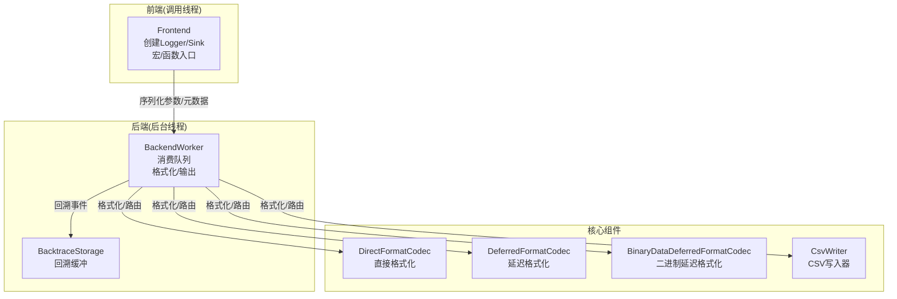
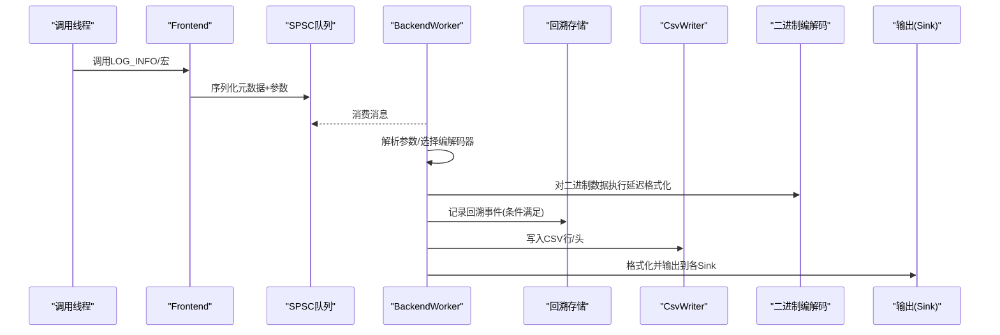
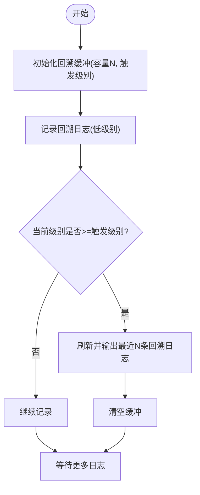
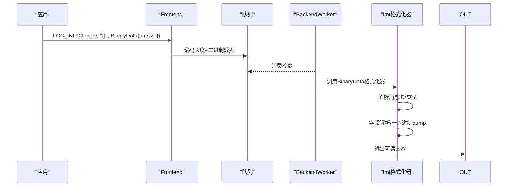
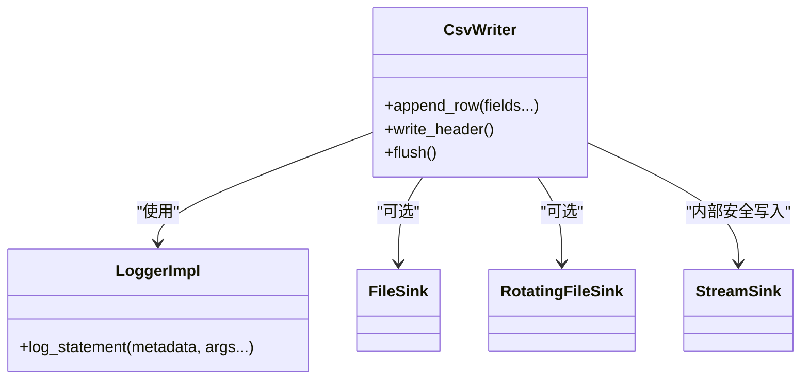
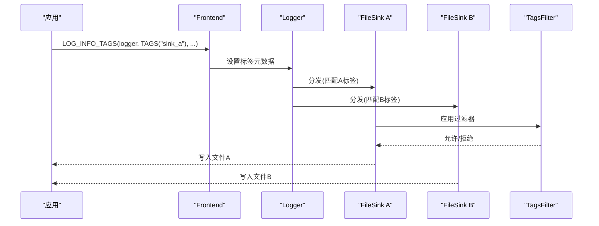
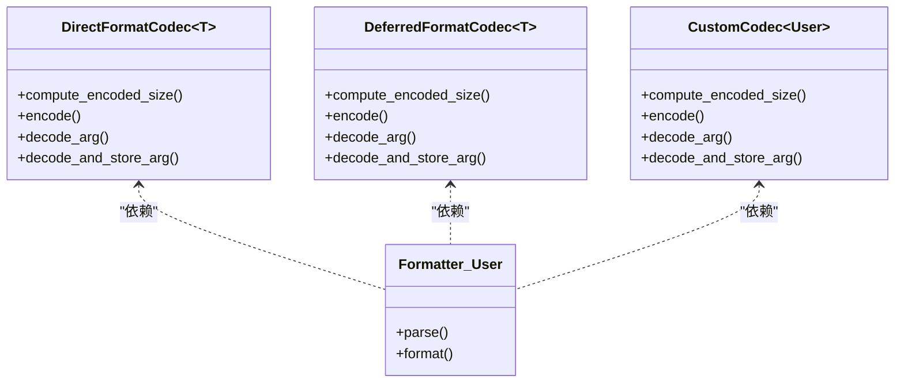
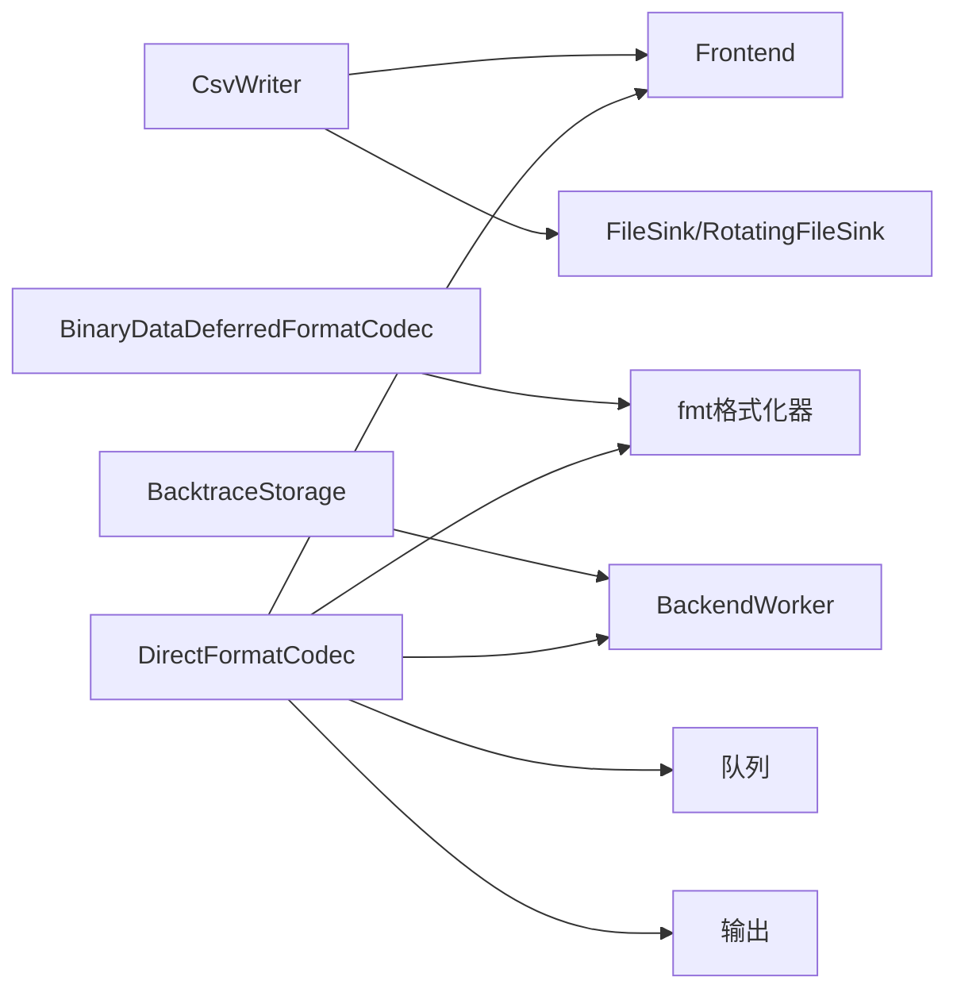

# 专用功能示例

<cite>
**本文引用的文件**
- [README.md](file://README.md)
- [BacktraceStorage.h](file://include/quill/backend/BacktraceStorage.h)
- [BinaryDataDeferredFormatCodec.h](file://include/quill/BinaryDataDeferredFormatCodec.h)
- [CsvWriter.h](file://include/quill/CsvWriter.h)
- [DeferredFormatCodec.h](file://include/quill/DeferredFormatCodec.h)
- [DirectFormatCodec.h](file://include/quill/DirectFormatCodec.h)
- [backtrace_logging.cpp](file://examples/backtrace_logging.cpp)
- [binary_protocol_logging.cpp](file://examples/binary_protocol_logging.cpp)
- [csv_writing.cpp](file://examples/csv_writing.cpp)
- [tags_logging.cpp](file://examples/tags_logging.cpp)
- [user_defined_types_logging_direct_format.cpp](file://examples/user_defined_types_logging_direct_format.cpp)
- [user_defined_types_logging_deferred_format.cpp](file://examples/user_defined_types_logging_deferred_format.cpp)
- [user_defined_types_logging_custom_codec.cpp](file://examples/user_defined_types_logging_custom_codec.cpp)
- [user_defined_types_multi_format.cpp](file://examples/user_defined_types_multi_format.cpp)
- [quill_docs_example_backtrace_logging_1.cpp](file://docs/examples/quill_docs_example_backtrace_logging_1.cpp)
- [quill_docs_example_csv_writer_1.cpp](file://docs/examples/quill_docs_example_csv_writer_1.cpp)
- [quill_docs_example_multiple_sinks_tags.cpp](file://docs/examples/quill_docs_example_multiple_sinks_tags.cpp)
</cite>

## 目录
1. [简介](#简介)
2. [项目结构](#项目结构)
3. [核心组件](#核心组件)
4. [架构总览](#架构总览)
5. [详细组件分析](#详细组件分析)
6. [依赖关系分析](#依赖关系分析)
7. [性能考量](#性能考量)
8. [故障排查指南](#故障排查指南)
9. [结论](#结论)
10. [附录](#附录)

## 简介
本文件聚焦Quill的“专用功能示例”，围绕以下能力提供系统化说明与实践路径：
- 回溯日志：在错误或特定条件触发时集中输出最近若干条日志，便于问题定位。
- 二进制协议：对原始二进制数据进行高效记录，并在后台线程完成可读性格式化。
- CSV写入：以异步方式输出结构化CSV数据，支持文件、轮转文件与多路输出。
- 标签系统：为日志与接收端（如多个文件Sink）打标签，实现按标签路由与过滤。
- 用户自定义类型：提供多种编解码与格式化策略，覆盖直接格式化、延迟格式化、自定义编解码器等。

以上功能均基于Quill的异步设计与高性能队列，确保热路径开销最小化，同时保证后台线程完成复杂格式化与I/O。

## 项目结构
Quill采用前后端分离的异步架构：前端负责将日志元数据与参数序列化到无锁队列；后端消费队列，执行格式化与输出。专用功能通过扩展编解码器、格式化器与写入器实现。

图示来源
- [README.md:680-703](file://README.md#L680-L703)
- [BacktraceStorage.h:28-124](file://include/quill/backend/BacktraceStorage.h#L28-L124)
- [DirectFormatCodec.h:86-115](file://include/quill/DirectFormatCodec.h#L86-L115)
- [DeferredFormatCodec.h:90-180](file://include/quill/DeferredFormatCodec.h#L90-L180)
- [BinaryDataDeferredFormatCodec.h:121-163](file://include/quill/BinaryDataDeferredFormatCodec.h#L121-L163)
- [CsvWriter.h:44-231](file://include/quill/CsvWriter.h#L44-L231)

章节来源
- [README.md:680-703](file://README.md#L680-L703)

## 核心组件
- 回溯日志：通过BacktraceStorage在后台线程维护环形缓冲，按配置在错误级别触发时批量输出。
- 二进制协议：BinaryDataDeferredFormatCodec将原始二进制数据拷贝至队列，后台线程解析并格式化为可读字符串。
- CSV写入：CsvWriter封装异步CSV输出，支持文件、轮转文件与多Sink，自动写入表头。
- 用户自定义类型：
  - DirectFormatCodec：在热路径上直接将对象格式化为字符串。
  - DeferredFormatCodec：在热路径上仅拷贝对象，后台线程完成格式化。
  - 自定义Codec：完全控制序列化/反序列化细节，适合复杂类型或性能敏感场景。

章节来源
- [BacktraceStorage.h:28-124](file://include/quill/backend/BacktraceStorage.h#L28-L124)
- [BinaryDataDeferredFormatCodec.h:121-163](file://include/quill/BinaryDataDeferredFormatCodec.h#L121-L163)
- [CsvWriter.h:44-231](file://include/quill/CsvWriter.h#L44-L231)
- [DirectFormatCodec.h:86-115](file://include/quill/DirectFormatCodec.h#L86-L115)
- [DeferredFormatCodec.h:90-180](file://include/quill/DeferredFormatCodec.h#L90-L180)

## 架构总览
下图展示从调用线程到后台处理的关键流程，以及专用功能的接入点。

图示来源
- [README.md:680-703](file://README.md#L680-L703)
- [BacktraceStorage.h:34-87](file://include/quill/backend/BacktraceStorage.h#L34-L87)
- [CsvWriter.h:191-213](file://include/quill/CsvWriter.h#L191-L213)
- [BinaryDataDeferredFormatCodec.h:127-162](file://include/quill/BinaryDataDeferredFormatCodec.h#L127-L162)

## 详细组件分析

### 回溯日志
- 功能要点
  - 在指定容量的环形缓冲中暂存低级别日志。
  - 当出现等于或高于设定级别的日志时，触发回溯输出。
  - 支持手动刷新，清空缓冲。
- 使用场景
  - 复杂流程中定位异常前的状态上下文。
  - 避免在正常运行时输出大量调试信息，仅在异常时输出。
- 实现原理
  - 前端调用回溯宏时，消息进入队列。
  - 后端根据日志级别判断是否触发回溯输出。
  - 回溯存储按插入顺序循环覆盖，最终统一回调输出。

图示来源
- [backtrace_logging.cpp:25-54](file://examples/backtrace_logging.cpp#L25-L54)
- [quill_docs_example_backtrace_logging_1.cpp:17-50](file://docs/examples/quill_docs_example_backtrace_logging_1.cpp#L17-L50)
- [BacktraceStorage.h:34-87](file://include/quill/backend/BacktraceStorage.h#L34-L87)

章节来源
- [backtrace_logging.cpp:14-55](file://examples/backtrace_logging.cpp#L14-L55)
- [quill_docs_example_backtrace_logging_1.cpp:7-50](file://docs/examples/quill_docs_example_backtrace_logging_1.cpp#L7-L50)
- [BacktraceStorage.h:28-124](file://include/quill/backend/BacktraceStorage.h#L28-L124)

### 二进制协议
- 功能要点
  - 将原始二进制数据以最小开销写入队列。
  - 后台线程解析二进制并格式化为可读文本（如十六进制转储）。
  - 可针对不同协议消息类型定制解析逻辑。
- 使用场景
  - 网络协议、消息队列、市场数据等二进制帧的可观测性。
  - 需要人类可读但又避免热路径格式化的场景。
- 实现原理
  - 定义带标签的BinaryData类型，配合BinaryDataDeferredFormatCodec。
  - 在fmt格式化器中解析消息ID并按类型解析字段，最后追加十六进制dump。

图示来源
- [binary_protocol_logging.cpp:178-238](file://examples/binary_protocol_logging.cpp#L178-L238)
- [BinaryDataDeferredFormatCodec.h:121-163](file://include/quill/BinaryDataDeferredFormatCodec.h#L121-L163)

章节来源
- [binary_protocol_logging.cpp:19-242](file://examples/binary_protocol_logging.cpp#L19-L242)
- [BinaryDataDeferredFormatCodec.h:28-163](file://include/quill/BinaryDataDeferredFormatCodec.h#L28-L163)

### CSV写入
- 功能要点
  - 通过TCsvSchema定义表头与格式。
  - 支持文件、轮转文件、单/多Sink输出。
  - 自动写入表头，后续追加行。
- 使用场景
  - 结构化数据导出、指标采集、审计日志。
- 实现原理
  - CsvWriter内部创建Logger与Sink，使用固定PatternFormatter输出“message”字段。
  - append_row通过模板推导参数，按Schema格式化为一行文本。

图示来源
- [CsvWriter.h:44-231](file://include/quill/CsvWriter.h#L44-L231)

章节来源
- [csv_writing.cpp:18-33](file://examples/csv_writing.cpp#L18-L33)
- [quill_docs_example_csv_writer_1.cpp:13-29](file://docs/examples/quill_docs_example_csv_writer_1.cpp#L13-L29)
- [CsvWriter.h:25-231](file://include/quill/CsvWriter.h#L25-L231)

### 标签系统
- 功能要点
  - 为日志打上零个或多个标签，用于过滤与路由。
  - 支持在格式串中显示标签，建议紧邻其他占位符避免多余空格。
  - 可结合Sink过滤器按标签定向输出到不同文件。
- 使用场景
  - 多租户/多模块日志隔离。
  - 按业务域或环境标签分流到不同文件。
- 实现原理
  - 日志宏支持TAGS()语法，元数据携带标签字符串。
  - 过滤器比较元数据中的标签集合，决定是否接收该日志。

图示来源
- [tags_logging.cpp:29-42](file://examples/tags_logging.cpp#L29-L42)
- [quill_docs_example_multiple_sinks_tags.cpp:34-53](file://docs/examples/quill_docs_example_multiple_sinks_tags.cpp#L34-L53)

章节来源
- [tags_logging.cpp:17-43](file://examples/tags_logging.cpp#L17-L43)
- [quill_docs_example_multiple_sinks_tags.cpp:12-53](file://docs/examples/quill_docs_example_multiple_sinks_tags.cpp#L12-L53)

### 用户自定义类型支持
- 直接格式化(DirectFormatCodec)
  - 在热路径上将对象格式化为字符串，减少拷贝与构造。
  - 需要为类型提供fmt格式化器。
- 延迟格式化(DeferredFormatCodec)
  - 热路径仅拷贝对象，后台线程完成格式化。
  - 适用于非平凡复制类型或需要复杂格式化的场景。
- 自定义编解码器
  - 完全掌控序列化/反序列化过程，适合复杂成员组合或性能敏感路径。

图示来源
- [DirectFormatCodec.h:86-115](file://include/quill/DirectFormatCodec.h#L86-L115)
- [DeferredFormatCodec.h:90-180](file://include/quill/DeferredFormatCodec.h#L90-L180)
- [user_defined_types_logging_direct_format.cpp:19-102](file://examples/user_defined_types_logging_direct_format.cpp#L19-L102)
- [user_defined_types_logging_deferred_format.cpp:17-71](file://examples/user_defined_types_logging_deferred_format.cpp#L17-L71)
- [user_defined_types_logging_custom_codec.cpp:30-130](file://examples/user_defined_types_logging_custom_codec.cpp#L30-L130)
- [user_defined_types_multi_format.cpp:16-73](file://examples/user_defined_types_multi_format.cpp#L16-L73)

章节来源
- [user_defined_types_logging_direct_format.cpp:14-102](file://examples/user_defined_types_logging_direct_format.cpp#L14-L102)
- [user_defined_types_logging_deferred_format.cpp:13-71](file://examples/user_defined_types_logging_deferred_format.cpp#L13-L71)
- [user_defined_types_logging_custom_codec.cpp:1-130](file://examples/user_defined_types_logging_custom_codec.cpp#L1-130)
- [user_defined_types_multi_format.cpp:12-73](file://examples/user_defined_types_multi_format.cpp#L12-L73)
- [DirectFormatCodec.h:22-115](file://include/quill/DirectFormatCodec.h#L22-L115)
- [DeferredFormatCodec.h:29-180](file://include/quill/DeferredFormatCodec.h#L29-L180)

## 依赖关系分析
- 组件耦合
  - CsvWriter依赖Frontend创建Logger与Sink，内部使用固定PatternFormatter。
  - 二进制编解码依赖BinaryData视图与工具函数，格式化器在后台线程执行。
  - 回溯存储由BackendWorker驱动，按条件触发输出。
  - 自定义类型编解码器与fmt格式化器紧密协作。
- 外部依赖
  - fmt库用于格式化与字符串处理。
  - 文件系统与标准IO用于CSV与文件写入。

图示来源
- [CsvWriter.h:67-135](file://include/quill/CsvWriter.h#L67-L135)
- [BinaryDataDeferredFormatCodec.h:95-118](file://include/quill/BinaryDataDeferredFormatCodec.h#L95-L118)
- [BacktraceStorage.h:34-87](file://include/quill/backend/BacktraceStorage.h#L34-L87)
- [DirectFormatCodec.h:89-104](file://include/quill/DirectFormatCodec.h#L89-L104)

章节来源
- [CsvWriter.h:44-231](file://include/quill/CsvWriter.h#L44-L231)
- [BinaryDataDeferredFormatCodec.h:121-163](file://include/quill/BinaryDataDeferredFormatCodec.h#L121-L163)
- [BacktraceStorage.h:28-124](file://include/quill/backend/BacktraceStorage.h#L28-L124)
- [DirectFormatCodec.h:86-115](file://include/quill/DirectFormatCodec.h#L86-L115)

## 性能考量
- 热路径最小化
  - 直接格式化在热路径完成格式化，适合简单对象。
  - 延迟格式化仅拷贝对象，后台线程完成格式化，适合复杂对象。
  - 二进制数据仅拷贝原始字节，后台线程解析与格式化。
- 队列与内存
  - 使用无锁SPSC队列降低锁竞争。
  - 对齐与memcpy优化序列化/反序列化。
- I/O与格式化
  - CSV写入与二进制格式化在后台线程执行，避免阻塞调用线程。
  - 回溯输出按需触发，减少常规输出开销。

## 故障排查指南
- 回溯日志未输出
  - 检查是否在首次使用回溯宏前已调用初始化，确认触发级别设置正确。
  - 确认日志级别达到或超过触发级别，或显式调用刷新。
- 二进制日志不可读
  - 确保为BinaryData类型提供了格式化器，且能正确解析消息ID与字段。
  - 检查数据大小与对齐，避免越界访问。
- CSV写入无表头
  - 确认构造时选择了写入表头，或显式调用写入表头。
  - 轮转文件场景注意首次旋转时跳过表头写入。
- 标签未生效
  - 确认格式串包含标签占位符，且标签过滤器正确匹配。
  - 检查标签字符串格式（库内部会添加额外字符与空格）。

章节来源
- [backtrace_logging.cpp:25-54](file://examples/backtrace_logging.cpp#L25-L54)
- [binary_protocol_logging.cpp:95-167](file://examples/binary_protocol_logging.cpp#L95-L167)
- [csv_writing.cpp:28-32](file://examples/csv_writing.cpp#L28-L32)
- [quill_docs_example_multiple_sinks_tags.cpp:12-32](file://docs/examples/quill_docs_example_multiple_sinks_tags.cpp#L12-L32)

## 结论
Quill通过编解码器、格式化器与写入器的灵活组合，为二进制协议、CSV结构化输出、回溯日志与标签系统提供了高性能、可扩展的解决方案。用户可根据场景选择直接/延迟格式化策略，或实现自定义编解码器以获得最佳性能与可读性平衡。

## 附录
- 快速参考
  - 回溯日志：初始化容量与触发级别，必要时手动刷新。
  - 二进制协议：定义BinaryData类型与格式化器，注册编解码器。
  - CSV写入：定义Schema，选择文件/轮转/多Sink，自动写入表头。
  - 标签系统：在宏中附加标签，使用过滤器按标签分发。
  - 自定义类型：选择Direct/Deferred/自定义编解码器，提供对应格式化器。