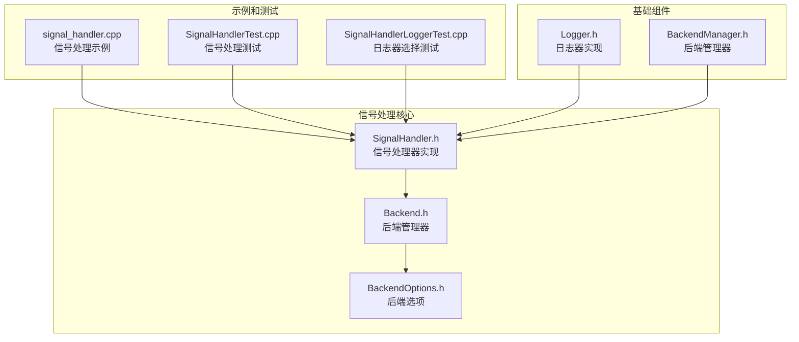
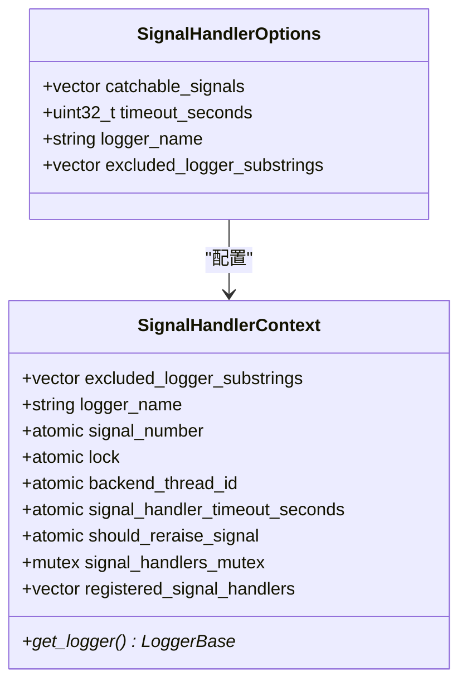
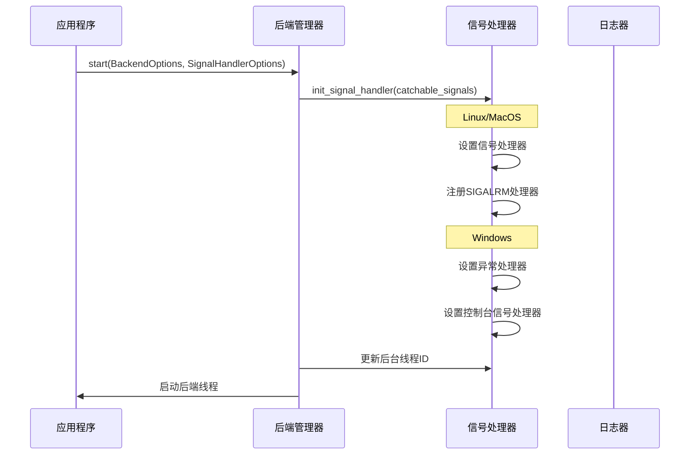
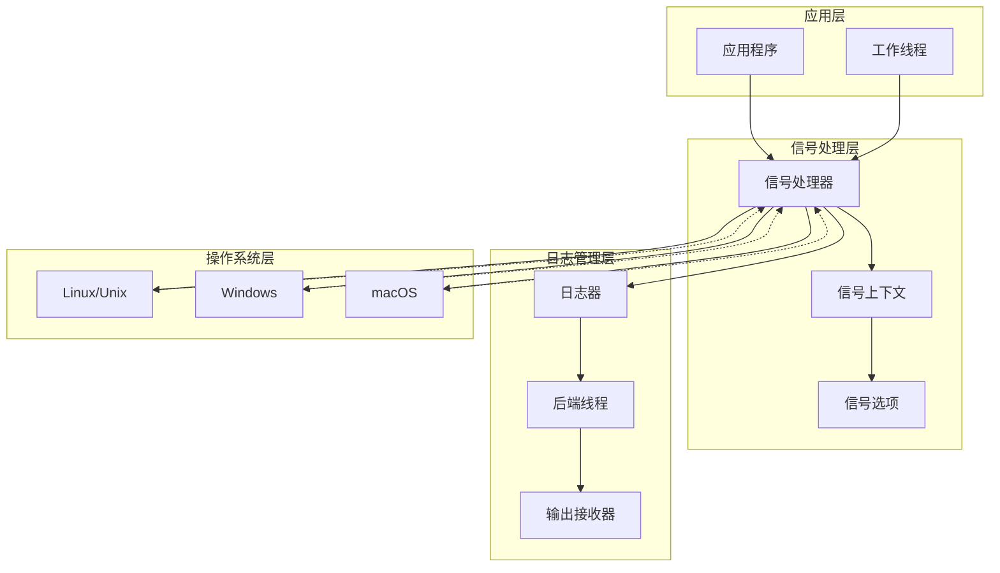
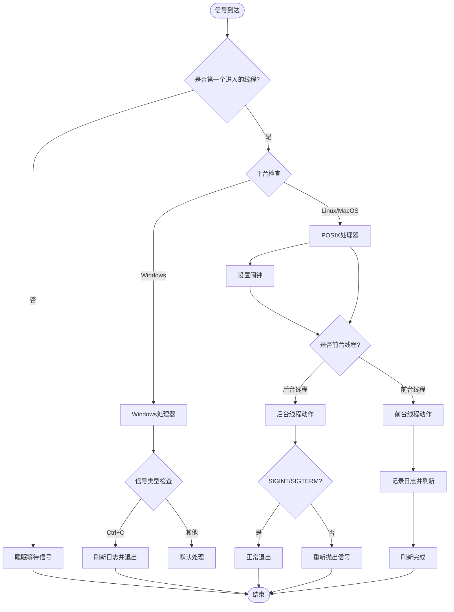
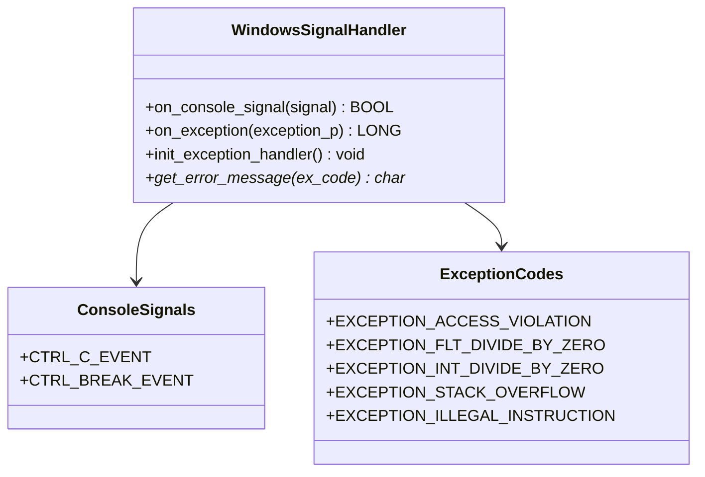
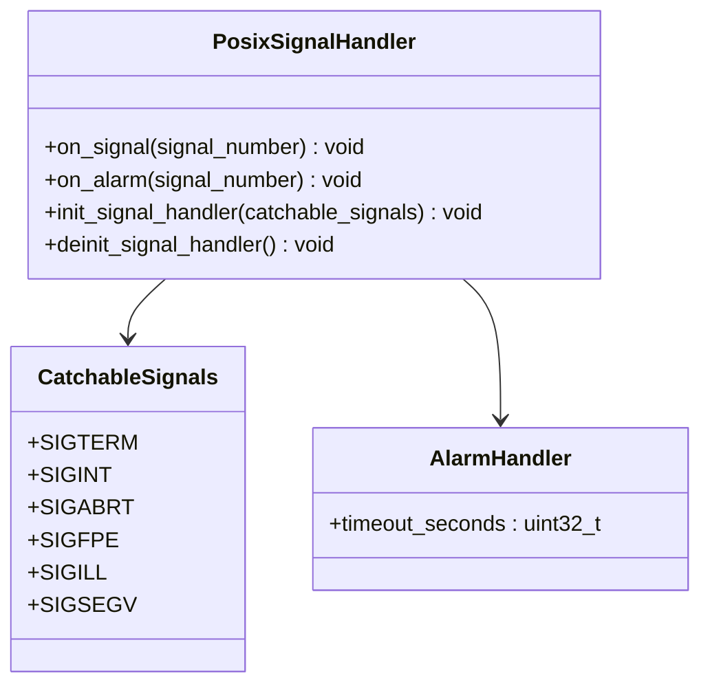
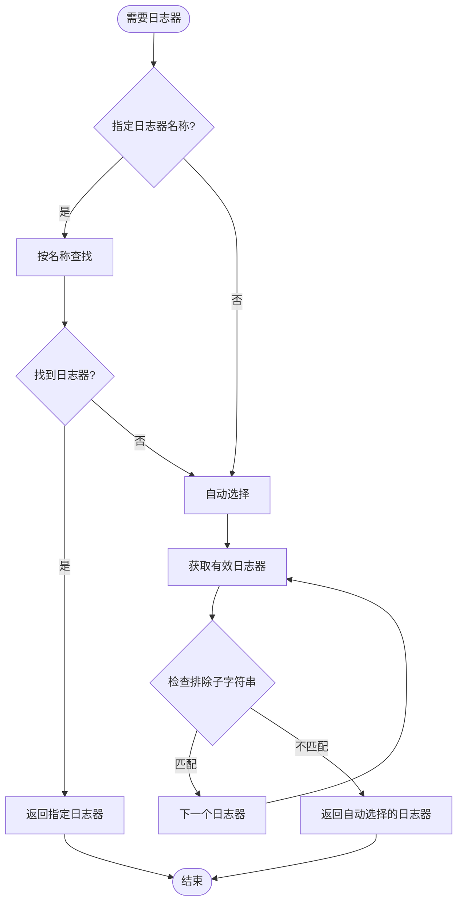
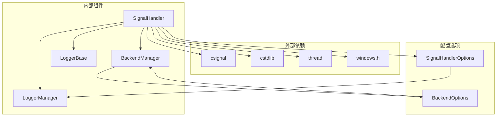

# 信号处理示例

<cite>
**本文档引用的文件**
- [SignalHandler.h](file://include/quill/backend/SignalHandler.h)
- [Backend.h](file://include/quill/Backend.h)
- [BackendOptions.h](file://include/quill/backend/BackendOptions.h)
- [signal_handler.cpp](file://examples/signal_handler.cpp)
- [SignalHandlerTest.cpp](file://test/integration_tests/SignalHandlerTest.cpp)
- [SignalHandlerLoggerTest.cpp](file://test/integration_tests/SignalHandlerLoggerTest.cpp)
- [Logger.h](file://include/quill/Logger.h)
- [BackendManager.h](file://include/quill/backend/BackendManager.h)
</cite>

## 目录
1. [简介](#简介)
2. [项目结构](#项目结构)
3. [核心组件](#核心组件)
4. [架构概览](#架构概览)
5. [详细组件分析](#详细组件分析)
6. [依赖关系分析](#依赖关系分析)
7. [性能考虑](#性能考虑)
8. [故障排除指南](#故障排除指南)
9. [结论](#结论)

## 简介

Quill 是一个高性能的 C++ 日志库，提供了完整的信号处理机制来确保应用程序在接收到致命信号时能够优雅地关闭并完整写入日志。本文档详细介绍了 Quill 的信号处理示例，展示了如何正确处理程序退出信号，确保日志能够完整写入并优雅关闭。

信号处理在日志系统中具有重要意义：
- **数据完整性**：确保在程序崩溃或意外终止时，所有未写入的日志消息都能被完整保存
- **调试支持**：为开发者提供崩溃时的上下文信息，便于问题诊断
- **系统稳定性**：避免程序在异常情况下造成资源泄漏或数据损坏
- **用户体验**：提供清晰的错误信息和状态报告

## 项目结构

Quill 的信号处理功能主要分布在以下关键文件中：

**图表来源**
- [SignalHandler.h:1-488](file://include/quill/backend/SignalHandler.h#L1-L488)
- [Backend.h:1-246](file://include/quill/Backend.h#L1-L246)

**章节来源**
- [SignalHandler.h:1-488](file://include/quill/backend/SignalHandler.h#L1-L488)
- [Backend.h:1-246](file://include/quill/Backend.h#L1-L246)

## 核心组件

### SignalHandlerOptions 结构体

信号处理器的核心配置通过 `SignalHandlerOptions` 结构体进行管理：

**图表来源**
- [SignalHandler.h:48-88](file://include/quill/backend/SignalHandler.h#L48-L88)
- [SignalHandler.h:93-138](file://include/quill/backend/SignalHandler.h#L93-L138)

### 信号处理器初始化流程

**图表来源**
- [Backend.h:80-130](file://include/quill/Backend.h#L80-L130)
- [SignalHandler.h:391-408](file://include/quill/backend/SignalHandler.h#L391-L408)

**章节来源**
- [SignalHandler.h:48-88](file://include/quill/backend/SignalHandler.h#L48-L88)
- [Backend.h:80-130](file://include/quill/Backend.h#L80-L130)

## 架构概览

Quill 的信号处理架构采用分层设计，确保在不同操作系统环境下都能提供一致的信号处理行为：

**图表来源**
- [SignalHandler.h:28-43](file://include/quill/backend/SignalHandler.h#L28-L43)
- [Backend.h:87-119](file://include/quill/Backend.h#L87-L119)

## 详细组件分析

### 信号处理器实现

信号处理器的核心逻辑在 `on_signal` 函数中实现，该函数根据不同的信号类型和执行环境采取相应的处理策略：

**图表来源**
- [SignalHandler.h:153-248](file://include/quill/backend/SignalHandler.h#L153-L248)

### 平台特定实现

#### Windows 平台实现

Windows 平台使用专门的异常处理机制：

**图表来源**
- [SignalHandler.h:308-384](file://include/quill/backend/SignalHandler.h#L308-L384)

#### POSIX 平台实现

POSIX 平台使用标准的信号处理机制：

**图表来源**
- [SignalHandler.h:442-485](file://include/quill/backend/SignalHandler.h#L442-L485)

**章节来源**
- [SignalHandler.h:153-248](file://include/quill/backend/SignalHandler.h#L153-L248)
- [SignalHandler.h:308-384](file://include/quill/backend/SignalHandler.h#L308-L384)
- [SignalHandler.h:442-485](file://include/quill/backend/SignalHandler.h#L442-L485)

### 日志器选择机制

信号处理器实现了智能的日志器选择机制，确保在崩溃时能够找到合适的日志器进行记录：

**图表来源**
- [SignalHandler.h:107-123](file://include/quill/backend/SignalHandler.h#L107-L123)

**章节来源**
- [SignalHandler.h:107-123](file://include/quill/backend/SignalHandler.h#L107-L123)

## 依赖关系分析

信号处理系统的依赖关系相对简洁，主要围绕几个核心组件：

**图表来源**
- [SignalHandler.h:19-26](file://include/quill/backend/SignalHandler.h#L19-L26)
- [Backend.h:9-11](file://include/quill/Backend.h#L9-L11)

**章节来源**
- [SignalHandler.h:19-26](file://include/quill/backend/SignalHandler.h#L19-L26)
- [Backend.h:9-11](file://include/quill/Backend.h#L9-L11)

## 性能考虑

### 信号处理性能特性

1. **最小化阻塞时间**：信号处理器只在必要时阻塞，避免长时间占用 CPU
2. **原子操作优化**：使用原子变量确保多线程安全，减少锁竞争
3. **平台特定优化**：针对不同平台采用最优的信号处理策略
4. **内存分配限制**：信号处理期间避免动态内存分配，使用静态存储

### 内存管理

信号处理器在设计时充分考虑了内存管理的安全性：

- **静态存储**：关键数据结构使用静态存储，避免在信号处理期间分配内存
- **原子操作**：使用原子变量避免竞态条件
- **无锁队列**：利用 Quill 的无锁队列机制确保线程安全

## 故障排除指南

### 常见问题及解决方案

#### 1. 信号处理不生效

**症状**：应用程序接收到信号但没有触发日志记录

**可能原因**：
- 信号处理器未正确初始化
- 后台线程 ID 未正确设置
- 日志器未正确配置

**解决方案**：
- 确保调用 `Backend::start()` 时传入 `SignalHandlerOptions`
- 验证日志器名称配置正确
- 检查 `should_reraise_signal` 选项设置

#### 2. Windows 平台信号处理问题

**症状**：Windows 下信号处理不正常

**解决方案**：
- 确保每个新线程都调用 `init_signal_handler<FrontendOptions>()`
- 检查控制台信号处理器注册是否成功
- 验证异常过滤器设置

#### 3. 日志器选择失败

**症状**：信号处理器无法找到合适的日志器

**解决方案**：
- 检查日志器名称是否正确
- 验证排除子字符串配置
- 确保至少有一个有效的日志器存在

**章节来源**
- [SignalHandlerTest.cpp:25-141](file://test/integration_tests/SignalHandlerTest.cpp#L25-L141)
- [SignalHandlerLoggerTest.cpp:21-109](file://test/integration_tests/SignalHandlerLoggerTest.cpp#L21-L109)

## 结论

Quill 的信号处理系统提供了强大而灵活的机制来确保应用程序在各种异常情况下都能优雅地关闭并完整保存日志。通过精心设计的跨平台兼容性、智能的日志器选择机制以及高效的性能优化，Quill 为开发者提供了一个可靠的信号处理解决方案。

关键优势包括：
- **跨平台兼容**：统一的 API 在 Windows、Linux 和 macOS 上提供一致的行为
- **智能配置**：灵活的配置选项允许根据具体需求定制信号处理行为
- **性能优化**：最小化的性能开销和高效的内存管理
- **可靠性保证**：确保日志数据的完整性和一致性

对于需要在生产环境中部署的应用程序，建议：
1. 始终启用信号处理功能
2. 正确配置日志器选择策略
3. 在多线程环境中确保每个线程都正确初始化信号处理器
4. 定期测试信号处理功能以确保其正常工作