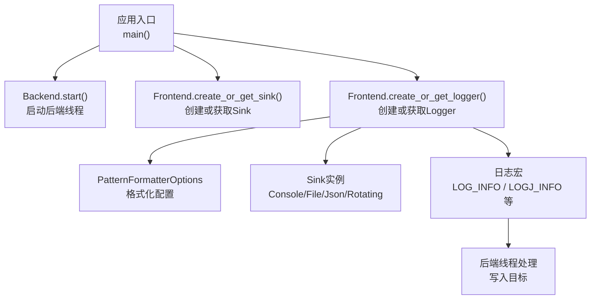
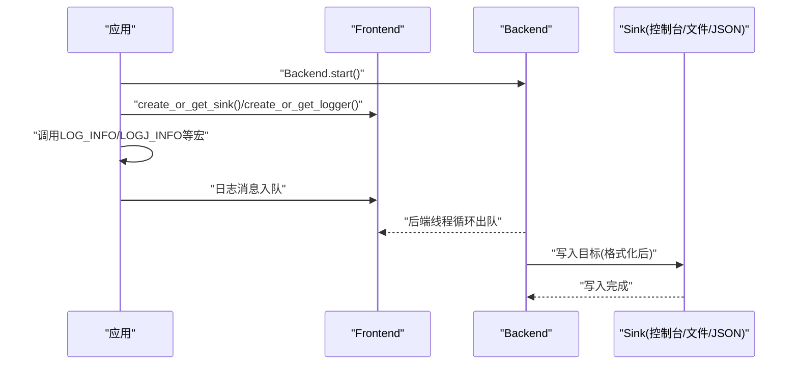
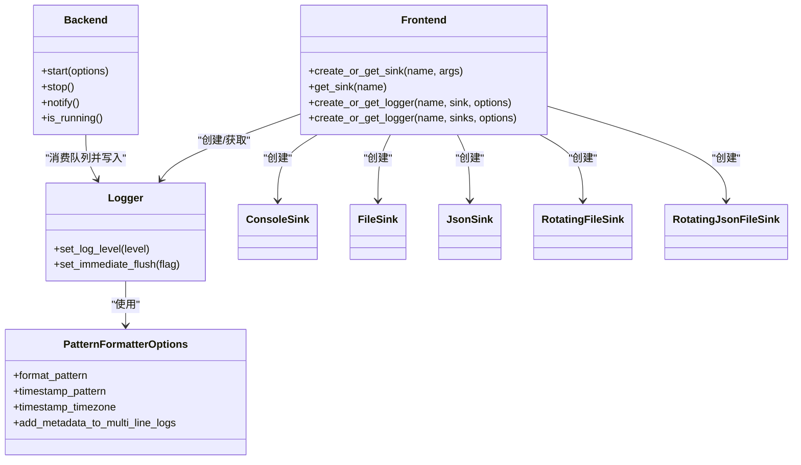

# 基础使用示例

<cite>
**本文引用的文件**
- [console_logging.cpp](file://examples/console_logging.cpp)
- [file_logging.cpp](file://examples/file_logging.cpp)
- [json_console_logging.cpp](file://examples/json_console_logging.cpp)
- [json_file_logging.cpp](file://examples/json_file_logging.cpp)
- [rotating_file_logging.cpp](file://examples/rotating_file_logging.cpp)
- [rotating_json_file_logging.cpp](file://examples/rotating_json_file_logging.cpp)
- [SimpleSetup.h](file://include/quill/SimpleSetup.h)
- [quill_docs_quick_start.cpp](file://docs/examples/quill_docs_quick_start.cpp)
- [LogMacros.h](file://include/quill/LogMacros.h)
- [Frontend.h](file://include/quill/Frontend.h)
- [Backend.h](file://include/quill/Backend.h)
- [PatternFormatterOptions.h](file://include/quill/core/PatternFormatterOptions.h)
</cite>

## 目录
1. [简介](#简介)
2. [项目结构](#项目结构)
3. [核心组件](#核心组件)
4. [架构总览](#架构总览)
5. [详细组件分析](#详细组件分析)
6. [依赖关系分析](#依赖关系分析)
7. [性能注意事项](#性能注意事项)
8. [故障排查指南](#故障排查指南)
9. [结论](#结论)
10. [附录](#附录)

## 简介
本文件面向初学者，提供Quill日志库的基础使用示例与说明，覆盖以下常见场景：
- 控制台输出（标准输出/标准错误）
- 文件记录（普通文件）
- JSON格式化输出（控制台与文件）
- 轮转文件（按大小与按时间）
- 快速集成方式（SimpleSetup）

每个示例均给出“如何配置”“如何运行”的步骤说明，并解释关键参数与概念，帮助你在几分钟内完成集成。

## 项目结构
Quill的示例位于examples目录，核心API位于include/quill下。基础示例主要涉及：
- 后端启动：Backend
- 前端接口：Frontend（创建/获取Sink与Logger）
- 日志宏：LogMacros（LOG_INFO、LOGJ_INFO等）
- 格式化选项：PatternFormatterOptions
- 多种Sink类型：ConsoleSink、FileSink、JsonSink、RotatingFileSink、RotatingJsonFileSink

图表来源
- [Backend.h:36-57](file://include/quill/Backend.h#L36-L57)
- [Frontend.h:120-198](file://include/quill/Frontend.h#L120-L198)
- [PatternFormatterOptions.h:23-40](file://include/quill/core/PatternFormatterOptions.h#L23-L40)

章节来源
- [console_logging.cpp:20-31](file://examples/console_logging.cpp#L20-L31)
- [file_logging.cpp:29-58](file://examples/file_logging.cpp#L29-L58)
- [json_console_logging.cpp:9-25](file://examples/json_console_logging.cpp#L9-L25)
- [json_file_logging.cpp:19-43](file://examples/json_file_logging.cpp#L19-L43)
- [rotating_file_logging.cpp:14-39](file://examples/rotating_file_logging.cpp#L14-L39)
- [rotating_json_file_logging.cpp:14-39](file://examples/rotating_json_file_logging.cpp#L14-L39)

## 核心组件
- Backend：负责启动/停止后端工作线程，处理日志落盘、刷新、通知等。
- Frontend：提供创建/获取Sink与Logger的静态接口；支持多Sink组合。
- Logger：日志器对象，绑定一个或多个Sink，设置日志级别、刷新策略等。
- PatternFormatterOptions：控制日志消息格式、时间戳格式与时区、是否为多行日志添加元数据等。
- 日志宏：如LOG_INFO、LOGJ_INFO、LOG_INFO_LIMIT、LOG_INFO_LIMIT_EVERY_N等，用于便捷记录。

章节来源
- [Backend.h:36-57](file://include/quill/Backend.h#L36-L57)
- [Frontend.h:120-198](file://include/quill/Frontend.h#L120-L198)
- [PatternFormatterOptions.h:23-40](file://include/quill/core/PatternFormatterOptions.h#L23-L40)
- [LogMacros.h:28-45](file://include/quill/LogMacros.h#L28-L45)

## 架构总览
Quill采用“前端异步队列 + 后端工作线程”的设计。前端线程仅做格式化与入队，后端线程负责从队列取出并写入具体Sink（控制台/文件/JSON等）。

图表来源
- [Backend.h:36-57](file://include/quill/Backend.h#L36-L57)
- [Frontend.h:120-198](file://include/quill/Frontend.h#L120-L198)

## 详细组件分析

### 快速开始（SimpleSetup）
- 适用场景：最小成本集成，快速输出到控制台或文件。
- 关键点：
  - simple_logger()会自动根据输出目标创建Sink与Logger，并启动Backend。
  - 输出目标为"stdout"/"stderr"时使用ConsoleSink；否则作为文件名使用FileSink。
- 示例路径：
  - [quill_docs_quick_start.cpp:1-13](file://docs/examples/quill_docs_quick_start.cpp#L1-L13)
  - [SimpleSetup.h:46-72](file://include/quill/SimpleSetup.h#L46-L72)

章节来源
- [SimpleSetup.h:46-72](file://include/quill/SimpleSetup.h#L46-L72)
- [quill_docs_quick_start.cpp:4-12](file://docs/examples/quill_docs_quick_start.cpp#L4-L12)

### 控制台输出（ConsoleSink）
- 适用场景：开发调试、实时查看日志。
- 关键点：
  - 使用Frontend::create_or_get_sink创建ConsoleSink。
  - 可通过PatternFormatterOptions自定义时间戳、线程ID、源位置等字段。
  - 支持限频宏（每秒/每N次）与变量命名宏（LOGV_*、LOGJ_*）。
- 示例路径：
  - [console_logging.cpp:20-72](file://examples/console_logging.cpp#L20-L72)
  - [Frontend.h:120-135](file://include/quill/Frontend.h#L120-L135)
  - [LogMacros.h:165-200](file://include/quill/LogMacros.h#L165-L200)

章节来源
- [console_logging.cpp:20-72](file://examples/console_logging.cpp#L20-L72)
- [LogMacros.h:165-200](file://include/quill/LogMacros.h#L165-L200)

### 文件记录（FileSink）
- 适用场景：将日志持久化到文件。
- 关键点：
  - 使用Frontend::create_or_get_sink创建FileSink，可传入FileSinkConfig定制打开模式、文件名追加策略等。
  - 可通过PatternFormatterOptions设置时间戳格式与时区。
  - 在调试模式下可启用立即刷新以保证可见性。
- 示例路径：
  - [file_logging.cpp:29-73](file://examples/file_logging.cpp#L29-L73)
  - [Frontend.h:120-135](file://include/quill/Frontend.h#L120-L135)
  - [PatternFormatterOptions.h:23-40](file://include/quill/core/PatternFormatterOptions.h#L23-L40)

章节来源
- [file_logging.cpp:29-73](file://examples/file_logging.cpp#L29-L73)
- [PatternFormatterOptions.h:23-40](file://include/quill/core/PatternFormatterOptions.h#L23-L40)

### JSON格式化输出（JsonSink）
- 适用场景：结构化日志，便于解析与检索。
- 关键点：
  - 使用JsonConsoleSink或JsonFileSink。
  - 当仅输出JSON时，建议将格式化模板设为空字符串以避免额外格式化开销。
  - 提供LOGJ_*宏与命名占位符两种结构化记录方式。
- 示例路径：
  - [json_console_logging.cpp:9-54](file://examples/json_console_logging.cpp#L9-L54)
  - [json_file_logging.cpp:19-74](file://examples/json_file_logging.cpp#L19-L74)

章节来源
- [json_console_logging.cpp:9-54](file://examples/json_console_logging.cpp#L9-L54)
- [json_file_logging.cpp:19-74](file://examples/json_file_logging.cpp#L19-L74)

### 轮转文件（RotatingFileSink / RotatingJsonFileSink）
- 适用场景：长期运行服务的日志管理，避免单文件过大。
- 关键点：
  - 支持按每日轮转与最大文件大小轮转。
  - 可结合FileSinkConfig设置打开模式、文件名追加策略等。
  - 可同时创建混合Logger，既输出JSON又输出人类可读格式到控制台。
- 示例路径：
  - [rotating_file_logging.cpp:14-45](file://examples/rotating_file_logging.cpp#L14-L45)
  - [rotating_json_file_logging.cpp:14-45](file://examples/rotating_json_file_logging.cpp#L14-L45)

章节来源
- [rotating_file_logging.cpp:14-45](file://examples/rotating_file_logging.cpp#L14-L45)
- [rotating_json_file_logging.cpp:14-45](file://examples/rotating_json_file_logging.cpp#L14-L45)

### 多Sink组合（同时输出到控制台与JSON文件）
- 适用场景：既要人类可读输出，又要结构化日志落地。
- 关键点：
  - 通过Frontend::create_or_get_logger传入多个Sink实现多路输出。
  - JSON Sink使用其内部格式，人类可读格式由Console Sink负责。
- 示例路径：
  - [json_file_logging.cpp:49-73](file://examples/json_file_logging.cpp#L49-L73)

章节来源
- [json_file_logging.cpp:49-73](file://examples/json_file_logging.cpp#L49-L73)

## 依赖关系分析
- 前端与后端解耦：Frontend只负责格式化与入队，Backend负责实际写入。
- Logger与Sink松耦合：Logger可绑定一个或多个Sink；通过Frontend统一管理。
- 格式化独立：PatternFormatterOptions仅影响非结构化日志格式，JSON Sink有自身内部格式。

图表来源
- [Backend.h:36-57](file://include/quill/Backend.h#L36-L57)
- [Frontend.h:120-198](file://include/quill/Frontend.h#L120-L198)
- [PatternFormatterOptions.h:23-40](file://include/quill/core/PatternFormatterOptions.h#L23-L40)

## 性能注意事项
- 后端线程：Backend::start在进程范围内只需一次，通常在main开头启动。
- 立即刷新：调试阶段可开启立即刷新，但会影响性能，发布环境建议关闭。
- 限频宏：LOG_INFO_LIMIT与LOG_INFO_LIMIT_EVERY_N可用于降低高频日志的吞吐压力。
- 格式化开销：仅输出JSON时，将格式化模板置空可减少不必要的格式化成本。
- 多Sink：多路输出会增加写入次数，需权衡可读性与性能。

章节来源
- [file_logging.cpp:60-66](file://examples/file_logging.cpp#L60-L66)
- [json_console_logging.cpp:20-24](file://examples/json_console_logging.cpp#L20-L24)
- [json_file_logging.cpp:39-42](file://examples/json_file_logging.cpp#L39-L42)

## 故障排查指南
- 后端未启动：若无日志输出，请确认已调用Backend::start。
- Sink名称冲突：使用Frontend::create_or_get_sink时，相同名称会复用已有Sink；确保命名一致。
- 多行日志元数据缺失：检查PatternFormatterOptions::add_metadata_to_multi_line_logs是否为true。
- JSON格式异常：确保使用命名占位符（如"{var}"），并在仅输出JSON时将格式模板置空。
- 权限问题：文件写入失败请检查目标路径权限与磁盘空间。

章节来源
- [Backend.h:36-57](file://include/quill/Backend.h#L36-L57)
- [Frontend.h:120-135](file://include/quill/Frontend.h#L120-L135)
- [PatternFormatterOptions.h:121-129](file://include/quill/core/PatternFormatterOptions.h#L121-L129)

## 结论
通过以上基础示例，你可以快速完成Quill的集成：
- 开发调试：使用SimpleSetup或ConsoleSink
- 生产落地：使用FileSink或RotatingFileSink
- 结构化采集：使用JsonSink或同时输出JSON与人类可读格式
- 高效稳定：合理配置格式化、限频与刷新策略

## 附录

### 快速清单（从零到一）
- 启动后端：Backend::start()
- 创建Sink：Frontend::create_or_get_sink<ConsoleSink/JsonSink/FileSink/Rotating*>()
- 创建Logger：Frontend::create_or_get_logger("logger_name", sink, PatternFormatterOptions{})
- 记录日志：LOG_INFO / LOGJ_INFO / LOG_INFO_LIMIT 等
- 运行程序：观察控制台或目标文件

章节来源
- [console_logging.cpp:20-31](file://examples/console_logging.cpp#L20-L31)
- [file_logging.cpp:29-58](file://examples/file_logging.cpp#L29-L58)
- [json_console_logging.cpp:9-25](file://examples/json_console_logging.cpp#L9-L25)
- [json_file_logging.cpp:19-43](file://examples/json_file_logging.cpp#L19-L43)
- [rotating_file_logging.cpp:14-39](file://examples/rotating_file_logging.cpp#L14-L39)
- [rotating_json_file_logging.cpp:14-39](file://examples/rotating_json_file_logging.cpp#L14-L39)
- [SimpleSetup.h:46-72](file://include/quill/SimpleSetup.h#L46-L72)