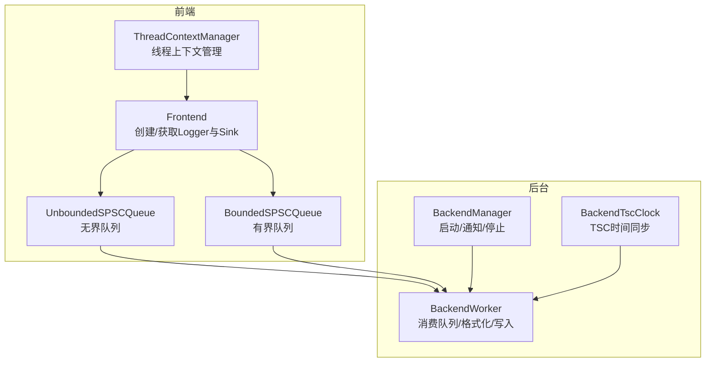
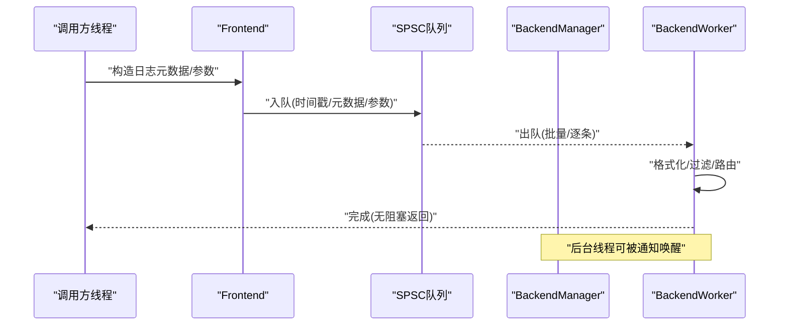
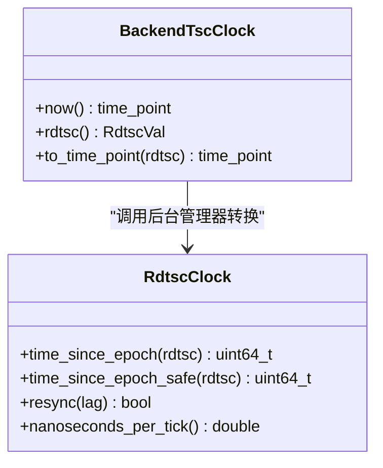
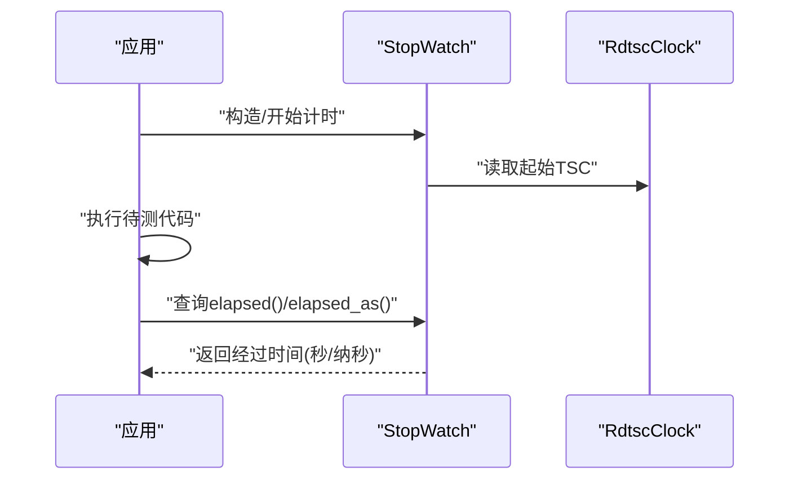
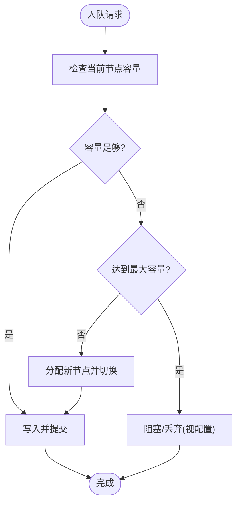
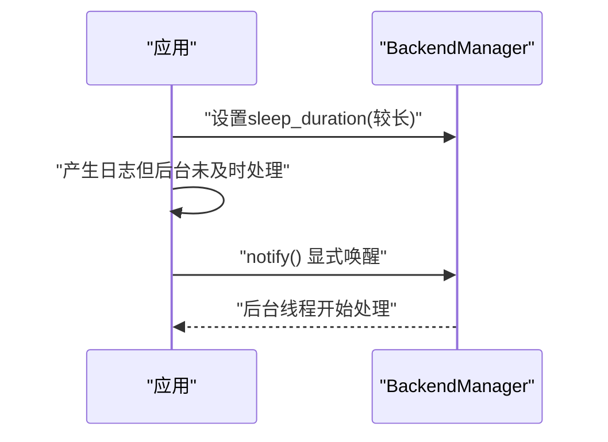
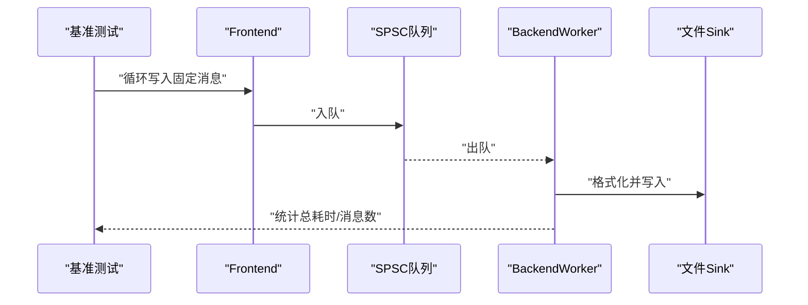
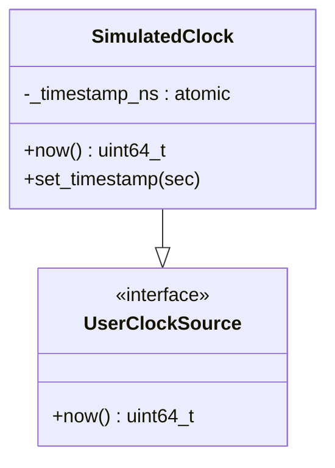
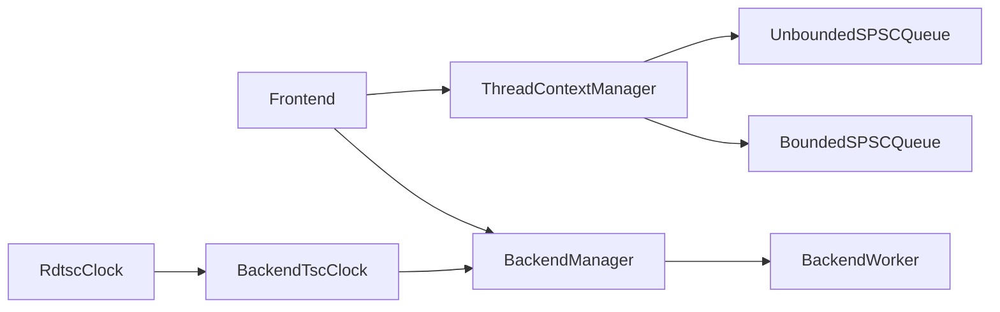

# 性能优化示例

<cite>
**本文引用的文件**
- [README.md](file://README.md)
- [RdtscClock.h](file://include/quill/backend/RdtscClock.h)
- [BackendTscClock.h](file://include/quill/BackendTscClock.h)
- [StopWatch.h](file://include/quill/StopWatch.h)
- [quill_hot_path_rdtsc_clock.cpp](file://benchmarks/hot_path_latency/quill_hot_path_rdtsc_clock.cpp)
- [quill_hot_path_system_clock.cpp](file://benchmarks/hot_path_latency/quill_hot_path_system_clock.cpp)
- [backend_thread_notify.cpp](file://examples/backend_thread_notify.cpp)
- [backend_tsc_clock.cpp](file://examples/backend_tsc_clock.cpp)
- [system_clock_logging.cpp](file://examples/system_clock_logging.cpp)
- [stopwatch.cpp](file://examples/stopwatch.cpp)
- [quill_backend_throughput.cpp](file://benchmarks/backend_throughput/quill_backend_throughput.cpp)
- [quill_backend_throughput_no_buffering.cpp](file://benchmarks/backend_throughput/quill_backend_throughput_no_buffering.cpp)
- [BackendManager.h](file://include/quill/backend/BackendManager.h)
- [ThreadContextManager.h](file://include/quill/core/ThreadContextManager.h)
- [UnboundedSPSCQueue.h](file://include/quill/core/UnboundedSPSCQueue.h)
- [BoundedSPSCQueue.h](file://include/quill/core/BoundedSPSCQueue.h)
- [bounded_dropping_queue_frontend.cpp](file://examples/bounded_dropping_queue_frontend.cpp)
- [user_clock_source.cpp](file://examples/user_clock_source.cpp)
</cite>

## 目录
1. [简介](#简介)
2. [项目结构](#项目结构)
3. [核心组件](#核心组件)
4. [架构总览](#架构总览)
5. [详细组件分析](#详细组件分析)
6. [依赖关系分析](#依赖关系分析)
7. [性能考量](#性能考量)
8. [故障排查指南](#故障排查指南)
9. [结论](#结论)
10. [附录](#附录)

## 简介
本文件面向希望在Quill中实现高性能日志记录的开发者，系统性地总结了时钟源选择、后台线程通知、计时器使用、内存与缓存优化、并发处理等关键性能优化策略，并结合仓库中的基准测试与示例，给出可操作的实践建议与监控方法。

## 项目结构
Quill采用“前端异步队列 + 后台工作线程”的设计：前端线程通过无界或有界单生产者单消费者（SPSC）队列将日志事件发送到后台线程，后台线程负责格式化与落盘。该结构在低延迟与高吞吐之间取得平衡，并提供了多种时钟源与队列模式以适配不同场景。

图表来源
- [BackendManager.h:38-128](file://include/quill/backend/BackendManager.h#L38-L128)
- [ThreadContextManager.h:216-338](file://include/quill/core/ThreadContextManager.h#L216-L338)
- [UnboundedSPSCQueue.h:42-337](file://include/quill/core/UnboundedSPSCQueue.h#L42-L337)
- [BoundedSPSCQueue.h:54-346](file://include/quill/core/BoundedSPSCQueue.h#L54-L346)
- [BackendTscClock.h:33-98](file://include/quill/BackendTscClock.h#L33-L98)

章节来源
- [README.md: 设计说明:697-702](file://README.md#L697-L702)
- [BackendManager.h: 后端管理器:38-128](file://include/quill/backend/BackendManager.h#L38-L128)
- [ThreadContextManager.h: 线程上下文管理:216-338](file://include/quill/core/ThreadContextManager.h#L216-L338)
- [UnboundedSPSCQueue.h: 无界队列:42-337](file://include/quill/core/UnboundedSPSCQueue.h#L42-L337)
- [BoundedSPSCQueue.h: 有界队列:54-346](file://include/quill/core/BoundedSPSCQueue.h#L54-L346)
- [BackendTscClock.h: 后台TSC时钟:33-98](file://include/quill/BackendTscClock.h#L33-L98)

## 核心组件
- 时钟与计时
  - RDTSC时钟：用于高精度时间戳换算，支持后台线程同步与安全查询。
  - 后台TSC时钟：提供与后台线程TSC对齐的时间戳，便于应用侧与日志时间对齐。
  - 停表工具：基于TSC或系统时钟的轻量计时器，支持秒级与纳秒级输出。
- 队列与内存
  - 无界SPSC队列：按需扩容至最大容量，适合高负载场景；支持收缩以节省内存。
  - 有界SPSC队列：固定容量，支持阻塞/丢弃两种策略，适合严格资源控制。
  - 线程上下文：每个线程维护独立队列与缓存，减少跨线程竞争。
- 后台线程与通知
  - 后台管理器：统一启动/停止/通知后台线程，暴露TSC到墙钟转换接口。
  - 手动唤醒：在较长睡眠间隔下，通过显式通知唤醒后台线程，降低CPU占用。

章节来源
- [RdtscClock.h: RDTSC时钟实现:36-265](file://include/quill/backend/RdtscClock.h#L36-L265)
- [BackendTscClock.h: 后台TSC时钟:33-98](file://include/quill/BackendTscClock.h#L33-L98)
- [StopWatch.h: 停表工具:44-144](file://include/quill/StopWatch.h#L44-L144)
- [UnboundedSPSCQueue.h: 无界队列:42-337](file://include/quill/core/UnboundedSPSCQueue.h#L42-L337)
- [BoundedSPSCQueue.h: 有界队列:54-346](file://include/quill/core/BoundedSPSCQueue.h#L54-L346)
- [ThreadContextManager.h: 线程上下文:53-214](file://include/quill/core/ThreadContextManager.h#L53-L214)
- [BackendManager.h: 后台管理器:38-128](file://include/quill/backend/BackendManager.h#L38-L128)

## 架构总览
Quill的热路径（调用方线程）仅进行数据打包与入队，后台线程负责格式化与I/O，从而最小化调用方延迟。时钟源可选系统时钟、RDTSC或用户自定义时钟，满足不同精度与一致性需求。

图表来源
- [README.md: 设计说明:697-702](file://README.md#L697-L702)
- [BackendManager.h: 后台管理器:61-102](file://include/quill/backend/BackendManager.h#L61-L102)
- [UnboundedSPSCQueue.h: 入队/出队:115-224](file://include/quill/core/UnboundedSPSCQueue.h#L115-L224)
- [BoundedSPSCQueue.h: 入队/出队:105-169](file://include/quill/core/BoundedSPSCQueue.h#L105-L169)

## 详细组件分析

### 组件A：RDTSC时钟与后台TSC时间同步
- RDTSC时钟
  - 计算每纳秒对应的TSC刻度，周期性重同步以消除漂移。
  - 提供安全查询接口，避免在未初始化时产生错误时间戳。
- 后台TSC时钟
  - 将后台线程的TSC值转换为墙钟时间，供应用侧获取与日志对齐。
  - 若未启用TSC时钟，则回退到系统时钟。

图表来源
- [RdtscClock.h: RDTSC时钟类:36-265](file://include/quill/backend/RdtscClock.h#L36-L265)
- [BackendTscClock.h: 后台TSC时钟类:33-98](file://include/quill/BackendTscClock.h#L33-L98)

章节来源
- [RdtscClock.h: 重同步与安全查询:146-193](file://include/quill/backend/RdtscClock.h#L146-L193)
- [BackendTscClock.h: 同步时间戳:64-97](file://include/quill/BackendTscClock.h#L64-L97)
- [backend_tsc_clock.cpp: 示例:19-63](file://examples/backend_tsc_clock.cpp#L19-L63)

### 组件B：停表工具与性能测量
- 基于TSC的停表：利用RDTSC刻度换算，提供纳秒到秒的高精度计时。
- 基于系统时钟的停表：适用于需要与系统时间对齐的场景。
- 实战：在示例中演示如何记录一段代码执行耗时，并输出不同精度结果。

图表来源
- [StopWatch.h: 停表模板:44-113](file://include/quill/StopWatch.h#L44-L113)
- [stopwatch.cpp: 示例:14-51](file://examples/stopwatch.cpp#L14-L51)

章节来源
- [StopWatch.h: 模板实现与编码器:44-144](file://include/quill/StopWatch.h#L44-L144)
- [stopwatch.cpp: 使用示例:14-51](file://examples/stopwatch.cpp#L14-L51)

### 组件C：队列与内存优化
- 无界SPSC队列
  - 动态扩容至最大容量，避免阻塞；支持收缩以释放内存。
  - 出现新节点时，消费者在切换前提交已读数据，保证一致性。
- 有界SPSC队列
  - 固定容量，支持阻塞/丢弃策略，适合资源受限环境。
  - 内存对齐与缓存行优化，减少伪共享与刷新开销。
- 线程上下文
  - 每个线程拥有独立队列与条件参数大小缓存，降低锁竞争。

图表来源
- [UnboundedSPSCQueue.h: 扩容与切换逻辑:244-297](file://include/quill/core/UnboundedSPSCQueue.h#L244-L297)
- [BoundedSPSCQueue.h: 缓冲区与缓存行优化:54-95](file://include/quill/core/BoundedSPSCQueue.h#L54-L95)

章节来源
- [UnboundedSPSCQueue.h: 收缩与扩容:166-183](file://include/quill/core/UnboundedSPSCQueue.h#L166-L183)
- [BoundedSPSCQueue.h: 写入/提交与缓存行刷新:105-169](file://include/quill/core/BoundedSPSCQueue.h#L105-L169)
- [ThreadContextManager.h: 线程上下文注册与失效:243-327](file://include/quill/core/ThreadContextManager.h#L243-L327)

### 组件D：后台线程通知与唤醒
- 在较长睡眠间隔下，后台线程可能不频繁唤醒，导致日志延迟。
- 通过显式通知唤醒后台线程，可在节能与实时性之间取得平衡。
- 示例展示了设置长睡眠间隔并在需要时手动唤醒的用法。

图表来源
- [BackendManager.h: notify_backend_thread:90-90](file://include/quill/backend/BackendManager.h#L90-L90)
- [backend_thread_notify.cpp: 示例:22-56](file://examples/backend_thread_notify.cpp#L22-L56)

章节来源
- [BackendManager.h: 后台线程生命周期:61-102](file://include/quill/backend/BackendManager.h#L61-L102)
- [backend_thread_notify.cpp: 手动唤醒:22-56](file://examples/backend_thread_notify.cpp#L22-L56)

### 组件E：时钟源选择与基准对比
- RDTSC vs 系统时钟
  - RDTSC提供更高精度与更低抖动，适合低延迟场景。
  - 系统时钟更易与外部系统时间对齐，适合合规审计。
- 基准测试
  - 热路径延迟：对比RDTSC与系统时钟在单线程与多线程下的延迟。
  - 吞吐量：后台线程持续写入文件的吞吐测量。

图表来源
- [quill_hot_path_rdtsc_clock.cpp: RDTSC热路径基准:26-92](file://benchmarks/hot_path_latency/quill_hot_path_rdtsc_clock.cpp#L26-L92)
- [quill_hot_path_system_clock.cpp: 系统时钟热路径基准:26-95](file://benchmarks/hot_path_latency/quill_hot_path_system_clock.cpp#L26-L95)
- [quill_backend_throughput.cpp: 吞吐基准:14-68](file://benchmarks/backend_throughput/quill_backend_throughput.cpp#L14-L68)
- [quill_backend_throughput_no_buffering.cpp: 无缓冲吞吐基准:14-71](file://benchmarks/backend_throughput/quill_backend_throughput_no_buffering.cpp#L14-L71)

章节来源
- [quill_hot_path_rdtsc_clock.cpp: RDTSC热路径:26-92](file://benchmarks/hot_path_latency/quill_hot_path_rdtsc_clock.cpp#L26-L92)
- [quill_hot_path_system_clock.cpp: 系统时钟热路径:26-95](file://benchmarks/hot_path_latency/quill_hot_path_system_clock.cpp#L26-L95)
- [quill_backend_throughput.cpp: 吞吐量测量:14-68](file://benchmarks/backend_throughput/quill_backend_throughput.cpp#L14-L68)
- [quill_backend_throughput_no_buffering.cpp: 无缓冲吞吐:14-71](file://benchmarks/backend_throughput/quill_backend_throughput_no_buffering.cpp#L14-L71)

### 组件F：自定义时钟源与模拟时间
- 用户自定义时钟：实现UserClockSource接口，提供纳秒级时间戳。
- 应用场景：仿真/回放/对齐外部系统时间，确保日志时间与业务时钟一致。
- 注意：自定义时钟需线程安全，且实例生命周期需覆盖Logger存在期。

图表来源
- [user_clock_source.cpp: 自定义时钟示例:23-47](file://examples/user_clock_source.cpp#L23-L47)

章节来源
- [user_clock_source.cpp: 自定义时钟实现与使用:23-83](file://examples/user_clock_source.cpp#L23-L83)

## 依赖关系分析
- 前端到后台
  - Frontend通过ThreadContextManager注册线程上下文，每个线程拥有独立SPSC队列。
  - BackendManager统一管理后台线程生命周期与通知。
- 时间同步
  - BackendTscClock依赖BackendManager提供的TSC到墙钟转换。
  - RdtscClock在后台线程初始化后计算ns/tick并定期重同步。
- 队列与内存
  - UnboundedSPSCQueue与BoundedSPSCQueue分别对应不同队列类型，后者包含缓存行优化与大页策略。

图表来源
- [ThreadContextManager.h: 注册/失效:243-327](file://include/quill/core/ThreadContextManager.h#L243-L327)
- [BackendManager.h: 管理后台线程:61-102](file://include/quill/backend/BackendManager.h#L61-L102)
- [BackendTscClock.h: TSC时间同步:64-97](file://include/quill/BackendTscClock.h#L64-L97)
- [RdtscClock.h: 重同步机制:196-230](file://include/quill/backend/RdtscClock.h#L196-L230)

章节来源
- [ThreadContextManager.h: 线程上下文管理:216-338](file://include/quill/core/ThreadContextManager.h#L216-L338)
- [BackendManager.h: 后台管理器:38-128](file://include/quill/backend/BackendManager.h#L38-L128)
- [BackendTscClock.h: 后台TSC时钟:33-98](file://include/quill/BackendTscClock.h#L33-L98)
- [RdtscClock.h: RDTSC时钟:36-265](file://include/quill/backend/RdtscClock.h#L36-L265)

## 性能考量
- 时钟源选择
  - 低延迟优先：RDTSC时钟；需关注重同步与跨核一致性。
  - 对齐需求：系统时钟；与操作系统时间对齐，便于审计。
  - 自定义时钟：仿真/回放场景，需保证线程安全与生命周期。
- 队列与内存
  - 无界队列：高负载下避免阻塞，注意峰值内存与扩容成本。
  - 有界队列：可预测内存占用，结合阻塞/丢弃策略平衡可靠性。
  - 大页与缓存行：在Linux上可启用大页以降低TLB压力；队列实现已做缓存行对齐与刷新优化。
- 后台线程
  - 合理设置sleep_duration，在能耗与延迟间折衷。
  - 长睡眠间隔下使用notify()主动唤醒，避免日志积压。
- 并发与缓存
  - 每线程独立队列减少锁竞争；线程上下文缓存常用信息（如线程ID/名称）。
  - 避免在热路径上进行昂贵的格式化或I/O操作。

## 故障排查指南
- 日志延迟过大
  - 检查后台sleep_duration是否过长，必要时调小或使用notify()唤醒。
  - 参考：[backend_thread_notify.cpp:22-56](file://examples/backend_thread_notify.cpp#L22-L56)
- 时间戳异常或为0
  - 若未启用TSC时钟，BackendTscClock会回退到系统时钟；确认Logger时钟源配置。
  - 参考：[BackendTscClock.h:64-97](file://include/quill/BackendTscClock.h#L64-L97)
- 单条消息过大导致失败
  - 无界队列达到最大容量时会抛出异常；增大FrontendOptions::unbounded_queue_max_capacity或拆分消息。
  - 参考：[UnboundedSPSCQueue.h:253-275](file://include/quill/core/UnboundedSPSCQueue.h#L253-L275)
- 队列阻塞/丢弃
  - 有界队列在高负载下可能阻塞或丢弃；根据场景选择BoundedDropping或增大容量。
  - 参考：[bounded_dropping_queue_frontend.cpp:21-32](file://examples/bounded_dropping_queue_frontend.cpp#L21-L32)

章节来源
- [backend_thread_notify.cpp: 线程唤醒:22-56](file://examples/backend_thread_notify.cpp#L22-L56)
- [BackendTscClock.h: 回退逻辑:64-97](file://include/quill/BackendTscClock.h#L64-L97)
- [UnboundedSPSCQueue.h: 最大容量限制:253-275](file://include/quill/core/UnboundedSPSCQueue.h#L253-L275)
- [bounded_dropping_queue_frontend.cpp: 有界丢弃队列:21-32](file://examples/bounded_dropping_queue_frontend.cpp#L21-L32)

## 结论
通过合理选择时钟源、优化队列与内存布局、控制后台线程唤醒策略以及使用停表工具进行精准测量，可以在Quill中实现低延迟与高吞吐的日志能力。建议在开发阶段使用停表工具与基准测试验证优化效果，并在生产环境中结合实际负载动态调整队列与后台参数。

## 附录
- 快速参考
  - 时钟源：系统时钟、RDTSC、用户自定义
  - 队列类型：无界阻塞/丢弃、有界阻塞/丢弃
  - 后台参数：sleep_duration、CPU亲和性、传输事件软硬上限
- 实战清单
  - 使用StopWatch测量热点函数耗时
  - 在长睡眠间隔场景下使用notify()主动唤醒
  - 通过FrontendOptions选择合适的队列与大页策略
  - 使用BackendTscClock对齐应用时间与日志时间