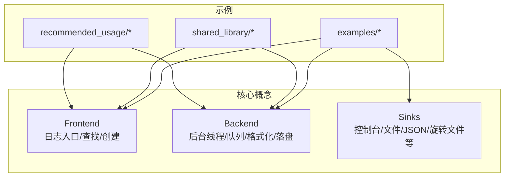
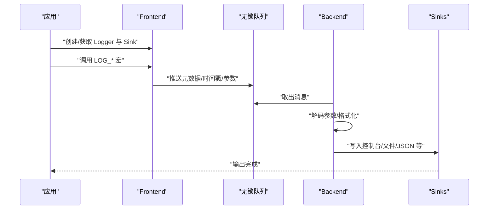
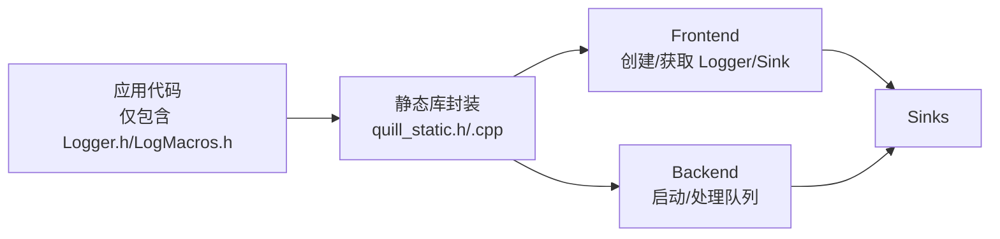
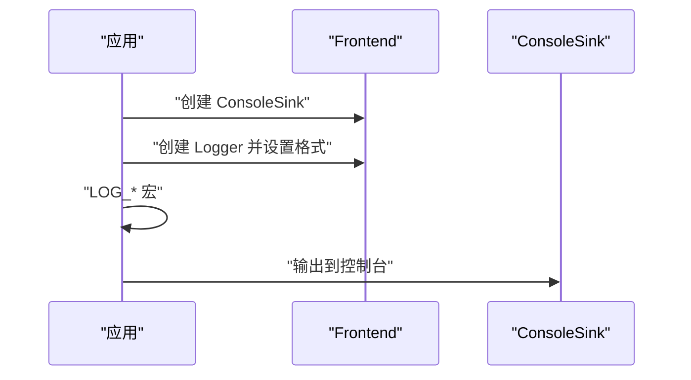
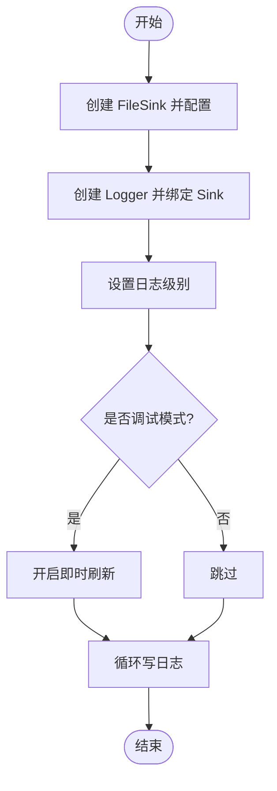
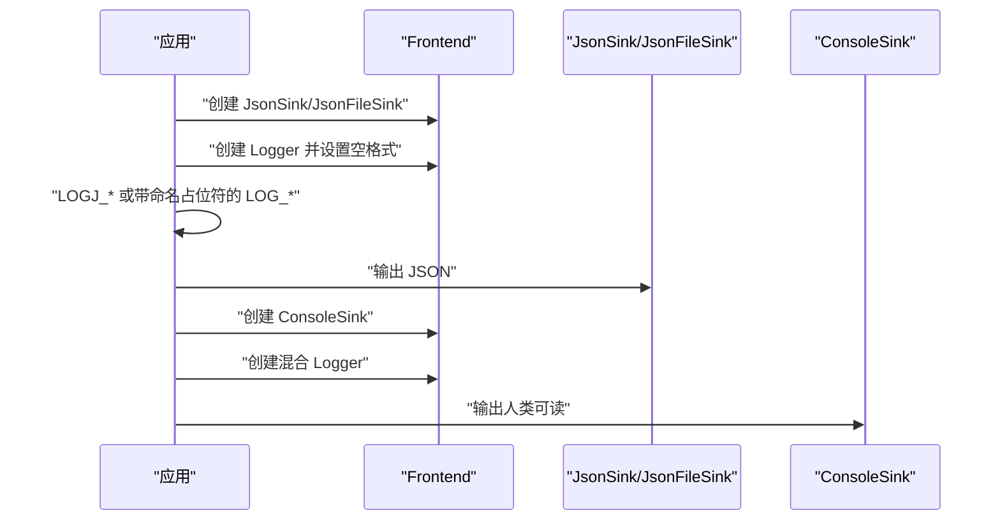
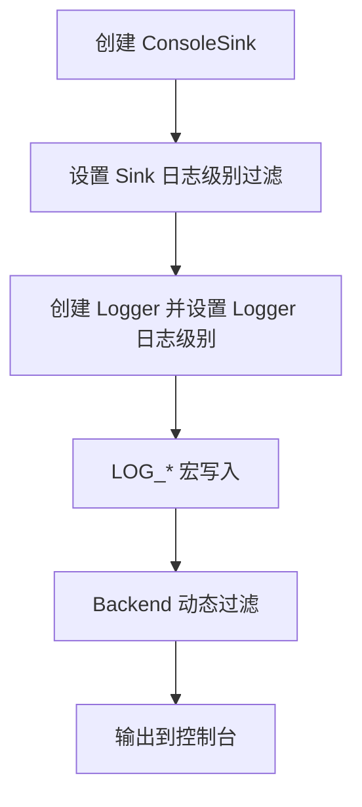
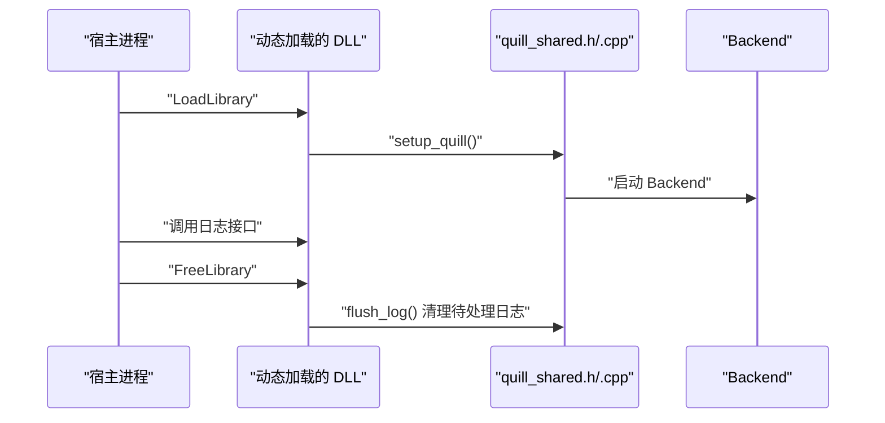
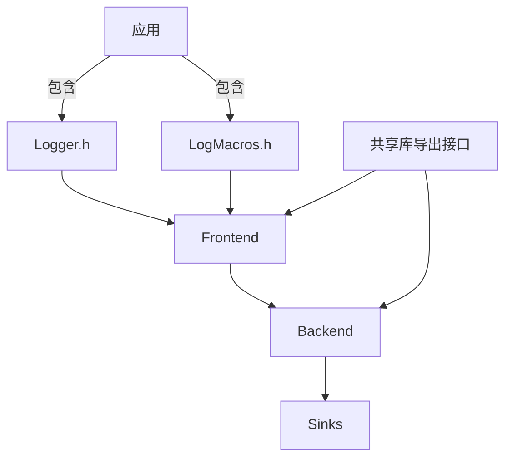

# 示例与最佳实践

<cite>
**本文引用的文件**
- [README.md](file://README.md)
- [recommended_usage.cpp](file://examples/recommended_usage/recommended_usage.cpp)
- [std_types_logging.cpp](file://examples/recommended_usage/std_types_logging.cpp)
- [use_overwrite_macros.cpp](file://examples/recommended_usage/use_overwrite_macros.cpp)
- [console_logging.cpp](file://examples/console_logging.cpp)
- [json_console_logging.cpp](file://examples/json_console_logging.cpp)
- [file_logging.cpp](file://examples/file_logging.cpp)
- [json_file_logging.cpp](file://examples/json_file_logging.cpp)
- [filter_logging.cpp](file://examples/filter_logging.cpp)
- [tags_logging.cpp](file://examples/tags_logging.cpp)
- [example_shared.cpp](file://examples/shared_library/example_shared.cpp)
- [quill_shared.cpp](file://examples/shared_library/quill_shared_lib/quill_shared.cpp)
- [quill_shared.h](file://examples/shared_library/quill_shared_lib/quill_shared.h)
</cite>

## 目录
1. [简介](#简介)
2. [项目结构](#项目结构)
3. [核心组件](#核心组件)
4. [架构总览](#架构总览)
5. [详细组件分析](#详细组件分析)
6. [依赖关系分析](#依赖关系分析)
7. [性能考量](#性能考量)
8. [故障排查指南](#故障排查指南)
9. [结论](#结论)
10. [附录](#附录)

## 简介
本指南面向希望在生产环境中高效、稳定地使用 Quill 的开发者，覆盖从入门到进阶的完整示例与最佳实践。内容包括：
- 基础控制台输出、文件记录、JSON 格式化等常见场景
- 推荐的代码组织方式：静态库与共享库两种集成路径
- 性能优化的实际案例与调试技巧
- 多线程与并发安全的最佳实践

## 项目结构
仓库中与示例和最佳实践直接相关的核心目录与文件如下：
- examples/recommended_usage：推荐用法与封装示例（静态库）
- examples/shared_library：共享库封装与导出接口示例
- examples 下的各类功能示例：控制台、文件、JSON、过滤、标签等
- README.md：快速开始、设计说明与注意事项

**图表来源**
- [README.md:464-528](file://README.md#L464-L528)
- [recommended_usage.cpp:1-50](file://examples/recommended_usage/recommended_usage.cpp#L1-L50)
- [example_shared.cpp:1-70](file://examples/shared_library/example_shared.cpp#L1-L70)

**章节来源**
- [README.md:102-190](file://README.md#L102-L190)

## 核心组件
- 前端（Frontend）：负责日志入口、查找或创建 Logger、创建或复用 Sink，并将消息推入无锁队列。
- 后端（Backend）：消费队列中的消息，按需解码参数、格式化、转发到各 Sink。
- Sinks：输出目标，如 ConsoleSink、FileSink、JsonSink、RotatingFileSink 等。

这些组件在示例中均有体现，例如：
- 快速开始与详细设置：[README.md:124-188](file://README.md#L124-L188)
- 控制台/文件/JSON 示例：[console_logging.cpp:1-72](file://examples/console_logging.cpp#L1-L72)、[file_logging.cpp:1-73](file://examples/file_logging.cpp#L1-L73)、[json_file_logging.cpp:1-74](file://examples/json_file_logging.cpp#L1-L74)
- 过滤与标签：[filter_logging.cpp:1-42](file://examples/filter_logging.cpp#L1-L42)、[tags_logging.cpp:1-43](file://examples/tags_logging.cpp#L1-L43)

**章节来源**
- [README.md:192-220](file://README.md#L192-L220)
- [README.md:679-703](file://README.md#L679-L703)

## 架构总览
下图展示了典型的调用链：前端将消息入队，后端线程消费并格式化，最终写入一个或多个 Sink。

**图表来源**
- [README.md:679-703](file://README.md#L679-L703)
- [console_logging.cpp:20-31](file://examples/console_logging.cpp#L20-L31)
- [file_logging.cpp:29-55](file://examples/file_logging.cpp#L29-L55)

## 详细组件分析

### 推荐用法与封装（静态库）
- 将后端实现封装到静态库，应用侧仅包含必要的头文件，降低编译时开销与头文件污染。
- 典型做法：在静态库中包含后端启动与全局 Logger 创建；应用侧仅通过头文件进行日志调用。

**图表来源**
- [recommended_usage.cpp:1-50](file://examples/recommended_usage/recommended_usage.cpp#L1-L50)
- [std_types_logging.cpp:1-65](file://examples/recommended_usage/std_types_logging.cpp#L1-L65)
- [use_overwrite_macros.cpp:1-14](file://examples/recommended_usage/use_overwrite_macros.cpp#L1-L14)

要点与建议
- 静态库中仅包含后端相关实现，避免在多个翻译单元重复引入后端代码。
- 应用侧仅包含 Logger.h 与 LogMacros.h，减少编译依赖。
- 可选使用全局 Logger，便于跨模块共享；也可通过 Frontend 获取。

**章节来源**
- [recommended_usage.cpp:1-50](file://examples/recommended_usage/recommended_usage.cpp#L1-L50)
- [std_types_logging.cpp:1-65](file://examples/recommended_usage/std_types_logging.cpp#L1-L65)
- [use_overwrite_macros.cpp:1-14](file://examples/recommended_usage/use_overwrite_macros.cpp#L1-L14)

### 控制台输出
- 使用 ConsoleSink 输出到控制台，支持自定义格式与时间戳。
- 支持限频宏（每秒/每 N 次）与命名参数、位置参数等 fmt 语法。

**图表来源**
- [console_logging.cpp:20-31](file://examples/console_logging.cpp#L20-L31)
- [console_logging.cpp:33-71](file://examples/console_logging.cpp#L33-L71)

**章节来源**
- [console_logging.cpp:1-72](file://examples/console_logging.cpp#L1-L72)

### 文件记录
- 使用 FileSink 写入文件，支持打开模式、文件名追加策略与事件通知器。
- 调试阶段可启用即时刷新以模拟同步行为，便于验证输出顺序与完整性。

**图表来源**
- [file_logging.cpp:29-66](file://examples/file_logging.cpp#L29-L66)

**章节来源**
- [file_logging.cpp:1-73](file://examples/file_logging.cpp#L1-L73)

### JSON 格式化
- 使用 JsonSink 或 JsonFileSink 输出结构化日志，便于后续解析与检索。
- 可同时创建“混合”Logger，既输出 JSON 文件，又输出人类可读控制台。

**图表来源**
- [json_console_logging.cpp:9-33](file://examples/json_console_logging.cpp#L9-L33)
- [json_file_logging.cpp:19-47](file://examples/json_file_logging.cpp#L19-L47)
- [json_file_logging.cpp:63-69](file://examples/json_file_logging.cpp#L63-L69)

**章节来源**
- [json_console_logging.cpp:1-54](file://examples/json_console_logging.cpp#L1-L54)
- [json_file_logging.cpp:1-74](file://examples/json_file_logging.cpp#L1-L74)

### 过滤与标签
- Sink 级别过滤：在 Sink 上设置最低日志级别，后端动态过滤。
- 日志标签：通过 TAGS 宏为消息打上标签，格式化时显示在指定位置。

**图表来源**
- [filter_logging.cpp:16-31](file://examples/filter_logging.cpp#L16-L31)

**章节来源**
- [filter_logging.cpp:1-42](file://examples/filter_logging.cpp#L1-L42)
- [tags_logging.cpp:1-43](file://examples/tags_logging.cpp#L1-L43)

### 共享库集成（Windows DLL 注意事项）
- 在 Windows 上构建共享库时，确保导出符号与导入宏正确配置。
- 动态加载 DLL 时，应在 DLL_PROCESS_DETACH 中 flush_log，避免卸载时丢失日志。

**图表来源**
- [example_shared.cpp:11-43](file://examples/shared_library/example_shared.cpp#L11-L43)
- [quill_shared.cpp:12-25](file://examples/shared_library/quill_shared_lib/quill_shared.cpp#L12-L25)
- [quill_shared.h:1-9](file://examples/shared_library/quill_shared_lib/quill_shared.h#L1-L9)

**章节来源**
- [example_shared.cpp:1-70](file://examples/shared_library/example_shared.cpp#L1-L70)
- [quill_shared.cpp:1-27](file://examples/shared_library/quill_shared_lib/quill_shared.cpp#L1-L27)
- [quill_shared.h:1-9](file://examples/shared_library/quill_shared_lib/quill_shared.h#L1-L9)

## 依赖关系分析
- 应用层仅依赖 Logger.h 与 LogMacros.h（静态库封装示例），减少编译时依赖。
- 前端负责 Logger/Sink 的创建与管理；后端负责队列消费与格式化；Sinks 负责具体输出。
- 共享库模式下，导出函数用于初始化与获取 Logger，避免符号可见性问题。

**图表来源**
- [recommended_usage.cpp:21-26](file://examples/recommended_usage/recommended_usage.cpp#L21-L26)
- [quill_shared.h:8-9](file://examples/shared_library/quill_shared_lib/quill_shared.h#L8-L9)

**章节来源**
- [recommended_usage.cpp:1-50](file://examples/recommended_usage/recommended_usage.cpp#L1-L50)
- [quill_shared.h:1-9](file://examples/shared_library/quill_shared_lib/quill_shared.h#L1-L9)

## 性能考量
- 后端线程异步处理：前端仅做入队与轻量格式化，避免阻塞调用线程。
- 队列模式选择：根据场景选择有界丢弃或无界队列，并关注丢弃与阻塞统计。
- 编译期优化：可通过编译时剔除特定日志级别以减少体积与编译时间。
- JSON 输出：当仅输出 JSON 时，将格式字符串设为空可避免额外格式化开销。
- 调试刷新：开发阶段启用即时刷新有助于定位问题，但会显著影响吞吐。

参考示例与说明
- 异步与延迟特性、吞吐对比与编译时间基准：[README.md:223-461](file://README.md#L223-L461)
- JSON 空格式优化：[json_console_logging.cpp:20-24](file://examples/json_console_logging.cpp#L20-L24)、[json_file_logging.cpp:39-42](file://examples/json_file_logging.cpp#L39-L42)
- 即时刷新用于调试：[file_logging.cpp:60-66](file://examples/file_logging.cpp#L60-L66)

**章节来源**
- [README.md:223-461](file://README.md#L223-L461)
- [json_console_logging.cpp:1-54](file://examples/json_console_logging.cpp#L1-L54)
- [json_file_logging.cpp:1-74](file://examples/json_file_logging.cpp#L1-L74)
- [file_logging.cpp:1-73](file://examples/file_logging.cpp#L1-L73)

## 故障排查指南
- 多线程与并发
  - 后端线程独立工作，前端使用无锁队列，通常无需外部同步。
  - 若需要严格时间序，可利用内置时间戳与格式化选项。
- fork 场景
  - 若程序使用 fork，应在子进程内重新启动后端并为父子进程分别写不同文件，避免竞争。
  - 参考注意事项与示例：[README.md:706-754](file://README.md#L706-L754)
- Windows DLL 卸载
  - 在 DLL_PROCESS_DETACH 中调用 flush_log，确保未处理的日志被写出。
  - 参考共享库示例注释与实现：[example_shared.cpp:18-43](file://examples/shared_library/example_shared.cpp#L18-L43)、[quill_shared.cpp:12-25](file://examples/shared_library/quill_shared_lib/quill_shared.cpp#L12-L25)
- 调试技巧
  - 开发阶段启用即时刷新，观察写盘顺序与完整性。
  - 使用限频宏减少噪声日志，聚焦关键信息。
  - 使用标签为不同上下文分组，提升可读性与检索效率。

**章节来源**
- [README.md:706-754](file://README.md#L706-L754)
- [example_shared.cpp:1-70](file://examples/shared_library/example_shared.cpp#L1-L70)
- [quill_shared.cpp:1-27](file://examples/shared_library/quill_shared_lib/quill_shared.cpp#L1-L27)
- [file_logging.cpp:60-66](file://examples/file_logging.cpp#L60-L66)
- [tags_logging.cpp:1-43](file://examples/tags_logging.cpp#L1-L43)

## 结论
- 推荐采用“静态库封装后端 + 应用仅包含前端头文件”的组织方式，兼顾编译性能与使用便捷。
- 控制台、文件与 JSON 是最常用的三种输出形态，可根据场景灵活组合。
- 在多线程与跨进程场景下，遵循后端线程独立、必要时启用即时刷新、Windows DLL 卸载前 flush_log 等最佳实践。
- 通过合理选择队列模式、格式化策略与限频宏，可在性能与可观测性之间取得平衡。

## 附录
- 快速开始与详细设置参考：[README.md:124-188](file://README.md#L124-L188)
- 设计说明与调用链：[README.md:679-703](file://README.md#L679-L703)