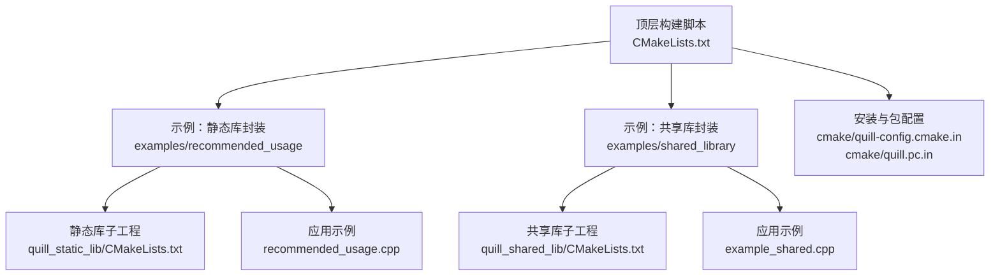
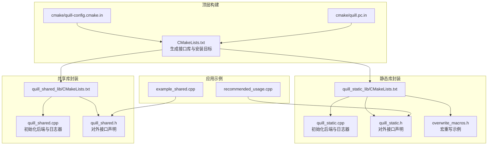
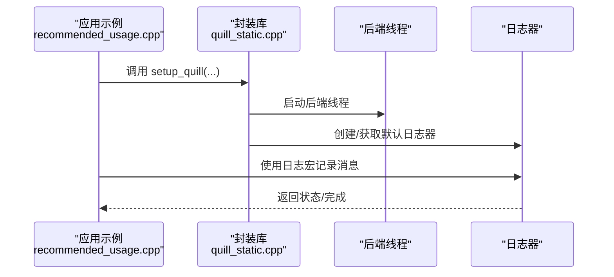
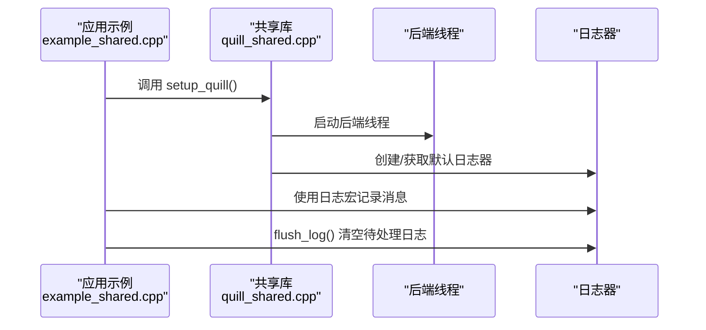
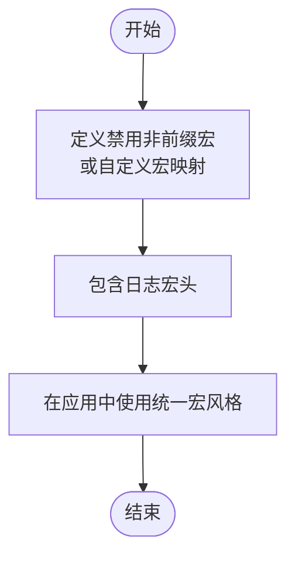
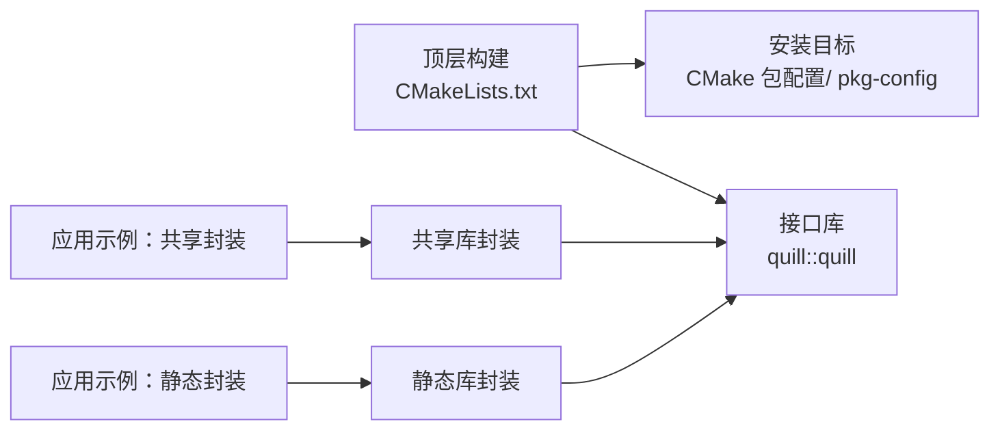

# 集成模式示例

<cite>
**本文引用的文件**
- [CMakeLists.txt](file://CMakeLists.txt)
- [examples/recommended_usage/CMakeLists.txt](file://examples/recommended_usage/CMakeLists.txt)
- [examples/recommended_usage/quill_static_lib/CMakeLists.txt](file://examples/recommended_usage/quill_static_lib/CMakeLists.txt)
- [examples/recommended_usage/quill_static_lib/quill_static.h](file://examples/recommended_usage/quill_static_lib/quill_static.h)
- [examples/recommended_usage/quill_static_lib/quill_static.cpp](file://examples/recommended_usage/quill_static_lib/quill_static.cpp)
- [examples/recommended_usage/quill_static_lib/overwrite_macros.h](file://examples/recommended_usage/quill_static_lib/overwrite_macros.h)
- [examples/recommended_usage/recommended_usage.cpp](file://examples/recommended_usage/recommended_usage.cpp)
- [examples/shared_library/CMakeLists.txt](file://examples/shared_library/CMakeLists.txt)
- [examples/shared_library/quill_shared_lib/CMakeLists.txt](file://examples/shared_library/quill_shared_lib/CMakeLists.txt)
- [examples/shared_library/quill_shared_lib/quill_shared.h](file://examples/shared_library/quill_shared_lib/quill_shared.h)
- [examples/shared_library/quill_shared_lib/quill_shared.cpp](file://examples/shared_library/quill_shared_lib/quill_shared.cpp)
- [examples/shared_library/example_shared.cpp](file://examples/shared_library/example_shared.cpp)
- [cmake/quill-config.cmake.in](file://cmake/quill-config.cmake.in)
- [cmake/quill.pc.in](file://cmake/quill.pc.in)
- [include/quill/LogMacros.h](file://include/quill/LogMacros.h)
</cite>

## 目录
1. [简介](#简介)
2. [项目结构](#项目结构)
3. [核心组件](#核心组件)
4. [架构总览](#架构总览)
5. [详细组件分析](#详细组件分析)
6. [依赖关系分析](#依赖关系分析)
7. [性能考量](#性能考量)
8. [故障排查指南](#故障排查指南)
9. [结论](#结论)
10. [附录](#附录)

## 简介
本文件面向在不同项目中集成 Quill 的工程团队，系统化介绍三种主流集成模式：静态库封装、共享库封装与宏重写模式（宏自由/自定义宏），并给出推荐的代码组织方式、构建配置示例、多平台兼容性要点、依赖管理与部署策略。同时对各模式的优缺点与适用场景进行对比，帮助读者在性能、可维护性与部署复杂度之间做出权衡。

## 项目结构
Quill 提供了清晰的示例工程，覆盖静态库封装与共享库封装两种模式，并展示了如何通过自定义头文件重写宏以统一日志接口风格。顶层 CMakeLists 负责生成接口库与安装目标；示例子目录分别演示静态库封装与共享库封装的具体做法。

**图示来源**
- [CMakeLists.txt](file://CMakeLists.txt)
- [examples/recommended_usage/CMakeLists.txt](file://examples/recommended_usage/CMakeLists.txt)
- [examples/shared_library/CMakeLists.txt](file://examples/shared_library/CMakeLists.txt)
- [cmake/quill-config.cmake.in](file://cmake/quill-config.cmake.in)
- [cmake/quill.pc.in](file://cmake/quill.pc.in)

**章节来源**
- [CMakeLists.txt](file://CMakeLists.txt)
- [examples/recommended_usage/CMakeLists.txt](file://examples/recommended_usage/CMakeLists.txt)
- [examples/shared_library/CMakeLists.txt](file://examples/shared_library/CMakeLists.txt)

## 核心组件
- 接口库与安装目标：顶层 CMake 将 Quill 构建为 INTERFACE 库并导出安装目标，支持 CMake 包配置与 pkg-config 文件生成，便于外部项目以 find_package 或 pkg-config 引入。
- 示例静态库封装：将后端与常用头文件封装为静态库，仅在该静态库的源文件中包含后端头，应用侧仅包含前端与宏头，降低编译时间与头污染。
- 示例共享库封装：将后端与常用头封装为共享库，提供导出函数用于初始化全局日志器，Windows 平台需配合导出/导入宏与运行时复制 DLL 的构建步骤。
- 宏重写与宏自由模式：通过预定义宏禁用非前缀宏或自定义宏，统一使用带前缀的宏，避免与其他日志库冲突，或完全移除宏以仅使用函数式 API。

**章节来源**
- [CMakeLists.txt](file://CMakeLists.txt)
- [examples/recommended_usage/quill_static_lib/quill_static.cpp](file://examples/recommended_usage/quill_static_lib/quill_static.cpp)
- [examples/shared_library/quill_shared_lib/quill_shared.cpp](file://examples/shared_library/quill_shared_lib/quill_shared.cpp)
- [include/quill/LogMacros.h](file://include/quill/LogMacros.h)

## 架构总览
下图展示了三种集成模式的高层架构与交互关系：顶层构建脚本负责生成接口库与安装目标；静态/共享库封装示例分别在各自子工程中封装后端与初始化逻辑；应用示例通过链接封装库或直接链接接口库进行日志初始化与记录。

**图示来源**
- [CMakeLists.txt](file://CMakeLists.txt)
- [examples/recommended_usage/quill_static_lib/CMakeLists.txt](file://examples/recommended_usage/quill_static_lib/CMakeLists.txt)
- [examples/shared_library/quill_shared_lib/CMakeLists.txt](file://examples/shared_library/quill_shared_lib/CMakeLists.txt)
- [examples/recommended_usage/quill_static_lib/quill_static.cpp](file://examples/recommended_usage/quill_static_lib/quill_static.cpp)
- [examples/shared_library/quill_shared_lib/quill_shared.cpp](file://examples/shared_library/quill_shared_lib/quill_shared.cpp)
- [examples/recommended_usage/quill_static_lib/quill_static.h](file://examples/recommended_usage/quill_static_lib/quill_static.h)
- [examples/shared_library/quill_shared_lib/quill_shared.h](file://examples/shared_library/quill_shared_lib/quill_shared.h)
- [examples/recommended_usage/recommended_usage.cpp](file://examples/recommended_usage/recommended_usage.cpp)
- [examples/shared_library/example_shared.cpp](file://examples/shared_library/example_shared.cpp)
- [cmake/quill-config.cmake.in](file://cmake/quill-config.cmake.in)
- [cmake/quill.pc.in](file://cmake/quill.pc.in)

## 详细组件分析

### 静态库封装模式
- 组件职责
  - 封装库：负责启动后端线程、创建默认日志器与默认格式化器、暴露少量对外接口。
  - 应用侧：仅包含前端头与日志宏头，通过封装库提供的接口完成初始化与日志记录。
- 关键文件
  - 封装库构建：[quill_static_lib/CMakeLists.txt](file://examples/recommended_usage/quill_static_lib/CMakeLists.txt)
  - 初始化实现：[quill_static.cpp](file://examples/recommended_usage/quill_static_lib/quill_static.cpp)
  - 对外接口声明：[quill_static.h](file://examples/recommended_usage/quill_static_lib/quill_static.h)
  - 宏重写示例：[overwrite_macros.h](file://examples/recommended_usage/quill_static_lib/overwrite_macros.h)
  - 应用示例入口：[recommended_usage.cpp](file://examples/recommended_usage/recommended_usage.cpp)
- 优点
  - 编译期隔离后端实现，减少应用侧头文件污染与编译时间。
  - 可集中管理日志器与格式化器，便于统一配置。
- 缺点
  - 需要额外维护封装库，增加一次链接与部署成本。
- 适用场景
  - 多模块/多组件应用，需要统一日志风格与最小化头文件暴露。

**图示来源**
- [examples/recommended_usage/recommended_usage.cpp](file://examples/recommended_usage/recommended_usage.cpp)
- [examples/recommended_usage/quill_static_lib/quill_static.cpp](file://examples/recommended_usage/quill_static_lib/quill_static.cpp)

**章节来源**
- [examples/recommended_usage/quill_static_lib/CMakeLists.txt](file://examples/recommended_usage/quill_static_lib/CMakeLists.txt)
- [examples/recommended_usage/quill_static_lib/quill_static.cpp](file://examples/recommended_usage/quill_static_lib/quill_static.cpp)
- [examples/recommended_usage/quill_static_lib/quill_static.h](file://examples/recommended_usage/quill_static_lib/quill_static.h)
- [examples/recommended_usage/quill_static_lib/overwrite_macros.h](file://examples/recommended_usage/quill_static_lib/overwrite_macros.h)
- [examples/recommended_usage/recommended_usage.cpp](file://examples/recommended_usage/recommended_usage.cpp)

### 共享库封装模式
- 组件职责
  - 共享库：负责启动后端线程、创建默认日志器与默认格式化器，提供导出函数供应用侧调用。
  - 应用侧：链接共享库，调用导出函数初始化日志器并进行记录。
- 关键文件
  - 共享库构建：[quill_shared_lib/CMakeLists.txt](file://examples/shared_library/quill_shared_lib/CMakeLists.txt)
  - 初始化实现：[quill_shared.cpp](file://examples/shared_library/quill_shared_lib/quill_shared.cpp)
  - 对外接口声明：[quill_shared.h](file://examples/shared_library/quill_shared_lib/quill_shared.h)
  - 应用示例入口：[example_shared.cpp](file://examples/shared_library/example_shared.cpp)
- 优点
  - 运行时按需加载，便于插件化或动态卸载场景。
  - 在 Windows 上可通过导出/导入宏与复制 DLL 的方式简化分发。
- 缺点
  - Windows 动态加载/卸载 DLL 时需注意刷新待处理日志，避免数据丢失。
- 适用场景
  - 插件/模块化架构、需要运行时加载/卸载日志功能的场景。

**图示来源**
- [examples/shared_library/example_shared.cpp](file://examples/shared_library/example_shared.cpp)
- [examples/shared_library/quill_shared_lib/quill_shared.cpp](file://examples/shared_library/quill_shared_lib/quill_shared.cpp)

**章节来源**
- [examples/shared_library/quill_shared_lib/CMakeLists.txt](file://examples/shared_library/quill_shared_lib/CMakeLists.txt)
- [examples/shared_library/quill_shared_lib/quill_shared.cpp](file://examples/shared_library/quill_shared_lib/quill_shared.cpp)
- [examples/shared_library/quill_shared_lib/quill_shared.h](file://examples/shared_library/quill_shared_lib/quill_shared.h)
- [examples/shared_library/example_shared.cpp](file://examples/shared_library/example_shared.cpp)

### 宏重写模式（宏自由/自定义宏）
- 模式说明
  - 通过预定义宏禁用非前缀宏，仅保留带前缀的宏，或自定义一组宏映射到全局日志器，统一日志接口风格。
  - 也可完全移除宏，仅使用函数式 API，避免与第三方库的宏冲突。
- 关键文件
  - 宏重写示例：[overwrite_macros.h](file://examples/recommended_usage/quill_static_lib/overwrite_macros.h)
  - 日志宏定义与编译期过滤：[LogMacros.h](file://include/quill/LogMacros.h)
- 优点
  - 统一日志接口，减少命名冲突风险。
  - 可结合编译期日志级别过滤，实现零开销日志。
- 缺点
  - 需要在团队内约定统一的宏风格，增加少量样板代码。
- 适用场景
  - 多库共存、需要避免宏冲突的大型项目。

**图示来源**
- [examples/recommended_usage/quill_static_lib/overwrite_macros.h](file://examples/recommended_usage/quill_static_lib/overwrite_macros.h)
- [include/quill/LogMacros.h](file://include/quill/LogMacros.h)

**章节来源**
- [examples/recommended_usage/quill_static_lib/overwrite_macros.h](file://examples/recommended_usage/quill_static_lib/overwrite_macros.h)
- [include/quill/LogMacros.h](file://include/quill/LogMacros.h)

## 依赖关系分析
- 顶层接口库
  - 顶层 CMake 将 Quill 构建为 INTERFACE 库，导出公共头文件路径与线程库依赖，支持 find_package 与 pkg-config。
- 安装与包配置
  - 生成 CMake 包配置与 pkg-config 文件，便于外部项目以标准方式引入。
- 示例工程
  - 静态/共享库封装示例各自构建独立库，应用示例通过链接这些库完成集成。

**图示来源**
- [CMakeLists.txt](file://CMakeLists.txt)
- [cmake/quill-config.cmake.in](file://cmake/quill-config.cmake.in)
- [cmake/quill.pc.in](file://cmake/quill.pc.in)
- [examples/recommended_usage/CMakeLists.txt](file://examples/recommended_usage/CMakeLists.txt)
- [examples/shared_library/CMakeLists.txt](file://examples/shared_library/CMakeLists.txt)

**章节来源**
- [CMakeLists.txt](file://CMakeLists.txt)
- [cmake/quill-config.cmake.in](file://cmake/quill-config.cmake.in)
- [cmake/quill.pc.in](file://cmake/quill.pc.in)
- [examples/recommended_usage/CMakeLists.txt](file://examples/recommended_usage/CMakeLists.txt)
- [examples/shared_library/CMakeLists.txt](file://examples/shared_library/CMakeLists.txt)

## 性能考量
- 编译期日志级别过滤
  - 通过编译期常量控制启用的日志级别，可完全剔除低优先级日志的分支与元数据构造，实现零开销日志。
- 静态库封装减少头文件解析与模板实例化
  - 将后端实现封装在静态库中，应用侧仅包含前端头，有助于缩短编译时间。
- 共享库封装的运行时开销
  - 动态加载/卸载 DLL 时需注意刷新待处理日志，避免数据丢失；Windows 下建议在 DLL 卸载时调用刷新接口。
- 宏重写模式的零开销特性
  - 结合编译期过滤与宏映射，可在不牺牲性能的前提下统一接口风格。

**章节来源**
- [include/quill/LogMacros.h](file://include/quill/LogMacros.h)
- [examples/shared_library/example_shared.cpp](file://examples/shared_library/example_shared.cpp)

## 故障排查指南
- Windows 共享库导入导出问题
  - 构建共享库时需定义导出宏；使用共享库时需定义导入宏；必要时开启全符号导出选项。
  - 运行时复制 DLL 到可执行文件目录，确保运行时能找到共享库。
- DLL 动态加载/卸载导致的日志丢失
  - 在 DLL 卸载时调用刷新接口，确保后端线程处理完所有待处理日志。
- 宏冲突与命名不一致
  - 使用宏重写模式禁用非前缀宏或自定义宏映射，统一团队内的日志接口风格。
- 多平台兼容性
  - MinGW 需要特定运行库支持；旧版 Windows/Android 可通过编译选项禁用线程名等特性以提升兼容性。

**章节来源**
- [examples/shared_library/CMakeLists.txt](file://examples/shared_library/CMakeLists.txt)
- [examples/shared_library/quill_shared_lib/CMakeLists.txt](file://examples/shared_library/quill_shared_lib/CMakeLists.txt)
- [examples/shared_library/example_shared.cpp](file://examples/shared_library/example_shared.cpp)
- [examples/recommended_usage/quill_static_lib/overwrite_macros.h](file://examples/recommended_usage/quill_static_lib/overwrite_macros.h)
- [CMakeLists.txt](file://CMakeLists.txt)

## 结论
- 静态库封装适合需要统一日志风格且希望减少头文件暴露与编译时间的多模块项目。
- 共享库封装适合插件化/模块化架构，需要运行时加载/卸载日志功能的场景，但需关注 Windows 动态加载/卸载的注意事项。
- 宏重写模式可有效避免宏冲突并统一接口风格，结合编译期过滤可实现零开销日志。
- 建议在团队内制定统一的集成规范与构建脚本，确保跨平台一致性与可维护性。

## 附录
- 推荐的代码组织方式
  - 将后端实现封装在静态/共享库中，应用侧仅包含前端头与日志宏头。
  - 通过宏重写文件统一日志接口风格，或完全移除宏以仅使用函数式 API。
- 推荐的构建配置示例
  - 顶层 CMake 已提供接口库与安装目标，示例工程展示了静态/共享库封装的具体做法。
  - Windows 平台在共享库模式下需设置导出/导入宏与复制 DLL 的构建步骤。
- 多平台兼容性与部署策略
  - 顶层 CMake 支持 MinGW 与旧版系统特性开关；安装目标提供 CMake 包配置与 pkg-config 文件，便于跨平台部署。

**章节来源**
- [CMakeLists.txt](file://CMakeLists.txt)
- [examples/recommended_usage/CMakeLists.txt](file://examples/recommended_usage/CMakeLists.txt)
- [examples/shared_library/CMakeLists.txt](file://examples/shared_library/CMakeLists.txt)
- [cmake/quill-config.cmake.in](file://cmake/quill-config.cmake.in)
- [cmake/quill.pc.in](file://cmake/quill.pc.in)