# 高级配置示例

<cite>
**本文引用的文件**
- [Frontend.h](file://include/quill/Frontend.h)
- [FrontendOptions.h](file://include/quill/core/FrontendOptions.h)
- [BackendOptions.h](file://include/quill/backend/BackendOptions.h)
- [PatternFormatterOptions.h](file://include/quill/core/PatternFormatterOptions.h)
- [BoundedSPSCQueue.h](file://include/quill/core/BoundedSPSCQueue.h)
- [UnboundedSPSCQueue.h](file://include/quill/core/UnboundedSPSCQueue.h)
- [custom_console_colours.cpp](file://examples/custom_console_colours.cpp)
- [custom_frontend_options.cpp](file://examples/custom_frontend_options.cpp)
- [sink_formatter_override.cpp](file://examples/sink_formatter_override.cpp)
- [user_defined_filter.cpp](file://examples/user_defined_filter.cpp)
- [bounded_dropping_queue_frontend.cpp](file://examples/bounded_dropping_queue_frontend.cpp)
- [user_defined_sink.cpp](file://examples/user_defined_sink.cpp)
- [user_defined_types_logging_custom_codec.cpp](file://examples/user_defined_types_logging_custom_codec.cpp)
- [user_defined_types_logging_deferred_format.cpp](file://examples/user_defined_types_logging_deferred_format.cpp)
- [user_defined_types_logging_direct_format.cpp](file://examples/user_defined_types_logging_direct_format.cpp)
- [user_defined_types_multi_format.cpp](file://examples/user_defined_types_multi_format.cpp)
- [csv_writing.cpp](file://examples/csv_writing.cpp)
- [json_console_logging.cpp](file://examples/json_console_logging.cpp)
</cite>

## 目录
1. [简介](#简介)
2. [项目结构](#项目结构)
3. [核心组件](#核心组件)
4. [架构总览](#架构总览)
5. [详细组件分析](#详细组件分析)
6. [依赖关系分析](#依赖关系分析)
7. [性能考量](#性能考量)
8. [故障排查指南](#故障排查指南)
9. [结论](#结论)
10. [附录](#附录)

## 简介
本文件面向需要在生产环境中进行高性能、可扩展日志系统的工程师与架构师，系统性地展示 Quill 的高级配置与定制化实践。内容涵盖：
- 自定义前端选项（队列类型、容量、内存策略）
- 控制台颜色配置
- 格式化器覆盖（按 Sink 覆盖全局 Logger 格式）
- 用户自定义过滤器（动态后端过滤）
- 队列配置与内存管理（阻塞/丢弃、无界队列收缩）
- 性能调优（后台线程睡眠、刷新间隔、CPU 绑定、打印字符检查）
- 结构化日志（JSON/CSV）与用户自定义 Sink
- 用户自定义类型的延迟/直接格式化与自定义编解码

## 项目结构
Quill 的配置与使用主要围绕以下层次展开：
- 前端层：负责线程本地队列、日志入队、Logger/Sink 创建与管理
- 后端层：负责消费前端队列、格式化、过滤、写入 Sink、周期任务
- 核心数据结构：SPSC 队列（有界/无界）、格式化选项、时钟源与时间戳格式

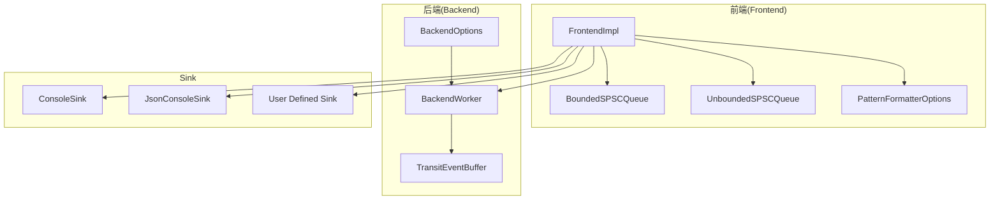

**图表来源**
- [Frontend.h:32-370](file://include/quill/Frontend.h#L32-L370)
- [FrontendOptions.h:16-52](file://include/quill/core/FrontendOptions.h#L16-L52)
- [BackendOptions.h:30-283](file://include/quill/backend/BackendOptions.h#L30-L283)
- [BoundedSPSCQueue.h:54-356](file://include/quill/core/BoundedSPSCQueue.h#L54-L356)
- [UnboundedSPSCQueue.h:42-345](file://include/quill/core/UnboundedSPSCQueue.h#L42-L345)
- [PatternFormatterOptions.h:23-170](file://include/quill/core/PatternFormatterOptions.h#L23-L170)

**章节来源**
- [Frontend.h:32-370](file://include/quill/Frontend.h#L32-L370)
- [FrontendOptions.h:16-52](file://include/quill/core/FrontendOptions.h#L16-L52)
- [BackendOptions.h:30-283](file://include/quill/backend/BackendOptions.h#L30-L283)
- [PatternFormatterOptions.h:23-170](file://include/quill/core/PatternFormatterOptions.h#L23-L170)

## 核心组件
- 前端选项 FrontendOptions：定义前端线程本地队列类型、初始容量、阻塞重试间隔、最大容量、大页策略等。这些是编译期常量，通过模板参数传递给 FrontendImpl。
- 后端选项 BackendOptions：定义后台线程名称、空闲让出、睡眠时长、传输事件缓冲初始容量与软硬限制、严格时间戳排序宽限期、退出前等待队列清空、CPU 亲和、错误通知回调、刷新最小间隔、可打印字符检查、日志级别描述与短码、单实例检测等。
- 模式格式化选项 PatternFormatterOptions：定义日志格式模式、时间戳模式与时区、是否为多行日志添加元数据、路径前缀剥离、函数名处理回调、相对路径移除、模式后缀等。

**章节来源**
- [FrontendOptions.h:16-52](file://include/quill/core/FrontendOptions.h#L16-L52)
- [BackendOptions.h:30-283](file://include/quill/backend/BackendOptions.h#L30-L283)
- [PatternFormatterOptions.h:23-170](file://include/quill/core/PatternFormatterOptions.h#L23-L170)

## 架构总览
下图展示了从日志宏到后端工作线程的整体流程，以及关键配置点对行为的影响。

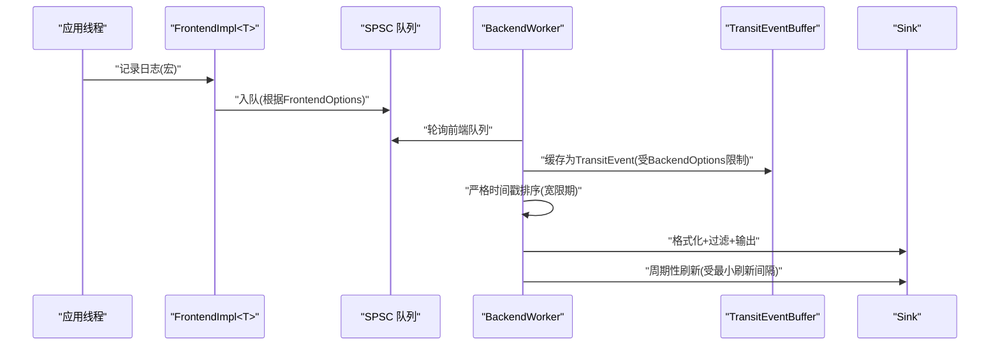

**图表来源**
- [Frontend.h:148-198](file://include/quill/Frontend.h#L148-L198)
- [BackendOptions.h:57-145](file://include/quill/backend/BackendOptions.h#L57-L145)
- [UnboundedSPSCQueue.h:115-149](file://include/quill/core/UnboundedSPSCQueue.h#L115-L149)
- [BoundedSPSCQueue.h:105-169](file://include/quill/core/BoundedSPSCQueue.h#L105-L169)

## 详细组件分析

### 自定义前端选项与队列类型
- 使用自定义 FrontendOptions 可以将队列类型从默认的 UnboundedBlocking 切换为 BoundedDropping 或其他类型，并调整初始容量与最大容量。
- 示例演示了如何定义 CustomFrontendOptions 并将其应用于 FrontendImpl 与 LoggerImpl，从而在编译期固定队列行为。
- 在高吞吐场景中，BoundedDropping 可避免内存无限增长；在低延迟场景中，UnboundedBlocking 可减少阻塞概率但需设置合理上限。

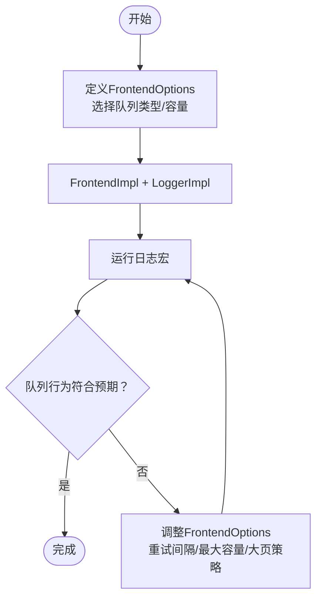

**图表来源**
- [custom_frontend_options.cpp:14-27](file://examples/custom_frontend_options.cpp#L14-L27)
- [FrontendOptions.h:16-52](file://include/quill/core/FrontendOptions.h#L16-L52)

**章节来源**
- [custom_frontend_options.cpp:14-27](file://examples/custom_frontend_options.cpp#L14-L27)
- [FrontendOptions.h:16-52](file://include/quill/core/FrontendOptions.h#L16-L52)

### 控制台颜色配置
- 通过 ConsoleSinkConfig 的 Colours 结构体，可以为不同日志级别设置颜色，实现统一且可读的终端输出。
- 示例展示了如何在创建 ConsoleSink 时注入自定义颜色映射，并通过 Logger 设置较低的日志级别以输出所有等级。

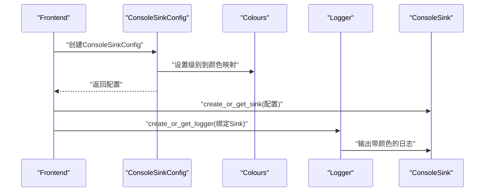

**图表来源**
- [custom_console_colours.cpp:21-34](file://examples/custom_console_colours.cpp#L21-L34)

**章节来源**
- [custom_console_colours.cpp:21-34](file://examples/custom_console_colours.cpp#L21-L34)

### 格式化器覆盖（按 Sink 覆盖）
- 单个 Logger 可绑定多个 Sink；若希望不同 Sink 输出不同格式，可在创建特定 Sink 时传入独立的 PatternFormatterOptions，从而覆盖该 Sink 的格式化行为。
- 示例展示了在同一 Logger 下同时输出两种不同格式的控制台日志。

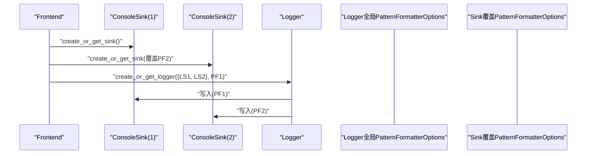

**图表来源**
- [sink_formatter_override.cpp:18-33](file://examples/sink_formatter_override.cpp#L18-L33)
- [PatternFormatterOptions.h:23-170](file://include/quill/core/PatternFormatterOptions.h#L23-L170)

**章节来源**
- [sink_formatter_override.cpp:18-33](file://examples/sink_formatter_override.cpp#L18-L33)
- [PatternFormatterOptions.h:23-170](file://include/quill/core/PatternFormatterOptions.h#L23-L170)

### 用户自定义过滤器
- 过滤器在后端生效，适用于需要基于复杂条件（如去重、阈值、上下文）动态决定是否落盘的场景。
- 示例展示了继承 Filter 并在 ConsoleSink 上注册，实现重复消息去重逻辑。

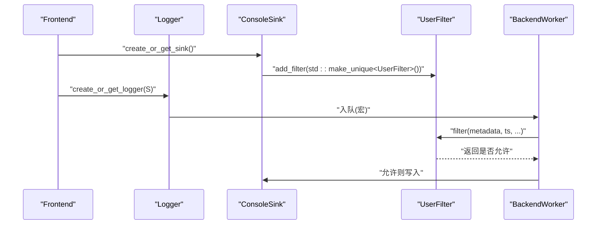

**图表来源**
- [user_defined_filter.cpp:19-47](file://examples/user_defined_filter.cpp#L19-L47)

**章节来源**
- [user_defined_filter.cpp:19-47](file://examples/user_defined_filter.cpp#L19-L47)

### 队列配置与内存管理
- 有界队列（BoundedDropping）适合资源受限或需要稳定内存占用的场景；当容量不足时会丢弃新消息。
- 无界队列（UnboundedBlocking/UnboundedDropping）在高负载下自动扩容至 FrontendOptions::unbounded_queue_max_capacity，可通过 shrink_thread_local_queue 在线缩小以节省内存。
- 示例演示了将队列类型改为 BoundedDropping 并设置较小初始容量，以直观展示丢弃行为。

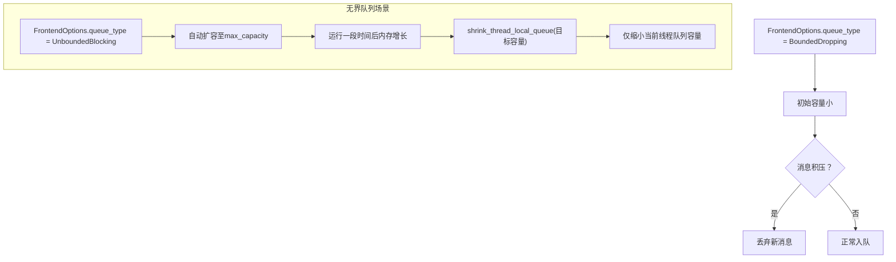

**图表来源**
- [bounded_dropping_queue_frontend.cpp:21-32](file://examples/bounded_dropping_queue_frontend.cpp#L21-L32)
- [FrontendOptions.h:16-52](file://include/quill/core/FrontendOptions.h#L16-L52)
- [UnboundedSPSCQueue.h:166-183](file://include/quill/core/UnboundedSPSCQueue.h#L166-L183)
- [BoundedSPSCQueue.h:60-95](file://include/quill/core/BoundedSPSCQueue.h#L60-L95)

**章节来源**
- [bounded_dropping_queue_frontend.cpp:21-32](file://examples/bounded_dropping_queue_frontend.cpp#L21-L32)
- [FrontendOptions.h:16-52](file://include/quill/core/FrontendOptions.h#L16-L52)
- [UnboundedSPSCQueue.h:166-183](file://include/quill/core/UnboundedSPSCQueue.h#L166-L183)
- [BoundedSPSCQueue.h:60-95](file://include/quill/core/BoundedSPSCQueue.h#L60-L95)

### 性能调优（后台线程与刷新）
- BackendOptions 提供多项性能开关：
  - 空闲让出与睡眠时长：在低负载时降低 CPU 占用
  - 传输事件缓冲软/硬限制：平衡延迟与内存占用
  - 严格时间戳排序宽限期：在多线程时间戳微差时保证顺序
  - 最小刷新间隔：控制 Sink 刷新频率，避免频繁 IO
  - 错误通知回调：捕获异常与边界情况
- Frontend 提供 shrink_thread_local_queue/get_thread_local_queue_capacity，便于运行时监控与回收内存。

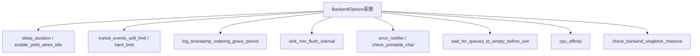

**图表来源**
- [BackendOptions.h:30-283](file://include/quill/backend/BackendOptions.h#L30-L283)
- [Frontend.h:72-111](file://include/quill/Frontend.h#L72-L111)

**章节来源**
- [BackendOptions.h:30-283](file://include/quill/backend/BackendOptions.h#L30-L283)
- [Frontend.h:72-111](file://include/quill/Frontend.h#L72-L111)

### 结构化日志与自定义 Sink
- JSON 日志：通过 JsonConsoleSink 或 JsonFileSink 记录键值对，可结合 LOGJ_* 宏或命名参数宏，避免额外格式化开销。
- CSV 写入：通过 CsvWriter 按 Schema 写入结构化数据，适合高频交易、指标采集等场景。
- 自定义 Sink：实现 Sink 接口的 write_log/flush_sink/run_periodic_tasks，可做批量提交、网络发送、聚合统计等。

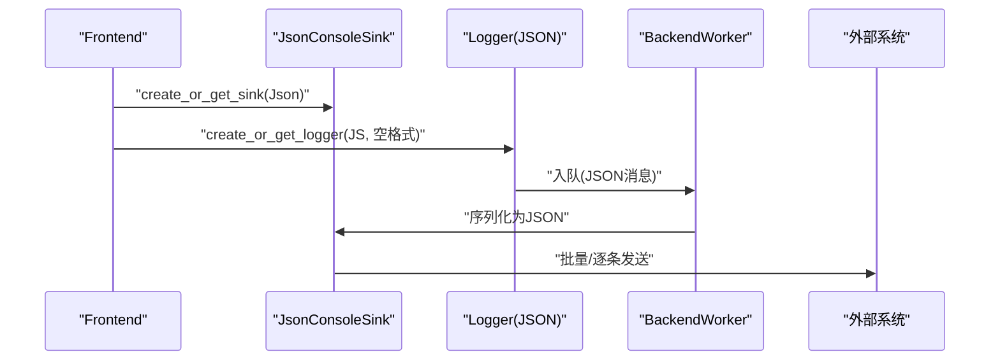

**图表来源**
- [json_console_logging.cpp:18-33](file://examples/json_console_logging.cpp#L18-L33)
- [csv_writing.cpp:28-32](file://examples/csv_writing.cpp#L28-L32)
- [user_defined_sink.cpp:18-73](file://examples/user_defined_sink.cpp#L18-L73)

**章节来源**
- [json_console_logging.cpp:18-33](file://examples/json_console_logging.cpp#L18-L33)
- [csv_writing.cpp:28-32](file://examples/csv_writing.cpp#L28-L32)
- [user_defined_sink.cpp:18-73](file://examples/user_defined_sink.cpp#L18-L73)

### 用户自定义类型与格式化策略
- 延迟格式化（DeferredFormatCodec）：将昂贵的字符串化推迟到后端线程，适合热点路径。
- 直接格式化（DirectFormatCodec）：在热点路径中直接转换为字符串，适合简单类型。
- 自定义编解码（Codec）：完全控制序列化/反序列化过程，支持复杂对象与容器。
- 多格式支持：通过 fmtquill::formatter 的解析能力，支持同一类型多种展示格式。

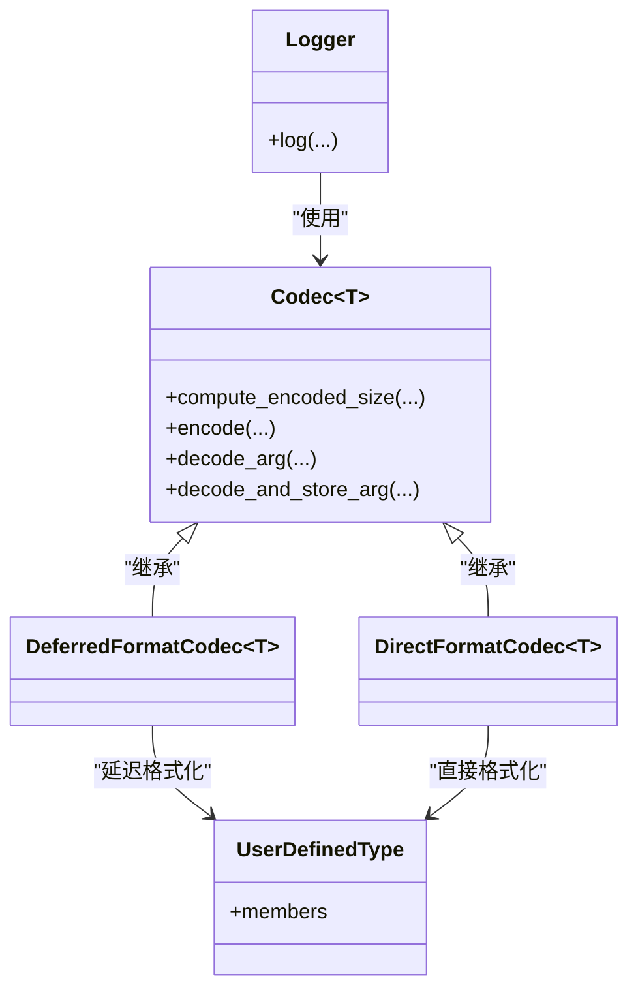

**图表来源**
- [user_defined_types_logging_custom_codec.cpp:52-95](file://examples/user_defined_types_logging_custom_codec.cpp#L52-L95)
- [user_defined_types_logging_deferred_format.cpp:48-51](file://examples/user_defined_types_logging_deferred_format.cpp#L48-L51)
- [user_defined_types_logging_direct_format.cpp:50-76](file://examples/user_defined_types_logging_direct_format.cpp#L50-L76)
- [user_defined_types_multi_format.cpp:55-58](file://examples/user_defined_types_multi_format.cpp#L55-L58)

**章节来源**
- [user_defined_types_logging_custom_codec.cpp:52-95](file://examples/user_defined_types_logging_custom_codec.cpp#L52-L95)
- [user_defined_types_logging_deferred_format.cpp:48-51](file://examples/user_defined_types_logging_deferred_format.cpp#L48-L51)
- [user_defined_types_logging_direct_format.cpp:50-76](file://examples/user_defined_types_logging_direct_format.cpp#L50-L76)
- [user_defined_types_multi_format.cpp:55-58](file://examples/user_defined_types_multi_format.cpp#L55-L58)

## 依赖关系分析
- 前端与队列：FrontendImpl 通过 FrontendOptions 决定使用 BoundedSPSCQueue 或 UnboundedSPSCQueue；UnboundedSPSCQueue 内部由多个 Node 组成的链表 + BoundedSPSCQueue 实现扩容。
- 后端与格式化：BackendOptions 控制 BackendWorker 的轮询、排序、刷新节奏；PatternFormatterOptions 控制格式化细节。
- Sink 与过滤：ConsoleSink/JsonSink 等具体 Sink 由 Frontend 创建；过滤器在后端对 TransitEvent 生效。

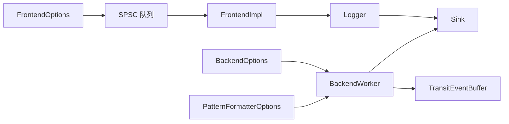

**图表来源**
- [FrontendOptions.h:16-52](file://include/quill/core/FrontendOptions.h#L16-L52)
- [BoundedSPSCQueue.h:54-356](file://include/quill/core/BoundedSPSCQueue.h#L54-L356)
- [UnboundedSPSCQueue.h:42-345](file://include/quill/core/UnboundedSPSCQueue.h#L42-L345)
- [BackendOptions.h:30-283](file://include/quill/backend/BackendOptions.h#L30-L283)
- [PatternFormatterOptions.h:23-170](file://include/quill/core/PatternFormatterOptions.h#L23-L170)

**章节来源**
- [FrontendOptions.h:16-52](file://include/quill/core/FrontendOptions.h#L16-L52)
- [BoundedSPSCQueue.h:54-356](file://include/quill/core/BoundedSPSCQueue.h#L54-L356)
- [UnboundedSPSCQueue.h:42-345](file://include/quill/core/UnboundedSPSCQueue.h#L42-L345)
- [BackendOptions.h:30-283](file://include/quill/backend/BackendOptions.h#L30-L283)
- [PatternFormatterOptions.h:23-170](file://include/quill/core/PatternFormatterOptions.h#L23-L170)

## 性能考量
- 队列策略
  - BoundedDropping：稳定内存占用，吞吐下降明显时丢弃新消息，适合资源受限环境
  - UnboundedBlocking：减少阻塞概率，需设置合理 unbounded_queue_max_capacity 并在空闲时 shrink_thread_local_queue
- 后台线程
  - 适当增大 sleep_duration 或启用 enable_yield_when_idle 降低空闲 CPU 占用
  - 调整 transit_events_soft_limit/hard_limit 以平衡延迟与内存
  - 合理设置 sink_min_flush_interval，避免频繁 fsync
- 时间戳与排序
  - 在多线程时间源差异较大时，适度增加 log_timestamp_ordering_grace_period，避免过度回退
- 大页内存
  - Linux 下开启 huge_pages_policy 可降低 TLB 缺失，提升缓存命中率

[本节为通用指导，无需特定文件来源]

## 故障排查指南
- 后端异常通知
  - 使用 BackendOptions::error_notifier 捕获未捕获异常与边界情况（如无界队列扩容、有界队列满）
- 单实例检测
  - 在 Windows/Linux 上可启用 check_backend_singleton_instance，避免静态/共享库混用导致的多实例问题
- 打印字符安全
  - 开启 check_printable_char 可过滤不可见字符，必要时自定义判断范围
- 日志级别与可见性
  - 若控制台无输出，确认 Logger 的日志级别与 ConsoleSink 的颜色映射是否正确
- 队列丢弃
  - 出现消息丢失时，检查 FrontendOptions::queue_type 与初始容量；考虑切换为 BoundedDropping 并增大容量或改为 UnboundedBlocking

**章节来源**
- [BackendOptions.h:169-281](file://include/quill/backend/BackendOptions.h#L169-L281)
- [custom_console_colours.cpp:21-34](file://examples/custom_console_colours.cpp#L21-L34)
- [bounded_dropping_queue_frontend.cpp:21-32](file://examples/bounded_dropping_queue_frontend.cpp#L21-L32)

## 结论
通过上述高级配置与定制化实践，可以在不同业务场景下获得稳定的日志性能与可维护性：
- 以 FrontendOptions 为入口，选择合适的队列策略与容量
- 以 BackendOptions 为手段，调节后台线程行为与刷新节奏
- 以 PatternFormatterOptions 与 Sink 覆盖实现灵活的输出格式
- 以过滤器与自定义 Sink 扩展日志生态
- 以用户自定义类型与编解码优化热点路径的格式化开销

[本节为总结，无需特定文件来源]

## 附录
- 快速参考
  - 自定义前端选项：[custom_frontend_options.cpp:14-27](file://examples/custom_frontend_options.cpp#L14-L27)
  - 控制台颜色：[custom_console_colours.cpp:21-34](file://examples/custom_console_colours.cpp#L21-L34)
  - 格式化器覆盖：[sink_formatter_override.cpp:18-33](file://examples/sink_formatter_override.cpp#L18-L33)
  - 用户过滤器：[user_defined_filter.cpp:19-47](file://examples/user_defined_filter.cpp#L19-L47)
  - 队列类型切换：[bounded_dropping_queue_frontend.cpp:21-32](file://examples/bounded_dropping_queue_frontend.cpp#L21-L32)
  - 自定义 Sink：[user_defined_sink.cpp:18-73](file://examples/user_defined_sink.cpp#L18-L73)
  - 用户类型延迟/直接格式化：[user_defined_types_logging_deferred_format.cpp:48-51](file://examples/user_defined_types_logging_deferred_format.cpp#L48-L51)、[user_defined_types_logging_direct_format.cpp:50-76](file://examples/user_defined_types_logging_direct_format.cpp#L50-L76)
  - 用户类型自定义编解码：[user_defined_types_logging_custom_codec.cpp:52-95](file://examples/user_defined_types_logging_custom_codec.cpp#L52-L95)
  - 多格式展示：[user_defined_types_multi_format.cpp:55-58](file://examples/user_defined_types_multi_format.cpp#L55-L58)
  - JSON 日志：[json_console_logging.cpp:18-33](file://examples/json_console_logging.cpp#L18-L33)
  - CSV 写入：[csv_writing.cpp:28-32](file://examples/csv_writing.cpp#L28-L32)

[本节为索引，无需特定文件来源]