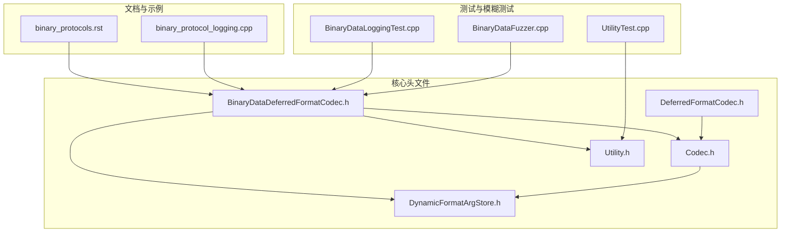
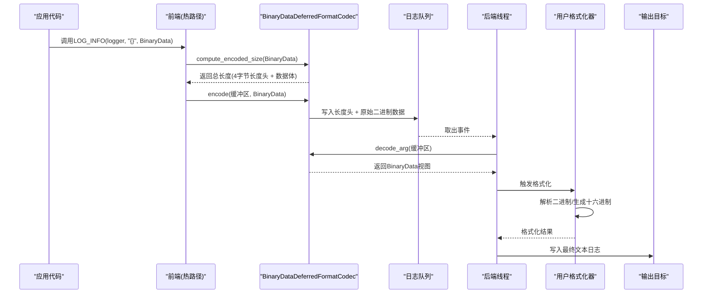
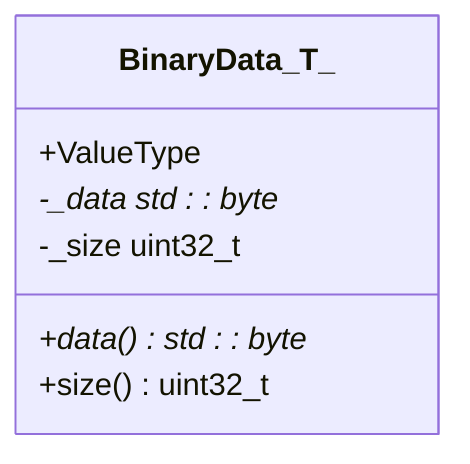
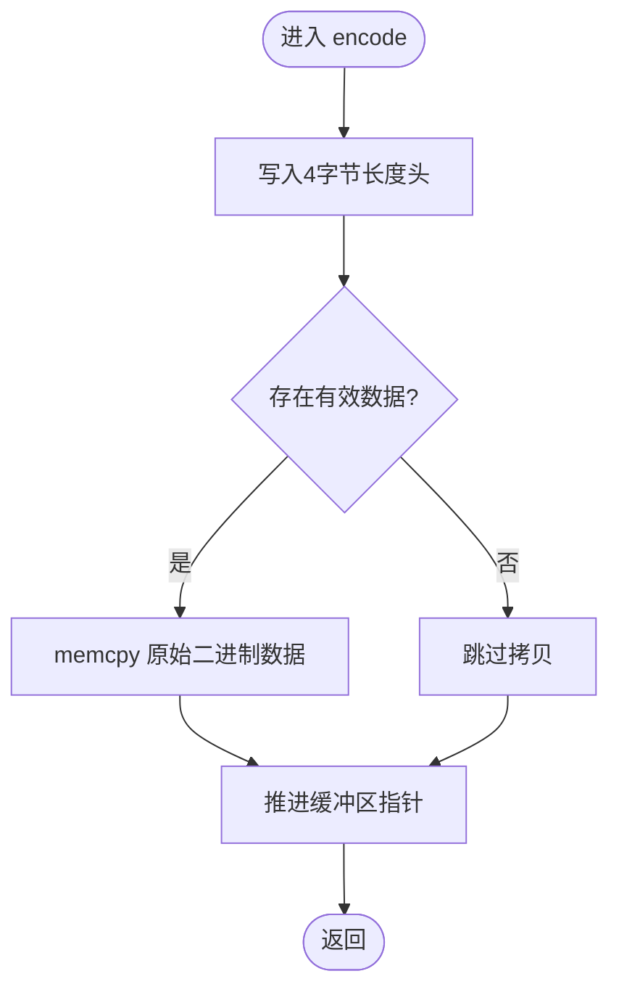
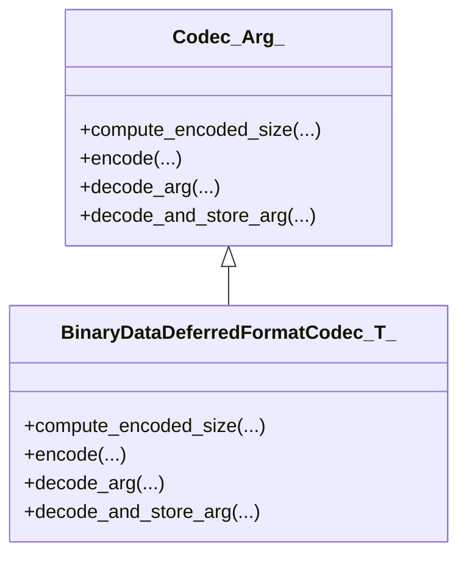
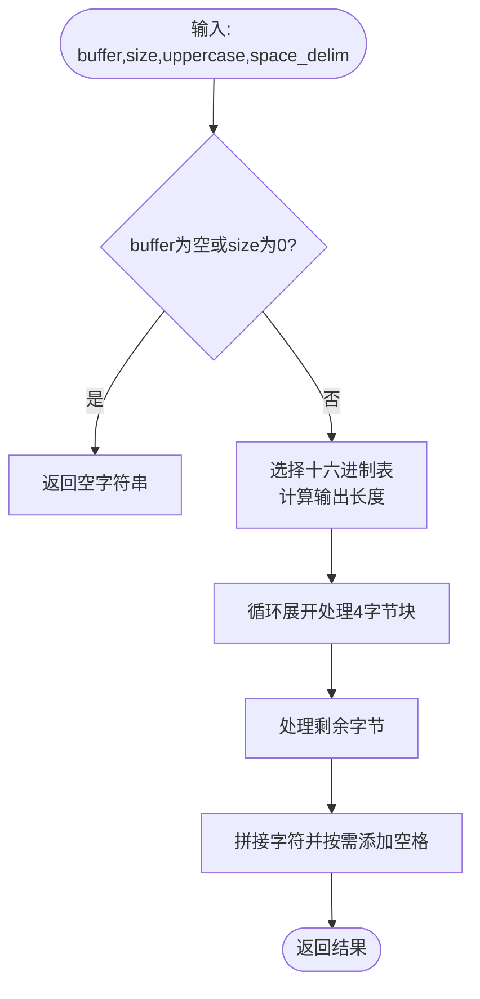
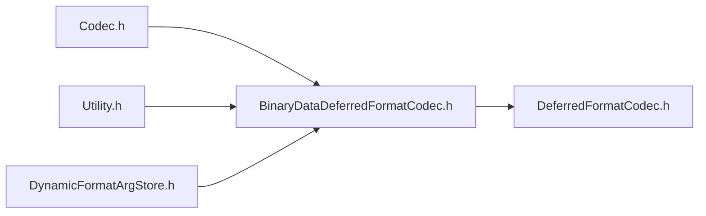

# 二进制数据编码器

<cite>
**本文档引用的文件**
- [BinaryDataDeferredFormatCodec.h](file://include/quill/BinaryDataDeferredFormatCodec.h)
- [Codec.h](file://include/quill/core/Codec.h)
- [Utility.h](file://include/quill/Utility.h)
- [DynamicFormatArgStore.h](file://include/quill/core/DynamicFormatArgStore.h)
- [DeferredFormatCodec.h](file://include/quill/DeferredFormatCodec.h)
- [binary_protocols.rst](file://docs/binary_protocols.rst)
- [binary_protocol_logging.cpp](file://examples/binary_protocol_logging.cpp)
- [BinaryDataLoggingTest.cpp](file://test/integration_tests/BinaryDataLoggingTest.cpp)
- [BinaryDataFuzzer.cpp](file://fuzz/BinaryDataFuzzer.cpp)
- [UtilityTest.cpp](file://test/unit_tests/UtilityTest.cpp)
</cite>

## 目录
1. [简介](#简介)
2. [项目结构](#项目结构)
3. [核心组件](#核心组件)
4. [架构概览](#架构概览)
5. [详细组件分析](#详细组件分析)
6. [依赖关系分析](#依赖关系分析)
7. [性能考量](#性能考量)
8. [故障排查指南](#故障排查指南)
9. [结论](#结论)
10. [附录](#附录)

## 简介
本文件面向Quill的二进制数据编码器，重点解析BinaryDataDeferredFormatCodec的实现原理与应用场景。该编码器通过延迟格式化（deferred formatting）机制，将二进制数据在热路径上仅进行一次内存拷贝，随后在后台线程完成人类可读的格式化输出，从而在高吞吐量场景下显著降低日志开销。文档将深入讲解二进制数据的序列化机制（长度头、字节对齐、跨平台兼容性）、与文本编码的差异及性能对比，并提供最佳实践、调试与解析方法（十六进制转储、数据分析技巧）。

## 项目结构
围绕二进制数据编码器的关键文件组织如下：
- 编码器定义：BinaryDataDeferredFormatCodec.h
- 核心编解码框架：Codec.h
- 工具函数（十六进制转换）：Utility.h
- 动态参数存储：DynamicFormatArgStore.h
- 延迟格式化参考实现：DeferredFormatCodec.h
- 文档与示例：binary_protocols.rst、binary_protocol_logging.cpp
- 测试与模糊测试：BinaryDataLoggingTest.cpp、BinaryDataFuzzer.cpp、UtilityTest.cpp

**图表来源**
- [BinaryDataDeferredFormatCodec.h:1-165](file://include/quill/BinaryDataDeferredFormatCodec.h#L1-L165)
- [Codec.h:1-438](file://include/quill/core/Codec.h#L1-L438)
- [Utility.h:1-130](file://include/quill/Utility.h#L1-L130)
- [DynamicFormatArgStore.h:1-157](file://include/quill/core/DynamicFormatArgStore.h#L1-L157)
- [DeferredFormatCodec.h:86-137](file://include/quill/DeferredFormatCodec.h#L86-L137)
- [binary_protocols.rst:1-146](file://docs/binary_protocols.rst#L1-L146)
- [binary_protocol_logging.cpp:1-242](file://examples/binary_protocol_logging.cpp#L1-L242)
- [BinaryDataLoggingTest.cpp:1-236](file://test/integration_tests/BinaryDataLoggingTest.cpp#L1-L236)
- [BinaryDataFuzzer.cpp:1-45](file://fuzz/BinaryDataFuzzer.cpp#L1-L45)
- [UtilityTest.cpp:1-367](file://test/unit_tests/UtilityTest.cpp#L1-L367)

**章节来源**
- [BinaryDataDeferredFormatCodec.h:1-165](file://include/quill/BinaryDataDeferredFormatCodec.h#L1-L165)
- [Codec.h:1-438](file://include/quill/core/Codec.h#L1-L438)

## 核心组件
- BinaryData<T>：非拥有型二进制数据视图，携带类型标签T，用于语义区分不同协议或消息类型。构造时会将指针安全重解释为std::byte*，并限制最大大小为uint32_t范围。
- BinaryDataDeferredFormatCodec<T>：针对BinaryData<T>的专用编解码器，提供高效的序列化与反序列化流程，支持在热路径上仅做一次memcpy，格式化在后台线程执行。
- Codec框架：通用编解码接口，定义了compute_encoded_size、encode、decode_arg、decode_and_store_arg等统一约定，BinaryDataDeferredFormatCodec遵循此接口以融入Quill的整体编码体系。
- utility::to_hex：高性能十六进制转换工具，支持大小写控制与空格分隔，内部使用查表+循环展开优化，适合在格式化阶段生成可读的十六进制转储。
- DynamicFormatArgStore：动态参数存储容器，用于在后台线程中传递已解码的参数，避免额外分配与拷贝。

**章节来源**
- [BinaryDataDeferredFormatCodec.h:22-165](file://include/quill/BinaryDataDeferredFormatCodec.h#L22-L165)
- [Codec.h:142-342](file://include/quill/core/Codec.h#L142-L342)
- [Utility.h:18-119](file://include/quill/Utility.h#L18-L119)
- [DynamicFormatArgStore.h:73-155](file://include/quill/core/DynamicFormatArgStore.h#L73-L155)

## 架构概览
二进制数据编码器的运行时架构由“前端热路径”和“后端格式化线程”两部分组成：
- 前端热路径：LOG宏触发时，BinaryDataDeferredFormatCodec.compute_encoded_size计算总长度（长度头4字节 + 数据体），随后encode执行一次memcpy将长度头与原始二进制数据复制到队列缓冲区。
- 后端格式化线程：从队列取出事件，调用decode_arg恢复BinaryData对象，再由用户自定义的fmtquill::formatter将二进制数据解析为人类可读格式，或使用utility::to_hex生成十六进制转储。

**图表来源**
- [BinaryDataDeferredFormatCodec.h:127-162](file://include/quill/BinaryDataDeferredFormatCodec.h#L127-L162)
- [Codec.h:142-342](file://include/quill/core/Codec.h#L142-L342)
- [binary_protocol_logging.cpp:95-167](file://examples/binary_protocol_logging.cpp#L95-L167)

## 详细组件分析

### BinaryData<T> 类
- 设计要点
  - 非拥有型视图：不持有底层数据所有权，避免不必要的拷贝与内存管理。
  - 类型标签：模板参数T作为协议/消息类型的语义标识，便于区分不同二进制协议。
  - 大小限制：当size超过uint32_t最大值时自动截断，确保序列化一致性。
  - 指针约束：静态断言要求元素类型大小为1字节，保证只接受字节级数据。
- 访问接口
  - data()：返回底层字节指针
  - size()：返回数据长度（uint32_t）

**图表来源**
- [BinaryDataDeferredFormatCodec.h:28-70](file://include/quill/BinaryDataDeferredFormatCodec.h#L28-L70)

**章节来源**
- [BinaryDataDeferredFormatCodec.h:22-70](file://include/quill/BinaryDataDeferredFormatCodec.h#L22-L70)

### BinaryDataDeferredFormatCodec<T> 结构
- 接口契约
  - compute_encoded_size：返回4字节长度头 + 实际数据长度，确保解码时能正确跳过数据体。
  - encode：先写入长度头，再写入原始二进制数据；对空指针或零长度进行快速路径优化。
  - decode_arg：从缓冲区读取长度头，构造BinaryData视图，推进缓冲区指针。
  - decode_and_store_arg：将解码后的BinaryData放入DynamicFormatArgStore，供格式化器使用。
- 断言与约束
  - 仅允许与BinaryData<T>配合使用，防止误用其他类型。

**图表来源**
- [BinaryDataDeferredFormatCodec.h:132-146](file://include/quill/BinaryDataDeferredFormatCodec.h#L132-L146)

**章节来源**
- [BinaryDataDeferredFormatCodec.h:121-163](file://include/quill/BinaryDataDeferredFormatCodec.h#L121-L163)

### Codec 框架与集成
- Codec模板
  - 为每种类型提供compute_encoded_size/encode/decode_arg/decode_and_store_arg的标准实现。
  - 对字符串、数组、枚举等内置类型提供专门分支，确保正确处理长度与终止符。
- 与BinaryDataDeferredFormatCodec的关系
  - BinaryDataDeferredFormatCodec<T>特化于BinaryData<T>，遵循Codec接口，使BinaryData<T>可无缝参与Quill的编码/解码流水线。

**图表来源**
- [Codec.h:142-342](file://include/quill/core/Codec.h#L142-L342)
- [BinaryDataDeferredFormatCodec.h:121-163](file://include/quill/BinaryDataDeferredFormatCodec.h#L121-L163)

**章节来源**
- [Codec.h:142-342](file://include/quill/core/Codec.h#L142-L342)
- [BinaryDataDeferredFormatCodec.h:121-163](file://include/quill/BinaryDataDeferredFormatCodec.h#L121-L163)

### 十六进制转换工具 utility::to_hex
- 功能特性
  - 支持大小写切换（大写/小写）
  - 支持空格分隔与连续输出两种模式
  - 使用查找表+循环展开优化，提升性能
  - 针对不同缓冲区大小进行边界与对齐处理
- 典型用途
  - 在格式化器中将BinaryData视图转换为十六进制字符串，便于人类阅读与调试

**图表来源**
- [Utility.h:31-118](file://include/quill/Utility.h#L31-L118)

**章节来源**
- [Utility.h:18-119](file://include/quill/Utility.h#L18-L119)
- [UtilityTest.cpp:1-367](file://test/unit_tests/UtilityTest.cpp#L1-L367)

### 示例与测试验证
- 示例程序 binary_protocol_logging.cpp
  - 展示如何为不同类型二进制消息实现formatter，结合BinaryDataDeferredFormatCodec实现高性能日志。
- 集成测试 BinaryDataLoggingTest.cpp
  - 验证BinaryData<T>在真实日志场景中的行为，包括空数据、不同消息类型轮换、格式化输出正确性。
- 模糊测试 BinaryDataFuzzer.cpp
  - 针对变长二进制消息、边界情况（空指针、零长度、最大uint32_t长度）、特殊字节（0x00、0xFF等）进行压力测试。

**章节来源**
- [binary_protocol_logging.cpp:1-242](file://examples/binary_protocol_logging.cpp#L1-L242)
- [BinaryDataLoggingTest.cpp:1-236](file://test/integration_tests/BinaryDataLoggingTest.cpp#L1-L236)
- [BinaryDataFuzzer.cpp:1-45](file://fuzz/BinaryDataFuzzer.cpp#L1-L45)

## 依赖关系分析
- BinaryDataDeferredFormatCodec 依赖
  - Codec.h：遵循通用编解码接口
  - Utility.h：在格式化阶段使用to_hex生成十六进制
  - DynamicFormatArgStore.h：在解码后将参数存入动态存储，供格式化器使用
- 与DeferredFormatCodec的对比
  - BinaryDataDeferredFormatCodec专注于“原始二进制数据”的高效序列化与延迟格式化
  - DeferredFormatCodec适用于任意可复制的用户自定义类型，可能涉及对齐与构造/析构成本

**图表来源**
- [BinaryDataDeferredFormatCodec.h:1-165](file://include/quill/BinaryDataDeferredFormatCodec.h#L1-L165)
- [Codec.h:1-438](file://include/quill/core/Codec.h#L1-L438)
- [Utility.h:1-130](file://include/quill/Utility.h#L1-L130)
- [DynamicFormatArgStore.h:1-157](file://include/quill/core/DynamicFormatArgStore.h#L1-L157)
- [DeferredFormatCodec.h:86-137](file://include/quill/DeferredFormatCodec.h#L86-L137)

**章节来源**
- [BinaryDataDeferredFormatCodec.h:1-165](file://include/quill/BinaryDataDeferredFormatCodec.h#L1-L165)
- [Codec.h:1-438](file://include/quill/core/Codec.h#L1-L438)
- [Utility.h:1-130](file://include/quill/Utility.h#L1-L130)
- [DynamicFormatArgStore.h:1-157](file://include/quill/core/DynamicFormatArgStore.h#L1-L157)
- [DeferredFormatCodec.h:86-137](file://include/quill/DeferredFormatCodec.h#L86-L137)

## 性能考量
- 热路径最小化
  - BinaryDataDeferredFormatCodec在热路径仅执行一次memcpy，避免字符串拼接、格式化计算等昂贵操作。
- 缓冲区布局与对齐
  - 长度头固定为4字节，便于快速定位数据体起止位置；编码器不对数据体做额外对齐处理，保持原始二进制结构。
- 后台格式化
  - 将复杂格式化（如协议解析、十六进制转储）推迟到后端线程，减少前台阻塞。
- 与文本编码的差异
  - 文本编码通常需要处理可变长度字符串、终止符、编码转换等，而二进制编码仅处理定长长度头与原始字节，整体更轻量。
- 最佳实践
  - 优先使用BinaryData<T>封装二进制数据，避免在热路径上进行任何格式化。
  - 在格式化器中使用utility::to_hex生成十六进制转储，必要时结合协议解析逻辑输出结构化字段。
  - 控制消息大小，避免超大二进制消息导致内存占用与序列化时间增加。

[本节为通用性能讨论，无需特定文件来源]

## 故障排查指南
- 常见问题与诊断
  - 空数据或零长度：确保在encode前检查指针与长度，避免无效访问。
  - 长度溢出：当size超过uint32_t上限时会被截断，注意上层协议是否允许。
  - 格式化异常：检查formatter实现是否正确处理不同消息类型与边界条件。
  - 十六进制输出异常：确认to_hex的参数（大小写、空格分隔）与期望一致。
- 调试技巧
  - 使用十六进制转储：在formatter中调用utility::to_hex输出原始字节，便于比对协议字段。
  - 分段解析：先解析长度头，再根据消息类型解析后续字段，逐步缩小问题范围。
  - 边界测试：利用模糊测试覆盖极端情况（空指针、零长度、最大长度、特殊字节）。
- 相关测试参考
  - 单元测试UtilityTest.cpp验证to_hex的各种边界与性能特征
  - 集成测试BinaryDataLoggingTest.cpp验证多类型消息轮换与格式化正确性
  - 模糊测试BinaryDataFuzzer.cpp覆盖变长二进制消息与多种协议类型

**章节来源**
- [UtilityTest.cpp:1-367](file://test/unit_tests/UtilityTest.cpp#L1-L367)
- [BinaryDataLoggingTest.cpp:1-236](file://test/integration_tests/BinaryDataLoggingTest.cpp#L1-L236)
- [BinaryDataFuzzer.cpp:1-45](file://fuzz/BinaryDataFuzzer.cpp#L1-L45)

## 结论
BinaryDataDeferredFormatCodec通过“热路径最小化 + 后台格式化”的设计，在高吞吐量场景下实现了二进制数据的高效日志记录。其序列化机制简洁可靠：长度头 + 原始二进制数据，配合utility::to_hex与用户自定义formatter，既能满足性能需求，又能提供良好的可读性与可观测性。建议在实际工程中严格遵循类型标签、长度头与格式化分离的原则，并结合测试与模糊测试保障稳定性与鲁棒性。

[本节为总结性内容，无需特定文件来源]

## 附录

### 序列化机制详解
- 数据长度存储
  - 固定4字节长度头，便于快速定位数据体起止位置，避免扫描整个缓冲区。
- 字节对齐
  - 编码器不对数据体做额外对齐处理，保持原始二进制结构；解码时直接按长度头推进指针。
- 跨平台兼容性
  - 长度头采用uint32_t，统一大小端表示；具体协议字段的大小端应由上层协议定义并在formatter中正确解析。
- 变长消息支持
  - 通过长度头实现变长消息，适配网络包、数据库记录等多种场景。

**章节来源**
- [BinaryDataDeferredFormatCodec.h:127-162](file://include/quill/BinaryDataDeferredFormatCodec.h#L127-L162)

### 二进制编码与文本编码的性能差异
- 文本编码
  - 需要处理字符串长度、终止符、编码转换、格式化计算等，热路径开销较大。
- 二进制编码
  - 仅处理定长长度头与原始字节，热路径开销极低，格式化在后台完成。
- 适用场景
  - 高频日志、网络协议、传感器数据等对性能敏感的场景优先采用二进制编码。

**章节来源**
- [Codec.h:142-342](file://include/quill/core/Codec.h#L142-L342)
- [BinaryDataDeferredFormatCodec.h:127-162](file://include/quill/BinaryDataDeferredFormatCodec.h#L127-L162)

### 十六进制转储与数据分析技巧
- 十六进制转储
  - 使用utility::to_hex生成可读的十六进制字符串，便于人工核对与自动化脚本解析。
- 数据分析
  - 先解析长度头，再按协议字段偏移与类型进行解析；对变长字段采用嵌套解析策略。
  - 利用十六进制输出与结构化字段对照，快速定位协议错误或异常数据。

**章节来源**
- [Utility.h:18-119](file://include/quill/Utility.h#L18-L119)
- [binary_protocol_logging.cpp:95-167](file://examples/binary_protocol_logging.cpp#L95-L167)