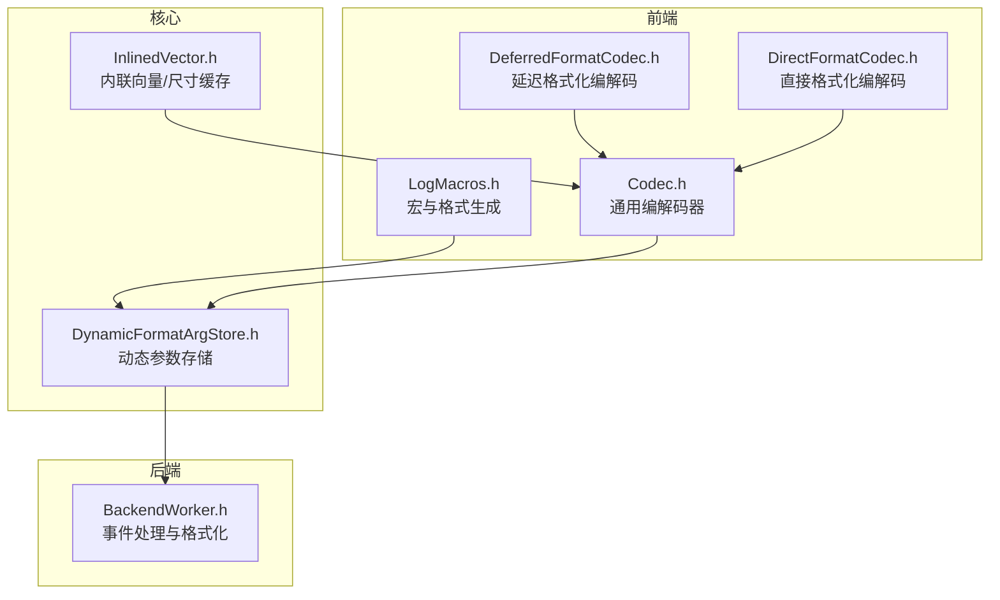
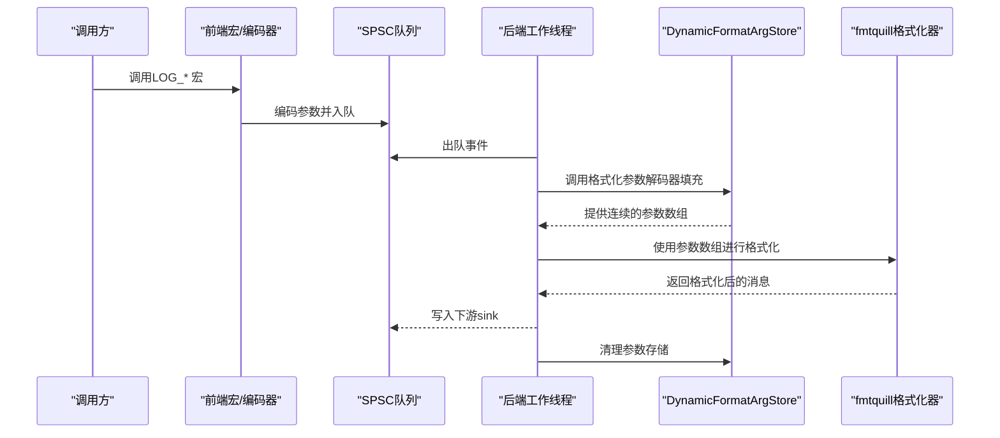
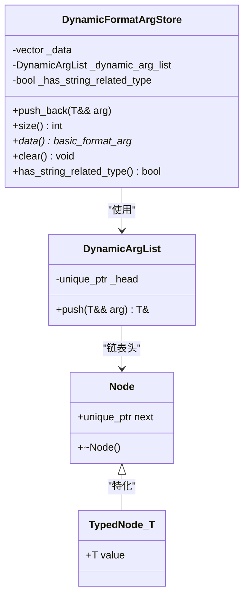
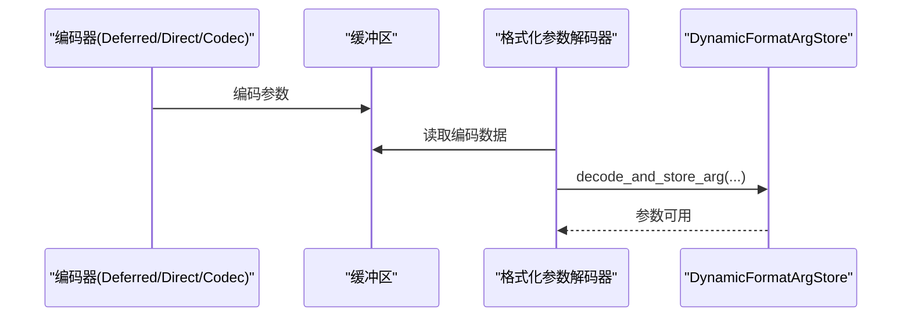
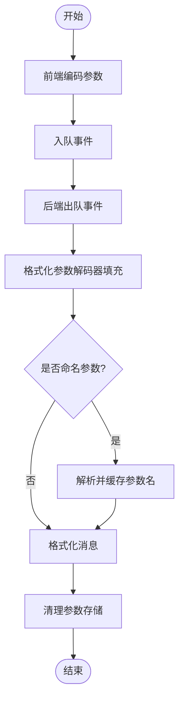
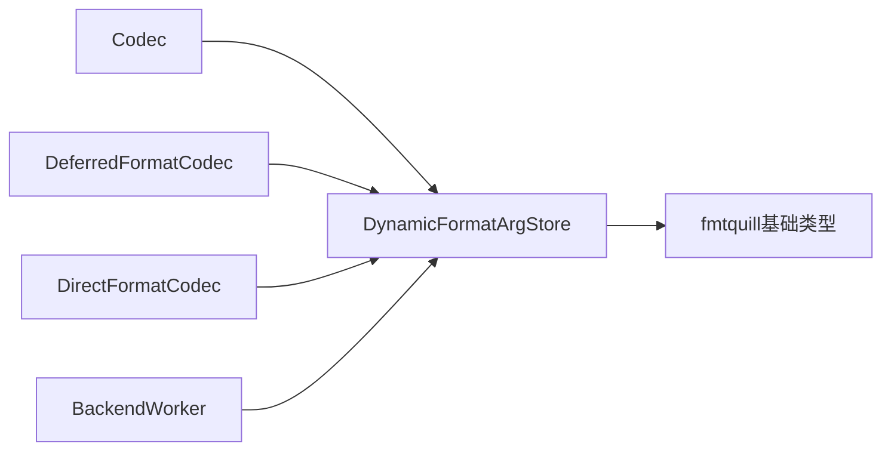

# 动态格式化参数存储

<cite>
**本文引用的文件**
- [DynamicFormatArgStore.h](file://include/quill/core/DynamicFormatArgStore.h)
- [DynamicFormatArgStoreTest.cpp](file://test/unit_tests/DynamicFormatArgStoreTest.cpp)
- [Codec.h](file://include/quill/core/Codec.h)
- [DeferredFormatCodec.h](file://include/quill/DeferredFormatCodec.h)
- [DirectFormatCodec.h](file://include/quill/DirectFormatCodec.h)
- [InlinedVector.h](file://include/quill/core/InlinedVector.h)
- [BackendWorker.h](file://include/quill/backend/BackendWorker.h)
- [LogMacros.h](file://include/quill/LogMacros.h)
</cite>

## 目录
1. [简介](#简介)
2. [项目结构](#项目结构)
3. [核心组件](#核心组件)
4. [架构总览](#架构总览)
5. [详细组件分析](#详细组件分析)
6. [依赖关系分析](#依赖关系分析)
7. [性能考量](#性能考量)
8. [故障排查指南](#故障排查指南)
9. [结论](#结论)
10. [附录](#附录)

## 简介
本文件面向Quill的动态格式化参数存储系统（DynamicFormatArgStore），系统性阐述其设计目标、数据结构与内存布局、类型安全保证、访问模式优化，以及与编码器系统（DeferredFormatCodec、DirectFormatCodec、Codec）的协作关系。文档还提供使用示例与性能考量，包括内存分配策略与缓存优化技术，帮助读者在高并发、低延迟的日志场景中正确、高效地使用该组件。

## 项目结构
DynamicFormatArgStore位于核心层，是Quill前端将可变参数序列化到后端的关键桥梁之一。它与编码器系统协同工作，负责：
- 在运行时收集并存储不同类型的参数值；
- 维护连续的参数数组以供fmtquill格式化器使用；
- 对字符串相关类型进行特殊标记，以便后端按需处理；
- 提供清理接口，避免跨事件的内存泄漏。

图表来源
- [DynamicFormatArgStore.h:77-155](file://include/quill/core/DynamicFormatArgStore.h#L77-L155)
- [Codec.h:12-14](file://include/quill/core/Codec.h#L12-L14)
- [DeferredFormatCodec.h:90-223](file://include/quill/DeferredFormatCodec.h#L90-L223)
- [DirectFormatCodec.h:86-115](file://include/quill/DirectFormatCodec.h#L86-L115)
- [InlinedVector.h:167-172](file://include/quill/core/InlinedVector.h#L167-L172)
- [BackendWorker.h:685](file://include/quill/backend/BackendWorker.h#L685)

章节来源
- [DynamicFormatArgStore.h:77-155](file://include/quill/core/DynamicFormatArgStore.h#L77-L155)
- [Codec.h:12-14](file://include/quill/core/Codec.h#L12-L14)
- [DeferredFormatCodec.h:90-223](file://include/quill/DeferredFormatCodec.h#L90-L223)
- [DirectFormatCodec.h:86-115](file://include/quill/DirectFormatCodec.h#L86-L115)
- [InlinedVector.h:167-172](file://include/quill/core/InlinedVector.h#L167-L172)
- [BackendWorker.h:685](file://include/quill/backend/BackendWorker.h#L685)

## 核心组件
- DynamicFormatArgStore：在运行时收集参数，维护连续的basic_format_arg数组，并对字符串相关类型做特殊处理，支持clear重置。
- Codec/DeferredFormatCodec/DirectFormatCodec：负责将用户自定义类型或内置类型编码到缓冲区，并在后端解码回参数存储。
- InlinedVector/SizeCacheVector：轻量级内联向量，用于缓存字符串长度等条件计算结果，减少重复开销。
- BackendWorker：从队列读取事件，调用格式化函数，期间通过格式化参数解码器填充DynamicFormatArgStore。

章节来源
- [DynamicFormatArgStore.h:77-155](file://include/quill/core/DynamicFormatArgStore.h#L77-L155)
- [Codec.h:142-438](file://include/quill/core/Codec.h#L142-L438)
- [DeferredFormatCodec.h:90-223](file://include/quill/DeferredFormatCodec.h#L90-L223)
- [DirectFormatCodec.h:86-115](file://include/quill/DirectFormatCodec.h#L86-L115)
- [InlinedVector.h:35-172](file://include/quill/core/InlinedVector.h#L35-L172)
- [BackendWorker.h:685](file://include/quill/backend/BackendWorker.h#L685)

## 架构总览
DynamicFormatArgStore贯穿“前端编码—事件传输—后端解码—格式化输出”的完整链路。前端在日志宏展开时将参数写入SPSC队列；后端在处理线程中读取事件，调用格式化参数解码器将参数恢复到DynamicFormatArgStore，再交由fmtquill完成最终格式化。

图表来源
- [BackendWorker.h:685](file://include/quill/backend/BackendWorker.h#L685)
- [Codec.h:399-405](file://include/quill/core/Codec.h#L399-L405)
- [DynamicFormatArgStore.h:97-154](file://include/quill/core/DynamicFormatArgStore.h#L97-L154)

## 详细组件分析

### DynamicFormatArgStore 设计与实现
- 数据结构与内存布局
  - 连续存储：内部使用连续容器保存basic_format_arg，确保fmtquill格式化器能以O(1)随机访问参数。
  - 动态节点链表：对于无法直接放入basic_format_arg的类型（如某些字符串视图或自定义类型），通过链式节点存储，避免移动构造带来的额外成本。
  - 字符串类型标记：has_string_related_type用于快速判断是否包含字符串相关类型，便于后端路径选择。
- 类型安全与访问模式
  - push_back模板根据类型映射常量决定是否直接emplace或通过动态节点存储，保证类型安全。
  - 对字符串视图与字符串类型进行特殊处理，避免不必要的拷贝，优先使用string_view以降低内存分配。
- 生命周期管理
  - clear会清空连续参数数组、重建动态节点链表并重置字符串标记，确保事件间无状态污染。

图表来源
- [DynamicFormatArgStore.h:77-155](file://include/quill/core/DynamicFormatArgStore.h#L77-L155)
- [DynamicFormatArgStore.h:22-70](file://include/quill/core/DynamicFormatArgStore.h#L22-L70)

章节来源
- [DynamicFormatArgStore.h:77-155](file://include/quill/core/DynamicFormatArgStore.h#L77-L155)

### 与编码器系统的协作关系
- DeferredFormatCodec
  - 针对非平凡可复制类型，采用对齐放置new的方式在缓冲区原位构造对象，避免深拷贝；解码时从缓冲区取出对象并移交给DynamicFormatArgStore。
- DirectFormatCodec
  - 将对象格式化为字符串，再通过Codec<std::string>解码为string_view，最终push_back至DynamicFormatArgStore。
- Codec
  - 通用编解码器，支持基础类型、C风格字符串、std::string与std::string_view；对字符串类型解码后转换为fmtquill::string_view，避免额外分配。

图表来源
- [DeferredFormatCodec.h:177-180](file://include/quill/DeferredFormatCodec.h#L177-L180)
- [DirectFormatCodec.h:111-114](file://include/quill/DirectFormatCodec.h#L111-L114)
- [Codec.h:310-341](file://include/quill/core/Codec.h#L310-L341)

章节来源
- [DeferredFormatCodec.h:90-223](file://include/quill/DeferredFormatCodec.h#L90-L223)
- [DirectFormatCodec.h:86-115](file://include/quill/DirectFormatCodec.h#L86-L115)
- [Codec.h:142-438](file://include/quill/core/Codec.h#L142-L438)

### 参数提取、格式化与清理的完整生命周期
- 前端阶段
  - 日志宏展开生成格式字符串与参数列表，通过编解码器将参数编码到SPSC队列。
- 后端阶段
  - 后端工作线程从队列读取事件，调用格式化参数解码器填充DynamicFormatArgStore。
  - 若存在命名参数，后端解析并缓存参数名；否则直接格式化消息。
  - 完成格式化后，调用clear清理参数存储，准备下一次事件。
- 错误处理
  - 当遇到未注册编解码器的类型时，编译期静态断言提示用户添加Codec或使用其他方式。

图表来源
- [BackendWorker.h:685](file://include/quill/backend/BackendWorker.h#L685)
- [BackendWorker.h:752](file://include/quill/backend/BackendWorker.h#L752)

章节来源
- [BackendWorker.h:685](file://include/quill/backend/BackendWorker.h#L685)
- [BackendWorker.h:752](file://include/quill/backend/BackendWorker.h#L752)

### 使用示例
- 基础类型与字符串视图
  - 示例展示了整数、字符串视图与浮点数的组合使用，以及C风格字符串触发的动态分配行为。
- 自定义类型（延迟格式化）
  - 通过DeferredFormatCodec将复杂对象原位编码，后端直接从缓冲区构造对象，避免热路径上的字符串格式化。
- 自定义类型（直接格式化）
  - 通过DirectFormatCodec将对象格式化为字符串，再以string_view形式注入参数存储。

章节来源
- [DynamicFormatArgStoreTest.cpp:14-31](file://test/unit_tests/DynamicFormatArgStoreTest.cpp#L14-L31)
- [user_defined_types_logging_deferred_format.cpp:48-51](file://examples/user_defined_types_logging_deferred_format.cpp#L48-L51)
- [user_defined_types_logging_direct_format.cpp:50-53](file://examples/user_defined_types_logging_direct_format.cpp#L50-L53)

## 依赖关系分析
- DynamicFormatArgStore依赖fmtquill的基础类型与格式上下文，确保参数数组的连续性与类型映射。
- 编码器系统依赖DynamicFormatArgStore提供的push_back接口，将解码得到的参数写入存储。
- BackendWorker在处理事件时调用格式化参数解码器，解码完成后立即clear，避免跨事件状态残留。

图表来源
- [DynamicFormatArgStore.h:81](file://include/quill/core/DynamicFormatArgStore.h#L81)
- [Codec.h:12](file://include/quill/core/Codec.h#L12)
- [DeferredFormatCodec.h:11](file://include/quill/DeferredFormatCodec.h#L11)
- [DirectFormatCodec.h:12](file://include/quill/DirectFormatCodec.h#L12)
- [BackendWorker.h:685](file://include/quill/backend/BackendWorker.h#L685)

章节来源
- [DynamicFormatArgStore.h:81](file://include/quill/core/DynamicFormatArgStore.h#L81)
- [Codec.h:12](file://include/quill/core/Codec.h#L12)
- [DeferredFormatCodec.h:11](file://include/quill/DeferredFormatCodec.h#L11)
- [DirectFormatCodec.h:12](file://include/quill/DirectFormatCodec.h#L12)
- [BackendWorker.h:685](file://include/quill/backend/BackendWorker.h#L685)

## 性能考量
- 内存分配策略
  - 字符串视图优先：对string_view与cstring类型，通过string_view避免动态分配，降低内存压力。
  - 延迟格式化：DeferredFormatCodec对自定义类型采用原位构造，避免热路径上的字符串格式化开销。
  - 直接格式化：DirectFormatCodec将对象格式化为字符串，适合需要稳定字符串表示的场景。
- 缓存优化
  - SizeCacheVector（基于InlinedVector<uint32_t, 12>）用于缓存字符串长度等条件计算，减少重复strlen等操作，容量设计贴近缓存行大小，提升局部性。
- 访问模式优化
  - 连续参数数组：fmtquill格式化器要求连续访问，DynamicFormatArgStore保证参数数组连续，避免额外拷贝。
  - 动态节点链表：仅对无法直接放入连续数组的类型使用，减少链表遍历成本。
- 生命周期管理
  - clear在事件处理完成后调用，确保参数存储被重置，避免跨事件的内存泄漏与状态污染。

章节来源
- [InlinedVector.h:167-172](file://include/quill/core/InlinedVector.h#L167-L172)
- [DynamicFormatArgStore.h:147-154](file://include/quill/core/DynamicFormatArgStore.h#L147-L154)
- [DeferredFormatCodec.h:96-133](file://include/quill/DeferredFormatCodec.h#L96-L133)
- [DirectFormatCodec.h:89-104](file://include/quill/DirectFormatCodec.h#L89-L104)

## 故障排查指南
- 编译错误：未找到编解码器
  - 现象：编译期静态断言提示缺少Codec。
  - 处理：为自定义类型提供Codec或使用DeferredFormatCodec/DirectFormatCodec；若为STL类型，请确认已包含相应头文件。
- 运行时异常：索引越界
  - 现象：InlinedVector在访问元素时抛出越界异常。
  - 处理：检查push_back与operator[]的配对使用，确保索引范围合法。
- 内存泄漏或状态污染
  - 现象：后续事件格式化出现异常参数。
  - 处理：确认BackendWorker在事件处理完成后调用clear，避免跨事件状态残留。

章节来源
- [Codec.h:60-86](file://include/quill/core/Codec.h#L60-L86)
- [InlinedVector.h:114-119](file://include/quill/core/InlinedVector.h#L114-L119)
- [BackendWorker.h:752](file://include/quill/backend/BackendWorker.h#L752)

## 结论
DynamicFormatArgStore通过“连续参数数组+动态节点链表”的混合存储策略，在保证类型安全与访问效率的同时，兼顾了字符串相关类型的特殊处理与内存分配优化。配合DeferredFormatCodec、DirectFormatCodec与Codec的编解码体系，以及SizeCacheVector的缓存优化，Quill实现了在高并发、低延迟场景下的高性能日志记录能力。合理使用该组件并遵循生命周期管理规范，可在不牺牲性能的前提下灵活扩展日志参数类型。

## 附录
- 关键API参考
  - push_back：添加参数，自动区分字符串类型与普通类型。
  - data/size：提供连续参数数组与数量，供fmtquill格式化器使用。
  - clear：清理参数存储，准备下一次事件。
- 相关示例
  - 基础类型与字符串视图示例：参见单元测试。
  - 自定义类型延迟/直接格式化示例：参见示例工程。

章节来源
- [DynamicFormatArgStore.h:97-154](file://include/quill/core/DynamicFormatArgStore.h#L97-L154)
- [DynamicFormatArgStoreTest.cpp:14-31](file://test/unit_tests/DynamicFormatArgStoreTest.cpp#L14-L31)
- [user_defined_types_logging_deferred_format.cpp:48-51](file://examples/user_defined_types_logging_deferred_format.cpp#L48-L51)
- [user_defined_types_logging_direct_format.cpp:50-53](file://examples/user_defined_types_logging_direct_format.cpp#L50-L53)