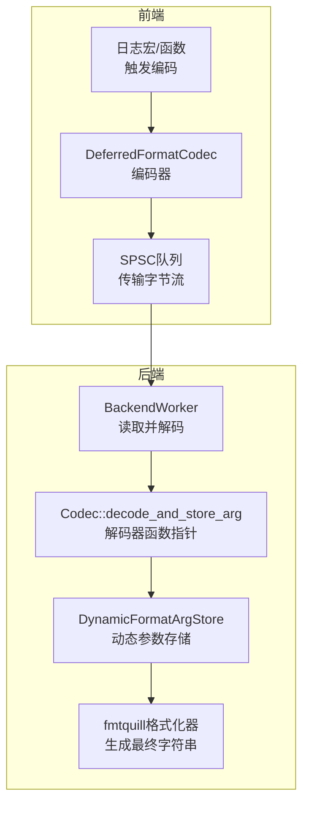
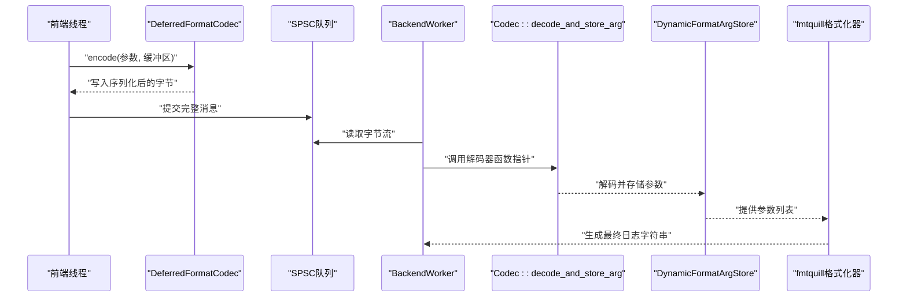
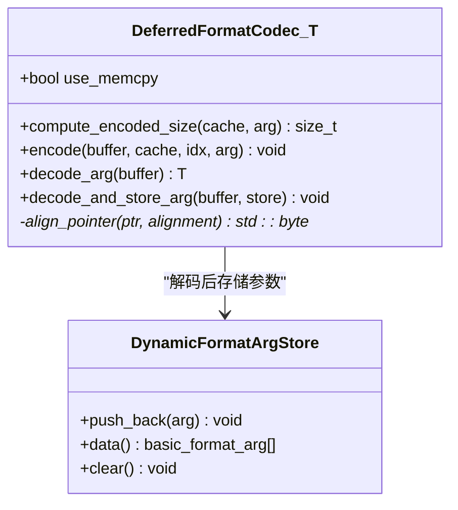
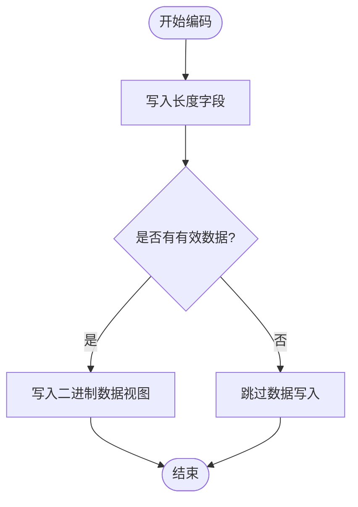
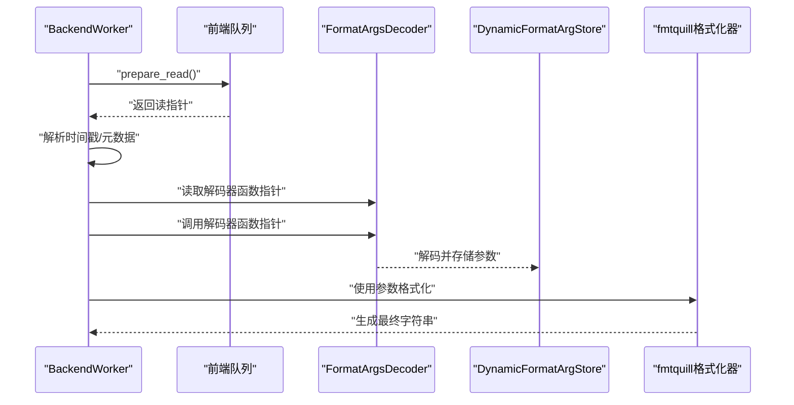
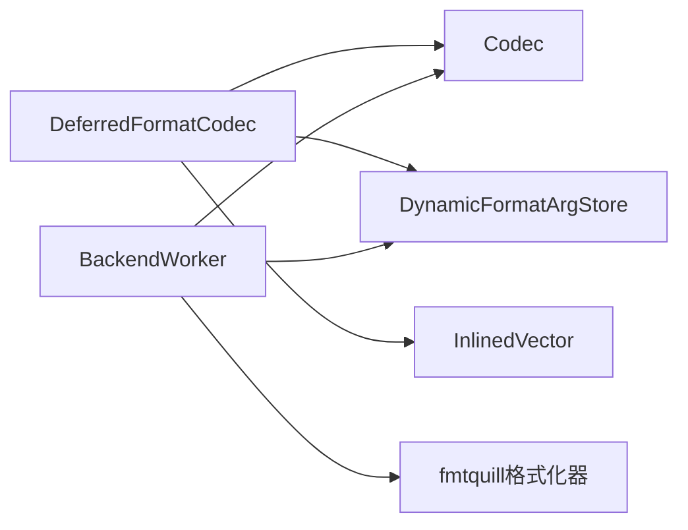

# 延迟格式化编码器

<cite>
**本文档引用的文件**
- [DeferredFormatCodec.h](file://include/quill/DeferredFormatCodec.h)
- [BinaryDataDeferredFormatCodec.h](file://include/quill/BinaryDataDeferredFormatCodec.h)
- [Codec.h](file://include/quill/core/Codec.h)
- [DynamicFormatArgStore.h](file://include/quill/core/DynamicFormatArgStore.h)
- [BackendWorker.h](file://include/quill/backend/BackendWorker.h)
- [user_defined_types_logging_deferred_format.cpp](file://examples/user_defined_types_logging_deferred_format.cpp)
- [UserDefinedTypeLoggingDeferredFormatTest.cpp](file://test/integration_tests/UserDefinedTypeLoggingDeferredFormatTest.cpp)
- [InlinedVector.h](file://include/quill/core/InlinedVector.h)
</cite>

## 目录
1. [简介](#简介)
2. [项目结构](#项目结构)
3. [核心组件](#核心组件)
4. [架构总览](#架构总览)
5. [详细组件分析](#详细组件分析)
6. [依赖关系分析](#依赖关系分析)
7. [性能考量](#性能考量)
8. [故障排查指南](#故障排查指南)
9. [结论](#结论)
10. [附录](#附录)

## 简介
本文件系统性阐述Quill的延迟格式化编码器（DeferredFormatCodec）的设计与实现，重点说明其如何将“昂贵”的格式化过程从热点路径（前端线程）推迟至后端线程，从而显著降低前端线程的计算开销。文档覆盖以下主题：
- 延迟格式化的消息编码机制：参数序列化、格式化信息存储、后端解码流程
- 用户自定义类型的延迟支持：类型擦除技术、格式化器注册机制
- 使用场景与性能分析：内存使用优化、格式化延迟的影响因素
- 代码级架构图与数据流图，帮助读者快速把握设计要点

## 项目结构
围绕延迟格式化的核心文件组织如下：
- 编码器层：DeferredFormatCodec、BinaryDataDeferredFormatCodec
- 核心编解码框架：Codec模板族
- 后端解码与格式化：BackendWorker中的解码器函数指针与动态参数存储
- 辅助工具：DynamicFormatArgStore、InlinedVector（大小缓存）

图表来源
- [DeferredFormatCodec.h:90-180](file://include/quill/DeferredFormatCodec.h#L90-L180)
- [Codec.h:144-342](file://include/quill/core/Codec.h#L144-L342)
- [BackendWorker.h:670-755](file://include/quill/backend/BackendWorker.h#L670-L755)
- [DynamicFormatArgStore.h:77-157](file://include/quill/core/DynamicFormatArgStore.h#L77-L157)

章节来源
- [DeferredFormatCodec.h:29-88](file://include/quill/DeferredFormatCodec.h#L29-L88)
- [Codec.h:144-342](file://include/quill/core/Codec.h#L144-L342)

## 核心组件
- DeferredFormatCodec<T>：针对用户自定义类型的延迟格式化编码器，支持“可直接拷贝”与“构造放置”两种路径，确保在前端线程只做最少工作。
- BinaryDataDeferredFormatCodec<T>：针对二进制数据的延迟格式化编码器，通过非拥有型视图包装原始二进制数据，避免复制大块数据。
- Codec模板族：通用编解码框架，提供基础类型、字符串等的编码/解码能力，并为自定义类型提供缺失编解码器时的错误提示。
- BackendWorker：后端线程负责从队列中取出字节流，调用解码器函数指针，将参数解码并写入DynamicFormatArgStore，再由fmtquill格式化器完成最终输出。
- DynamicFormatArgStore：动态参数存储容器，用于承载解码后的参数，支持字符串、自定义类型等。

章节来源
- [DeferredFormatCodec.h:90-180](file://include/quill/DeferredFormatCodec.h#L90-L180)
- [BinaryDataDeferredFormatCodec.h:121-163](file://include/quill/BinaryDataDeferredFormatCodec.h#L121-L163)
- [Codec.h:144-342](file://include/quill/core/Codec.h#L144-L342)
- [BackendWorker.h:670-755](file://include/quill/backend/BackendWorker.h#L670-L755)
- [DynamicFormatArgStore.h:77-157](file://include/quill/core/DynamicFormatArgStore.h#L77-L157)

## 架构总览
延迟格式化的关键在于“编码在前端、解码在后端”。前端仅将对象或二进制数据按最小代价写入队列；后端在安全上下文中进行格式化，避免阻塞生产者。

图表来源
- [DeferredFormatCodec.h:109-133](file://include/quill/DeferredFormatCodec.h#L109-L133)
- [BackendWorker.h:670-755](file://include/quill/backend/BackendWorker.h#L670-L755)
- [Codec.h:390-406](file://include/quill/core/Codec.h#L390-L406)

## 详细组件分析

### DeferredFormatCodec 设计与实现
DeferredFormatCodec通过两个分支优化前端路径：
- 可直接拷贝路径（use_memcpy为真）：使用std::memcpy将对象原样复制到缓冲区，零格式化开销。
- 需要构造路径（use_memcpy为假）：在对齐边界上使用placement new构造对象，避免拷贝构造的额外成本。

关键点：
- 计算编码大小：对于可直接拷贝类型返回sizeof(T)，否则返回sizeof(T)+对齐修正字节。
- 编码阶段：根据类型特性选择memcpy或placement new；移动语义优先于拷贝。
- 解码阶段：在对齐边界上读取对象，必要时调用析构以避免资源泄漏。
- 参数存储：通过decode_and_store_arg将解码后的参数推入DynamicFormatArgStore，供后端格式化器使用。

图表来源
- [DeferredFormatCodec.h:90-180](file://include/quill/DeferredFormatCodec.h#L90-L180)
- [DynamicFormatArgStore.h:77-157](file://include/quill/core/DynamicFormatArgStore.h#L77-L157)

章节来源
- [DeferredFormatCodec.h:96-180](file://include/quill/DeferredFormatCodec.h#L96-L180)

### BinaryDataDeferredFormatCodec 设计与实现
该编码器专为二进制数据设计，采用“非拥有型视图”策略：
- 编码：先写入长度字段，再写入二进制数据指针与长度组合的视图（不复制数据）。
- 解码：从缓冲区读取长度，构造BinaryData视图，交由后端格式化器自行解析或转为十六进制等人类可读形式。

图表来源
- [BinaryDataDeferredFormatCodec.h:127-146](file://include/quill/BinaryDataDeferredFormatCodec.h#L127-L146)

章节来源
- [BinaryDataDeferredFormatCodec.h:121-163](file://include/quill/BinaryDataDeferredFormatCodec.h#L121-L163)

### 后端解码与格式化流程
BackendWorker在后端线程中负责：
- 从前端队列读取完整消息
- 提取格式化器函数指针
- 调用decode_and_store_arg解码参数并写入DynamicFormatArgStore
- 使用fmtquill格式化器生成最终日志文本

图表来源
- [BackendWorker.h:515-755](file://include/quill/backend/BackendWorker.h#L515-L755)
- [Codec.h:390-406](file://include/quill/core/Codec.h#L390-L406)

章节来源
- [BackendWorker.h:515-755](file://include/quill/backend/BackendWorker.h#L515-L755)
- [Codec.h:390-406](file://include/quill/core/Codec.h#L390-L406)

### 用户自定义类型支持与类型擦除
- 类型擦除：通过Codec模板族的特化与静态断言，将具体类型擦除为统一的接口（compute_encoded_size/encode/decode_arg/decode_and_store_arg）。
- 注册机制：用户只需为自定义类型提供fmtquill::formatter与Codec<T>特化（通常继承自DeferredFormatCodec），即可无缝接入延迟格式化。
- 多态存储：DynamicFormatArgStore内部使用链表节点与类型擦除存储，保证不同类型的参数可以统一管理。

章节来源
- [Codec.h:144-342](file://include/quill/core/Codec.h#L144-L342)
- [DynamicFormatArgStore.h:20-71](file://include/quill/core/DynamicFormatArgStore.h#L20-L71)

## 依赖关系分析
- DeferredFormatCodec依赖：
  - Codec接口族：统一编码/解码契约
  - DynamicFormatArgStore：参数存储
  - InlinedVector：大小缓存（SizeCacheVector）
- BackendWorker依赖：
  - Codec::decode_and_store_arg函数指针
  - DynamicFormatArgStore
  - fmtquill格式化器

图表来源
- [DeferredFormatCodec.h:90-180](file://include/quill/DeferredFormatCodec.h#L90-L180)
- [Codec.h:144-342](file://include/quill/core/Codec.h#L144-L342)
- [BackendWorker.h:670-755](file://include/quill/backend/BackendWorker.h#L670-L755)
- [InlinedVector.h:167-173](file://include/quill/core/InlinedVector.h#L167-L173)

章节来源
- [DeferredFormatCodec.h:90-180](file://include/quill/DeferredFormatCodec.h#L90-L180)
- [Codec.h:144-342](file://include/quill/core/Codec.h#L144-L342)
- [BackendWorker.h:670-755](file://include/quill/backend/BackendWorker.h#L670-L755)
- [InlinedVector.h:167-173](file://include/quill/core/InlinedVector.h#L167-L173)

## 性能考量
- 前端路径优化
  - 可直接拷贝类型：使用memcpy，零格式化开销
  - 非可直接拷贝类型：placement new + 对齐，避免拷贝构造
- 内存使用优化
  - BinaryDataDeferredFormatCodec避免复制大块二进制数据，仅传递视图
  - SizeCacheVector容量适中（12项），占用不超过缓存行，减少缓存抖动
- 后端格式化延迟
  - 将昂贵的字符串拼接与格式化移至后端线程，降低前端CPU占用
  - 通过队列批量处理与软/硬阈值控制，平衡吞吐与延迟
- 影响因素
  - 日志频率与消息大小：高频小消息适合延迟格式化；超大消息需谨慎
  - 类型复杂度：包含大量成员或深嵌套容器的类型，后端格式化成本更高
  - 队列拥塞：后端处理滞后会导致前端队列增长，需合理配置后端选项

章节来源
- [DeferredFormatCodec.h:96-107](file://include/quill/DeferredFormatCodec.h#L96-L107)
- [BinaryDataDeferredFormatCodec.h:127-130](file://include/quill/BinaryDataDeferredFormatCodec.h#L127-L130)
- [InlinedVector.h:167-173](file://include/quill/core/InlinedVector.h#L167-L173)
- [BackendWorker.h:318-388](file://include/quill/backend/BackendWorker.h#L318-L388)

## 故障排查指南
- 缺失编解码器
  - 现象：编译期静态断言失败，提示未找到类型对应的Codec
  - 处理：为自定义类型提供Codec<T>特化（如继承DeferredFormatCodec），并确保提供fmtquill::formatter
- 类型不可拷贝/不可构造
  - 现象：编译失败或运行时异常
  - 处理：确保类型满足move/copy构造要求；对于仅move类型，确保后端能正确移动构造
- 二进制数据格式化问题
  - 现象：后端输出为乱码或无法解析
  - 处理：在BinaryData的formatter中实现正确的解析逻辑（如十六进制转换）
- 内存与对齐
  - 现象：解码后对象状态异常
  - 处理：确认对象在对齐边界上的构造/析构正确；避免共享资源被并发修改

章节来源
- [Codec.h:59-86](file://include/quill/core/Codec.h#L59-L86)
- [DeferredFormatCodec.h:135-175](file://include/quill/DeferredFormatCodec.h#L135-L175)
- [BinaryDataDeferredFormatCodec.h:148-162](file://include/quill/BinaryDataDeferredFormatCodec.h#L148-L162)

## 结论
DeferredFormatCodec通过“前端轻量编码、后端重格式化”的设计，显著降低了前端线程的计算负担，同时保持了对用户自定义类型的灵活支持。结合BinaryDataDeferredFormatCodec与DynamicFormatArgStore，Quill实现了高效、可扩展的日志系统。在高吞吐场景下，延迟格式化是提升整体性能的关键手段之一。

## 附录
- 示例与测试参考
  - 用户自定义类型延迟格式化示例：[user_defined_types_logging_deferred_format.cpp:17-71](file://examples/user_defined_types_logging_deferred_format.cpp#L17-L71)
  - 集成测试覆盖多种STL容器与类型组合：[UserDefinedTypeLoggingDeferredFormatTest.cpp:389-1197](file://test/integration_tests/UserDefinedTypeLoggingDeferredFormatTest.cpp#L389-L1197)

章节来源
- [user_defined_types_logging_deferred_format.cpp:17-71](file://examples/user_defined_types_logging_deferred_format.cpp#L17-L71)
- [UserDefinedTypeLoggingDeferredFormatTest.cpp:389-1197](file://test/integration_tests/UserDefinedTypeLoggingDeferredFormatTest.cpp#L389-L1197)