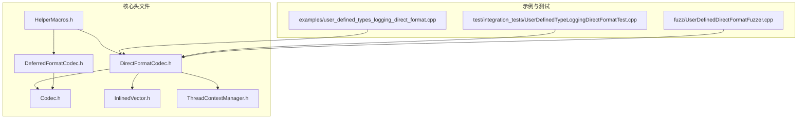
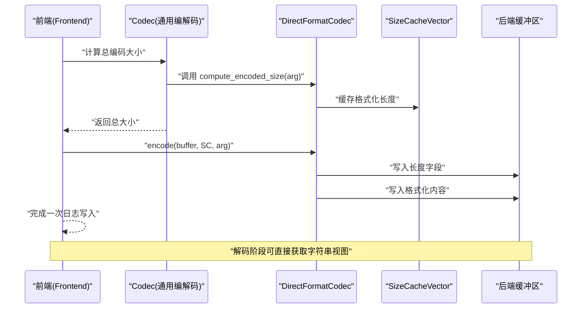
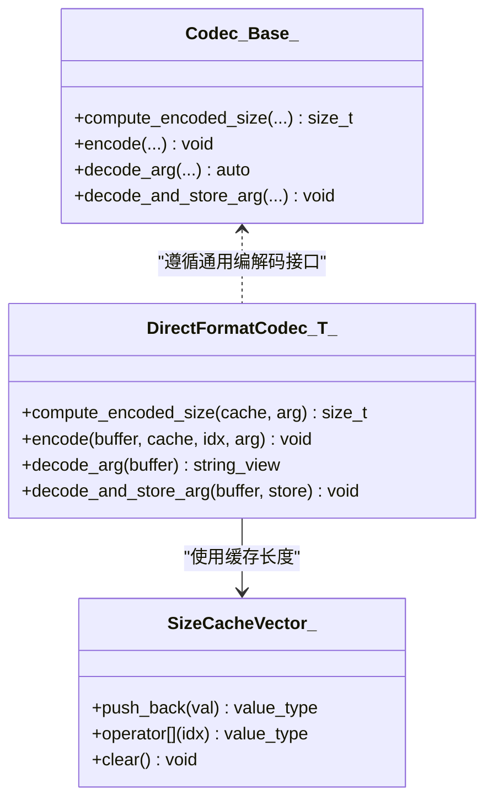
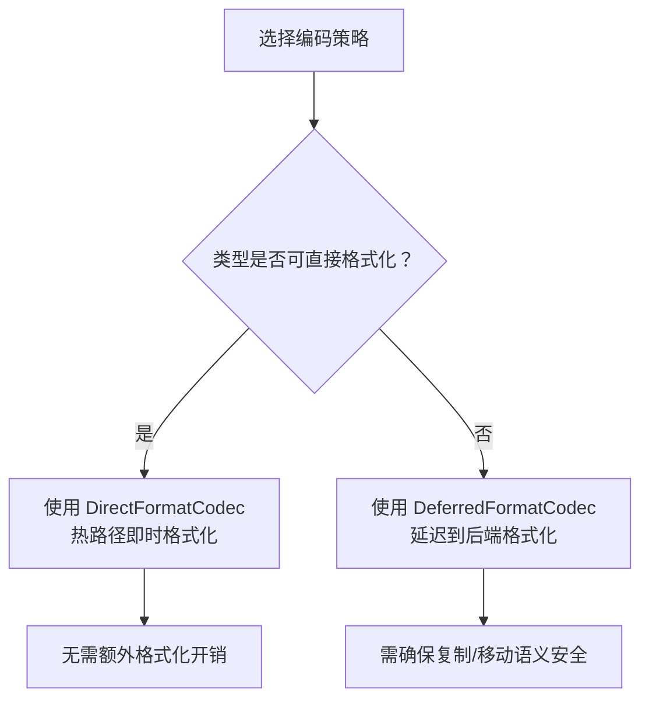
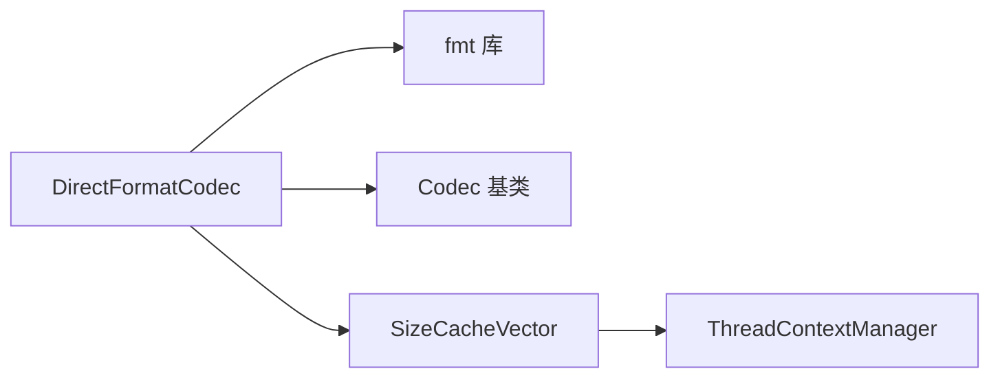

# 直接格式化编码器

<cite>
**本文引用的文件**
- [DirectFormatCodec.h](file://include/quill/DirectFormatCodec.h)
- [DeferredFormatCodec.h](file://include/quill/DeferredFormatCodec.h)
- [Codec.h](file://include/quill/core/Codec.h)
- [InlinedVector.h](file://include/quill/core/InlinedVector.h)
- [ThreadContextManager.h](file://include/quill/core/ThreadContextManager.h)
- [HelperMacros.h](file://include/quill/HelperMacros.h)
- [user_defined_types_logging_direct_format.cpp](file://examples/user_defined_types_logging_direct_format.cpp)
- [UserDefinedTypeLoggingDirectFormatTest.cpp](file://test/integration_tests/UserDefinedTypeLoggingDirectFormatTest.cpp)
- [UserDefinedDirectFormatFuzzer.cpp](file://fuzz/UserDefinedDirectFormatFuzzer.cpp)
</cite>

## 目录
1. [简介](#简介)
2. [项目结构](#项目结构)
3. [核心组件](#核心组件)
4. [架构总览](#架构总览)
5. [详细组件分析](#详细组件分析)
6. [依赖关系分析](#依赖关系分析)
7. [性能考量](#性能考量)
8. [故障排查指南](#故障排查指南)
9. [结论](#结论)
10. [附录](#附录)

## 简介
本文件围绕 Quill 的“直接格式化编码器”（DirectFormatCodec）展开，系统性阐述其工作原理、实现机制与性能优势，并与“延迟格式化编码器”（DeferredFormatCodec）进行对比。DirectFormatCodec 在日志记录的热路径上即时将用户自定义类型通过 fmt 格式化为字符串并写入缓冲区，避免额外的延迟处理开销；同时，它支持用户自定义类型的复制/移动语义与内存分配策略，覆盖从简单标量到复杂容器的广泛场景。

## 项目结构
DirectFormatCodec 位于 include/quill 目录下，配合核心编解码框架、线程上下文缓存与示例/测试用例共同构成完整的日志编码链路。

**图表来源**
- [DirectFormatCodec.h:1-117](file://include/quill/DirectFormatCodec.h#L1-L117)
- [DeferredFormatCodec.h:1-229](file://include/quill/DeferredFormatCodec.h#L1-L229)
- [Codec.h:1-438](file://include/quill/core/Codec.h#L1-L438)
- [InlinedVector.h:166-172](file://include/quill/core/InlinedVector.h#L166-L172)
- [ThreadContextManager.h:133-137](file://include/quill/core/ThreadContextManager.h#L133-L137)
- [HelperMacros.h:36-45](file://include/quill/HelperMacros.h#L36-L45)
- [user_defined_types_logging_direct_format.cpp:1-102](file://examples/user_defined_types_logging_direct_format.cpp#L1-L102)
- [UserDefinedTypeLoggingDirectFormatTest.cpp:1-506](file://test/integration_tests/UserDefinedTypeLoggingDirectFormatTest.cpp#L1-L506)
- [UserDefinedDirectFormatFuzzer.cpp:1-628](file://fuzz/UserDefinedDirectFormatFuzzer.cpp#L1-L628)

**章节来源**
- [DirectFormatCodec.h:1-117](file://include/quill/DirectFormatCodec.h#L1-L117)
- [Codec.h:143-342](file://include/quill/core/Codec.h#L143-L342)
- [InlinedVector.h:166-172](file://include/quill/core/InlinedVector.h#L166-L172)
- [ThreadContextManager.h:133-137](file://include/quill/core/ThreadContextManager.h#L133-L137)
- [HelperMacros.h:36-45](file://include/quill/HelperMacros.h#L36-L45)

## 核心组件
- DirectFormatCodec：模板结构体，提供在热路径上直接将任意类型格式化为字符串并序列化的接口。关键方法包括：
  - 计算编码大小：compute_encoded_size
  - 编码写入：encode
  - 解码读取：decode_arg
  - 存储到动态参数存储：decode_and_store_arg
- DeferredFormatCodec：模板结构体，提供“延迟格式化”的编码路径，适合非平凡拷贝类型或需要跨线程安全传递的场景。
- Codec 基类：通用编解码框架，定义了内置类型与字符串类型的编码/解码行为，并提供多参数批量编码/解码工具。
- SizeCacheVector：线程本地的内联向量，用于缓存条件计算结果（如字符串长度），减少重复计算。
- ThreadContextManager：管理每个线程的上下文，包含 SizeCacheVector 实例，供编码阶段复用。
- HelperMacros：提供便捷宏，快速为类型绑定 DirectFormatCodec 或 DeferredFormatCodec。

**章节来源**
- [DirectFormatCodec.h:86-115](file://include/quill/DirectFormatCodec.h#L86-L115)
- [DeferredFormatCodec.h:90-181](file://include/quill/DeferredFormatCodec.h#L90-L181)
- [Codec.h:143-342](file://include/quill/core/Codec.h#L143-L342)
- [InlinedVector.h:166-172](file://include/quill/core/InlinedVector.h#L166-L172)
- [ThreadContextManager.h:133-137](file://include/quill/core/ThreadContextManager.h#L133-L137)
- [HelperMacros.h:36-45](file://include/quill/HelperMacros.h#L36-L45)

## 架构总览
DirectFormatCodec 的工作流分为两步：
1) 预计算阶段：在进入热路径前，调用 compute_encoded_size 计算目标对象格式化后的字节长度，并将长度缓存至 SizeCacheVector。
2) 写入阶段：在热路径中，根据缓存长度一次性分配空间，调用 encode 将长度字段与格式化内容写入缓冲区；解码阶段通过 decode_arg 或 decode_and_store_arg 提取字符串视图并交由后续格式化管线处理。

**图表来源**
- [DirectFormatCodec.h:89-104](file://include/quill/DirectFormatCodec.h#L89-L104)
- [Codec.h:354-388](file://include/quill/core/Codec.h#L354-L388)
- [InlinedVector.h:166-172](file://include/quill/core/InlinedVector.h#L166-L172)

## 详细组件分析

### DirectFormatCodec 类与方法族
DirectFormatCodec 通过模板特化为任意类型提供“直接格式化”能力，核心点如下：
- compute_encoded_size：先计算格式化长度，再将长度压入 SizeCacheVector，便于后续 encode 使用。
- encode：从缓存索引取出长度，先写入长度字段，再以格式化输出到缓冲区，最后推进指针。
- decode_arg：将已写入的字符串视图从缓冲区读出，供后续格式化使用。
- decode_and_store_arg：将字符串视图推入 DynamicFormatArgStore，避免额外的动态分配。

**图表来源**
- [DirectFormatCodec.h:86-115](file://include/quill/DirectFormatCodec.h#L86-L115)
- [Codec.h:143-342](file://include/quill/core/Codec.h#L143-L342)
- [InlinedVector.h:166-172](file://include/quill/core/InlinedVector.h#L166-L172)

**章节来源**
- [DirectFormatCodec.h:86-115](file://include/quill/DirectFormatCodec.h#L86-L115)

### 与 DeferredFormatCodec 的对比
- 直接格式化（DirectFormatCodec）
  - 在热路径上即时格式化为字符串，避免额外的延迟处理。
  - 适用于 fmt 可直接格式化或可通过 ostream_formatter 的类型。
  - 对用户自定义类型要求：必须存在对应的 fmt::formatter 特化。
- 延迟格式化（DeferredFormatCodec）
  - 在热路径上仅拷贝/构造对象，延迟到后端线程再格式化。
  - 支持非平凡拷贝类型，但需满足复制/移动构造约束。
  - 适合复杂对象或需要跨线程安全传递的场景。

**图表来源**
- [DirectFormatCodec.h:22-41](file://include/quill/DirectFormatCodec.h#L22-L41)
- [DeferredFormatCodec.h:29-88](file://include/quill/DeferredFormatCodec.h#L29-L88)

**章节来源**
- [DirectFormatCodec.h:22-41](file://include/quill/DirectFormatCodec.h#L22-L41)
- [DeferredFormatCodec.h:29-88](file://include/quill/DeferredFormatCodec.h#L29-L88)

### 用户自定义类型支持与内存分配策略
- 复制/移动语义
  - DirectFormatCodec 不涉及对象的复制/移动，仅依赖 fmt::formatter 的格式化输出。
  - 若需延迟格式化，DeferredFormatCodec 会依据类型是否可平凡拷贝采用 memcpy 或 placement new，并在解码时进行移动/拷贝。
- 内存分配
  - DirectFormatCodec 写入的是“长度 + 字符串内容”，字符串视图来自 fmt 输出，不产生额外堆分配。
  - DeferredFormatCodec 在热路径可能进行堆内存布局（placement new + 对齐），并在解码时构造副本。
- 容器与复合类型
  - DirectFormatCodec 通过 fmt 对容器类型进行格式化，因此需要为容器元素类型提供合适的 formatter。
  - 测试与示例覆盖了数组、向量、映射、集合等标准容器的直接格式化。

**章节来源**
- [DirectFormatCodec.h:89-114](file://include/quill/DirectFormatCodec.h#L89-L114)
- [DeferredFormatCodec.h:90-181](file://include/quill/DeferredFormatCodec.h#L90-L181)
- [UserDefinedTypeLoggingDirectFormatTest.cpp:213-506](file://test/integration_tests/UserDefinedTypeLoggingDirectFormatTest.cpp#L213-L506)

### 使用示例与最佳实践
- 示例程序展示了两类用户自定义类型的直接格式化：基于 fmt::formatter 的自定义类型与基于 ostream_formatter 的类型。
- 最佳实践
  - 为自定义类型提供稳定的 fmt::formatter 特化，确保格式化结果可预期且高效。
  - 对于大型对象或长字符串，优先考虑 DirectFormatCodec 以避免延迟格式化的额外成本。
  - 使用 QUILL_LOGGABLE_DIRECT_FORMAT 宏简化类型绑定，减少样板代码。
  - 在高并发场景下，确保自定义类型的格式化过程无竞争与异常抛出。

**章节来源**
- [user_defined_types_logging_direct_format.cpp:14-102](file://examples/user_defined_types_logging_direct_format.cpp#L14-L102)
- [HelperMacros.h:36-45](file://include/quill/HelperMacros.h#L36-L45)

## 依赖关系分析
DirectFormatCodec 的依赖关系清晰，主要依赖于：
- fmt 库：提供格式化能力与字符串长度计算。
- Codec 基类：提供通用接口与多参数编码/解码工具。
- SizeCacheVector：线程本地缓存，减少重复计算。
- ThreadContextManager：提供线程上下文与缓存访问入口。

**图表来源**
- [DirectFormatCodec.h:9-13](file://include/quill/DirectFormatCodec.h#L9-L13)
- [Codec.h:143-342](file://include/quill/core/Codec.h#L143-L342)
- [InlinedVector.h:166-172](file://include/quill/core/InlinedVector.h#L166-L172)
- [ThreadContextManager.h:133-137](file://include/quill/core/ThreadContextManager.h#L133-L137)

**章节来源**
- [DirectFormatCodec.h:9-13](file://include/quill/DirectFormatCodec.h#L9-L13)
- [Codec.h:143-342](file://include/quill/core/Codec.h#L143-L342)
- [InlinedVector.h:166-172](file://include/quill/core/InlinedVector.h#L166-L172)
- [ThreadContextManager.h:133-137](file://include/quill/core/ThreadContextManager.h#L133-L137)

## 性能考量
- 直接格式化的优势
  - 热路径上即时格式化，避免额外的延迟处理与跨线程传递成本。
  - 通过 SizeCacheVector 缓存长度，减少重复计算。
  - 写入流程为“长度字段 + 字符串内容”，内存布局简单，利于流水线处理。
- 与延迟格式化的权衡
  - 延迟格式化在热路径上仅拷贝/构造对象，适合复杂类型或需要跨线程安全传递的场景，但会引入额外的格式化开销。
- 典型适用场景
  - 高频日志、低延迟要求、对象可稳定格式化。
  - 大型对象或长字符串，直接格式化可避免多次拷贝与格式化。

[本节为通用性能讨论，不直接分析具体文件]

## 故障排查指南
- 编译期错误：缺少 Codec
  - 现象：编译报错提示缺少 Codec。
  - 排查：确认已为自定义类型提供 DirectFormatCodec 或 DeferredFormatCodec 特化，或使用 QUILL_LOGGABLE_* 宏。
- 运行期异常：格式化失败
  - 现象：日志记录抛出异常。
  - 排查：检查 fmt::formatter 是否健壮，避免在格式化过程中抛出异常；对于可能抛出异常的格式化逻辑，建议在外部预处理。
- 性能退化
  - 现象：日志吞吐下降。
  - 排查：确认对象是否过大导致格式化耗时增加；考虑拆分日志或减少不必要的字段；检查是否频繁触发容器格式化。

**章节来源**
- [Codec.h:59-86](file://include/quill/core/Codec.h#L59-L86)
- [UserDefinedTypeLoggingDirectFormatTest.cpp:240-254](file://test/integration_tests/UserDefinedTypeLoggingDirectFormatTest.cpp#L240-L254)

## 结论
DirectFormatCodec 通过在热路径上直接格式化用户自定义类型，显著降低了日志记录的延迟与开销，特别适用于高频、低延迟场景。结合 SizeCacheVector 与线程上下文缓存，其实现兼顾了性能与可维护性。对于需要延迟格式化或跨线程安全传递的复杂类型，可选择 DeferredFormatCodec。实践中，建议为自定义类型提供稳定的 fmt::formatter，并遵循宏与示例的最佳实践，以获得最优的性能与可靠性。

[本节为总结性内容，不直接分析具体文件]

## 附录
- 快速参考
  - 直接格式化：为类型提供 fmt::formatter 并绑定 DirectFormatCodec。
  - 延迟格式化：为类型提供 fmt::ostream_formatter 并绑定 DeferredFormatCodec。
  - 宏：QUILL_LOGGABLE_DIRECT_FORMAT、QUILL_LOGGABLE_DEFERRED_FORMAT。
- 相关示例与测试
  - 示例程序展示两种类型的直接格式化用法。
  - 集成测试覆盖多种容器与枚举类型的直接格式化。
  - 模糊测试覆盖大对象、空对象、非对齐对象与超长字符串等边界情况。

**章节来源**
- [user_defined_types_logging_direct_format.cpp:14-102](file://examples/user_defined_types_logging_direct_format.cpp#L14-L102)
- [UserDefinedTypeLoggingDirectFormatTest.cpp:213-506](file://test/integration_tests/UserDefinedTypeLoggingDirectFormatTest.cpp#L213-L506)
- [UserDefinedDirectFormatFuzzer.cpp:1-628](file://fuzz/UserDefinedDirectFormatFuzzer.cpp#L1-L628)